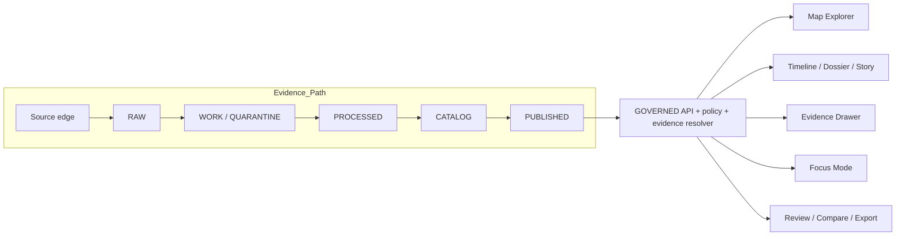

<!-- [KFM_META_BLOCK_V2]
doc_id: kfm://doc/TBD-VERIFY-root-readme-uuid
title: Kansas Frontier Matrix
type: standard
version: v1
status: review
owners: @bartytime4life
created: TBD-VERIFY-first-commit-date
updated: 2026-04-02
policy_label: public
related: [./.github/, ./.github/README.md, ./.github/CODEOWNERS, ./.github/PULL_REQUEST_TEMPLATE.md, ./.github/workflows/README.md, ./apps/, ./brand/, ./configs/, ./contracts/, ./data/, ./docs/, ./examples/, ./infra/, ./migrations/, ./packages/, ./policy/, ./schemas/, ./scripts/, ./tests/, ./tools/, ./CODE_OF_CONDUCT.md, ./CONTRIBUTING.md, ./LICENSE, ./SECURITY.md]
tags: [kfm, root-doc, governance, evidence-first, map-first, trust-system]
notes: [Root README revision candidate grounded in March 2026 KFM doctrine, corroborating repo-grounded sprint material, and the current public main tree; private GitHub settings, non-public branches, workflow rulesets, deployment manifests, and runtime proof objects still require direct verification.]
[/KFM_META_BLOCK_V2] -->

# Kansas Frontier Matrix

Governed, evidence-first, map-first, time-aware repository for Kansas spatial evidence, publication, and trust-visible product surfaces.

> **Status:** Experimental  
> **Owners:** `@bartytime4life`  
>        
> **Quick jumps:** [Scope](#scope) · [Repo fit](#repo-fit) · [Accepted inputs](#accepted-inputs) · [Exclusions](#exclusions) · [Directory tree](#directory-tree) · [Quickstart](#quickstart) · [Usage](#usage) · [Diagram](#diagram) · [Operating tables](#operating-tables) · [Task list](#task-list-and-definition-of-done) · [FAQ](#faq) · [Appendix](#appendix)  
> **Repo fit:** `/README.md` · control plane [./.github/](./.github/) · doctrine/docs [./docs/](./docs/) · contract/policy [./contracts/](./contracts/), [./schemas/](./schemas/), [./policy/](./policy/) · runtime/data [./apps/](./apps/), [./packages/](./packages/), [./data/](./data/)  
> **Accepted here:** root identity, public-tree navigation, doctrine summary, verification-first inspection path  
> **Not here:** full schema catalogs, full policy text, route-by-route runtime claims, or unstaged implementation certainty

> [!IMPORTANT]
> This README is intentionally verification-first. It is grounded in the March 2026 KFM doctrine plus the current public `main` tree. It does **not** claim direct verification of non-public branches, GitHub rulesets, required checks, environment approvals, deployment manifests, or runtime proof objects.

| At a glance | Working rule |
|---|---|
| System identity | Governed Kansas spatial evidence system |
| Value unit | The inspectable claim, not merely the map, graph, dashboard, or fluent answer |
| Truth path | `Source edge → RAW → WORK / QUARANTINE → PROCESSED → CATALOG → PUBLISHED` |
| Catalog closure | Outward STAC / DCAT / PROV triplet plus release linkage |
| Trust boundary | Governed APIs plus evidence resolution, not direct client access to stores |
| Runtime rule | Cite or abstain |
| Surface rule | One map-first, time-aware shell with trust-visible evidence and negative states |
| 3D rule | 2D default; 3D is conditional and burden-bearing |

## Scope

This README covers the **repo-root identity and operating posture** of Kansas Frontier Matrix.

Use it for:

- root-level mission, boundaries, and non-negotiable invariants
- verification-first navigation across the public repo root
- a source-bounded map of what exists now on public `main`
- the minimum path from clone to trustworthy local inspection

Do not use it for:

- full contract text that belongs in [`./contracts/`](./contracts/) or [`./schemas/`](./schemas/)
- full policy rules that belong in [`./policy/`](./policy/)
- lane-by-lane source depth that belongs in [`./docs/`](./docs/) and the domain/source atlas
- runtime certainty that has not been re-verified on the exact branch or commit under review

### Evidence posture used in this README

| Label | Meaning in this README |
|---|---|
| **CONFIRMED** | Supported by attached March 2026 KFM doctrine, corroborating repo-grounded sprint material, or the current public `main` tree. |
| **INFERRED** | Strongly implied by repeated doctrine or by current public path names, but not directly proven as detailed implementation behavior. |
| **PROPOSED** | A recommended realization or starter pattern that fits doctrine but is not yet proven as current implementation reality. |
| **UNKNOWN** | Not supported strongly enough to state as a live repo, runtime, or platform fact. |
| **NEEDS VERIFICATION** | A path, owner, ruleset, or behavior that should be checked on the exact working branch before merge. |

> [!NOTE]
> Public `main` is a helpful current baseline, but the branch you are changing outranks it. Treat local branch evidence as the decisive source when it is available.

[Back to top](#kansas-frontier-matrix)

## Repo fit

**Path:** `/README.md`  
**Role:** Root orientation document and verification-first operating index for Kansas Frontier Matrix.

This file should do three jobs well:

1. explain what KFM is and is not
2. mark the verification boundary honestly
3. route readers into the correct repo surfaces without duplicating their owning docs

### Current public root snapshot

| Surface family | Current public state | Why it matters |
|---|---|---|
| Root governance docs | `README.md`, `CONTRIBUTING.md`, `SECURITY.md`, `CODE_OF_CONDUCT.md`, `LICENSE` | Public onboarding, conduct, disclosure, and legal posture are visible at repo root. |
| Control plane | `/.github/`, `/.github/CODEOWNERS`, `/.github/PULL_REQUEST_TEMPLATE.md`, `/.github/README.md`, `/.github/workflows/README.md` | Review routing, templates, ownership, and workflow documentation already exist as repo surfaces. |
| Core system directories | `/apps/`, `/contracts/`, `/data/`, `/docs/`, `/infra/`, `/packages/`, `/policy/`, `/schemas/`, `/tests/`, `/tools/`, `/scripts/` | The public tree already exposes the main code, contract, policy, and verification lanes. |
| Supporting directories | `/brand/`, `/configs/`, `/examples/`, `/migrations/` | The public tree shows additional identity, configuration, example, and evolution surfaces. |

### Working interpretation of the root

| Group | Paths | Status | Working interpretation |
|---|---|---|---|
| Root gatehouse | [`./README.md`](./README.md), [`./.github/`](./.github/) | **CONFIRMED** | Repo landing, review routing, ownership, contributor intake, and automation scaffolding begin here. |
| Public governance neighbors | [`./CONTRIBUTING.md`](./CONTRIBUTING.md), [`./SECURITY.md`](./SECURITY.md), [`./CODE_OF_CONDUCT.md`](./CODE_OF_CONDUCT.md), [`./LICENSE`](./LICENSE) | **CONFIRMED** | Public contributor, disclosure, conduct, and licensing surfaces are checked in. |
| Contract and policy surfaces | [`./contracts/`](./contracts/), [`./schemas/`](./schemas/), [`./policy/`](./policy/) | **CONFIRMED** | KFM expects machine-checkable structure and deny-by-default policy to live here. |
| Runtime and shared code | [`./apps/`](./apps/), [`./packages/`](./packages/), [`./infra/`](./infra/) | **CONFIRMED** path / **INFERRED** detailed role | Public tree confirms these surfaces exist; exact route, service, and deployment depth still need branch-level inspection. |
| Evidence, docs, and verification | [`./data/`](./data/), [`./docs/`](./docs/), [`./examples/`](./examples/), [`./tests/`](./tests/) | **CONFIRMED** path / mixed depth | Public tree confirms evidence, documentation, example, and test surfaces, but not full implementation maturity. |
| Support and evolution | [`./brand/`](./brand/), [`./configs/`](./configs/), [`./migrations/`](./migrations/), [`./scripts/`](./scripts/), [`./tools/`](./tools/) | **CONFIRMED** path / **INFERRED** detailed role | Public tree confirms these supporting surfaces exist; exact contents and operational burden still need direct inspection. |

> [!TIP]
> This README should point outward. When deeper detail becomes stable enough to own itself, link to the owning file or directory instead of re-explaining it here.

[Back to top](#kansas-frontier-matrix)

## Accepted inputs

At repo root, this README should summarize the **input families KFM is built to admit and govern**, while pushing detailed schemas, source registers, and connector rules into their owning docs.

| Input family | What belongs in KFM | Expected governed lane | Where detailed treatment should live |
|---|---|---|---|
| Historical tabular data | census extracts, registries, land records, archival tables | `RAW/` → `WORK/` → `PROCESSED/` | `./data/`, `./contracts/`, `./schemas/`, `./docs/` |
| Vector geodata | boundaries, parcels, routes, service areas, sites | `RAW/` → `PROCESSED/` | `./data/`, `./contracts/`, `./schemas/`, `./docs/` |
| Raster geodata | land cover, DEMs, climate grids, scenes, hazard rasters | `RAW/` → `PROCESSED/` → `CATALOG/` | `./data/`, `./contracts/`, `./schemas/`, `./docs/` |
| Documentary evidence | archives, newspapers, oral histories, scans, narrative support material | source intake → evidence flow | `./docs/`, `./data/`, evidence-related packages |
| Metadata and lineage | STAC, DCAT, PROV, manifests, receipts, run records | `CATALOG/` and proof surfaces | `./contracts/`, `./schemas/`, `./data/`, `./docs/` |
| Derived analytical artifacts | summaries, projections, tiles, exports, scenes, indexes | derived lanes only, always release-linked | `./packages/`, `./apps/`, `./infra/` |
| Validation and review artifacts | QA reports, fixtures, review notes, correction notices | `WORK/`, `tests/`, docs/runbooks | `./tests/`, `./docs/`, `./data/receipts/` |
| Policy-safe civic and environmental context | hydrology, hazards, land use, infrastructure context | governed domain lanes | `./docs/`, `./data/`, `./policy/` |

## Exclusions

These do **not** belong in the governed publication path, and this root README should not present them as acceptable shortcuts.

| Exclusion | Why it stays out | Where it goes instead |
|---|---|---|
| Secrets, tokens, credentials | Never commit secrets into the repo or artifact path. | Secret manager / environment provisioning |
| Direct client-to-store or client-to-model paths | Breaks the trust membrane. | Governed APIs and protected adapters |
| Publishable artifacts without receipts, digests, or catalog closure | Cannot be audited, reproduced, or corrected safely. | `WORK/QUARANTINE` until complete |
| Rights-unclear or sensitivity-unresolved material | Ambiguity must fail closed. | Quarantine, metadata-only handling, redaction, generalized public-safe derivatives, or delayed publication |
| Uncited Story or Focus claims | Violates cite-or-abstain. | Draft or internal review states only |
| Fine-grained restricted location exposure | Risks policy leakage and unsafe precision. | Restricted lanes or generalized public-safe outputs |
| Docs that imply live behavior without proof | Weakens trust through overclaiming. | Keep the statement `INFERRED`, `PROPOSED`, `UNKNOWN`, or `NEEDS VERIFICATION` |
| Detached reviewer or admin tools that sever geography, time, or evidence context | Breaks the governed shell model. | Review and stewardship as shell variation, not a separate truth system |

[Back to top](#kansas-frontier-matrix)

## Directory tree

### Current public root snapshot

```text
<repo-root>/
├── .github/
├── apps/
├── brand/
├── configs/
├── contracts/
├── data/
├── docs/
├── examples/
├── infra/
├── migrations/
├── packages/
├── policy/
├── schemas/
├── scripts/
├── tests/
├── tools/
├── CODE_OF_CONDUCT.md
├── CONTRIBUTING.md
├── LICENSE
├── README.md
└── SECURITY.md
```

### Top-level role map

| Path target | Status | Working role |
|---|---|---|
| `./.github/` | **CONFIRMED** | Governance boundary, templates, ownership, and workflow-facing control plane |
| `./apps/` | **CONFIRMED** path / **INFERRED** detailed role | Deployable user- and operator-facing runtime surfaces |
| `./brand/` | **CONFIRMED** path / **INFERRED** detailed role | Visual identity, brand, or presentation assets |
| `./configs/` | **CONFIRMED** path / **INFERRED** detailed role | Shared configuration and environment-shaping surfaces |
| `./contracts/` | **CONFIRMED** | Contract documentation and shared object families |
| `./data/` | **CONFIRMED** path / **INFERRED** detailed role | Lifecycle zones, registries, catalog artifacts, and receipts |
| `./docs/` | **CONFIRMED** path / **INFERRED** detailed role | Architecture, governance, ADRs, runbooks, and lane depth |
| `./examples/` | **CONFIRMED** path / **INFERRED** detailed role | Thin slices, demonstrations, and sample proof flows |
| `./infra/` | **CONFIRMED** path / **INFERRED** detailed role | Environment wiring, delivery surfaces, and operational scaffolding |
| `./migrations/` | **CONFIRMED** path / **INFERRED** detailed role | State evolution and migration-bearing change surfaces |
| `./packages/` | **CONFIRMED** path / **INFERRED** detailed role | Shared reusable libraries and domain-support packages |
| `./policy/` | **CONFIRMED** | Deny-by-default policy doctrine, bundles, fixtures, and decision grammar |
| `./schemas/` | **CONFIRMED** | Schema documentation and validation-facing object definitions |
| `./scripts/` | **CONFIRMED** path / **INFERRED** detailed role | Supporting entrypoints, glue code, and helper commands |
| `./tests/` | **CONFIRMED** | Test-facing structure, fixtures, and verification surfaces |
| `./tools/` | **CONFIRMED** | Validation tooling and helper utilities |
| Root docs | **CONFIRMED** | Public-facing governance, onboarding, conduct, and licensing surfaces |

### What remains `UNKNOWN` or `NEEDS VERIFICATION`

- exact non-public branch deltas from public `main`
- GitHub rulesets, required checks, environment approvals, and private-reporting settings
- actual checked-in workflow YAML inventory beyond what public `main` exposes now
- real JSON Schema inventory versus README references only
- mounted policy bundle inventory and policy test harnesses
- runnable test entrypoints, merge-blocking checks, and emitted proof objects
- exact route trees, DTO inventories, and runtime negative-path coverage
- deployment overlays, observability joins, and release proof packs

[Back to top](#kansas-frontier-matrix)

## Quickstart

The safest root-level quickstart is **verification-first**, not assumption-first.

```bash
# identify the exact revision you are reviewing
git rev-parse HEAD 2>/dev/null || echo "Not inside a Git checkout"

# inspect the root and near-root directory shape
find . -maxdepth 2 -type d 2>/dev/null | sort | sed -n '1,200p'

# inspect likely control-plane and documentation surfaces
find .github apps brand configs contracts data docs examples infra migrations packages policy schemas scripts tests tools \
  -maxdepth 3 -type f 2>/dev/null | sort | sed -n '1,360p'

# inspect root governance neighbors if present
ls -la .github 2>/dev/null || true
ls -la .github/workflows 2>/dev/null || true
ls -la CONTRIBUTING.md SECURITY.md CODE_OF_CONDUCT.md LICENSE 2>/dev/null || true

# inspect ownership and workflow-facing docs first
sed -n '1,160p' .github/CODEOWNERS 2>/dev/null || true
sed -n '1,220p' .github/PULL_REQUEST_TEMPLATE.md 2>/dev/null || true
sed -n '1,240p' .github/workflows/README.md 2>/dev/null || true

# pressure-test trust, contract, and evidence vocabulary
grep -RIn "EvidenceBundle\|EvidenceRef\|RuntimeResponseEnvelope\|DecisionEnvelope\|CorrectionNotice\|truth membrane\|cite-or-abstain" \
  docs contracts schemas policy tests tools scripts apps packages 2>/dev/null | sed -n '1,240p'

# pressure-test shell and trust-visible surface vocabulary
grep -RIn "Map Explorer\|Evidence Drawer\|Focus Mode\|Story\|Dossier\|Review\|Stewardship" \
  docs apps packages ui 2>/dev/null | sed -n '1,240p'
```

> [!TIP]
> Run the inspection loop above before upgrading any statement from `INFERRED`, `PROPOSED`, `UNKNOWN`, or `NEEDS VERIFICATION` to `CONFIRMED`.

<details>
<summary>Illustrative local-first contributor flow (use only where analogous targets actually exist)</summary>

```bash
make bootstrap
make validate-schemas
make test
make dev-up
make sample-ingest SOURCE=example_fixture
make catalog-validate
```

</details>

### Before documenting branch behavior as fact

1. Confirm what exists on the branch you are actually changing.
2. Reconcile that branch against the current public `main` snapshot.
3. Confirm which checks actually block merges.
4. Confirm which contracts, schemas, policies, and validations are enforced today.
5. Confirm that at least one end-to-end governed slice exists from source admission to evidence-backed public read.
6. Confirm whether public surfaces expose evidence, freshness, and policy-visible negative states rather than hiding them.
7. Confirm whether rollback, correction, and supersession are visible and evidenced rather than merely implied.

[Back to top](#kansas-frontier-matrix)

## Usage

### What KFM is

KFM is:

- a governed spatial evidence system
- a provenance-preserving publication program
- a map-first, time-aware shell over place, chronology, evidence, review state, and policy state
- a coordinated family of product surfaces that remain behind one trust membrane
- a Kansas-first operating environment for history, land, hydrology, hazards, environment, services, and public knowledge
- a platform that can grow into bounded retrieval and AI assistance **without** weakening the evidence contract

### What KFM is not

KFM is **not**:

- a free-form chatbot
- a dashboard-only GIS stack
- a direct browser-to-database mapping surface
- a graph-first or vector-first authority engine
- a publication path that can skip rights, provenance, review, or release evidence
- a spectacle-first 3D product
- a detached admin console that severs review from geography, time, and evidence

### Non-negotiable invariants

| Invariant | Status | Practical meaning | What must never happen |
|---|---|---|---|
| Truth path | **CONFIRMED doctrine** | Data moves through `Source edge → RAW → WORK / QUARANTINE → PROCESSED → CATALOG → PUBLISHED`. | Ad hoc publication from notebooks, transient transforms, or unpublished working states |
| Catalog closure | **CONFIRMED doctrine** | Outward publication closes through STAC / DCAT / PROV plus release linkage. | Public claims with broken lineage or missing release references |
| Trust membrane | **CONFIRMED doctrine** | Public and role-limited access crosses governed APIs, policy, and evidence resolution. | Direct UI or external access to canonical stores, raw buckets, or model runtimes |
| Cite-or-abstain | **CONFIRMED doctrine** | Story, map, dossier, export, and Focus claims resolve to evidence or abstain. | Plausible uncited output presented as fact |
| Fail-closed posture | **CONFIRMED doctrine** | Unclear rights, unresolved sensitivity, or broken evidence blocks release. | “Best effort” publication under ambiguity |
| Deterministic identity | **CONFIRMED / INFERRED doctrine** | Comparable inputs and the same spec produce stable identities and digests. | Unstable versions or ambiguous lineage |
| Evidence as interface | **CONFIRMED doctrine** | Evidence must be operationally reachable through resolvable support objects. | Provenance trapped in notes that surfaces cannot reach |
| Promotion as governed state change | **CONFIRMED doctrine** | Promotion emits typed artifacts, decision records, release scope, and correction posture. | Deployment or file movement treated as publication proof |
| Documentation as production surface | **CONFIRMED doctrine** | Behavior-significant changes update docs, contracts, examples, diagrams, and runbooks together. | Silent drift between behavior and procedure |
| 2D default, 3D conditional | **CONFIRMED doctrine** | 2D remains the default operating surface; 3D carries extra governance burden. | Spectacle-first 3D becoming a parallel truth surface |

### Product surfaces and operating promise

| Surface | Status | What it should answer |
|---|---|---|
| Map Explorer | **CONFIRMED doctrine** | **Where?** |
| Timeline | **CONFIRMED doctrine** | **When?** |
| Dossier | **CONFIRMED doctrine / PROPOSED packaging** | **What matters about this place, feature, or subject?** |
| Story | **CONFIRMED doctrine** | **Why does the evidence matter?** |
| Evidence Drawer | **CONFIRMED doctrine** | **What does a visible claim rest on?** |
| Focus Mode | **CONFIRMED doctrine** | Natural-language investigation **without bypassing evidence or policy** |
| Review / Stewardship | **CONFIRMED doctrine / PROPOSED packaging** | Inspect, approve, restrict, correct, supersede, or withdraw within the same governed shell |
| Compare / Export | **CONFIRMED doctrine / PROPOSED packaging** | Compare release contexts and preview what leaves the system without dropping trust cues |
| Controlled 3D | **CONFIRMED doctrine / conditional mode** | Add burden-bearing 3D context without breaking the same evidence flow |

### Kansas operating lanes at a glance

| Lane | Typical grain | Why it matters early |
|---|---|---|
| Historical and demographic | county-version, county-year, event-time | Establishes time-aware joins and stable place/time scaffolding |
| Hydrology and water | station-time, watershed, raster | Strong public-safe thin-slice candidate |
| Hazards and environment | event-time, county, polygon, raster | High public value with visible governance needs |
| Land and cadastral history | parcel, tract, legal description, PLSS section | Supports land-tenure, settlement, and archival interpretation |
| Archives and heritage | document, place, event-time | Critical for story publication and evidence depth |
| Services and infrastructure context | place, corridor, service area | Useful early, but precision and rights posture must stay explicit |

### Preferred first governed slice

A strong first slice remains **hydrology-first**:

1. one released hydrology dataset family with stable source descriptors
2. one map + timeline surface that opens directly into an Evidence Drawer
3. one public-safe dossier or detail path
4. one Focus path that either cites correctly or abstains
5. one visible correction or supersession drill

[Back to top](#kansas-frontier-matrix)

## Diagram


```mermaid
flowchart LR
    subgraph Evidence_Path
      A[Source edge] --> B[RAW]
      B --> C[WORK / QUARANTINE]
      C --> D[PROCESSED]
      D --> E[CATALOG]
      E --> F[PUBLISHED]
    end

    F --> G[GOVERNED API + policy + evidence resolver]
    G --> H[Map Explorer]
    G --> I[Timeline / Dossier / Story]
    G --> J[Evidence Drawer]
    G --> K[Focus Mode]
    G --> L[Review / Compare / Export]
```

This is the root promise of the repo: every public or role-limited surface remains downstream of acquisition, policy checks, provenance capture, review state, release state, and evidence resolution.

[Back to top](#kansas-frontier-matrix)

## Operating tables

### Truth path and promotion contract

Promotion is not a file copy. It is a governed state transition.

| Gate | Minimum proof | Fail-closed behavior |
|---|---|---|
| Identity and versioning | stable IDs, deterministic digests, immutable version references | Block on missing, duplicated, or unstable identity |
| Rights and license | rights snapshot, attribution basis, reuse posture | Hold or quarantine when rights are unclear |
| Sensitivity and generalization | policy label, obligations, generalization or redaction plan | Restrict, generalize, or block publication |
| Schema and QA | schema validity, spatial/time/unit checks, domain QC | Route to `WORK/QUARANTINE` on blocking failure |
| Catalog closure | linked catalog, lineage, release linkage | Block if metadata and lineage do not resolve coherently |
| Receipt and review | run receipt, decision/review evidence, release inventory | Block if required review or proof objects are absent |
| Release and correction readiness | release manifest / proof pack, rollback and correction hooks | Block promotion until public-safe scope is inspectable and reversible |

### Canonical vs rebuildable rule

| Class | Examples |
|---|---|
| **Canonical / authoritative** | `RAW`, `PROCESSED`, catalog-closure objects, review/decision artifacts, release manifests, correction notices |
| **Rebuildable / derived** | tiles, search indexes, graphs, caches, summaries, scenes, denormalized projections, embeddings |

### Current public control-plane snapshot

| Surface | Current public state | Why it matters |
|---|---|---|
| `./.github/CODEOWNERS` | Present with broad root and major-directory coverage | Review routing exists as a checked-in public surface |
| `./.github/PULL_REQUEST_TEMPLATE.md` | Present | Contributor and review checklist surface exists |
| `./.github/workflows/README.md` | Present | Workflow directory is documented and intentionally scoped |
| `./.github/workflows/*.yml` / `*.yaml` | Not visible on current public `main` listing | Current checked-in workflow inventory still needs branch-level verification |
| Public Actions history | Mentioned by `./.github/workflows/README.md` as historical signal | Useful for reconstruction, not a substitute for current inventory |

### Documented next move *(starter-shape only)*

> [!NOTE]
> The file and folder names below are **starter-state** and should not overrule observed repo reality. If the active branch already uses different paths, keep the doctrine and update the file map.

| Priority | Starter shape | Why it matters | Status |
|---|---|---|---|
| 1 | contract core + schema lattice under `contracts/`, `schemas/`, and fixture/test surfaces | Turns doctrine into machine-checkable structure | **PROPOSED** |
| 2 | policy registries, reason/obligation vocabularies, valid/invalid fixtures, CI gates | Makes deny-by-default behavior executable and reviewable | **PROPOSED** |
| 3 | one hydrology thin slice with descriptors, receipts, catalog closure, release manifest, and evidence bundle | Proves one governed slice end to end on a public-safe lane | **PROPOSED** |
| 4 | trust-visible shell payloads and state examples for Evidence Drawer, Focus outcomes, and correction cues | Prevents UI surfaces from bluffing when trust is partial | **PROPOSED** |

[Back to top](#kansas-frontier-matrix)

## Task list and definition of done

Use this as the minimum repo-root gate list for substantial work.

- [ ] active working branch is compared against the current public `main` root snapshot
- [ ] `README.md`, `.github/CODEOWNERS`, `.github/PULL_REQUEST_TEMPLATE.md`, `.github/workflows/README.md`, `CONTRIBUTING.md`, `SECURITY.md`, `CODE_OF_CONDUCT.md`, and `LICENSE` are all rechecked before merge
- [ ] current public path existence and claimed branch-local contents are not conflated
- [ ] first-wave contract files exist as real machine-checkable schemas, not only README references
- [ ] valid and invalid fixtures validate in CI
- [ ] deny-by-default policy bundles and policy tests exist for integrity, provenance, rights/sensitivity, and runtime negative states
- [ ] any actual workflow YAML inventory is reconciled with `.github/workflows/README.md`
- [ ] at least one merge-blocking workflow enforces contract, policy, and fixture validation
- [ ] release candidates emit validation, catalog-closure, manifest, and proof-pack artifacts
- [ ] `EvidenceBundle` drill-through works from consequential visible claims
- [ ] `RuntimeResponseEnvelope`-style negative-state grammar is visible and testable
- [ ] Map Explorer, Timeline, Dossier, Story, Focus, Review, Compare, and Export surfaces expose trust-visible state where relevant
- [ ] Focus either cites with audit linkage or abstains cleanly
- [ ] derived freshness, correction, supersession, withdrawal, and stale-visible states remain explicit
- [ ] behavior-significant changes update docs, contracts, examples, diagrams, and runbooks in the same governed stream
- [ ] one hydrology-first slice proves descriptor → ingest → validation → dataset version → catalog closure → decision/review → release → map/read surface → correction
- [ ] one rollback or correction drill is rehearsed and leaves evidence-bearing output behind

[Back to top](#kansas-frontier-matrix)

## FAQ

### Why is this README stricter than a normal project landing page?

Because KFM is designed as a **trust system**, not just a code host or presentation layer. Provenance, policy, review, and evidence resolution are runtime obligations, not decoration.

### Why keep saying `CONFIRMED`, `INFERRED`, `PROPOSED`, `UNKNOWN`, or `NEEDS VERIFICATION`?

Because repo size and documentation density do not prove runtime governance. KFM’s own doctrine treats overclaiming as a trust failure.

### Why mention public `main` separately from the branch being edited?

Because public `main` is observable now, while a local or unpublished working branch may differ materially. Root docs should make that boundary obvious.

### Why are Evidence Bundles, catalogs, and receipts treated as first-class?

Because discoverability, reproducibility, review, and public trust depend on resolvable metadata and lineage, not just attractive maps or fluent answers.

### Why start with a narrow slice?

Because one fully governed slice proves the architecture honestly. Many half-governed features only prove that governance was bypassed.

### Why is hydrology the preferred first slice?

Because the doctrine repeatedly treats hydrology as the cleanest **public-safe, place/time-rich, operationally legible** thin slice for proving the system end to end.

### Why is 2D the default operating surface?

Because 2D keeps geography, chronology, evidence, and state easier to govern. 3D is allowed only when it adds real explanatory value and still returns users to the same evidence flow.

### Why are some details still placeholders?

Because `doc_id` and original creation date are not derivable from the evidence opened here without a dedicated history pass, and private GitHub settings remain outside current public-tree visibility.

[Back to top](#kansas-frontier-matrix)

## Appendix

<details>
<summary>Open the root-doc verification appendix</summary>

### Working basis for this README revision

This README is aligned to the strongest March 2026 KFM authority layer, with added weight from the replacement-grade blueprint, canonical master reference, unified geospatial architecture manual, MapLibre shell/UI doctrine, domain/source atlas, and the current public `main` tree.

### Why placeholders remain in the meta block

The following values still require direct history verification before publication is final:

- `doc_id`
- `created`

### First verification targets after local checkout or richer connector access

- branch-local root tree and package/workspace inventory
- actual workflow YAML inventory, rulesets, required checks, and environment approvals
- schema directories, fixtures, and registry versions
- actual policy bundle inventory and policy test harnesses
- route inventory, DTO inventory, and runtime negative-path coverage
- `EvidenceBundle` resolver contracts and traces
- correction / rollback evidence and surface behavior

### Confirmed public root neighbors worth keeping linked

- [`./.github/README.md`](./.github/README.md)
- [`./.github/CODEOWNERS`](./.github/CODEOWNERS)
- [`./.github/PULL_REQUEST_TEMPLATE.md`](./.github/PULL_REQUEST_TEMPLATE.md)
- [`./.github/workflows/README.md`](./.github/workflows/README.md)
- [`./CONTRIBUTING.md`](./CONTRIBUTING.md)
- [`./SECURITY.md`](./SECURITY.md)
- [`./CODE_OF_CONDUCT.md`](./CODE_OF_CONDUCT.md)
- [`./LICENSE`](./LICENSE)

### Root README maintenance rule

Keep this file focused on:

- repo identity
- top-level navigation and boundaries
- non-negotiable invariants
- documented repo shape plus verification boundary
- the minimum governed quickstart
- root-level gates that help reviewers reject overclaiming early

Push deep schema catalogs, route trees, lane-by-lane source atlases, and environment-specific runbooks into their owning docs once those files are verified directly on the active branch.

[Back to top](#kansas-frontier-matrix)

</details>
