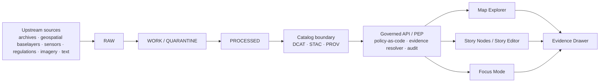
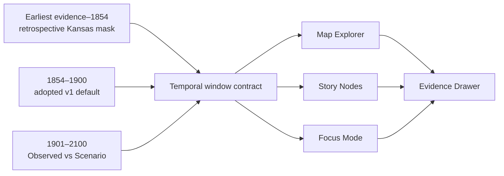

<!-- [KFM_META_BLOCK_V2]
doc_id: kfm://doc/df7426a0-4f44-4c3f-9d91-1d418f4fa4c5
title: Kansas Frontier Matrix (KFM) README
type: standard
version: v1
status: draft
owners: TBD; verify in .github/CODEOWNERS on target branch
created: 2026-03-06
updated: 2026-03-06
policy_label: public
related: [docs/, contracts/, data/, apps/, packages/, policy/, infra/, .github/]
tags: [kfm, readme, governance, evidence, maps, temporal-windows, archaeology, scenarios]
notes: [Refined to represent KFM as a declared multi-window system: earliest evidence–1854, adopted v1 window 1854–1900, and a design-ready 1901–2100 extension. Branch-specific implementation facts remain UNKNOWN until verified.]
[/KFM_META_BLOCK_V2] -->

<a id="top"></a>

# Kansas Frontier Matrix (KFM)
Governed, evidence-first infrastructure for exploring Kansas through place, time, narrative, and inspectable evidence.

<div align="center">

[](#impact)
[](#impact)
[](#impact)
[](#evidence--governance)
[](#evidence--governance)
[](#product-surfaces)

</div>

## Quick jump

- [Impact](#impact)
- [Scope](#scope)
- [Repo fit](#repo-fit)
- [Accepted inputs](#accepted-inputs)
- [Exclusions](#exclusions)
- [Repository guide](#repository-guide)
- [Quickstart](#quickstart)
- [Architecture](#architecture)
- [Temporal windows](#temporal-windows)
- [Evidence & governance](#evidence--governance)
- [Product surfaces](#product-surfaces)
- [Minimum honest MVP](#minimum-honest-mvp)
- [Suggested build order](#suggested-build-order)
- [Definition of done](#definition-of-done)
- [Task list](#task-list)
- [FAQ](#faq)
- [Appendix](#appendix)

## Impact

| Field | Value |
|---|---|
| Status | draft |
| Owners | TBD; verify exact ownership in `.github/CODEOWNERS` |
| Policy label | public |
| Repo path | `/README.md` |
| Quick links | [Scope](#scope) · [Repo fit](#repo-fit) · [Repository guide](#repository-guide) · [Quickstart](#quickstart) · [Architecture](#architecture) · [Temporal windows](#temporal-windows) · [Definition of done](#definition-of-done) · [FAQ](#faq) |

## Scope

| Status | Statement |
|---|---|
| CONFIRMED | KFM is a governed, evidence-first, map-first, time-aware system. |
| CONFIRMED | It is not just a map, not just a catalog, and not a free-form AI interface. |
| CONFIRMED | Public-facing AI in KFM is a downstream consumer of governed evidence, not an upstream source of truth. |
| CONFIRMED | The adopted default operational window for v1 is **1854–1900**. |
| CONFIRMED | Alternative scopes are allowed only when they are explicitly declared in dataset and story metadata. |
| PROPOSED | KFM should treat time through named **temporal windows** rather than one implied universal timeline. |
| PROPOSED | A declared historical window should cover **earliest evidence–1854** using a fixed Kansas analytical mask with changing cultural, legal, and ecological layers. |
| PROPOSED | A declared later window should cover **1901–2100** using explicit **Observed** vs **Scenario** separation. |
| UNKNOWN | Exact target-branch implementation of temporal-window contracts, route names, and workflow gates must be verified before they are documented here as branch fact. |

## Repo fit

- **Path:** `/README.md`
- **Upstream:** project governance and architecture manuals, issue and planning workflows, and repo metadata.
- **Downstream:** directory READMEs and implementation docs under `.github/`, `apps/`, `contracts/`, `data/`, `docs/`, `packages/`, `policy/`, `infra/`, `tests/`, and `tools/`.
- **Use this file for:** orientation, trust posture, declared scope, repo navigation, and the smallest honest delivery target.
- **Do not use this file for:** authoritative API schemas, dataset manifests, policy bundles, temporal scenario matrices, runbooks, or generated receipts.

## Accepted inputs

This file may contain:

- high-level purpose and project posture
- repo-wide navigation and directory responsibilities
- temporal-window posture and release-scope discipline
- MVP framing and release gates
- contributor routing and verification steps
- links to deeper docs and contracts

## Exclusions

This file must not become a dumping ground for:

- dataset catalogs or source registries that belong under `data/`
- OpenAPI or JSON schema definitions that belong under `contracts/` or `schemas/`
- policy code or fixtures that belong under `policy/`
- long-form runbooks, ADRs, or temporal-window implementation specs that belong under `docs/`
- generated evidence bundles, receipts, or build artifacts
- secrets, tokens, or credentials

## Repository guide

### Current top-level tree

**CONFIRMED on the public `main` branch at time of drafting:**

```text
repo/
├── .github/
├── apps/
├── configs/
├── contracts/
├── data/
├── docs/
├── examples/
├── infra/
├── migrations/
├── packages/
├── policy/
├── schemas/
├── scripts/
├── tests/
├── tools/
├── CHANGELOG.md
├── CODE_OF_CONDUCT.md
├── CONTRIBUTING.md
├── LICENSE
├── README.md
└── SECURITY.md
```

### Current `.github/` control plane snapshot

**CONFIRMED on the public `main` branch at time of drafting:**

```text
.github/
├── DISCUSSION_TEMPLATE/
├── ISSUE_TEMPLATE/
├── PULL_REQUEST_TEMPLATE/
├── actions/
├── workflows/
├── CODEOWNERS
├── CODE_OF_CONDUCT.md
├── PULL_REQUEST_TEMPLATE.md
├── README.md
├── SUPPORT.md
├── dependabot.yml
├── labeler.yml
└── required-checks.v1.json
```

### Directory responsibilities

| Path | Status | Intended contents |
|---|---|---|
| `.github/` | CONFIRMED path / PARTIALLY CONFIRMED contents | GitHub-side automation, templates, ownership routing, required-check manifests, and workflow entrypoints. Exact branch protections and rulesets still require out-of-repo verification. |
| `apps/` | CONFIRMED path / PROPOSED role | Runnable services such as governed API, UI, workers, and CLI entrypoints. |
| `configs/` | CONFIRMED path / PROPOSED role | Configuration templates for environments, pipelines, deployments, and UI settings. |
| `contracts/` | CONFIRMED path / PROPOSED role | Public contracts: API shapes, schemas, vocabularies, and interface-level guarantees. |
| `data/` | CONFIRMED path / CONFIRMED role | Zone-oriented data surfaces for raw, work, processed, catalog, registry, and receipt material. |
| `docs/` | CONFIRMED path / PROPOSED role | Governance docs, architecture notes, ADRs, runbooks, temporal-window specs, and user guidance. |
| `examples/` | CONFIRMED path / PROPOSED role | Sample datasets, stories, policies, and tutorial fixtures. |
| `infra/` | CONFIRMED path / PROPOSED role | Deployment infrastructure such as Terraform, Kubernetes, GitOps, and monitoring. |
| `migrations/` | CONFIRMED path / PROPOSED role | Schema and storage migration scripts. |
| `packages/` | CONFIRMED path / PROPOSED role | Shared internal libraries such as ingest, catalog, evidence, tiles, and policy helpers. |
| `policy/` | CONFIRMED path / CONFIRMED role | Policy-as-code and fixtures used to enforce the trust membrane. |
| `schemas/` | CONFIRMED path / UNKNOWN role | Exists on the public repo, but its exact relationship to `contracts/` and other schema surfaces should be verified before this README narrows it further. |
| `scripts/` | CONFIRMED path / PROPOSED role | Build, release, promotion, and maintenance scripts. |
| `tests/` | CONFIRMED path / PROPOSED role | Unit, integration, e2e, policy, and data-pipeline verification suites. |
| `tools/` | CONFIRMED path / PROPOSED role | Validators, linters, hashers, catalog helpers, and other support utilities. |

### What belongs where

| Topic | Best home | Why |
|---|---|---|
| GitHub-side contribution control | `.github/` | Keeps ownership, templates, required checks, and workflow wiring separate from runtime code. |
| API shape | `contracts/` | Keeps public contracts stable and inspectable. |
| Runtime services | `apps/` | Keeps deployment entrypoints separate from shared logic. |
| Shared domain logic | `packages/` | Prevents UI or API code from owning business rules directly. |
| Dataset lifecycle and catalogs | `data/` | Preserves the truth path and promotion model. |
| Governance docs and runbooks | `docs/` | Keeps long-form operational knowledge versioned with the repo. |
| Temporal window specs and scenario matrices | `docs/` first, then `contracts/` as they harden | Keeps the root README concise while allowing time semantics to mature into versioned contracts. |
| Policy enforcement | `policy/` | Makes authorization and redaction explicit, testable, and reviewable. |
| Deployment definitions | `infra/` | Isolates runtime infrastructure from application code. |

[Back to top](#top)

## Quickstart

### Verification-first quickstart

Use this when you first clone the repo or when you need to re-ground documentation in reality.

```bash
git clone https://github.com/bartytime4life/Kansas-Frontier-Matrix.git
cd Kansas-Frontier-Matrix

git rev-parse HEAD
find . -maxdepth 2 -type d | sort
find .github -maxdepth 3 -type f | sort
find contracts -maxdepth 3 -type f | sort || true
find policy -maxdepth 3 -type f | sort || true
find data -maxdepth 3 -type d | sort || true
find tests -maxdepth 3 -type f | sort || true
grep -RIn "^name:" .github/workflows || true
grep -RIn "^[[:space:]]*permissions:" .github/workflows || true
grep -RIn "concurrency:|timeout-minutes:|workflow_call:" .github/workflows || true
grep -RIn "temporal_window\|scenario_id\|EvidenceRef\|EvidenceBundle\|policy_label" apps packages contracts data docs tests || true
```

### Five questions to answer before calling anything “done”

1. Which checks are actually merge-blocking on the target branch?
2. Which dataset can complete the full truth path end to end?
3. Which evidence path resolves in Map Explorer, Story publication, and Focus Mode on the target branch?
4. If a pre-1854 window exists, where is uncertainty and alternative-hypothesis metadata enforced?
5. If projected layers exist, where is **Observed** vs **Scenario** separation enforced?

### Minimal contributor path

```bash
# illustrative only; adapt after branch verification
make bootstrap
make validate-schemas
make test
make dev-up
make sample-ingest SOURCE=example_fixture
make catalog-validate
```

## Architecture


```mermaid
flowchart LR
    A[Upstream sources<br/>archives · geospatial baselayers · sensors · regulations · imagery · text] --> B[RAW]
    B --> C[WORK / QUARANTINE]
    C --> D[PROCESSED]
    D --> E[Catalog boundary<br/>DCAT · STAC · PROV]
    E --> F[Governed API / PEP<br/>policy-as-code · evidence resolver · audit]
    F --> G[Map Explorer]
    F --> H[Story Nodes / Story Editor]
    F --> I[Focus Mode]
    G --> J[Evidence Drawer]
    H --> J
    I --> J
```

### System posture

| Status | Claim |
|---|---|
| CONFIRMED | Promotion is not a file copy. It is a policy-checked state transition. |
| CONFIRMED | The public must never talk directly to raw or operational stores; the trust membrane is architecture, not a suggestion. |
| CONFIRMED | Map Explorer answers **where**, timeline controls answer **when**, Story surfaces explain **why**, and the Evidence Drawer answers **what a claim rests on**. |
| CONFIRMED | Focus Mode must synthesize from admissible evidence and either return a cited answer with an audit reference or abstain. |
| PROPOSED | A practical baseline stack is object storage for RAW/PROCESSED/receipts, PostgreSQL + PostGIS for canonical facts and joins, a governed API layer such as FastAPI, a TypeScript/React web client with MapLibre, and orchestration with Airflow or Prefect. |
| PROPOSED | The cleanest implementation split remains domain → use cases → interfaces → infrastructure, with policy and provenance enforced at the governed API boundary. |

## Temporal windows

### Window families

| Window family | Status | Meaning |
|---|---|---|
| **Earliest evidence–1854** | PROPOSED design-ready historical extension | A retrospective Kansas analytical mask with changing Indigenous, ecological, imperial, legal, and trade layers. |
| **1854–1900** | CONFIRMED / adopted | Default v1 release window. Treat this as the bounded first delivery target unless an alternative scope is explicitly declared. |
| **1901–2100** | PROPOSED design-ready later extension | A single time-navigation frame with explicit **Observed** vs **Scenario** mode separation. |

### Multi-window design


```mermaid
flowchart LR
    A[Earliest evidence–1854<br/>retrospective Kansas mask] --> T[Temporal window contract]
    B[1854–1900<br/>adopted v1 default] --> T
    C[1901–2100<br/>Observed vs Scenario] --> T
    T --> M[Map Explorer]
    T --> S[Story Nodes]
    T --> F[Focus Mode]
    M --> E[Evidence Drawer]
    S --> E
    F --> E
```

### Temporal window contract sketch

| Field | Status | Purpose |
|---|---|---|
| `window_id` | PROPOSED | Stable identifier for the declared temporal window. |
| `label` | PROPOSED | Human-readable name shown in catalog, UI, and receipts. |
| `temporal_bounds` | PROPOSED | Start and end bounds, including open-ended or scenario horizons. |
| `spatial_mask` | PROPOSED | Analytical footprint, such as modern Kansas outline. |
| `boundary_frame` | PROPOSED | Explains whether the window uses a retrospective mask, territorial frame, county grid, or scenario projection frame. |
| `periodization_model` | PROPOSED | Archaeological/cultural, jurisdictional/legal, annual statistical, event-based, or mixed. |
| `certainty_model` | PROPOSED | Confidence levels, hypothesis sets, or scenario/uncertainty encoding rules. |
| `mode` | PROPOSED | Observed, Historical Reconstruction, or Scenario. |
| `source_native_frame` | PROPOSED | Original frame used by the source before translation into the Kansas view. |

### Earliest evidence–1854 window rules

| Rule | Status | Meaning |
|---|---|---|
| Retrospective Kansas mask | PROPOSED | Use modern Kansas’ outline as an analytical mask, not as proof that a Kansas polity or stable surveyed border existed across the full period. |
| Dual periodization | PROPOSED | Combine archaeological/cultural sequences with jurisdictional/legal shifts rather than forcing one chronology to do both jobs. |
| Boundary translation | PROPOSED | Preserve each source’s native frame and the derived “intersection with Kansas” used for KFM display. |
| Territoriality as dynamic | PROPOSED | Treat many Indigenous territorial polygons as approximate, multi-season, and time-bounded rather than fixed modern-style borders. |
| Confidence + alternatives | PROPOSED | Encode confidence levels and alternative hypotheses for route debates, site identifications, and fuzzy period boundaries. |
| Demographic restraint | PROPOSED | Store ranges and methods for deep-time population estimates; treat pre-1854 non-Indigenous counts as order-of-magnitude unless tied to a specific enumeration. |
| Event anchors | PROPOSED | Use durable boundary events such as 1541 contact narratives, 1682 French Louisiana claim, 1803 Louisiana Purchase, 1821 Santa Fe Trail, 1827 Fort Leavenworth, 1834 “Indian country” regime, and 1854 territorial organization. |

### 1854–1900 rules

| Rule | Status | Meaning |
|---|---|---|
| Default v1 release window | CONFIRMED | Use **1854–1900** as the adopted initial delivery scope. |
| County-year default grain | PROPOSED | Use county-year as the safest opening analysis grain, with finer grains only when source fidelity requires them. |
| Legal anchors first | PROPOSED | Prioritize time-aware geography, legal/governance anchors, canonical observational facts, and evidence resolution before broader narrative synthesis. |

### 1901–2100 rules

| Rule | Status | Meaning |
|---|---|---|
| Observed vs Scenario separation | PROPOSED | Projected values never appear inside the observed channel. Future-facing views require explicit mode and scenario selection. |
| County default, regional presentation | PROPOSED | Compute or normalize at county when feasible, then aggregate to planning regions or sentinel places when readability matters. |
| Multi-resolution time bins | PROPOSED | Use decadal bins for 1901–1950 where sources are sparse, annual bins post-1950 where series support them, and finer grains only when source cadence justifies them. |
| Event anchors | PROPOSED | Policy changes, disasters, infrastructure shifts, and conservation regime changes are first-class timeline nodes. |
| Projected-layer disclosure | PROPOSED | Projected layers must carry scenario identity, driver assumptions, calibration basis, and uncertainty. |
| Uncertainty display | PROPOSED | Use non-color-only cues such as hatching, transparency, labels, or bands; clearly mark where observation ends and projection begins. |

[Back to top](#top)

## Evidence & governance

| Invariant | Status | What it means |
|---|---|---|
| Truth path | CONFIRMED | Data moves through `RAW → WORK/QUARANTINE → PROCESSED → CATALOG/TRIPLET → PUBLISHED`. |
| Trust membrane | CONFIRMED | Every public or role-limited request crosses a governed API plus policy boundary. |
| Cite-or-abstain | CONFIRMED | Stories, map values, and Focus answers resolve to evidence or abstain. |
| Default-deny | CONFIRMED | Unknown rights, unresolved sensitivity, or broken evidence blocks release. |
| Deterministic identity | CONFIRMED | Comparable inputs and the same spec produce the same identity and spec hash. |
| Evidence as interface | CONFIRMED | `EvidenceRef` must resolve to a policy-safe `EvidenceBundle`. |
| Docs as production surface | CONFIRMED | Behavior changes update docs, templates, tests, and runbooks together. |
| Historical boundary honesty | PROPOSED | Pre-1854 windows must disclose retrospective spatial masking and avoid presenting analytical convenience as settled historical sovereignty. |
| Observed/projected separation | PROPOSED | Future-facing windows must keep projected layers visibly distinct from observed evidence channels. |

### Promotion gates

| Zone | Status | Purpose | Required promotion artifacts |
|---|---|---|---|
| Raw | CONFIRMED | Immutable source capture | checksums, raw manifest, source license |
| Work | CONFIRMED | Repeatable transformation and QA | PROV activity, intermediate QA reports |
| Processed | CONFIRMED | Query-ready published surface | machine-checkable catalogs, validations, promotion receipts |

### Governed API expectations

> **IMPORTANT:** Concepts below are source-backed, but exact target-branch route names and payloads still require direct verification before they are documented as live implementation fact.

| Contract family | Status | Minimum expectation |
|---|---|---|
| Temporal window metadata | PROPOSED contract | Each dataset, story, or scenario declares its window, periodization, certainty model, and boundary frame. |
| Evidence resolution | CONFIRMED concept / PROPOSED example path | Example contract: `POST /api/v1/evidence/resolve` returns a policy-filtered `EvidenceBundle` or fails closed. |
| Dataset and catalog discovery | CONFIRMED concept / PROPOSED example paths | Example contracts expose datasets, versions, temporal extents, and policy-filtered catalogs across DCAT/STAC/PROV surfaces. |
| Facts / features / layers | CONFIRMED concept / PROPOSED example paths | Time-aware feature or layer queries return promoted data only, not operational bypasses. |
| Story nodes | CONFIRMED concept / PROPOSED example paths | Story read/publish contracts preserve versioning, citations, review state, and declared temporal window. |
| Focus ask | CONFIRMED concept / PROPOSED example path | Example contract returns a cited answer or abstention plus `audit_ref`, while preserving historical or scenario epistemic framing. |
| Historical alternatives | PROPOSED contract | Pre-1854 windows can return confidence levels or alternative hypotheses where the evidence is not singular. |
| Scenario selection | PROPOSED contract | 1901–2100 projected queries require explicit scenario context and preserve uncertainty. |

[Back to top](#top)

## Product surfaces

| Surface | Status | What it must do |
|---|---|---|
| Map Explorer | CONFIRMED concept / PROPOSED packaging | Layer toggles, legends, time filters, feature inspection, evidence launch points, and clear window/mode labeling. |
| Timeline / chronology control | CONFIRMED concept / PROPOSED interaction model | Support chronology control, event sequencing, zoomable time navigation, and declared mode changes for historical reconstruction vs observed vs scenario. |
| Evidence Drawer | CONFIRMED concept / PROPOSED packaging | Show source basis, dataset version, rights posture, lineage, checksums, validation status, redactions, confidence or uncertainty state, and safe previews. |
| Story Editor / Story Nodes | CONFIRMED concept / PROPOSED packaging | Narrative authoring and reading with citations, map embeds, review states, publication gating, and reproducible temporal window state. |
| Focus Mode | CONFIRMED concept / PROPOSED serving stack | Cited-or-abstaining answers with uncertainty framing, evidence links, and `audit_ref`; never collapse projected scenarios or contested deep-history hypotheses into false certainty. |
| Catalog / dataset discovery | PROPOSED but strongly aligned | Browse datasets, versions, temporal extents, policy labels, and lineage before map, story, or Focus use. |
| Review Console | PROPOSED but necessary | Promotion approval, policy assignment, QA inspection, and correction workflow. |
| 3D Story Node | Advanced PROPOSED extension | Temporary 2D→3D narrative shift without creating an uncontrolled second trust surface. |

### Accessibility

| Status | Requirement |
|---|---|
| CONFIRMED | Accessibility is a release gate; keyboard-operable controls and reachable evidence surfaces are part of the product contract. |
| CONFIRMED | Responsive design is mandatory because public users, contributors, stewards, and historians will use different device classes. |
| PROPOSED | Historical-confidence and projected-uncertainty states must not rely on color alone; legends and controls must explain them in text. |

## Minimum honest MVP

**CONFIRMED early release boundary:**

- [ ] one time-aware county-boundary system
- [ ] one census or population slice through the full promotion path
- [ ] one map layer that opens into an Evidence Drawer
- [ ] one public story with valid citations
- [ ] one Focus Mode path that either cites correctly or abstains

If the repo cannot do those five things, it is not ready to claim the architecture works.

**Scope discipline:** earliest evidence–1854 and 1901–2100 are valuable declared extension tracks, but they must not dissolve the first governed release into permanent scope drift.

## Suggested build order

| Phase | Status | Primary outcome |
|---|---|---|
| Trust foundation | PROPOSED | Lock schemas, spec-hash rules, receipts, promotion gates, one or two anchor domains, and minimal STAC/DCAT/PROV generation. |
| Window contract | PROPOSED | Define `window_id`, temporal bounds, boundary frame, certainty model, and mode semantics before multiplying content surfaces. |
| Discover & view | PROPOSED | Stand up catalog discovery, Map Explorer, layer delivery, and evidence inspection. |
| Publish & explain | PROPOSED | Ship Story publishing, Focus Mode MVP, and the evaluation harness that enforces cite-or-abstain. |
| Declared historical extension | PROPOSED | Add earliest evidence–1854 only after retrospective-mask semantics and uncertainty handling are testable. |
| Declared later extension | PROPOSED | Add 1901–2100 only after observed/scenario separation and projected-layer governance are stable. |

## Definition of done

Use this as the minimum repo-wide gate for claiming an evidence-native release.

- [ ] A public map value always resolves to a policy-safe `EvidenceBundle`, or the UI explicitly shows insufficient evidence.
- [ ] No public client can query operational stores directly.
- [ ] At least one boundary dataset and one census dataset complete the full truth path into a published API.
- [ ] Promotion fails on missing rights evidence, invalid catalog links, or failing policy tests.
- [ ] Reviewer workflow exists for approval, policy labeling, and quarantine release.
- [ ] Focus Mode returns `answer + citations + audit_ref`, or abstains.
- [ ] Core UX flows pass accessibility review and automated tests.
- [ ] Runbooks exist for source failure, failed promotion, rollback, and backup restore.
- [ ] Any dataset or story outside the 1854–1900 default declares its temporal window explicitly in metadata.
- [ ] Any pre-1854 window discloses retrospective masking, source-native boundary frame, and confidence or hypothesis state.
- [ ] Any projected layer is visibly marked as projected, scenario-bound, and uncertainty-aware, with no silent mixing into observed channels.

## Task list

- [ ] Verify `CODEOWNERS` and replace placeholder owner language with exact repo truth.
- [ ] Verify live workflow names and required checks from `.github/workflows/` and rulesets.
- [ ] Verify exact route names before documenting API paths as CONFIRMED branch fact.
- [ ] Verify whether `schemas/` complements or overlaps `contracts/`.
- [ ] Verify one end-to-end dataset through the full truth path.
- [ ] Verify one Focus Mode evidence-backed request path.
- [ ] Decide whether the earliest evidence–1854 and 1901–2100 windows belong in root README scope or dedicated specs under `docs/`.
- [ ] Define a versioned temporal-window schema with fields for mask, boundary frame, periodization, confidence, uncertainty, and source-native frame.
- [ ] Define how pre-1854 alternative hypotheses surface in catalog, story, and Evidence Drawer views.
- [ ] Define how projected layers encode `scenario_id`, calibration basis, and uncertainty in docs and contracts.

## FAQ

### Is KFM just a map application?

No. **CONFIRMED:** it is a governed measurement, narrative, evidence, and publication system with map-first and time-aware interaction.

### Is the v1 default still frontier-era Kansas?

Yes. **CONFIRMED:** the adopted default operational window for v1 is **1854–1900**.

### Does KFM support time outside 1854–1900?

Yes, but only by declaration. **CONFIRMED:** alternative scopes are allowed when explicitly declared in dataset and story metadata. **PROPOSED:** two design-ready extensions are earliest evidence–1854 and 1901–2100.

### Does the earliest evidence–1854 window mean Kansas existed as a stable polity across that whole span?

No. **PROPOSED:** the historical design uses modern Kansas as an analytical mask, while preserving changing Indigenous, imperial, territorial, and legal frames through time.

### How should pre-1854 territorial claims appear in the system?

**PROPOSED:** as time-sliced, evidence-backed reconstructions with source-native framing, explicit confidence, and room for alternative hypotheses where the record is disputed.

### Does the 1901–2100 window replace the 1854–1900 v1 window?

No. **CONFIRMED:** the v1 default remains 1854–1900. **PROPOSED:** the 1901–2100 window is a declared later extension track, not a silent scope replacement.

### How should future layers appear in the UI?

**PROPOSED:** future layers should be clearly marked as projected, tied to an explicit scenario, and shown with uncertainty. They must not be merged into the observed channel as if they were settled historical fact.

### Can Focus Mode answer from its own model knowledge?

No. **CONFIRMED:** Focus Mode is a downstream consumer of governed evidence and must cite or abstain.

### Are the exact API routes and workflow gates in this README guaranteed to match the target branch?

No. **CONFIRMED:** the concepts are stable. **UNKNOWN:** exact branch-specific route names, required checks, rulesets, and environment protections still need direct verification before they should be documented as live implementation fact.

### Are all directory roles in this README verified on the live branch?

No. **CONFIRMED:** the top-level tree and the `.github/` control-plane snapshot are verified on the public `main` branch. **UNKNOWN:** deeper branch-specific contents and some directory responsibilities still need repo inspection before they should be documented as fact.

## <a id="appendix"></a>Appendix

<details>
<summary>Source basis, window anchors, and verification backlog</summary>

### Source basis

This README is grounded in:

- KFM manuals and compendium material for posture, invariants, v1 scope, product surfaces, and release boundaries
- the historical temporal-window report covering earliest evidence–1854
- the later temporal-window report covering 1901–2100
- the current public GitHub repository tree on `main`, including the current `.github/` control-plane snapshot

### Historical window anchor examples

| Anchor | Status | Why it matters |
|---|---|---|
| Paleoindian presence | PROPOSED for historical window | Deep-time archaeological floor for the Kansas analytical mask. |
| Great Bend aspect / protohistoric Wichita-linked landscapes | PROPOSED | Settlement, agriculture, trade, and landscape-scale human presence before sustained Euro-American control. |
| 1541 contact narratives | PROPOSED | Entry of written-contact narratives onto the Plains. |
| 1682 Louisiana claim-making | PROPOSED | Imperial title frame without dense local administrative control. |
| 1803 Louisiana Purchase | PROPOSED | U.S. claim-set transfer anchoring later territorial acts. |
| 1821 Santa Fe Trail commercial era | PROPOSED | Durable movement and trade corridor through the Kansas window. |
| 1827 Fort Leavenworth | PROPOSED | Military and overland-movement anchor. |
| 1834 “Indian country” regime | PROPOSED | Key legal-administrative frame before territorial organization. |
| 1854 Kansas Territory organization | PROPOSED boundary point | Transition from retrospective-mask historical reconstruction into the adopted v1 starting anchor. |

### Later-window anchor examples

| Anchor | Status | Why it matters |
|---|---|---|
| 1900 AgCensus baseline | PROPOSED for later window | Long-run agriculture and land-use floor. |
| 1930s drought / duststorms | PROPOSED | Land-management, migration, and farm-economy shock. |
| 1935 Soil Conservation Service | PROPOSED | Conservation regime shift. |
| 1951 flood | PROPOSED | Settlement and infrastructure memory anchor. |
| 1954 Brown v. Board of Education | PROPOSED | Civil-rights and governance inflection. |
| 1984 MDS trigger regime | PROPOSED | Streamflow and water-governance anchor. |
| 2050 / 2100 horizons | PROPOSED | Explicit scenario layers with visible uncertainty. |

### Temporal window implementation hints

| Design concern | Safest baseline |
|---|---|
| Pre-1854 spatial semantics | Preserve modern Kansas as analytical mask only; keep source-native frame visible. |
| Deep-history chronology | Mix archaeological/cultural and jurisdictional/legal periodizations. |
| Pre-1854 confidence | Support ranges, alternatives, and non-crisp polygons. |
| 1901–1950 cadence | Favor decadal or event-based anchors over false annual precision where sources are sparse. |
| Post-1950 cadence | Use annual or finer resolution only when source cadence supports it. |
| Future-facing layers | Require explicit scenario selection, calibration basis, and uncertainty encoding. |

### Unknowns to verify before tightening this README

- exact branch-specific contents of `apps/`, `packages/`, `contracts/`, `data/`, and `tests/`
- workflow names and which checks under `.github/workflows/` are actually merge-blocking
- whether `schemas/` duplicates, complements, or supersedes specific `contracts/` schema surfaces on the target branch
- exact API route names already implemented versus still proposed
- whether target-branch contracts already encode window metadata, historical confidence, or scenario separation
- which datasets already complete the full truth path end to end
- whether the current repo README strategy is root-level, directory-level, or both on the target branch

### Suggested next verification commands

```bash
find . -maxdepth 2 -type d | sort
find .github -maxdepth 3 -type f | sort
find apps -maxdepth 3 -type f | sort | head -n 100
find packages -maxdepth 3 -type f | sort | head -n 100
find data -maxdepth 4 | sort | head -n 200
find contracts -maxdepth 4 | sort | head -n 200
find tests -maxdepth 4 | sort | head -n 200
grep -RIn "temporal_window\|scenario_id\|uncertainty\|confidence\|EvidenceRef\|EvidenceBundle" docs contracts apps packages tests || true
```

</details>

[Back to top](#top)
