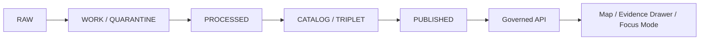
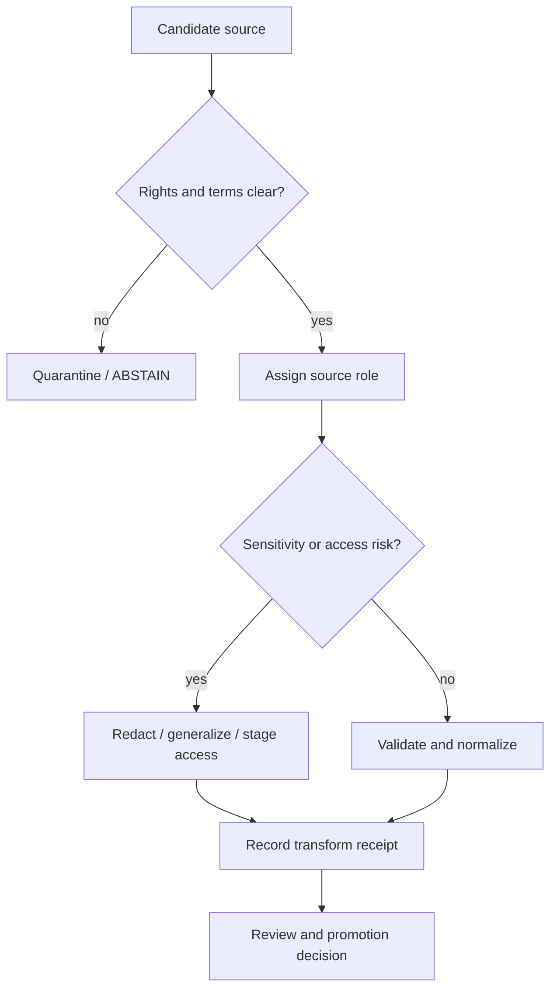
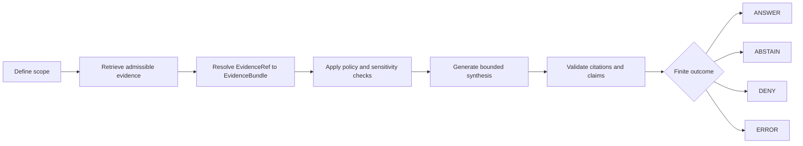

<!-- [KFM_META_BLOCK_V2]
doc_id: TODO: assign kfm://doc/<uuid>
title: Kansas Frontier Matrix
type: standard
version: v1
status: draft
owners: platform-governance (verify against CODEOWNERS)
created: 2026-04-26
updated: 2026-04-29
policy_label: policy/bundles/* + policy/catalog/* (repo-scoped)
related: [.github/workflows/, policy/, schemas/contracts/v1/, apps/governed_api/, apps/web/, data/registry/]
tags: [kfm, readme, governance, evidence, maps, temporal]
notes: [Draft root README revised from corpus-only evidence; verify repository paths, owners, workflows, routes, package manager, license, release state, and public access posture before commit.]
[/KFM_META_BLOCK_V2] -->

<a id="top"></a>

# Kansas Frontier Matrix

<p align="center">
  <strong>Evidence-first • map-first • time-aware • governed spatial knowledge and publication.</strong><br>
  <sub>Maps, AI answers, tiles, graphs, dashboards, scenes, and stories are downstream evidence carriers — not sovereign truth.</sub>
</p>

<p align="center">
  
  
  
  
  
  
  
  
</p>

<p align="center">
  <a href="#what-kfm-is">What KFM is</a> ·
  <a href="#repo-fit">Repo fit</a> ·
  <a href="#trust-path">Trust path</a> ·
  <a href="#inspectable-claim-contract">Inspectable claims</a> ·
  <a href="#map-and-ai-boundaries">Map & AI</a> ·
  <a href="#validation">Validation</a> ·
  <a href="#rollback-and-correction">Rollback</a>
</p>

> [!IMPORTANT]
> This README is evidence-bounded. Do **not** treat proposed paths, object families, validation commands, workflows, badges, API routes, UI components, or runtime behavior as current implementation until verified from current repository evidence.

| Field | Value |
|---|---|
| Status | `draft` |
| Owners | `.github/CODEOWNERS` present; primary ownership still needs human confirmation for external publication. |
| Evidence mode | Repository-inspected README with doctrine + concrete path evidence from this checkout. |
| Policy label | Policy bundles and catalog gates in `policy/bundles/*` and `policy/catalog/*`; release-specific gates in `policy/release/*`. |
| Repo fit | Root landing file `README.md` with adjacent control surfaces in `docs/`, `schemas/`, `policy/`, `apps/`, `tools/`, and `tests/`. |
| Public posture | Cite-or-abstain; fail closed on unresolved rights, sensitivity, source terms, or release state |
| Implementation depth | Multi-surface implementation present: governed API, web shell, validators, fixtures, policy bundles, and CI workflows. |
| Publication state | Release dry-run and manifest validation machinery present; production publication posture still policy-gated. |

## What this README is

| This README does | This README does not |
|---|---|
| Provides a polished root orientation for KFM maintainers, reviewers, and trusted collaborators. | Prove the current repository already implements the described files, schemas, routes, tests, UI, CI, or runtime behavior. |
| States the KFM trust posture, lifecycle, public-output boundaries, and documentation expectations. | Authorize public release of any source, claim, layer, scene, tile, summary, or AI answer. |
| Preserves the project’s evidence-first, map-first, time-aware, governed doctrine. | Treat maps, AI, dashboards, vector stores, search indexes, or generated summaries as root truth. |
| Lists safe next verification and build steps. | Replace repository inspection, source-rights review, policy review, release review, or rollback planning. |

> [!NOTE]
> This document is designed to be merged as a root README only after maintainers verify current repository conventions, owners, links, workflows, license, and release state.

---

## What KFM is

Kansas Frontier Matrix, or KFM, is a governed spatial evidence and publication system. Its durable public unit of value is the **inspectable claim**: a public or semi-public statement that can be reconstructed to admissible evidence, spatial scope, temporal scope, source role, policy posture, review state, release state, and correction lineage.

KFM is designed so maps, summaries, dashboards, tiles, graph projections, story exports, AI answers, and rendered scenes remain downstream carriers of evidence. They are useful surfaces, not sovereign truth.

In this repository today, that doctrine is expressed not just in prose but in enforceable artifacts: JSON schemas, Rego bundles, fixture-driven policy parity tests, and bounded runtime envelopes that force finite outcomes (`ANSWER`, `ABSTAIN`, `DENY`, `ERROR`).

| KFM does | KFM does not |
|---|---|
| Builds traceable spatial claims from governed evidence. | Treat map polish as evidence. |
| Keeps time, source role, review state, policy posture, and correction lineage visible. | Publish uncited or weakly supported claims as authoritative. |
| Uses maps as primary navigation and inspection surfaces. | Let renderers, tiles, scenes, search indexes, or vector stores replace canonical truth. |
| Supports review, rollback, redaction, and correction workflows. | Expose RAW, WORK, QUARANTINE, or unpublished candidate data to public clients. |
| Allows bounded AI synthesis over admissible evidence. | Allow direct public model traffic or model output as proof. |

<p align="right"><a href="#top">Back to top ↑</a></p>

---

## Repo fit

This file is intended to serve as the repository landing page after maintainers verify the real checkout conventions.

| Area | Current README posture |
|---|---|
| Root file | `README.md` — proposed root orientation |
| Source registry | `data/registry/ecology/` with source, dataset, sensitivity, and map-layer registries. |
| Schemas/contracts | `schemas/contracts/v1/` (plus ecology, evidence, runtime, correction, release families). |
| Policy | Rego policy bundles in `policy/bundles/`, catalog gates in `policy/catalog/`, runtime/release fixtures in `policy/fixtures/`. |
| Tests/fixtures | Pytest-style tests in `tests/` and app/tool test trees; extensive fixtures under `tests/fixtures/` and `policy/fixtures/`. |
| UI shell | `apps/web/` + `ui/` with map pane, Evidence Drawer, Focus panel, and trust badge components. |
| Release/proofs | `tools/proofs/`, `tools/receipts/`, `tools/release/`, `data/proofs/`, `data/receipts/`, and release policy gates. |
| License | `TODO: verify repository license` |

> [!WARNING]
> If this repository already contains a stronger root README or documented README convention, preserve stable anchors and merge this content as a patch rather than replacing verified material wholesale.

### Maintainer start path

1. Verify repository root, branch, package manager, workflow names, and stable README anchors.
2. Resolve schema-home authority through an ADR before adding or moving machine contracts.
3. Add or verify source ledger, source registry, core governance schemas, fixtures, validators, policy stubs, and one no-network proof slice.
4. Only then expand live connectors, public layers, UI routes, AI provider adapters, broad tiles, or exposed deployment.

<p align="right"><a href="#top">Back to top ↑</a></p>

---

## Accepted inputs

KFM input classes should be admitted only through source-aware, policy-aware intake.

| Input class | Required posture |
|---|---|
| Authoritative or official source records | Verify source role, rights, temporal coverage, spatial support, update cadence, and release terms. |
| Archival, historical, field, or documentary evidence | Preserve provenance, interpretation status, uncertainty, and review trail. |
| Sensor, observation, remote-sensing, or model-derived data | Keep observations, detections, models, regulatory layers, and derived products distinct. |
| Human or steward-submitted contributions | Route through intake, review, rights, sensitivity, and correction controls. |
| AI-assisted summaries or classifications | Treat as interpretive outputs requiring evidence, citation validation, and policy checks. |

## Exclusions and fail-closed areas

KFM should quarantine, deny, redact, generalize, delay, or stage access when evidence or policy is unresolved.

| Exclusion / restricted class | Default handling |
|---|---|
| Unverified source terms, licenses, rights, or redistribution permissions | `ABSTAIN` or quarantine until resolved. |
| Exact locations for archaeology, sacred sites, burials, rare species, sensitive habitat, critical infrastructure, or private landowner exposure | Deny public exact exposure by default; require review and documented transforms. |
| Living-person, DNA, genomic, or private genealogy material | Restrict by default; separate assertions from canonical records. |
| Assessor, tax, or parcel data used as title truth | Do not publish as title truth without appropriate source role and evidence. |
| Direct model-runtime output, raw vector-search hits, or generated summaries | Never treat as proof. |
| RAW, WORK, QUARANTINE, or unpublished candidate stores | Not available to public clients or ordinary UI surfaces. |

> [!CAUTION]
> When rights, sovereignty, cultural sensitivity, living-person exposure, DNA/genomics, private landowner exposure, exact-location exposure, rare species, archaeology, critical infrastructure, credentials, private endpoints, or source terms are unclear, KFM should fail closed.

<p align="right"><a href="#top">Back to top ↑</a></p>

---

## Trust path

KFM’s default lifecycle is intentionally conservative. Promotion is a governed state transition, not a file move.


```mermaid
flowchart LR
  RAW[RAW] --> WORK[WORK / QUARANTINE]
  WORK --> PROCESSED[PROCESSED]
  PROCESSED --> CATALOG[CATALOG / TRIPLET]
  CATALOG --> PUBLISHED[PUBLISHED]
  PUBLISHED --> API[Governed API]
  API --> UI[Map / Evidence Drawer / Focus Mode]
```

Core rule: public-facing surfaces should resolve evidence and policy posture before making consequential claims.

| Stage | What it is | Public-client posture |
|---|---|---|
| `RAW` | Source-adjacent material before normalization and review. | Not public. |
| `WORK / QUARANTINE` | Working material or held material with unresolved risk. | Not public. |
| `PROCESSED` | Normalized and validated candidate material. | Not public unless promoted. |
| `CATALOG / TRIPLET` | Cataloged, linked, or graph-ready evidence products. | Only through governed release rules. |
| `PUBLISHED` | Reviewed, policy-safe, release-bound outputs. | Public or staged access through governed APIs and released artifacts only. |

### Source intake posture


```mermaid
flowchart TB
  SOURCE[Candidate source] --> TERMS{Rights and terms clear?}
  TERMS -- no --> QUARANTINE[Quarantine / ABSTAIN]
  TERMS -- yes --> ROLE[Assign source role]
  ROLE --> SENS{Sensitivity or access risk?}
  SENS -- yes --> TRANSFORM[Redact / generalize / stage access]
  SENS -- no --> VALIDATE[Validate and normalize]
  TRANSFORM --> RECEIPT[Record transform receipt]
  VALIDATE --> RECEIPT
  RECEIPT --> REVIEW[Review and promotion decision]
```

<p align="right"><a href="#top">Back to top ↑</a></p>

---

## Inspectable claim contract

A consequential KFM claim should be reconstructable to the following support surface.

| Required support | Purpose |
|---|---|
| `EvidenceRef → EvidenceBundle` | Shows what evidence supports the claim. |
| Spatial scope | Defines where the claim applies and with what geometric support. |
| Temporal scope | Defines valid time, observed time, source time, or release time as applicable. |
| Source role | Prevents confusing authority, context, observation, model, and interpretation. |
| `PolicyDecision` | Shows rights, sensitivity, access, and publication posture. |
| Review state | Separates draft, reviewed, released, corrected, withdrawn, or superseded claims. |
| Release state | Connects the claim to a governed publication event. |
| Correction lineage | Makes corrections, withdrawals, and rollback targets inspectable. |

> [!IMPORTANT]
> EvidenceBundle outranks generated language. If the evidence cannot be resolved, cite-or-abstain is the correct default.

---

## Map and AI boundaries

Maps and AI are important KFM surfaces, but both must remain subordinate to governed evidence.

### Map-first shell

KFM should use a map-first, time-aware shell where geography, time, evidence, policy, and review state remain visible at the point of use. MapLibre, Cesium, PMTiles, COGs, 3D Tiles, vector tiles, dashboards, and rendered scenes are delivery or rendering surfaces. They should not silently replace canonical truth.

| Surface | Allowed role | Not allowed |
|---|---|---|
| MapLibre / map shell | Render released public-safe artifacts and interaction state. | Become the canonical store, policy authority, or publication gate. |
| Cesium / 3D scene | Add 3D, terrain, globe, or vertical context when it carries real evidence burden. | Let visual realism imply evidentiary certainty. |
| Tiles / COGs / PMTiles / 3D Tiles | Deliver rebuildable published artifacts. | Replace source, catalog, proof, or release objects. |
| Evidence Drawer | Show resolved evidence, policy, review, release, and correction state. | Hide uncertainty or unresolved source posture. |
| Story exports / dashboards | Communicate released claims and context. | Publish unsupported claims as authoritative. |

### Governed AI / Focus Mode

AI should operate as a bounded interpretive layer behind governed APIs.


```mermaid
flowchart LR
  SCOPE[Define scope] --> EVIDENCE[Retrieve admissible evidence]
  EVIDENCE --> BUNDLE[Resolve EvidenceRef to EvidenceBundle]
  BUNDLE --> POLICY[Apply policy and sensitivity checks]
  POLICY --> SYNTH[Generate bounded synthesis]
  SYNTH --> CITE[Validate citations and claims]
  CITE --> OUTCOME{Finite outcome}
  OUTCOME --> ANSWER[ANSWER]
  OUTCOME --> ABSTAIN[ABSTAIN]
  OUTCOME --> DENY[DENY]
  OUTCOME --> ERROR[ERROR]
```

`ANSWER`, `ABSTAIN`, `DENY`, and `ERROR` are first-class outcomes. Prefer `ABSTAIN` over unsupported confidence, `DENY` over unsafe exposure, and `ERROR` over hiding technical failure.

<p align="right"><a href="#top">Back to top ↑</a></p>

---

## Proposed object families

These object families are preferred targets unless current repository evidence proves another accepted model.

| Family | Role |
|---|---|
| `SourceDescriptor` / `SourceIntakeRecord` | Source identity, source role, rights, terms, update cadence, and intake state. |
| `EvidenceRef` / `EvidenceBundle` | Claim support and reconstructable evidence payloads. |
| `DecisionEnvelope` / `PolicyDecision` | Structured policy, review, release, and outcome decisions. |
| `RuntimeResponseEnvelope` / `CitationValidationReport` | Governed AI and Focus Mode response boundaries. |
| `RunReceipt` / `AIReceipt` / `RedactionReceipt` / `ValidationReport` | Process memory, validation, redaction, and runtime traceability. |
| `PromotionDecision` / `ReleaseManifest` / `ProofPack` / `CatalogMatrix` | Publication readiness, release artifacts, and catalog closure. |
| `CorrectionNotice` / `RollbackPlan` | Correction, withdrawal, supersession, and recovery path. |
| `GeoManifest` | Spatial artifact integrity, layer metadata, and release linkage. |

> [!WARNING]
> The table above is `PROPOSED` unless matching schemas, contracts, validators, fixtures, or emitted artifacts are confirmed in the mounted repository.

### Proof-bearing thin slice

The smallest useful build should prove the trust path before adding broad data or UI surface area.

| Slice part | Minimum proof |
|---|---|
| Source registry skeleton | At least one source descriptor with role, rights posture, cadence, and access posture. |
| Core schemas/contracts | Evidence, policy, receipt, release, and claim-support objects validate against fixtures. |
| Offline fixtures | Valid and invalid examples exercise positive and negative paths without live network dependency. |
| Validators | Fail on unresolved evidence, unknown source role, missing review state, or unsafe public exposure. |
| Policy stubs | Deny unresolved rights, unclear sensitivity, public RAW/WORK/QUARANTINE access, and direct model-client bypass. |
| Release dry-run | Emits or verifies a release-ready manifest, proof/citation closure, and rollback target. |

---

## Domain lanes

KFM should grow through proof-bearing domain lanes rather than broad unreviewed expansion. Hydrology is a strong first proof lane because it can exercise source descriptors, temporal observations, regulated context, map delivery, Evidence Drawer payloads, policy checks, and release/rollback behavior without starting from the most sensitive domains.

| Lane family | Special caution |
|---|---|
| Hydrology, soils, geology, atmosphere, hazards | Keep observations, models, regulatory layers, operational context, and public summaries distinct. |
| Habitat, fauna, flora, agriculture | Fail closed on sensitive locations and source-rights uncertainty. |
| Roads, rail, settlements, infrastructure | Separate geometry, legal/administrative status, operator, restriction, and historical interpretation. |
| Archaeology and cultural heritage | Deny public exact site locations by default; require steward/cultural review and public-safe transforms. |
| People, genealogy, DNA, land ownership | Restrict living-person and DNA/genomic material; do not treat assessor/tax records as title truth. |
| UI, MapLibre, 3D, governed AI | Treat as trust-visible interpretation and delivery surfaces, not root truth. |

<p align="right"><a href="#top">Back to top ↑</a></p>

---

## Security and exposed-local posture

KFM may be locally hosted and exposed through a home firewall, reverse proxy, or VPN for trusted third-party access. Treat that as security-relevant.

| Boundary | Default posture |
|---|---|
| Public access | Deny by default; expose only governed public-safe surfaces. |
| Steward access | Least privilege; auditable source, review, and release operations. |
| Admin and maintenance paths | Private by default; documented, constrained, and prevented from becoming normal public paths. |
| Model runtimes | No direct public model endpoint; model adapters remain behind governed API and policy checks. |
| Secrets and private endpoints | Never place in code, prompts, docs, fixtures, screenshots, or examples. |
| Logs and receipts | Keep enough for review without exposing sensitive data. |

> [!CAUTION]
> If authentication, authorization, source rights, private endpoint exposure, secret handling, or policy state is unclear, KFM should fail closed and preserve an auditable reason.

---

## Validation

Validation commands must be verified against the actual repo. Until then, only repository-discovery commands are safe to show as generic orientation.

```bash
# Local checkout orientation — verify in the real repository before relying on results.
git status --short
git branch --show-current
rg --files | sed -n '1,120p'
pytest -q tests/policy/runtime_parity/test_runtime_parity.py
```

Expected validation surfaces after implementation:

- [ ] Source descriptors validate source role, rights, terms, cadence, and access posture.
- [ ] EvidenceRefs resolve to EvidenceBundles.
- [ ] Citation validation fails unsupported claims.
- [ ] Policy gates deny unresolved rights, unclear sensitivity, missing review state, or unsafe exact geometry.
- [ ] Promotion requires catalog/proof/release closure.
- [ ] Public clients cannot access RAW, WORK, QUARANTINE, canonical/internal stores, or direct model output.
- [ ] Correction and rollback references are recorded for published or semi-public releases.

### Negative-path coverage to prioritize

- [ ] Unresolved `EvidenceRef`.
- [ ] Unknown source role.
- [ ] Unclear rights or license.
- [ ] Unclear sensitivity or exact sensitive geometry.
- [ ] Missing review state or release state.
- [ ] Invalid `spec_hash` or manifest mismatch.
- [ ] Direct model-client bypass.
- [ ] Public access to RAW, WORK, QUARANTINE, or unpublished candidate data.
- [ ] Missing citation for a consequential claim.
- [ ] Generated artifact placed in canonical path without convention.

<p align="right"><a href="#top">Back to top ↑</a></p>

---

## Definition of Done

A build-facing KFM change is not done until the relevant evidence, policy, validation, and rollback surfaces are visible.

- [ ] Evidence basis is stated.
- [ ] Repository paths, owners, badges, links, routes, workflows, and package commands are verified or marked `TODO` / `NEEDS VERIFICATION`.
- [ ] Source role and source terms are recorded.
- [ ] EvidenceBundle resolution is tested for consequential claims.
- [ ] PolicyDecision is emitted or recorded where risk matters.
- [ ] Sensitive geometry is redacted, generalized, withheld, or denied by default.
- [ ] Release state and review state are explicit.
- [ ] Correction and rollback path are documented.
- [ ] Derived layers, tiles, search indexes, summaries, graphs, and scenes remain rebuildable derivatives.
- [ ] Documentation changed when behavior changed, or the reason it did not is recorded.

---

## Recommended first PR

> [!TIP]
> When the repository is mounted and conventions are verified, start with the smallest reversible trust-building slice instead of live data ingestion or UI polish.

**PR-0001: Documentation Control Plane, Schema-Home ADR, Source Ledger Skeleton, Core Governance Schemas, Offline Fixtures, Validators, Policy Stubs, and One No-Network Public-Safe Proof Slice**

| Work item | Why it comes first |
|---|---|
| Repo inventory and README metadata verification | Prevents fake implementation claims and broken links. |
| Schema-home ADR | Avoids parallel `schemas/` vs. `contracts/` drift. |
| Source ledger and source registry skeleton | Makes source authority and rights visible before data growth. |
| Core governance schemas and fixtures | Turns doctrine into testable contracts. |
| Validators and negative-path tests | Proves fail-closed behavior before public surfaces. |
| Policy stubs | Blocks unsafe publication paths early. |
| No-network proof slice | Demonstrates evidence-to-public-output flow without live-source risk. |

---

## Rollback and correction

KFM publication should be reversible and correctable.

| Event | Required response |
|---|---|
| Bad source intake | Quarantine or withdraw source; record reason and affected artifacts. |
| Broken validation | Block promotion; preserve `ValidationReport` and failed inputs. |
| Unsafe public exposure | Remove or restrict release; emit `CorrectionNotice` and `RedactionReceipt` where relevant. |
| Incorrect claim | Correct or withdraw claim; preserve lineage from prior claim to replacement. |
| Failed release | Roll back to prior `ReleaseManifest` or documented `RollbackPlan`. |
| Policy drift | Re-evaluate affected public surfaces and release manifests. |

<p align="right"><a href="#top">Back to top ↑</a></p>

---

## Current verification gaps

- [ ] Confirm actual root README conventions and stable anchors.
- [ ] Verify repository path map, package manager, test runner, and CI workflow names.
- [ ] Verify schema vs. contract authority and ADR conventions.
- [ ] Verify policy engine, validator registry, source registry, and fixture homes.
- [ ] Verify MapLibre shell, Evidence Drawer, Focus Mode, and governed API implementation paths.
- [ ] Verify release, proof, receipt, catalog, correction, and rollback artifact homes.
- [ ] Verify license, owners, CODEOWNERS, branch protection, deployment posture, and public access boundaries.
- [ ] Verify whether this README should link to a documentation control plane, source authority register, or pipeline living manual.

---

## License

`TODO: verify repository license before adding a license badge or license summary.`

---

<details>
<summary>Appendix A — Placeholder register</summary>

| Placeholder | Why it remains |
|---|---|
| `TODO: assign kfm://doc/<uuid>` | No repository document registry was verified in this session. |
| `TODO: verify owner` | CODEOWNERS exists, but a human owner-of-record should still confirm external-facing ownership language. |
| `TODO: verify policy label` | Policy bundles are present; a single externally advertised policy label still needs maintainer confirmation. |
| `TODO: verify related paths` | Core related paths are now listed; final canonical doc graph should still be confirmed. |
| `TODO: verify repository license` | No repository license file was inspected. |
| `TODO: verify workflow names` | Workflow files are present under `.github/workflows/`; naming can still be refined for public docs. |

</details>

<details>
<summary>Appendix B — Glossary</summary>

| Term | Working meaning |
|---|---|
| Inspectable claim | A public or semi-public statement reconstructable to evidence, spatial/temporal scope, source role, policy posture, review state, release state, and correction lineage. |
| EvidenceBundle | The resolved evidence support package for a claim or answer. |
| EvidenceRef | A reference that must resolve to an EvidenceBundle before consequential public use. |
| PolicyDecision | Structured outcome of rights, sensitivity, access, review, and publication checks. |
| Promotion | Governed state transition from candidate material toward published output, not a file move. |
| Derived surface | A map layer, tile, search index, vector store, summary, graph projection, scene, or dashboard that carries evidence but does not replace canonical truth. |
| Focus Mode | Bounded AI-assisted interaction over admissible evidence, policy checks, citation validation, and finite outcomes. |

</details>

<details>
<summary>Appendix C — README pre-commit check</summary>

- [ ] Metadata block values are verified or visibly marked `TODO`.
- [ ] Badge claims are static and truthful, or backed by verified real targets.
- [ ] No fake CI, release, coverage, license, owner, security, or deployment status appears.
- [ ] Mermaid diagrams reflect doctrine and do not imply unverified implementation.
- [ ] Links are repo-relative or marked `TODO` / `NEEDS VERIFICATION`.
- [ ] No secrets, private endpoints, credentials, or sensitive locations appear.
- [ ] Unverified implementation behavior remains `UNKNOWN` or `PROPOSED`.
- [ ] License text is not summarized until the actual repository license is verified.

</details>

## SoilGrids COG normalization (Layer 2)

CLI example:

```bash
python soilgrids_cog_normalize.py \
  --input raw/soc_0-5cm_mean_subset.tif \
  --output-dir processed/cog \
  --compression DEFLATE \
  --predictor 2 \
  --blocksize 512 \
  --bigtiff IF_SAFER \
  --threads 1
```

Python example:

```python
from soilgrids_cog_normalize import normalize_to_cog

receipt = normalize_to_cog(
    input_path="raw/soc_0-5cm_mean_subset.tif",
    output_dir="processed/cog",
    compression="DEFLATE",
    predictor=2,
    blocksize=512,
    bigtiff="IF_SAFER",
    threads=1,
)
```

Expected receipt shape (`CogReceipt.v1`) includes:

```json
{
  "schema": "CogReceipt.v1",
  "status": "success | error",
  "input_path": "...",
  "output_path": "...",
  "spec_hash": "...",
  "creation_options": {
    "FORMAT": "COG",
    "COMPRESS": "DEFLATE",
    "PREDICTOR": "2",
    "BLOCKSIZE": "512",
    "BIGTIFF": "IF_SAFER",
    "NUM_THREADS": "1"
  },
  "validation": {
    "input_valid": true,
    "output_valid": true
  },
  "errors": []
}
```
