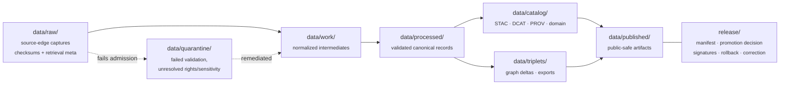
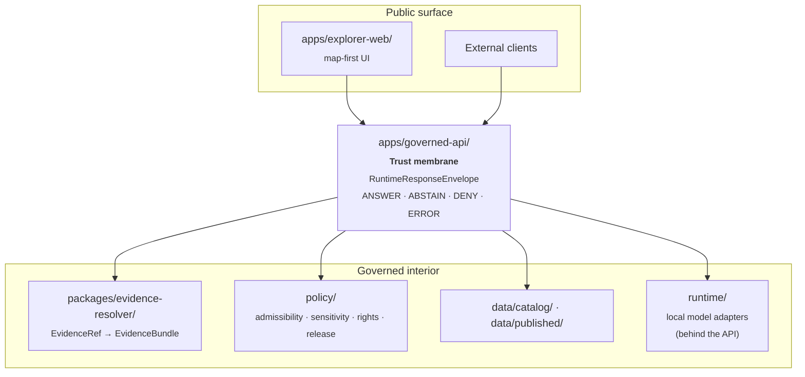

<!-- Kansas Frontier Matrix · root README.
     This README is a README-like doc; the KFM_META_BLOCK is reserved for standard docs.
     Path: /README.md   ·   Status: experimental / draft (repo evidence not yet verifiable in this session) -->

# Kansas Frontier Matrix

> **A Kansas-first, map-first, time-aware, evidence-first, trust-visible spatial knowledge and publication system.**
> KFM does not just gather facts about Kansas — it governs how sources become claims that are **traceable, reviewable, publishable, correctable, reversible, and useful** across place, time, policy, and public consequence.

<p align="center">
  <a href="docs/"></a>
  <a href="docs/doctrine/directory-rules.md"></a>
  <a href="docs/doctrine/"></a>
  <a href="apps/governed-api/"></a>
  <a href="release/"></a>
  <a href="LICENSE"></a>
  <a href="#status--maturity"></a>
</p>

<sub>
<b>Owners:</b> KFM stewards · <i>placeholder — populate from <a href="CODEOWNERS"><code>CODEOWNERS</code></a></i> &nbsp;·&nbsp;
<b>Last reviewed:</b> <i>TBD</i> &nbsp;·&nbsp;
<b>Doc class:</b> README-like (root)
</sub>

---

## Quick jumps

[What KFM is](#what-kfm-is) · [Core invariants](#core-invariants) · [Repo fit](#repo-fit) · [Canonical roots](#canonical-roots) · [Lifecycle](#the-lifecycle-invariant) · [Trust membrane](#trust-membrane-and-public-path) · [Quickstart](#quickstart) · [Documentation map](#documentation-map) · [Governance](#governance-at-a-glance) · [Status & maturity](#status--maturity) · [Open questions](#open-questions) · [Contributing](#contributing-security-license)

---

## What KFM is

KFM is a governed knowledge system, not a dataset and not a basemap.

> **Map-first.** Kansas is the spatial frame; every claim resolves through place and time.
> **Time-aware.** Records carry temporal validity; the system supports temporal queries, not just snapshots.
> **Evidence-first.** Claims resolve to `EvidenceRef → EvidenceBundle`. *Cite-or-abstain* is the default truth posture.
> **Trust-visible.** Provenance, receipts, reviews, corrections, and rollback targets are auditable artifacts, not implementation details.
> **Policy-aware.** Rights, sovereignty, sensitivity, and exposure posture are decided before publication, not after.
> **Reversible.** Every publication has a correction path and a rollback target.

KFM is **not** a generative-AI chat layer over a map. AI is interpretive: it summarizes, explains, and routes — it does **not** decide what is true. `EvidenceBundle` outranks generated language at every gate.

[⤴ back to top](#kansas-frontier-matrix)

---

## Core invariants

These are **non-negotiable** unless an accepted ADR amends them. They show up everywhere — in directory rules, in pipelines, in the public API, and in this README.

| # | Invariant | What it means in practice |
|---|---|---|
| 1 | **Lifecycle** — `RAW → WORK / QUARANTINE → PROCESSED → CATALOG / TRIPLET → PUBLISHED` | Promotion is a **governed state transition, not a file move.** |
| 2 | **Trust membrane** | Public clients and normal UI surfaces read through `apps/governed-api/`, **never** directly from canonical or internal stores. |
| 3 | **Cite-or-abstain** | If a claim depends on evidence, the system either cites a resolvable `EvidenceBundle` or abstains. |
| 4 | **Watcher-as-non-publisher** | Workers emit receipts and candidate decisions; they do **not** publish, mutate canonical records, or bypass review. |
| 5 | **Schema-home rule** | Default machine-schema home is `schemas/contracts/v1/...` (ADR-0001). `contracts/` carries **meaning**; `schemas/` carries **shape**. |
| 6 | **Policy gates** | Admissibility, sensitivity, rights, and release are decided in `policy/` — not inside ad-hoc app code. |
| 7 | **Reversibility** | Every release has a `RollbackCard` and a correction path. |
| 8 | **Separation of duties** | Policy-significant release responsibilities are split when project maturity justifies it. |

> [!IMPORTANT]
> If a proposal bends an invariant, the bend must be stated clearly, reviewed, and (where §2.4 of the Directory Rules applies) backed by an ADR.

[⤴ back to top](#kansas-frontier-matrix)

---

## Repo fit

This file is the **root README** for the Kansas Frontier Matrix repository. It is the orientation surface — it does not decide anything by itself.

**Where authority lives:**

- **Doctrine** — [`docs/doctrine/`](docs/doctrine/) (authority ladder, truth posture, trust membrane, lifecycle law, [directory rules](docs/doctrine/directory-rules.md))
- **Architecture** — [`docs/architecture/`](docs/architecture/) (system context, governed-API, map shell, contract/schema/policy split)
- **ADRs** — [`docs/adr/`](docs/adr/)
- **Machine governance maps** — [`control_plane/`](control_plane/)
- **Contracts & schemas** — [`contracts/`](contracts/), [`schemas/`](schemas/)
- **Policy** — [`policy/`](policy/)
- **Release plane** — [`release/`](release/)
- **Data lifecycle** — [`data/`](data/)

**Upstream of this README:** `docs/doctrine/*`, the canonical-root layout in [Directory Rules §5](docs/doctrine/directory-rules.md#5-canonical-root-tree), and project-level invariants.

**Downstream:** per-root `README.md` files inside each canonical and compatibility root — each one is bound by the [Required README Contract](docs/doctrine/directory-rules.md#15-required-readme-contract).

### What belongs in this file

- Orientation, quick jumps, and the canonical-root map.
- Doctrine summary and links into authoritative docs.
- Repo-wide quickstart pointers and status.

### What does **not** belong here

- Per-root rules or per-domain detail — those live in each root's README.
- Decisions — those live in ADRs (`docs/adr/`), policy bundles (`policy/`), or release decisions (`release/`).
- Schema definitions, contract definitions, or fixtures.
- Build outputs, receipts, proofs, or release manifests.

[⤴ back to top](#kansas-frontier-matrix)

---

## Canonical roots

> **Status:** the *rules* below are CONFIRMED from [`docs/doctrine/directory-rules.md`](docs/doctrine/directory-rules.md). The *presence* of any specific root in the current repo state is **PROPOSED** until verified by direct repo inspection.

```text
Kansas-Frontier-Matrix/
├── README.md                  ← this file
├── CHANGELOG.md                  CONTRIBUTING.md   SECURITY.md   LICENSE
├── CODEOWNERS                  # may live in .github/CODEOWNERS
├── .github/                    # workflows, issue/PR templates, governance hooks
│
├── docs/                       # human-facing control plane
├── control_plane/              # machine-readable governance maps
├── contracts/                  # object-family meaning  (Markdown)
├── schemas/                    # machine-checkable shape (JSON Schema, JSON-LD)
├── policy/                     # admissibility & release policy
│
├── tests/        fixtures/     # enforceability proof + golden inputs
├── tools/        scripts/      # repo-wide validators · operational helpers
│
├── apps/                       # deployable applications  (governed-api, explorer-web, …)
├── packages/                   # shared libraries
├── connectors/                 # source-specific fetch + admission
├── pipelines/   pipeline_specs/  # how it runs · what should run
│
├── data/                       # lifecycle data + emitted proof objects
├── release/                    # release decisions, manifests, rollback, corrections
│
├── runtime/      infra/        # local adapters · deployment & exposure posture
├── configs/      migrations/   # non-secret defaults · DB / schema / graph migrations
├── examples/                   # worked, runnable examples
└── artifacts/                  # OPTIONAL / compatibility — tightly scoped
```

**Compatibility roots** that may exist but must declare their class (`legacy | mirror | deprecated | external-export | transitional`) in their README:

```text
artifacts/   jsonschema/   policies/   ui/   web/   styles/   viewer_templates/
```

See the full placement protocol in [Directory Rules §4](docs/doctrine/directory-rules.md#4-where-does-this-file-go--placement-protocol).

[⤴ back to top](#kansas-frontier-matrix)

---

## The lifecycle invariant


```mermaid
flowchart LR
    RAW["data/raw/<br/><sub>source-edge captures<br/>checksums + retrieval meta</sub>"]
    WORK["data/work/<br/><sub>normalized intermediates</sub>"]
    QUAR["data/quarantine/<br/><sub>failed validation,<br/>unresolved rights/sensitivity</sub>"]
    PROC["data/processed/<br/><sub>validated canonical records</sub>"]
    CAT["data/catalog/<br/><sub>STAC · DCAT · PROV · domain</sub>"]
    TRIP["data/triplets/<br/><sub>graph deltas · exports</sub>"]
    PUB["data/published/<br/><sub>public-safe artifacts</sub>"]
    REL["release/<br/><sub>manifest · promotion decision<br/>signatures · rollback · correction</sub>"]

    RAW --> WORK
    RAW -. fails admission .-> QUAR
    WORK --> PROC
    QUAR -. remediated .-> WORK
    PROC --> CAT
    PROC --> TRIP
    CAT --> PUB
    TRIP --> PUB
    PUB --- REL
```

> [!NOTE]
> **Promotion is a governed state transition.** A path-level move that bypasses validators, policy gates, evidence-bundle creation, catalog closure, or release-decision recording is a violation of the invariant — regardless of where the bytes ended up.

| Phase | Allowed | MUST NOT |
|---|---|---|
| `raw/` | Immutable source-edge captures w/ retrieval metadata + checksums | Public clients, AI context, UI layers, normalized records |
| `work/` | Normalized intermediates, candidate assertions | Public API/UI, release aliases |
| `quarantine/` | Failed validation, unresolved rights/sensitivity, schema drift, over-precise geometry | Promotion candidates without remediation |
| `processed/` | Validated canonical records | Assumption of public/release status |
| `catalog/` | STAC / DCAT / PROV records, domain catalog | Uncited claims, unclosed identifiers |
| `triplets/` | Relationship projections and graph-compatible triples | Canonical replacement semantics |
| `published/` | Released public-safe artifacts | Raw, work, quarantine, exact restricted geometry |
| `receipts/` | Run, validation, AI, ingest, release receipts | Proof of release by themselves |
| `proofs/` | EvidenceBundle, ProofPack, integrity bundle | Process-only receipts without release context |
| `rollback/` | Alias-revert receipts | Deleting prior meanings |
| `registry/` | Append-only source/layer/dataset/rights/sensitivity records | Canonical domain truth |

[⤴ back to top](#kansas-frontier-matrix)

---

## Trust membrane and public path


```mermaid
flowchart TB
    subgraph PUBLIC["Public surface"]
        UI["apps/explorer-web/<br/><sub>map-first UI</sub>"]
        EXT["External clients"]
    end
    API["apps/governed-api/<br/><sub><b>Trust membrane</b><br/>RuntimeResponseEnvelope<br/>ANSWER · ABSTAIN · DENY · ERROR</sub>"]
    subgraph GOV["Governed interior"]
        EVID["packages/evidence-resolver/<br/><sub>EvidenceRef → EvidenceBundle</sub>"]
        POL["policy/<br/><sub>admissibility · sensitivity · rights · release</sub>"]
        CAT["data/catalog/ · data/published/"]
        AI["runtime/<br/><sub>local model adapters<br/>(behind the API)</sub>"]
    end

    UI  --> API
    EXT --> API
    API --> EVID
    API --> POL
    API --> CAT
    API --> AI
```

> [!IMPORTANT]
> Local AI runtimes (e.g., Ollama) **must** stay behind `apps/governed-api/`. They do not receive direct public traffic, do not read canonical or raw stores, and do not stand in for evidence, policy, review state, or release state.

[⤴ back to top](#kansas-frontier-matrix)

---

## Governance at a glance

| Layer | Owns | Lives in |
|---|---|---|
| **Doctrine** | Authority ladder, truth posture, trust membrane, lifecycle law, directory rules | `docs/doctrine/` |
| **Architecture** | System context, governed-API shape, map shell, contract/schema/policy split | `docs/architecture/` |
| **Object meaning** | What a `SourceDescriptor`, `EvidenceBundle`, `ReleaseManifest`, etc. *mean* | `contracts/` |
| **Object shape** | JSON Schema / JSON-LD validation of those objects | `schemas/contracts/v1/` |
| **Admissibility** | Allow / deny / restrict / abstain decisions | `policy/` |
| **Machine registers** | `document_registry`, `source_authority_register`, `policy_gate_register`, … | `control_plane/` |
| **Proof of enforceability** | Tests + fixtures | `tests/`, `fixtures/` |
| **Release decisions** | Manifests, promotion decisions, rollback cards, correction notices, signatures | `release/` |
| **Public path** | The only sanctioned public read surface | `apps/governed-api/` |

**Four drifts to prevent** (verbatim from [Directory Rules §13.1–§13.4](docs/doctrine/directory-rules.md#13-anti-patterns-and-drift-prevention)):

1. `contracts/` and `schemas/` both claiming machine-schema authority.
2. `artifacts/`, `data/proofs/`, `data/receipts/`, and `release/` mixing proof, process memory, build output, and release decisions.
3. `ui/`, `web/`, `apps/explorer-web/`, and `packages/ui/` becoming competing shell homes.
4. Domain folders becoming root folders and fragmenting the lifecycle.

[⤴ back to top](#kansas-frontier-matrix)

---

## Quickstart

> [!WARNING]
> **PROPOSED / NEEDS VERIFICATION.** No build, package, or runtime tooling has been confirmed in this session — the workspace is mounted but empty, and no `package.json`, `pyproject.toml`, `Makefile`, or CI workflow has been inspected. Treat every command in this section as a **placeholder** until a per-root README under `apps/`, `pipelines/`, or `tools/` confirms it.

<details>
<summary><b>Read a governed claim (illustrative, not yet runnable)</b></summary>

```bash
# Illustrative — exact route, port, and envelope keys are PROPOSED.
# Public clients hit the governed API; they MUST NOT read canonical stores directly.
curl -sS http://localhost:8080/v1/claims/<claim_id> | jq

# Expected envelope (schema home: schemas/contracts/v1/runtime/):
# {
#   "outcome": "ANSWER" | "ABSTAIN" | "DENY" | "ERROR",
#   "claim":   { ... },
#   "evidence_ref": "kfm://evidence/<bundle_id>",
#   "receipt_id":   "kfm://receipt/<run_id>",
#   "policy_decision": "...",
#   "release_state":   "..."
# }
```
</details>

<details>
<summary><b>Validate a contract object against its schema (illustrative)</b></summary>

```bash
# Illustrative — actual entrypoint TBD under tools/validators/ or apps/cli/.
kfm validate \
  --object   path/to/instance.json \
  --schema   schemas/contracts/v1/<family>/<name>.schema.json \
  --policy   policy/bundles/<bundle>
```
</details>

<details>
<summary><b>Promote a candidate through the lifecycle (illustrative)</b></summary>

```bash
# Illustrative — promotion is a GOVERNED STATE TRANSITION, not a file move.
# Real promotion writes a PromotionDecision under release/promotion_decisions/
# and a RunReceipt under data/receipts/.
kfm promote \
  --from data/processed/<domain>/<dataset_id>/<version>/ \
  --to   catalog \
  --evidence-bundle <bundle_id>
```
</details>

Real quickstart commands should land in [`apps/cli/README.md`](apps/cli/) and [`docs/runbooks/`](docs/runbooks/) and be linked here.

[⤴ back to top](#kansas-frontier-matrix)

---

## Documentation map

```text
docs/
├── doctrine/           # authority ladder, truth posture, trust membrane,
│                       # lifecycle law, directory rules           ← canonical
├── architecture/       # system context, governed-API, map shell,
│                       # contract/schema/policy split             ← canonical
├── adr/                # accepted / proposed / superseded ADRs    ← canonical decisions
├── domains/            # per-domain dossiers (hydrology, soil, fauna, flora,
│                       # habitat, geology, atmosphere, roads-rail-trade,
│                       # settlements-infrastructure, archaeology,
│                       # hazards, agriculture, people-dna-land)
├── sources/            # source-descriptor standards & source families
├── standards/          # external standards KFM conforms to (STAC, DCAT, PROV, …)
├── runbooks/           # ops procedures, rollback drills, validation runs
├── security/           # threat model, exposure posture, incident response
├── governance/         # roles, review burden, separation of duties
├── registers/          # AUTHORITY_LADDER, CANONICAL_LINEAGE_EXPLORATORY,
│                       # DRIFT_REGISTER, VERIFICATION_BACKLOG, OBJECT_FAMILY_MAP
├── intake/             # IDEA_INTAKE, NEW_IDEAS_INDEX
├── archive/            # lineage / exploratory / deprecated
├── reports/            # generated review/release reports (read-only)
└── brand/              # style guides, voice (if not in packages/ui/)
```

> Domain pages (hydrology, soil, fauna, flora, habitat, geology, atmosphere, roads-rail-trade, settlements-infrastructure, archaeology, hazards, agriculture, people-dna-land) live as **lanes** under each responsibility root — never as root folders. See [Domain Placement Law (§12)](docs/doctrine/directory-rules.md#12-domain-placement-law).

[⤴ back to top](#kansas-frontier-matrix)

---

## Status & maturity

| Area | Status | Notes |
|---|---|---|
| Doctrine & directory rules | **CONFIRMED** | [`docs/doctrine/directory-rules.md`](docs/doctrine/directory-rules.md) is the live placement authority. |
| Canonical-root *rules* | **CONFIRMED** | Per [Directory Rules §5 & §20](docs/doctrine/directory-rules.md#5-canonical-root-tree). |
| Canonical-root *presence in repo* | **PROPOSED / NEEDS VERIFICATION** | Workspace mounted but empty in this session — verify with `git ls-tree -r HEAD`. |
| Schema home (`schemas/contracts/v1/...`) | **CONFIRMED rule (ADR-0001)** · **PROPOSED in-repo placement** | Migrate any `contracts/<domain>/<x>.schema.json` per ADR-0001. |
| Public trust path (`apps/governed-api/`) | **PROPOSED** | Required by doctrine; presence not yet verified. |
| `RuntimeResponseEnvelope` (ANSWER · ABSTAIN · DENY · ERROR) | **PROPOSED** | Schema home: `schemas/contracts/v1/runtime/`. |
| ADR-0001 (schema home) | **REFERENCED — NEEDS VERIFICATION** | Cited in Directory Rules §0 and §6.4; file presence not yet inspected. |
| CI / tests / release tooling | **UNKNOWN** | No workflow files inspected in this session. |
| License | **TBD** | `LICENSE` placeholder; choose and pin before any public release. |

[⤴ back to top](#kansas-frontier-matrix)

---

## Definition-of-done for a published claim

A claim becomes publication-eligible only when every applicable gate is closed. This is the **release contract** — abbreviated from doctrine for orientation only; the authoritative form lives in [`policy/release/`](policy/release/) and [`release/`](release/).

- [ ] **Identity** — deterministic id; resolvable.
- [ ] **Source descriptor** — admitted with retrieval metadata + checksums.
- [ ] **Rights** — license & rights status resolved (`policy/rights/`).
- [ ] **Sensitivity** — class assigned; redactions/generalizations applied if needed (`policy/sensitivity/`).
- [ ] **Validation** — schema + policy + tests pass; report emitted (`data/proofs/validation_report/`).
- [ ] **Provenance** — PROV chain closed through `data/catalog/prov/`.
- [ ] **Integrity** — `EvidenceBundle` assembled; hashes pinned (`data/proofs/evidence_bundle/`).
- [ ] **Receipts** — ingest, pipeline, AI, release receipts recorded (`data/receipts/`).
- [ ] **Review state** — reviewer sign-off in `contracts/governance/review_record`.
- [ ] **Release state** — `ReleaseManifest` + `PromotionDecision` recorded (`release/manifests/`, `release/promotion_decisions/`).
- [ ] **Correction path** — owner & template assigned (`release/correction_notices/`).
- [ ] **Rollback target** — `RollbackCard` prepared (`release/rollback_cards/`).
- [ ] **Signature** — DSSE / Sigstore signature attached (`release/signatures/`).

If any item is unresolved, the system defaults to **quarantine, redaction, generalization, staged access, delayed publication, or denial** — and records the transform and the reason.

[⤴ back to top](#kansas-frontier-matrix)

---

## Open questions

Tracked properly in [`docs/registers/VERIFICATION_BACKLOG.md`](docs/registers/VERIFICATION_BACKLOG.md) — listed here for visibility. From [Directory Rules §18](docs/doctrine/directory-rules.md#18-open-questions-and-needs-verification):

- **NEEDS VERIFICATION** — whether the mounted repo matches the canonical root tree in §5.
- **NEEDS VERIFICATION** — whether `contracts/` or `schemas/contracts/v1/` is the *live* machine-schema authority. Default per ADR-0001 is `schemas/contracts/v1/`.
- **NEEDS VERIFICATION** — whether `policies/` or `policy/` is canonical in the current repo. Default is `policy/`.
- **NEEDS VERIFICATION** — entrenchment level of `ui/`, `web/`, `styles/`, `viewer_templates/`.
- **OPEN** — keep `artifacts/` as compatibility, or retire it in favor of `data/receipts/`, `data/proofs/`, `release/`, `data/published/`?
- **OPEN** — `triplets/` (plural) vs. `triplet/` (singular); this README and Directory Rules use **`triplets/`**, ADR recommended.
- **OPEN** — `data/rollback/` (data plane) vs. `release/rollback_cards/` (release plane) split; this README keeps both, with the split defined in Directory Rules.
- **OPEN** — coexistence of `apps/api/` and `apps/governed-api/`; the latter is the public trust path.

[⤴ back to top](#kansas-frontier-matrix)

---

## Contributing, security, license

- **Contributing** — see [`CONTRIBUTING.md`](CONTRIBUTING.md). Every path-bearing PR should cite the [Directory Rules §4 placement protocol](docs/doctrine/directory-rules.md#4-where-does-this-file-go--placement-protocol) and pass the [§16 reviewer checklist](docs/doctrine/directory-rules.md#16-path-validation-checklist-for-reviewers).
- **Security** — see [`SECURITY.md`](SECURITY.md). For locally-exposed systems: deny-by-default, least privilege, no direct model-endpoint exposure, no raw-data exposure, audit logs ([`infra/`](infra/)).
- **License** — see [`LICENSE`](LICENSE). *Placeholder — pin before any public release.*
- **Code ownership** — [`CODEOWNERS`](CODEOWNERS) (or `.github/CODEOWNERS`).
- **Changelog** — [`CHANGELOG.md`](CHANGELOG.md).

[⤴ back to top](#kansas-frontier-matrix)

---

## A note on AI in KFM

> AI is **interpretive**, not the root truth source.
>
> Preferred order: **define scope → retrieve evidence → resolve `EvidenceRef` → `EvidenceBundle` → apply policy and sensitivity → answer with traceability, bounded confidence, or narrowed scope.**
>
> Never let fluent generation stand in for evidence, policy, review state, source authority, or release state. When uncertain, narrow the claim, mark the status, preserve reversibility, and let evidence carry the answer.

[⤴ back to top](#kansas-frontier-matrix)
