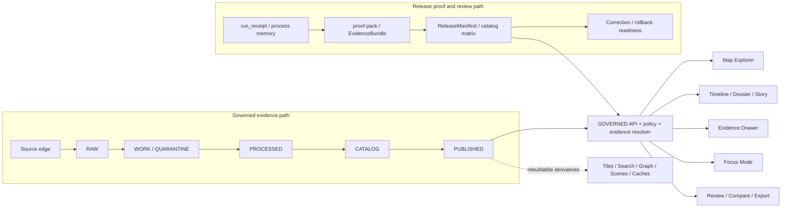

<!-- [KFM_META_BLOCK_V2]
doc_id: kfm://doc/TBD-VERIFY-root-readme-uuid
title: Kansas Frontier Matrix
type: standard
version: v1
status: review
owners: @bartytime4life
created: NEEDS_VERIFICATION__YYYY-MM-DD
updated: 2026-04-18
policy_label: public
related: [
  ./.codex/,
  ./.github/,
  ./.github/README.md,
  ./.github/actions/README.md,
  ./.github/watchers/README.md,
  ./.github/workflows/README.md,
  ./.github/CODEOWNERS,
  ./.github/PULL_REQUEST_TEMPLATE.md,
  ./.github/SECURITY.md,
  ./apps/,
  ./artifacts/,
  ./brand/,
  ./configs/,
  ./contracts/,
  ./data/,
  ./docs/,
  ./examples/,
  ./habitat/,
  ./infra/,
  ./migrations/,
  ./packages/,
  ./pipelines/,
  ./pipelines/README.md,
  ./policy/,
  ./release/,
  ./schemas/,
  ./scripts/,
  ./tests/,
  ./tools/,
  ./ui/,
  ./web/,
  ./CHANGELOG.md,
  ./CONTRIBUTING.md,
  ./CODE_OF_CONDUCT.md,
  ./LICENSE,
  ./Makefile,
  ./SECURITY.md
]
tags: [kfm, root-doc, repo-root, governance, evidence-first, map-first, trust-system]
notes: [
  Root README revision candidate rechecked against the current public main tree on 2026-04-18 and tightened to keep the proof spine, task entrypoint, and root/control-plane boundaries visible.
  Current public root tree includes additional visible top-level surfaces beyond the earlier 2026-04-12 root snapshot, including .codex, artifacts, habitat, release, and ui.
  doc_id and original created date still require commit-history verification.
]
[/KFM_META_BLOCK_V2] -->

<a id="top"></a>

# Kansas Frontier Matrix

Governed, evidence-first, map-first, time-aware repository for Kansas spatial evidence, publication, and trust-visible product surfaces.

> [!NOTE]
> **Status:** `experimental`  
> **Owners:** `@bartytime4life`  
> **Path:** `/README.md`  
> **Current public baseline inspected:** `2026-04-18`  
> **Repo fit:** root orientation document, doctrine summary, verification-first navigation surface, and public-tree boundary map  
> **Quick jumps:** [Scope](#scope) · [Repo fit](#repo-fit) · [Accepted inputs](#accepted-inputs) · [Exclusions](#exclusions) · [Directory tree](#directory-tree) · [Quickstart](#quickstart) · [Usage](#usage) · [Diagram](#diagram) · [Operating tables](#operating-tables) · [Task list](#task-list-and-definition-of-done) · [FAQ](#faq) · [Appendix](#appendix)


| Field | Value |
|---|---|
| **Status** | experimental |
| **Owners** | `@bartytime4life` |
| **Path** | `/README.md` |
| **Repo fit** | root identity, public-tree navigation, doctrine summary, adjacent-surface routing, and verification-first inspection path |
| **Upstream / downstream** | gatehouse [./.github/README.md](./.github/README.md) · docs [./docs/README.md](./docs/README.md) · data [./data/README.md](./data/README.md) · contract/policy [./contracts/README.md](./contracts/README.md), [./schemas/README.md](./schemas/README.md), [./policy/README.md](./policy/README.md) · runtime/execution [./apps/](./apps/), [./packages/README.md](./packages/README.md), [./infra/README.md](./infra/README.md), [./pipelines/README.md](./pipelines/README.md), [./web/](./web/), [./ui/](./ui/) · task entrypoint [./Makefile](./Makefile) |
| **Accepted here** | root identity, high-level doctrine, current public-tree orientation, adjacent-surface routing, and reviewer-safe verification steps |
| **Not here** | full schema catalogs, full policy text, lane-by-lane source atlases, route-by-route runtime claims, unpublished workflow certainty, platform-only ruleset claims, or unstaged implementation certainty |

> [!IMPORTANT]
> This README is intentionally verification-first. It is grounded in KFM doctrine plus the currently visible public repo tree. It does **not** claim direct verification of non-public branches, GitHub rulesets, required checks, environment approvals, deployment manifests, runtime proof objects, private dashboards, or platform-only settings that are not visible from checked-in public surfaces.

| At a glance | Working rule |
|---|---|
| System identity | Governed Kansas spatial evidence system |
| Value unit | The inspectable claim, not merely the map, graph, dashboard, or fluent answer |
| Truth path | `Source edge → RAW → WORK / QUARANTINE → PROCESSED → CATALOG → PUBLISHED` |
| Catalog closure | Outward STAC / DCAT / PROV triplet plus release linkage |
| Trust boundary | Governed APIs plus evidence resolution, not direct client access to stores |
| Runtime rule | Cite or abstain |
| Surface rule | One map-first, time-aware shell with trust-visible evidence and negative states |
| 3D rule | 2D default; 3D is conditional and burden-bearing |
| Review rule | Promotion is a governed state transition, not a file move |

---

## Scope

This README covers the **repo-root identity and operating posture** of Kansas Frontier Matrix.

Use it for:

- root-level mission, boundaries, and non-negotiable invariants
- verification-first navigation across the public repo root
- a source-bounded map of what exists now on public `main`
- the minimum path from clone to trustworthy local inspection
- routing readers into the correct owning lane without duplicating that lane’s README

Do not use it for:

- full contract text that belongs in [./contracts/](./contracts/) or [./schemas/](./schemas/)
- full policy rules that belong in [./policy/](./policy/)
- lane-by-lane source depth that belongs in [./docs/](./docs/) and domain/source atlases
- runtime certainty that has not been re-verified on the exact branch or commit under review
- platform-only claims such as branch protection, required checks, GitHub App permissions, or environment approvals unless those settings were directly checked

### Evidence posture used in this README

| Label | Meaning in this README |
|---|---|
| **CONFIRMED** | Supported by attached KFM doctrine, current public repo structure, checked-in public docs, or directly inspected public files |
| **INFERRED** | Strongly implied by visible repo evidence, but not directly proven as live implementation behavior |
| **PROPOSED** | A recommended realization or starter pattern that fits doctrine but is not yet proven as current implementation reality |
| **UNKNOWN** | Not supported strongly enough to state as a live repo, runtime, platform, or enforcement fact |
| **NEEDS VERIFICATION** | A path, owner, ruleset, behavior, target, or runtime claim that should be checked on the exact working branch before merge |

> [!NOTE]
> Public `main` is a useful baseline, but the branch you are changing outranks it. Treat working-branch evidence as decisive whenever it is available.

[Back to top](#top)

---

## Repo fit

**Path:** `/README.md`  
**Role:** root orientation document and verification-first operating index for Kansas Frontier Matrix.

This file should do three jobs well:

1. explain what KFM is and is not
2. mark the verification boundary honestly
3. route readers into the correct repo surfaces without duplicating their owning docs

### Upstream and downstream anchors

| Relation | Surface | Why it matters |
|---|---|---|
| Path | `/README.md` | Repo-root entrypoint and public operating index |
| Gatehouse | [./.github/README.md](./.github/README.md), [./.github/actions/README.md](./.github/actions/README.md), [./.github/watchers/README.md](./.github/watchers/README.md), [./.github/workflows/README.md](./.github/workflows/README.md) | review routing, reusable control-plane logic, watcher scaffolding, workflow-lane boundaries, and disclosure posture |
| Contract / policy / verification | [./contracts/README.md](./contracts/README.md), [./schemas/README.md](./schemas/README.md), [./policy/README.md](./policy/README.md), [./tests/README.md](./tests/README.md) | machine-checkable boundaries, deny-by-default posture, and verification intent |
| Data / long-form doctrine | [./data/README.md](./data/README.md), [./docs/README.md](./docs/README.md) | truth-path zones, catalogs, doctrine, runbooks, standards, and ADRs |
| Runtime / execution | [./apps/](./apps/), [./packages/README.md](./packages/README.md), [./infra/README.md](./infra/README.md), [./pipelines/README.md](./pipelines/README.md), [./ui/](./ui/), [./web/](./web/) | runtime, package, operations, pipeline, UI, and delivery-facing surfaces |
| Release / proof adjacency | [./artifacts/](./artifacts/), [./release/](./release/), [./data/](./data/) | visible artifact, release, data, receipt, and proof-adjacent surfaces that must not be confused with sovereign truth unless their lane docs prove it |
| Task entrypoint | [./Makefile](./Makefile) | public repo-root shortcut for bootstrap, validation, local bring-up, sample ingest, test, and catalog validation targets where those targets exist on the active branch |
| Public governance neighbors | [./CHANGELOG.md](./CHANGELOG.md), [./CONTRIBUTING.md](./CONTRIBUTING.md), [./SECURITY.md](./SECURITY.md), [./.github/SECURITY.md](./.github/SECURITY.md), [./CODE_OF_CONDUCT.md](./CODE_OF_CONDUCT.md), [./LICENSE](./LICENSE) | release history, contribution flow, disclosure posture, conduct, and licensing |

### Current public root snapshot

| Surface family | Current public state | Why it matters |
|---|---|---|
| Root governance and evolution docs | `README.md`, `CHANGELOG.md`, `CONTRIBUTING.md`, `SECURITY.md`, `CODE_OF_CONDUCT.md`, `LICENSE` | public onboarding, release history, conduct, disclosure, and legal posture are visible at repo root |
| Root task entrypoint | `Makefile` | the public root exposes a task runner surface; docs should not rely on `make` while leaving its existence implicit |
| Control plane | `/.github/`, `/.github/CODEOWNERS`, `/.github/PULL_REQUEST_TEMPLATE.md`, `/.github/README.md`, `/.github/actions/README.md`, `/.github/watchers/README.md`, `/.github/workflows/README.md`, `/.github/SECURITY.md`, `/.github/dependabot.yml` | review routing, templates, ownership, local actions, workflow docs, watcher docs, and disclosure surfaces already exist as repo surfaces |
| Core system directories | `/apps/`, `/contracts/`, `/data/`, `/docs/`, `/infra/`, `/packages/`, `/pipelines/`, `/policy/`, `/schemas/`, `/tests/`, `/tools/`, `/scripts/`, `/ui/`, `/web/` | the public tree exposes the main code, contract, policy, verification, execution, UI, and web-facing lanes |
| Supporting and evolving directories | `/.codex/`, `/artifacts/`, `/brand/`, `/configs/`, `/examples/`, `/habitat/`, `/migrations/`, `/release/` | the public tree shows additional automation, artifact, identity, configuration, sample, habitat, migration, and release-adjacent surfaces that root navigation should not silently omit |

### Current public-main deltas worth carrying forward

| Confirmed current public signal | Why it matters at repo root | How this README responds |
|---|---|---|
| Public root now shows `.codex/`, `artifacts/`, `habitat/`, `release/`, and `ui/` in addition to earlier root families | root orientation must not freeze an older tree snapshot | added these surfaces to the meta block, repo-fit links, directory tree, role map, quickstart inspection, and task list |
| `pipelines/` now visibly includes `hls-ndvi-change/`, `hls-ndvi/`, `soil-moisture-watch/`, `soils/`, `usgs-mesonet-watch/`, `wbd-huc12-watcher/`, `README.md`, and `ssurgo_to_catchment.md` | execution lanes are more concrete than an older “soils + WBD only” summary | updated pipeline inventory and kept runtime maturity bounded |
| `.github/actions/` includes named local-action directories plus `README.md`, `src/`, and root `action.yml`, but adjacent docs describe the inventory as placeholder-heavy | local action seams are real, but action contracts and callers must not be overclaimed | described as a public control-plane seam with `NEEDS VERIFICATION` for live callers and production readiness |
| `.github/workflows/` is visible as a README-first workflow documentation lane on public `main` | checked-in workflow YAML inventory cannot be inferred from workflow prose or historical Actions history | kept merge-blocking workflow claims conservative |
| `.github/watchers/` is visible as a README-only docs lane on public `main` | watcher doctrine exists, but watcher runtime jobs are not proven by that path alone | described as docs-first, emit-only, and review-bearing until implementation evidence is visible |
| `.github/CODEOWNERS` has a global fallback to `@bartytime4life` and explicit coverage for several major paths, but the explicit list does not fully enumerate every visible current root directory | ownership exists broadly, but narrow path ownership should not be inferred | documented broad ownership while marking narrower path owner splits as `NEEDS VERIFICATION` |
| `/SECURITY.md` delegates to `/.github/SECURITY.md`, and both paths are visible | disclosure routing is a root-facing trust surface | preserved the root handoff and warned against drift |
| `Makefile` exposes repo-root targets for bootstrap, validation, tests, local bring-up, sample ingest, and catalog validation | quickstart should reflect the actual public task surface while still requiring local execution proof | included the targets as confirmed path/name signals, not as guaranteed successful runs |

> [!NOTE]
> Public `main` currently documents security as a **two-step handoff**: the root [./SECURITY.md](./SECURITY.md) is the short public entrypoint, and [./.github/SECURITY.md](./.github/SECURITY.md) is the GitHub-facing canonical policy. Keep those two files aligned instead of treating them as competing authorities.

### Root-neighbor guide

| Surface | Working role at repo root |
|---|---|
| [./.github/README.md](./.github/README.md) | gatehouse for contributor intake, review routing, workflow documentation, disclosure posture, local actions, and emit-only watcher scaffolding |
| [./docs/README.md](./docs/README.md) | human-readable operating layer for doctrine, architecture, governance, runbooks, standards, and templates |
| [./data/README.md](./data/README.md) | governed lifecycle surface for evidence-bearing data, catalog closure, receipts, proofs, and release artifacts |
| [./packages/README.md](./packages/README.md) | shared internal package boundaries for truth-path support, evidence resolution, catalog work, and rebuildable projections |
| [./policy/README.md](./policy/README.md) | executable policy surface for publication, runtime trust, rights and sensitivity handling, and visible correction |
| [./schemas/README.md](./schemas/README.md) | parent boundary for the public schema scaffold while machine-file authority is reconciled |
| [./tests/README.md](./tests/README.md) | governed verification surface for proof objects, trust cues, negative paths, and release/correction drills |
| [./infra/README.md](./infra/README.md) | bring-up, deployment, runtime control, exposure management, observability, restore, and rollback surface |
| [./pipelines/README.md](./pipelines/README.md) | human-readable pipeline contract and boundary guide beside the root `/pipelines/` execution surface |
| [./Makefile](./Makefile) | repo-root task surface for bootstrap, validation, local bring-up, tests, sample-flow shortcuts, and catalog validation where the branch confirms targets and scripts |
| [./ui/](./ui/) and [./web/](./web/) | outward-facing UI/web surfaces that must remain downstream of governed contracts, policy, and evidence resolution |
| [./release/](./release/) and [./artifacts/](./artifacts/) | release- and artifact-adjacent surfaces that need explicit lane docs before they are treated as proof authority |

> [!TIP]
> This README should point outward. Once a deeper lane has an accurate owning README, contract, schema, or runbook, link to it instead of re-explaining it here.

[Back to top](#top)

---

## Accepted inputs

At repo root, this README should summarize the input families KFM is built to admit and govern, while pushing detailed schemas, source registers, connector rules, and runtime specifics into their owning docs.

| Input family | What belongs in KFM | Expected governed lane | Where detailed treatment should live |
|---|---|---|---|
| Historical tabular data | census extracts, registries, land records, archival tables | `RAW/` → `WORK/` → `PROCESSED/` | `./data/`, `./contracts/`, `./schemas/`, `./docs/` |
| Vector geodata | boundaries, parcels, routes, service areas, sites | `RAW/` → `PROCESSED/` | `./data/`, `./contracts/`, `./schemas/`, `./docs/` |
| Raster geodata | land cover, DEMs, climate grids, scenes, hazard rasters | `RAW/` → `PROCESSED/` → `CATALOG/` | `./data/`, `./contracts/`, `./schemas/`, `./docs/` |
| Documentary evidence | archives, newspapers, oral histories, scans, narrative support material | source intake → evidence flow | `./docs/`, `./data/`, evidence-related packages |
| Metadata and lineage | STAC, DCAT, PROV, manifests, receipts, run records | `CATALOG/`, receipt, proof, and release surfaces | `./contracts/`, `./schemas/`, `./data/`, `./docs/` |
| Watcher / probe observations | bounded upstream polling, material-change detection, source freshness, candidate receipts | observer → receipt → review / validation | `./pipelines/`, `./.github/watchers/`, `./data/receipts/`, `./tools/` |
| Derived analytical artifacts | summaries, projections, tiles, exports, scenes, indexes, caches | derived lanes only, always release-linked | `./packages/`, `./apps/`, `./infra/`, `./pipelines/`, `./ui/`, `./web/` |
| Validation and review artifacts | QA reports, fixtures, review notes, correction notices, rollback references | `WORK/`, `tests/`, docs and runbooks | `./tests/`, `./docs/`, `./data/receipts/`, `./data/proofs/` |
| Policy-safe civic and environmental context | hydrology, hazards, land use, habitat, infrastructure context | governed domain lanes | `./docs/`, `./data/`, `./policy/`, `./habitat/` |

[Back to top](#top)

---

## Exclusions

These do **not** belong in the governed publication path, and this root README should not present them as acceptable shortcuts.

| Exclusion | Why it stays out | Where it goes instead |
|---|---|---|
| Secrets, tokens, credentials | never commit secrets into the repo or artifact path | secret manager, GitHub environments, or external environment provisioning |
| Direct client-to-store or client-to-model paths | breaks the trust membrane | governed APIs and protected adapters |
| Publishable artifacts without receipts, digests, catalog closure, or release linkage | cannot be audited, reproduced, or corrected safely | `WORK/QUARANTINE` until complete |
| Rights-unclear or sensitivity-unresolved material | ambiguity must fail closed | quarantine, metadata-only handling, redaction, generalized public-safe derivatives, or delayed publication |
| Uncited Story, Dossier, or Focus claims | violates cite-or-abstain | draft or internal review states only |
| Fine-grained restricted location exposure | risks policy leakage and unsafe precision | restricted lanes or generalized public-safe outputs |
| Workflow history treated as proof of current automation | historical runs and deleted filenames do not prove current checked-in YAML inventory | current branch inventory, workflow docs, and platform settings checked together |
| Docs that imply live behavior without proof | weakens trust through overclaiming | keep the statement `INFERRED`, `PROPOSED`, `UNKNOWN`, or `NEEDS VERIFICATION` |
| Detached reviewer or admin tools that sever geography, time, or evidence context | breaks the governed shell model | review and stewardship as shell variation, not a separate truth system |
| Release / artifact directories treated as proof authority without lane docs | visible paths do not by themselves prove valid proof packs or release promotion | release docs, proof schemas, receipts, policy gates, and verified release manifests |

[Back to top](#top)

---

## Directory tree

### Current public root snapshot

```text
<repo-root>/
├── .codex/
├── .github/
│   ├── ISSUE_TEMPLATE/
│   ├── actions/
│   ├── watchers/
│   ├── workflows/
│   ├── CODEOWNERS
│   ├── PULL_REQUEST_TEMPLATE.md
│   ├── README.md
│   ├── SECURITY.md
│   └── dependabot.yml
├── apps/
├── artifacts/
├── brand/
├── configs/
├── contracts/
├── data/
├── docs/
├── examples/
├── habitat/
├── infra/
├── migrations/
├── packages/
├── pipelines/
├── policy/
├── release/
├── schemas/
├── scripts/
├── tests/
├── tools/
├── ui/
├── web/
├── CHANGELOG.md
├── CODE_OF_CONDUCT.md
├── CONTRIBUTING.md
├── LICENSE
├── Makefile
├── README.md
└── SECURITY.md
```

### Top-level role map

| Path target | Status | Working role |
|---|---|---|
| `./.codex/` | **CONFIRMED** path / **NEEDS VERIFICATION** role | Codex/automation-adjacent surface; exact authority and runtime role require local inspection |
| `./.github/` | **CONFIRMED** | governance boundary, templates, ownership, local actions, watcher docs, workflow docs, and disclosure-facing control plane |
| `./apps/` | **CONFIRMED** path / **INFERRED** detailed role | deployable user- and operator-facing runtime surfaces |
| `./artifacts/` | **CONFIRMED** path / **NEEDS VERIFICATION** role | artifact-adjacent surface; do not treat as release proof authority without lane docs and schemas |
| `./brand/` | **CONFIRMED** path / **INFERRED** detailed role | visual identity, brand, or presentation assets |
| `./configs/` | **CONFIRMED** path / **INFERRED** detailed role | shared configuration and environment-shaping surfaces |
| `./contracts/` | **CONFIRMED** | contract-facing documentation and shared object families |
| `./data/` | **CONFIRMED** path / **INFERRED** detailed role | lifecycle zones, registries, catalog artifacts, receipts, proofs, and release-adjacent materials |
| `./docs/` | **CONFIRMED** path / **INFERRED** detailed role | architecture, governance, ADRs, runbooks, standards, domain guides, and lane depth |
| `./examples/` | **CONFIRMED** path / **INFERRED** detailed role | thin slices, demonstrations, sample proof flows, and contributor examples |
| `./habitat/` | **CONFIRMED** path / **NEEDS VERIFICATION** role | habitat or biodiversity-adjacent surface; sensitivity and rights posture require lane docs before public claims widen |
| `./infra/` | **CONFIRMED** path / **INFERRED** detailed role | environment wiring, delivery surfaces, runtime control, and operational scaffolding |
| `./migrations/` | **CONFIRMED** path / **INFERRED** detailed role | state evolution and migration-bearing change surfaces |
| `./packages/` | **CONFIRMED** path / **INFERRED** detailed role | shared reusable libraries and domain-support packages |
| `./pipelines/` | **CONFIRMED** | execution-family surface for lane-local fetch, transform, validate, watch, and emit work |
| `./policy/` | **CONFIRMED** | deny-by-default policy doctrine, bundles, fixtures, and decision grammar |
| `./release/` | **CONFIRMED** path / **NEEDS VERIFICATION** role | release-adjacent surface; exact manifest/proof authority requires direct inspection |
| `./schemas/` | **CONFIRMED** | schema boundary and validation-facing object definitions |
| `./scripts/` | **CONFIRMED** path / **INFERRED** detailed role | supporting entrypoints, glue code, and helper commands |
| `./tests/` | **CONFIRMED** | test-facing structure, fixtures, and verification surfaces |
| `./tools/` | **CONFIRMED** | validation tooling, attestation helpers, docs tooling, and other durable utilities |
| `./ui/` | **CONFIRMED** path / **NEEDS VERIFICATION** role | UI-facing surface that should remain downstream of governed contracts, policy, and evidence |
| `./web/` | **CONFIRMED** path / **INFERRED** detailed role | web-delivered client or presentation surface that should remain downstream of governed contracts, policy, and evidence |
| `./Makefile` | **CONFIRMED** path and target names | repo-root task entrypoint that should stay aligned with docs and branch-local scripts |
| `./CHANGELOG.md` | **CONFIRMED** | root release and evolution log surface |
| `./SECURITY.md` | **CONFIRMED** | root disclosure and security entrypoint |
| `./.github/SECURITY.md` | **CONFIRMED** | gatehouse-local canonical GitHub security policy; root `SECURITY.md` currently hands off here |

### Open verified public landmarks one layer down

| Surface | Verified current public landmarks |
|---|---|
| `.github/` | `ISSUE_TEMPLATE/`, `actions/`, `watchers/`, `workflows/`, `CODEOWNERS`, `PULL_REQUEST_TEMPLATE.md`, `README.md`, `SECURITY.md`, `dependabot.yml` |
| `.github/actions/` | `README.md`, `action.yml`, `metadata-validate/`, `metadata-validate-v2/`, `opa-gate/`, `provenance-guard/`, `sbom-produce-and-sign/`, `src/`; adjacent docs describe the current inventory as placeholder-heavy |
| `.github/watchers/` | `README.md` only on visible public `main`; docs-only watcher lane until runtime evidence is shown |
| `.github/workflows/` | `README.md` only on visible public `main`; workflow intent exists, but checked-in YAML inventory remains `NEEDS VERIFICATION` |
| `pipelines/` | `README.md`, `hls-ndvi-change/`, `hls-ndvi/`, `soil-moisture-watch/`, `soils/`, `usgs-mesonet-watch/`, `wbd-huc12-watcher/`, `ssurgo_to_catchment.md` |
| `Makefile` | `bootstrap`, `validate-schemas`, `test`, `dev-up`, `sample-ingest`, `catalog-validate` targets are named in public `main` |
| `SECURITY.md` pair | root `SECURITY.md` delegates to `.github/SECURITY.md`, which describes the canonical GitHub-facing policy and private reporting posture |

### What remains `UNKNOWN` or `NEEDS VERIFICATION`

- exact non-public branch deltas from public `main`
- GitHub rulesets, required checks, environment approvals, app permissions, OIDC wiring, and private-reporting settings
- actual checked-in workflow YAML inventory beyond the visible public `README.md` in `.github/workflows/`
- whether the visible `.github/actions/` folders are currently called by checked-in or platform-configured workflows
- whether `.github/watchers/` is only a docs lane on the active branch or tied to live orchestration elsewhere
- real JSON Schema inventory versus README references only
- mounted policy bundle inventory and policy test harnesses
- runnable test entrypoints, merge-blocking checks, and emitted proof objects
- exact route trees, DTO inventories, and runtime negative-path coverage
- deployment overlays, observability joins, release proof packs, and rollback traces
- exact authority roles for `.codex/`, `artifacts/`, `habitat/`, `release/`, and `ui/`
- whether `CODEOWNERS` should add explicit path entries for newly visible root surfaces beyond the global fallback

[Back to top](#top)

---

## Quickstart

The safest root-level quickstart is **verification-first**, not assumption-first.

```bash
# Identify the exact revision you are reviewing.
git rev-parse HEAD 2>/dev/null || echo "Not inside a Git checkout"

# Inspect the root and near-root directory shape.
find . -maxdepth 2 -type d 2>/dev/null | sort | sed -n '1,260p'

# Inspect likely control-plane, runtime, documentation, release, and artifact surfaces.
find .codex .github apps artifacts brand configs contracts data docs examples habitat infra migrations packages pipelines policy release schemas scripts tests tools ui web \
  -maxdepth 3 -type f 2>/dev/null | sort | sed -n '1,560p'

# Inspect root governance neighbors, task entrypoint, and gatehouse surfaces.
ls -la .github .github/actions .github/watchers .github/workflows 2>/dev/null || true
ls -la CHANGELOG.md CONTRIBUTING.md SECURITY.md CODE_OF_CONDUCT.md LICENSE Makefile 2>/dev/null || true

# Inspect ownership, review, and gatehouse docs first.
sed -n '1,220p' .github/CODEOWNERS 2>/dev/null || true
sed -n '1,280p' .github/PULL_REQUEST_TEMPLATE.md 2>/dev/null || true
sed -n '1,280p' .github/README.md 2>/dev/null || true
sed -n '1,260p' .github/actions/README.md 2>/dev/null || true
sed -n '1,260p' .github/watchers/README.md 2>/dev/null || true
sed -n '1,280p' .github/workflows/README.md 2>/dev/null || true
sed -n '1,260p' SECURITY.md 2>/dev/null || true
sed -n '1,280p' .github/SECURITY.md 2>/dev/null || true

# Inspect adjacent root-neighbor docs and task surface.
sed -n '1,240p' docs/README.md 2>/dev/null || true
sed -n '1,240p' data/README.md 2>/dev/null || true
sed -n '1,240p' packages/README.md 2>/dev/null || true
sed -n '1,240p' policy/README.md 2>/dev/null || true
sed -n '1,240p' schemas/README.md 2>/dev/null || true
sed -n '1,240p' tests/README.md 2>/dev/null || true
sed -n '1,240p' infra/README.md 2>/dev/null || true
sed -n '1,240p' pipelines/README.md 2>/dev/null || true
sed -n '1,220p' Makefile 2>/dev/null || true

# Inspect visible repo-local action contracts, if present.
find .github/actions -maxdepth 2 \( -name 'README.md' -o -name 'action.yml' \) 2>/dev/null | sort

# Inspect current workflow YAML inventory instead of relying on historical workflow names.
find .github/workflows -maxdepth 1 \( -name '*.yml' -o -name '*.yaml' -o -name 'README.md' \) 2>/dev/null | sort

# Pressure-test trust, contract, and evidence vocabulary.
grep -RIn "EvidenceBundle\|EvidenceRef\|RuntimeResponseEnvelope\|DecisionEnvelope\|CorrectionNotice\|ReleaseManifest\|truth membrane\|cite-or-abstain" \
  docs contracts schemas policy tests tools scripts apps packages data 2>/dev/null | sed -n '1,320p'

# Pressure-test shell and trust-visible surface vocabulary.
grep -RIn "Map Explorer\|Evidence Drawer\|Focus Mode\|Story\|Dossier\|Review\|Stewardship" \
  docs apps packages ui web 2>/dev/null | sed -n '1,320p'
```

> [!TIP]
> Run the inspection loop above before upgrading any statement from `INFERRED`, `PROPOSED`, `UNKNOWN`, or `NEEDS VERIFICATION` to `CONFIRMED`.

### Current public Makefile targets

Public `main` names the following root targets. Treat target names as confirmed public-file evidence, but still verify script presence and runtime behavior on the active branch before documenting success.

```bash
make bootstrap
make validate-schemas
make test
make dev-up
make sample-ingest SOURCE=example_fixture
make catalog-validate
```

### Before documenting branch behavior as fact

1. Confirm what exists on the branch you are actually changing.
2. Reconcile that branch against the current public `main` snapshot, including `.codex/`, `.github/`, `artifacts/`, `CHANGELOG.md`, `Makefile`, `pipelines/`, `release/`, `ui/`, and `web/`.
3. Confirm which checks actually block merges.
4. Confirm which contracts, schemas, policies, and validations are enforced today.
5. Confirm that at least one end-to-end governed slice exists from source admission to evidence-backed public read.
6. Confirm whether public surfaces expose evidence, freshness, review posture, correction status, and policy-visible negative states rather than hiding them.
7. Confirm whether rollback, correction, supersession, and withdrawal are visible and evidenced rather than merely implied.
8. Confirm whether root `SECURITY.md` and `.github/SECURITY.md` still intentionally delegate in the way the checked-in docs describe.
9. Confirm whether the `Makefile` targets named in docs still map cleanly to active branch scripts rather than historical task names.
10. Confirm whether any newly visible root surface needs explicit `CODEOWNERS` coverage beyond the global fallback.

[Back to top](#top)

---

## Usage

### What KFM is

KFM is:

- a governed spatial evidence system
- a provenance-preserving publication program
- a map-first, time-aware shell over place, chronology, evidence, review state, and policy state
- a coordinated family of product surfaces that remain behind one trust membrane
- a Kansas-first operating environment for history, land, hydrology, hazards, environment, habitat, services, and public knowledge
- a platform that can grow into bounded retrieval and AI assistance without weakening the evidence contract

### What KFM is not

KFM is not:

- a free-form chatbot
- a dashboard-only GIS stack
- a direct browser-to-database mapping surface
- a graph-first or vector-first authority engine
- a publication path that can skip rights, provenance, review, or release evidence
- a spectacle-first 3D product
- a detached admin console that severs review from geography, time, and evidence
- a repo where workflow history is treated as proof of current checked-in automation
- an artifact folder where visible files automatically become release truth

### Non-negotiable invariants

| Invariant | Status | Practical meaning | What must never happen |
|---|---|---|---|
| Truth path | **CONFIRMED doctrine** | data moves through `Source edge → RAW → WORK / QUARANTINE → PROCESSED → CATALOG → PUBLISHED` | ad hoc publication from notebooks, transient transforms, or unpublished working states |
| Catalog closure | **CONFIRMED doctrine** | outward publication closes through STAC / DCAT / PROV plus release linkage | public claims with broken lineage or missing release references |
| Trust membrane | **CONFIRMED doctrine** | public and role-limited access crosses governed APIs, policy, and evidence resolution | direct UI or external access to canonical stores, raw buckets, or model runtimes |
| Cite-or-abstain | **CONFIRMED doctrine** | Story, map, dossier, export, and Focus claims resolve to evidence or abstain | plausible uncited output presented as fact |
| Fail-closed posture | **CONFIRMED doctrine** | unclear rights, unresolved sensitivity, or broken evidence blocks release | “best effort” publication under ambiguity |
| Deterministic identity | **CONFIRMED / INFERRED doctrine** | comparable inputs and the same spec produce stable identities and digests | unstable versions or ambiguous lineage |
| Evidence as interface | **CONFIRMED doctrine** | evidence must be operationally reachable through resolvable support objects | provenance trapped in notes that surfaces cannot reach |
| Promotion as governed state change | **CONFIRMED doctrine** | promotion emits typed artifacts, decision records, release scope, and correction posture | deployment or file movement treated as publication proof |
| Receipts vs proofs | **CONFIRMED doctrine / PROPOSED implementation boundary** | receipts are process memory; proofs are release-grade trust objects | treating a run log as release proof without the proof contract |
| Documentation as production surface | **CONFIRMED doctrine** | behavior-significant changes update docs, contracts, examples, diagrams, and runbooks together | silent drift between behavior and procedure |
| 2D default, 3D conditional | **CONFIRMED doctrine** | 2D remains the default operating surface; 3D carries extra governance burden | spectacle-first 3D becoming a parallel truth surface |

### Product surfaces and operating promise

| Surface | Status | What it should answer |
|---|---|---|
| Map Explorer | **CONFIRMED doctrine** | Where? |
| Timeline | **CONFIRMED doctrine** | When? |
| Dossier | **CONFIRMED doctrine / PROPOSED packaging** | What matters about this place, feature, or subject? |
| Story | **CONFIRMED doctrine** | Why does the evidence matter? |
| Evidence Drawer | **CONFIRMED doctrine** | What does a visible claim rest on? |
| Focus Mode | **CONFIRMED doctrine** | Natural-language investigation without bypassing evidence or policy |
| Review / Stewardship | **CONFIRMED doctrine / PROPOSED packaging** | Inspect, approve, restrict, correct, supersede, or withdraw within the same governed shell |
| Compare / Export | **CONFIRMED doctrine / PROPOSED packaging** | Compare release contexts and preview what leaves the system without dropping trust cues |
| Controlled 3D | **CONFIRMED doctrine / conditional mode** | Add burden-bearing 3D context without breaking the same evidence flow |

### Kansas operating lanes at a glance

| Lane | Typical grain | Why it matters early |
|---|---|---|
| Historical and demographic | county-version, county-year, event-time | establishes time-aware joins and stable place/time scaffolding |
| Hydrology and water | station-time, watershed, raster | strong public-safe thin-slice candidate |
| Hazards and environment | event-time, county, polygon, raster | high public value with visible governance needs |
| Soils and soil moisture | MUKEY, station-time, depth, raster/grid | watcher-first lane now has concrete public-tree signals and proof-object pressure |
| Agriculture and vegetation | crop-time, field/region, raster tile | useful for seasonal context, NDVI change, and source freshness workflows |
| Habitat and biodiversity | species, occurrence, generalized location, protected range | high value but burden-heavy because sensitivity and geoprivacy must fail closed |
| Land and cadastral history | parcel, tract, legal description, PLSS section | supports land-tenure, settlement, and archival interpretation |
| Archives and heritage | document, place, event-time | critical for story publication and evidence depth |
| Services and infrastructure context | place, corridor, service area | useful early, but precision and rights posture must stay explicit |

### Preferred first governed slice

A strong first slice remains **hydrology-first**:

1. one released hydrology dataset family with stable source descriptors
2. one map + timeline surface that opens directly into an Evidence Drawer
3. one public-safe dossier or detail path
4. one Focus path that either cites correctly or abstains
5. one visible correction or supersession drill

The current public tree also makes **soil moisture / USGS + Mesonet watcher work** a credible adjacent proving lane, but it should not displace the hydrology-first proof slice unless branch-local implementation evidence shows stronger end-to-end readiness.

[Back to top](#top)

---

## Diagram


```mermaid
flowchart LR
    subgraph Evidence_Path["Governed evidence path"]
      A[Source edge] --> B[RAW]
      B --> C[WORK / QUARANTINE]
      C --> D[PROCESSED]
      D --> E[CATALOG]
      E --> F[PUBLISHED]
    end

    subgraph Proof_Path["Release proof and review path"]
      R1[run_receipt / process memory] --> R2[proof pack / EvidenceBundle]
      R2 --> R3[ReleaseManifest / catalog matrix]
      R3 --> R4[Correction / rollback readiness]
    end

    F --> G[GOVERNED API + policy + evidence resolver]
    R3 --> G

    G --> H[Map Explorer]
    G --> I[Timeline / Dossier / Story]
    G --> J[Evidence Drawer]
    G --> K[Focus Mode]
    G --> L[Review / Compare / Export]

    F -. rebuildable derivatives .-> M[Tiles / Search / Graph / Scenes / Caches]
```

This is the root promise of the repo: every public or role-limited surface remains downstream of acquisition, policy checks, provenance capture, review state, release state, and evidence resolution.

[Back to top](#top)

---

## Operating tables

### Truth path and promotion contract

Promotion is not a file copy. It is a governed state transition.

| Gate | Minimum proof | Fail-closed behavior |
|---|---|---|
| Identity and versioning | stable IDs, deterministic digests, immutable version references | block on missing, duplicated, or unstable identity |
| Rights and license | rights snapshot, attribution basis, reuse posture | hold or quarantine when rights are unclear |
| Sensitivity and generalization | policy label, obligations, generalization or redaction plan | restrict, generalize, or block publication |
| Schema and QA | schema validity, spatial/time/unit checks, domain QC | route to `WORK/QUARANTINE` on blocking failure |
| Catalog closure | linked catalog, lineage, release linkage | block if metadata and lineage do not resolve coherently |
| Receipt and review | run receipt, decision and review evidence, release inventory | block if required review or process memory is absent |
| Proof and signature | proof pack, EvidenceBundle, signature / attestation state where applicable | block if proof objects are absent, unverifiable, stale, or detached |
| Release and correction readiness | release manifest / proof pack, rollback and correction hooks | block promotion until public-safe scope is inspectable and reversible |

### Canonical vs rebuildable rule

| Class | Examples |
|---|---|
| Canonical / authoritative | `RAW`, `PROCESSED`, catalog-closure objects, review/decision artifacts, release manifests, correction notices |
| Process memory | run receipts, watcher receipts, pipeline logs, check summaries, reviewer summaries |
| Release-grade proof | EvidenceBundles, proof packs, signed attestations, release manifests, catalog-matrix closure, integrity manifests |
| Rebuildable / derived | tiles, search indexes, graphs, caches, summaries, scenes, denormalized projections, embeddings |

### First-wave proof spine *(starter shape only)*

| Object | Status | Why it matters at repo root |
|---|---|---|
| `spec_hash` | **CONFIRMED doctrine / PROPOSED first-wave contract** | stable identity is the fastest way to keep comparable inputs, candidate patches, and release-bearing artifacts inspectable rather than hand-waved |
| `run_receipt` | **CONFIRMED doctrine / PROPOSED first-wave contract** | review, promotion, rollback, and correction all need a typed record of what ran, against which inputs, and with which outputs |
| `ai_receipt` | **CONFIRMED doctrine / PROPOSED first-wave contract** | when AI materially participates, the model/runtime/tooling/evidence envelope must be reviewable instead of collapsing into prose |
| `EvidenceBundle` / `EvidenceRef` | **CONFIRMED doctrine** | consequential visible claims need resolvable support objects at the point of use, not provenance trapped in notes |
| `DecisionEnvelope` / negative-state grammar | **CONFIRMED doctrine / PROPOSED normalization** | public, gate, and release surfaces need finite, interpretable outcomes rather than vague pass/fail prose |
| `ReleaseManifest` / proof pack | **CONFIRMED doctrine / PROPOSED packaging** | publication must show what actually left the system, under what scope, review posture, and correction readiness |
| `CorrectionNotice` / supersession state | **CONFIRMED doctrine** | trust depends on visible correction and lineage preservation rather than silent replacement or erasure |

### Current public control-plane snapshot

| Surface | Current public state | Why it matters |
|---|---|---|
| `./.github/CODEOWNERS` | present with global fallback to `@bartytime4life` and explicit coverage for several major paths | review routing exists, but narrower path ownership for newly visible surfaces needs verification |
| `./.github/PULL_REQUEST_TEMPLATE.md` | present | contributor review has a dedicated repo surface |
| `./.github/README.md` | present and treats `.github/` as the gatehouse | gatehouse doctrine is documented and should stay aligned with this root README |
| `./.github/actions/README.md` | present; `.github/actions/` has named local-action folders but current docs describe the inventory as placeholder-heavy | local action reuse is visible but should not be mistaken for enforced production action contracts |
| `./.github/watchers/README.md` | present; visible tree shows a README-only watcher lane | watchers are publicly documented as emit-only, derived, and review-bearing, but active jobs still need verification |
| `./.github/workflows/README.md` | present; visible tree shows README-only workflow lane on public `main` | workflow doctrine exists, but checked-in YAML inventory and required checks are not proven by the directory alone |
| `./Makefile` | present with six root targets | task-surface drift can mislead contributors just as easily as workflow-name drift |
| Root and gatehouse security docs | both `./SECURITY.md` and `./.github/SECURITY.md` are visible, with root delegating to gatehouse policy | disclosure ownership is documented as a short root handoff plus an authoritative GitHub-facing policy |

### Current public pipeline snapshot

| Surface | Current public state | Root README posture |
|---|---|---|
| `./pipelines/README.md` | present | **CONFIRMED** pipeline index surface |
| `./pipelines/hls-ndvi-change/` | visible | **CONFIRMED** path / detailed behavior `NEEDS VERIFICATION` |
| `./pipelines/hls-ndvi/` | visible | **CONFIRMED** path / detailed behavior `NEEDS VERIFICATION` |
| `./pipelines/soil-moisture-watch/` | visible | **CONFIRMED** path / strong alignment with watcher-first soil-moisture doctrine, runtime still lane-specific |
| `./pipelines/soils/` | visible | **CONFIRMED** path / detailed behavior `NEEDS VERIFICATION` |
| `./pipelines/usgs-mesonet-watch/` | visible | **CONFIRMED** path / strong alignment with hydrology watcher doctrine, runtime still lane-specific |
| `./pipelines/wbd-huc12-watcher/` | visible | **CONFIRMED** path / detailed behavior `NEEDS VERIFICATION` |
| `./pipelines/ssurgo_to_catchment.md` | visible | **CONFIRMED** file / maturity and owning lane `NEEDS VERIFICATION` |

### Documented next move *(starter-shape only)*

> [!NOTE]
> The file and folder names below are starter-state. If the active branch already uses different paths, keep the doctrine and update the file map rather than forcing the repo to match older prose.

| Priority | Starter shape | Why it matters | Status |
|---|---|---|---|
| 1 | reconcile `README.md`, `CHANGELOG.md`, `Makefile`, `.github/README.md`, `.github/actions/README.md`, `.github/watchers/README.md`, `.github/workflows/README.md`, `SECURITY.md`, and `.github/SECURITY.md` into one truthful control-plane story | prevents doc drift from hiding public-main changes or overstating enforcement | **PROPOSED** |
| 2 | update explicit ownership coverage or document why the global `CODEOWNERS` fallback is sufficient for `.codex/`, `artifacts/`, `brand/`, `habitat/`, `pipelines/`, `release/`, `schemas/`, `ui/`, and `web/` | keeps current root tree and review routing aligned | **PROPOSED** |
| 3 | resolve machine-contract authority around `contracts/`, documentary boundary at `schemas/`, and explicit fixture and validator pressure under tests and policy | turns doctrine into machine-checkable structure instead of parallel README-only promises | **PROPOSED** |
| 4 | make the first-wave proof spine visible through starter contracts for `spec_hash`, `run_receipt`, `ai_receipt`, release-manifest references, and drawer-resolvable evidence objects | converts artifactization pressure into reviewable proof instead of leaving it as doctrine | **PROPOSED** |
| 5 | prove one hydrology or hydrology-adjacent watcher thin slice across source descriptor → ingest/watch → validation → receipt → catalog closure → release → map/read surface → correction | proves one governed slice end to end on a public-safe lane | **PROPOSED** |
| 6 | reconcile visible repo-local actions, watcher scaffold docs, workflow docs, pipeline lanes, and UI/web surfaces | keeps control-plane and delivery behavior explicit instead of inferred from history or wishful prose | **PROPOSED** |

[Back to top](#top)

---

## Task list and definition of done

Use this as the minimum repo-root gate list for substantial work.

- [ ] active working branch is compared against the current public `main` root snapshot, including `.codex/`, `.github/`, `artifacts/`, `CHANGELOG.md`, `Makefile`, `pipelines/`, `release/`, `ui/`, and `web/`
- [ ] `README.md`, `CHANGELOG.md`, `Makefile`, `.github/CODEOWNERS`, `.github/PULL_REQUEST_TEMPLATE.md`, `.github/README.md`, `.github/actions/README.md`, `.github/watchers/README.md`, `.github/workflows/README.md`, `CONTRIBUTING.md`, `SECURITY.md`, `.github/SECURITY.md`, `CODE_OF_CONDUCT.md`, and `LICENSE` are all rechecked before merge
- [ ] current public path existence and claimed branch-local contents are not conflated
- [ ] root links and path claims reflect the current visible repo shape, including `.codex/`, `artifacts/`, `habitat/`, `pipelines/`, `release/`, `ui/`, and `web/`
- [ ] `CODEOWNERS` broad fallback and explicit path coverage are reviewed against the current root tree
- [ ] starter `make` targets referenced at repo root are rechecked against active branch scripts, or the quickstart is trimmed to the verified subset
- [ ] first-wave contract files exist as real machine-checkable schemas, not only README references
- [ ] valid and invalid fixtures validate in CI or an equivalent governed check surface
- [ ] deny-by-default policy bundles and policy tests exist for integrity, provenance, rights/sensitivity, and runtime negative states
- [ ] actual workflow YAML inventory is reconciled with `.github/workflows/README.md`
- [ ] current use of `.github/actions/` or `.github/watchers/` is documented accurately and not inferred from wishful prose
- [ ] at least one merge-blocking workflow or documented gate enforces contract, policy, and fixture validation before release-bearing promotion
- [ ] the first-wave proof spine is visible where the slice requires it: `spec_hash`, `run_receipt`, `ai_receipt` when AI is involved, and reviewable attestation or proof references
- [ ] release candidates emit validation, catalog-closure, manifest, and proof-pack artifacts
- [ ] `EvidenceBundle` drill-through works from consequential visible claims
- [ ] finite negative-state grammar is visible and testable for public/runtime, gate/review, and release/receipt surfaces
- [ ] Map Explorer, Timeline, Dossier, Story, Focus, Review, Compare, and Export surfaces expose trust-visible state where relevant
- [ ] Focus either cites with audit linkage or abstains cleanly
- [ ] derived freshness, correction, supersession, withdrawal, and stale-visible states remain explicit
- [ ] behavior-significant changes update docs, contracts, examples, diagrams, and runbooks in the same governed stream
- [ ] one hydrology-first or hydrology-adjacent watcher slice proves descriptor → ingest/watch → validation → receipt → dataset version → catalog closure → decision/review → release → map/read surface → correction
- [ ] one rollback or correction drill is rehearsed and leaves evidence-bearing output behind
- [ ] the relationship between root `SECURITY.md` and `.github/SECURITY.md` remains explicit before any disclosure-path claim is upgraded to `CONFIRMED`

[Back to top](#top)

---

## FAQ

### Why is this README stricter than a normal project landing page?

Because KFM is designed as a **trust system**, not just a code host or presentation layer. Provenance, policy, review, and evidence resolution are runtime obligations, not decoration.

### Why keep saying `CONFIRMED`, `INFERRED`, `PROPOSED`, `UNKNOWN`, or `NEEDS VERIFICATION`?

Because repo size and documentation density do not prove runtime governance. KFM’s own doctrine treats overclaiming as a trust failure.

### Why mention public `main` separately from the branch being edited?

Because public `main` is observable now, while a local or unpublished working branch may differ materially. Root docs should make that boundary obvious.

### Why call out `.codex/`, `artifacts/`, `habitat/`, `release/`, and `ui/`?

Because those top-level paths are now visible in the public tree. Root navigation should reflect the repo’s actual shape without pretending the detailed role of each new surface is fully verified.

### Why call out `CHANGELOG.md`, `Makefile`, `pipelines/`, `.github/actions/`, `.github/watchers/`, `.github/workflows/`, `ui/`, and `web/` separately?

Because current public evidence exposes them as distinct repo surfaces, and root docs should not flatten task entrypoints, control-plane seams, pipeline lanes, UI surfaces, and web surfaces into generic prose.

### Why are `spec_hash`, `run_receipt`, and `ai_receipt` mentioned this early?

Because current KFM doctrine has moved from pure architecture language toward proof objects. Root docs should acknowledge that shift without pretending those contracts are already fully mounted or enforced everywhere.

### Why are Evidence Bundles, catalogs, and receipts treated as first-class?

Because discoverability, reproducibility, review, and public trust depend on resolvable metadata and lineage, not just attractive maps or fluent answers.

### Why start with a narrow slice?

Because one fully governed slice proves the architecture honestly. Many half-governed features only prove that governance was bypassed.

### Why is hydrology still the preferred first slice?

Because the doctrine repeatedly treats hydrology as the cleanest **public-safe, place/time-rich, operationally legible** thin slice for proving the system end to end. Current pipeline signals also make hydrology-adjacent watcher work a strong practical neighbor.

### Why is 2D the default operating surface?

Because 2D keeps geography, chronology, evidence, and state easier to govern. 3D is allowed only when it adds real explanatory value and still returns users to the same evidence flow.

### Why mention both `SECURITY.md` paths?

Because the repo documents them as a pair: the root file is the short public entrypoint, and `/.github/SECURITY.md` is the GitHub-facing canonical policy. If those two drift apart, reporters and maintainers will get conflicting instructions.

### Why are some details still placeholders?

Because `doc_id`, original creation date, branch-protection settings, required checks, platform permissions, and private runtime evidence are not derivable from the visible docs alone. They require commit-history, branch, platform, or runtime verification.

[Back to top](#top)

---

## Appendix

<details>
<summary><strong>Open the root-doc verification appendix</strong></summary>

### Working basis for this README revision

This README keeps the strongest existing root README structure, then reweights it against:

- current visible public repo tree
- raw checked-in public `README.md`, `Makefile`, `CODEOWNERS`, `SECURITY.md`, and `.github` docs
- attached KFM doctrine on truth path, trust membrane, proof objects, MapLibre shell law, bounded Focus Mode, and overclaim restraint
- the 2026-04-18 public inspection boundary used in this drafting pass

### Why placeholders remain in the meta block

The following values still require direct history verification before publication is final:

- `doc_id`
- `created`

### First verification targets after local checkout or richer connector access

- branch-local root tree and package/workspace inventory
- actual workflow YAML inventory, rulesets, required checks, environment approvals, app permissions, and OIDC wiring
- current callers, if any, for `.github/actions/` and `.github/watchers/`
- explicit authority and lane docs for `.codex/`, `artifacts/`, `habitat/`, `release/`, and `ui/`
- schema directories, fixtures, registry versions, and authoritative contract home
- actual policy bundle inventory and policy test harnesses
- `Makefile` target reality versus root quickstart wording
- route inventory, DTO inventory, and runtime negative-path coverage
- `EvidenceBundle` resolver contracts and traces
- proof-spine carriers for `spec_hash`, `run_receipt`, `ai_receipt`, attestation refs, and release manifests
- correction / rollback evidence and surface behavior
- release proof packs, deployment overlays, and observability joins

### Confirmed public root neighbors worth keeping linked

- [./CHANGELOG.md](./CHANGELOG.md)
- [./Makefile](./Makefile)
- [./.github/README.md](./.github/README.md)
- [./.github/actions/README.md](./.github/actions/README.md)
- [./.github/watchers/README.md](./.github/watchers/README.md)
- [./.github/workflows/README.md](./.github/workflows/README.md)
- [./.github/CODEOWNERS](./.github/CODEOWNERS)
- [./.github/PULL_REQUEST_TEMPLATE.md](./.github/PULL_REQUEST_TEMPLATE.md)
- [./.github/SECURITY.md](./.github/SECURITY.md)
- [./docs/README.md](./docs/README.md)
- [./data/README.md](./data/README.md)
- [./contracts/README.md](./contracts/README.md)
- [./schemas/README.md](./schemas/README.md)
- [./policy/README.md](./policy/README.md)
- [./tests/README.md](./tests/README.md)
- [./packages/README.md](./packages/README.md)
- [./infra/README.md](./infra/README.md)
- [./pipelines/README.md](./pipelines/README.md)
- [./CONTRIBUTING.md](./CONTRIBUTING.md)
- [./SECURITY.md](./SECURITY.md)
- [./CODE_OF_CONDUCT.md](./CODE_OF_CONDUCT.md)
- [./LICENSE](./LICENSE)

### Root README maintenance rule

Keep this file focused on:

- repo identity
- top-level navigation and boundaries
- non-negotiable invariants
- documented repo shape plus verification boundary
- the minimum governed quickstart
- root-level gates that help reviewers reject overclaiming early
- current public-main deltas that materially change how maintainers should read the tree

Push deep schema catalogs, route trees, lane-by-lane source atlases, environment-specific runbooks, action-by-action workflow mechanics, proof-pack internals, and task-level execution details into their owning docs once those files are verified directly on the active branch.

[Back to top](#top)

</details>