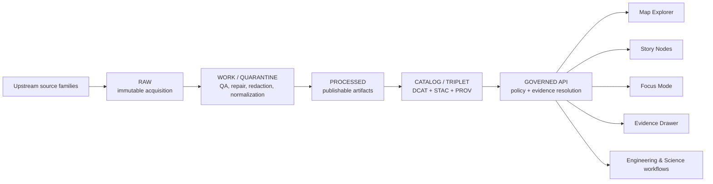

<!-- [KFM_META_BLOCK_V2]
doc_id: kfm://doc/readme-root-v2
title: Kansas Frontier Matrix
type: standard
version: v1
status: draft
owners: TBD (verify CODEOWNERS)
created: 2026-03-06
updated: 2026-03-06
policy_label: public
related: [/.github, /apps, /contracts, /data, /docs, /infra, /packages, /policy, /schemas, /tests, /tools]
tags: [kfm, readme, governance, evidence, gis, provenance]
notes: [Repo-root README synthesized from the KFM unified manual, the uploaded source library, and the current public repo surface.]
[/KFM_META_BLOCK_V2] -->

<a id="top"></a>

# Kansas Frontier Matrix
Governed, evidence-first infrastructure for exploring Kansas through place, time, narrative, analysis, and inspectable evidence.

> **Status:** draft  
> **Owners:** TBD (`verify CODEOWNERS`)  
>       
> **Quick links:** [Purpose](#purpose) · [Repo fit](#repo-fit) · [Non-negotiables](#non-negotiables) · [Current repo surface](#current-repo-surface) · [Quickstart](#quickstart) · [Source library map](#source-library-integration-map)

## Purpose
KFM is a **map-first, time-aware, policy-governed knowledge system** for Kansas. It turns heterogeneous sources—historical records, maps, narrative evidence, environmental data, remote sensing, derived analytics, and governed AI assistance—into inspectable public surfaces without losing provenance.

**CONFIRMED**
- KFM is designed as a **governed, evidence-first, map-first, and time-aware** system.
- Public-facing access is intended to cross a **trust membrane** through governed APIs and policy checks.
- User-visible claims are expected to resolve to **EvidenceRefs / EvidenceBundles** or the system must **abstain**.

**PROPOSED**
- This README acts as the repo-root contract for how those ideas should shape the monorepo, contributor behavior, and the first buildable vertical slice.
- The uploaded source library is used here as a design scaffold for data, GIS, metadata, UI, API, engineering, analysis, and simulation choices.

**UNKNOWN**
- Current branch implementation depth, deployed services, exact CI rules, and merge-blocking checks are not proven by this file alone and must be verified locally.

## Repo fit
**Path:** `/README.md`  
**Repo role:** root orientation document for the entire monorepo.  
**Upstream:** source systems, connectors, ingestion jobs, normalization pipelines, policy decisions, and documentation standards.  
**Downstream:** Map Explorer, Story Nodes, Focus Mode, Evidence Drawer, engineering/science workflows, and governed promotion lanes.

KFM should be read as a **pipeline → catalog → API → UI** system, not as a loose set of apps. The repo root is where contributors should learn the operating model before they descend into specific services or directories.

## Evidence posture
KFM uses three truth labels throughout its docs and code-adjacent planning:

| Label | Meaning here |
|---|---|
| **CONFIRMED** | Supported by the uploaded KFM manual or by a direct check of the current public repo root. |
| **PROPOSED** | Recommended implementation posture or repo discipline synthesized from the uploaded source library. |
| **UNKNOWN** | Not yet verified on the current branch, environment, or deployment. |

This README deliberately prefers **visible uncertainty over plausible fiction**.

## What KFM is
KFM is:
- a governed geospatial platform
- a provenance-preserving data pipeline
- a catalog and evidence-resolution system
- a set of user surfaces for map, time, story, and governed question answering
- a foundation for Kansas historical, environmental, scientific, and analytical work

KFM is **not**:
- a free-form chatbot
- a generic upload-and-forget data portal
- a direct browser-to-database GIS stack
- a publication path that can skip rights, sensitivity, validation, or provenance checks
- a repo where docs can drift away from behavior without consequence

## Non-negotiables
The following are architectural laws, not stylistic preferences.

| Invariant | Status | What it means in practice | What must never happen |
|---|---|---|---|
| Truth path | CONFIRMED | Data moves through `RAW → WORK/QUARANTINE → PROCESSED → CATALOG/TRIPLET → PUBLISHED`. | Ad hoc publication from notebooks, temp files, or analyst-only transforms. |
| Trust membrane | CONFIRMED | Clients do not touch storage or databases directly; all access crosses governed APIs plus policy. | UI or external clients bypassing policy via direct store access. |
| Cite-or-abstain | CONFIRMED | Story claims, map claims, and Focus answers resolve to evidence or abstain. | Plausible uncited output presented as fact. |
| Default-deny / fail-closed | CONFIRMED | Unclear rights, unresolved sensitivity, failed validation, or broken evidence blocks release. | “Best effort” publication under ambiguity. |
| Deterministic identity | CONFIRMED | Comparable inputs and the same spec yield the same stable identity and spec hash. | Unstable versions or ambiguous lineage. |
| Evidence as interface | CONFIRMED | Evidence is operational and resolvable, not decorative. | Provenance trapped in dead files or disconnected notes. |
| Separation of duty | CONFIRMED | Submission and policy-significant approval cross a review boundary. | Self-approval of sensitive releases. |
| Docs as production surface | CONFIRMED | Behavior changes update docs, templates, tests, and runbooks together. | Silent drift between system behavior and written procedure. |

## Reference flow
Promotion is not a file copy. It is a governed state transition.


```mermaid
flowchart LR
    A[Upstream source families] --> B[RAW<br/>immutable acquisition]
    B --> C[WORK / QUARANTINE<br/>QA, repair, redaction, normalization]
    C --> D[PROCESSED<br/>publishable artifacts]
    D --> E[CATALOG / TRIPLET<br/>DCAT + STAC + PROV]
    E --> F[GOVERNED API<br/>policy + evidence resolution]
    F --> G[Map Explorer]
    F --> H[Story Nodes]
    F --> I[Focus Mode]
    F --> J[Evidence Drawer]
    F --> K[Engineering & Science workflows]
```

### Product surfaces
| Surface | Status | Purpose |
|---|---|---|
| Map Explorer | CONFIRMED | Layered geographic exploration with time controls and evidence access. |
| Evidence Drawer | CONFIRMED | Open evidence, rights, version, and provenance from visible map or story claims. |
| Story Nodes | CONFIRMED | Narrative publishing bound to resolvable citations and review state. |
| Focus Mode | CONFIRMED | Governed Q&A with receipts, hard citation verification, and abstention behavior. |
| Engineering & Science workflows | PROPOSED | Model, simulate, compare, and publish derived analytical outputs without bypassing the same governance plane. |

[Back to top](#top)

## Accepted inputs
This repo should accept inputs that can participate in the truth path and evidence model.

| Input type | Examples | Typical landing zone | Notes |
|---|---|---|---|
| Historical tabular data | census slices, land patents, registries, tabular archives | `RAW/` then `WORK/` | Must preserve source metadata and acquisition receipt. |
| Vector geodata | county boundaries, PLSS, routes, parcels, sites, event polygons | `RAW/` then `PROCESSED/` | Standardize schemas and IDs before promotion. |
| Raster geodata | DEMs, land cover, climate grids, satellite scenes, hazard rasters | `RAW/` then `PROCESSED/` | Prefer cloud-friendly formats and stable checksums. |
| Narrative evidence | archival documents, oral histories, newspapers, story drafts | `RAW/` then evidence extraction flow | Rights and sensitivity review may be required before publication. |
| Metadata and lineage records | DCAT, STAC, PROV, sidecars, manifests | `CATALOG/` | Cross-link IDs so EvidenceRefs resolve. |
| Derived outputs | analytics, statistics, anomaly layers, model products | `PROCESSED/` or `WORK/` | Must remain linked to observational basis and derivation history. |
| Validation artifacts | QA reports, accuracy tables, review notes, test fixtures | `WORK/`, `docs/`, `tests/` | These are part of governance, not disposable byproducts. |

## Exclusions
The following do **not** belong in KFM’s governed publication path.

| Exclusion | Why it stays out | Where it goes instead |
|---|---|---|
| Secrets, tokens, credentials | Never commit secrets to the repo. | Secret managers / environment configuration. |
| Direct client-to-store access patterns | Breaks the trust membrane and bypasses policy. | Governed API routes and policy-aware services. |
| Publishable artifacts without checksums, receipts, and catalog records | Cannot be audited or reproduced. | Keep in `WORK/QUARANTINE` until complete. |
| Uncited story claims or unverified Focus answers | Violates cite-or-abstain. | Draft or failed run outputs; not publishable. |
| Ambiguous-rights or policy-restricted public data | Rights and sensitivity uncertainty must fail closed. | Quarantine, redacted derivative, or metadata-only record. |
| Documentation that implies live implementation without verification | Breaks trust through overclaiming. | Mark `UNKNOWN`, add verification steps, then update. |

## Current repo surface
**CONFIRMED at the public repo root:** the monorepo currently exposes the following top-level folders and files:

```text
Kansas-Frontier-Matrix/
├── .github/
├── apps/
├── configs/
├── contracts/
├── data/
├── docs/
├── examples/
├── infra/
├── migrations/
├── packages/
├── policy/
├── schemas/
├── scripts/
├── tests/
├── tools/
├── CHANGELOG.md
├── CODE_OF_CONDUCT.md
├── CONTRIBUTING.md
├── LICENSE
├── README.md
└── SECURITY.md
```

### What each top-level area is for
| Path | Role in the repo |
|---|---|
| `.github/` | GitHub-native control plane for workflows, templates, review routing, and merge discipline. |
| `apps/` | Runnable services and user-facing applications. |
| `configs/` | Shared configuration that should not hard-code secrets. |
| `contracts/` | API contracts, schemas, vocabularies, and machine-enforced interface surfaces. |
| `data/` | Data specs, registries, examples, manifests, and other governed data-facing artifacts. |
| `docs/` | Architecture docs, ADRs, standards, runbooks, and long-form guidance. |
| `examples/` | Safe example material and demonstration assets. |
| `infra/` | Deployment, platform, and operations definitions. |
| `migrations/` | Database or data-structure migrations. |
| `packages/` | Shared libraries and internal core modules. |
| `policy/` | Policy-as-code, fixtures, and policy tests. |
| `schemas/` | Schemas that back validation, ingestion, and contract enforcement. |
| `scripts/` | Automation and helper scripts. |
| `tests/` | Unit, integration, policy, and end-to-end tests. |
| `tools/` | Validators, CLIs, link checkers, and other support tooling. |

**UNKNOWN:** deeper directory contents, current branch-specific workflow inventory, and exact runtime coverage still need branch-local verification.

[Back to top](#top)

## Quickstart
The safest root-level quickstart is **verification-first**. Before describing anything as implemented, verify the current branch.

```bash
# clone if needed
# git clone https://github.com/bartytime4life/Kansas-Frontier-Matrix.git
# cd Kansas-Frontier-Matrix

# identify the exact revision you are looking at
git rev-parse HEAD

# inspect the top-level and near-top-level shape
find . -maxdepth 2 -type d | sort

# inspect GitHub workflow inventory, if present
find .github -maxdepth 3 -type f | sort
ls -la .github/workflows 2>/dev/null || true

# look for core governance primitives
grep -RIn "spec_hash\|EvidenceRef\|EvidenceBundle\|policy_label\|opa\|rego" . || true

# inspect likely contract and policy surfaces
find contracts policy schemas tests -maxdepth 3 -type f 2>/dev/null | sort
```

### Answer these questions before documenting the branch as real
1. What exists on this branch?
2. Which checks actually block merges?
3. Which services are implemented versus merely designed?
4. Which contracts, policies, and validations are enforced today?

## Working model for contributors
### Build order
A sensible thin-slice implementation order remains:
1. spec hashing and controlled vocabulary validation
2. catalog validators and link checking
3. policy pack plus fixture tests
4. evidence resolver service
5. dataset registry and discovery endpoints
6. Map Explorer baseline with Evidence Drawer
7. Story publishing with citation gates
8. Focus Mode MVP with evaluation harness

### First-release discipline
Prefer **one fully governed vertical slice** over many half-governed features.

A good opening slice is:
- one time-aware boundary system
- one promoted dataset family
- one map layer that opens evidence
- one public story that resolves every claim
- one Focus flow that cites correctly or abstains

## Domain and source sequencing
The repo should grow outward from trust foundations rather than inward from flashy features.

| Sequence | Status | What to prioritize |
|---|---|---|
| Foundations | CONFIRMED | IDs, catalog triplet, policy, EvidenceRef/EvidenceBundle, one complete truth path. |
| Historical core | CONFIRMED | Census-class sources, land patents, PLSS, rail, and archival narrative evidence. |
| Environmental base | CONFIRMED | Soils, land cover, hydrology, hazards, air, climate context. |
| Domain expansion | CONFIRMED | Biodiversity, wildlife, archaeology, public health, additional remote sensing. |
| Advanced derived layers | PROPOSED | Anomaly models, calibrated remote sensing products, simulation overlays, and 3D story surfaces. |

## Engineering rules
1. Make **small, reversible, additive** changes.
2. Update docs when behavior changes.
3. Treat contracts as production artifacts.
4. Promote data only with receipts, checksums, validation, and catalog links.
5. Fail closed on policy, validation, or evidence uncertainty.
6. Keep UI and external clients behind the governed boundary.
7. Preserve observational versus modeled distinctions in data products.
8. Never let convenience outrun provenance.

## Definition of done / promotion checklist
Use this as the minimum repo-root gate list for serious work.

- [ ] Spec hashing is stable across environments for comparable inputs.
- [ ] Controlled vocabularies and schemas validate in CI.
- [ ] DCAT/STAC/PROV links resolve and broken links block merges.
- [ ] Policy tests default-deny and cover known restricted scenarios.
- [ ] EvidenceRefs resolve to policy-safe EvidenceBundles end to end.
- [ ] Map Explorer shows evidence, version, and rights information from the UI.
- [ ] Story publication requires review state and resolvable citations.
- [ ] Focus Mode either cites correctly with receipts or abstains.
- [ ] Rights and sensitivity labels are present for publishable data.
- [ ] Runbooks and docs were updated alongside behavior changes.

## FAQ
### Why is KFM stricter than a normal map portal?
Because KFM is intended to be a **trust system**, not just a presentation layer. It treats provenance, policy, and evidence as runtime requirements.

### Why is the README careful about saying `UNKNOWN`?
Because the repo can change faster than architecture prose. KFM’s own operating posture rejects unsupported claims about live implementation state.

### Why are catalogs and evidence objects treated as first-class?
Because discovery, reproducibility, review, and public trust all depend on resolvable metadata and lineage, not just on attractive maps.

### Why keep observational data distinct from modeled or AI-derived outputs?
Because KFM must preserve the difference between what was observed, what was inferred, and what was synthesized.

### Why is the first release intentionally narrow?
Because one fully governed slice proves the architecture honestly. Many half-governed slices only prove that governance was bypassed.

## Source library integration map
This README is rooted in the uploaded KFM manual, but it also uses the broader uploaded source library as a structured design aid. The rule is simple: **the KFM manual defines project posture; the broader library informs implementation patterns, not live-repo claims.**

<details>
<summary><strong>A. Governing KFM project source</strong></summary>

| Source | How it informs this README |
|---|---|
| `KFM_Unified_Master_Manual_FULL.pdf` | Primary project synthesis; used for the core operating model, truth path, trust membrane, evidence posture, and source sequencing. |
</details>

<details>
<summary><strong>B. Metadata, provenance, time, linked data, and knowledge posture</strong></summary>

| Source | How it informs this README |
|---|---|
| `Introduction to Metadata.pdf` | Reinforces metadata as an enduring asset, not an afterthought. |
| `Practical Semantic Web and Linked Data Applications.pdf` | Supports graph-aware, cross-linked DCAT/STAC/PROV thinking and semantic interoperability. |
| `developing-time-oriented-database-applications-in-sql.pdf` | Strengthens time-aware schema and temporal query posture. |
| `Reverse Engineering of Real-Time System Models from Event Trace Recordings.pdf` | Informs auditable model reconstruction, traceability, and evaluation thinking. |
| `Crafting a Compiler.pdf` | Supports staged transformation, formal interfaces, and fail-closed verification discipline. |
</details>

<details>
<summary><strong>C. GIS, cartography, geospatial databases, and navigation</strong></summary>

| Source | How it informs this README |
|---|---|
| `a-primer-of-gis-fundamental-geographic-and-cartographic-concepts.pdf` | Supports map-first framing and geographic representation discipline. |
| `GIS in Sustainable Urban Planning and Management.pdf` | Informs planning-support, equity-aware, and management-oriented GIS thinking. |
| `mastering-postgis-modern-ways-to-create-analyze-and-implement-spatial-data.pdf` | Supports PostGIS-centered geospatial persistence and processing posture. |
| `Earth, Space, and Environmental Science Explorations with ArcGIS Pro ed2.pdf` | Adds applied GIS analysis and environmental workflow patterns. |
| `Map Reading & Land Navigation.pdf` | Reinforces practical wayfinding, coordinate, and field-navigation awareness. |
| `Understanding_Map_Projections.pdf` | Strengthens projection awareness and cartographic correctness. |
</details>

<details>
<summary><strong>D. Remote sensing, earth observation, and environmental analysis</strong></summary>

| Source | How it informs this README |
|---|---|
| `Cloud-Based Remote Sensing with Google Earth Engine-Fundamentals and Applications.pdf` | Supports cloud-based remote sensing, large-scale image collections, and analysis workflows. |
| `Earth, Space, and Environmental Science Explorations with ArcGIS Pro ed2.pdf` | Adds environmental exploration workflows and hazard-oriented GIS examples. |
| `Applications of MATLAB in Science & Engineering.pdf` | Contributes scientific modeling patterns for analytical modules. |
| `MATLAB Applications for the Practical Engineer.pdf` | Supports engineering simulation and applied numerical workflows. |
</details>

<details>
<summary><strong>E. Data engineering, pipelines, analytics, machine learning, and AI</strong></summary>

| Source | How it informs this README |
|---|---|
| `The Data Engineering Cookbook.pdf` | Informs practical data plumbing, repeatable pipelines, and operations thinking. |
| `Open-Source-Data-Pipelines-red-hat-developer-1.pdf` | Supports pipeline-oriented architecture decisions. |
| `Practical-Guide-to-Pandas-for-Data-Science.pdf` | Helps shape pragmatic tabular analysis and data cleaning posture. |
| `Text Mining with R_ A Tidy Approach.pdf` | Informs corpus mining and narrative extraction possibilities. |
| `Data Mining Concepts & applictions.pdf` | Adds clustering, classification, anomaly detection, and pattern-discovery perspective. |
| `python-machine-learning-a-crash-course-for-beginners-to-understand-machine-learning-artificial-intelligence-neural-networks-and-deep-learning-with-scikit-learn-tensorflow-and-keras.pdf` | Supports ML experimentation language around classification, regression, and validation. |
| `AI_Concepts_Using_Python.pdf` | Adds AI concept framing for the analytics layer. |
| `Python & Coding Theory.pdf` | Contributes algorithmic rigor and problem-solving discipline. |
| `Introduction to Python for Computational Science and Engineering - book.pdf` | Strengthens scientific computing posture and numerical experimentation. |
</details>

<details>
<summary><strong>F. Web, UI, API, frontend, and interaction design</strong></summary>

| Source | How it informs this README |
|---|---|
| `Undisturbed REST_v1.pdf` | Supports API-first, long-lived, governed interface design. |
| `learn-to-code-html-and-css-develop-and-style-websites.pdf` | Grounds the basic web structure and presentation layer. |
| `Programming TypeScript.pdf` | Supports strongly typed frontend and backend interface work. |
| `fullstack-react-the-complete-guide-to-reactjs-and-friends.pdf` | Informs React-based UI architecture and component thinking. |
| `fullstack-react-with-typescript.pdf` | Adds React + TypeScript integration patterns. |
| `Building User Interfaces for Modern Web Applications_ React Programming.pdf` | Supports modern component-based web UI composition. |
| `designing-interfaces.pdf` | Reinforces interface patterns, layout, navigation, and progressive disclosure. |
| `create-graphical-user-interfaces-with-python.pdf` | Adds approachable GUI composition ideas for tools or internal utilities. |
| `Developing Graphics Frameworks with Python & OpenGL.pdf` | Informs richer visualization and future graphical or 3D work. |
</details>

<details>
<summary><strong>G. Software architecture, engineering discipline, security, and build practice</strong></summary>

| Source | How it informs this README |
|---|---|
| `97_Things_Every_Programmer_Should_Know.pdf` | Reinforces code hygiene, build cleanliness, and practical engineering habits. |
| `97-things-every-software-architect-should-know.pdf` | Strengthens boundary thinking, tradeoff awareness, and architecture stewardship. |
| `design-it-from-programmer-to-software-architect.pdf` | Supports risk-driven architecture, stakeholder empathy, and design documentation. |
| `black-hat-python-python-programming-for-hackers-and-pentesters.pdf` | Adds adversarial thinking and caution around tooling and security surfaces. |
| `Crafting a Compiler.pdf` | Reinforces contracts, staged transformation, and validation as engineering behavior. |
</details>

<details>
<summary><strong>H. Programming paradigms, scientific development, and implementation literacy</strong></summary>

| Source | How it informs this README |
|---|---|
| `mostly-adequate-guide to functional programming.pdf` | Contributes compositional and functional design discipline. |
| `sketchy-lisp-an-introduction-to-functional-programming-in-scheme-3rd-edition.pdf` | Supports functional thinking and symbolic processing intuition. |
| `Introduction to Python for Computational Science and Engineering - book.pdf` | Encourages reproducible scientific scripting and exploration. |
| `Python & Coding Theory.pdf` | Adds algorithmic problem framing and careful reasoning. |
| `Applications of MATLAB in Science & Engineering.pdf` | Supports quantitative modeling literacy. |
| `MATLAB Applications for the Practical Engineer.pdf` | Supports engineering-oriented numerical implementation patterns. |
</details>

<details>
<summary><strong>I. Knowledge posture, invention, and long-horizon project culture</strong></summary>

| Source | How it informs this README |
|---|---|
| `Dare to Invent the Future.pdf` | Reinforces the project’s intellectual ambition, public-purpose framing, and builder mindset. |
</details>

[Back to top](#top)

## Notes for maintainers
- Keep this README aligned with the strongest KFM source material.
- When a claim becomes implementation fact, verify it on the current branch and update the corresponding `UNKNOWN` or `PROPOSED` language.
- When a workflow, contract, surface, or policy changes behavior, update this README as part of the same change.
- Do not let a polished README become a hidden policy bypass.
