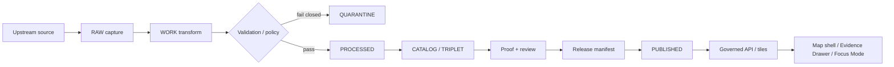
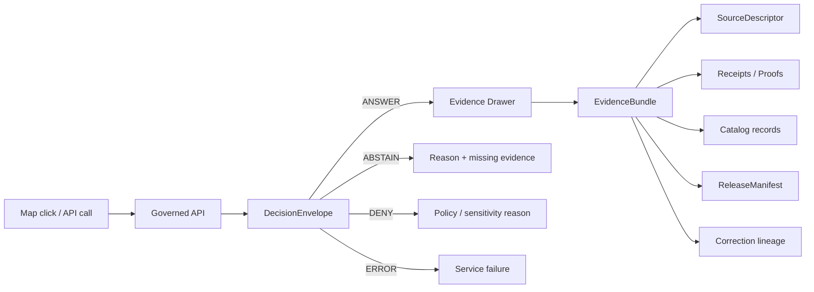

# Kansas Frontier Matrix

A governed, evidence-first, map-first, time-aware spatial knowledge and publication system for inspectable Kansas-first claims.

> [!NOTE]
> **Status:** `draft`
> **Owners:** `TODO: maintainer roster not yet declared in this revision`
> **Authority:** `PROPOSED / NEEDS VERIFICATION`
> **Repo fit:** `README.md` at repository root
> **Candidate proof slice:** Ecology / Hydrology governed ingestion starter; proof-slice paths and Make targets remain `NEEDS VERIFICATION`
> **Review burden:** Maintainers should verify Directory Rules, schema-home ADRs, policy gates, source rights, validation status, release state, signing posture, and rollback paths before treating this README as active canon.

[](#)
[](#)
[](#)
[](#)
[](#)
[](#)
[](./LICENSE)

## Quick jumps

- [What KFM is](#what-kfm-is)
- [Status legend](#status-legend)
- [Trust law](#trust-law)
- [Repository fit](#repository-fit)
- [Responsibility roots](#responsibility-roots)
- [Domain coverage](#domain-coverage)
- [Core object families](#core-object-families)
- [Candidate proof slice](#candidate-proof-slice)
- [Proof-slice path map](#proof-slice-path-map)
- [Candidate quick start](#candidate-quick-start)
- [Run profile defaults](#run-profile-defaults)
- [Signing and verifying](#signing-and-verifying)
- [Validator gates](#validator-gates)
- [Negative-path fixtures](#negative-path-fixtures)
- [Accepted inputs](#accepted-inputs)
- [Exclusions](#exclusions)
- [Publication guardrails](#publication-guardrails)
- [Validation and release](#validation-and-release)
- [Documentation and project files](#documentation-and-project-files)
- [Contributing](#contributing)
- [Open verification](#open-verification)
- [License and rights](#license-and-rights)

---

## What KFM is

Kansas Frontier Matrix, or **KFM**, is a governed spatial evidence system. It is designed to help people inspect how evidence becomes a map feature, a story, a dashboard value, an API response, a release artifact, or a bounded AI answer.

The durable and auditable public unit of value is the **inspectable claim**: a public or semi-public statement whose evidence, source role, spatial scope, temporal scope, policy posture, review state, release state, and correction lineage can all be inspected.

KFM is **not** just a map viewer, database, AI assistant, graph, report generator, tile server, or GIS exercise. Maps, tiles, graphs, summaries, vector indexes, scenes, dashboards, exports, and AI answers are *carriers of evidence*. They are not sovereign truth.

> [!IMPORTANT]
> KFM treats publication as a governed state transition — not a file move, a successful workflow, or a model output. A green CI run is necessary, but never sufficient.

---

## Status legend

KFM documentation labels the strength of every consequential claim. Apply the narrowest truthful label.

| Label | Meaning |
| --- | --- |
| `CONFIRMED` | Verified this session from attached docs, repo evidence, tests, logs, or generated artifacts. |
| `PROPOSED` | Design, path, placement, or recommendation not yet verified in implementation. |
| `NEEDS VERIFICATION` | Checkable, but not yet checked strongly enough to act as fact. |
| `UNKNOWN` | Not resolvable without more evidence. |

Memory is not evidence. Recollection, guessed paths, likely behavior, and generic best practice are not facts.

---

## Trust law

KFM preserves a governed lifecycle by default:

```
RAW -> WORK / QUARANTINE -> PROCESSED -> CATALOG / TRIPLET -> PUBLISHED
```

Public clients and normal UI surfaces must use governed interfaces and released artifacts. They must not directly read raw stores, work areas, quarantine material, unpublished candidates, internal canonical stores, source-system side effects, secrets, or direct model runtime outputs.


```mermaid
flowchart LR
  A[Upstream source] --> B[RAW capture]
  B --> C[WORK transform]
  C --> D{Validation / policy}
  D -->|fail closed| E[QUARANTINE]
  D -->|pass| F[PROCESSED]
  F --> G[CATALOG / TRIPLET]
  G --> H[Proof + review]
  H --> I[Release manifest]
  I --> J[PUBLISHED]
  J --> K[Governed API / tiles]
  K --> L[Map shell / Evidence Drawer / Focus Mode]
```

Every consequential public-facing claim should resolve through this chain:

```
Claim -> EvidenceRef -> EvidenceBundle -> SourceDescriptor / Receipt / Catalog / Policy / Review / Release / Correction
```


```mermaid
flowchart LR
  Click[Map click / API call] --> API[Governed API]
  API --> Env[DecisionEnvelope]
  Env -->|ANSWER| Drawer[Evidence Drawer]
  Env -->|ABSTAIN| Reason[Reason + missing evidence]
  Env -->|DENY| Policy[Policy / sensitivity reason]
  Env -->|ERROR| Service[Service failure]
  Drawer --> Bundle[EvidenceBundle]
  Bundle --> Source[SourceDescriptor]
  Bundle --> Receipt[Receipts / Proofs]
  Bundle --> Catalog[Catalog records]
  Bundle --> Release[ReleaseManifest]
  Bundle --> Correction[Correction lineage]
```

AI is interpretive only. `EvidenceBundle`, policy, review, and release state outrank generated language. Governed AI returns one of four finite outcomes — `ANSWER`, `ABSTAIN`, `DENY`, or `ERROR` — never an unbounded fluent reply.

---

## Repository fit

This file is the public landing page and orientation document for the repository root.

| Relationship | Path | Status |
| --- | --- | --- |
| This document | `README.md` | `CONFIRMED present at root` |
| Human-facing doctrine and architecture | `docs/` | `CONFIRMED root folder; contents NEEDS VERIFICATION` |
| Machine-readable governance registers | `control_plane/` | `CONFIRMED root folder; contents NEEDS VERIFICATION` |
| Semantic contracts | `contracts/` | `CONFIRMED root folder; contents NEEDS VERIFICATION` |
| Machine-checkable schemas | `schemas/` | `CONFIRMED root folder; contents NEEDS VERIFICATION` |
| Policy-as-code and policy docs | `policy/` | `CONFIRMED root folder; contents NEEDS VERIFICATION` |
| Compatibility policies root | `policies/` | `CONFIRMED present alongside policy/; needs ADR per Directory Rules` |
| Tests and fixtures | `tests/`, `fixtures/` | `CONFIRMED root folders; coverage NEEDS VERIFICATION` |
| Apps, packages, connectors, pipelines | `apps/`, `packages/`, `connectors/`, `pipelines/`, `pipeline_specs/` | `CONFIRMED root folders; contents NEEDS VERIFICATION` |
| Lifecycle data and emitted proof objects | `data/`, `release/`, `runtime/`, `artifacts/` | `CONFIRMED root folders; contents NEEDS VERIFICATION` |
| Operational helpers | `tools/`, `scripts/`, `infra/`, `configs/`, `migrations/`, `examples/` | `CONFIRMED root folders; contents NEEDS VERIFICATION` |
| Observed enforcement root | `enforcement/` | `CONFIRMED present; not in canonical Directory Rules tree — needs ADR or migration note` |

Upstream governing inputs include Directory Rules, active ADRs, KFM doctrine, source registries, policy gates, and repo evidence. Downstream consumers include documentation indexes, contributor workflows, domain-lane READMEs, governed APIs, validation scripts, and release procedures.

> [!IMPORTANT]
> Domain lanes should not become new root folders by default. Place hydrology, soil, fauna, flora, habitat, geology, atmosphere, roads-rail-trade, settlements-infrastructure, archaeology, hazards, agriculture, and people / DNA / land work under the proper responsibility roots — for example `docs/domains/<domain>/`, `schemas/contracts/v1/domains/<domain>/`, `policy/domains/<domain>/`, `tests/domains/<domain>/`, and `data/{raw,work,quarantine,processed,catalog,triplets,published}/<domain>/`.

---

## Responsibility roots

KFM root folders are *authority boundaries*, not convenience buckets.

| Root | Responsibility | Examples of accepted contents |
| --- | --- | --- |
| `docs/` | Human-facing control plane | Doctrine, architecture, ADRs, runbooks, standards, domain docs, source docs, registers |
| `control_plane/` | Operational governance maps | Document registry, object-family registry, source authority register, release-state register |
| `contracts/` | Semantic meaning | Evidence, source, runtime, release, correction, and domain contract docs |
| `schemas/` | Machine-checkable shape | JSON Schemas, schema tests, valid and invalid schema fixtures |
| `policy/` | Admissibility and release rules | Rights, sensitivity, promotion, runtime, domain, and release policy |
| `tests/` | Enforceable verification | Contract, schema, policy, validator, pipeline, API, UI, e2e, and runtime-proof tests |
| `fixtures/` | Test evidence | Valid, invalid, golden, synthetic, and domain fixtures |
| `tools/` | Governed helper surface | Validators, attestation helpers, deterministic utility scripts, local proof tooling |
| `scripts/` | Thin operator entrypoints | Explicit wrappers for contributor-visible commands |
| `apps/` | Deployable systems | Governed API, explorer web app, review console, CLI, workers, admin surfaces |
| `packages/` | Shared implementation | Evidence resolver, hashing, validators, source utilities, domain helpers |
| `connectors/` | Source access code | Source-specific ingestion adapters with rights and policy checks |
| `pipelines/` and `pipeline_specs/` | Processing and orchestration | Ingest, transform, validation, cataloging, tiling, receipt, and dry-run specs |
| `data/` | Lifecycle data and operational memory | Raw, work, quarantine, processed, catalog, triplets, registry, receipts, proofs, published |
| `release/` | Release operations | Release candidates, manifests, promotion decisions, rollback cards |
| `runtime/`, `infra/`, `configs/`, `migrations/` | Operations | Deployment, local runtime, infrastructure, configuration, and migration support |
| `examples/` | Safe examples | Public-safe examples, demos, and tiny teaching fixtures |
| `artifacts/` | Optional compatibility root | Generated or compatibility artifacts only when tightly scoped and documented |
| `policies/` | Compatibility root | Co-exists with `policy/`; needs an ADR or migration note clarifying which is canonical |
| `enforcement/` | Observed root, status `NEEDS VERIFICATION` | Not in the canonical Directory Rules tree; an ADR should declare its responsibility, scope, and relationship to `policy/` and `tests/` |

Compatibility roots such as `ui/`, `web/`, `jsonschema/`, `policies/`, `styles/`, and `viewer_templates/` may also exist in a real checkout. If they do, each should explain whether it is canonical, legacy, generated, mirrored, or awaiting migration.

---

## Domain coverage

KFM is organized around governed *domain lanes*. Each lane is `PROPOSED implementation / CONFIRMED doctrine` unless verified otherwise; lanes share the same lifecycle, object families, evidence drawer, and publication gates.

| Domain lane | Scope highlights | Primary sensitivity posture |
| --- | --- | --- |
| Spatial foundation, cartography, reference systems | CRS, datums, projections, geometry validity, generalization, base layers | Low — supports all other lanes |
| Hydrology | Watersheds, HUCs, reaches, gauges, flow / level / quality observations, NFHL context | Moderate — flood and infrastructure caveats |
| Soil | Map units, components, horizons, properties, hydrologic groups, suitability, pedons | Low – moderate |
| Habitat | Land cover, ecological systems, suitability, connectivity, corridors, restoration | Moderate — site-protection rules apply |
| Fauna | Taxa, occurrences, ranges, seasonal ranges, sensitive sites, mortality, disease, invasives | High for sensitive sites — geoprivacy required |
| Flora | Plant taxa, specimens, occurrences, rare plants, vegetation communities, phenology | High for rare plants |
| Agriculture | Cropland, soils, irrigation, weather / soil moisture, drought, conservation practices | Moderate — economic suppression flags |
| Geology and natural resources | Geologic units, boreholes, geophysics, mining / oil / gas, terrain | Moderate — landowner-sensitive |
| Atmosphere, air, and climate | Air quality, weather, smoke, climate normals, model context | Moderate |
| Hazards | Storm events, NWS context, NFHL, earthquakes, wildfire smoke, drought, declarations | Moderate — non-emergency disclaimers required |
| Roads, rail, and trade routes | Modern and historic transport networks, facilities, restrictions, trade corridors | Moderate — sensitive cultural corridors |
| Settlements, cities, and infrastructure | Place identity, annexation, townsites, infrastructure, services, FEMA context | Moderate — critical infrastructure |
| Archaeology and cultural heritage | Sites, surveys, artifacts, features, remote sensing, 3D documentation, steward review | High — generalize, redact, or deny by default |
| People, genealogy, DNA, and land ownership | Person assertions, genealogy hypotheses, deeds, parcels, ownership intervals, DNA evidence | High — living-person and DNA fail closed |
| Frontier demography, economy, settlement, land, and time matrix | County-year panels, frontier definitions, geography versions, crosswalks | Moderate — vintage / suppression aware |
| Planetary, 3D, digital twin, synthetic spatial systems | Terrain, 3D Tiles, glTF, point clouds, synthetic surfaces, scene manifests | Conditional — burden-bound |

> [!CAUTION]
> Domain lanes never replace evidence, catalog, policy, or release authority. A domain lane organizes *responsibility* for a slice of the world; it does not own truth on its own.

---

## Core object families

These object families are KFM's main trust vocabulary. Exact field names and schema homes must be verified against repository contracts and schemas before implementation claims are made.

| Object family | Purpose | Public consequence |
| --- | --- | --- |
| `SourceDescriptor` | Identifies source role, authority, terms, cadence, rights, and caveats | Prevents weak or unsuitable sources from being treated as authoritative |
| `EvidenceRef` | Points from a claim or feature to supporting evidence | Gives UI / API surfaces a resolvable evidence handle |
| `EvidenceBundle` | Packages source, receipt, catalog, policy, review, and release context | Lets users inspect why a claim is visible or why KFM abstains |
| `DecisionEnvelope` / `RuntimeResponseEnvelope` | Carries finite outcomes (`ANSWER`, `ABSTAIN`, `DENY`, `ERROR`) | Prevents fluent uncertainty from masquerading as truth |
| `RunReceipt` / `AIReceipt` | Records process memory for pipeline and model-mediated actions | Supports audit without making receipts canonical truth |
| `ValidationReport` | Records schema, policy, source, and integrity check outcomes | Makes the validator's verdict inspectable |
| `CatalogMatrix` / `LayerManifest` / `GeoManifest` | Describes catalog closure and released map-ready derivatives | Keeps tiles and layers downstream of evidence and release state |
| `ReleaseManifest` / `PromotionDecision` | Records governed publication state | Makes release a reviewable transition, not a file move |
| `CorrectionNotice` / `RollbackCard` | Records correction, withdrawal, and rollback lineage | Keeps public trust repairable and inspectable |
| `ReviewRecord` | Captures steward, domain, policy, or maintainer review | Distinguishes "validated" from "approved for release" |

---

## Candidate proof slice

This README carries a candidate governed ingestion and attestation proof slice for KFM's ecology and hydrology lanes.

The starter proof slice is intended to include:

- A synthetic HUC12 ⇄ COMID crosswalk.
- A tiny PMTiles v3 delta slice.
- Local validation.
- Negative-path DLQ fixtures.
- Run receipts.
- Sigstore / cosign signing hooks.

> [!WARNING]
> The hydrology values in the proof slice are **fixture-only data** for pipeline proof. Replace them with source-derived NHDPlus / WBD output before any production publication.

The proof slice is *not* a production publication lane by itself. It exists to prove that source-like data can move through validation, policy, attestation, receipt, signing, and fail-closed behavior before any public claim or map layer is treated as released.

---

## Proof-slice path map

The following paths are carried forward as candidate proof-slice homes. They remain `NEEDS VERIFICATION` until confirmed in the actual repository.

| Area | Candidate path | Status |
| --- | --- | --- |
| Run defaults | `configs/run_profile.json` | `NEEDS VERIFICATION` |
| Validator | `tools/validators/ecology/validate_run.py` | `NEEDS VERIFICATION` |
| Cosign helper | `tools/validators/ecology/sign_and_verify.sh` | `NEEDS VERIFICATION` |
| Hydrology fixture | `data/fixtures/hydrology/huc12_comid_min.json` | `NEEDS VERIFICATION` |
| PMTiles fixture | `data/fixtures/tiles/pmtiles_delta_min.pmtiles` | `NEEDS VERIFICATION` |
| TileJSON manifest | `data/fixtures/tiles/pmtiles_delta_min.tilejson.json` | `NEEDS VERIFICATION` |
| EvidenceBundle | `data/proofs/evidencebundle.json` | `NEEDS VERIFICATION` |
| Decision log | `data/proofs/decision_log.json` | `NEEDS VERIFICATION` |
| Run receipt | `data/proofs/run_receipt.json` | `NEEDS VERIFICATION` |
| Negative fixtures | `data/fixtures/dlq_inputs/` | `NEEDS VERIFICATION` |
| DLQ report | `data/dlq/dlq_report.json` | `NEEDS VERIFICATION` |
| Cosign output | `data/proofs/cosign/` | `NEEDS VERIFICATION` |

---

## Candidate quick start

Run these only after the actual repository confirms the Make targets and fixture paths.

```bash
make print-run-profile
make validate
make negative
make fingerprint
```

Expected local result, once targets are confirmed:

- Validation passes.
- Negative fixtures fail closed into `data/dlq/dlq_report.json`.
- `data/proofs/run_receipt.fingerprint` matches the JCS-canonicalized receipt hash.

> [!NOTE]
> Run repository-native tests when available. Do not report tests as passing unless they actually ran on the current checkout.

---

## Run profile defaults

The proof slice proposes these defaults:

```
max_changes_per_run = 10
batch_size          = 5
worker_concurrency  = 4
per-source token bucket: rate = 1/s, burst = 5
retries = 3, exponential backoff base = 2s, max = 60s
DLQ after 3 failed attempts
fail closed on upstream HTTP >= 500 or network errors
```

Metadata changes that should trigger re-processing:

- `ETag`
- `Last-Modified`
- canonical `kfm:spec_hash`
- async `downloadKey status == SUCCEEDED`

---

## Signing and verifying

Keyless Sigstore signing is expected to write bundle files into `data/proofs/cosign/` after repository verification:

```bash
make sign
```

Verify with the signing identity and OIDC issuer:

```bash
COSIGN_CERT_IDENTITY="name@example.com" \
COSIGN_CERT_OIDC_ISSUER="https://accounts.google.com" \
make verify-signatures
```

Key mode is also expected to be supported:

```bash
COSIGN_KEY=cosign.pub make verify-signatures
```

The signing script should record bundle hashes and Rekor log indexes into `run_receipt.json`, then refresh `run_receipt.fingerprint`.

> [!CAUTION]
> Signatures and Rekor indexes are trust-supporting receipts. They do not, by themselves, prove source authority, public-release rights, policy approval, or publication readiness.

---

## Validator gates

The candidate validator should enforce these gates in order:

1. **Shape and linkage.** Required fields, object hashes, rights / sensitivity labels, and no RAW / WORK public paths.
2. **Hydrology crosswalk.** HUC12 regex, positive integer COMIDs, non-empty mappings, provenance, and version annotations.
3. **PMTiles.** v3 magic / version, 127-byte header, root-directory bounds, metadata JSON, TileJSON consistency, requested z / x / y presence, and byte-size cap.
4. **Policy.** Finite outcomes only. `DENY` or `ERROR` fails closed. `ABSTAIN` requires explicit doctrine permission.
5. **Attestation integrity.** Spec hashes and receipt fingerprint must match canonical JSON.

---

## Negative-path fixtures

The candidate `make negative` target should exercise intentionally malformed inputs:

- malformed HUC12
- empty COMID list
- mismatched PMTiles TileJSON
- malformed PMTiles header
- stale EvidenceBundle `spec_hash`

Only these expected failures should appear in `data/dlq/dlq_report.json`. Unexpected passes or unexpected new failures should be treated as regressions.

---

## Accepted inputs

KFM may accept source-native captures, public datasets, authoritative geospatial records, archival material, sensor feeds, remote-sensing assets, contributor submissions, curated fixtures, and generated candidate deltas — when each one passes intake, rights, sensitivity, identity, validation, and review checks.

Accepted material should enter through source intake and lifecycle paths. Public-facing artifacts should only emerge after validation, catalog closure, policy review, release, and rollback planning.

---

## Exclusions

The following do not belong on normal public paths unless a governed review explicitly permits a safe, released form:

- RAW, WORK, QUARANTINE, or unpublished candidate data.
- Exact sensitive locations for archaeology, rare species, cultural sites, critical infrastructure, or restricted steward data.
- Living-person, DNA / genomic, private land, or genealogy outputs without appropriate rights, sensitivity, consent, and review posture.
- Direct model output, uncited summaries, unvalidated vector-search answers, or AI-generated claims treated as truth.
- Source data whose rights, terms, provenance, or public-release status are unclear.

Excluded material may still belong in quarantine, restricted review, generalized or redacted derivatives, delayed publication, or denial records — each with reasons and receipts.

---

## Publication guardrails

Publication is a governed state transition, not a file move.

Public clients should consume only released artifacts, governed APIs, governed tile services, catalog records, and `EvidenceBundle`-resolved responses. Do not expose RAW, WORK, QUARANTINE, unpublished candidates, internal canonical stores, source-system side effects, secrets, or direct model outputs from this repository.

Proof-slice artifacts are not production truth until maintainers verify:

- source authority
- source rights and terms
- sensitivity posture
- schema and contract closure
- policy results
- review state
- release manifest
- correction path
- rollback target

### Regenerating hashes after edits

After changing fixtures or proof JSON, refresh embedded hashes and the receipt fingerprint *only after* the relevant target exists and is verified:

```bash
make refresh
make validate
```

### Notes on canonicalization

The candidate validator uses a strict, fixture-safe JSON canonicalization path aligned with the JCS intent for the I-JSON subset used here. It rejects floats and out-of-range integers to avoid ambiguous number serialization. For production, replace or wrap this with the organization's audited RFC 8785 / JCS implementation.

---

## Validation and release

Before a change affects published or semi-public material, maintainers should verify at least:

| Gate | Expected evidence |
| --- | --- |
| Directory placement | Directory Rules, repo evidence, and any relevant ADR |
| Source authority | `SourceDescriptor`, source role, rights, terms, cadence, and caveats |
| Schema and contract closure | Contract meaning plus machine schema validation |
| Policy posture | Rights, sensitivity, access, redaction, release, and denial rules |
| Evidence closure | Claim-to-`EvidenceBundle` resolution |
| Catalog / proof closure | Catalog record, receipt, proof pack, release candidate, and manifest where applicable |
| Attestation integrity | Hashes, fingerprints, signatures, and verification receipts where applicable |
| Review state | Steward, domain, policy, or maintainer review record |
| Correction path | Correction notice and rollback target |

Suggested baseline commands once the real repository is mounted locally:

```bash
git status --short
git branch --show-current || true
git rev-parse --show-toplevel || true

find .github docs control_plane contracts schemas policy policies tests fixtures \
     tools scripts apps packages connectors pipelines pipeline_specs \
     data release runtime infra configs migrations examples artifacts enforcement \
     -maxdepth 3 -type f 2>/dev/null | sort | sed -n '1,500p'
```

Run repository-native tests when available. Do not report tests as passing unless they actually ran.

---

## Documentation and project files

Confirmed root-level documentation and governance files in this repository:

| File | Role |
| --- | --- |
| [`README.md`](./README.md) | This document — root orientation and trust posture |
| [`CHANGELOG.md`](./CHANGELOG.md) | Version-by-version record of material changes |
| [`CONTRIBUTING.md`](./CONTRIBUTING.md) | Contributor expectations, review flow, and trust requirements |
| [`SECURITY.md`](./SECURITY.md) | Vulnerability disclosure posture and sensitive-report routing |
| [`LICENSE`](./LICENSE) | Repository license — MIT (see [License and rights](#license-and-rights)) |
| [`Makefile`](./Makefile) | Operator entrypoints; specific targets `NEEDS VERIFICATION` per the proof slice |
| [`pyproject.toml`](./pyproject.toml) | Python project configuration; package boundaries `NEEDS VERIFICATION` |

Deeper doctrine, architecture, and domain documentation belongs under [`docs/`](./docs/). Per-folder READMEs explain authority, accepted inputs, exclusions, and review burden for each responsibility root.

---

## Contributing

Contributions should preserve the KFM trust membrane. See [`CONTRIBUTING.md`](./CONTRIBUTING.md) for the canonical workflow; the principles below are stable across revisions:

1. Start from evidence, not plausibility.
2. Use responsibility roots; do not create new domain root folders without an ADR.
3. Keep contracts, schemas, policy, source registries, release records, proofs, and receipts in their proper homes.
4. Mark `CONFIRMED`, `PROPOSED`, `UNKNOWN`, and `NEEDS VERIFICATION` where confidence materially affects trust.
5. Prefer small, reversible changes with validation and rollback.
6. Update related documentation when behavior, placement, source posture, release state, or public meaning changes.
7. Preserve cite-or-abstain behavior for stories, map popups, exports, Evidence Drawer, Focus Mode, and API responses.
8. Keep helper scripts thin, explicit, fail-closed, and non-sovereign.

---

## Open verification

This README is repo-ready as candidate root content, but the following items must be verified in the active repository before it is treated as fully active canon:

- Maintainer roster, CODEOWNERS rules, policy labels, and review requirements.
- Current branch protections, required CI checks, and Actions permissions on `main`.
- Whether `contracts/` versus `schemas/` authority has an active ADR and whether the split is *semantic contracts versus machine validation*.
- Whether compatibility roots — `policies/`, `artifacts/`, and any `ui/`, `web/`, `jsonschema/`, `styles/`, `viewer_templates/` — are canonical, legacy, generated, mirrored, or transitional.
- Status of the observed `enforcement/` root: declared responsibility, owning ADR, relationship to `policy/` and `tests/`, and whether it should be merged, renamed, or kept.
- Whether the proof-slice paths listed in [Proof-slice path map](#proof-slice-path-map) exist exactly as written.
- Whether `make validate`, `make negative`, `make fingerprint`, `make sign`, `make verify-signatures`, `make refresh`, and `make print-run-profile` are active root Make targets.
- Whether cosign, Rekor, OIDC identity, and key-mode verification are available in the maintainer environment.
- Actual object-family schema names, validator coverage, fixture coverage, emitted receipts, proof packs, release manifests, dashboards, routes, and DTOs.
- Source-data rights posture for each connected dataset (the repository license is MIT, but per-source terms are independent).
- Status of stray root-level scripts (for example, any `*_*.py` files at the repository root that should live under `tools/`, `scripts/`, `connectors/`, or `pipelines/`).

---

## License and rights

The repository is published under the **MIT License**. See [`LICENSE`](./LICENSE) for the full text.

> [!IMPORTANT]
> The MIT license applies to KFM source code and configuration. It does **not** override or grant rights to upstream source data. Each connected dataset — federal, state, tribal, academic, or community — retains its own terms, attribution requirements, and sensitivity posture. Per-source rights, terms, sensitivity, and re-publication posture must be verified against each `SourceDescriptor` before any artifact is treated as published.

[Back to top](#kansas-frontier-matrix)
