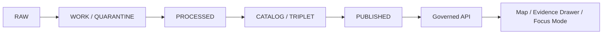
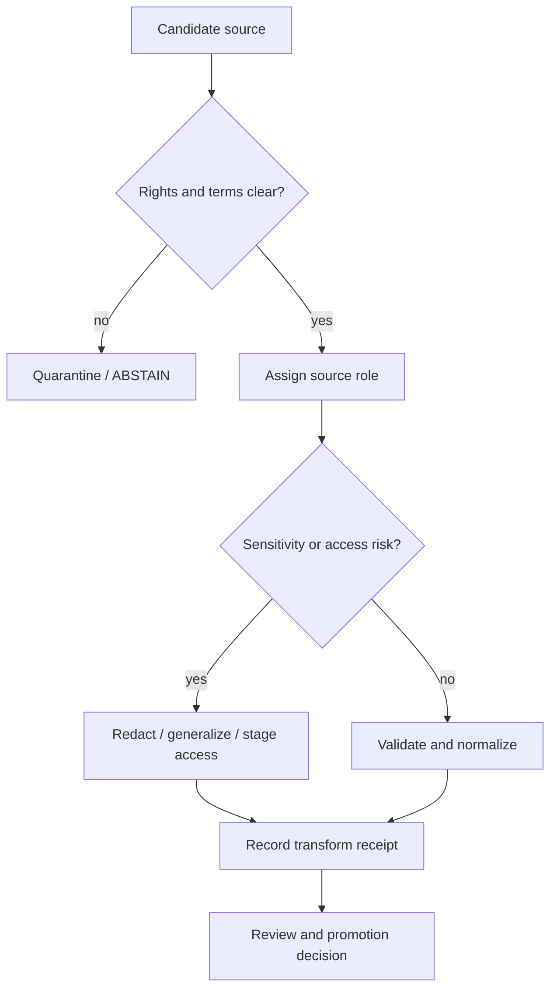
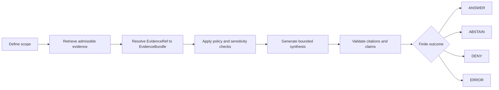

<!-- [KFM_META_BLOCK_V2]
doc_id: kfm://doc/NEEDS-VERIFICATION
title: Kansas Frontier Matrix
type: standard
version: v1
status: draft
owners: OWNER_TBD_AFTER_CODEOWNERS_REVIEW
created: 2026-04-26
updated: 2026-05-02
policy_label: public-doc-draft; policy homes NEEDS VERIFICATION
related: [README.md, PATH_TBD_AFTER_REPO_INSPECTION]
tags: [kfm, readme, governance, evidence, maps, temporal]
notes: [Repo-useful root README draft revised from supplied Markdown and KFM corpus; current repo implementation depth UNKNOWN; created date inherited from supplied draft; verify owners, IDs, links, license, workflows, routes, package manager, CI, release state, and public access posture before commit.]
[/KFM_META_BLOCK_V2] -->

<a id="top"></a>

# Kansas Frontier Matrix

A governed, evidence-first, map-first, time-aware spatial knowledge and publication system for inspectable claims.

<p align="center">
  <strong>Evidence-first • map-first • time-aware • governed • auditable • reversible</strong><br>
  <sub>Maps, AI answers, tiles, graphs, dashboards, scenes, and stories are downstream evidence carriers — not sovereign truth.</sub>
</p>

<p align="center">
  
  
  
  
  
  
  
</p>

<p align="center">
  <a href="#what-kfm-is">What KFM is</a> ·
  <a href="#repo-fit">Repo fit</a> ·
  <a href="#trust-path">Trust path</a> ·
  <a href="#inspectable-claim-contract">Inspectable claims</a> ·
  <a href="#map-and-ai-boundaries">Map & AI</a> ·
  <a href="#validation">Validation</a> ·
  <a href="#rollback-and-correction">Rollback</a>
</p>

> [!IMPORTANT]
> **Status:** `experimental` README draft  
> **Owner:** `OWNER_TBD_AFTER_CODEOWNERS_REVIEW`  
> **Target path:** PROPOSED `README.md`  
> **Truth posture:** CONFIRMED doctrine · PROPOSED file homes · UNKNOWN repo implementation depth  
> **Commit rule:** verify paths, owners, links, workflows, license, package manager, release state, and public access posture before treating this file as authoritative.

| Field | Value |
|---|---|
| Document review state | `draft` |
| README lifecycle | `experimental` |
| Evidence mode | Corpus-grounded README revision from supplied Markdown; current repository implementation depth remains `UNKNOWN`. |
| Public posture | Cite-or-abstain; fail closed on unresolved rights, sensitivity, source terms, review state, or release state. |
| Policy posture | Policy-aware by doctrine; exact policy homes and policy engine remain `NEEDS VERIFICATION`. |
| Implementation depth | `UNKNOWN` until confirmed from mounted repo files, tests, workflows, manifests, dashboards, logs, or generated artifacts. |
| Publication state | Not asserted. Promotion must be proven through governed release gates before any public or semi-public release. |

> [!NOTE]
> This README is designed as a root landing page draft. It should be merged only after maintainers verify current repository conventions and reconcile any existing root README anchors.

---

## What this README is

| This README does | This README does not |
|---|---|
| Orient maintainers, reviewers, and trusted collaborators to KFM doctrine and safe next steps. | Prove current implementation, routes, DTOs, tests, workflows, CI behavior, dashboards, emitted proof objects, or deployment posture. |
| Preserve the project’s evidence-first, map-first, time-aware, governed posture. | Authorize public release of any source, claim, layer, scene, tile, summary, dashboard, or AI answer. |
| State the trust membrane, lifecycle, public-output boundaries, and verification expectations. | Treat maps, AI, dashboards, vector stores, search indexes, graph projections, or generated summaries as root truth. |
| Identify repo-fit assumptions and verification gaps for maintainers. | Replace source-rights review, policy review, security review, release review, rollback planning, or repository inspection. |

---

## What KFM is

Kansas Frontier Matrix, or KFM, is a governed spatial evidence and publication system. Its durable public unit of value is the **inspectable claim**: a public or semi-public statement whose evidence, spatial scope, temporal scope, source role, policy posture, review state, release state, and correction lineage can be inspected.

KFM treats maps, summaries, dashboards, tiles, graph projections, story exports, AI answers, and rendered scenes as downstream carriers of evidence. They can help users navigate, compare, explain, and communicate. They do not replace evidence, policy, review, release state, or correction history.

| KFM does | KFM does not |
|---|---|
| Builds traceable spatial claims from governed evidence. | Treat map polish as evidence. |
| Keeps time, source role, review state, policy posture, release state, and correction lineage visible. | Publish uncited or weakly supported claims as authoritative. |
| Uses maps as primary navigation and inspection surfaces. | Let renderers, tiles, scenes, search indexes, graph projections, vector stores, or model outputs replace canonical truth. |
| Supports review, rollback, redaction, generalization, correction, and withdrawal workflows. | Expose RAW, WORK, QUARANTINE, or unpublished candidate data to public clients. |
| Allows bounded AI synthesis over admissible evidence. | Allow direct public model traffic or model output as proof. |

<p align="right"><a href="#top">Back to top ↑</a></p>

---

## Repo fit

This file is a PROPOSED root README for KFM. The exact repository topology is `NEEDS VERIFICATION`.

| Fit area | Draft posture | Verification needed |
|---|---|---|
| Target path | PROPOSED `README.md` | Confirm root README convention and stable anchors. |
| Upstream doctrine | KFM doctrine corpus and living pipeline/manual family | Confirm canonical doc registry and successor relationships. |
| Downstream docs | PROPOSED `docs/`, `docs/adr/`, `docs/runbooks/`, `docs/domains/` | Confirm actual directory structure before linking. |
| Contracts / schemas | PROPOSED schema-home ADR before machine contract expansion | Resolve `schemas/` vs. `contracts/` authority. |
| Policy | PROPOSED policy gates for source intake, runtime, release, redaction, and publication | Confirm policy engine, policy file homes, and fixture conventions. |
| Apps / UI | PROPOSED governed API + map-first web shell | Confirm actual app paths, framework, routes, DTOs, and component names. |
| Data / registry | PROPOSED source, dataset, layer, receipt, proof, catalog, and release registries | Confirm actual data lifecycle homes and artifact layout. |
| Tests / CI | PROPOSED no-network fixtures, negative-path tests, and validation gates | Confirm test runner, package manager, CI workflow names, and branch protections. |
| License | `TODO: verify repository license` | Confirm license file before adding a license badge or summary. |

### PROPOSED control-surface map

```text
README.md                         # PROPOSED root orientation
docs/                             # NEEDS VERIFICATION
docs/adr/                         # PROPOSED ADR home
docs/runbooks/                    # PROPOSED runbook home
docs/domains/                     # PROPOSED domain-lane docs
schemas/ or contracts/            # CONFLICTED / needs schema-home ADR
policy/                           # NEEDS VERIFICATION
data/registry/                    # NEEDS VERIFICATION
data/receipts/                    # NEEDS VERIFICATION
data/proofs/                      # NEEDS VERIFICATION
data/catalog/                     # NEEDS VERIFICATION
apps/                             # NEEDS VERIFICATION
tools/                            # NEEDS VERIFICATION
tests/                            # NEEDS VERIFICATION
.github/workflows/                # NEEDS VERIFICATION
```

> [!WARNING]
> If the real repository already contains a stronger root README or a documented README convention, preserve stable anchors and merge this content as a patch rather than replacing verified material wholesale.

### Maintainer start path

1. Verify repository root, branch, package manager, workflow names, root README anchors, and license.
2. Confirm owners through CODEOWNERS or the project’s documented ownership source.
3. Resolve schema-home authority through an ADR before adding or moving machine contracts.
4. Confirm source ledger, source registry, core governance schemas, fixtures, validators, policy stubs, and proof-object homes.
5. Build one no-network proof slice before live connectors, public layers, UI route expansion, model-provider adapters, broad tiles, or exposed deployment.

<p align="right"><a href="#top">Back to top ↑</a></p>

---

## Accepted inputs

KFM input classes should be admitted only through source-aware, policy-aware intake.

| Input class | Required posture |
|---|---|
| Authoritative or official source records | Verify source role, rights, temporal coverage, spatial support, update cadence, attribution, and release terms. |
| Archival, historical, field, or documentary evidence | Preserve provenance, interpretation status, uncertainty, and review trail. |
| Sensor, observation, remote-sensing, or model-derived data | Keep observations, detections, model fields, regulatory layers, and derived products distinct. |
| Human or steward-submitted contributions | Route through intake, rights, sensitivity, review, correction, and release controls. |
| AI-assisted summaries, classifications, or drafts | Treat as interpretive outputs requiring evidence resolution, citation validation, policy checks, and review. |

## Exclusions and fail-closed areas

KFM should quarantine, deny, redact, generalize, delay, or stage access when evidence or policy support is unresolved.

| Exclusion / restricted class | Default handling |
|---|---|
| Unverified source terms, licenses, rights, attribution, or redistribution permissions | `ABSTAIN` or quarantine until resolved. |
| Exact locations for archaeology, sacred sites, burials, rare species, sensitive habitat, critical infrastructure, or private landowner exposure | Deny public exact exposure by default; require review and documented transforms. |
| Living-person, DNA, genomic, private genealogy, or sensitive family-history material | Restrict by default; separate assertions from canonical records. |
| Assessor, tax, or parcel data used as title truth | Do not publish as title truth without appropriate source role and evidence. |
| Direct model-runtime output, raw vector-search hits, generated summaries, or unreviewed AI drafts | Never treat as proof. |
| RAW, WORK, QUARANTINE, unpublished candidate stores, private credentials, or internal maintenance surfaces | Not available to public clients or ordinary UI surfaces. |

> [!CAUTION]
> When rights, sovereignty, cultural sensitivity, living-person exposure, DNA/genomics, private landowner exposure, exact-location exposure, rare species, archaeology, critical infrastructure, credentials, private endpoints, or source terms are unclear, KFM should fail closed and preserve an auditable reason.

<p align="right"><a href="#top">Back to top ↑</a></p>

---

## Trust path

KFM’s default lifecycle is intentionally conservative. Promotion is a governed state transition, not a file move.


```mermaid
flowchart LR
  RAW[RAW] --> WORK[WORK / QUARANTINE]
  WORK --> PROCESSED[PROCESSED]
  PROCESSED --> CATALOG[CATALOG / TRIPLET]
  CATALOG --> PUBLISHED[PUBLISHED]
  PUBLISHED --> API[Governed API]
  API --> UI[Map / Evidence Drawer / Focus Mode]
```

Core rule: public-facing surfaces should resolve evidence, source role, policy posture, review state, and release state before making consequential claims.

| Stage | What it is | Public-client posture |
|---|---|---|
| `RAW` | Source-adjacent material before normalization and review. | Not public. |
| `WORK / QUARANTINE` | Working material or held material with unresolved risk. | Not public. |
| `PROCESSED` | Normalized and validated candidate material. | Not public unless promoted. |
| `CATALOG / TRIPLET` | Cataloged, linked, or graph-ready evidence products. | Only through governed release rules. |
| `PUBLISHED` | Reviewed, policy-safe, release-bound outputs. | Public or staged access through governed APIs and released artifacts only. |

### Source intake posture


```mermaid
flowchart TB
  SOURCE[Candidate source] --> TERMS{Rights and terms clear?}
  TERMS -- no --> QUARANTINE[Quarantine / ABSTAIN]
  TERMS -- yes --> ROLE[Assign source role]
  ROLE --> SENS{Sensitivity or access risk?}
  SENS -- yes --> TRANSFORM[Redact / generalize / stage access]
  SENS -- no --> VALIDATE[Validate and normalize]
  TRANSFORM --> RECEIPT[Record transform receipt]
  VALIDATE --> RECEIPT
  RECEIPT --> REVIEW[Review and promotion decision]
```

<p align="right"><a href="#top">Back to top ↑</a></p>

---

## Inspectable claim contract

A consequential KFM claim should be reconstructable to the following support surface.

| Required support | Purpose |
|---|---|
| `EvidenceRef → EvidenceBundle` | Shows what evidence supports the claim. |
| Spatial scope | Defines where the claim applies and with what geometric support. |
| Temporal scope | Defines valid time, observed time, source time, release time, or correction time as applicable. |
| Source role | Prevents confusing authority, context, observation, model, interpretation, and public communication. |
| `PolicyDecision` | Shows rights, sensitivity, access, and publication posture. |
| Review state | Separates draft, reviewed, released, corrected, withdrawn, or superseded claims. |
| Release state | Connects the claim to a governed publication event. |
| Correction lineage | Makes corrections, withdrawals, supersessions, and rollback targets inspectable. |

> [!IMPORTANT]
> EvidenceBundle outranks generated language. If the evidence cannot be resolved, cite-or-abstain is the correct default.

---

## Map and AI boundaries

Maps and AI are important KFM surfaces, but both must remain subordinate to governed evidence.

### Map-first shell

KFM should use a map-first, time-aware shell where geography, time, evidence, policy, and review state remain visible at the point of use. MapLibre, Cesium, PMTiles, COGs, 3D Tiles, vector tiles, dashboards, and rendered scenes are delivery or rendering surfaces. They should not silently replace canonical truth.

| Surface | Allowed role | Not allowed |
|---|---|---|
| MapLibre / map shell | Render released public-safe artifacts and interaction state. | Become the canonical store, policy authority, citation authority, or publication gate. |
| Cesium / 3D scene | Add 3D, terrain, globe, vertical, time-dynamic, line-of-sight, or story context when it carries real evidence burden. | Let visual realism imply evidentiary certainty or bypass the 2D trust shell. |
| Tiles / COGs / PMTiles / 3D Tiles | Deliver rebuildable published artifacts. | Replace source, catalog, proof, release, or correction objects. |
| Evidence Drawer | Show resolved evidence, policy, review, release, stale state, transform receipts, and correction lineage. | Hide uncertainty, source-role limits, rights gaps, or unresolved policy posture. |
| Story exports / dashboards | Communicate released claims and context. | Publish unsupported claims as authoritative. |

### Governed AI / Focus Mode

AI should operate as a bounded interpretive layer behind governed APIs.


```mermaid
flowchart LR
  SCOPE[Define scope] --> EVIDENCE[Retrieve admissible evidence]
  EVIDENCE --> BUNDLE[Resolve EvidenceRef to EvidenceBundle]
  BUNDLE --> POLICY[Apply policy and sensitivity checks]
  POLICY --> SYNTH[Generate bounded synthesis]
  SYNTH --> CITE[Validate citations and claims]
  CITE --> OUTCOME{Finite outcome}
  OUTCOME --> ANSWER[ANSWER]
  OUTCOME --> ABSTAIN[ABSTAIN]
  OUTCOME --> DENY[DENY]
  OUTCOME --> ERROR[ERROR]
```

`ANSWER`, `ABSTAIN`, `DENY`, and `ERROR` are first-class outcomes. Prefer `ABSTAIN` over unsupported confidence, `DENY` over unsafe exposure, and `ERROR` over hiding technical failure.

<p align="right"><a href="#top">Back to top ↑</a></p>

---

## Proposed object families

These object families are preferred targets unless current repository evidence proves another accepted model.

| Family | Role |
|---|---|
| `SourceDescriptor` / `SourceIntakeRecord` | Source identity, source role, rights, terms, update cadence, and intake state. |
| `EvidenceRef` / `EvidenceBundle` | Claim support and reconstructable evidence payloads. |
| `DecisionEnvelope` / `PolicyDecision` | Structured policy, review, release, and outcome decisions. |
| `RuntimeResponseEnvelope` / `CitationValidationReport` | Governed AI and Focus Mode response boundaries. |
| `RunReceipt` / `AIReceipt` / `RedactionReceipt` / `ValidationReport` | Process memory, validation, redaction, and runtime traceability. |
| `PromotionDecision` / `ReleaseManifest` / `ProofPack` / `CatalogMatrix` | Publication readiness, release artifacts, and catalog closure. |
| `CorrectionNotice` / `RollbackPlan` | Correction, withdrawal, supersession, and recovery path. |
| `GeoManifest` / `LayerManifest` | Spatial artifact integrity, layer metadata, delivery posture, and release linkage. |

> [!WARNING]
> The table above is `PROPOSED` unless matching schemas, contracts, validators, fixtures, or emitted artifacts are confirmed in the mounted repository.

### Proof-bearing thin slice

The smallest useful build should prove the trust path before adding broad data or UI surface area.

| Slice part | Minimum proof |
|---|---|
| Source registry skeleton | At least one source descriptor with role, rights posture, cadence, and access posture. |
| Core schemas/contracts | Evidence, policy, receipt, release, and claim-support objects validate against fixtures. |
| Offline fixtures | Valid and invalid examples exercise positive and negative paths without live network dependency. |
| Validators | Fail on unresolved evidence, unknown source role, missing review state, or unsafe public exposure. |
| Policy stubs | Deny unresolved rights, unclear sensitivity, public RAW/WORK/QUARANTINE access, and direct model-client bypass. |
| Release dry-run | Emits or verifies a release-ready manifest, proof/citation closure, and rollback target. |

---

## Domain lanes

KFM should grow through proof-bearing domain lanes rather than broad unreviewed expansion. Hydrology remains a strong candidate first proof lane because it can exercise source descriptors, temporal observations, regulated context, map delivery, Evidence Drawer payloads, policy checks, and release/rollback behavior without starting from the most sensitive domains.

| Lane family | Special caution |
|---|---|
| Hydrology, soils, geology, atmosphere, hazards | Keep observations, models, regulatory layers, operational context, and public summaries distinct. |
| Habitat, fauna, flora, agriculture | Fail closed on sensitive locations and source-rights uncertainty. |
| Roads, rail, settlements, infrastructure | Separate geometry, legal/administrative status, operator, restriction, condition, and historical interpretation. |
| Archaeology and cultural heritage | Deny public exact site locations by default; require steward/cultural review and public-safe transforms. |
| People, genealogy, DNA, land ownership | Restrict living-person and DNA/genomic material; do not treat assessor/tax records as title truth. |
| UI, MapLibre, 3D, governed AI | Treat as trust-visible interpretation and delivery surfaces, not root truth. |

<p align="right"><a href="#top">Back to top ↑</a></p>

---

## Security and exposed-local posture

KFM may be locally hosted and exposed through a home firewall, reverse proxy, or VPN for trusted third-party access. Treat that as security-relevant.

| Boundary | Default posture |
|---|---|
| Public access | Deny by default; expose only governed public-safe surfaces. |
| Steward access | Least privilege; auditable source, review, and release operations. |
| Admin and maintenance paths | Private by default; documented, constrained, and prevented from becoming normal public paths. |
| Model runtimes | No direct public model endpoint; model adapters remain behind governed API and policy checks. |
| Secrets and private endpoints | Never place in code, prompts, docs, fixtures, screenshots, or examples. |
| Logs and receipts | Keep enough for review without exposing sensitive data. |
| Reverse proxy / VPN exposure | Document access controls, allowed origins, audit logging, rollback, and emergency shutoff before exposure. |

> [!CAUTION]
> If authentication, authorization, source rights, private endpoint exposure, secret handling, or policy state is unclear, KFM should fail closed and preserve an auditable reason.

---

## Validation

Validation commands must be verified against the actual repo. Until then, show only repository-discovery commands as generic orientation and label implementation checks as `NEEDS VERIFICATION`.

```bash
# Local checkout orientation — verify in the real repository before relying on results.
git status --short
git branch --show-current
git rev-parse --show-toplevel
```

Implementation validation surfaces to confirm later:

- [ ] Source descriptors validate source role, rights, terms, cadence, and access posture.
- [ ] EvidenceRefs resolve to EvidenceBundles.
- [ ] Citation validation fails unsupported claims.
- [ ] Policy gates deny unresolved rights, unclear sensitivity, missing review state, unsafe exact geometry, and direct model-client bypass.
- [ ] Promotion requires catalog/proof/release closure.
- [ ] Public clients cannot access RAW, WORK, QUARANTINE, canonical/internal stores, or direct model output.
- [ ] Correction and rollback references are recorded for published or semi-public releases.

### Negative-path coverage to prioritize

- [ ] Unresolved `EvidenceRef`.
- [ ] Unknown source role.
- [ ] Unclear rights, license, or attribution.
- [ ] Unclear sensitivity or exact sensitive geometry.
- [ ] Missing review state or release state.
- [ ] Invalid `spec_hash` or manifest mismatch.
- [ ] Direct model-client bypass.
- [ ] Public access to RAW, WORK, QUARANTINE, or unpublished candidate data.
- [ ] Missing citation for a consequential claim.
- [ ] Generated artifact placed in canonical path without convention.

<p align="right"><a href="#top">Back to top ↑</a></p>

---

## Definition of Done

A build-facing KFM change is not done until the relevant evidence, policy, validation, and rollback surfaces are visible.

- [ ] Evidence basis is stated.
- [ ] Repository paths, owners, badges, links, routes, workflows, and package commands are verified or marked `TODO` / `NEEDS VERIFICATION`.
- [ ] Source role and source terms are recorded.
- [ ] EvidenceBundle resolution is tested for consequential claims.
- [ ] PolicyDecision is emitted or recorded where risk matters.
- [ ] Sensitive geometry is redacted, generalized, withheld, or denied by default.
- [ ] Release state and review state are explicit.
- [ ] Correction and rollback path are documented.
- [ ] Derived layers, tiles, search indexes, summaries, graphs, and scenes remain rebuildable derivatives.
- [ ] Documentation changed when behavior changed, or the reason it did not is recorded.

---

## Recommended first PR

> [!TIP]
> When the repository is mounted and conventions are verified, start with the smallest reversible trust-building slice instead of live data ingestion, UI polish, model integration, or public publication.

**PR-0001: Documentation Control Plane, Schema-Home ADR, Source Ledger Skeleton, Core Governance Schemas, Offline Fixtures, Validators, Policy Stubs, and One No-Network Public-Safe Proof Slice**

| Work item | Why it comes first |
|---|---|
| Repo inventory and README metadata verification | Prevents fake implementation claims and broken links. |
| Schema-home ADR | Avoids parallel `schemas/` vs. `contracts/` drift. |
| Source ledger and source registry skeleton | Makes source authority and rights visible before data growth. |
| Core governance schemas and fixtures | Turns doctrine into testable contracts. |
| Validators and negative-path tests | Proves fail-closed behavior before public surfaces. |
| Policy stubs | Blocks unsafe publication paths early. |
| No-network proof slice | Demonstrates evidence-to-public-output flow without live-source risk. |

---

## Rollback and correction

KFM publication should be reversible and correctable.

| Event | Required response |
|---|---|
| Bad source intake | Quarantine or withdraw source; record reason and affected artifacts. |
| Broken validation | Block promotion; preserve `ValidationReport` and failed inputs. |
| Unsafe public exposure | Remove or restrict release; emit `CorrectionNotice` and `RedactionReceipt` where relevant. |
| Incorrect claim | Correct or withdraw claim; preserve lineage from prior claim to replacement. |
| Failed release | Roll back to prior `ReleaseManifest` or documented `RollbackPlan`. |
| Policy drift | Re-evaluate affected public surfaces and release manifests. |
| Schema-home conflict | Pause machine-file expansion; resolve through ADR and migration plan. |

<p align="right"><a href="#top">Back to top ↑</a></p>

---

## Current verification gaps

- [ ] Confirm actual root README conventions and stable anchors.
- [ ] Verify repository path map, package manager, test runner, and CI workflow names.
- [ ] Verify owner-of-record and CODEOWNERS.
- [ ] Verify schema vs. contract authority and ADR conventions.
- [ ] Verify policy engine, validator registry, source registry, and fixture homes.
- [ ] Verify MapLibre shell, Evidence Drawer, Focus Mode, and governed API implementation paths.
- [ ] Verify release, proof, receipt, catalog, correction, and rollback artifact homes.
- [ ] Verify license, branch protection, deployment posture, public access boundaries, and local exposure controls.
- [ ] Verify whether this README should link to a documentation control plane, source authority register, or pipeline living manual.

---

## License

`TODO: verify repository license before adding a license badge or license summary.`

---

<details>
<summary>Appendix A — Placeholder register</summary>

| Placeholder | Why it remains |
|---|---|
| `kfm://doc/NEEDS-VERIFICATION` | No repository document registry was verified in this session. |
| `OWNER_TBD_AFTER_CODEOWNERS_REVIEW` | Ownership must be confirmed from CODEOWNERS or another project-owned source. |
| `PATH_TBD_AFTER_REPO_INSPECTION` | Current repo topology was not mounted or verified for this revision. |
| `TODO: verify repository license` | No repository license file was inspected. |
| `NEEDS VERIFICATION` policy homes | Policy directories, bundle names, catalog gates, and runtime policy surfaces are not confirmed. |
| `NEEDS VERIFICATION` CI/test commands | Workflow names, package manager, test runner, and fixtures are not confirmed. |

</details>

<details>
<summary>Appendix B — Glossary</summary>

| Term | Working meaning |
|---|---|
| Inspectable claim | A public or semi-public statement reconstructable to evidence, spatial/temporal scope, source role, policy posture, review state, release state, and correction lineage. |
| EvidenceBundle | The resolved evidence support package for a claim or answer. |
| EvidenceRef | A reference that must resolve to an EvidenceBundle before consequential public use. |
| PolicyDecision | Structured outcome of rights, sensitivity, access, review, and publication checks. |
| Promotion | Governed state transition from candidate material toward published output, not a file move. |
| Derived surface | A map layer, tile, search index, vector store, summary, graph projection, scene, or dashboard that carries evidence but does not replace canonical truth. |
| Focus Mode | Bounded AI-assisted interaction over admissible evidence, policy checks, citation validation, and finite outcomes. |
| Trust membrane | The boundary preventing public or ordinary UI paths from bypassing evidence, policy, review, and release controls. |
| Source role | A source’s permitted evidentiary role: authority, observation, context, model, interpretation, communication, or other governed category. |

</details>

<details>
<summary>Appendix C — README pre-commit check</summary>

- [ ] Metadata block values are verified or visibly marked `TODO` / `NEEDS VERIFICATION`.
- [ ] Badge claims are static and truthful, or backed by verified real targets.
- [ ] No fake CI, release, coverage, license, owner, security, implementation, or deployment status appears.
- [ ] Mermaid diagrams reflect doctrine and do not imply unverified implementation.
- [ ] Relative links are valid from root or marked `NEEDS VERIFICATION`.
- [ ] No secrets, private endpoints, credentials, or sensitive locations appear.
- [ ] Unverified implementation behavior remains `UNKNOWN` or `PROPOSED`.
- [ ] License text is not summarized until the actual repository license is verified.
- [ ] SoilGrids or other lane-specific runbook material is moved out of the root README before commit.

</details>

<details>
<summary>Appendix D — Relocation note for SoilGrids material from the supplied draft</summary>

The supplied draft appended detailed SoilGrids layer commands for COG normalization, STAC registration, promotion gates, static serving validation, distribution publishing, and remote monitoring. That material is useful, but it is too lane-specific and implementation-claim-heavy for the root README.

Disposition: `RETAIN AS PROPOSED / MOVE AFTER REPO INSPECTION`.

Recommended future homes, pending repo convention verification:

| Material | PROPOSED destination |
|---|---|
| SoilGrids COG normalization | `docs/domains/soil/soilgrids-cog-normalization.md` or `tools/soilgrids/README.md` |
| SoilGrids STAC registration | `docs/runbooks/soilgrids-stac-registration.md` |
| SoilGrids promotion gate | `docs/runbooks/soilgrids-promotion-gate.md` |
| Static serving and HTTP range validation | `docs/runbooks/static-serving-validation.md` |
| Distribution publisher and remote monitor | `docs/runbooks/remote-distribution-monitoring.md` |

Do not commit those CLI examples as implementation guidance until script names, module locations, policy profiles, receipt schemas, exit codes, STAC version, license posture, network flags, and artifact paths are verified in the actual repository.

</details>

## Layer 13: Evidence Registry + Semantic Query API Compiler

Example local-registry invocation:

```bash
python soilgrids_evidence_registry.py \
  --evidence-crate tests/fixtures/evidence_registry/valid_crate \
  --registry-root registries \
  --registry-mode local-registry \
  --registry-title "SoilGrids Evidence Registry" \
  --dataset-id soilgrids-v2
```

This layer compiles a read-only, deterministic registry snapshot and does not mutate source evidence crates.

## Layer 16 CI/CD Control Plane (Snippet)

This layer generates and validates repository automation only; it does **not** bypass Layer 15 and does **not** mutate remote state by default.

### Generate only
`python soilgrids_control_plane.py --control-plane-spec control_plane/soilgrids_control_plane_example.json --pipeline-spec pipeline_specs/soilgrids_pipeline_example.json --automation-root repo_automation --mode generate-only`

### Validate generated
`python soilgrids_control_plane.py --control-plane-spec control_plane/soilgrids_control_plane_example.json --pipeline-spec pipeline_specs/soilgrids_pipeline_example.json --automation-root repo_automation --mode validate-generated`

### Local smoke
`python soilgrids_control_plane.py --control-plane-spec control_plane/soilgrids_control_plane_example.json --pipeline-spec pipeline_specs/soilgrids_pipeline_example.json --automation-root repo_automation --mode local-smoke --allow-local-execution`

### Release gate
`python soilgrids_control_plane.py --control-plane-spec control_plane/soilgrids_control_plane_example.json --pipeline-run-receipt pipeline_runs/<run_id>/pipeline_run_receipt.json --pipeline-certification-envelope pipeline_runs/<run_id>/pipeline_certification_envelope.json --automation-root repo_automation --mode release-gate`

## Layer 17: Supply Chain Security (Snippet)

```bash
python soilgrids_supply_chain.py --supply-chain-spec supply_chain/supply_chain_spec_example.json --repo-root . --output-root supply_chain_runs --mode inventory-only --allow-unknown-files
python soilgrids_supply_chain.py --supply-chain-spec supply_chain/supply_chain_spec_example.json --repo-root . --output-root supply_chain_runs --mode sbom --allow-unknown-files
python soilgrids_supply_chain.py --supply-chain-spec supply_chain/supply_chain_spec_example.json --repo-root . --output-root supply_chain_runs --mode offline-vulnerability-scan --offline-advisory-db tests/fixtures/supply_chain/osv_fixture.json --allow-unknown-files
python soilgrids_supply_chain.py --supply-chain-spec supply_chain/supply_chain_spec_example.json --repo-root . --output-root supply_chain_runs --mode attest --allow-unknown-files
python soilgrids_supply_chain.py --supply-chain-spec supply_chain/supply_chain_spec_example.json --repo-root . --output-root supply_chain_runs --mode certify-supply-chain --allow-unknown-files
```

Outputs include `sbom/spdx.json`, `sbom/cyclonedx.json`, `supply_chain_gate_report.json`, and `supply_chain_receipt.json` under `supply_chain_runs/<run_id>/`.

> This layer scans, verifies, and attests only. It does **not** install, update, or remediate dependencies.

## Layer 21: Independent Verifier + Witness Federation Toolkit

### CLI examples
- `python soilgrids_independent_verifier.py --verifier-spec verifier/verifier_spec_example.json --disclosure-packet-root disclosure_packets/<packet_id> --output-root verifier_runs --mode packet-verify`
- `python soilgrids_independent_verifier.py --verifier-spec verifier/verifier_spec_example.json --transparency-log-snapshot transparency_portals/<portal_id>/log/transparency_log_snapshot.json --signed-tree-head transparency_portals/<portal_id>/log/signed_tree_head.json --trust-packet-index transparency_portals/<portal_id>/log/trust_packet_index.json --output-root verifier_runs --mode log-verify`
- `python soilgrids_independent_verifier.py --verifier-spec verifier/verifier_spec_example.json --disclosure-packet-root disclosure_packets/<packet_id> --transparency-portal-root transparency_portals/<portal_id> --output-root verifier_runs --mode full-verify`
- `python soilgrids_independent_verifier.py --verifier-spec verifier/verifier_spec_example.json --transparency-portal-root transparency_portals/<portal_id> --output-root verifier_runs --mode witness-tree-head --witness-id independent-auditor-01 --signing-backend unsigned`
- `python soilgrids_independent_verifier.py --verifier-spec verifier/verifier_spec_example.json --witness-statement witness/a.json --witness-statement witness/b.json --transparency-log-snapshot transparency_portals/<portal_id>/log/transparency_log_snapshot.json --output-root verifier_runs --mode federation-verify`
- `python soilgrids_independent_verifier.py --verifier-spec verifier/verifier_spec_example.json --challenge-request auditor/challenge_request.json --transparency-portal-root transparency_portals/<portal_id> --disclosure-packet-root disclosure_packets/<packet_id> --output-root verifier_runs --mode challenge-response`

### Examples
See `verifier/verifier_spec_example.json`, `verifier/verifier_policy_default.json`, and output report schemas in run outputs (`packet_verification_report.json`, `log_verification_report.json`, `proof_verification_report.json`, `witness_statement.json`, `federation_manifest.json`, `challenge_response.json`, and `verifier_receipt.json`).

### Exit codes
- `0`: success/verified
- `5`: dry-run success
- `10`: warning
- `20..110`: fail-closed error classes

> This layer only independently verifies and witnesses evidence; it does **not** publish, mutate packets, mutate logs, or provide legal certification.

## Layer 22 Watchtower Gossip (Snippet)
This layer monitors and gossips verification observations only; it does not publish remotely, mutate transparency logs, or provide legal certification.

### CLI
- `python soilgrids_watchtower_gossip.py --watchtower-spec watchtower/watchtower_spec_example.json --output-root watchtower_runs --mode scan-local`
- `python soilgrids_watchtower_gossip.py --watchtower-spec watchtower/watchtower_spec_example.json --output-root watchtower_runs --mode gossip-export`
- `python soilgrids_watchtower_gossip.py --watchtower-spec watchtower/watchtower_spec_example.json --output-root watchtower_runs --mode gossip-import --gossip-envelope examples/gossip/gossip_envelope_example.json`
- `python soilgrids_watchtower_gossip.py --watchtower-spec watchtower/watchtower_spec_example.json --output-root watchtower_runs --mode split-view-detect`
- `python soilgrids_watchtower_gossip.py --watchtower-spec watchtower/watchtower_spec_example.json --output-root watchtower_runs --mode quorum-check --witness-statement tests/fixtures/watchtower_gossip/witness_statement_valid.json`
- `python soilgrids_watchtower_gossip.py --watchtower-spec watchtower/watchtower_spec_example.json --output-root watchtower_runs --mode challenge-peers`
- `python soilgrids_watchtower_gossip.py --watchtower-spec watchtower/watchtower_spec_example.json --output-root watchtower_runs --mode build-dashboard --build-dashboard`

Exit codes: 0 healthy/planned, 5 dry-run, 10 degraded, 20 critical, 30 malformed input.

## Layer 24: Trust Status Distribution Publisher

Plan-only:
`python soilgrids_status_distribution.py --status-distribution-spec status_distribution/status_distribution_spec_example.json --trust-status-run-root tests/fixtures/status_distribution/trust_status_run --output-root /tmp/out --mode plan-only`

Local mirror/build resolver/S3-compatible/validate-remote modes are supported through `--mode`.

This layer publishes or mirrors trust-status artifacts only. It does **not** change trust statuses, revoke objects, delete objects, or mutate source evidence.

## Layer 25 Consumer Trust Decision Engine

### Invocations
- decide: `python tools/resolution/soil/soilgrids_trust_decision.py --trust-decision-spec trust_decision/trust_decision_spec_example.json --status-distribution-root tests/fixtures/trust_decision --request trust_decision/requests/example_request.json --output-root /tmp/td --mode decide`
- resolve: `... --mode resolve`
- batch-decide: `... --mode batch-decide`
- compile-sdk: `... --mode compile-sdk`
- validate-remote-resolver: `... --mode validate-remote-resolver --public-base-url http://127.0.0.1:8000 --allow-remote-network`
- opa-eval: `... --mode opa-eval --opa-policy trust_decision/policies/consumer_policy_example.rego --opa-query data.consumer.decision`

### Examples
See:
- `trust_decision/trust_decision_spec_example.json`
- `trust_decision/trust_decision_policy_default.json`
- `trust_decision/requests/example_request.json`
- `examples/api/trust_decision_openapi_example.json`
- `examples/sdk/soilgrids_trust_client_example.py`

### Local API endpoints
`GET /health`, `GET /policy`, `GET /resolve/{trust_object_id}`, `GET /decide/{trust_object_id}`, `GET /status-index`, `GET /revocations`, `GET /suspensions`

### Exit codes
0 success/allow, 5 dry-run, 10 warn, 15 review, 20 block, 30 malformed input, 40 resolver validation, 50 request validation, 60 policy failure, 70 OPA failure, 80 SDK/API failure, 90 remote resolver failure, 100 unsafe path/local API failure, 110 secret finding failure, 120 internal error.

> This layer only makes consumer trust decisions. It does not change trust status, revoke objects, publish remotely, or mutate source evidence.

## Layer 26 Trust Enforcement Gateway + Usage Audit Ledger (Snippet)

Modes: `plan-only`, `inventory-resources`, `enforce-once`, `batch-enforce`, `build-gateway`, `serve-local`, `replay-audit`.

Example spec: `enforcement/enforcement_spec_example.json`.
Example policy: `enforcement/enforcement_policy_default.json`.
Example request: `enforcement/requests/example_access_request.json`.

Exit codes: 0 success/planned, 5 dry-run, 10 warning, 15 review, 20 deny, 30 malformed, 40 resource, 50 decision, 60 policy, 70 audit, 80 gateway, 90 unsafe bind/path, 100 secret, 110 internal.

This layer enforces consumer decisions only. It does not change trust status, publish remotely, authenticate users, or mutate protected resources.

## Layer 27 Data Use Accountability (snippet)
Full invocation, inventory-usage, meter-usage, evaluate-obligations, quota-check, anomaly-scan, consumer-statement, local-api are supported via `soilgrids_data_use_accountability.py --mode <mode>` with required `--data-use-spec --output-root`.

Examples: DataUseSpec.v1, DataUsePolicy.v1, UsageEventInventory.v1, UsageMeteringSnapshot.v1, ObligationComplianceReport.v1, PurposeComplianceReport.v1, QuotaComplianceReport.v1, UsageAnomalyReport.v1, ConsumerUsageStatement.v1, DataUseReceipt.v1 are written under run output.

Exit codes: 0 success/planned, 5 dry-run, 10 warning, 20 compliance fail, 30 malformed input, 40 ledger fail, 50 metering fail, 60 obligation/purpose fail, 70 quota fail, 80 anomaly fail, 90 API/OpenAPI fail, 100 unsafe path/bind, 110 secret finding, 120 internal error.

Warning: this layer reports accountability only; it does not grant/deny access, revoke trust objects, publish remotely, or mutate source ledgers.

## Layer 28 Data Use Response Controller (soilgrids)

`soilgrids_data_use_response.py` prepares **local-only** response planning artifacts and recommendation packets.
It **does not** notify externally, mutate policies, change trust status, grant/deny access, or mutate Layer 27 evidence.

### Invocation examples
- full: `python soilgrids_data_use_response.py --data-use-response-spec data_use_response/data_use_response_spec_example.json --data-use-response-policy data_use_response/data_use_response_policy_default.json --data-use-run-root tests/fixtures/data_use_response --output-root /tmp/dur --mode full`
- classify: `... --mode classify`
- response-plan: `... --mode response-plan`
- obligation-fulfillment: `... --mode obligation-fulfillment`
- quota-response: `... --mode quota-response`
- anomaly-response: `... --mode anomaly-response`
- consumer-notification: `... --mode consumer-notification`
- recommend-policy: `... --mode recommend-policy`
- local-api: `... --mode local-api --host 127.0.0.1 --port 0`

### Examples
See:
- `data_use_response/data_use_response_spec_example.json`
- `data_use_response/data_use_response_policy_default.json`

### Exit codes
- `0`: success/planned
- `5`: dry-run success
- `10`: warning
- `20`: blocked
- `30`: malformed input
- `40`: Layer 27 source validation failure
- `50`: issue classification failure
- `60`: response plan failure
- `70`: packet generation failure
- `80`: recommendation validation failure
- `90`: API/OpenAPI failure
- `100`: unsafe path/public bind failure
- `110`: secret finding failure
- `120`: ledger failure
- `130`: internal error

## Layer 29: Controlled Notification Delivery + Acknowledgment Ledger

Plan only:
`python soilgrids_notification_delivery.py --notification-delivery-spec notification/notification_delivery_spec_example.json --output-root ./out --mode plan-only`

Build outbox:
`python soilgrids_notification_delivery.py --notification-delivery-spec notification/notification_delivery_spec_example.json --output-root ./out --mode build-outbox`

Deliver local:
`python soilgrids_notification_delivery.py --notification-delivery-spec notification/notification_delivery_spec_example.json --output-root ./out --mode deliver-local`

Deliver webhook (explicitly gated; remote disabled by default):
`python soilgrids_notification_delivery.py --notification-delivery-spec notification/notification_delivery_spec_example.json --output-root ./out --mode deliver-webhook --execute-delivery --allow-remote-network --webhook-config notification/webhook_config_example.json`

Import ack:
`python soilgrids_notification_delivery.py --notification-delivery-spec notification/notification_delivery_spec_example.json --output-root ./out --mode import-ack --acknowledgment-record ack.json`

Reconcile:
`python soilgrids_notification_delivery.py --notification-delivery-spec notification/notification_delivery_spec_example.json --output-root ./out --mode reconcile-acks`

Local API:
`python soilgrids_notification_delivery.py --notification-delivery-spec notification/notification_delivery_spec_example.json --output-root ./out --mode local-api --host 127.0.0.1 --port 0`

This layer controls local delivery (or explicitly enabled webhook delivery) only. It does not mutate policy, trust status, access enforcement, or Layer 28 source evidence.

## Layer 30 Governance Change Control (Snippet)

Plan-only:
```bash
python soilgrids_change_control.py --change-control-spec change_control/change_control_spec_example.json --policy-root tests/fixtures/change_control/policy_root --output-root out --mode plan-only
```
Collect-requests / assess-impact / approve / regression-test / build-bundle / release-candidate / verify-bundle use `--mode` respectively.

Example schemas are in:
- `change_control/change_control_spec_example.json`
- `change_control/requests/change_request_example.json`
- `examples/bundles/policy_bundle_manifest_example.json`

`ChangeControlLedger.v1` is append-only and chain-hashed for auditability.

`ChangeControlReceipt.v1` is the compact run receipt and proof artifact.

Exit codes: `0 success/planned/verified`, `5 dry-run`, `10 warning`, `20 blocked`, `30 malformed input`, `40 recommendation/ack`, `50 change request`, `60 impact/approval`, `70 regression`, `80 bundle/release gate`, `90 API/OpenAPI`, `100 unsafe path`, `110 secret`, `120 ledger`, `130 internal`.

> Warning: this layer creates controlled policy release candidates only; it does **not** mutate source policy roots, deploy policies, change trust status, grant access, or send notifications.
