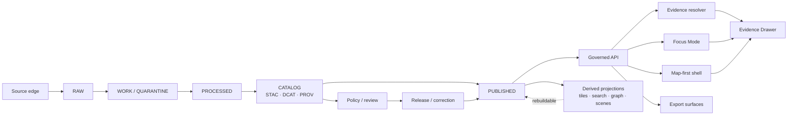

<!-- [KFM_META_BLOCK_V2]
doc_id: kfm://doc/<NEEDS_UUID>
title: Kansas Frontier Matrix
type: standard
version: v1
status: review
owners: <NEEDS VERIFICATION>
created: <NEEDS VERIFICATION>
updated: <NEEDS VERIFICATION>
policy_label: public
related: [./CHANGELOG.md, ./CONTRIBUTING.md, ./SECURITY.md, ./.github/, ./docs/, ./contracts/, ./policy/, ./data/, ./apps/, ./packages/, ./pipelines/]
tags: [kfm, kansas, spatial, evidence, governance]
notes: [public-tree-grounded draft, root README revision aligned to current public repo surfaces, owners/doc_id/dates require verification]
[/KFM_META_BLOCK_V2] -->

# Kansas Frontier Matrix

Kansas-first, map-first, time-aware repository for governed spatial evidence, publication, and inspectable claims.


> [!IMPORTANT]
> **Status:** `review` · **Maturity:** `vNext / blueprint-driven build` · **Owners:** `TBD / NEEDS VERIFICATION`  
> **Repo fit:** `/README.md` is the repository entrypoint for doctrine, navigation, and trust posture.  
> **Quick jump:** [Scope](#scope) · [Repo fit](#repo-fit) · [Accepted inputs](#accepted-inputs) · [Exclusions](#exclusions) · [Directory tree](#directory-tree) · [Quickstart](#quickstart) · [Operating model](#operating-model) · [Architecture diagram](#architecture-diagram) · [Definition of done](#definition-of-done-for-repo-visible-changes) · [FAQ](#faq)

> **Map-first • Time-aware • Governed • Evidence-first • Cite-or-abstain**

> [!NOTE]
> This README deliberately separates **CONFIRMED public repo surfaces** from **INFERRED** or **PROPOSED** structure. Use emitted artifacts, schemas, tests, manifests, receipts, and proof packs to prove implementation maturity. Do not treat doctrine alone as runtime evidence.

## Scope

This file introduces the repository as a governed system, not just a codebase. It is the shortest path into KFM’s trust model, repository surfaces, and review posture.

It should help a maintainer answer five questions quickly:

1. What this repository is trying to do.
2. Which root-level surfaces matter first.
3. What belongs here.
4. What does **not** belong here.
5. Which claims are doctrinally stable versus still needing direct verification.

↩ [Back to top](#kansas-frontier-matrix)

## Repo fit

**Path:** `/README.md`

**Upstream links:** [CHANGELOG.md](./CHANGELOG.md) · [CONTRIBUTING.md](./CONTRIBUTING.md) · [SECURITY.md](./SECURITY.md) · [CODE_OF_CONDUCT.md](./CODE_OF_CONDUCT.md) · [docs/](./docs/)

**Downstream links:** [.github/](./.github/) · [contracts/](./contracts/) · [policy/](./policy/) · [data/](./data/) · [apps/](./apps/) · [packages/](./packages/) · [pipelines/](./pipelines/) · [tests/](./tests/) · [tools/](./tools/) · [web/](./web/)

**Audience:** maintainers, contributors, reviewers, stewards, and anyone trying to understand how KFM expects code, data, catalogs, policy, and public-facing claims to fit together.

This file is not the only architecture manual in the repository. Its job is narrower and more important: orient readers without flattening uncertainty, and point them toward the repo surfaces that carry real governance weight.

## Accepted inputs

This repository is designed for governed, reviewable work such as:

- doctrine, standards, runbooks, ADRs, and architecture notes
- contracts, schemas, vocabularies, and OpenAPI surfaces
- policy bundles, fixtures, reason codes, obligation codes, and tests
- source descriptors, dataset registries, catalog closure artifacts, and evidence-bearing metadata
- applications, packages, workers, and pipelines that respect the trust membrane
- validation tools, spec hashing, link checking, linting, and release/correction support
- reviewable examples, fixtures, and promotion-safe generated outputs

## Exclusions

What does **not** belong here should be explicit.

| Exclusion | Why it does not belong here | Put it here instead |
|---|---|---|
| Ungoverned raw drops with no descriptor, rights posture, or receipt | They bypass the truth path and destroy traceability | `data/raw/` only through a source descriptor + ingest flow |
| Direct client paths to canonical stores or internal runtime surfaces | They weaken the trust membrane | governed API contracts, policy-reviewed runtime surfaces |
| Public narratives that cannot resolve to evidence | They violate cite-or-abstain | Story / dossier / Focus flows with evidence linkage |
| Silent release of sensitive exact-location material | Rights, sovereignty, privacy, and stewardship burdens remain first-class | review / steward surfaces and generalized public-safe outputs |
| “The system does X” claims based only on doctrine notes | Doctrine is not proof of live behavior | proof packs, manifests, tests, emitted receipts, runtime traces |
| Secrets, local credentials, and environment-specific overrides | They do not belong in public repo docs | secret manager, local runtime config, or deployment tooling |

## Status language used here

| Label | Meaning in this README |
|---|---|
| **CONFIRMED** | Grounded in the current public repo tree or current public repo-facing documentation |
| **INFERRED** | Strongly suggested by repo naming or adjacent documentation, but not directly proven as current implementation reality |
| **PROPOSED** | Recommended structure, wording, or workflow shape for this README or nearby repo surfaces |
| **UNKNOWN** | Not directly verified from currently visible repo evidence |
| **NEEDS VERIFICATION** | Review step required before treating a claim as settled |

## Directory tree

Current top-level public tree, as exposed by the repository root:

```text
.
├── .github/
├── apps/
├── brand/
├── configs/
├── contracts/
├── data/
├── docs/
├── examples/
├── infra/
├── migrations/
├── packages/
├── pipelines/
├── policy/
├── schemas/
├── scripts/
├── tests/
├── tools/
├── web/
├── CHANGELOG.md
├── CODE_OF_CONDUCT.md
├── CONTRIBUTING.md
├── LICENSE
├── README.md
└── SECURITY.md
```

### Surface map

| Surface | Confidence | Working interpretation |
|---|---|---|
| `.github/` | **CONFIRMED** | governance and automation gatehouse |
| `contracts/` | **CONFIRMED** | schemas, API contracts, vocabularies, or adjacent contract artifacts |
| `policy/` | **CONFIRMED** | policy code, fixtures, or related governance logic |
| `data/` | **CONFIRMED** | truth-path zones, registries, specs, catalogs, or sample data surfaces |
| `docs/` | **CONFIRMED** | doctrine, runbooks, standards, and long-form architecture material |
| `apps/` | **CONFIRMED** | runnable services, UIs, workers, or CLI entrypoints |
| `packages/` | **CONFIRMED** | shared libraries and domain-supporting modules |
| `tests/` | **CONFIRMED** | unit, integration, e2e, or policy-facing test coverage |
| `infra/` | **CONFIRMED** | deployment and environment infrastructure |
| `tools/` | **CONFIRMED** | validators, hashers, linkcheckers, and repo-support utilities |
| `pipelines/` | **INFERRED** | lane-specific or orchestrated build/ingest surfaces |
| `schemas/` | **INFERRED** | standalone schema inventory or schema-adjacent assets |
| `configs/` | **INFERRED** | config templates and runtime/pipeline settings |
| `migrations/` | **INFERRED** | schema or storage migration assets |
| `examples/` | **INFERRED** | examples, fixtures, or starter flows |
| `web/` | **INFERRED** | browser-delivered or presentation-facing surface |
| `brand/` | **INFERRED** | visual identity or shared brand assets |

↩ [Back to top](#kansas-frontier-matrix)

## Quickstart

The safest first run is **inspection-first**, not assumption-first.

### 1) Clone and inspect

```bash
git clone https://github.com/bartytime4life/Kansas-Frontier-Matrix.git
cd Kansas-Frontier-Matrix

git rev-parse HEAD
find . -maxdepth 2 -type d | sort
```

### 2) Read the root governance surfaces

```bash
sed -n '1,200p' README.md
sed -n '1,200p' CHANGELOG.md
sed -n '1,200p' CONTRIBUTING.md
sed -n '1,200p' SECURITY.md
```

### 3) Inspect trust-bearing terms before changing behavior

```bash
grep -RIn "spec_hash\|EvidenceBundle\|RuntimeResponseEnvelope\|DecisionEnvelope\|SourceDescriptor" .
```

### 4) Inspect the governance-critical root areas

```bash
find .github contracts policy data docs tests -maxdepth 2 -type f | sort | head -200
```

> [!TIP]
> If a behavior-significant claim cannot be backed by a visible contract, fixture, validator, workflow, manifest, receipt, or emitted artifact, keep it marked `UNKNOWN` until you verify it.

## Operating model

KFM is organized around one architectural pressure: **a user-facing claim must stay reconstructable to evidence, scope, policy posture, and release state**.

That pressure affects everything from repo layout to public UI wording.

### Governing invariants

| Invariant | Working meaning | Repo implication |
|---|---|---|
| **Canonical truth path** | `Source edge -> RAW -> WORK / QUARANTINE -> PROCESSED -> CATALOG -> PUBLISHED` | data movement alone does not justify publication |
| **Trust membrane** | public and normal UI surfaces should read through governed APIs, not direct stores | direct bypass patterns are anti-patterns |
| **Authoritative vs derived** | search, graph, tiles, scenes, and summaries are rebuildable unless explicitly promoted | projections must not silently become sovereign truth |
| **Map-first, time-aware operation** | place and time stay coequal across data, UI, and interpretation | map/timeline are not decorative shells |
| **2D-by-default reasoning** | 2D is the stable authoritative shell; 3D is conditional | 3D must justify its governance burden |
| **Cite-or-abstain** | outward claims require inspectable support or visible negative outcome | uncited confidence is a failure mode |
| **Visible correction lineage** | narrowing, supersession, withdrawal, and rollback remain inspectable | correction is part of the product contract, not an afterthought |

### Confirmed doctrine vs still-to-verify implementation

| CONFIRMED in public-facing documentation | UNKNOWN / NEEDS VERIFICATION before claiming as current repo fact |
|---|---|
| KFM presents itself as Kansas-first, map-first, time-aware, governed, evidence-first, and cite-or-abstain | exact merge-blocking CI inventory |
| The root posture is `vNext / blueprint-driven build` | full schema/fixture inventory |
| Governance-critical repo surfaces include `.github/`, `contracts/`, `policy/`, `data/`, `apps/`, `packages/`, and `web` | exact current route inventory and handler coverage |
| The shell model centers map, timeline, dossier, story, Evidence Drawer, and Focus Mode | emitted release proof packs and real runtime examples |
| Derived layers are not meant to quietly replace canonical truth | deployment manifests, overlays, and production topology |
| Focus Mode is bounded and evidence-linked, not a detached chatbot | full current EvidenceBundle resolver traces and runtime envelopes |

### Core object families

These names recur because they carry the load-bearing seams of the system.

| Object family | Purpose |
|---|---|
| **SourceDescriptor** | intake contract for a source or endpoint |
| **IngestReceipt** | proof that a fetch and landing event occurred |
| **ValidationReport** | record of checks, failures, quarantines, and reason codes |
| **DatasetVersion** | authoritative candidate or promoted subject set |
| **CatalogClosure** | outward metadata closure across STAC / DCAT / PROV |
| **DecisionEnvelope** | machine-readable policy outcome with reasons and obligations |
| **EvidenceBundle** | inspectable support package for a claim, story, export, or answer |
| **RuntimeResponseEnvelope** | accountable runtime outcome for answer / abstain / deny / error |
| **CorrectionNotice** | visible lineage under supersession, withdrawal, or repair |

## Trust-visible shell surfaces

KFM’s shell doctrine is not “a map plus some side panels.” It is a trust-visible operating field in which consequential claims stay one hop from inspectable support.

| Surface | Primary job | Trust-critical contents |
|---|---|---|
| **Map Explorer** | spatial discovery and contextual navigation | visible time scope, layer state, freshness, route to evidence |
| **Timeline** | chronology, as-of inspection, anchored comparison | valid-time labels, event grain, stale cues, compare rules |
| **Dossier** | durable place or feature-centered object | identity, dependencies, service areas, hazard/water context, gap notes, evidence links |
| **Story surface** | human-authored narrative in the same shell | evidence-linked excerpts, dates, perspective labels, review/correction state |
| **Evidence Drawer** | immediate provenance inspection | bundle members, quote context, transforms, release state, preview limits |
| **Focus Mode** | bounded synthesis inside the shell | scoped retrieval, citation verification, audit linkage, answer/abstain/deny/error outcome |
| **Review / Stewardship** | moderation, quarantine, promotion, denial, rollback | diff, gate results, policy labels, review notes, receipts |
| **Compare** | side-by-side or anchored comparison | shared geography/time anchor, explicit comparison basis, uncertainty cues |
| **Export** | policy-safe outward artifact generation | release scope, evidence linkage, preview policy, correction linkage |
| **Controlled 3D** | conditional volumetric context | same drawer, same audit refs, same policy chips, same release/correction state |

↩ [Back to top](#kansas-frontier-matrix)

## Architecture diagram


```mermaid
flowchart LR
    A[Source edge] --> B[RAW]
    B --> C[WORK / QUARANTINE]
    C --> D[PROCESSED]
    D --> E[CATALOG<br/>STAC · DCAT · PROV]
    E --> F[PUBLISHED]

    E --> G[Policy / review]
    G --> H[Release / correction]
    H --> F

    F --> I[Governed API]
    I --> J[Evidence resolver]
    I --> K[Map-first shell]
    I --> L[Focus Mode]
    I --> M[Export surfaces]

    F --> N[Derived projections<br/>tiles · search · graph · scenes]
    N -. rebuildable .-> F

    J --> O[Evidence Drawer]
    L --> O
    K --> O
```

## Documented workstreams

The public documentation already points toward a small, reviewable build order. Treat this as a planning spine, not as a live completion report.

| Workstream | What it is trying to prove |
|---|---|
| **Trust foundation** | spec hashing, catalog validation, policy packs, evidence resolution |
| **Discover & view** | dataset discovery, released metadata browse, Map Explorer baseline |
| **Publish & explain** | Story publish workflow, citation gates, Focus evaluation harness |
| **Verification discipline** | link integrity, policy regressions, negative-path runtime checks, correction/rollback visibility |

## What KFM is not

KFM is **not**:

- an ungoverned GIS file dump
- a “trust me” narrative layer
- a detached general chatbot
- a license-blind mirroring system
- a repo where derived caches quietly outrank released evidence
- a place to claim implementation maturity without emitted proof

That line matters at the root because this repository’s public posture is part of the trust surface.

## Definition of done for repo-visible changes

A repository-facing change is not done when code merely runs. It is done when the trust consequences are inspectable too.

- [ ] behavior-significant doctrine or README language is updated where needed
- [ ] contracts, schemas, policy, fixtures, or validators are updated if trust behavior changed
- [ ] rights, sensitivity, correction, or rollback consequences are visible where they matter
- [ ] public-facing claims still route to evidence or fail closed
- [ ] new derived layers do not silently become authoritative
- [ ] route or runtime claims are backed by visible repo evidence, not just memory or intent
- [ ] root links still resolve and the root tree summary remains accurate
- [ ] any newly introduced uncertainty is labeled instead of smoothed away

## FAQ

### Why Kansas-first?

Because the domain worldview is not decorative. Water, hazards, agriculture, transportation, ecology, land tenure, archives, and service geography are structural operating lanes, not generic demo categories.

### Why is the map first?

Because KFM treats geography and time as operating dimensions, not just output formats. The map is the shell spine that keeps claims close to evidence and context.

### Is Focus Mode a chatbot?

No. Focus Mode is a bounded synthesis surface inside the same governed shell. It should inherit scope, policy, evidence resolution, and negative outcome behavior instead of acting like a detached assistant.

### Why 2D-first if controlled 3D exists?

Because 2D is the lower-risk authoritative shell. Controlled 3D is justified only when it materially improves reasoning and still carries the same trust-visible controls.

### What counts as “current fact” in this repository?

Visible repo structure, current repo-facing docs, current contracts, current tests, current manifests, emitted receipts, and other directly inspectable evidence. Doctrine alone is not enough.

### What should I verify before making strong implementation claims?

At minimum: current repo tree, schema inventory, workflow inventory, emitted runtime examples, release or correction artifacts, and any route family you want to describe as current behavior.

↩ [Back to top](#kansas-frontier-matrix)

## Appendix

<details>
<summary><strong>Appendix A — root-level review prompts</strong></summary>

When reviewing a root-level change, ask:

1. Does this preserve the truth path?
2. Does this preserve the trust membrane?
3. Does this distinguish authoritative material from rebuildable projections?
4. Does it keep evidence one hop away from consequential claims?
5. Does it keep negative outcomes visible instead of bluffing?
6. Does it introduce any new public-facing behavior without contracts, policy, or review support?
7. Does it claim more implementation maturity than the visible repo evidence proves?

</details>

<details>
<summary><strong>Appendix B — object glossary</strong></summary>

| Term | Working meaning |
|---|---|
| **EvidenceRef** | a reference that should resolve to a policy-safe support object |
| **EvidenceBundle** | the resolved support package shown to users or reviewers |
| **spec_hash** | deterministic identity anchor for a spec, contract, or governed change surface |
| **audit_ref** | join key for reconstructing why a visible outcome happened |
| **Reason code** | machine-readable explanation of why a policy or runtime result occurred |
| **Obligation code** | machine-readable consequence that must be carried forward |
| **Release scope** | what is actually promoted and safe for outward use |
| **Correction lineage** | the visible chain of narrowing, supersession, withdrawal, or replacement |

</details>

<details>
<summary><strong>Appendix C — maintainers’ reading order</strong></summary>

A safe first pass through the repo usually looks like this:

1. Root docs: [`README.md`](./README.md), [`CHANGELOG.md`](./CHANGELOG.md), [`CONTRIBUTING.md`](./CONTRIBUTING.md), [`SECURITY.md`](./SECURITY.md)
2. Governance-critical surfaces: [`.github/`](./.github/), [`contracts/`](./contracts/), [`policy/`](./policy/)
3. Data and evidence surfaces: [`data/`](./data/), [`docs/`](./docs/)
4. Runtime and implementation surfaces: [`apps/`](./apps/), [`packages/`](./packages/), [`pipelines/`](./pipelines/), [`tools/`](./tools/)
5. Verification surfaces: [`tests/`](./tests/), release/correction notes, and any emitted proof artifacts

</details>

---

**Working rule:** preserve inspectability first, convenience second, and polish third.

↩ [Back to top](#kansas-frontier-matrix)
