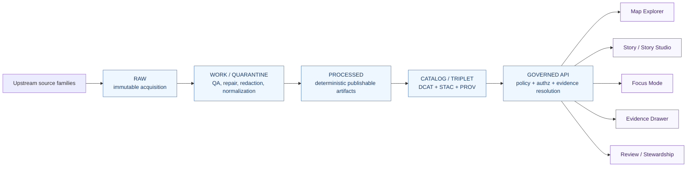

<!-- [KFM_META_BLOCK_V2]
doc_id: kfm://doc/TBD-VERIFY-root-readme-uuid
title: Kansas Frontier Matrix
type: standard
version: v1
status: draft
owners: TBD (verify ./.github/CODEOWNERS)
created: YYYY-MM-DD (verify first commit date)
updated: 2026-03-15
policy_label: public
related: [./CONTRIBUTING.md, ./.github/README.md, ./SECURITY.md, ./docs/, ./contracts/, ./schemas/, ./policy/, ./data/, ./tests/]
tags: [kfm, root-doc, governance, evidence-first, map-first, trust-system]
notes: [Root README revision candidate. Verify doc_id, owners, created date, linked paths, and any implementation-specific claims against the active branch before merge.]
[/KFM_META_BLOCK_V2] -->

# Kansas Frontier Matrix

Governed, evidence-first, map-first, time-aware monorepo for Kansas spatial evidence, publication, and trust-visible product surfaces.

> **Status:** Draft root README candidate  
> **Owners:** Verify in [`./.github/CODEOWNERS`](./.github/CODEOWNERS)  
> **Reading rule:** Treat doctrine in this file as stronger than unverified implementation detail. Upgrade `PROPOSED` or `UNKNOWN` only when the active branch, contracts, tests, workflows, or release artifacts prove the claim.  
> **Quick links:** [Truth posture](#truth-posture-and-claim-discipline) · [Document role](#document-role-and-neighbor-docs) · [Core invariants](#core-invariants) · [Repo shape](#documented-repo-shape-verify-against-branch) · [Quickstart](#verification-first-quickstart) · [Operating model](#operating-model) · [Promotion contract](#promotion-contract) · [Definition of done](#definition-of-done) · [FAQ](#faq)

> [!IMPORTANT]
> This file is the repo-root operating index. It should define identity, boundaries, invariants, and the minimum verification-first path into the codebase. It must not imply that every policy gate, route, workflow, or runtime guarantee already exists on the active branch.

## Truth posture and claim discipline

KFM is a trust system as much as a software system. This README stays conservative on purpose.

| Label | Meaning in this file |
|---|---|
| **CONFIRMED** | Directly supported by current repo-visible evidence or stable governing KFM doctrine. |
| **PROPOSED** | Recommended structure or operating rule that fits KFM doctrine but is not yet proven as live branch behavior. |
| **UNKNOWN** | Not verified strongly enough to present as current implementation fact. |

### Verification boundary

This file may confidently state KFM’s doctrinal core: the governed truth path, the trust membrane, evidence-linked public claims, cite-or-abstain behavior, and docs-as-production-surface expectations. It must stay explicit, however, when implementation depth is not branch-verified.

Treat the following as **UNKNOWN** until checked on the active branch:

- exact merge-blocking checks and branch-protection rules
- exact repo tree and directory contents beyond what you can inspect now
- exact service, DTO, route, schema, and workflow names
- exact runtime enforcement depth for evidence resolution, proof packs, and release gates
- exact deployment overlays, telemetry wiring, and production operational state

## What this README is for

Use this README for:

- root-level project identity and operating posture
- the top-level repo contract
- the non-negotiable architectural laws
- the documented repo shape and what still needs verification
- the minimum verification-first path from clone to trustworthy local inspection

Do not use this README for:

- the authoritative copy of schemas, API contracts, or policy bundles
- exhaustive source-family or domain inventories
- generated receipts, manifests, or evidence bundles
- branch-specific implementation claims that have not been re-verified
- long-form runbooks or ADRs that belong under [`./docs/`](./docs/)

## Document role and neighbor docs

**Path:** `/README.md`  
**Role:** Root orientation document for the Kansas Frontier Matrix monorepo.

| Direction | Surface | Why it matters |
|---|---|---|
| Adjacent | [`./CONTRIBUTING.md`](./CONTRIBUTING.md) | Contribution contract, review expectations, and change discipline. |
| Adjacent | [`./SECURITY.md`](./SECURITY.md) | Disclosure, handling, and security-contact posture. |
| Adjacent | [`./.github/README.md`](./.github/README.md) | Repository-control-plane guidance and README quality benchmark. |
| Downstream | [`./docs/`](./docs/) | Long-form architecture, governance, standards, ADRs, and runbooks. |
| Downstream | [`./contracts/`](./contracts/), [`./schemas/`](./schemas/), [`./policy/`](./policy/) | Machine-checkable contract and policy surfaces. |
| Downstream | [`./apps/`](./apps/), [`./packages/`](./packages/) | Governed runtime entrypoints and shared internal modules. |
| Downstream | [`./data/`](./data/) | Registry, truth-path artifacts, and governed data-facing structures. |
| Downstream | [`./infra/`](./infra/) | Bring-up, deployment, runtime, and operations surfaces. |
| Downstream | [`./tests/`](./tests/), [`./tools/`](./tools/) | Verification, validation, reproducibility, and support tooling. |

KFM should be read as a **truth path -> catalog -> governed API -> trust-visible surface** system. The repo root teaches that contract before contributors descend into service-, policy-, or domain-specific detail.

## Core invariants

| Invariant | Status in this README | Practical meaning | What must never happen |
|---|---|---|---|
| Truth path | **CONFIRMED doctrine** | Data moves through `RAW -> WORK/QUARANTINE -> PROCESSED -> CATALOG/TRIPLET -> PUBLISHED`. | Ad hoc publication from notebooks, temp files, or analyst-only transforms. |
| Trust membrane | **CONFIRMED doctrine** | Public and role-limited access crosses governed APIs, policy, and evidence resolution. | UI or external clients bypassing policy through direct store access. |
| Cite-or-abstain | **CONFIRMED doctrine** | Stories, visible claims, and Focus answers resolve to evidence or abstain. | Plausible uncited output presented as fact. |
| Default-deny / fail-closed | **CONFIRMED doctrine** | Unclear rights, unresolved sensitivity, or broken evidence blocks release. | “Best effort” publication under ambiguity. |
| Deterministic identity | **CONFIRMED doctrine** | Comparable inputs and the same spec produce the same logical identity and `spec_hash` where applicable. | Unstable IDs, drifting lineage, or ambiguous versions. |
| Evidence as interface | **CONFIRMED doctrine** | Evidence must be operationally resolvable, not decorative provenance. | Evidence trapped in disconnected notes or screenshots. |
| Docs as production surface | **CONFIRMED doctrine** | Behavior-significant change updates docs, templates, tests, and runbooks together. | Silent drift between behavior and written procedure. |
| Fact/speculation boundary | **PROPOSED presentation rule** | Observed, derived, modeled, and synthesized outputs stay visibly distinct. | Scenario or synthesized output presented as settled fact. |

## Documented repo shape (verify against branch)

The sections below describe the current **documentation contract** for the repo root. Treat them as the expected top-level shape to verify, not as a branch-local assertion until you inspect the active checkout.

### Expected top-level tree

```text
Kansas-Frontier-Matrix/
├── .github/
├── apps/
├── configs/
├── contracts/
├── data/
├── docs/
├── examples/
├── infra/
├── migrations/
├── packages/
├── policy/
├── schemas/
├── scripts/
├── tests/
├── tools/
├── CHANGELOG.md
├── CODE_OF_CONDUCT.md
├── CONTRIBUTING.md
├── LICENSE
├── README.md
└── SECURITY.md
```

### Intended top-level roles

| Path | Intended role |
|---|---|
| [`./.github/`](./.github/) | GitHub-side control plane for workflows, templates, review routing, and merge discipline. |
| [`./apps/`](./apps/) | Runnable services and user-facing applications. |
| [`./configs/`](./configs/) | Shared configuration that should not hard-code secrets. |
| [`./contracts/`](./contracts/) | API contracts, vocabularies, and interface surfaces. |
| [`./data/`](./data/) | Data specs, registries, examples, manifests, and governed data artifacts. |
| [`./docs/`](./docs/) | Architecture docs, ADRs, standards, runbooks, and long-form guidance. |
| [`./examples/`](./examples/) | Safe example material and demo assets. |
| [`./infra/`](./infra/) | Deployment, platform, and operational definitions. |
| [`./migrations/`](./migrations/) | Database or structure-migration surfaces. |
| [`./packages/`](./packages/) | Shared libraries and internal core modules. |
| [`./policy/`](./policy/) | Policy-as-code, fixtures, and policy tests. |
| [`./schemas/`](./schemas/) | Validation schemas for ingestion, contracts, and publishing. |
| [`./scripts/`](./scripts/) | Automation and helper scripts. |
| [`./tests/`](./tests/) | Unit, integration, policy, and end-to-end tests. |
| [`./tools/`](./tools/) | Validators, CLIs, link checkers, and support tooling. |

### What remains `UNKNOWN`

- exact current merge-blocking checks
- exact GitHub rulesets and protected-environment behavior
- exact branch-local implementation depth of each service, contract family, and policy pack
- exact runtime enforcement depth for evidence resolution, proof packs, and release gates
- exact current deployment overlays and production telemetry posture

## Accepted inputs

This repo should accept only inputs that can participate in the evidence model and governed publication path.

| Input type | Examples | Typical landing zone | Why it belongs |
|---|---|---|---|
| Historical tabular data | census extracts, registries, land records, archival tables | `RAW/` -> `WORK/` | Supports long-form observations and time-aware joins. |
| Vector geodata | boundaries, parcels, routes, service areas, sites | `RAW/` -> `PROCESSED/` | Carries spatial identity into governed publication. |
| Raster geodata | DEMs, land cover, climate grids, scenes, hazard rasters | `RAW/` -> `PROCESSED/` | Supports map-first delivery and evidence-linked derivatives. |
| Narrative evidence | archival documents, newspapers, oral histories, story drafts | evidence extraction flow | Enables stories and evidence bundles when rights are clear. |
| Metadata and lineage | DCAT, STAC, PROV, manifests, sidecars | `CATALOG/` | Makes discovery, lineage, and evidence resolution operational. |
| Derived outputs | analytics, model products, anomaly layers, reports | governed processed or runtime lanes | Allowed only when they stay linked to inputs, method, and receipts. |
| Validation artifacts | QA reports, fixtures, review notes, drift checks | `WORK/`, `docs/`, `tests/` | Governance artifacts are part of the system, not disposable byproducts. |
| Policy-safe civic / infrastructure assets | readiness tiers, service summaries, generalized facility layers | governed domain lanes | Must remain policy-labeled, auditable, and role-aware. |
| Policy-safe learning / lab assets | lesson modules, guided tours, scenario presets, compare packs | `docs/`, `contracts/`, governed app assets | Must preserve provenance, privacy, accessibility, and fact/speculation boundaries. |

## Exclusions

The following do **not** belong in the governed publication path.

| Exclusion | Why it stays out | Where it goes instead |
|---|---|---|
| Secrets, tokens, credentials | Never commit secrets to the repo. | Secret manager / environment configuration |
| Direct client-to-store access patterns | Breaks the trust membrane and bypasses policy. | Governed API routes and policy-aware services |
| Publishable artifacts without checksums, receipts, and catalogs | Cannot be audited, reproduced, or corrected safely. | Keep in `WORK/QUARANTINE` until complete |
| Uncited story claims or unverified Focus answers | Violates cite-or-abstain. | Draft outputs, failed runs, or withheld publication states |
| Rights-unclear or unresolved restricted public data | Ambiguity must fail closed. | Quarantine, metadata-only record, or redacted derivative |
| Fine-grained restricted civic / infrastructure layers | Can create unauthorized precision or policy leakage. | Restricted lanes, generalized geometry, or aggregate views |
| Docs that imply live behavior without proof | Overclaiming weakens trust. | Mark `UNKNOWN`, add verification steps, then update |
| Classroom or scenario outputs that blur fact and speculation | Teaches the wrong evidence model. | Clearly labeled instructional or modeled lanes only |

## Verification-first quickstart

The safest root-level quickstart is **verification-first**, not assumption-first.

```bash
# identify the exact revision
git rev-parse HEAD

# inspect the top-level and near-top-level shape
find . -maxdepth 2 -type d | sort

# inspect the GitHub control plane
find .github -maxdepth 3 -type f 2>/dev/null | sort
ls -la .github/workflows 2>/dev/null || true

# inspect likely contract, schema, and policy surfaces
find contracts policy schemas tests -maxdepth 3 -type f 2>/dev/null | sort

# inspect likely truth-path and evidence primitives
grep -RIn "spec_hash\|EvidenceRef\|EvidenceBundle\|policy_label\|opa\|rego" . || true
grep -RIn "DCAT\|STAC\|PROV\|run_receipt\|promotion receipt\|quarantine" . || true

# inspect likely product-surface lanes if present
grep -RIn "Story Studio\|Focus Mode\|lesson_module\|student_artifact\|scenario_run" . || true
grep -RIn "city dossier\|frontier_tier\|service_area\|infrastructure_asset\|readiness" . || true
```

<details>
<summary>Illustrative local-first contributor flow (use only if analogous targets actually exist)</summary>

```bash
make bootstrap
make validate-schemas
make test
make dev-up
make sample-ingest SOURCE=example_fixture
make catalog-validate
```

</details>

### Before documenting branch behavior as fact

1. What exists on this branch?
2. Which checks actually block merges?
3. Which contracts, policies, and validations are enforced today?
4. Is there one real end-to-end governed slice from acquisition to evidence-bearing publication?
5. Are science, educational, or civic/infrastructure surfaces implemented, partially implemented, or still design posture only?
6. Are fact/speculation, privacy, accessibility, and restricted-layer constraints enforced in runtime, or only described in docs?

## Operating model

### What KFM is

KFM is:

- a governed spatial evidence system
- a provenance-preserving publication program
- a catalog and evidence-resolution substrate
- a family of coordinated user surfaces over one policy and evidence boundary
- a Kansas-first operating environment for history, environment, infrastructure, and public knowledge
- a platform that can grow into learning, science, and civic lanes without weakening the evidence contract

### What KFM is not

KFM is **not**:

- a free-form chatbot
- a dashboard-only layer catalog
- a direct browser-to-database GIS stack
- a graph-first authority engine
- a publication path that can skip rights, validation, or provenance
- a classroom or scenario sandbox that collapses fact, simulation, and synthesis into one tone

### Product surfaces and their governing promise

| Surface | Status | What it should answer |
|---|---|---|
| Map Explorer | **CONFIRMED doctrine** | **Where** |
| Timeline / time controls | **CONFIRMED doctrine** | **When** |
| Story / Story Studio | **CONFIRMED doctrine** | **Why the evidence matters** |
| Evidence Drawer | **CONFIRMED doctrine** | **What a visible claim rests on** |
| Focus Mode | **CONFIRMED doctrine** | Natural-language access **without bypassing evidence or policy** |
| Review & Stewardship | **PROPOSED packaging** | Review, approval, correction, and release safety without leaving the governed shell |

### Kansas operating lanes at a glance

| Lane | Typical grain | Why it matters early |
|---|---|---|
| Historical / demographic | county-version, county-year, event-time | Establishes time-aware joins and a stable frontier-era baseline. |
| Hydrology / water | station-time, watershed, raster | Strong candidate for the first governed thin slice. |
| Hazards / disasters | event-time, county, polygon | High-value public context with visible governance needs. |
| Land / parcel / cadastral | parcel, legal description, PLSS section | Supports settlement, land-tenure, and archival interpretation. |
| Narrative / heritage | document, place, event-time | Critical for story publication and evidence depth. |
| Civic / infrastructure | service area, corridor, place | Useful, but must remain policy-labeled and precision-aware. |
| Science / modeling | run, parameter set, scenario output | Valuable only when assumptions and evidence remain visible. |

### First governed slice

Prefer **one fully governed vertical slice** over many half-governed features.

A credible opening slice is:

1. one time-aware boundary system
2. one promoted dataset family
3. one map layer that opens into evidence
4. one public story that resolves every claim
5. one Focus flow that cites correctly or abstains

## Diagram


```mermaid
flowchart LR
    A[Upstream source families] --> B[RAW<br/>immutable acquisition]
    B --> C[WORK / QUARANTINE<br/>QA, repair, redaction, normalization]
    C --> D[PROCESSED<br/>deterministic publishable artifacts]
    D --> E[CATALOG / TRIPLET<br/>DCAT + STAC + PROV]
    E --> F[GOVERNED API<br/>policy + authz + evidence resolution]
    F --> G[Map Explorer]
    F --> H[Story / Story Studio]
    F --> I[Focus Mode]
    F --> J[Evidence Drawer]
    F --> K[Review / Stewardship]

    classDef canon fill:#eef6ff,stroke:#4a78c2,color:#183b6b;
    classDef surface fill:#f8f6ff,stroke:#7c52c7,color:#3e246d;
    class B,C,D,E,F canon;
    class G,H,I,J,K surface;
```

## Promotion contract

Promotion is not a file copy. It is a governed state transition.

| Gate | Minimum proof | Fail-closed behavior |
|---|---|---|
| Identity and versioning | `dataset_id`, `dataset_version`, `spec_hash`, stable logical key, deterministic naming | Block on missing, duplicated, or unstable identity |
| Schema and QA | schema validity, CRS sanity, geometry checks, interval sanity, row-count invariants | Route to `QUARANTINE` on blocking validation failure |
| Rights and license | license basis, terms snapshot, redistribution rules, attribution obligations | Block if rights are unclear or incompatible |
| Sensitivity and redaction | policy label, redaction parameters, generalization method, obligations | Block or restrict if sensitivity is unresolved |
| Catalog triplet | valid DCAT, STAC, and PROV with working links | Block if any triplet member is missing or inconsistent |
| Receipt and attestation | run receipt, checksums, artifact digests, lane-required signing or attestation | Block when required proofs are absent |
| Publish and ledger | promotion receipt, audit append, release reference, rollback pointer | Block if final publication leaves the surface inconsistent |

### Canonical vs rebuildable rule

| Class | Examples |
|---|---|
| **Canonical** | `RAW`, `PROCESSED`, catalog triplet members, run receipts, signed manifests, policy decisions |
| **Rebuildable unless explicitly promoted** | search indexes, vector indexes, tiles, caches, denormalized summary tables, graph projections |

### Reference implementation profiles

| Profile | Recommended shape | Why it fits |
|---|---|---|
| Local-first development | filesystem- or emulator-backed object storage, PostgreSQL + PostGIS, optional search/graph, governed API, policy engine, MapLibre, local model serving behind the API | Keeps the full trust membrane visible while staying easy to run locally. |
| Cloud-ready production | versioned object storage, PostgreSQL + PostGIS, optional search/graph, OAuth2/OIDC, container orchestration, centralized logs/metrics/traces, signing/attestation infrastructure | Preserves the same boundaries while scaling throughput, reliability, and auditability. |

## Definition of done

Use this as the minimum repo-root gate list for serious work.

- [ ] `spec_hash` behavior is stable across comparable inputs
- [ ] controlled vocabularies and schemas validate in CI
- [ ] DCAT/STAC/PROV links resolve and broken links block merges
- [ ] policy tests default-deny and cover known restricted scenarios
- [ ] `EvidenceRef` values resolve to policy-safe `EvidenceBundle` payloads end to end
- [ ] Map Explorer exposes evidence, version, and rights information from the UI
- [ ] story publication requires review state and resolvable citations
- [ ] Focus Mode either cites correctly with receipts or abstains
- [ ] rights and sensitivity labels are present for publishable data
- [ ] observational, derived, modeled, and synthesized outputs are clearly separated
- [ ] accessibility and privacy expectations are explicit for any public-learning or classroom-facing surface
- [ ] runbooks and docs are updated alongside behavior changes

## FAQ

### Why is KFM stricter than a normal map portal?

Because KFM is intended to be a **trust system**, not just a presentation layer. Provenance, policy, and evidence are runtime requirements, not post-publication decoration.

### Why keep saying `UNKNOWN` when the repo is already substantial?

Because repo size does not prove runtime governance. Visible code can confirm structure; it cannot, by itself, confirm policy enforcement, release proofs, or production behavior.

### Why are catalogs and evidence objects treated as first-class?

Because discovery, reproducibility, review, and public trust depend on resolvable metadata and lineage, not just attractive maps.

### Why keep observational data distinct from modeled or AI-derived outputs?

Because KFM must preserve the difference between what was observed, what was inferred, what was simulated, and what was synthesized.

### Why is the first release intentionally narrow?

Because one fully governed slice proves the architecture honestly. Many half-governed slices only prove that governance was bypassed.

### Why does the root README avoid turning every design idea into a repo fact?

Because KFM’s own doctrine rejects persuasive overclaiming. The root document should stay sharp, operational, and branch-honest.

## Appendix — source and verification notes

<details>
<summary>Open the root-doc verification appendix</summary>

### Governing rule

The KFM manuals define project posture. In-repo files and branch evidence define current repo truth. This README should never blur those two layers.

### Next in-repo surfaces to inspect

- [`./.github/README.md`](./.github/README.md)
- [`./CONTRIBUTING.md`](./CONTRIBUTING.md)
- [`./docs/`](./docs/)
- [`./contracts/`](./contracts/)
- [`./policy/`](./policy/)
- [`./schemas/`](./schemas/)
- [`./tests/`](./tests/)
- [`./infra/`](./infra/)

### Root README maintenance rule

Keep this file focused on:

- repo identity
- top-level boundaries
- non-negotiable invariants
- documented repo shape + verification boundary
- the minimum governed quickstart
- the definition of done for serious work

Push deep source-library mappings, long domain inventories, and extended implementation notes into `docs/` once those pages are ready.

[Back to top](#kansas-frontier-matrix)

</details>
