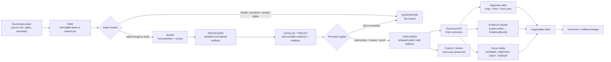

<!-- [KFM_META_BLOCK_V2]
doc_id: kfm://doc/NEEDS-VERIFICATION
title: Kansas Frontier Matrix
type: standard
version: v1
status: draft
owners: @bartytime4life
created: NEEDS-VERIFICATION
updated: 2026-04-25
policy_label: NEEDS-VERIFICATION
related: [NEEDS-VERIFICATION]
tags: [kfm, readme, spatial-evidence, governance, map-first, time-aware]
notes: [Root README revision prepared from the uploaded KFM README draft, attached KFM doctrine, and current-session workspace scan. No mounted KFM Git repository was found in this session; visible workspace evidence is uploaded PDFs, prompt files, and generated scan output, not a source checkout. Confirm doc_id, owners, created date, policy label, related links, root file casing, package manager, workflows, schemas, contracts, tests, source registries, release artifacts, and runtime behavior before merge.]
[/KFM_META_BLOCK_V2] -->

<a id="top"></a>

# Kansas Frontier Matrix

A governed, evidence-first, map-first, time-aware spatial knowledge system for producing inspectable public claims from spatial evidence.

> [!IMPORTANT]
> **Status:** `experimental` · **Document status:** `draft` · **Owners:** `@bartytime4life`
> **Target path:** `README.md` / `readme.md` — `NEEDS VERIFICATION; repo not mounted`  
> **Evidence posture:** `CONFIRMED doctrine` · `CONFIRMED no mounted repo` · `UNKNOWN implementation depth`  
> **Operating posture:** artifactization and verification before broad live-source ingestion, UI expansion, model integration, or public release.
>
> 
> 
> 
> 
> 
> 
>
> **Quick jumps:** [Scope](#scope) · [Evidence basis](#evidence-basis) · [Repo scan](#current-session-repo-scan) · [Repo fit](#repo-fit) · [Inputs](#accepted-inputs) · [Exclusions](#exclusions) · [Architecture](#architecture-at-a-glance) · [Directory tree](#target-directory-tree) · [Quickstart](#verification-first-quickstart) · [Done](#definition-of-done) · [FAQ](#faq)

---

## Scope

Kansas Frontier Matrix (**KFM**) is not a generic GIS portal, a map tile project, a graph demo, or an AI chatbot.

**CONFIRMED doctrine:** KFM’s durable public value is the **inspectable claim**: a statement reconstructable to admissible evidence, spatial and temporal scope, source role, policy posture, review state, release state, and correction lineage.

**PROPOSED implementation posture:** move the repository through small, reversible, proof-bearing thin slices before broad live-source ingestion, public map layers, UI polish, model-provider integration, or publication workflows.

**CONFIRMED current-session scan:** no mounted KFM Git checkout was available. Current package manager, root directory conventions, checked-in schemas, APIs, route names, workflows, tests, dashboards, runtime logs, branch protections, source registries, emitted receipts, and release artifacts remain `UNKNOWN`.

> [!WARNING]
> This README is written from attached KFM doctrine, the uploaded README draft, and a current-session workspace scan. The authoring session scanned common workspace roots and did **not** find a mounted KFM Git checkout. Any implementation-shaped path, command, route, workflow, schema, test, or file below is either `PROPOSED`, `UNKNOWN`, or `NEEDS VERIFICATION` until a maintainer confirms it in the real repository.

[Back to top](#top)

---

## Evidence basis

This file is intentionally truth-labeled because README language can otherwise create false implementation confidence.

| Evidence class | Status in this revision | How it is used |
|---|---|---|
| Attached KFM doctrine and synthesis PDFs | `CONFIRMED as supplied documents` | Establish KFM identity, trust posture, lifecycle, object families, UI/AI boundaries, and publication discipline |
| Uploaded root README draft | `CONFIRMED as source text` | Preserved as the baseline structure and wording where strong |
| Current-session workspace/repo scan | `CONFIRMED` | Confirms `/mnt/data` is not a Git repository; common-root `.git` probes returned no target checkout; expected KFM repo directories were absent from the visible workspace |
| Target repository implementation | `UNKNOWN` | Not used to claim existing root README casing, files, routes, workflows, tests, source registries, dashboards, branch rules, or runtime behavior |
| External standards and sources | `DEFERRED` | Not needed for this root README revision; recheck separately for source activation, standards versions, API behavior, licensing, or security facts |

### Current-session repo scan

`CONFIRMED`: the visible workspace did not contain a mounted KFM source checkout during this revision. This scan reinforces the README's caution labels and prevents stale implementation claims from entering the root orientation doc.

| Probe | Result | README consequence |
|---|---|---|
| `git -C /mnt/data status --short` | `fatal: not a git repository` | No branch, dirty-state, tracked-file, or root README claim is made. |
| `git -C /mnt/data branch --show-current` | `fatal: not a git repository` | No branch-specific implementation claim is made. |
| `git -C /mnt/data rev-parse --show-toplevel` | `fatal: not a git repository` | `/mnt/data` is an evidence workspace, not a repo root. |
| Common-root `.git` probe | No target `.git` directory returned under checked workspace roots | Mounted repo implementation remains `UNKNOWN`. |
| Expected KFM directories under `/mnt/data` | No `.github`, `docs`, `contracts`, `schemas`, `policy`, `data`, `tools`, `tests`, `apps`, `packages`, `pipelines`, `infra`, `configs`, or `release` tree was visible | All such paths remain `PROPOSED / NEEDS VERIFICATION`. |
| Repo marker probe | Only unrelated system/skill files were found outside `/mnt/data` | Do not infer KFM package manager, framework, or CI from environment files. |

> [!NOTE]
> The uploaded Markdown draft is `CONFIRMED` as source text. It is not proof that a root `README.md` or `readme.md` exists in the target repository.

### Truth labels used here

| Label | Meaning |
|---|---|
| `CONFIRMED` | Verified in this session from attached documents, uploaded Markdown, command output, or visible workspace evidence |
| `PROPOSED` | Recommended design, file home, sequence, or implementation shape not verified as present in the repo |
| `UNKNOWN` | Not verifiable because the repository, runtime, logs, workflows, dashboards, or platform settings were not mounted |
| `NEEDS VERIFICATION` | Specific check required before merge, source activation, release, or public claim |
| `CONFLICTED` | Evidence suggests unresolved authority, naming, or file-home ambiguity; no current repo conflict is proven without repo access |

[Back to top](#top)

---

## Repo fit

This README is the root orientation layer. It should help maintainers and reviewers decide whether a change preserves KFM’s trust membrane before they inspect lower-level docs, contracts, tests, and release artifacts.

| Field | Value |
|---|---|
| **Target file** | `README.md` or `readme.md` — `NEEDS VERIFICATION`; current scan found no mounted repo root, and the uploaded draft filename is not repo casing proof |
| **Role** | Root orientation, trust posture, navigation, contributor guardrails, and verification-first onboarding |
| **Primary upstream doctrine** | `docs/architecture/`, `docs/registers/`, `docs/adr/` — `PROPOSED / NEEDS VERIFICATION` |
| **Machine contracts** | `schemas/contracts/v1/` and/or `contracts/` — `CONFLICTED / ADR REQUIRED` |
| **Policy boundary** | `policy/`, `tools/validators/`, `.github/workflows/` — `PROPOSED / NEEDS VERIFICATION` |
| **Downstream consumers** | governed API, MapLibre shell, Evidence Drawer, Focus Mode, exports, release review — `PROPOSED until a real checkout is inspected` |
| **Primary reviewer question** | “Does this change preserve the trust membrane and make claims more inspectable?” |

This file should stay high-level. Domain details, source-specific rules, validator behavior, schema definitions, policy code, and release proof formats belong in their own verified repo homes and should be linked here only after their paths are confirmed.

---

## Accepted inputs

Use this README to orient maintainers, contributors, reviewers, and stewards around KFM’s governed shape.

| Accepted input | Belongs here when… | Typical downstream home |
|---|---|---|
| Project identity | It explains what KFM is and is not | `docs/architecture/` — `NEEDS VERIFICATION` |
| Trust posture | It names rules contributors must preserve | `docs/registers/`, `policy/` — `NEEDS VERIFICATION` |
| Lifecycle overview | It clarifies RAW → PUBLISHED movement | `data/`, `release/`, `docs/runbooks/` — `NEEDS VERIFICATION` |
| First-slice guidance | It describes safe next work without claiming implementation | `docs/adr/`, `tests/`, `tools/validators/` — `NEEDS VERIFICATION` |
| Contributor gates | It tells reviewers what must pass before merge | `.github/`, `tests/`, `policy/` — `NEEDS VERIFICATION` |
| Navigation | It points to verified repo paths | Root and directory READMEs after path verification |

---

## Exclusions

Do **not** use this README as a dumping ground for raw material, unstable operational facts, or unreviewed public claims.

| Excluded item | Why it does not belong here | Put it here instead |
|---|---|---|
| Raw source files, scraped data, private records | Root README is not a lifecycle store | `data/raw/`, `data/work/`, or `data/quarantine/` after source intake — `NEEDS VERIFICATION` |
| Secrets, API keys, tokens, credentials | Public docs and receipts must not leak secrets | Local secret manager / deployment config outside repo |
| Exact sensitive locations | Archaeology, rare species, cultural, critical-infrastructure, living-person, and DNA contexts fail closed | Restricted steward workflow with redaction/generalization receipts |
| Direct model output | AI is interpretive, not root truth | Governed runtime envelope + EvidenceBundle + citation validation |
| Unverified source terms or current endpoint claims | Rights, quotas, schemas, and APIs change | Source registry with `NEEDS VERIFICATION` |
| Broad route/API claims | Current route tree was not inspected | API contracts after repo verification |
| Emergency or medical instructions | KFM contextualizes evidence; it is not an alerting or medical system | Official emergency, public-health, or life-safety authorities |

[Back to top](#top)

---

## Architecture at a glance


```mermaid
flowchart LR
  A[SourceDescriptor<br/>source role, rights, sensitivity] --> B[RAW<br/>immutable bytes or references]
  B --> C{Intake checks}
  C -->|valid enough to work| D[WORK<br/>normalization + review]
  C -->|invalid / sensitive / unclear rights| Q[QUARANTINE<br/>fail closed]
  D --> E[PROCESSED<br/>validated normalized artifacts]
  E --> F[CATALOG / TRIPLET<br/>discoverable evidence + relations]
  F --> G{Promotion gates}
  G -->|pass policy + review + proof| H[PUBLISHED<br/>released public-safe artifacts]
  G -->|fail or uncertain| Q

  H --> I[Governed API<br/>finite outcomes]
  I --> J[MapLibre shell<br/>map + time + trust cues]
  I --> K[Evidence Drawer<br/>EvidenceRef → EvidenceBundle]
  I --> L[Focus Mode<br/>ANSWER / ABSTAIN / DENY / ERROR]
  J --> M[Inspectable claim]
  K --> M
  L --> M

  H --> N[Exports / stories<br/>trust cues preserved]
  M --> O[Correction / rollback lineage]
```

### Non-negotiable trust rules

| Rule | README-level meaning |
|---|---|
| **Lifecycle is law** | Public surfaces do not read RAW, WORK, QUARANTINE, or canonical/internal stores directly. |
| **Evidence outranks fluency** | An EvidenceBundle beats generated prose. Focus Mode cites, abstains, denies, or errors. |
| **Renderer is not truth** | MapLibre renders governed outputs; it does not decide source authority. |
| **AI is an adapter** | Model runtimes stay behind governed APIs, after evidence resolution and policy checks. |
| **Promotion is a state transition** | Publication requires validation, policy, review, proof, and rollback memory. |
| **Negative states are first class** | Unsupported, restricted, stale, generalized, embargoed, and unresolved are valid outcomes. |
| **Rights and sensitivity fail closed** | Unknown rights, unclear sensitivity, or exact sensitive geometry blocks public release. |

---

## Target directory tree

`NEEDS VERIFICATION`: this tree reflects the target architecture repeatedly described in the attached implementation manuals and the uploaded draft. Verify the real checkout before creating, moving, renaming, or linking files.

```text
.
├── README.md                       # or readme.md — confirm repo convention
├── docs/
│   ├── README.md
│   ├── adr/
│   ├── architecture/
│   ├── domains/
│   ├── registers/
│   └── runbooks/
├── schemas/
│   └── contracts/
│       └── v1/
├── contracts/
│   ├── api/
│   └── runtime/
├── policy/
├── tools/
│   ├── validators/
│   └── ingest/
├── pipelines/
├── data/
│   ├── registry/
│   ├── fixtures/
│   ├── raw/
│   ├── work/
│   ├── quarantine/
│   ├── processed/
│   ├── catalog/
│   ├── triplets/
│   ├── receipts/
│   ├── proofs/
│   └── published/
├── release/
├── apps/
│   ├── governed-api/
│   └── web/
├── packages/
├── tests/
├── .github/
│   └── workflows/
├── infra/
└── configs/
```

> [!CAUTION]
> The schema home is not safe to assume. Do not maintain divergent machine contracts in both `schemas/` and `contracts/` without an ADR that names the canonical home, compatibility aliases, validators, and migration plan.

[Back to top](#top)

---

## Verification-first quickstart

Start with evidence inventory, not build assumptions.

```bash
git status --short
git branch --show-current
git rev-parse --show-toplevel

find . -maxdepth 2 -type f \
  \( -iname 'readme.md' -o -iname 'README.md' -o -name 'package.json' -o -name 'pyproject.toml' -o -name 'go.mod' -o -name 'Cargo.toml' -o -name 'Makefile' \) \
  | sort

find .github docs contracts schemas policy data tools tests apps packages pipelines infra configs release \
  -maxdepth 3 -type f 2>/dev/null \
  | sort \
  | sed -n '1,250p'
```

Record the result in a small repo-evidence note before changing architecture-significant files. In this session, that note is represented by the generated scan output; it confirms no mounted repo checkout was available.

### First safe PR shape

| Step | Target | Why this comes first |
|---:|---|---|
| 1 | Repo inventory + README/meta-block verification | Avoids false implementation confidence |
| 2 | Schema-home ADR | Prevents contracts-vs-schemas drift |
| 3 | Source registry skeleton | Makes source roles, rights, and sensitivity explicit |
| 4 | Core schema wave | Makes EvidenceBundle, DecisionEnvelope, receipts, manifests, and layer payloads testable |
| 5 | Offline fixtures | Allows valid/invalid proof without live source risk |
| 6 | Validators + policy stubs | Converts doctrine into fail-closed checks |
| 7 | No-network hydrology dry run | Proves a lower-sensitivity end-to-end lane before higher-risk domains |
| 8 | Evidence Drawer + Focus payload contracts | Keeps UI and AI downstream of evidence |

`PROPOSED`: hydrology remains the preferred first proof lane because it exercises source identity, geometry, time, catalog, API, UI, and evidence resolution without starting from the highest-sensitivity domains.

---

## Core object families

These object families are a contract and verification backlog unless the real repository proves they already exist.

| Object family | Purpose | Public-release pressure |
|---|---|---|
| `SourceDescriptor` | Names source role, authority limits, rights, sensitivity, cadence, and activation state | Blocks promotion when rights/source role are unknown |
| `EvidenceRef` | Stable reference to support material | Must resolve before consequential claims |
| `EvidenceBundle` | Inspectable support package with source, scope, lineage, rights, and review posture | Outranks generated language |
| `PolicyDecision` | Records allow/deny/abstain obligations | Must be visible to release and UI gates |
| `ValidationReport` | Explains what passed, failed, or quarantined | Required for reviewable promotion |
| `RuntimeResponseEnvelope` | Finite outward answer shape | Prevents free-form unsupported responses |
| `RunReceipt` / `AIReceipt` | Process memory for pipelines and model-assisted outputs | Receipts are not proof by themselves |
| `ReleaseManifest` | Names released artifacts and integrity metadata | Required for publication and rollback |
| `LayerManifest` | Binds map layers to governed sources and evidence routes | Map layer must not point to raw/work/quarantine |
| `CatalogMatrix` | Tracks catalog closure and discoverability | Prevents orphaned artifacts |
| `RollbackReference` | Identifies prior release or rebuild target | Required for correction-forward publication |

---

## UI and AI boundary

KFM’s UI is part of the trust system, not decorative chrome. KFM’s AI layer is interpretive, bounded, and subordinate to evidence, policy, review, and release state.

| Surface | Must do | Must never do |
|---|---|---|
| MapLibre shell | Render governed layers with time, trust, evidence, review, and policy cues | Become a sovereign source of truth |
| Evidence Drawer | Resolve EvidenceRef into EvidenceBundle details | Behave like an optional tooltip |
| Focus Mode | Synthesize only over released, policy-safe evidence with finite outcomes | Act as a free-form chatbot or direct model client |
| Review surface | Show diffs, obligations, approvals, denials, and correction state | Become a hidden alternate truth system |
| Export / story | Preserve trust cues, provenance, generalization, and correction state | Strip evidence context for polish |
| Controlled 3D | Answer burden-bearing questions only when 2D cannot carry the burden | Turn KFM into spectacle-first visualization |

---

## Definition of done

A KFM change is not done because it renders, summarizes, or passes a happy-path demo. It is done when it strengthens inspectability without weakening governance.

- [ ] Repository path, owner, and adjacent docs verified.
- [ ] KFM meta block present and reviewable for every governed Markdown file touched.
- [ ] Source roles, rights, sensitivity, and activation state declared.
- [ ] EvidenceRef resolves to EvidenceBundle for consequential claims.
- [ ] Lifecycle state is explicit: RAW, WORK, QUARANTINE, PROCESSED, CATALOG/TRIPLET, or PUBLISHED.
- [ ] No public route, UI layer, export, story, or Focus result reads RAW, WORK, QUARANTINE, or canonical stores directly.
- [ ] Valid and invalid fixtures exist for changed contracts.
- [ ] Validators fail closed for unknown rights, unknown sensitivity, missing citation, unsupported source role, and unresolved evidence.
- [ ] Decision envelope supports `ANSWER`, `ABSTAIN`, `DENY`, and `ERROR`.
- [ ] Receipts and proofs remain separate.
- [ ] Release path includes review state, promotion decision, rollback reference, and correction route.
- [ ] Docs updated where behavior, contract, lifecycle, or public meaning changed.
- [ ] Rollback is described before publication.

[Back to top](#top)

---

## Current verification backlog

| Item | Status | Next check |
|---|---|---|
| Root file casing: `README.md` vs `readme.md` | `UNKNOWN / NEEDS VERIFICATION` | Mount the real repo and verify existing casing before replacing the root file |
| Owner / CODEOWNERS coverage | `NEEDS VERIFICATION` | Confirm steward ownership model and CODEOWNERS intent with maintainers |
| Package manager and test runner | `UNKNOWN` | Confirm authoritative runtime/toolchain and executable verification commands |
| Schema home | `CONFLICTED / NEEDS ADR` | Decide `schemas/contracts/v1/` vs `contracts/` authority after repo inspection |
| Existing governed API | `UNKNOWN` | Inspect `apps/`, `packages/`, and route contracts in a mounted checkout |
| Existing MapLibre shell | `UNKNOWN` | Inspect web app and layer registry in a mounted checkout |
| Existing Evidence Drawer / Focus Mode | `UNKNOWN` | Inspect UI contracts and runtime envelopes in a mounted checkout |
| CI gates | `UNKNOWN` | Inspect `.github/workflows/`, required checks, and policy/test gates |
| Source registry | `UNKNOWN` | Inspect `data/registry/` and source descriptor conventions |
| Release artifacts | `UNKNOWN` | Inspect `release/`, `data/proofs/`, `data/receipts/`, and `data/published/` |
| Public exposure posture | `NEEDS VERIFICATION` | Verify firewall, reverse proxy, VPN, auth, audit logging, secrets, and least-privilege boundaries before semi-public access |

---

## FAQ

### Is KFM a GIS portal?

No. KFM may use GIS, MapLibre, catalogs, graph relations, AI, tiles, and APIs, but those are mechanisms. The public unit of value is the inspectable claim.

### Can a map popup make a claim without evidence?

No. A consequential popup should be able to route to an EvidenceBundle or clearly mark that evidence is unavailable, partial, restricted, stale, generalized, or under review.

### Can Focus Mode answer from the model’s memory?

No. Focus Mode is bounded synthesis over released, policy-safe evidence. It should return `ABSTAIN`, `DENY`, or `ERROR` rather than unsupported prose when evidence, rights, policy, or identity are insufficient.

### Are receipts the same as proofs?

No. Receipts are process memory: what ran, when, with which inputs, checks, and outputs. Proofs are release evidence that supports promotion and later inspection.

### Why so many `UNKNOWN` labels?

Because implementation evidence matters. Attached doctrine can confirm KFM’s intended architecture; it cannot prove the current repository’s route tree, tests, workflows, runtime behavior, or deployment posture without a mounted checkout.

---

<details>
<summary>Glossary</summary>

| Term | Working meaning |
|---|---|
| **Inspectable claim** | A public-facing statement reconstructable to evidence, scope, source role, policy, review, release, and correction lineage |
| **Trust membrane** | Boundary preventing internal/canonical/raw paths from becoming normal public truth paths |
| **EvidenceRef** | Stable reference to evidence that must resolve into an EvidenceBundle |
| **EvidenceBundle** | Human- and machine-inspectable support package |
| **DecisionEnvelope** | Finite response object carrying outcome, evidence refs, policy, reason codes, and obligations |
| **SourceDescriptor** | Source identity and governance record |
| **spec_hash** | Deterministic identity for a specification or run input, not a claim of correctness |
| **RunReceipt** | Process-memory record for pipeline execution |
| **AIReceipt** | Process-memory record for material model participation |
| **ReleaseManifest** | Integrity and publication manifest for released artifacts |
| **CatalogMatrix** | Catalog closure surface for datasets, distributions, evidence, and release objects |
| **LayerManifest** | Map-layer governance record binding renderer inputs to source/evidence/policy state |
| **Quarantine** | Lifecycle state for invalid, unresolved, rights-conflicted, sensitive, or unfit material |
| **Promotion** | Governed state transition into public-safe release, not a file move |
| **RollbackReference** | Explicit path back to prior release or rebuild target |
| **Focus Mode** | Evidence-bounded synthesis surface with finite outcomes |
| **Evidence Drawer** | Trust-visible UI object that explains what backs a claim |

</details>

[Back to top](#top)
