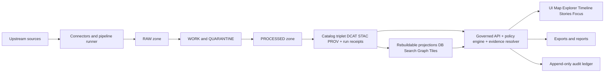
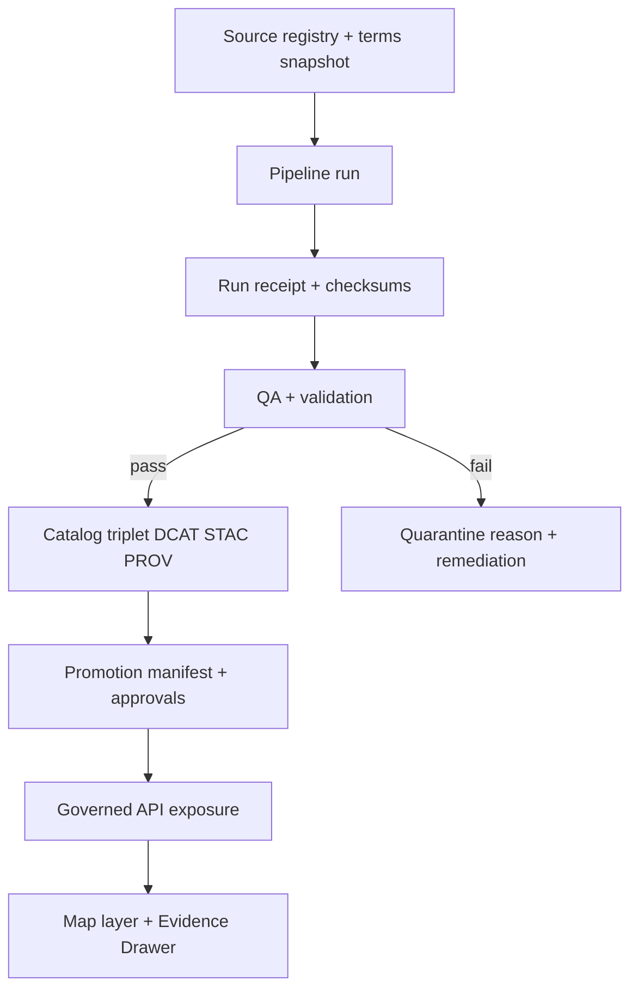
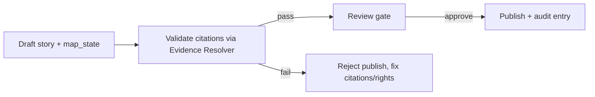
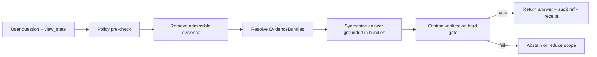

<!-- [KFM_META_BLOCK_V2]
doc_id: kfm://doc/0c6f7a9b-0f6b-4d7d-8d6d-8d70f5c85d20
title: Kansas Frontier Matrix
type: standard
version: vNext
status: draft
owners: TBD
created: 2026-02-22
updated: 2026-03-02
policy_label: public
related:
  - README.md
tags:
  - kfm
notes:
  - Repository README describing the vNext operating model and governance posture.
  - Root “trust membrane” + promotion contract + evidence model; UI/infra specifics are branch-dependent.
  - This README is designed to be enforceable: anything that can’t be validated must be labeled PROPOSED/UNKNOWN.
[/KFM_META_BLOCK_V2] -->

<a id="top"></a>

# Kansas Frontier Matrix

> **Map-first • Time-aware • Governed • Evidence-first • Cite-or-abstain**  
> **Core posture:** **default-deny** • **fail-closed** • reproducible by digest • policy enforced in CI + runtime

**Status:** vNext (blueprint-driven build)  
**Owners:** _TBD_ (required for CODEOWNERS + review routing)  
**Primary promise:** anything you can see, cite, export, or ask KFM to explain is traceable to an immutable **DatasetVersion** + resolvable **EvidenceBundle**, with policy enforced consistently in CI and at runtime.  
**Primary experiences:** **Map Explorer** + **Timeline** + **Stories** + **Catalog** + **Focus Mode**.

[](#roadmap)
[](#governance)
[](#evidence-and-citations)
[](#core-invariants)
[](#truth-path-and-promotion-contract)
[](#documentation-is-production)
[](#license)

---

## Start here

Pick the path that matches what you’re doing:

- **I’m contributing code/docs/data**
  - Read: `CONTRIBUTING.md` (workflow), `.github/README.md` (CI + CODEOWNERS), `SECURITY.md` (reporting), `CODE_OF_CONDUCT.md` (community standards) — *if present*
  - Know: changes to `.github/`, `policy/`, `contracts/`, promotion tooling, and any “Published” surfaces are **governance-critical**

- **I’m stewarding governance**
  - Read: `docs/governance/` (labels, obligations, review triggers), `policy/` (policy-as-code), `contracts/` (schemas/profiles/vocab) — *if present*
  - Know: if sensitivity/permissions are unclear → **default deny** until reviewed

- **I’m operating pipelines / runtime**
  - Read: `docs/runbooks/` and `infra/` — *if present*
  - Know: DB/search/tiles are rebuildable projections; **canonical truth is processed artifacts + catalogs + receipts + audit**

> [!IMPORTANT]
> **Truth discipline in this repo**
> - **CONFIRMED** = backed by in-repo artifacts on your branch (code, schemas, tests, CI gates).
> - **PROPOSED** = recommended defaults / target design (safe to discuss, not safe to enforce).
> - **UNKNOWN / DECISION NEEDED** = unverified; treat as fail-closed until verified.
>
> Every **UNKNOWN** must include:
> 1) the recommended default behavior, and  
> 2) the minimum verification step to convert UNKNOWN → CONFIRMED.

> [!NOTE]
> This README defines the **target vNext operating model**. If a directory/file referenced here is missing on your branch, treat that reference as **PROPOSED** and reconcile with repo reality before enforcing gates.

[↑ Back to top](#top)

---

## Quick navigation

- **Orientation**
  - [What this repo is](#what-this-repo-is)
  - [Reality check](#reality-check-first)
  - [Repo entrypoints](#repo-entrypoints)
  - [Quick start](#quick-start)
- **Trust model**
  - [System overview](#system-overview)
  - [Golden paths](#golden-paths)
  - [Core invariants](#core-invariants)
  - [Key concepts](#key-concepts-and-glossary)
- **Governance + runtime**
  - [Truth path and promotion contract](#truth-path-and-promotion-contract)
  - [Deterministic identity and versioning](#deterministic-identity-and-versioning)
  - [Catalog triplet and profiles](#catalog-triplet-and-profiles)
  - [Evidence and citations](#evidence-and-citations)
  - [Governed API](#governed-api)
  - [Focus Mode AI](#focus-mode-ai)
  - [Security](#security)
- **Repo mechanics**
  - [Repository layout](#repository-layout)
  - [Documentation is production](#documentation-is-production)
  - [Roadmap](#roadmap)
  - [References](#references)

---

## What this repo is

KFM is a governed knowledge system where **map + timeline** are the primary interface.

KFM is trustworthy because every user-visible claim is grounded in:

- immutable **DatasetVersions** (digest-addressed)
- policy-evaluated, resolvable **EvidenceBundles**
- reproducible **run receipts** + append-only **audit logging**
- strict catalogs (**DCAT + STAC + PROV**) that form the “anti-hallucination substrate”

KFM is also a system of governed artifacts:

- **Data artifacts** (raw/work/quarantine/processed) and their catalogs
- **Docs and narratives** (Story Nodes, ADRs, runbooks) with policy labels
- **Contracts** (OpenAPI, schemas, catalog profiles, vocabularies) enforced in CI
- **Policy-as-code** (default deny) enforced in CI + runtime

### What KFM is not

- Not an ungoverned GIS file dump.
- Not a “trust me” narrative system (stories must cite resolvable evidence).
- Not a general chatbot (Focus Mode is a governed workflow that must cite-or-abstain).
- Not “whatever the database says” (DB/search/tiles are projections; catalogs + processed artifacts are canonical).

### Non-goals for vNext (keep it buildable)

- Do not model every historical interpretation as “fact.” Stories must separate **evidence** from **interpretation** and keep uncertainty explicit.
- Do not mirror/redistribute content when licensing is unclear. Prefer **metadata-only references** until rights are cleared.
- Do not ship “general chatbot” behavior. Focus Mode remains a governed run with cite-or-abstain hard gates.
- Do not make 3D the primary surface for vNext. Keep vNext map-first as 2D + time; treat 3D as a scoped Story feature.

[↑ Back to top](#top)

---

## Reality check first

Before implementing or “fixing” anything, verify what exists **on your branch**. This prevents governance failures caused by assumptions.

### Minimum verification steps (do these once per branch)

- Confirm whether this is a monorepo (`apps/` + `packages/`) or a different layout.
- Confirm the policy engine choice and how it runs in **CI** and in **runtime**.
- Confirm what is canonical (object storage + catalogs + audit ledger) vs rebuildable (DB/search/tiles).
- Confirm how documents are served: via governed API (policy-labeled) or Git-only.
- Confirm the UI stack and map state representation (Story Node sidecars, view-state tokens).
- Confirm how secrets are managed (must not live in repo; injected via CI/runtime secret stores).

> [!IMPORTANT]
> **Fail-closed rule:** if any of the above is unclear, default-deny and label as **UNKNOWN / DECISION NEEDED** until verified.

### Verification checklist (attach outputs to the next README revision)

- [ ] Record commit hash and root tree: `git rev-parse HEAD` and `tree -L 3`.
- [ ] Extract merge-blocking CI gates from `.github/workflows/`.
- [ ] Locate: `spec_hash` tooling, policy tests, catalog validators/link-checks, evidence resolver, dataset registry schema.
- [ ] Promote **one** MVP dataset end-to-end with receipts + catalogs + audit refs.
- [ ] Prove UI cannot bypass the governed API (static analysis + network policy + tests).
- [ ] For Focus Mode: run evaluation harness and store golden outputs as artifacts.

[↑ Back to top](#top)

---

## Repo entrypoints

If you only read three things first:

1. `README.md` — operating model + where to find things.
2. `.github/README.md` — CI gates + CODEOWNERS posture (*if present*).
3. `contracts/` + `policy/` — machine-enforced truth: schemas/profiles/vocab + default-deny tests (*if present*).

### Governance-critical surfaces

These paths change enforcement behavior. Treat changes here like production configuration.

> [!WARNING]
> A PR that modifies anything below SHOULD be reviewed like production config and MUST have explicit owners + merge-blocking checks.

| Path | Why it’s critical | Expected controls (minimum) |
|---|---|---|
| `.github/` | merge-time enforcement | CODEOWNERS + required checks |
| `policy/` | default-deny semantics + obligations | fixtures-driven tests in CI |
| `contracts/` | runtime boundaries + schemas | schema/profile validation in CI |
| `tools/` | validators + hashing + link-check | deterministic tests + golden fixtures |
| `data/registry/` | what can be promoted and shown | lint + validation + steward review |
| `data/specs/` | canonical dataset specs driving `spec_hash` and pipelines | schema validation + drift tests |
| `apps/api/` | trust membrane enforcement point | security review + integration tests |
| `infra/` | runtime posture | operator review + policy alignment |

[↑ Back to top](#top)

---

## Quick start

> [!NOTE]
> Exact commands, package managers, and service topology are branch-dependent.  
> Prefer `make help` or `scripts/dev/*` if present.

### 1) Get oriented

```bash
git clone <REPO_URL>
cd Kansas-Frontier-Matrix
ls
```

### 2) Find the “one front door” (preferred)

```bash
# Recommended if present
make help
make dev
make test
make lint
```

### 3) If the repo is polyglot, start with the simplest check

```bash
# Node/TypeScript (if present)
node -v
npm -v
npm ci
npm test

# Python (if present)
python --version
python -m venv .venv
source .venv/bin/activate
pip install -r requirements.txt
pytest
```

> [!TIP]
> **Rule of thumb:** if it’s user-visible, it must be **promotable** and **citable**.  
> If it cannot be cataloged and cited, it does not belong on the map.

[↑ Back to top](#top)

---

## System overview

KFM is map-first, but the map is only as trustworthy as the lifecycle behind it.

### High-level flow


```mermaid
flowchart LR
  A[Upstream sources] --> B[Connectors and pipeline runner]
  B --> C[RAW zone]
  C --> D[WORK and QUARANTINE]
  D --> E[PROCESSED zone]
  E --> F[Catalog triplet DCAT STAC PROV + run receipts]
  F --> G[Rebuildable projections DB Search Graph Tiles]
  F --> H[Governed API + policy engine + evidence resolver]
  G --> H
  H --> I[UI Map Explorer Timeline Stories Focus]
  H --> J[Exports and reports]
  H --> K[Append-only audit ledger]
```

### Trust membrane (non-negotiable)

- Clients **MUST NOT** access object storage / DB directly.
- Access flows through a governed API applying:
  - policy decisions + obligations
  - evidence resolution
  - policy-safe error model
  - audit logging
- Backend domain logic **MUST NOT** bypass repository interfaces to talk directly to infrastructure.

### Canonical vs rebuildable

- **Canonical:** processed artifacts, catalogs (DCAT/STAC/PROV), run receipts, audit ledger.
- **Rebuildable projections:** PostGIS tables, search indexes, graph views, tile bundles.

> [!IMPORTANT]
> If a projection disagrees with the catalog + processed artifacts, the catalog wins.

[↑ Back to top](#top)

---

## Golden paths

These are the end-to-end workflows KFM must make boring and reliable.

### Golden path 1: Promote a dataset version


```mermaid
flowchart TB
  S[Source registry + terms snapshot] --> P[Pipeline run]
  P --> R[Run receipt + checksums]
  R --> Q[QA + validation]
  Q -->|pass| C[Catalog triplet DCAT STAC PROV]
  Q -->|fail| X[Quarantine reason + remediation]
  C --> G[Promotion manifest + approvals]
  G --> U[Governed API exposure]
  U --> M[Map layer + Evidence Drawer]
```

**DoD (minimum):**

- valid `spec_hash` (stable across machines)
- terms/license captured or explicitly blocked (quarantine)
- QA status produced and recorded
- DCAT/STAC/PROV profile-valid + cross-links resolve
- evidence resolver can resolve at least one EvidenceRef for the version
- promotion manifest exists with approvals and digests
- runtime can serve policy-safe metadata and (if allowed) artifacts/tiles

### Golden path 2: Publish a Story Node


```mermaid
flowchart LR
  D[Draft story + map_state] --> V[Validate citations via Evidence Resolver]
  V -->|pass| R[Review gate]
  R -->|approve| P[Publish + audit entry]
  V -->|fail| A[Reject publish, fix citations/rights]
```

**DoD (minimum):**

- story policy label + review state set
- all citations resolve through evidence resolver
- rights metadata for embedded media is present
- publish emits audit ref + receipt

### Golden path 3: Answer in Focus Mode


```mermaid
flowchart LR
  Q[User question + view_state] --> P[Policy pre-check]
  P --> R[Retrieve admissible evidence]
  R --> B[Resolve EvidenceBundles]
  B --> S[Synthesize answer grounded in bundles]
  S --> V[Citation verification hard gate]
  V -->|pass| O[Return answer + audit ref + receipt]
  V -->|fail| A[Abstain or reduce scope]
```

**DoD (minimum):**

- cite-or-abstain holds under test
- every cited EvidenceRef resolves for the user role
- receipt includes: inputs, bundle digests, policy decision refs, output hash

[↑ Back to top](#top)

---

## Core invariants

Violating these breaks governance, not “just code.”

| Invariant | Meaning | Enforcement target |
|---|---|---|
| **Truth path** | data moves Raw → Work/Quarantine → Processed → Catalog → Published | promotion gates (CI + pipeline) |
| **Trust membrane** | no direct client-to-storage/DB; domain logic never bypasses interfaces | network policy + code structure + tests |
| **Evidence-first UX** | evidence is a primary interaction everywhere | Evidence Drawer + UI gates |
| **Cite-or-abstain Focus** | if citations can’t be verified, Focus abstains | citation verification gate + eval harness |
| **Canonical wins** | catalogs + processed artifacts beat projections | rebuild scripts + SOT discipline |
| **Deterministic identity** | DatasetVersion and artifacts are digest-based and stable | canonical hashing + drift checks |
| **Row-level traceability** | every projected row carries `dataset_version_id` + `evidence_ref` | schema + integration tests |
| **Policy-safe errors** | public users can’t infer restricted dataset existence via error differences | error model + tests + monitoring |

> [!NOTE]
> Norms used in docs: **MUST / MUST NOT / SHOULD / MAY** (RFC-style).  
> Use **CONFIRMED** only when backed by in-repo artifacts; otherwise use **PROPOSED**.

[↑ Back to top](#top)

---

## Key concepts and glossary

| Term | Definition |
|---|---|
| **Dataset** | a logical dataset identity (e.g., “NOAA Storm Events”) |
| **DatasetVersion** | an immutable version corresponding to a specific promoted output set |
| **Spec hash** | deterministic hash derived from a canonical dataset spec; version anchor |
| **Artifact** | a concrete output (GeoParquet, PMTiles, COG, JSONL, PDF…) |
| **EvidenceRef** | stable ref using explicit schemes (dcat://, stac://, prov://, doc://, graph://, url://) |
| **EvidenceBundle** | resolved evidence view returned by the resolver (human + machine + digests + policy) |
| **Policy label** | primary sensitivity/access input used in authorization + obligations |
| **Obligation** | required transformation or notice (generalize geometry, suppress export, show notice) |
| **Run receipt** | immutable record of an operation (pipeline, publish, focus) with environment capture |
| **Audit ledger** | append-only record of operations + approvals |
| **Quarantine** | zone/state for artifacts that cannot be promoted (validation/rights/sensitivity issues) |
| **Event time** | when an event occurred/was observed (timeline axis) |
| **Valid time** | when an assertion is true (e.g., boundary exists) |
| **Transaction time** | when KFM recorded/published the data (system time) |
| **Story Node** | versioned narrative bound to map state + citations + policy label + review state |

### KFM URI patterns (examples)

```text
kfm://dataset/<dataset_slug>
kfm://dataset/<dataset_slug>@<dataset_version_id>
kfm://artifact/sha256:<digest>
kfm://evidence/<bundle_id>
kfm://run/<timestamp>.<slug>.<hash>
kfm://audit/entry/<id>
dcat://...
stac://...
prov://...
doc://...
graph://...
url://...
```

> [!IMPORTANT]
> User-visible claims should reference evidence through an EvidenceRef resolvable to an EvidenceBundle.

[↑ Back to top](#top)

---

## Governed API

The governed API is the only supported way for clients to access data, evidence, and narratives.

### Requirements

- policy enforced before data leaves the backend
- every response includes traceability metadata:
  - `dataset_version_id` (where relevant)
  - `audit_ref` (for governed operations)
  - policy decision summary where appropriate
- errors must be policy-safe and consistent

### Illustrative endpoint surfaces (PROPOSED behaviors)

| Endpoint | Purpose | Required posture |
|---|---|---|
| `GET /api/v1/datasets` | dataset discovery | policy-filtered; hide restricted by default |
| `GET /api/v1/stac/collections` | STAC browse | policy-filtered; obligations applied |
| `POST /api/v1/evidence/resolve` | EvidenceRef → EvidenceBundle | **fail closed** on unresolvable/unauthorized/error |
| `GET /api/v1/tiles/...` | tile delivery | policy-safe tiles; cache varies by auth |
| `GET /api/v1/story/{id}` | read story node | enforce policy label + citation resolvability |
| `POST /api/v1/story/publish` | publish story node | block if citations/rights/policy checks fail |
| `POST /api/v1/focus/ask` | governed Q&A | cite-or-abstain + receipt + audit ref |

### Policy-safe error model (starter)

```json
{
  "error": {
    "code": "NOT_FOUND|FORBIDDEN|VALIDATION_FAILED|POLICY_DENY",
    "message": "Policy-safe message",
    "request_id": "<trace id>",
    "audit_ref": "kfm://audit/entry/..."
  }
}
```

[↑ Back to top](#top)

---

## Truth path and promotion contract

KFM is map-first, but the map is only as trustworthy as the data lifecycle behind it.

### Lifecycle zones

| Zone | Purpose | What belongs here | User-visible |
|---|---|---|---|
| **RAW** | immutable acquisition | source snapshots + checksums + terms snapshots | No |
| **WORK** | intermediate transforms | normalization, enrichment, intermediate derivations | No |
| **QUARANTINE** | failure isolation | blocked artifacts + reason + remediation | No |
| **PROCESSED** | publishable artifacts | validated, policy-ready outputs | Not until promoted |
| **CATALOG** | canonical metadata + lineage | DCAT + STAC + PROV + receipts + validation | Indirectly |
| **PUBLISHED** | governed runtime | policy-safe promoted versions | Yes |

### Promotion Contract v1 (minimum gates)

Promotion MUST fail-closed.

| Gate | Fail-closed requirement (minimum) |
|---|---|
| **A: Identity** | stable Dataset ID; DatasetVersion anchored to `spec_hash`; promotion manifest exists |
| **B: Rights** | license explicit + compatible; unclear → QUARANTINE |
| **C: Sensitivity** | policy label assigned; redaction/generalization plan recorded if needed |
| **D: Catalogs** | DCAT/STAC/PROV exist + profile-valid; cross-links resolvable |
| **E: Integrity** | run receipt exists; inputs/outputs enumerated with checksums |
| **F: Policy + contracts** | policy fixtures pass; evidence resolver resolves at least one EvidenceRef in CI |
| **G: Optional** | SBOM/build provenance; perf/a11y smoke checks |

> [!TIP]
> vNext build order is “trust primitives first, UI last.” See [Roadmap](#roadmap).

### Promotion manifest (template)

```json
{
  "kfm_promotion_manifest_version": "v1",
  "dataset_slug": "example_dataset",
  "dataset_version_id": "2026-03.abcd1234",
  "spec_hash": "sha256:abcd1234",
  "released_at": "2026-03-02T00:00:00Z",
  "artifacts": [
    { "path": "events.parquet", "digest": "sha256:2222", "media_type": "application/x-parquet" }
  ],
  "catalogs": [
    { "path": "dcat.jsonld", "digest": "sha256:4444" },
    { "path": "stac/collection.json", "digest": "sha256:5555" },
    { "path": "prov/prov.jsonld", "digest": "sha256:6666" }
  ],
  "qa": { "status": "pass", "report_digest": "sha256:7777" },
  "policy": { "policy_label": "public", "decision_id": "kfm://policy_decision/xyz" },
  "approvals": [
    { "role": "steward", "principal": "<id>", "approved_at": "2026-03-02T00:00:00Z" }
  ]
}
```

[↑ Back to top](#top)

---

## Deterministic identity and versioning

Baseline rule: DatasetVersion identity is derived deterministically from a canonical dataset spec (e.g., `data/specs/<dataset_slug>.json`) producing a stable `spec_hash`.

**PROPOSED rule:**

- `spec_hash = sha256( canonical_json(spec) )`
- CI MUST enforce “hash drift” checks (same spec must hash the same everywhere)

### Dataset slug conventions (PROPOSED)

- lowercase
- words separated by underscore
- include upstream authority when helpful
- do not include date in dataset slug (date belongs to version)

> [!IMPORTANT]
> Avoid embedding environment-specific hostnames in canonical IDs. Hostnames belong in distribution URLs.

[↑ Back to top](#top)

---

## Catalog triplet and profiles

KFM treats catalogs not as “nice metadata,” but as the canonical interface between pipeline outputs and runtime.

### Triplet responsibilities

- **DCAT:** what is this dataset? who published it? license? distributions?
- **STAC:** what assets exist? spatiotemporal extents? where are the files?
- **PROV:** how were outputs created? which inputs? which tools/params?

### Cross-linking rules (must be testable)

- DCAT dataset ↔ distributions ↔ artifact digests
- STAC collection ↔ describedby ↔ DCAT dataset
- STAC item ↔ assets ↔ digests ↔ PROV run/activity
- EvidenceRef schemes resolve into these objects without guessing

### Catalog lint rules (minimum)

A DatasetVersion cannot be promoted unless:

- exactly one DCAT dataset record exists per DatasetVersion
- STAC collection includes license + dataset_version_id
- PROV bundle links every output artifact to a generating activity
- checksums in catalogs match actual artifact digests
- catalogs contain no links to quarantine artifacts

> [!IMPORTANT]
> CI MUST include profile validation + link-checking for every promoted DatasetVersion.

[↑ Back to top](#top)

---

## Evidence and citations

### EvidenceRef schemes

Prefer explicit schemes that can be resolved deterministically:

- `dcat://...`
- `stac://...`
- `prov://...`
- `doc://...`
- `graph://...`
- `url://...` (discouraged; prefer snapshots / governed docs when possible)

### Evidence resolver contract (minimum)

The evidence resolver accepts an EvidenceRef (scheme://...) **or** a structured reference (dataset_version + record id + span), applies policy, and returns allow/deny + obligations as an EvidenceBundle.

**Hard requirements:**

- policy applied and returned as allow/deny + obligations
- EvidenceBundle includes:
  - human view (renderable card)
  - machine metadata (JSON)
  - artifact links (only if allowed)
  - digests + dataset_version IDs
  - audit references
- UI should resolve evidence in ≤ 2 calls
- fail-closed on:
  - unresolvable ref
  - unauthorized ref
  - policy engine error

### Evidence Drawer requirements (minimum)

The Evidence Drawer MUST show:

- bundle ID + digest
- dataset + DatasetVersion ID
- policy label + decision + obligations (human-readable)
- license + attribution (copyable)
- provenance: run_id + last-validated timestamp
- validation status + QA summary pointer
- export controls (allowed/denied with reason codes)
- audit ref for governed operations

[↑ Back to top](#top)

---

## Focus Mode AI

Focus Mode is not a general chatbot. It is a governed workflow.

### Focus Mode operating model

A Focus request is a governed run.

**Inputs:**

- user query
- optional `view_state` (bbox, time window, active layers)
- user role + policy context

**Outputs:**

- answer text
- citations (EvidenceRefs) that resolve to EvidenceBundles
- `audit_ref` and run receipt (reproducible)

> [!IMPORTANT]
> **Hard gate:** if citations cannot be verified for the user role, the system must abstain or reduce scope.

### Minimum evaluation harness (merge-blocking for Focus changes)

At minimum:

- citation coverage: % of factual claims supported by citations
- citation resolvability: 100% for allowed users
- refusal correctness: restricted questions receive policy-safe refusals
- leakage checks: no restricted coordinates/metadata in outputs
- regression: golden queries pinned to DatasetVersions

[↑ Back to top](#top)

---

## Governance

Governance is enforceable behavior: promotion gates, policy labels, obligations, access control, and audit logs.

### Baseline roles (starter)

| Role | Responsibilities | Key powers |
|---|---|---|
| Public user | read public layers/stories; Focus limited to public | none |
| Contributor | propose datasets/stories; draft content | open PRs/issues |
| Reviewer/Steward | approves promotions + publishing; owns labels + redaction rules | approve/embargo/restrict export |
| Operator | runs pipelines + deployments; cannot override gates | deploy, run jobs, manage infra creds |
| Governance council | controls culturally sensitive materials; defines restricted collections rules | require consultation; approve/deny representations |

### Controlled vocabularies (starter)

Policy labels:

- `public`
- `public_generalized`
- `restricted`
- `restricted_sensitive_location`
- `internal`
- `embargoed`
- `quarantine`

Geometry generalization methods (record what was applied):

- `centroid_only`
- `grid_aggregation_<cell_size>`
- `random_offset_<radius>`
- `dissolve_to_admin_unit`
- `bounding_box_only`
- `none`

### Governance review triggers

Extra review required when:

- story cites restricted-sensitive-location datasets
- content could plausibly enable harm (private individuals, vulnerable infrastructure)
- story relies primarily on OCR without corroborating structured evidence
- uncertainty is high or QA state is degraded

[↑ Back to top](#top)

---

## Repository layout

> [!NOTE]
> **UNKNOWN until verified:** the exact current repo structure on your branch.  
> Treat this as a target layout and reconcile with reality.

<details>
<summary><strong>Target layout (PROPOSED)</strong></summary>

```text
Kansas-Frontier-Matrix/
├─ README.md
├─ LICENSE
├─ CONTRIBUTING.md
├─ SECURITY.md
├─ CODE_OF_CONDUCT.md
├─ CHANGELOG.md
├─ Makefile
├─ compose.yaml
│
├─ .github/
│  ├─ CODEOWNERS
│  └─ workflows/
│
├─ docs/
│  ├─ governance/
│  ├─ runbooks/
│  ├─ standards/
│  └─ adr/
│
├─ contracts/
│  ├─ openapi/
│  ├─ schemas/
│  └─ vocab/
│
├─ policy/
│  ├─ rego/
│  ├─ tests/
│  └─ fixtures/
│
├─ data/
│  ├─ specs/
│  ├─ registry/
│  ├─ raw/
│  ├─ work/
│  ├─ quarantine/
│  ├─ processed/
│  ├─ catalog/
│  ├─ published/
│  └─ audit/
│
├─ stories/
│  ├─ draft/
│  ├─ review/
│  └─ published/
│
├─ apps/
│  ├─ api/
│  ├─ map/
│  ├─ story/
│  ├─ catalog/
│  └─ focus/
│
├─ packages/
│  ├─ domain/
│  ├─ usecases/
│  ├─ adapters/
│  └─ shared/
│
├─ infra/
├─ tools/
└─ tests/
```

</details>

### Where CI gates live (expected)

- `.github/workflows/` — lint/tests/policy/linkcheck/eval (merge-blocking checks should be visible here)
- `tools/` — validators/linkcheck/hash tools used by CI and locally
- `contracts/` — schemas/profiles/vocab treated as production

[↑ Back to top](#top)

---

## Documentation is production

### MetaBlock v2 (required)

Use MetaBlock v2 (no YAML frontmatter) for docs, Story Nodes, and dataset specs.

```text
<!-- [KFM_META_BLOCK_V2]
doc_id: kfm://doc/<uuid>
title: <Title>
type: <guide|standard|story|dataset_spec|adr|run_receipt>
version: v1
status: draft|review|published
owners: <team or names>
created: YYYY-MM-DD
updated: YYYY-MM-DD
policy_label: public|restricted|...
related:
  - kfm://dataset/<slug>@<version>
tags:
  - kfm
notes:
  - <short notes>
[/KFM_META_BLOCK_V2] -->
```

Rules:

- `doc_id` must be stable; do not regenerate on edits.
- `updated` should change on meaningful edits.
- `policy_label` determines visibility if docs are served via governed APIs.

[↑ Back to top](#top)

---

## Security

### Threat model checklist (starter)

- TM-001: Any client access storage/DB directly? MUST be NO
- TM-002: Can public users infer restricted existence via error differences? MUST be NO
- TM-003: Are downloads/exports checked against policy labels + rights? MUST be YES
- TM-004: Can retrieved documents inject instructions that bypass policy? MUST be mitigated
- TM-005: Are citations verified and policy-filtered before synthesis? MUST be YES
- TM-006: Are outputs scanned for restricted patterns where required? SHOULD be YES
- TM-007: Are pipeline credentials least-privileged and rotated? MUST be YES
- TM-008: Are processed artifacts immutable by digest? MUST be YES
- TM-009: Are builds reproducible with provenance and SBOM? SHOULD be YES
- TM-010: Is the audit ledger append-only and access-controlled? MUST be YES

[↑ Back to top](#top)

---

## Roadmap

Keep increments small, reversible, and trust-first.

### Phase 0 — Foundations

- [ ] Promotion Contract gates implemented and enforced
- [ ] Catalog profiles + validators (DCAT/STAC/PROV)
- [ ] Evidence resolver contract + EvidenceBundle template
- [ ] Policy-as-code default deny + fixtures-driven tests
- [ ] Audit ledger + run receipts for pipeline + story + focus

### Phase 1 — Map Explorer MVP

- [ ] Evidence Drawer everywhere
- [ ] Dataset version + policy badges on all layers
- [ ] Policy-safe “what changed” comparison

### Phase 2 — Story Mode MVP

- [ ] Story Nodes with saved map state + versioning
- [ ] Publish gate: citations resolve + rights metadata present
- [ ] Review workflow steward + governance triggers

### Phase 3 — Focus Mode MVP

- [ ] Cite-or-abstain loop + verification hard gate
- [ ] Eval harness with golden queries pinned to DatasetVersions
- [ ] Prompt/model governance recorded in receipts

### Phase 4 — Expand datasets safely

- [ ] Anchor dataset onboarding public-first
- [ ] Sensitive-location handling: restricted precise + public generalized derivatives
- [ ] Rights-aware archive integration metadata-first where needed

[↑ Back to top](#top)

---

## References

### Primary KFM specs (UNKNOWN until linked in-repo)

- KFM — Definitive Design & Governance Guide (vNext, 2026-02-20) — **TODO: add repo path/link**
- KFM — Architecture, Governance, and Delivery Plan (2026-02-27) — **TODO: add repo path/link**

### Secondary library (examples; keep rights-aware)

- GIS + mapping, web UI, DevOps/pipelines, security standards — **prefer in-repo curated references under `docs/`**

---

## License

**TBD.** Add `LICENSE` early. Prefer SPDX-friendly licensing and ensure data licensing is captured per-source.

[↑ Back to top](#top)

---

<details>
<summary><strong>Appendix: Operational Definition of Done</strong></summary>

### Dataset onboarding DoD

- [ ] source registry entry exists (license/terms snapshot + sensitivity + cadence)
- [ ] dataset spec exists and `spec_hash` is stable
- [ ] acquisition manifest recorded; RAW artifacts checksummed
- [ ] WORK transforms recorded; failures quarantined
- [ ] PROCESSED artifacts produced with digests and stable paths
- [ ] DCAT/STAC/PROV generated and profile-valid
- [ ] cross-links resolve; EvidenceRefs resolvable
- [ ] policy label assigned; obligations documented
- [ ] QA report present; thresholds defined; pass/degraded/fail states supported
- [ ] promotion manifest created; approvals captured
- [ ] layer config created; evidence click behavior mapped to EvidenceRefs
- [ ] rebuild scripts exist for projections from canonical artifacts

### Story publishing DoD

- [ ] narrative includes EvidenceRefs for claims
- [ ] saved map state includes camera/layers/time/filters
- [ ] citations resolve and are policy-allowed
- [ ] rights metadata for embedded media present
- [ ] policy label + review state assigned
- [ ] publish event emits audit_ref + receipt

### Focus Mode DoD

- [ ] policy pre-check blocks disallowed scopes/topics
- [ ] retrieval returns only EvidenceBundles (no “raw snippets without evidence”)
- [ ] every claim is grounded in resolvable citations
- [ ] citation verifier is a hard gate
- [ ] output scanning blocks restricted leakage patterns
- [ ] receipt emitted with model + prompt + bundle digests + output hash
- [ ] eval harness exists with golden queries pinned to DatasetVersions

</details>
