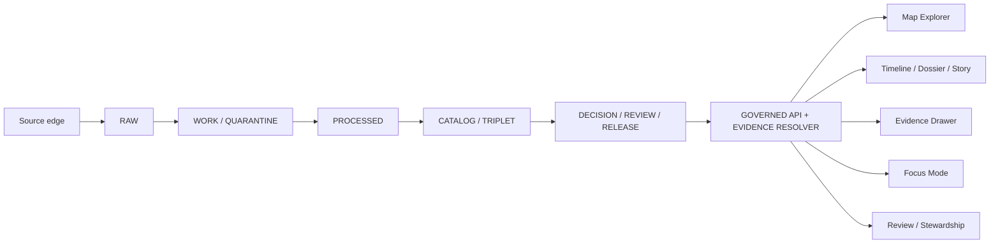

<!-- [KFM_META_BLOCK_V2]
doc_id: kfm://doc/TBD-VERIFY-root-readme-uuid
title: Kansas Frontier Matrix
type: standard
version: v1
status: review
owners: TBD-VERIFY-.github-CODEOWNERS
created: TBD-VERIFY-first-commit-date
updated: 2026-03-28
policy_label: TBD-VERIFY-public-or-restricted
related: [./docs/, ./contracts/, ./schemas/, ./policy/, ./data/, ./apps/, ./packages/, ./tests/, ./infra/, ./tools/, ./scripts/, TBD-VERIFY-./CONTRIBUTING.md, TBD-VERIFY-./SECURITY.md, TBD-VERIFY-./.github/CODEOWNERS]
tags: [kfm, root-doc, governance, evidence-first, map-first, trust-system]
notes: [Root README revision candidate grounded in the attached March 2026 KFM doctrine plus the attached 2026-03-22 repo-grounded sprint; live branch tree, owners, commit history, workflow YAML inventory, and adjacent root files still require direct verification.]
[/KFM_META_BLOCK_V2] -->

# Kansas Frontier Matrix

Governed, evidence-first, map-first, time-aware repository for Kansas spatial evidence, publication, and trust-visible product surfaces.

> **Status:** Experimental  
> **Owners:** TBD-VERIFY — `.github/CODEOWNERS` is referenced in attached repo-grounded material, but was not directly opened from a mounted checkout in this session  
>        
> **Quick jumps:** [Scope](#scope) · [Repo fit](#repo-fit) · [Accepted inputs](#accepted-inputs) · [Exclusions](#exclusions) · [Directory tree](#directory-tree) · [Quickstart](#quickstart) · [Usage](#usage) · [Diagram](#diagram) · [Operating tables](#operating-tables) · [Task list](#task-list-and-definition-of-done) · [FAQ](#faq) · [Appendix](#appendix)  
> **Repo fit:** `/README.md` *(root orientation surface; live branch verification still required)*

> [!IMPORTANT]
> This README is intentionally **verification-first**. It is grounded in the attached March 2026 KFM doctrine, architecture, UI, atlas, and planning corpus, plus an attached repo-grounded sprint that reports specific root and near-root documentation/control surfaces. The current session did **not** expose a mounted branch checkout, workflow YAML inventory, runtime manifests, or live test results. Treat branch-level and implementation-shaped statements here as bounded until the active repository is inspected directly.

| At a glance | Working rule |
|---|---|
| System identity | Governed Kansas spatial evidence system |
| Value unit | The inspectable claim, not merely the map, graph, dashboard, or fluent answer |
| Truth path | `Source edge → RAW → WORK / QUARANTINE → PROCESSED → CATALOG / TRIPLET → PUBLISHED` |
| Trust boundary | Governed APIs plus evidence resolution, not direct client access to stores |
| Runtime rule | Cite or abstain |
| Publication rule | Promotion changes trust state; deployment should apply already approved intent |
| Surface rule | One map-first, time-aware shell with trust-visible evidence and negative states |
| 3D rule | 2D default; 3D is conditional and burden-bearing |

## Scope

This README covers the **repo-root identity and operating posture** of Kansas Frontier Matrix.

Use it for:

- root-level mission, boundaries, and non-negotiable invariants
- verification-first navigation across doctrine, contracts, schemas, policy, data, testing, apps, packages, and operations
- a source-bounded map of the documented repo shape
- the minimum path from clone to trustworthy local inspection

Do not use it for:

- full contract text that belongs in `./contracts/` or `./schemas/`
- full policy rules that belong in `./policy/`
- domain-by-domain source depth that belongs in `./docs/` and the domain/source atlas
- implementation certainty that has not been re-verified on the active branch

### Evidence posture used in this README

| Label | Meaning in this README |
|---|---|
| **CONFIRMED** | Supported by the attached March 2026 KFM corpus, the attached repo-grounded sprint, or direct current-session evidence. |
| **INFERRED** | Strongly implied by repeated corpus patterns or documented repo inventories, but not directly branch-inspected in this session. |
| **PROPOSED** | A recommended realization or repo pattern that fits doctrine but is not proven as current implementation reality. |
| **NEEDS VERIFICATION** | A likely repo-local fact, path, or control point that should be checked on the active branch before being treated as current reality. |
| **UNKNOWN** | Not supported strongly enough in this session to state as a live repo or runtime fact. |

> [!NOTE]
> KFM’s strongest attached manuals are explicit about this boundary on purpose: doctrine can be stated confidently, but live repo topology, CI gates, route inventories, manifests, and runtime depth should remain visible as **UNKNOWN** until directly inspected.

[Back to top](#kansas-frontier-matrix)

## Repo fit

**Path:** `/README.md`  
**Role:** Root orientation document and verification-first operating index for Kansas Frontier Matrix.

The strongest root-shape evidence in hand comes from two layers:

1. **Doctrinal / architecture corpus** describing the intended governed monorepo shape.
2. **Attached repo-grounded sprint evidence** naming specific root and near-root surfaces that were inspected in that run.

Because this session did not mount the live checkout, this README keeps those layers separate instead of collapsing them into one unsupported active-branch claim.

| Direction | Documented path | Status | Why it matters |
|---|---|---|---|
| Root | [`./README.md`](./README.md) | **CONFIRMED** | Root identity and operating index surface. |
| Control plane | [`./.github/`](./.github/) | **CONFIRMED** | Review routing, templates, ownership, and workflow scaffolding live here. |
| Adjacent | [`./.github/CODEOWNERS`](./.github/CODEOWNERS) | **CONFIRMED / NEEDS VERIFICATION** | Existence is repo-grounded; exact owners still need direct branch inspection. |
| Adjacent | [`./.github/PULL_REQUEST_TEMPLATE.md`](./.github/PULL_REQUEST_TEMPLATE.md) | **CONFIRMED** | Trust checklist and PR evidence expectations are part of the documented repo posture. |
| Adjacent | [`./.github/workflows/`](./.github/workflows/) | **CONFIRMED / NEEDS VERIFICATION** | A workflows README is reported; active merge-blocking YAMLs still need direct verification. |
| Upstream | [`./docs/`](./docs/) | **INFERRED** | Architecture, governance, ADRs, runbooks, and domain depth. |
| Upstream | [`./contracts/`](./contracts/) | **CONFIRMED** | Contract documentation surface is repo-grounded and central to trust-bearing implementation. |
| Upstream | [`./schemas/`](./schemas/) | **CONFIRMED** | Separate schema documentation surface is repo-grounded; real schema inventory still needs verification. |
| Upstream | [`./policy/`](./policy/) | **CONFIRMED** | Deny-by-default policy doctrine and decision grammar are documented here. |
| Downstream | [`./data/`](./data/) | **INFERRED** | Lifecycle zones, registry entries, catalog artifacts, and receipts. |
| Downstream | [`./apps/`](./apps/) | **INFERRED** | Deployable runtime surfaces such as API, UI, and workers. |
| Downstream | [`./packages/`](./packages/) | **INFERRED** | Shared reusable law and libraries: ingest, evidence, catalog, policy, delivery. |
| Downstream | [`./tests/`](./tests/) | **CONFIRMED** | Tests README is repo-grounded; runnable harness depth still needs verification. |
| Downstream | [`./infra/`](./infra/) | **INFERRED** | Deployment, environment wiring, observability, and release mechanics. |
| Downstream | [`./tools/`](./tools/) | **CONFIRMED** | Validator/tooling intent is repo-grounded, though executable depth remains unverified. |
| Downstream | [`./scripts/`](./scripts/) | **CONFIRMED** | Supporting entrypoint/script intent is repo-grounded, though executable depth remains unverified. |
| Adjacent | `./CONTRIBUTING.md` | **NEEDS VERIFICATION** | Mentioned as a likely neighbor, but not directly verified in this session. |
| Adjacent | `./SECURITY.md` | **NEEDS VERIFICATION** | Likely relevant root policy surface, but not directly verified in this session. |

KFM is easiest to understand as a **truth path → catalog / evidence → governed API → trust-visible surface** system. The root README exists to keep that order visible before contributors descend into lane-, app-, or contract-specific detail.

[Back to top](#kansas-frontier-matrix)

## Accepted inputs

At repo root, this README should summarize the input families KFM is built to admit and govern, while pushing detailed schemas, source registers, and ingestion rules into their owning docs.

| Input family | What belongs in KFM | Expected governed lane | Where detailed treatment should live |
|---|---|---|---|
| Historical tabular data | census extracts, registries, land records, archival tables | `RAW/` → `WORK/` → `PROCESSED/` | `./data/`, `./contracts/`, `./schemas/`, `./docs/` |
| Vector geodata | boundaries, parcels, routes, service areas, sites | `RAW/` → `PROCESSED/` | `./data/`, `./contracts/`, `./schemas/`, `./docs/` |
| Raster geodata | land cover, DEMs, climate grids, scenes, hazard rasters | `RAW/` → `PROCESSED/` → `CATALOG/` | `./data/`, `./contracts/`, `./schemas/`, `./docs/` |
| Documentary evidence | archives, newspapers, oral histories, scans, narrative support material | source intake → evidence flow | `./docs/`, `./data/`, evidence-related packages |
| Metadata and lineage | STAC, DCAT, PROV, manifests, receipts, run records | `CATALOG/` and proof surfaces | `./contracts/`, `./schemas/`, `./data/`, `./docs/` |
| Derived analytical artifacts | summaries, projections, tiles, exports, scenes, indexes | derived lanes only, always release-linked | `./packages/`, `./apps/`, `./infra/` |
| Validation and review artifacts | QA reports, fixtures, review notes, correction notices | `WORK/`, `tests/`, docs/runbooks | `./tests/`, `./docs/`, `./data/receipts/` |
| Policy-safe civic and environmental context | hydrology, hazards, land use, infrastructure context | governed domain lanes | `./docs/`, `./data/`, `./policy/` |

## Exclusions

These do **not** belong in the governed publication path, and this root README should not present them as acceptable shortcuts.

| Exclusion | Why it stays out | Where it goes instead |
|---|---|---|
| Secrets, tokens, credentials | Never commit secrets into the repo or artifact path. | Secret manager / environment provisioning |
| Direct client-to-store or client-to-model paths | Breaks the trust membrane. | Governed APIs and protected adapters |
| Publishable artifacts without receipts, digests, or catalog closure | Cannot be audited, reproduced, or corrected safely. | `WORK/QUARANTINE` until complete |
| Rights-unclear or sensitivity-unresolved material | Ambiguity must fail closed. | Quarantine, metadata-only handling, redaction, generalized public-safe derivatives, or delayed publication |
| Uncited Story or Focus claims | Violates cite-or-abstain. | Draft or internal review states only |
| Fine-grained restricted location exposure | Risks policy leakage and unsafe precision. | Restricted lanes or generalized public-safe outputs |
| Docs that imply live behavior without proof | Weakens trust through overclaiming. | Keep the statement `INFERRED`, `PROPOSED`, `UNKNOWN`, or `NEEDS VERIFICATION` |
| Detached reviewer/admin tools that sever geography, time, or evidence context | Breaks the governed shell model. | Review and stewardship as shell variation, not a separate truth system |

[Back to top](#kansas-frontier-matrix)

## Directory tree

### Documented root shape *(repo-grounded summary + doctrine; active branch NEEDS VERIFICATION)*

```text
<repo-root>/
├── README.md
├── .github/
├── docs/
├── contracts/
├── schemas/
├── policy/
├── data/
├── apps/
├── packages/
├── tests/
├── infra/
├── tools/
├── scripts/
└── ... additional root files and directories require direct branch verification
```

### Top-level role map

| Path target | Status | Expected repo role |
|---|---|---|
| `./README.md` | **CONFIRMED** | Root identity, navigation, and doctrine summary surface |
| `./.github/` | **CONFIRMED / NEEDS VERIFICATION** | Workflow scaffolding, templates, ownership, and merge discipline |
| `./docs/` | **INFERRED** | Architecture, governance, domain, ADR, diagram, and runbook documentation |
| `./contracts/` | **CONFIRMED** | Contract documentation surface and shared object families |
| `./schemas/` | **CONFIRMED / NEEDS VERIFICATION** | Schema documentation surface; real file inventory still needs direct inspection |
| `./policy/` | **CONFIRMED** | Policy bundles, fixtures, deny-by-default rules, and decision grammar |
| `./data/` | **INFERRED** | Registry entries, lifecycle zones, catalog artifacts, and receipts |
| `./apps/` | **INFERRED** | Deployable user- and operator-facing runtime surfaces |
| `./packages/` | **INFERRED** | Shared reusable law and supporting libraries |
| `./tests/` | **CONFIRMED / NEEDS VERIFICATION** | Test intent surface; runnable suites still need direct verification |
| `./infra/` | **INFERRED** | Environment wiring, deployment, dashboards, and release mechanics |
| `./tools/` | **CONFIRMED / NEEDS VERIFICATION** | Validators and helper tooling, though executable depth remains unverified |
| `./scripts/` | **CONFIRMED / NEEDS VERIFICATION** | Supporting script/entrypoint surface, though executable depth remains unverified |

### What remains `UNKNOWN` or `NEEDS VERIFICATION`

- exact active-branch root file set
- exact `.github` inventory, including current required workflows and review routing
- exact owner map inside `.github/CODEOWNERS`
- real JSON Schema inventory versus README references only
- actual mounted Rego/policy bundle inventory
- runnable test entrypoints, harnesses, and merge-blocking checks
- exact route tree, DTO inventory, and runtime negative-path coverage
- actual deployment overlays, observability stack, and emitted proof objects

[Back to top](#kansas-frontier-matrix)

## Quickstart

The safest root-level quickstart is **verification-first**, not assumption-first.

```bash
# identify the exact revision you are reviewing
git rev-parse HEAD 2>/dev/null || echo "Not inside a Git checkout"

# inspect the root and near-root directory shape
find . -maxdepth 2 -type d 2>/dev/null | sort | sed -n '1,180p'

# inspect likely control-plane and documentation surfaces
find .github contracts schemas policy tests tools scripts docs apps packages data infra \
  -maxdepth 3 -type f 2>/dev/null | sort | sed -n '1,320p'

# inspect GitHub control-plane files if present
ls -la .github 2>/dev/null || true
ls -la .github/workflows 2>/dev/null || true

# pressure-test trust, contract, and evidence vocabulary
grep -RIn "EvidenceBundle\|EvidenceRef\|RuntimeResponseEnvelope\|DecisionEnvelope\|CorrectionNotice\|truth membrane\|cite-or-abstain" \
  docs contracts schemas policy tests tools scripts 2>/dev/null | sed -n '1,220p'

# pressure-test shell and trust-visible surface vocabulary
grep -RIn "Map Explorer\|Evidence Drawer\|Focus Mode\|Story\|Dossier\|Review\|Stewardship" \
  docs apps packages ui 2>/dev/null | sed -n '1,220p'
```

> [!TIP]
> Run the inspection loop above before upgrading any statement from `INFERRED`, `PROPOSED`, `UNKNOWN`, or `NEEDS VERIFICATION` to `CONFIRMED`.

<details>
<summary>Illustrative local-first contributor flow (use only where analogous targets actually exist)</summary>

```bash
make bootstrap
make validate-schemas
make test
make dev-up
make sample-ingest SOURCE=example_fixture
make catalog-validate
```

</details>

### Before documenting branch behavior as fact

1. Confirm what exists on this branch now.
2. Confirm which checks actually block merges.
3. Confirm which contracts, schemas, policies, and validations are enforced today.
4. Confirm that at least one end-to-end governed slice exists from source admission to evidence-backed public read.
5. Confirm whether public surfaces expose evidence, freshness, and policy-visible negative states rather than hiding them.
6. Confirm whether rollback, correction, and supersession are visible and evidenced rather than implied.
7. Confirm whether `.github/CODEOWNERS`, root-doc neighbors, and README links match the active branch.

[Back to top](#kansas-frontier-matrix)

## Usage

### What KFM is

KFM is:

- a governed spatial evidence system
- a provenance-preserving publication program
- a map-first, time-aware shell over place, chronology, evidence, review state, and policy state
- a coordinated family of product surfaces that remain behind one trust membrane
- a Kansas-first operating environment for history, land, hydrology, hazards, environment, services, and public knowledge
- a platform that can grow into bounded retrieval and AI assistance **without** weakening the evidence contract

### What KFM is not

KFM is **not**:

- a free-form chatbot
- a dashboard-only GIS stack
- a direct browser-to-database mapping surface
- a graph-first or vector-first authority engine
- a publication path that can skip rights, provenance, review, or release evidence
- a spectacle-first 3D product
- a detached admin console that severs review from geography, time, and evidence

### Non-negotiable invariants

| Invariant | Status | Practical meaning | What must never happen |
|---|---|---|---|
| Truth path | **CONFIRMED doctrine** | Data moves through `Source edge → RAW → WORK / QUARANTINE → PROCESSED → CATALOG / TRIPLET → PUBLISHED`. | Ad hoc publication from notebooks, transient transforms, or unpublished working states |
| Trust membrane | **CONFIRMED doctrine** | Public and role-limited access crosses governed APIs, policy, and evidence resolution. | Direct UI or external access to canonical stores, raw buckets, or model runtimes |
| Cite-or-abstain | **CONFIRMED doctrine** | Story, map, dossier, export, and Focus claims resolve to evidence or abstain. | Plausible uncited output presented as fact |
| Fail-closed posture | **CONFIRMED doctrine** | Unclear rights, unresolved sensitivity, or broken evidence blocks release. | “Best effort” publication under ambiguity |
| Deterministic identity | **CONFIRMED / INFERRED doctrine** | Comparable inputs and the same spec produce stable identities and digests. | Unstable versions or ambiguous lineage |
| Evidence as interface | **CONFIRMED doctrine** | Evidence must be operationally reachable through resolvable support objects. | Provenance trapped in notes that surfaces cannot reach |
| Promotion as governed state change | **CONFIRMED doctrine** | Promotion emits typed artifacts, decision records, release scope, and correction posture. | Deployment or file movement treated as publication proof |
| Documentation as production surface | **CONFIRMED doctrine** | Behavior-significant changes update docs, contracts, examples, diagrams, and runbooks together. | Silent drift between behavior and procedure |
| 2D default, 3D conditional | **CONFIRMED doctrine** | 2D remains the default operating surface; 3D carries extra governance burden. | Spectacle-first 3D becoming a parallel truth surface |

### Product surfaces and operating promise

| Surface | Status | What it should answer |
|---|---|---|
| Map Explorer | **CONFIRMED doctrine** | **Where?** |
| Timeline | **CONFIRMED doctrine** | **When?** |
| Dossier | **CONFIRMED doctrine / PROPOSED packaging** | **What matters about this place, feature, or subject?** |
| Story | **CONFIRMED doctrine** | **Why does the evidence matter?** |
| Evidence Drawer | **CONFIRMED doctrine** | **What does a visible claim rest on?** |
| Focus Mode | **CONFIRMED doctrine** | Natural-language investigation **without bypassing evidence or policy** |
| Review / Stewardship | **CONFIRMED doctrine / PROPOSED packaging** | Inspect, approve, restrict, correct, supersede, or withdraw within the same governed shell |
| Compare / Export | **CONFIRMED doctrine / PROPOSED packaging** | Compare release contexts and preview what leaves the system without dropping trust cues |

### Kansas operating lanes at a glance

| Lane | Typical grain | Why it matters early |
|---|---|---|
| Historical and demographic | county-version, county-year, event-time | Establishes time-aware joins and stable place/time scaffolding |
| Hydrology and water | station-time, watershed, raster | Strong public-safe thin-slice candidate |
| Hazards and environment | event-time, county, polygon, raster | High public value with visible governance needs |
| Land and cadastral history | parcel, tract, legal description, PLSS section | Supports land-tenure, settlement, and archival interpretation |
| Archives and heritage | document, place, event-time | Critical for story publication and evidence depth |
| Services and infrastructure context | place, corridor, service area | Useful early, but precision and rights posture must stay explicit |

### Preferred first governed slice

A strong first slice is **hydrology-first**:

1. one released hydrology dataset family with stable source descriptors
2. one map + timeline surface that opens directly into an Evidence Drawer
3. one public-safe dossier or detail path
4. one Focus path that either cites correctly or abstains
5. one visible correction or supersession drill

[Back to top](#kansas-frontier-matrix)

## Diagram


```mermaid
flowchart LR
    A[Source edge] --> B[RAW]
    B --> C[WORK / QUARANTINE]
    C --> D[PROCESSED]
    D --> E[CATALOG / TRIPLET]
    E --> F[DECISION / REVIEW / RELEASE]
    F --> G[GOVERNED API + EVIDENCE RESOLVER]
    G --> H[Map Explorer]
    G --> I[Timeline / Dossier / Story]
    G --> J[Evidence Drawer]
    G --> K[Focus Mode]
    G --> L[Review / Stewardship]
```

This is the root promise of the repo: every public or role-limited surface remains downstream of acquisition, policy checks, provenance capture, review state, release state, and evidence resolution.

[Back to top](#kansas-frontier-matrix)

## Operating tables

### Truth path and promotion contract

Promotion is not a file copy. It is a governed state transition.

| Gate | Minimum proof | Fail-closed behavior |
|---|---|---|
| Identity and versioning | stable IDs, deterministic digests, immutable version references | Block on missing, duplicated, or unstable identity |
| Rights and license | rights snapshot, attribution basis, reuse posture | Hold or quarantine when rights are unclear |
| Sensitivity and generalization | policy label, obligations, generalization or redaction plan | Restrict, generalize, or block publication |
| Schema and QA | schema validity, spatial/time/unit checks, domain QC | Route to `WORK/QUARANTINE` on blocking failure |
| Catalog closure | linked catalog, lineage, and release linkage | Block if metadata and lineage do not resolve coherently |
| Receipt and review | run receipt, decision/review evidence, release inventory | Block if required review or proof objects are absent |
| Release and correction readiness | release manifest / proof pack, rollback and correction hooks | Block promotion until public-safe scope is inspectable and reversible |

### Release taxonomy

| Term | Meaning in KFM |
|---|---|
| Continuous integration | Proves a candidate change is buildable, testable, schema-valid, provenance-aware, and policy-checkable before trust widens |
| Continuous delivery | Assembles a releasable, immutable unit whose integrity, inventory, and provenance are explicit |
| Deployment | Applies already-approved desired state to a runtime surface |
| Promotion | Governs the transition from one trust state to another |
| Rollback / correction | Reverses or supersedes a prior decision **without erasing evidence** |

### Canonical vs rebuildable rule

| Class | Examples |
|---|---|
| **Canonical / authoritative** | `RAW`, `PROCESSED`, catalog-closure objects, review/decision artifacts, release manifests, correction notices |
| **Rebuildable / derived** | tiles, search indexes, graphs, caches, summaries, scenes, denormalized projections, embeddings |

### Documented first implementation wave *(plan documented, branch completion UNKNOWN)*

| Work package | Documented intent | What it proves |
|---|---|---|
| WP-01 | Spec hashing + controlled vocab validation | Stable identity and drift blocking |
| WP-02 | Catalog validators + link checker | Catalog closure and broken-link gating |
| WP-03 | Policy pack + fixture tests | Default-deny policy enforcement |
| WP-04 | Evidence resolver service | `EvidenceRef → EvidenceBundle` resolution |
| WP-05 | Dataset registry + discovery endpoints | Policy-filtered dataset discovery |
| WP-06 | Map Explorer baseline UI | Evidence Drawer, license/version visibility, keyboard navigation |
| WP-07 | Story publication workflow | Review state + resolvable citation gates |
| WP-08 | Focus Mode MVP + evaluation harness | Cite-or-abstain synthesis with regression control |

[Back to top](#kansas-frontier-matrix)

## Task list and definition of done

Use this as the minimum repo-root gate list for substantial work.

- [ ] active-branch evidence baseline exists: repo tree, manifests, schema inventory, workflow inventory, and sample proof objects
- [ ] `.github/CODEOWNERS`, `.github/PULL_REQUEST_TEMPLATE.md`, `.github/workflows/README.md`, `contracts/README.md`, `schemas/README.md`, `policy/README.md`, `tests/README.md`, `tools/README.md`, and `scripts/README.md` are rechecked against the active branch
- [ ] first-wave contract files exist as real machine-checkable schemas, not only README references
- [ ] valid and invalid fixtures validate in CI
- [ ] deny-by-default policy bundles and policy tests exist for integrity, provenance, rights/sensitivity, and runtime negative states
- [ ] at least one merge-blocking workflow YAML enforces contract, policy, and fixture validation
- [ ] release candidates emit validation, catalog-closure, manifest, and proof-pack artifacts
- [ ] `EvidenceBundle` drill-through works from consequential visible claims
- [ ] `RuntimeResponseEnvelope`-style negative-state grammar is visible and testable
- [ ] Map Explorer, Timeline, Dossier, Story, Focus, and Review surfaces expose trust-visible state where relevant
- [ ] Evidence Drawer drill-through works from the same governed shell
- [ ] Focus either cites with audit linkage or abstains cleanly
- [ ] derived freshness, correction, supersession, withdrawal, and stale-visible states remain explicit
- [ ] behavior-significant changes update docs, contracts, examples, diagrams, and runbooks in the same governed stream
- [ ] one hydrology-first slice proves descriptor → ingest → validation → dataset version → catalog closure → decision/review → release → map/read surface → correction
- [ ] one rollback or correction drill is rehearsed and leaves evidence-bearing output behind

## FAQ

### Why is KFM stricter than a normal map portal?

Because KFM is designed as a **trust system**, not just a presentation layer. Provenance, policy, review, and evidence resolution are runtime obligations, not decoration.

### Why does this README keep saying `UNKNOWN` or `NEEDS VERIFICATION`?

Because repo size and documentation density do not prove runtime governance. Branch-local facts should be verified from the active repo and live artifacts, not inferred from persuasive prose.

### Why are Evidence Bundles, catalogs, and receipts treated as first-class?

Because discoverability, reproducibility, review, and public trust depend on resolvable metadata and lineage, not just attractive maps or fluent answers.

### Why keep observed, documentary, derived, modeled, and AI-synthesized outputs distinct?

Because KFM must preserve the difference between what was observed, what was recorded, what was derived, what was modeled, and what was synthesized for explanation.

### Why start with a narrow slice?

Because one fully governed slice proves the architecture honestly. Many half-governed features only prove that governance was bypassed.

### Why is hydrology the preferred first slice?

Because the attached doctrine repeatedly treats hydrology as the cleanest **public-safe, place/time-rich, operationally legible** thin slice for proving the system end to end.

### Why is 2D the default operating surface?

Because 2D keeps geography, chronology, evidence, and state easier to govern. 3D is allowed only when it adds real explanatory value and still returns users to the same evidence flow.

### Why are some repo paths still marked `TBD-VERIFY` or `NEEDS VERIFICATION`?

Because the current session exposed doctrine and a repo-grounded sprint summary, not a mounted branch checkout. Root-doc adjacency and implementation claims should be verified against the active repository, not inferred from polished prose alone.

[Back to top](#kansas-frontier-matrix)

## Appendix

<details>
<summary>Open the root-doc verification appendix</summary>

### Working basis for this README candidate

This README is aligned to the attached March 2026 KFM authority layer, with the strongest weighting given to the replacement-grade KFM manuals, the canonical master reference, the unified geospatial architecture manual, the MapLibre shell/UI doctrine, the domains/source atlas, the components/pass dossiers, and the attached repo-grounded sprint.

### Why placeholders remain in the meta block

The following values still require direct repo or history verification before publication:

- `doc_id`
- owners / `.github/CODEOWNERS`
- created date
- policy label
- exact adjacent root-doc links such as `CONTRIBUTING.md` and `SECURITY.md`

### First verification targets after repo mount

- root repo tree and package/workspace inventory
- `.github` inventory, especially `CODEOWNERS`, `PULL_REQUEST_TEMPLATE.md`, and merge-blocking workflows
- schema directories, fixtures, and registry versions
- actual policy bundle inventory and policy test harnesses
- route inventory, DTO inventory, and runtime negative-path coverage
- `EvidenceBundle` resolver contracts and traces
- correction / rollback evidence and surface behavior

### Root README maintenance rule

Keep this file focused on:

- repo identity
- top-level navigation and boundaries
- non-negotiable invariants
- documented repo shape plus verification boundary
- the minimum governed quickstart
- root-level gates that help reviewers reject overclaiming early

Push deep schema catalogs, route trees, lane-by-lane source atlases, and environment-specific runbooks into their owning docs once those files are verified directly on the active branch.

[Back to top](#kansas-frontier-matrix)

</details>
