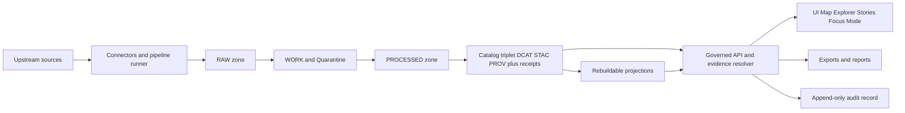
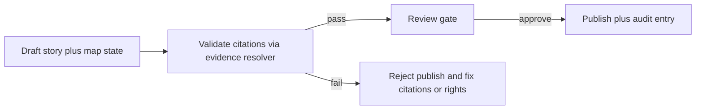
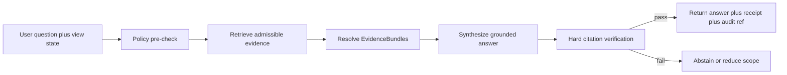

<!-- [KFM_META_BLOCK_V2]
doc_id: kfm://doc/3b5a5d0c-7d8a-4b3f-b9a0-8d2c6d3e8f1a
title: Kansas Frontier Matrix — README
type: standard
version: v1
status: draft
owners: TBD
created: 2026-03-03
updated: 2026-03-05
policy_label: public
related:
  - kfm://doc/TBD-kfm-prime
  - kfm://doc/TBD-kfm-exec-summary
tags: [kfm]
notes:
  - Root README for the vNext operating model. Treat implementation details as UNKNOWN until verified on your branch.
  - This README is a derived summary of vNext design materials; do not treat it as proof that a given module/service exists in your checkout.
[/KFM_META_BLOCK_V2] -->

<a id="top"></a>

# Kansas Frontier Matrix

> **Map-first • Time-aware • Governed • Evidence-first • Cite-or-abstain**  
> **Posture:** **default-deny** • **fail-closed** • reproducible by digest • policy enforced in CI and runtime

---

## Impact

**Status:** draft (vNext spec summary)  
**Owners:** TBD (required before hard governance enforcement)  
**Policy label:** public  
**Repo path:** `README.md` (repo root)

**CONFIRMED (design docs):** KFM is a governed, evidence-first geospatial platform. The user-facing contract is: **every map layer, story claim, and Focus answer must open into a policy-allowed evidence view — or the system abstains.**

**CONFIRMED (design docs):** Two non-negotiable invariants anchor everything:
- **Truth path:** storage zones + promotion gates from upstream intake through publication.
- **Trust membrane:** clients never talk to storage directly; all access flows through governed APIs that enforce policy, redaction, and logging.

[](#roadmap)
[](#governance)
[](#evidence-and-citations)
[](#core-invariants)
[](#truth-path-and-promotion-contract)
[](#documentation-is-production)
[](#license)

**Quick links:** [Reality check](#reality-check) · [System overview](#system-overview) · [Truth path](#truth-path-and-promotion-contract) · [Evidence](#evidence-and-citations) · [Governed API](#governed-api) · [Roadmap](#roadmap)

[↑ Back to top](#top)

---

## Scope

**CONFIRMED (design docs):** This README is a **governance-first orientation**: invariants, contracts, and promotion gates. It is meant to prevent “accidental hallucination” and to help reviewers/operators enforce the trust posture.

**UNKNOWN:** current implementation maturity, directory layout, and which work packages are already shipped on your branch.
- Smallest verification steps: see [Reality check](#reality-check).

[↑ Back to top](#top)

---

## Where it fits

**CONFIRMED (design docs):**
- This file is the **repo root README** that anchors the vNext operating model.
- It connects the full flow: **data → pipelines → catalogs/provenance → projections → governed APIs → Map/Story UI → Focus Mode**.

**UNKNOWN:** exact in-repo locations for the authoritative vNext specs (paths may differ by branch).
- Smallest verification step: search `docs/` (or equivalent) for “Definitive Design & Governance Guide (vNext)” and “Ultimate Blueprint”.

[↑ Back to top](#top)

---

## Acceptable inputs

**PROPOSED (safe defaults):** Things that belong in this repo include:
- **Contracts:** OpenAPI, JSON Schemas, controlled vocabularies.
- **Policy-as-code:** OPA/Rego bundles + tests + fixtures.
- **Pipelines/tooling:** validators, link-checkers, registry/catalog generators, reproducible runners.
- **Docs as production surfaces:** runbooks, ADRs, governance specs, templates.
- **Data specs/registries:** dataset specs, source registry entries, promotion manifests, receipts.

[↑ Back to top](#top)

---

## Exclusions

**CONFIRMED (design docs):** The following are disallowed or must be fail-closed:
- **No direct client access** to databases or object storage (trust membrane).
- **No publishing with unclear rights** (promotion/publish gates block).
- **No “best-effort citations”** for Story publishing or Focus Mode (hard citation verification gates).

**PROPOSED (baseline security hygiene):**
- No secrets/tokens committed to the repo.
- No raw sensitive location coordinates in public artifacts; only policy-allowed derivatives.

[↑ Back to top](#top)

---

## Reality check

This repo is governance-critical. This README is written to **fail closed** when reality is unknown.

### Status legend for claims

- **CONFIRMED:** documented in authoritative vNext design/governance materials **or** verified by in-repo artifacts on your branch.
- **PROPOSED:** safe defaults / target designs; discussable; not safe to enforce without ratification.
- **UNKNOWN:** not verified; includes smallest steps to confirm.

> [!IMPORTANT]
> **Anti-hallucination rule:** Do not claim a module/path/service exists or is implemented unless verified on your branch.

### Minimum verification steps

**UNKNOWN:** current repo tree, CI gates, and implementation maturity.

Run:

```bash
# Capture a branch snapshot (attach to PRs/issues when discussing “current state”)
git rev-parse HEAD

# If `tree` is not installed, replace with: find . -maxdepth 3 -type d -print
tree -L 3

# Identify merge-blocking checks
ls -la .github/workflows 2>/dev/null || true

# Search for governance-critical primitives
# If ripgrep isn't installed, use grep -R.
grep -RIn --line-number "spec_hash\|EvidenceRef\|EvidenceBundle\|policy_label\|opa\|rego" . || true
```

**PROPOSED:** Pick **one MVP dataset** and run a vertical slice through all gates (RAW → WORK/Quarantine → PROCESSED → Triplet → PUBLISHED) before scaling.

[↑ Back to top](#top)

---

## System overview

**CONFIRMED (design docs):** KFM connects **data → pipelines → catalogs/provenance → projections → governed APIs → Map/Story UI → Focus Mode**.

### High-level flow


```mermaid
flowchart LR
  A[Upstream sources] --> B[Connectors and pipeline runner]
  B --> C[RAW zone]
  C --> D[WORK and Quarantine]
  D --> E[PROCESSED zone]
  E --> F[Catalog triplet DCAT STAC PROV plus receipts]
  F --> G[Rebuildable projections]
  F --> H[Governed API and evidence resolver]
  G --> H
  H --> I[UI Map Explorer Stories Focus Mode]
  H --> J[Exports and reports]
  H --> K[Append-only audit record]
```

### Trust membrane

**CONFIRMED (design docs):**
- Frontend/external clients **never access databases or object storage directly**.
- Core backend logic **never bypasses repository interfaces** to talk directly to storage.
- All access flows through governed APIs that apply policy decisions, redactions, and logging consistently.

[↑ Back to top](#top)

---

## Golden paths

These are the end-to-end workflows the system must make boring and reliable.

### Golden path 1: Promote a dataset version


```mermaid
flowchart TB
  S[Source registry plus terms snapshot] --> P[Pipeline run]
  P --> R[Run receipt plus checksums]
  R --> Q[QA plus validation]
  Q -->|pass| C[Catalog triplet DCAT STAC PROV]
  Q -->|fail| X[Quarantine with reason plus remediation]
  C --> G[Promotion manifest plus approvals]
  G --> U[Governed API exposure]
  U --> M[Map layer plus evidence drawer]
```

**CONFIRMED (design docs):** Promotion to PUBLISHED is blocked unless minimum gates are met (identity/versioning, licensing/rights metadata, sensitivity classification + obligations, triplet validation, QA thresholds, run receipt + audit record, release manifest).

### Golden path 2: Publish a Story Node


```mermaid
flowchart LR
  D[Draft story plus map state] --> V[Validate citations via evidence resolver]
  V -->|pass| R[Review gate]
  R -->|approve| P[Publish plus audit entry]
  V -->|fail| A[Reject publish and fix citations or rights]
```

**CONFIRMED (design docs):** Story publishing is governed and requires review state plus resolvable citations. Publishing must fail closed if rights are unclear for included media.

### Golden path 3: Answer in Focus Mode


```mermaid
flowchart LR
  Q[User question plus view state] --> P[Policy pre-check]
  P --> R[Retrieve admissible evidence]
  R --> B[Resolve EvidenceBundles]
  B --> S[Synthesize grounded answer]
  S --> V[Hard citation verification]
  V -->|pass| O[Return answer plus receipt plus audit ref]
  V -->|fail| A[Abstain or reduce scope]
```

**CONFIRMED (design docs):** If citations cannot be verified, Focus Mode must abstain or reduce scope.

[↑ Back to top](#top)

---

## Core invariants

Violating these breaks governance, not “just code.”

**CONFIRMED (design docs):** Invariants are intended to be **test-enforced** and **fail-closed**.

| Invariant | Meaning | Enforcement target |
|---|---|---|
| **Truth path** | Upstream → RAW → WORK/Quarantine → PROCESSED → Triplet → PUBLISHED | CI + promotion gates |
| **Promotion contract** | Cannot publish without identity, licensing, sensitivity, triplet validation, QA thresholds, receipts, manifest | CI must fail closed |
| **Trust membrane** | No direct client-to-DB/storage; all access via governed APIs + evidence resolution | Network + code rules + tests |
| **Triplet as contract** | DCAT/STAC/PROV are contract surfaces; EvidenceRefs resolve deterministically | Validators + link-check in CI |
| **Cite-or-abstain** | If EvidenceRefs don’t resolve for user role, system abstains | Story publish + Focus hard gate |

[↑ Back to top](#top)

---

## Truth path and promotion contract

### Lifecycle zones

**CONFIRMED (design docs):** Zones are **storage zones plus validation gates**, not a metaphor.

| Zone | Definition | Typical contents |
|---|---|---|
| **RAW** | Immutable acquisition; append-only | Upstream payload snapshots + checksums + terms snapshot + fetch logs |
| **WORK / Quarantine** | Intermediate transforms and QA; failures isolated; artifacts may be rewritten | Normalization outputs, tiling jobs, QA reports, redaction/generalization transforms |
| **PROCESSED** | Publishable artifacts with stable IDs + checksums | GeoParquet/COG/PMTiles, standardized schemas, final QA results |
| **Triplet** | Cross-linked DCAT + STAC + PROV describing metadata, assets, lineage | Catalog JSON, PROV bundles, link maps |
| **PUBLISHED** | Governed runtime surfaces served via PEP/API and UI | API responses, tiles endpoints, story pages, Focus answers with receipts |

### Promotion Contract v1

**CONFIRMED (design docs):** Promotion is blocked unless gates are met, framed to be automatable in CI and reviewable during steward sign-off.

**PROPOSED:** Keep the gate table in `docs/governance/promotion_contract.md` (or equivalent) and enforce via CI + policy fixtures.

[↑ Back to top](#top)

---

## Deterministic identity and versioning

**CONFIRMED (design docs):** Reproducibility depends on stable dataset identity and stable version identity. Deterministic hashing (`spec_hash`) based on canonical JSON is a recommended pattern to prevent hash drift.

**PROPOSED:** Reference implementation for `spec_hash`
- `spec_hash = sha256( RFC8785_JCS(spec_json) )`

**UNKNOWN:** Exact on-disk path for dataset specs and registry entries in this repo.
- Smallest verification step: search for `spec_hash` usage and spec schema(s) in `contracts/` and tooling in `tools/`.

[↑ Back to top](#top)

---

## Catalog triplet and profiles

**CONFIRMED (design docs):** Catalogs and provenance are contract surfaces, not “nice metadata.” KFM uses a cross-linked triplet:
- **DCAT:** dataset metadata
- **STAC:** asset metadata
- **PROV:** lineage

**CONFIRMED (design docs):** KFM should define profiles so validation is strict and predictable; CI should run validators and link-checking, and broken links block merges/promotions.

[↑ Back to top](#top)

---

## Evidence and citations

### EvidenceRef schemes

**CONFIRMED (design docs):** KFM “citations” are EvidenceRefs that resolve via an evidence resolver into EvidenceBundles (metadata + artifacts + provenance + policy), not raw URLs pasted into text.

**CONFIRMED (design docs):** Minimum scheme families include:
- `dcat://...` dataset/distribution metadata
- `stac://...` collection/item/asset metadata
- `prov://...` run lineage (activities/entities/agents)
- `doc://...` governed documents and story citations
- `graph://...` entity relations (if enabled)
- `url://...` discouraged (only with explicit policy/constraints)

Example patterns (illustrative):

```text
dcat://dataset/<slug>@<dataset_version_id>
stac://collection/<slug>@<dataset_version_id>#asset=<asset_key>
prov://run/<run_id>
doc://story/<story_id>@<story_version_id>#span=<anchor-or-page>

kfm://audit/entry/<entry_id>            # ID space example
kfm://policy_decision/<decision_id>     # ID space example
```

### Evidence resolver contract

**CONFIRMED (design docs):**
- Evidence resolution applies policy and returns allow/deny + obligations.
- Evidence resolution returns an EvidenceBundle with human view + machine metadata + digests + audit references.
- The resolver must be usable in **two or fewer calls** from the UI.

[↑ Back to top](#top)

---

## Governed API

**CONFIRMED (design docs):** Governed API surfaces are the only supported access path for clients; policy and evidence resolution are enforced here.

### Design target endpoint surface

> [!NOTE]
> **PROPOSED design targets:** The following endpoints are documented as a **minimal target surface** in vNext materials. Treat them as **UNKNOWN until verified** in your branch’s OpenAPI and code.

- `POST /api/v1/evidence/resolve` — resolve EvidenceRefs into EvidenceBundles (fail closed if unresolvable/unauthorized)
- `GET /api/v1/datasets` — discover datasets/versions (policy-filtered; includes `dataset_version_id`)
- `GET /api/v1/stac/collections` and `/items` — browse/query STAC (includes checksums/digests)
- `GET/POST /api/v1/story` — read/publish Story Nodes (publish requires resolvable citations + review state)
- `POST /api/v1/focus/ask` — Focus Mode governed run (receipt + hard citation verification; abstains if unsupported)

### Policy-safe error model

**CONFIRMED (design docs):** Error responses must include an audit reference and avoid leaking restricted metadata via distinguishable errors.

Minimum JSON shape (illustrative):

```json
{
  "error_code": "KFM_FORBIDDEN",
  "message": "Policy-safe message.",
  "audit_ref": "kfm://audit/entry/..."
}
```

[↑ Back to top](#top)

---

## Focus Mode

**CONFIRMED (design docs):** Focus Mode is not a general chatbot. It is a governed workflow:
policy pre-check → admissible retrieval → EvidenceBundle resolution → synthesis → hard citation verification → receipt/audit.

**CONFIRMED (design docs):** If citations cannot be verified, Focus Mode must abstain or reduce scope.

### Minimum evaluation harness

**CONFIRMED (design docs):** A merge-blocking evaluation harness with golden queries is required for Focus Mode changes.

**PROPOSED:** Minimum harness metrics
- citation resolvability: 100% for allowed users
- refusal correctness: restricted scopes produce policy-safe refusal/abstention
- leakage checks: no restricted coordinates/metadata in outputs
- regression: golden queries pinned to DatasetVersions

[↑ Back to top](#top)

---

## Governance

**CONFIRMED (design docs):** Governance is enforceable behavior: promotion gates, policy labels, obligations, access control, and audit logging.

**CONFIRMED (design docs):** Policy tests must run in CI and block merges.

### Starter vocabularies

**CONFIRMED (design docs):** Controlled vocabularies must be versioned and maintained.

**CONFIRMED (design docs):** `policy_label` starter values
- public
- public_generalized
- restricted
- restricted_sensitive_location
- internal
- embargoed
- quarantine

**CONFIRMED (design docs):** `artifact.zone` starter values
- raw
- work
- processed
- catalog
- published

### Governance review triggers

**CONFIRMED (design docs):** Risk and review triggers include:
- policy bypass via direct DB/storage access
- licensing violations and unclear rights
- sensitive-location leakage (restricted precise + public generalized derivatives; redaction tests; default-deny)
- non-resolvable citations (evidence resolver contract; story publish gate)
- Focus Mode hallucination or restricted leakage (hard citation verifier; evaluation harness; policy pre-checks)

[↑ Back to top](#top)

---

## Repository layout

> [!IMPORTANT]
> **UNKNOWN until verified:** the exact repo structure on your branch.  
> Do not treat this section as proof that a specific module exists.

**PROPOSED (design target):** A typical top-level structure to support the vNext operating model:

```text
Kansas-Frontier-Matrix/
├─ README.md
├─ LICENSE
├─ CONTRIBUTING.md
├─ SECURITY.md
├─ CODE_OF_CONDUCT.md
├─ CHANGELOG.md
├─ Makefile
├─ compose.yaml
│
├─ .github/
│  ├─ CODEOWNERS
│  └─ workflows/
│
├─ docs/
│  ├─ governance/
│  ├─ runbooks/
│  ├─ standards/
│  └─ adr/
│
├─ contracts/
│  ├─ openapi/
│  ├─ schemas/
│  └─ vocab/
│
├─ policy/
│  ├─ rego/
│  ├─ tests/
│  └─ fixtures/
│
├─ data/
│  ├─ specs/
│  ├─ registry/
│  ├─ raw/
│  ├─ work/
│  ├─ quarantine/
│  ├─ processed/
│  ├─ catalog/
│  ├─ published/
│  └─ audit/
│
├─ stories/
│  ├─ draft/
│  ├─ review/
│  └─ published/
│
├─ apps/
├─ packages/
├─ infra/
├─ tools/
└─ tests/
```

[↑ Back to top](#top)

---

## Roadmap

**CONFIRMED (design docs):** The vNext implementation plan is expressed as work packages **WP-01…WP-08** with acceptance criteria.

### Work packages

| WP | Goal | Key deliverables | Acceptance criteria |
|---|---|---|---|
| WP-01 | Spec hashing + controlled vocab validation | `spec_hash` lib + CLI; schemas; golden tests | Hash stable across OS; CI blocks drift |
| WP-02 | Catalog validators + link checker | DCAT/STAC/PROV validators; link-check | Validators run in CI; broken links block merge |
| WP-03 | Policy pack + fixture tests | OPA/Rego bundle; fixtures | Default-deny enforced; CI blocks regressions |
| WP-04 | Evidence resolver service | Evidence resolve endpoint; EvidenceBundle schema; integration tests | Resolves refs; enforces policy; no restricted leakage |
| WP-05 | Dataset registry + discovery endpoints | Registry reader; dataset + STAC routes | Policy-filtered; returns version IDs + digests; contract tests pass |
| WP-06 | Map Explorer baseline UI | Map canvas; layer panel; time controls; evidence drawer; e2e tests | Evidence drawer shows license + version; keyboard navigation works |
| WP-07 | Story Node publish workflow | Story schema/routes; UI renderer; publish gate | Review state + resolvable citations required; citations open evidence drawer |
| WP-08 | Focus Mode MVP + evaluation harness | Focus route; eval harness | Cite-or-abstain; golden queries; merge blocked on regressions |

### Milestone framing

**PROPOSED:** Weeks 1–4: WP-01…WP-04 (“trust foundation”), Weeks 5–8: WP-05…WP-06 (“discover & view”), Weeks 9–12: WP-07…WP-08 (“publish & explain”).

[↑ Back to top](#top)

---

## Documentation is production

**CONFIRMED (design docs):** Docs are production surfaces and should carry MetaBlock v2 (no YAML frontmatter) and a `policy_label` when served through governed surfaces.

MetaBlock template:

```html
<!-- [KFM_META_BLOCK_V2]
doc_id: kfm://doc/<uuid>
title: <Title>
type: standard
version: v1
status: draft|review|published
owners: <team or names>
created: YYYY-MM-DD
updated: YYYY-MM-DD
policy_label: public|restricted|internal|...
related:
  - <paths or kfm:// ids>
tags: [kfm]
notes:
  - <short notes>
[/KFM_META_BLOCK_V2] -->
```

[↑ Back to top](#top)

---

## License

**UNKNOWN:** repo license status.
- Smallest verification step: check for `LICENSE` at repo root.
- **PROPOSED:** choose SPDX-friendly licensing for code and capture source-specific licensing for data.

[↑ Back to top](#top)

---

<details>
<summary><strong>Appendix — Definition of Done checklists</strong></summary>

### Dataset onboarding definition of done

**CONFIRMED (design docs):** Promotion is blocked unless identity/versioning, licensing/rights, sensitivity, triplet validation, QA thresholds, receipts/audit, and manifest are present.

- [ ] source registry entry exists (license/terms snapshot + sensitivity + cadence)
- [ ] dataset spec exists and `spec_hash` is stable (golden tests)
- [ ] RAW artifacts checksummed; append-only
- [ ] WORK transforms recorded; failures quarantined with reasons
- [ ] PROCESSED artifacts produced with digests and stable IDs
- [ ] DCAT/STAC/PROV generated and profile-valid; cross-links resolve
- [ ] policy label assigned; obligations documented when needed
- [ ] QA report present; thresholds met (or quarantined)
- [ ] release or promotion manifest created; approvals captured
- [ ] governed runtime can serve policy-safe metadata and allowed artifacts

### Story publishing definition of done

**CONFIRMED (design docs):** Publishing requires review state plus resolvable citations; citations must open/resolve via evidence resolver/evidence drawer flow.

- [ ] story markdown plus sidecar map state present
- [ ] all citations are EvidenceRefs and resolve for intended audience
- [ ] policy label plus review state assigned
- [ ] publish event emits audit reference plus receipt

### Focus Mode definition of done

**CONFIRMED (design docs):** Hard citation verification gate; abstain or reduce scope if unsupported; evaluation harness with golden queries blocks regressions.

- [ ] policy pre-check blocks disallowed scopes/topics
- [ ] retrieval returns only admissible EvidenceBundles
- [ ] citation verifier is a hard gate (no “best-effort citations”)
- [ ] receipt emitted (inputs, bundle digests, policy decision refs, output hash)
- [ ] evaluation harness exists; golden query diffs are merge-blocking

</details>
