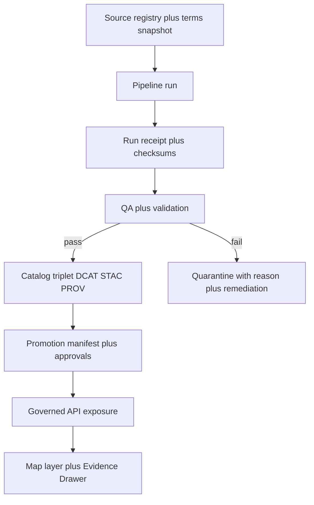
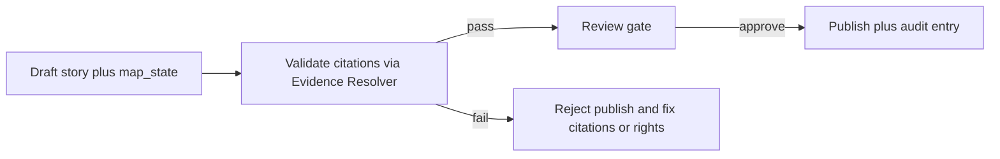
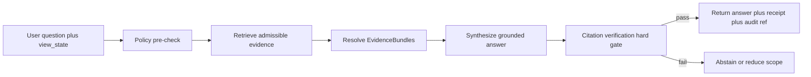

<!-- [KFM_META_BLOCK_V2]
doc_id: kfm://doc/3b5a5d0c-7d8a-4b3f-b9a0-8d2c6d3e8f1a
title: Kansas Frontier Matrix (KFM) — README
type: standard
version: v1
status: draft
owners: TBD
created: 2026-03-03
updated: 2026-03-03
policy_label: public
related:
  - kfm://doc/TBD-kfm-prime
  - kfm://doc/TBD-kfm-exec-summary
tags: [kfm]
notes:
  - Root README for the vNext operating model; treat implementation details as UNKNOWN until verified on your branch.
[/KFM_META_BLOCK_V2] -->

<a id="top"></a>

# Kansas Frontier Matrix (KFM)

> **Map-first • Time-aware • Governed • Evidence-first • Cite-or-abstain**  
> **Posture:** **default-deny** • **fail-closed** • reproducible by digest • policy enforced in CI + runtime

---

## Impact

**CONFIRMED (spec):** KFM is a governed, evidence-first geospatial platform whose promise is: **every map layer, story claim, and Focus Mode answer is backed by resolvable EvidenceRefs, or the system abstains**.:contentReference[oaicite:1]{index=1}

**CONFIRMED (spec):** KFM’s distinguishing invariants are:
- **Truth path** with lifecycle zones and promotion gates (Upstream → RAW → WORK/Quarantine → PROCESSED → CATALOG/TRIPLET → PUBLISHED).:contentReference[oaicite:2]{index=2}
- **Trust membrane** where all client access flows through a policy enforcement point and evidence resolver (no direct DB/storage access).:contentReference[oaicite:3]{index=3}

**PROPOSED:** Status and owners (must be set before hard-governance enforcement)
- **Status:** vNext operating model (blueprint-driven build)
- **Owners:** _TBD_ (required for CODEOWNERS + review routing)

**PROPOSED:** Primary user experiences (by spec scope)
- **Map Explorer** (layers + time controls + evidence drawer):contentReference[oaicite:4]{index=4}
- **Stories / Story Nodes** (markdown narrative + sidecar map state + citation gates):contentReference[oaicite:5]{index=5}
- **Focus Mode** (governed Q&A with receipts and hard citation verification):contentReference[oaicite:6]{index=6}
- **Catalog** (dataset/version discovery backed by catalogs, policy-filtered):contentReference[oaicite:7]{index=7}

[](#roadmap)
[](#governance)
[](#evidence-and-citations)
[](#core-invariants)
[](#truth-path-and-promotion-contract)
[](#documentation-is-production)
[](#license)

---

## Hallucination guardrails

This repo is governance-critical. This README is written to **fail closed** when reality is unknown.

### Status legend for claims

- **CONFIRMED:** documented in authoritative KFM vNext design/governance materials **or** verified by in-repo artifacts on your branch.
- **PROPOSED:** target defaults / recommendations (safe to discuss; not safe to enforce without ratification).
- **UNKNOWN:** not verified; includes the minimum steps to confirm.

> [!IMPORTANT]
> **Anti-hallucination rule:** Do not claim a module/path/service exists or is implemented unless verified on your branch.  
> The project docs explicitly call out the need to avoid claiming sub-packages are present without verification.:contentReference[oaicite:8]{index=8}

[↑ Back to top](#top)

---

## Start here

Pick the path that matches what you’re doing.

### I’m contributing code/docs/data

**UNKNOWN:** Whether these files exist on your branch.
- Verification step: `ls CONTRIBUTING.md SECURITY.md CODE_OF_CONDUCT.md .github/README.md`  
- If present: read them before submitting governance-critical changes.

**CONFIRMED (spec):** Any change that affects promotion gates, policy semantics, contracts, or published surfaces must be reviewed like production configuration.:contentReference[oaicite:9]{index=9}

### I’m stewarding governance

**CONFIRMED (spec):** If sensitivity/permissions are unclear → default-deny until reviewed (no “guess and publish” path).:contentReference[oaicite:10]{index=10}

### I’m operating pipelines / runtime

**CONFIRMED (spec):** Canonical truth is artifacts + catalogs + receipts + audit records; databases/search/tiles are rebuildable projections and must not become the source of truth.:contentReference[oaicite:11]{index=11}

[↑ Back to top](#top)

---

## Quick navigation

- [Reality check first](#reality-check-first)
- [System overview](#system-overview)
- [Golden paths](#golden-paths)
- [Core invariants](#core-invariants)
- [Truth path and promotion contract](#truth-path-and-promotion-contract)
- [Deterministic identity and versioning](#deterministic-identity-and-versioning)
- [Catalog triplet and profiles](#catalog-triplet-and-profiles)
- [Evidence and citations](#evidence-and-citations)
- [Governed API](#governed-api)
- [Focus Mode AI](#focus-mode-ai)
- [Governance](#governance)
- [Repository layout](#repository-layout)
- [Roadmap](#roadmap)
- [License](#license)

---

## Reality check first

**CONFIRMED (spec):** To avoid “accidental hallucination” in planning and enforcement, the project guidance requires a minimum verification checklist and encourages attaching outputs to the next revision.:contentReference[oaicite:12]{index=12}

### Minimum verification steps (do these once per branch)

**UNKNOWN:** Current repo tree, CI gates, and implementation maturity.
- Verify: `git rev-parse HEAD` and `tree -L 3`:contentReference[oaicite:13]{index=13}
- Verify: extract merge-blocking checks from `.github/workflows`:contentReference[oaicite:14]{index=14}
- Verify: search for **spec_hash**, policy bundle/tests, catalog validators/link-checks, evidence resolver routes, dataset registry schema:contentReference[oaicite:15]{index=15}

**PROPOSED:** Run an end-to-end vertical slice early (one dataset through all gates) to validate the governance membrane and performance envelope before scaling.:contentReference[oaicite:16]{index=16}

[↑ Back to top](#top)

---

## System overview

**CONFIRMED (spec):** KFM connects **data → pipelines → catalogs/provenance → storage/indexing → governed APIs → Map/Story UI → Focus Mode AI**.:contentReference[oaicite:17]{index=17}

### High-level flow


```mermaid
flowchart LR
  A[Upstream sources] --> B[Connectors and pipeline runner]
  B --> C[RAW zone]
  C --> D[WORK and Quarantine]
  D --> E[PROCESSED zone]
  E --> F[Catalog triplet DCAT STAC PROV plus receipts]
  F --> G[Rebuildable projections]
  F --> H[Governed API plus policy plus evidence resolver]
  G --> H
  H --> I[UI Map Explorer Stories Focus Mode]
  H --> J[Exports and reports]
  H --> K[Append-only audit record]
```

### Trust membrane

**CONFIRMED (spec):**
- Clients **MUST NOT** access object storage or databases directly; all access flows through the governed interface (PEP/API).:contentReference[oaicite:18]{index=18}
- Focus Mode and Story publishing depend on the Evidence Resolver; citations are EvidenceRefs that must resolve into EvidenceBundles (no “paste a URL and hope”).:contentReference[oaicite:19]{index=19}

[↑ Back to top](#top)

---

## Golden paths

These are the end-to-end workflows the system must make boring and reliable.

### Golden path 1: Promote a dataset version


```mermaid
flowchart TB
  S[Source registry plus terms snapshot] --> P[Pipeline run]
  P --> R[Run receipt plus checksums]
  R --> Q[QA plus validation]
  Q -->|pass| C[Catalog triplet DCAT STAC PROV]
  Q -->|fail| X[Quarantine with reason plus remediation]
  C --> G[Promotion manifest plus approvals]
  G --> U[Governed API exposure]
  U --> M[Map layer plus Evidence Drawer]
```

**CONFIRMED (spec):** Promotion to PUBLISHED is blocked unless minimum gates are met (identity/versioning, licensing/rights metadata, sensitivity classification + obligations, triplet validation, QA thresholds, run receipt + audit record, release manifest).:contentReference[oaicite:20]{index=20}

### Golden path 2: Publish a Story Node


```mermaid
flowchart LR
  D[Draft story plus map_state] --> V[Validate citations via Evidence Resolver]
  V -->|pass| R[Review gate]
  R -->|approve| P[Publish plus audit entry]
  V -->|fail| A[Reject publish and fix citations or rights]
```

**CONFIRMED (spec):** Story Nodes bundle narrative markdown with a sidecar capturing map state and citations; publishing is governed and requires review state + resolvable citations.:contentReference[oaicite:21]{index=21}

### Golden path 3: Answer in Focus Mode


```mermaid
flowchart LR
  Q[User question plus view_state] --> P[Policy pre-check]
  P --> R[Retrieve admissible evidence]
  R --> B[Resolve EvidenceBundles]
  B --> S[Synthesize grounded answer]
  S --> V[Citation verification hard gate]
  V -->|pass| O[Return answer plus receipt plus audit ref]
  V -->|fail| A[Abstain or reduce scope]
```

**CONFIRMED (spec):** If citations cannot be verified, Focus Mode must abstain or reduce scope; this is the primary anti-hallucination mechanism.:contentReference[oaicite:22]{index=22}

[↑ Back to top](#top)

---

## Core invariants

Violating these breaks governance, not “just code.”

**CONFIRMED (spec):** These invariants are intended to be **test-enforced** and **fail-closed**.:contentReference[oaicite:23]{index=23}

| Invariant | Meaning | Enforcement target |
|---|---|---|
| **Truth path** | Upstream → RAW → WORK/Quarantine → PROCESSED → CATALOG/TRIPLET → PUBLISHED | CI + pipeline promotion gates:contentReference[oaicite:24]{index=24} |
| **Promotion Contract** | Cannot publish without identity, licensing, sensitivity, triplet validation, QA thresholds, receipts, manifest | CI must fail closed:contentReference[oaicite:25]{index=25} |
| **Trust membrane** | No direct client-to-DB/storage; all access through PEP/API + Evidence Resolver | Network + code rules + tests:contentReference[oaicite:26]{index=26} |
| **Catalog triplet as contract** | DCAT/STAC/PROV are contract surfaces; EvidenceRefs resolve deterministically | Validators + link-check in CI:contentReference[oaicite:27]{index=27} |
| **Cite-or-abstain** | If EvidenceRefs don’t resolve for the user role, the system abstains | Focus/Story hard gate:contentReference[oaicite:28]{index=28} |

[↑ Back to top](#top)

---

## Truth path and promotion contract

### Lifecycle zones

**CONFIRMED (spec):** Zones are defined as storage zones plus validation gates, not as a metaphor.:contentReference[oaicite:29]{index=29}

| Zone | Definition | Typical contents |
|---|---|---|
| **RAW** | Immutable acquisition; append-only | Upstream payload snapshots + checksums + terms/license snapshot + fetch logs:contentReference[oaicite:30]{index=30} |
| **WORK / Quarantine** | Intermediate transforms and QA; failures isolated; artifacts may be rewritten | Normalization outputs, reprojections, tiling jobs, QA reports, redaction/generalization transforms:contentReference[oaicite:31]{index=31} |
| **PROCESSED** | Publishable artifacts in standardized formats with stable IDs and checksums | GeoParquet/COG/PMTiles, standardized schemas, derived layers, final QA results:contentReference[oaicite:32]{index=32} |
| **CATALOG / Triplet** | Cross-linked DCAT + STAC + PROV describing metadata, assets, and lineage | Catalog JSON, PROV bundles, link maps:contentReference[oaicite:33]{index=33} |
| **PUBLISHED** | Governed runtime surfaces served via PEP/API and UI; policy enforced | API responses, tiles endpoints, story pages, Focus answers (each with receipts):contentReference[oaicite:34]{index=34} |

### Promotion Contract v1

**CONFIRMED (spec):** Promotion is blocked unless gates are met; automation in CI is expected (fail-closed).:contentReference[oaicite:35]{index=35}

**PROPOSED:** Keep the “gate table” in `docs/governance/promotion_contract.md` (or equivalent) and enforce via CI + policy fixtures.

[↑ Back to top](#top)

---

## Deterministic identity and versioning

**CONFIRMED (spec):** Deterministic spec hashing (spec_hash) is a first-order work package and must be stable across OS; CI blocks drift.:contentReference[oaicite:36]{index=36}

**CONFIRMED (spec):** Recommended pattern:
- `spec_hash = sha256( RFC8785 canonical_json(spec) )`:contentReference[oaicite:37]{index=37}
- `dataset_version_id` is derived from the spec anchor plus release metadata (digest-addressed):contentReference[oaicite:38]{index=38}

**UNKNOWN:** Exact on-disk path(s) for dataset specs and registry entries in this repo.
- Verify: search for `spec_hash` usage and spec schema(s) in `contracts/` and tooling in `tools/`.:contentReference[oaicite:39]{index=39}

[↑ Back to top](#top)

---

## Catalog triplet and profiles

**CONFIRMED (spec):** Catalogs and provenance are contract surfaces, not “nice metadata”; KFM uses a cross-linked triplet: **DCAT (dataset metadata), STAC (asset metadata), PROV (lineage)** so EvidenceRefs resolve deterministically.:contentReference[oaicite:40]{index=40}

**PROPOSED (minimum profile rules):**
- DCAT must carry dataset identity (`kfm:dataset_id`, `kfm:dataset_version_id`), license, and distributions.
- STAC must carry dataset version and link back to DCAT and PROV.
- PROV must link outputs to generating activities and inputs.

**CONFIRMED (spec):** CI should run validators and link-checking; broken links block merges/promotions.:contentReference[oaicite:41]{index=41}

[↑ Back to top](#top)

---

## Evidence and citations

### EvidenceRef schemes

**CONFIRMED (spec):** KFM “citations” are EvidenceRefs resolved via the evidence resolver into EvidenceBundles (metadata + artifacts + provenance + policy), not raw URLs pasted into text.:contentReference[oaicite:42]{index=42}

**CONFIRMED (spec):** Recommended identifier families and EvidenceRef schemes include `kfm://...` IDs and resolvable schemes like `dcat://`, `stac://`, `prov://`, `doc://` (and optionally `graph://`, `url://`).

Example patterns (illustrative):

```text
kfm://dataset/<slug>
kfm://dataset/<slug>@<dataset_version_id>
kfm://artifact/sha256:<digest>
kfm://run/<run_id>
kfm://audit/entry/<entry_id>
kfm://story/<story_id>@<story_version_id>

dcat://dataset/<slug>@<dataset_version_id>
stac://collection/<slug>@<dataset_version_id>#asset=<asset_key>
prov://run/<run_id>
doc://story/<story_id>@<story_version_id>
```

### Evidence resolver contract

**CONFIRMED (spec):**
- Evidence resolution must apply policy + obligations and return allow/deny with an EvidenceBundle when allowed.:contentReference[oaicite:44]{index=44}
- Focus Mode and Story publishing have a hard gate: every citation must resolve and be policy-allowed; otherwise narrow scope or abstain.:contentReference[oaicite:45]{index=45}

**PROPOSED:** Keep evidence resolution “≤ 2 calls” from UI as a performance target and test it in e2e.

[↑ Back to top](#top)

---

## Governed API

**CONFIRMED (spec):** Governed API surfaces are the only supported access path for clients; it is where policy and evidence resolution are enforced.:contentReference[oaicite:46]{index=46}

### Illustrative endpoint surfaces (spec-aligned examples)

**CONFIRMED (spec):**
- `GET /api/v1/datasets` — discover datasets/versions; policy-filtered; includes `dataset_version_id`:contentReference[oaicite:47]{index=47}
- `GET /api/v1/stac/collections` and `/items` — browse STAC; returns digests/checksums:contentReference[oaicite:48]{index=48}
- `GET/POST /api/v1/story` — read/publish story nodes; publish requires resolvable citations + review state:contentReference[oaicite:49]{index=49}
- `POST /api/v1/focus/ask` — Focus Mode governed run; receipt + hard citation verification; abstains if unsupported:contentReference[oaicite:50]{index=50}

### Policy-safe error model

**CONFIRMED (spec):** Error responses must include an `audit_ref` and avoid leaking restricted metadata via distinguishable errors.

Minimum (illustrative) JSON:

```json
{
  "error_code": "KFM_FORBIDDEN",
  "message": "Policy-safe message.",
  "audit_ref": "kfm://audit/entry/..."
}
```

[↑ Back to top](#top)

---

## Focus Mode AI

**CONFIRMED (spec):** Focus Mode is not a general chatbot. It is a governed workflow: policy pre-check → admissible retrieval → EvidenceBundle resolution → synthesis → hard citation verification → receipt/audit; abstain or reduce scope if unsupported.:contentReference[oaicite:52]{index=52}

### Minimum evaluation harness (merge-blocking)

**CONFIRMED (spec):** Work package plan requires an evaluation harness with golden queries and merge-blocking regressions for Focus Mode changes.:contentReference[oaicite:53]{index=53}:contentReference[oaicite:54]{index=54}

**PROPOSED:** Minimum harness metrics
- citation resolvability: 100% for allowed users
- refusal correctness: restricted scopes produce policy-safe refusal/abstention
- leakage checks: no restricted coordinates/metadata in outputs
- regression: golden queries pinned to DatasetVersions

[↑ Back to top](#top)

---

## Governance

**CONFIRMED (spec):** Governance is enforceable behavior: promotion gates, policy labels, obligations, access control, and audit logging.:contentReference[oaicite:55]{index=55}

### Baseline roles (starter)

**PROPOSED:**
- Public user
- Contributor
- Steward/Reviewer
- Operator
- Governance council (sensitive materials)

### Governance review triggers

**CONFIRMED (spec):** Risk register highlights review triggers and mitigations for:
- policy bypass (trust membrane):contentReference[oaicite:56]{index=56}
- licensing violations (rights metadata + metadata-only mode):contentReference[oaicite:57]{index=57}
- sensitive-location leakage (restricted precise + public generalized derivatives; redaction tests; default-deny):contentReference[oaicite:58]{index=58}
- non-resolvable citations (evidence resolver contract; publish gate):contentReference[oaicite:59]{index=59}
- Focus Mode hallucination/leakage (hard citation verifier; eval harness; policy pre-checks):contentReference[oaicite:60]{index=60}

[↑ Back to top](#top)

---

## Repository layout

> [!NOTE]
> **UNKNOWN until verified:** the exact current repo structure on your branch.  
> Do not treat this section as proof that any specific module exists.

**CONFIRMED (report/spec):** The plan assumes top-level directories like `apps/`, `packages/`, `contracts/`, `policy/`, `data/`, `infra/`, plus supporting `docs/`, `tools/`, `tests/`—but you must verify in the live repo/branch before enforcing module-specific checks.:contentReference[oaicite:61]{index=61}:contentReference[oaicite:62]{index=62}

### Target layout (PROPOSED)

```text
Kansas-Frontier-Matrix/                                 # KFM monorepo: governed, evidence-first geospatial + historical knowledge system (map-first, time-aware, default-deny)
├─ README.md                                             # Project overview + architecture map + trust model + quickstart + contribution/gate entrypoints
├─ LICENSE                                               # Repository license and usage terms (code + bundled artifacts as specified)
├─ CONTRIBUTING.md                                       # Contribution workflow (PR rules, required checks, evidence discipline, data submission gates)
├─ SECURITY.md                                           # Security policy (reporting, disclosure, secret handling, dependency posture)
├─ CODE_OF_CONDUCT.md                                    # Community behavior expectations and enforcement process
├─ CHANGELOG.md                                          # Release notes + notable changes (including breaking contract/policy changes)
├─ Makefile                                              # Standard task entrypoints (build/test/lint/policy/docs/validate/publish helpers)
├─ compose.yaml                                          # Local dev stack definition (services + ports) for Linux-first workflows
│
├─ .github/                                              # GitHub governance + CI automation (owners, templates, required checks, gate enforcement)
│  ├─ CODEOWNERS                                          # Ownership/review map (decision rights wiring for policy/docs/data/contracts/apps)
│  └─ workflows/                                          # CI workflows enforcing tests, policy gates, provenance receipts, and optional supply-chain checks
│
├─ docs/                                                 # Documentation hub (human-readable): governance + runbooks + standards + ADRs (source of truth for process)
│  ├─ governance/                                        # Governance model (labels, obligations, gates, waivers, roles, decision records, templates)
│  ├─ runbooks/                                          # Operational playbooks (pipelines, incidents, promotions, reruns, steward/security procedures)
│  ├─ standards/                                         # Standards/profiles (metadata, naming, schemas usage, evidence rules, interoperability guidance)
│  └─ adr/                                               # Architecture Decision Records (why key decisions were made; consequences and alternatives)
│
├─ contracts/                                            # Canonical interface contracts: OpenAPI + schemas + vocab (what producers/consumers can rely on)
│  ├─ openapi/                                           # Versioned API specs (v1 additive; v2 for breaking changes only)
│  ├─ schemas/                                           # JSON Schemas for artifacts/envelopes (receipts, manifests, evidence, catalogs, UI state)
│  └─ vocab/                                             # Controlled vocabularies (labels, obligations, reason codes, zones, themes, etc.)
│
├─ policy/                                               # Policy-as-code: OPA/Rego packages + vocab + fixtures + tests (default-deny; obligation-aware; parity enforced)
│  ├─ rego/                                              # Rego policy modules (authz, labels, obligations, rights, sensitivity, promotion gating, errors)
│  ├─ tests/                                             # Policy unit tests (rego tests/conftest): regression guardrails + invariants
│  └─ fixtures/                                          # Deterministic synthetic fixtures (inputs/expected decisions; safe-by-default)
│
├─ data/                                                 # Data truth-path zones + governance metadata (immutable → curated → cataloged → published) with audit trail
│  ├─ specs/                                             # Dataset specs (schemas, transforms, QA thresholds, promotion requirements, class-specific rules)
│  ├─ registry/                                          # Dataset registry (sources, licensing, sensitivity, stewards, cadence, provenance anchors)
│  ├─ raw/                                               # RAW zone: immutable acquisitions + checksums + ingest receipts
│  ├─ work/                                              # WORK zone: staging/transforms/QA (not publishable; iterative)
│  ├─ quarantine/                                        # QUARANTINE: blocked artifacts awaiting remediation (policy/quality/rights failures)
│  ├─ processed/                                         # PROCESSED: validated artifacts eligible for cataloging/publishing
│  ├─ catalog/                                           # CATALOG: DCAT/STAC/PROV + crosslinks + receipts (discovery + traceability surface)
│  ├─ published/                                         # PUBLISHED: governed exports surfaced to apps/APIs (labels + obligations applied)
│  └─ audit/                                             # AUDIT: immutable logs/receipts/decisions/promotions/waivers references (tamper-evident goals)
│
├─ stories/                                              # Governed narratives (claims + evidence + map layers) with review gates and publication control
│  ├─ draft/                                             # Draft story nodes (editable; not externally trusted)
│  ├─ review/                                            # Stories under formal review (checklists, required citations, obligation review)
│  └─ published/                                         # Published stories (versioned, immutable; citations locked; obligations enforced)
│
├─ apps/                                                 # Applications (API + UIs + workers) consuming contracts/policy consistently (no direct DB access from UIs)
├─ packages/                                             # Shared libraries (domain/usecases/adapters + evidence/catalog/policy/geo) enforcing clean architecture boundaries
├─ infra/                                                # Infrastructure and deployment manifests (IaC, k8s/helm/compose wiring, environments, policy attachment points)
├─ tools/                                                # Repo tooling (validators, generators, linters, linkcheckers, promotion helpers, receipt/crosslink tools)
└─ tests/                                                # Repo-level tests (unit/schema/policy/contract/integration/e2e) and suite registry mapping to gates
```

[↑ Back to top](#top)

---

## Roadmap

**CONFIRMED (spec):** The authoritative vNext implementation plan is expressed as work packages **WP-01…WP-08** with acceptance criteria (small, reviewable, reversible).:contentReference[oaicite:63]{index=63}

### Work packages (condensed)

| WP | Goal | Key deliverables | Acceptance criteria |
|---|---|---|---|
| WP-01 | Spec hashing + controlled vocab validation | `spec_hash` lib + CLI; schemas; golden tests | Hash stable across OS; CI blocks drift:contentReference[oaicite:64]{index=64} |
| WP-02 | Catalog validators + link checker | DCAT/STAC/PROV validators; linkcheck | Validators run in CI; broken links block merge:contentReference[oaicite:65]{index=65} |
| WP-03 | Policy pack + fixture tests | OPA/Rego bundle; fixtures | Default-deny enforced; CI blocks regressions:contentReference[oaicite:66]{index=66} |
| WP-04 | Evidence resolver service | `/evidence/resolve`; EvidenceBundle schema; integration tests | Resolves refs; enforces policy; no restricted leakage:contentReference[oaicite:67]{index=67} |
| WP-05 | Dataset registry + discovery endpoints | Catalog registry reader; `/datasets` + `/stac` routes | Policy-filtered; returns version IDs + digests; contract tests pass:contentReference[oaicite:68]{index=68} |
| WP-06 | Map Explorer baseline UI | MapCanvas; LayerPanel; TimeControl; EvidenceDrawer; e2e tests | Evidence drawer shows license + version; keyboard nav works:contentReference[oaicite:69]{index=69} |
| WP-07 | Story Node v3 publish workflow | Story schema/routes; UI renderer; publish gate | Review state + resolvable citations required; citations open evidence drawer:contentReference[oaicite:70]{index=70} |
| WP-08 | Focus Mode MVP + evaluation harness | Focus orchestrator/route; eval harness tests | Cite-or-abstain; golden queries; merge blocked on regressions:contentReference[oaicite:71]{index=71} |

### 90-day framing (PROPOSED)

**PROPOSED:** Weeks 1–4: WP-01…WP-04 (“trust foundation”), Weeks 5–8: WP-05…WP-06 (“discover & view”), Weeks 9–12: WP-07…WP-08 (“publish & explain”).:contentReference[oaicite:72]{index=72}

[↑ Back to top](#top)

---

## Documentation is production

**CONFIRMED (spec):** Docs should use MetaBlock v2 (no YAML frontmatter) and carry a `policy_label` when served through governed surfaces.

MetaBlock template (reference):

```html
<!-- [KFM_META_BLOCK_V2]
doc_id: kfm://doc/<uuid>
title: <Title>
type: standard
version: v1
status: draft|review|published
owners: <team or names>
created: YYYY-MM-DD
updated: YYYY-MM-DD
policy_label: public|restricted|internal|...
related:
  - <paths or kfm:// ids>
tags: [kfm]
notes:
  - <short notes>
[/KFM_META_BLOCK_V2] -->
```

[↑ Back to top](#top)

---

## License

**UNKNOWN:** Repository license status.
- Verification step: check for `LICENSE` at repo root.
- Recommendation (PROPOSED): choose SPDX-friendly licensing for code and capture source-specific licensing for data.

[↑ Back to top](#top)

---

## Appendix: Definition of Done checklists

### Dataset onboarding DoD (spec-aligned minimum)

**CONFIRMED (spec):** Promotion is blocked unless identity/versioning, licensing/rights, sensitivity, triplet validation, QA thresholds, receipts/audit, and manifest are present.:contentReference[oaicite:74]{index=74}

- [ ] source registry entry exists (license/terms snapshot + sensitivity + cadence)
- [ ] dataset spec exists and `spec_hash` is stable (golden tests)
- [ ] RAW artifacts checksummed; append-only
- [ ] WORK transforms recorded; failures quarantined with reasons
- [ ] PROCESSED artifacts produced with digests and stable IDs
- [ ] DCAT/STAC/PROV generated and profile-valid; cross-links resolve
- [ ] policy label assigned; obligations documented (if needed)
- [ ] QA report present; thresholds met (or quarantined)
- [ ] release/promotion manifest created; approvals captured
- [ ] governed runtime can serve policy-safe metadata and allowed artifacts

### Story publishing DoD (spec-aligned minimum)

**CONFIRMED (spec):** Publishing requires review state + resolvable citations; citations must open/resolve via evidence resolver/evidence drawer flow.:contentReference[oaicite:75]{index=75}

- [ ] story markdown + sidecar map state present
- [ ] all citations are EvidenceRefs and resolve for intended audience
- [ ] policy label + review state assigned
- [ ] publish event emits audit reference + receipt

### Focus Mode DoD (spec-aligned minimum)

**CONFIRMED (spec):** Hard citation verification gate; abstain or reduce scope if unsupported; evaluation harness with golden queries blocks regressions.:contentReference[oaicite:76]{index=76}:contentReference[oaicite:77]{index=77}

- [ ] policy pre-check blocks disallowed scopes/topics
- [ ] retrieval returns only admissible EvidenceBundles
- [ ] citation verifier is a hard gate (no “best-effort citations”)
- [ ] receipt emitted (inputs, bundle digests, policy decision refs, output hash)
- [ ] evaluation harness exists; golden query diffs are merge-blocking
