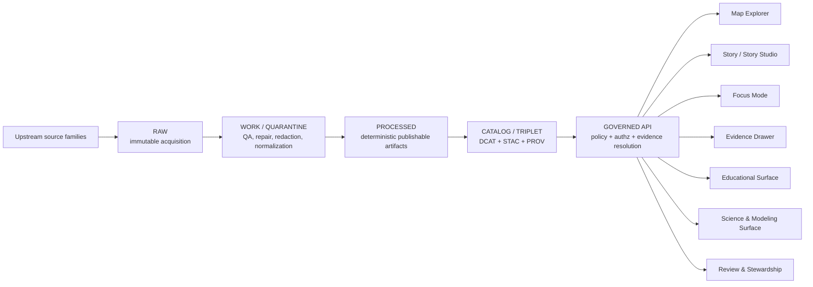
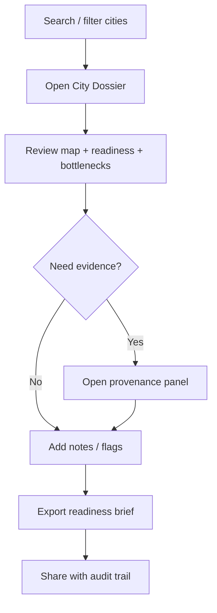
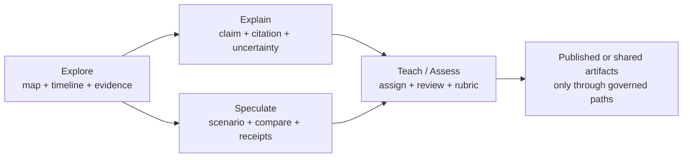

<!-- [KFM_META_BLOCK_V2]
doc_id: kfm://doc/readme-root-v2
title: Kansas Frontier Matrix
type: standard
version: v1
status: draft
owners: TBD (verify CODEOWNERS)
created: 2026-03-06
updated: 2026-03-07
policy_label: public
related: [/.github, /apps, /contracts, /data, /docs, /infra, /packages, /policy, /schemas, /tests, /tools]
tags: [kfm, readme, governance, evidence, gis, provenance, cities, infrastructure, education]
notes: [Repo-root README aligned to the definitive KFM serviced master reference, the product-surface annexes, the Kansas domain briefs preserved in the annex pack, and the uploaded GIS/metadata/UI/engineering source library. Current-branch implementation facts remain UNKNOWN unless separately verified on the active branch.]
[/KFM_META_BLOCK_V2] -->

<a id="top"></a>

# Kansas Frontier Matrix
Governed, evidence-linked, map-first, time-aware infrastructure for exploring Kansas through place, time, narrative, analysis, inspectable evidence, and policy-safe decision support.

> **Status:** draft  
> **Owners:** TBD (`verify CODEOWNERS`)  
>       
> **Quick links:** [Purpose](#purpose) · [Source posture](#source-posture-and-truth-labels) · [Repo fit](#repo-fit) · [Non-negotiables](#non-negotiables) · [Reference architecture](#reference-architecture-and-trust-membrane) · [Promotion contract](#truth-path-promotion-contract-and-receipt-discipline) · [Canonical model](#canonical-data-model-evidence-model-and-three-clocks) · [Product surfaces](#product-surfaces) · [Kansas domain foundation](#kansas-domain-foundation) · [Cities & Infrastructure](#cities--infrastructure-vertical-proposed) · [Educational surface](#educational-product-surface-proposed) · [Science & modeling](#science--modeling-workflows-proposed) · [Source ecosystem](#source-ecosystem-and-connector-architecture) · [Accepted inputs](#accepted-inputs) · [Current repo posture](#current-repo-posture) · [Quickstart](#quickstart) · [Source integration map](#source-library-integration-map)

## Purpose
Kansas Frontier Matrix (KFM) should be understood as a **governed, evidence-linked, map-first, time-aware platform** for Kansas history, environment, infrastructure, science, and public knowledge. It is not merely a map portal, a loose story editor, a dashboard bundle, or a free-form chat surface. It is a composite system whose public promise is that a user can move from a visible claim to inspectable evidence without crossing an invisible boundary into unverified convenience.

KFM’s operating promise is stable across the strongest project documents:

- **Map Explorer** answers *where*
- **time controls** answer *when*
- **stories / Story Studio** answer *why the evidence matters*
- **Evidence Drawer** answers *what a visible claim rests on*
- **Focus Mode** provides natural-language access **without bypassing evidence or policy**

This README is the repo-root operating contract for contributors. It is intentionally conservative: it separates **CONFIRMED**, **PROPOSED**, and **UNKNOWN** rather than letting design ambition masquerade as current implementation.

## Source posture and truth labels

### Source-key families
KFM’s strongest source basis can be summarized as follows:

| Key family | What it covers | Role here |
|---|---|---|
| **K0** | Foundational KFM architecture / governance / build material | Core operating spine |
| **K1** | Science and Physics Product Surface | Governed science / modeling extension |
| **K2** | Educational Product Surface | Explore / Explain / Speculate / Teach posture |
| **K3** | Data Sources inventory | Source families, cadence, rights, sensitivity |
| **KD1–KD6** | Kansas migration, geology, hydrology, hazards, agriculture, wildlife | Kansas-domain grounding |
| **R\*** | Uploaded technical library | Implementation guidance across GIS, metadata, APIs, UI, pipelines, remote sensing, scientific computing, and engineering practice |

### Truth labels used throughout

| Label | Meaning here |
|---|---|
| **CONFIRMED** | Directly established by the supplied KFM corpus or the strongest attached references. |
| **PROPOSED** | A buildable implementation choice, product extension, or operating recommendation consistent with the corpus, but not proven as live state. |
| **UNKNOWN** | Not established by the supplied evidence and requiring branch, environment, or deployment verification before operational treatment. |

This README prefers **visible uncertainty over plausible fiction**.

## Repo fit
**Path:** `/README.md`  
**Repo role:** root orientation document for the monorepo.  
**Upstream:** source systems, acquisition connectors, normalization jobs, catalog builders, policy decisions, domain briefs, documentation standards, and source registries.  
**Downstream:** Map Explorer, Evidence Drawer, Story / Story Studio, Focus Mode, Review & Stewardship surfaces, the educational workspace set, and any future science or civic/infrastructure verticals.

KFM should be read as a **truth path → catalog → governed API → user surface** system. The repo root is where contributors should learn the platform contract before descending into service-specific code or documentation.

## Accepted inputs
This repo should accept only inputs that can participate in the evidence model and truth path.

| Input type | Examples | Typical landing zone | Notes |
|---|---|---|---|
| Historical tabular data | census extracts, land patents, registries, tabular archives | `RAW/` then `WORK/` | Preserve source metadata and acquisition receipts. |
| Vector geodata | county boundaries, PLSS, routes, parcels, sites, event polygons | `RAW/` then `PROCESSED/` | Standardize schemas and IDs before promotion. |
| Raster geodata | DEMs, land cover, climate grids, scenes, hazard rasters | `RAW/` then `PROCESSED/` | Prefer cloud-friendly formats and immutable checksums. |
| Narrative evidence | archival documents, newspapers, oral histories, story drafts | `RAW/` then evidence extraction flow | Rights and sensitivity review may be required. |
| Metadata and lineage records | DCAT, STAC, PROV, manifests, sidecars | `CATALOG/` | Cross-link IDs so EvidenceRefs resolve. |
| Derived outputs | analytics, statistics, anomaly layers, model products | `PROCESSED/` or governed runtime artifacts | Must remain linked to inputs, method, and receipts. |
| Validation artifacts | QA reports, accuracy tables, review notes, fixtures | `WORK/`, `docs/`, `tests/` | Governance artifacts are not disposable byproducts. |
| Policy-safe civic / infrastructure assets | city boundaries, service areas, readiness tiers, critical-facility summaries, briefs | governed data lanes | Public vs restricted exposure must be policy-resolved. |
| Policy-safe educational assets | lesson modules, rubrics, guided tours, scenario presets, Story Card templates | `docs/`, `contracts/`, governed app assets | Must not bypass provenance, role controls, or fact/speculation boundaries. |
| Scenario receipts | parameter sets, seeds, model versions, compare summaries | governed runtime artifacts | Must remain clearly separate from observational facts. |

## Exclusions
The following do **not** belong in KFM’s governed publication path.

| Exclusion | Why it stays out | Where it goes instead |
|---|---|---|
| Secrets, tokens, credentials | Never commit secrets to the repo. | Secret managers / environment configuration. |
| Direct client-to-store access patterns | Breaks the trust membrane and bypasses policy. | Governed API routes and policy-aware services. |
| Publishable artifacts without checksums, receipts, and catalogs | Cannot be audited or reproduced. | Keep in `WORK/QUARANTINE` until complete. |
| Uncited story claims or unverified Focus answers | Violates cite-or-abstain. | Draft or failed run outputs; not publishable. |
| Ambiguous-rights or unresolved restricted public data | Rights and sensitivity ambiguity must fail closed. | Quarantine, redacted derivative, or metadata-only record. |
| Fine-grained restricted civic / infrastructure layers | Can expose sensitive assets or imply unauthorized precision. | Restricted lanes, generalized geometry, or aggregate views. |
| Documentation that implies live implementation without verification | Breaks trust through overclaiming. | Mark `UNKNOWN`, add verification steps, then update. |
| Classroom outputs that blur fact and speculation | Damages trust and teaches the wrong model. | Keep as draft instructional material until labeled and evidenced correctly. |
| Permanent student dossiers or unnecessary learner telemetry | Violates minimal-data posture and increases governance burden. | Prefer pseudonymous, export-first, or local-first handling. |

## What KFM is
KFM is:

- a governed geospatial knowledge platform
- a provenance-preserving data and publication system
- a catalog and evidence-resolution substrate
- a family of coordinated user surfaces over one policy and evidence boundary
- a foundation for Kansas historical, environmental, civic, and scientific work
- a possible educational and public-learning surface when evidence, privacy, accessibility, and speculation controls remain intact
- a possible city/infrastructure decision surface when restricted layers remain policy-gated, auditable, and provenance-bearing

KFM is **not**:

- a free-form chatbot
- a generic upload-and-forget portal
- a direct browser-to-database GIS stack
- a publication path that can skip rights, validation, or provenance checks
- a repo where docs drift away from behavior without consequence
- a classroom sandbox that treats speculative outputs as settled fact
- a city dashboard that bypasses catalog, graph, policy, or evidence contracts

## Non-negotiables
The following are architectural laws, not stylistic preferences.

| Invariant | Status | What it means in practice | What must never happen |
|---|---|---|---|
| Truth path | CONFIRMED | Data moves through `RAW → WORK/QUARANTINE → PROCESSED → CATALOG/TRIPLET → PUBLISHED`. | Ad hoc publication from notebooks, temp files, or analyst-only transforms. |
| Trust membrane | CONFIRMED | Public and role-limited access crosses governed APIs, policy, and evidence resolution. | UI or external clients bypassing policy via direct store access. |
| Cite-or-abstain | CONFIRMED | Visible claims, stories, and Focus answers resolve to evidence or abstain. | Plausible uncited output presented as fact. |
| Default-deny / fail-closed | CONFIRMED | Unclear rights, unresolved sensitivity, or broken evidence blocks release. | “Best effort” publication under ambiguity. |
| Deterministic identity | CONFIRMED | Comparable inputs and the same spec produce the same logical identity and spec hash. | Unstable IDs or ambiguous lineage. |
| Evidence as interface | CONFIRMED | Evidence is operational and resolvable, not decorative. | Provenance trapped in PDFs or disconnected notes. |
| Separation of duty | CONFIRMED | Submission and policy-significant approval cross review boundaries. | Self-approval of sensitive releases. |
| Docs as production surface | CONFIRMED | Behavior changes update docs, templates, tests, and runbooks together. | Silent drift between behavior and procedure. |
| Fact / speculation boundary | PROPOSED | Educational and modeled outputs visibly distinguish baseline fact from projection. | Scenario output presented as observed reality or confirmed history. |
| Governance-by-default for civic / infrastructure data | PROPOSED | Sensitive city / infrastructure layers stay policy-gated, auditable, and redactable. | Fine-grained restricted layers exposed publicly for UX convenience. |
| Minimal learner-data posture | PROPOSED | Classroom workflows minimize collection, prefer pseudonymous identifiers, and avoid unnecessary permanent profiles. | Educational convenience driving unnecessary identity capture or silent telemetry growth. |

## Reference architecture and trust membrane
KFM should be reasoned about as a layered system whose boundaries matter more than any one tool choice.


```mermaid
flowchart LR
    A[Upstream source families] --> B[RAW<br/>immutable acquisition]
    B --> C[WORK / QUARANTINE<br/>QA, repair, redaction, normalization]
    C --> D[PROCESSED<br/>deterministic publishable artifacts]
    D --> E[CATALOG / TRIPLET<br/>DCAT + STAC + PROV]
    E --> F[GOVERNED API<br/>policy + authz + evidence resolution]
    F --> G[Map Explorer]
    F --> H[Story / Story Studio]
    F --> I[Focus Mode]
    F --> J[Evidence Drawer]
    F --> K[Educational Surface]
    F --> L[Science & Modeling Surface]
    F --> M[Review & Stewardship]
```

| Layer | Representative components | Canonical or rebuildable | Operational note |
|---|---|---|---|
| Source edge | Federal/state repositories, archives, APIs, downloads, sensor feeds, research distributions | Outside KFM | Capture request metadata, terms snapshots, and checksums at ingress. |
| RAW | Immutable payloads, manifests, fetch metadata, digests, rights snapshots | Canonical | Highest replay value; never directly user-visible. |
| WORK / QUARANTINE | Repairs, validations, transformations, redaction staging, failed-ingest holding area | Controlled intermediate | Normal workflow zone, not a shame folder. |
| PROCESSED | GeoParquet, COG, PMTiles, JSON, reports, derivative tables, run outputs | Canonical for versioned outputs | Only meaningful when cataloged and receipted. |
| CATALOG | DCAT dataset/service records, STAC collections/items/assets, PROV lineage records | Canonical metadata boundary | Discovery, lineage, and inspectability surface. |
| Operational stores | PostgreSQL/PostGIS, optional graph store, search index, vector index, tile caches | Mostly rebuildable | Operationally critical, but not sovereign over truth. |
| Governed API | REST/GraphQL endpoints, policy engine, evidence resolver, Focus runtime, run queue API | Policy-mediated boundary | The trust membrane in executable form. |
| Surfaces | Map Explorer, Story, Focus, Education, Science Lab, Review Console | Downstream | Must never access stores directly. |

A practical local-first profile remains compatible with this posture: filesystem- or emulator-backed object storage, PostgreSQL with PostGIS, optional graph/search services, a governed API, policy evaluation, MapLibre for the primary 2D interface, and controlled model serving behind the API for Focus or lab experiments. A cloud-ready profile preserves the same layering while swapping in managed storage, orchestration, queues, identity providers, and centralized telemetry.

[Back to top](#top)

## Truth path, promotion contract, and receipt discipline
Promotion is not a file copy. It is a governed state transition.

| Gate | Minimum proof | Fail-closed behavior |
|---|---|---|
| Identity and versioning | `dataset_id`, `dataset_version`, `spec_hash`, stable logical key, deterministic naming | Fail if identity is missing, duplicated, or unstable. |
| Schema and QA | Schema validity, CRS sanity, geometry/topology checks, interval sanity, row-count invariants | Route to `QUARANTINE` on blocking validation failure. |
| Rights and license | License basis, source terms snapshot, attribution obligations, redistribution rules | Fail if rights are unclear or incompatible. |
| Sensitivity and redaction | Policy label, redaction parameters, generalization method, obligations | Fail or route to restricted tier if unresolved. |
| Catalog triplet | Valid DCAT, STAC, and PROV with working links and expected fields | Fail if any triplet member is missing or inconsistent. |
| Receipt and attestation | Run receipt, checksums, and lane-required signing/attestation state | Fail when the active lane requires proofs and they are absent. |
| Publish and ledger | Promotion receipt, audit append, registry/object write, API registration update | Fail if the final publish leaves the surface inconsistent. |

Run receipts should record at least:

- dataset ID and version
- fetch time and source location
- spec hash
- orchestrator / run ID
- transform code reference
- artifact digests
- rights posture and policy class
- attestation state when required

Promotion receipts extend that record with review state, policy outcome, publication state, smoke-test outcome, and rollback pointer.

## Canonical data model, evidence model, and three clocks
The canonical KFM fact is a **long-form observation**, not a pre-baked dashboard cell. Each publishable observation should bind **metric, spatial unit, time interval, value, uncertainty, dataset version, evidence reference, rights posture, and policy label**. Wide tables, tiles, charts, and narrative excerpts are derived views.

### Core concepts

| Concept | Why it exists |
|---|---|
| `dataset` | Stable logical source family or curated product line |
| `dataset_version` | Immutable promoted release tied to a spec hash and receipts |
| `observation` | Canonical fact binding metric, place, time, value, uncertainty, provenance, rights, and policy |
| `EvidenceRef` | Stable citation token suitable for UI, API, stories, and Focus |
| `EvidenceBundle` | Resolved package of metadata, artifacts, rights, freshness, provenance, checksums, and policy outcome |
| `Story Node` | Versioned narrative unit linking text, maps, charts, and governed evidence |
| `run_receipt` | Machine-readable record of what ran, what it consumed, and what it emitted |
| `audit_ref` | Stable identifier linking a user-visible action or answer to the path that produced it |

### Minimal build-ready baseline

| Table / concept | Key fields | Purpose |
|---|---|---|
| `dim_metric` | `metric_id`, `name`, `unit`, `value_type`, `domain`, `computation_rule` | Defines what a metric means |
| `dim_time_period` | `time_id`, `start_date`, `end_date`, `grain`, `uncertainty_days` | Treats time as explicit intervals |
| `dim_spatial_unit` | `spatial_unit_id`, `unit_type`, `valid_start`, `valid_end`, `geom`, `source_ref` | Stores time-aware geographies |
| `dim_dataset_version` | `dataset_version_id`, `dataset_id`, `spec_hash`, `policy_label`, `license_spdx` | Separates dataset identity from a promoted version |
| `fact_observation` | `observation_id`, `metric_id`, `spatial_unit_id`, `time_id`, `dataset_version_id`, `value`, `uncertainty`, `qa_flag`, `method`, `evidence_ref`, `audit_ref` | Stores the canonical measurable claim |
| `EvidenceRef` | parseable stable token | Citation primitive across surfaces |
| `EvidenceBundle` | metadata + asset links + policy-safe derivation chain | What users inspect when they open evidence |

### Three clocks
KFM should keep **three distinct time dimensions** explicit:

| Clock | Meaning |
|---|---|
| **Valid time** | When a fact was true in the modeled world |
| **Event time** | When an event occurred or a source document was published |
| **Transaction time** | When KFM ingested, corrected, or rematerialized the record |

This distinction matters because Kansas boundaries drift, source vintages differ, and late corrections can change what the platform knows without changing what happened in the past.

## Governed API contract and Focus Mode behavior
The governed API is the trust membrane in executable form. It does not merely expose data; it enforces authentication, authorization, publication state, policy evaluation, and evidence resolution. If a dataset version or evidence view is not promotable, the API must not expose it.

Focus Mode is a governed synthesis layer, not a truth source. It parses the question, retrieves admissible evidence, resolves EvidenceBundles, assembles a bounded answer context, verifies citations, and either returns a cited answer with an audit reference or abstains.

| Behavior class | Allowed | Disallowed |
|---|---|---|
| Direct answer | Factual answers grounded in retrieved evidence | Unsupported assertion |
| Comparison | Cross-time or cross-place comparison where metrics and geographies are comparable | Comparisons over mismatched boundaries or methods |
| Explanation | Uncertainty-aware explanation using cited context layers and source notes | Invented causal certainty |
| Modeled output | Clearly labeled derived or model-based context with method notes and provenance | Presenting derived or modeled output as primary evidence |

Illustrative API strata:

```text
GET  /api/v1/catalog/datasets
GET  /api/v1/stac/collections
POST /api/v1/stac/search

GET  /api/v1/observations
GET  /api/v1/story-nodes
GET  /api/v1/evidence/{evidence_ref}
GET  /api/v1/audit/{audit_ref}

POST /api/v1/policy/check
POST /api/v1/focus/query
POST /api/v1/runs
POST /api/v1/briefs/export
```

### Focus Mode rules
Focus Mode should:

- return only evidence-grounded, citation-bearing answers
- expose supporting citations / EvidenceRefs
- include confidence or uncertainty framing where relevant
- return an `audit_ref`
- explain why it abstained or narrowed scope

Focus Mode must **not**:

- invent citations
- silently interpolate beyond retrieved evidence
- override policy restrictions
- present derived/model outputs as primary evidence without labeling
- return “helpful but uncited” output as success

## Product surfaces

| Surface | Status | Purpose |
|---|---|---|
| Map Explorer | CONFIRMED | Layered geographic exploration with time controls and evidence access. |
| Evidence Drawer | CONFIRMED | Open metadata, rights, provenance, freshness, and versioning behind a visible claim. |
| Story / Story Studio | CONFIRMED concept / PROPOSED authoring shape | Narrative publishing and evidence-linked story authoring under review state. |
| Focus Mode | CONFIRMED | Governed Q&A with citation verification, audit refs, and abstention behavior. |
| Review & Stewardship | CONFIRMED concept | Promotion approval, rights review, QA, corrections, and policy-aware publication controls. |
| Educational Surface | PROPOSED | Evidence-first learning workspaces for Explore / Explain / Speculate / Teach. |
| Science & Modeling Surface | PROPOSED | Governed scientific layers, model runs, and provenance-bearing analytical outputs. |
| Cities & Infrastructure | PROPOSED | City dossiers, infrastructure browsing, readiness / risk drilldowns, and exportable briefs inside the same evidence plane. |

## Kansas domain foundation
KFM should treat Kansas not simply as background geography but as the substantive domain the platform exists to explain.

| Domain | Why it matters | Immediate implication for KFM |
|---|---|---|
| Migration and settlement history | Kansas is defined by repeated waves of movement and displacement. | County-year demographic layers, movement corridors, and narrative evidence need first-class support. |
| Geology | Geology shapes soils, groundwater, hazards, and land use. | Stratigraphy, surficial history, and geologic layers should inform long-run place explanation. |
| Hydrology | Rivers, reservoirs, aquifers, drought, and floods are statewide organizing forces. | Hydrology is a first-wave data lane for maps, alerts, and modeling. |
| Hazards | Kansas faces drought, flood, severe weather, wildfire, and related cascading risks. | Hazard overlays and time-aware risk context belong in early public surfaces. |
| Agriculture | Farming and agricultural economies shape land, labor, migration, and infrastructure. | Agricultural indicators and land-cover/agri layers deserve first-class support. |
| Wildlife and habitat | Species movement and habitat sensitivity create rights and sensitivity constraints. | Some ecological data must remain generalized, redacted, or restricted. |

A sensible sequencing remains:

1. foundations and governance contracts
2. one thin end-to-end public slice
3. historical + environmental core
4. Kansas-domain expansion
5. educational and science extensions
6. optional advanced surfaces

[Back to top](#top)

## Cities & Infrastructure vertical (PROPOSED)
The civic / infrastructure vertical should be treated as a **planning-grade KFM domain extension**, not a bypass around governance. Cities become durable place entities with explainable dossiers, and infrastructure becomes assets + service areas + systems that can be mapped, summarized, and audited back to source datasets and lineage.

### Surface model

| Workspace | Purpose | Trust requirement |
|---|---|---|
| City Catalog | Find and compare cities by county, tier, readiness, risk, and freshness | Every derived score or tier must expose why it exists and what sources it depends on |
| City Dossier | Canonical city page with map, scorecard, bottlenecks, services, assets, and narrative | Visible facts open into provenance, dates, rights, and quality notes |
| Infrastructure Explorer | Browse assets by category, service areas, and risk overlays | Restricted layers must be policy-gated and audit-visible |
| Dataset Catalog + Story Nodes | Show what data is being used and turn dossiers into defensible briefs | Discovery and export preserve DCAT/STAC/PROV links and citation rules |


```mermaid
flowchart TD
    A[Search / filter cities] --> B[Open City Dossier]
    B --> C[Review map + readiness + bottlenecks]
    C --> D{Need evidence?}
    D -->|Yes| E[Open provenance panel]
    D -->|No| F[Add notes / flags]
    E --> F
    F --> G[Export readiness brief]
    G --> H[Share with audit trail]
```

### Frontier-tier discipline
If KFM adopts a “frontier tier” or comparable civic/infrastructure ranking, it should be a **computed and explainable classification**, not a relabeling of statutory city classes.

| Tier | Intended meaning | Example question |
|---|---|---|
| Metro Core | Major metro hub with redundancy and multimodal reach | Where do cascading failures propagate fastest? |
| Regional Hub | Multi-county service center with anchor institutions | Which hubs stabilize surrounding frontier areas? |
| Growth Node | Emerging node with uneven capacity and bottlenecks | Which investments unlock near-term constraints? |
| Service Center | Rural anchor with thin but essential services | Where is single-point-of-failure risk highest? |
| Frontier | Sparse services and low redundancy | Where do we prioritize minimum viable coverage? |

Every tier assignment should surface:

- the indicators used
- the datasets used
- missingness or uncertainty notes
- the last compute date

### Core domain split

| Entity | Why it exists |
|---|---|
| `city` | canonical place entity: boundary, centroid, county links, legal class, computed tier, rationale |
| `infrastructure_asset` | point / line / polygon asset with type, condition, status, owner/operator, and source dataset ID |
| `service_area` | served territory for water, utility, broadband, or other coverage-bearing systems |
| `provider` | operating entity behind a service area |
| `hazard_indicator` | risk-bearing measure with geometry, time range, uncertainty, and source dataset ID |
| `investment_project` | future or active projects that may change readiness or resilience |
| `dataset` / `asset_collection` | catalog objects preserving discovery and retrieval semantics |
| `provenance_activity` | activity record linking transformations, compute steps, inputs, outputs, and code version |

### Infrastructure taxonomy

| System family | Typical examples |
|---|---|
| Transportation | roads, bridges, rail, airports, freight nodes |
| Utilities | electric, gas, telecom |
| Broadband | availability, providers, backhaul indicators |
| Water | systems, sources, treatment, wells, surface-water dependencies |
| Energy | generation, substations, transmission |
| Public safety | PSAPs, stations, emergency operations |
| Healthcare | hospitals, clinics, EMS |
| Education | district boundaries, campuses, workforce centers |
| Waste / environment | landfills, floodplains, wetlands, sensitive habitats |

### First-wave source priorities

| Category | Likely first-wave sources | Why they fit |
|---|---|---|
| Transportation | KDOT assets, KanPlan, TIGER/Line | Repeatable statewide transport geometry and roadway context |
| Water systems | Kansas Water Office / KRWA / DASC continuity layers | System/service boundaries and resilience context |
| Broadband | FCC maps, Kansas broadband program context | Coverage and provider questions, with caveats about aggregation |
| Environment / hazards | KDHE public GIS, FEMA/KDA floodplain, NWI wetlands | Public GIS semantics and planning relevance |
| Emergency | KDEM geospatial hubs, critical facility layers | Operational risk context and situational drilldowns |
| Basemaps / boundaries | DASC, NG911 imagery, Census TIGER/Line, USGS water | Stable keys and visual grounding |

### Risks that must be designed in early

| Risk | Why it matters | Preferred mitigation |
|---|---|---|
| Sensitive infrastructure exposure | Fine-grained critical geometry can be harmful if overexposed | Default-deny, role claims, redacted geometry modes, auditable denials |
| Coverage and freshness drift | Statewide coverage is uneven across layers and municipalities | Make freshness and coverage first-class UI dimensions |
| Identity resolution failures | City, provider, and asset joins drift across source IDs | Maintain stable geography keys plus an alias/provenance registry |
| Overconfidence in scores | Readiness scores can be mistaken for ground truth | Expose rationale, uncertainty, and score drivers |
| Gated source friction | Some systems require accounts or constrained access | Support hybrid ingestion: public feeds + governed credentialed ingestion |

## Educational product surface (PROPOSED)
KFM can support a governed learning surface without diluting its evidence-first posture.

The intended instructional surface is best understood as **four coordinated workspaces**:

| Workspace | Purpose | Trust requirement |
|---|---|---|
| Explore | Map + timeline + evidence drawer for asking what happened, where, and when | Any visible value, layer, or claim must open into evidence |
| Explain / Story Studio | Structured authoring for evidence-linked explanations | Claims require citations; uncertainty and counterevidence must be expressible |
| Speculate / Scenario Lab | Controlled “what if?” scenario work | Outputs must be labeled speculative, parameterized, and reproducible |
| Teach / Assess | Assignment, support, and rubric hub | Minimal learner-data collection, role-aware controls, and policy-safe artifact handling |


```mermaid
flowchart LR
    A[Explore<br/>map + timeline + evidence] --> B[Explain<br/>claim + citation + uncertainty]
    A --> C[Speculate<br/>scenario + compare + receipts]
    B --> D[Teach / Assess<br/>assign + review + rubric]
    C --> D
    D --> E[Published or shared artifacts<br/>only through governed paths]
```

### Learning-surface rules

#### Explore
Explore should remain recognizably KFM:

- map canvas with layers and time controls
- evidence access from every inspectable value
- uncertainty and rights cues in the inspection flow
- no direct client access to raw or unpublished stores

#### Explain / Story Studio
Authoring should remain constrained, not free-form assertion:

- prompt around a question
- 1–3 evidence-linked claims
- optional counterevidence
- explicit uncertainty note
- publish/share gate that blocks unsupported claims or labels them accordingly

#### Speculate / Scenario Lab
Speculation is allowed only when the boundary between **historical baseline** and **modeled alternate outcome** is unmistakable:

- parameterized inputs
- deterministic and/or stochastic runs
- explicit assumptions
- reproducible run receipts
- visible `Speculative` labeling
- no language implying “what truly would have happened”

#### Teach / Assess
Teaching should support classroom use without turning KFM into a student-data warehouse:

- assign modules
- lock or unlock layers and knobs
- collect reflections or Story artifacts
- assess with embedded rubrics
- export results to other systems without maximal user profiling

### Learning data model

| Layer | Core entities | Purpose |
|---|---|---|
| Evidence-first data layer | `dataset`, `dataset_version`, `asset`, `metric`, `spatial_unit`, `time_period`, `observation`, `evidence_ref`, `evidence_bundle` | Preserve the canonical observation cube and evidence model |
| Scenario layer | `scenario`, `parameter_set`, `scenario_run`, `run_output` | Support reproducible speculation without confusing runs with observations |
| Teaching / learning layer | `lesson_module`, `assignment`, `rubric`, `student_artifact` | Hold pedagogy and classroom artifacts separately from canonical facts |

At minimum, KFM should preserve the distinction between:

- **observation**
- **derived analytic output**
- **scenario run**
- **student artifact**

## Science & modeling workflows (PROPOSED)
KFM can support a **Science & Physics Surface** by treating scientific observations, remote sensing products, and model outputs as first-class governed evidence artifacts. Scientific layers, model runs, and analytical outputs belong inside the same promotion, catalog, evidence, and policy boundary as every other KFM output.

### Operating rule

| Artifact class | Minimum requirement |
|---|---|
| Parameter set | versioned input definition with named assumptions |
| Scenario / model run | seed or deterministic spec, model version, execution receipt, inputs, outputs |
| Derived layer | source links, derivation history, uncertainty note, promotion state |
| Comparative report | baseline vs scenario distinction, citations, reproducibility metadata |
| Published analytical surface | same policy, rights, and evidence gates as any other KFM output |

### Recommended onboarding order

| Model family | Typical outputs | When to use first |
|---|---|---|
| Observation-driven derived layers | gauge percentiles, terrain derivatives, drought overlays, exposure intersections | **MVP first** because interpretation is transparent and compute is modest |
| Watershed hydrology | runoff hydrographs, watershed response, time series | After base hydrology and terrain lanes are stable |
| River hydraulics / flooding | inundation extents, depth/velocity rasters, profiles | First deep-physics lane because flood what-if use cases are concrete and high-value |
| Groundwater | heads, flows, drawdown, groundwater budgets | After hydrology and aquifer datasets are well modeled |
| Weather / coupled hydro-atmosphere | gridded forecast fields, wind vectors, streamflow, soil moisture | Later phases due to heavier calibration and compute |
| Traffic / network flow | travel times, congestion, emissions, route-state outputs | Only when infrastructure stories need active simulation |
| Agent-based models | emergent behavior scenarios and distributions | Educational and research extensions where assumptions can be surfaced clearly |
| Statistical / ML forecasting | probabilistic forecasts, anomaly detection | Use cautiously where physics models are unavailable; governance must prevent black-box overconfidence |

### Hard boundary
Observational, modeled, and AI-synthesized outputs must remain explicitly separated in both data contracts and UI labels.

[Back to top](#top)

## Source ecosystem and connector architecture
KFM should maintain a **source registry** that captures cadence, rights, sensitivity, acquisition method, and expected contract shape per source family. Connectors should be small, replaceable adapters that fetch, normalize, validate, and record receipts rather than leaking source-specific quirks into every downstream service.

| Source lane | Examples | Typical access | Governance concern |
|---|---|---|---|
| Historical / demographic | NHGIS, Census, land patents, newspapers | bulk extract, API, archival download | rights snapshots, OCR quality, temporal harmonization |
| Environmental / hydrologic | NOAA, USGS, EPA/WQP, reservoir dashboards, drought sources | API, dashboard export, files | cadence classes, sensor quality, method drift |
| Spatial basemaps / boundaries | TIGER/Line, Kansas DASC, PLSS, USGS hydrography | download + service | versioning, boundary drift, projection discipline |
| Agriculture / land cover | USDA NASS, CDL, NLCD, soils | API + raster/vector download | large rasters, resampling choices, product cadence |
| Hazards | FEMA, storm events, severe weather GIS | API, files, services | restricted geometry, incident freshness, derived overlays |
| Civic / infrastructure | KDOT, service areas, utility / broadband context | service, extract, mixed | sensitivity classification, redaction, uneven coverage |
| Narrative / heritage | KSHS, LOC, oral histories, manuscripts | scans, text, metadata, transcription | rights ambiguity, culturally sensitive material |

### Connector rules

1. Capture immutable acquisition manifests.
2. Snapshot rights and terms alongside data.
3. Write checksums early.
4. Route unresolved rights or failed validation to `QUARANTINE`.
5. Emit DCAT/STAC/PROV only after processed outputs are stable.
6. Never let a connector imply publication merely because acquisition succeeded.

## Current repo posture
This section is intentionally conservative.

**UNKNOWN**

- The exact current branch implementation depth.
- Which checks actually block merges.
- Which services are implemented versus merely designed.
- Which contracts, policies, and validations are enforced today.
- The extent of any science/modeling, educational, or city/infrastructure implementation.
- The exact root tree on the active branch unless verified locally.

### Working root layout assumptions
The following is a **working assumption** for contributor orientation only and should be verified locally before documentation is treated as branch truth:

```text
Kansas-Frontier-Matrix/
├── .github/
├── apps/
├── configs/
├── contracts/
├── data/
├── docs/
├── examples/
├── infra/
├── migrations/
├── packages/
├── policy/
├── schemas/
├── scripts/
├── tests/
├── tools/
├── CHANGELOG.md
├── CODE_OF_CONDUCT.md
├── CONTRIBUTING.md
├── LICENSE
├── README.md
└── SECURITY.md
```

### What each top-level area is for

| Path | Role in the repo |
|---|---|
| `.github/` | workflows, templates, review routing, merge discipline |
| `apps/` | runnable services and user-facing applications |
| `configs/` | shared configuration that should not hard-code secrets |
| `contracts/` | API contracts, vocabularies, and machine-enforced interface surfaces |
| `data/` | data specs, registries, examples, manifests, governed data-facing artifacts |
| `docs/` | architecture docs, ADRs, standards, runbooks, long-form guidance |
| `examples/` | safe example material and demonstration assets |
| `infra/` | deployment, platform, and operations definitions |
| `migrations/` | database or data-structure migrations |
| `packages/` | shared libraries and internal core modules |
| `policy/` | policy-as-code, fixtures, and policy tests |
| `schemas/` | schemas backing validation, ingestion, and contract enforcement |
| `scripts/` | automation and helper scripts |
| `tests/` | unit, integration, policy, and end-to-end tests |
| `tools/` | validators, CLIs, link checkers, and support tooling |

**Verification rule:** before writing “the repo does X,” inspect the active branch and confirm the relevant code, contract, or CI gate.

## Reference implementation profile (PROPOSED)

| Profile | Recommended shape | Why it fits |
|---|---|---|
| Local-first development | filesystem- or emulator-backed object storage, PostgreSQL + PostGIS, optional graph/search, governed API, policy engine, MapLibre, local model serving behind the API | Keeps the full trust membrane visible while staying easy to run locally |
| Cloud-ready production | versioned object storage, PostgreSQL + PostGIS, optional search/graph, OAuth2/OIDC, container orchestration, centralized logs/metrics/traces, signing/attestation infrastructure | Preserves the same boundaries while scaling throughput, reliability, and auditability |

Canonical vs rebuildable rule:

- **Canonical:** RAW, PROCESSED, catalog triplet members, run receipts, signed manifests, policy decisions
- **Rebuildable unless explicitly promoted:** search indexes, vector indexes, tiles, caches, denormalized summary tables, graph projections

## Quickstart
The safest root-level quickstart is **verification-first**.

```bash
# clone if needed
# git clone https://github.com/bartytime4life/Kansas-Frontier-Matrix.git
# cd Kansas-Frontier-Matrix

# identify the exact revision
git rev-parse HEAD

# inspect the top-level and near-top-level shape
find . -maxdepth 2 -type d | sort

# inspect workflow inventory, if present
find .github -maxdepth 3 -type f | sort
ls -la .github/workflows 2>/dev/null || true

# look for core governance primitives
grep -RIn "spec_hash\|EvidenceRef\|EvidenceBundle\|policy_label\|opa\|rego" . || true

# inspect likely contract and policy surfaces
find contracts policy schemas tests -maxdepth 3 -type f 2>/dev/null | sort

# inspect likely catalog / truth-path artifacts
grep -RIn "DCAT\|STAC\|PROV\|run_receipt\|promotion receipt\|quarantine" . || true

# inspect science / scenario / educational traces, if any
grep -RIn "scenario_run\|lesson_module\|student_artifact\|Story Studio\|Focus Mode" . || true

# inspect civic / infrastructure traces, if any
grep -RIn "city dossier\|frontier_tier\|service_area\|infrastructure_asset\|readiness" . || true
```

### Illustrative local-first contributor flow
Only use the following if the repo actually implements analogous scripts or targets:

```bash
make bootstrap
make validate-schemas
make test
make dev-up
make sample-ingest SOURCE=example_fixture
make catalog-validate
```

### Answer these questions before documenting the branch as real
1. What exists on this branch?
2. Which checks actually block merges?
3. Which contracts, policies, and validations are enforced today?
4. Is there one real end-to-end governed slice from acquisition to evidence-bearing publication?
5. Are science, educational, or civic/infrastructure surfaces represented as code, contracts, or only design posture?
6. Are fact/speculation, privacy, accessibility, and restricted-layer constraints represented in runtime or only in docs?

## Working model for contributors

### Thin-slice implementation order
Prefer **one fully governed vertical slice** over many half-governed features.

1. policy labels, receipts, validators, catalog profiles, and fail-closed gates
2. one end-to-end governed data slice (`RAW → PUBLISHED`) with evidence resolution
3. governed API + Map Explorer + Evidence Drawer
4. citation-validated Story workflow and review surface
5. Focus Mode beta that cites or abstains
6. Kansas-domain expansion (history + environment)
7. educational or science extensions only after the evidence loop is stable
8. optional advanced surfaces only after the above prove out

### First-release discipline
A credible opening slice is:

- one time-aware boundary system
- one promoted dataset family
- one map layer that opens evidence
- one public story that resolves every claim
- one Focus flow that cites correctly or abstains

## Documentation and contributor discipline
Docs are part of the governed surface, not commentary on the side.

A directory README should, at minimum:

- explain its purpose
- state where it fits in the repo
- define accepted inputs
- define exclusions

Behavior changes should update:

- contracts
- docs
- tests
- runbooks
- fixtures or examples when relevant

The repo root README should remain conservative:

- verify before upgrading `UNKNOWN` or `PROPOSED` to `CONFIRMED`
- preserve truth labels
- prefer relative links
- include diagrams where they clarify the operating model
- treat link checking and contract drift as real engineering work

## Definition of done / promotion checklist
Use this as the minimum repo-root gate list for serious work.

- [ ] Spec hashing is stable across environments for comparable inputs.
- [ ] Controlled vocabularies and schemas validate in CI.
- [ ] DCAT/STAC/PROV links resolve and broken links block merges.
- [ ] Policy tests default-deny and cover known restricted scenarios.
- [ ] EvidenceRefs resolve to policy-safe EvidenceBundles end to end.
- [ ] Map Explorer shows evidence, version, and rights information from the UI.
- [ ] Story publication requires review state and resolvable citations.
- [ ] Focus Mode either cites correctly with receipts or abstains.
- [ ] Rights and sensitivity labels are present for publishable data.
- [ ] Observational, derived, and speculative outputs are clearly separated.
- [ ] Cities & Infrastructure outputs (if present) expose tier rationale, freshness, and provenance.
- [ ] Restricted civic/infrastructure layers (if present) are auditable, role-aware, and deny cleanly.
- [ ] Scenario outputs (if present) are labeled speculative, reproducible, and assumption-bearing.
- [ ] Accessibility and privacy requirements are defined for any public-learning or classroom-facing surface.
- [ ] Runbooks and docs were updated alongside behavior changes.

## FAQ

### Why is KFM stricter than a normal map portal?
Because KFM is intended to be a **trust system**, not just a presentation layer. It treats provenance, policy, and evidence as runtime requirements.

### Why is the README careful about saying `UNKNOWN`?
Because the repo can change faster than architecture prose. KFM’s own operating posture rejects unsupported claims about live implementation state.

### Why are catalogs and evidence objects treated as first-class?
Because discovery, reproducibility, review, and public trust all depend on resolvable metadata and lineage, not just on attractive maps.

### Why keep observational data distinct from modeled or AI-derived outputs?
Because KFM must preserve the difference between what was observed, what was inferred, what was simulated, and what was synthesized.

### Why is the first release intentionally narrow?
Because one fully governed slice proves the architecture honestly. Many half-governed slices only prove that governance was bypassed.

### Why support science and modeling at all?
Because the KFM science extension fits the same evidence contract: model outputs can be useful only if assumptions, inputs, lineage, and restrictions remain inspectable.

### Why support an educational surface?
Because a governed learning surface can widen public understanding without weakening the evidence contract—provided instructional workflows preserve provenance, privacy, accessibility, and fact/speculation separation.

## Source library integration map
The rule is simple: **the KFM manuals define project posture; the attached technical library informs implementation patterns, not live-repo claims.**

<details>
<summary><strong>A. Governing KFM project sources</strong></summary>

- `Kansas_Frontier_Matrix_Definitive_Master_Reference_v2_serviced.pdf` — strongest serviced synthesis of architecture, governance, product surfaces, data model, source sequencing, and annex order.
- `KFM_Unified_Master_Manual_FULL.pdf` — foundational integrated architecture / governance / build spine preserved through the annex pack.
- `KFM_Comprehensive_Master_Documentation_Compendium_v1.pdf` — editorial discipline, release gating, traceable evidence, and thin-slice emphasis.
- `Science and Physics Product Surface for the Kansas Frontier Matrix.pdf` — governed science/modeling extension and run-based analytical posture.
- `Educational Product Surface for a Kansas Frontier Matrix System.pdf` — Explore / Explain / Speculate / Teach, privacy, accessibility, and classroom deployment logic.
- `KFM Data sources 2.0.docx.pdf` — source-family inventory, cadence, rights, and sensitivity framing.

</details>

<details>
<summary><strong>B. Kansas domain foundation and annex posture</strong></summary>

- `Chronological History of Migration in Kansas.pdf` — migration as a longitudinal Kansas thread.
- `Geology of Kansas_ A Meticulous Statewide Synthesis of Stratigraphy, Structure, Surficial History, ...` — geologic grounding for soils, water, hazards, and land use.
- `Hydrology of Kansas.pdf` — aquifers, rivers, reservoirs, drought, and hydrologic context.
- `Hazard and Disaster Risk Assessment for Kansas.pdf` — severe weather, drought, flood, wildfire, and risk framing.
- `Kansas Farming and Agricultural Economy Report.pdf` — agriculture, land use, labor, and economic context.
- `Migratory Patterns of Wildlife in Kansas.pdf` — habitat movement, biodiversity context, and sensitivity constraints.

</details>

<details>
<summary><strong>C. Metadata, evidence, linked data, and temporal reasoning</strong></summary>

- `Introduction to Metadata.pdf` — metadata roles, rights metadata, crosswalks, and authoritative digital-resource design.
- `Practical Semantic Web and Linked Data Applications.pdf` — RDF, RDFS, SPARQL, graph data, and linked-data patterns.
- `developing-time-oriented-database-applications-in-sql.pdf` — valid time, transaction time, bitemporal thinking, and time-aware query design.
- `Reverse Engineering of Real-Time System Models from Event Trace Recordings.pdf` — trace-driven model recovery, timing discipline, and structured reconstruction from runtime evidence.

</details>

<details>
<summary><strong>D. GIS, cartography, spatial databases, and remote sensing</strong></summary>

- `a-primer-of-gis-fundamental-geographic-and-cartographic-concepts.pdf` — core geographic representation and cartographic reasoning.
- `Understanding_Map_Projections.pdf` — projection trade-offs and distortion discipline.
- `GIS in Sustainable Urban Planning and Management.pdf` — planning, resilience, and GIS decision-support patterns for civic applications.
- `mastering-postgis-modern-ways-to-create-analyze-and-implement-spatial-data.pdf` — PostGIS-centered spatial storage, import/export, and geospatial SQL workflows.
- `Earth, Space, and Environmental Science Explorations with ArcGIS Pro ed2.pdf` — applied GIS patterns across hazards, water, climate, and field collection.
- `Map Reading & Land Navigation.pdf` — coordinates, direction, scale, and map literacy context.
- `Cloud-Based Remote Sensing with Google Earth Engine-Fundamentals and Applications.pdf` — cloud-native imagery processing and Earth Engine pedagogy.

</details>

<details>
<summary><strong>E. Data engineering, analytics, AI, and scientific computing</strong></summary>

- `The Data Engineering Cookbook.pdf` — pipeline fundamentals, Linux, networking, privacy-by-design, and operational data engineering.
- `Open-Source-Data-Pipelines-red-hat-developer-1.pdf` — containerized / Kubernetes-oriented pipeline architecture and intelligent application design.
- `Practical-Guide-to-Pandas-for-Data-Science.pdf` — tabular wrangling and exploratory analysis.
- `Text Mining with R_ A Tidy Approach.pdf` — tokenization, tf-idf, topic modeling, and text-network analysis for narrative corpora.
- `Data Mining Concepts & applictions.pdf` — classification, clustering, anomaly detection, privacy-aware mining, and analytic framing.
- `AI_Concepts_Using_Python.pdf` — broad AI survey and Python-oriented conceptual foundation.
- `python-machine-learning-a-crash-course-for-beginners...pdf` — introductory ML algorithms and validation patterns.
- `Introduction to Python for Computational Science and Engineering - book.pdf` — scientific Python foundations.
- `Python & Coding Theory.pdf` — algorithmic and mathematical grounding.
- `Applications of MATLAB in Science & Engineering.pdf` — simulation, control, and numerical workflow references.
- `MATLAB Applications for the Practical Engineer.pdf` — engineering modeling and practical MATLAB workflows.

</details>

<details>
<summary><strong>F. Web, UI, API, frontend, and visualization delivery</strong></summary>

- `Undisturbed REST_v1.pdf` — long-lived API design, resource modeling, versioning, caching, and durable contracts.
- `Programming TypeScript.pdf` — type-safe application development.
- `fullstack-react-the-complete-guide-to-reactjs-and-friends.pdf` — component design, state, and React application structure.
- `fullstack-react-with-typescript.pdf` — React + TypeScript patterns.
- `Building User Interfaces for Modern Web Applications_ React Programming.pdf` — educational React fundamentals.
- `designing-interfaces.pdf` — interface patterns, navigation, layout, actions, forms, mobile, and visual style.
- `learn-to-code-html-and-css-develop-and-style-websites.pdf` — front-end structure and styling fundamentals.
- `create-graphical-user-interfaces-with-python.pdf` — rapid GUI prototyping for admin or local tools.
- `Developing Graphics Frameworks with Python & OpenGL.pdf` — 2D/3D visualization and richer scientific rendering options.

</details>

<details>
<summary><strong>G. Architecture, engineering discipline, security, and programming models</strong></summary>

- `97-things-every-software-architect-should-know.pdf` — trade-offs, stewardship, architecture boundaries, and rationale capture.
- `97_Things_Every_Programmer_Should_Know.pdf` — code hygiene, testing discipline, simplicity, and build quality.
- `design-it-from-programmer-to-software-architect.pdf` — risk-driven architecture, stakeholder mapping, and evaluation workshops.
- `black-hat-python-python-programming-for-hackers-and-pentesters.pdf` — defensive security literacy, protocol awareness, and red-team-informed hardening context.
- `Crafting a Compiler.pdf` — transformation pipelines, validators, and language/tooling discipline.
- `mostly-adequate-guide to functional programming.pdf` — functional composition and purity patterns for transformation pipelines.
- `sketchy-lisp-an-introduction-to-functional-programming-in-scheme-3rd-edition.pdf` — functional minimalism and language-design perspective.

</details>

<details>
<summary><strong>H. Mission and long-horizon project ethos</strong></summary>

- `Dare to Invent the Future.pdf` — problem-solving ethos, community-linked knowledge, and invention-forward public-purpose framing.

</details>

[Back to top](#top)

## Notes for maintainers
- Keep this README aligned with the strongest KFM source material.
- Treat science/modeling, educational, and civic/infrastructure surfaces as **PROPOSED** until the active branch proves otherwise.
- When a claim becomes implementation fact, verify it on the current branch and update the corresponding `UNKNOWN` or `PROPOSED` language.
- When a workflow, contract, surface, or policy changes behavior, update this README as part of the same change.
- Do not let a polished README become a hidden policy bypass.
