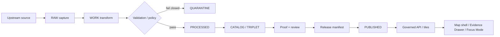

# Kansas Frontier Matrix

A governed, evidence-first, map-first, time-aware spatial knowledge and publication system for inspectable Kansas-centered claims.

> [!NOTE]
> **Status:** `draft`  
> **Owners:** `TODO: owner not verified`  
> **Authority:** `PROPOSED` until verified in a mounted repository  
> **Repo fit:** `README.md` at repository root  
> **Review burden:** Maintainers should verify Directory Rules, schema-home ADRs, policy gates, source rights, validation status, release state, and rollback paths before treating this README as active canon.


## Quick jumps

- [What KFM is](#what-kfm-is)
- [Trust law](#trust-law)
- [Repository fit](#repository-fit)
- [Responsibility roots](#responsibility-roots)
- [Core object families](#core-object-families)
- [Accepted inputs](#accepted-inputs)
- [Exclusions](#exclusions)
- [Validation and release](#validation-and-release)
- [Contributing](#contributing)
- [Open verification](#open-verification)

## What KFM is

Kansas Frontier Matrix, or KFM, is a governed spatial evidence system. It is designed to help people inspect how evidence becomes a map feature, a story, a dashboard value, an API response, a release artifact, or a bounded AI answer.

The durable unit of value is the **inspectable claim**: a public or semi-public statement whose evidence, source role, spatial scope, temporal scope, policy posture, review state, release state, and correction lineage can be inspected.

KFM is **not** just a map viewer, database, AI assistant, graph, report generator, tile server, or GIS exercise. Maps, tiles, graphs, summaries, vector indexes, scenes, dashboards, exports, and AI answers are carriers of evidence. They are not sovereign truth.

## Trust law

KFM preserves a governed lifecycle by default:

```text
RAW -> WORK / QUARANTINE -> PROCESSED -> CATALOG / TRIPLET -> PUBLISHED
```

Public clients and normal UI surfaces must use governed interfaces and released artifacts. They must not directly read raw stores, work areas, quarantine material, unpublished candidates, internal canonical stores, source-system side effects, secrets, or direct model runtime outputs.


```mermaid
flowchart LR
  A[Upstream source] --> B[RAW capture]
  B --> C[WORK transform]
  C --> D{Validation / policy}
  D -->|fail closed| E[QUARANTINE]
  D -->|pass| F[PROCESSED]
  F --> G[CATALOG / TRIPLET]
  G --> H[Proof + review]
  H --> I[Release manifest]
  I --> J[PUBLISHED]
  J --> K[Governed API / tiles]
  K --> L[Map shell / Evidence Drawer / Focus Mode]
```

Every consequential public-facing claim should be able to resolve through this chain:

```text
Claim -> EvidenceRef -> EvidenceBundle -> SourceDescriptor / Receipt / Catalog / Policy / Review / Release / Correction
```

AI is interpretive only. EvidenceBundle, policy, review, and release state outrank generated language.

## Repository fit

This file belongs at the repository root as the public landing page and orientation document.

| Relationship | Path | Status |
| --- | --- | --- |
| This document | `README.md` | `PROPOSED` |
| Human-facing doctrine and architecture | `docs/` | `NEEDS VERIFICATION` |
| Machine-readable governance registers | `control_plane/` | `NEEDS VERIFICATION` |
| Semantic contracts | `contracts/` | `NEEDS VERIFICATION` |
| Machine-checkable schemas | `schemas/` | `NEEDS VERIFICATION` |
| Policy-as-code and policy docs | `policy/` | `NEEDS VERIFICATION` |
| Tests and fixtures | `tests/`, `fixtures/` | `NEEDS VERIFICATION` |
| Apps, packages, connectors, pipelines | `apps/`, `packages/`, `connectors/`, `pipelines/`, `pipeline_specs/` | `NEEDS VERIFICATION` |
| Lifecycle data and emitted proof objects | `data/`, `release/`, `runtime/`, `artifacts/` | `NEEDS VERIFICATION` |

> [!IMPORTANT]
> Domain lanes should not become new root folders by default. Place hydrology, soil, fauna, flora, habitat, geology, atmosphere, roads-rail-trade, settlements-infrastructure, archaeology, hazards, agriculture, and people/DNA/land work under the proper responsibility roots.

## Responsibility roots

KFM root folders are authority boundaries, not convenience buckets.

| Root | Responsibility | Examples of accepted contents |
| --- | --- | --- |
| `docs/` | Human-facing control plane | Doctrine, architecture, ADRs, runbooks, standards, domain docs, source docs, registers |
| `control_plane/` | Operational governance maps | Document registry, object-family registry, source authority register, release-state register |
| `contracts/` | Semantic meaning | Evidence, source, runtime, release, correction, and domain contract docs |
| `schemas/` | Machine-checkable shape | JSON Schemas, schema tests, valid and invalid schema fixtures |
| `policy/` | Admissibility and release rules | Rights, sensitivity, promotion, runtime, domain, and release policy |
| `tests/` | Enforceable verification | Contract, schema, policy, validator, pipeline, API, UI, e2e, and runtime-proof tests |
| `fixtures/` | Test evidence | Valid, invalid, golden, synthetic, and domain fixtures |
| `apps/` | Deployable systems | Governed API, explorer web app, review console, CLI, workers, admin surfaces |
| `packages/` | Shared implementation | Evidence resolver, hashing, validators, source utilities, domain helpers |
| `connectors/` | Source access code | Source-specific ingestion adapters with rights and policy checks |
| `pipelines/` and `pipeline_specs/` | Processing and orchestration | Ingest, transform, validation, cataloging, tiling, receipt, and dry-run specs |
| `data/` | Lifecycle data and operational memory | Raw, work, quarantine, processed, catalog, triplets, registry, receipts, proofs, published |
| `release/` | Release operations | Release candidates, manifests, promotion decisions, rollback cards |
| `runtime/`, `infra/`, `configs/`, `migrations/` | Operations | Deployment, local runtime, infrastructure, configuration, and migration support |

Compatibility roots such as `ui/`, `web/`, `jsonschema/`, `policies/`, `styles/`, and `viewer_templates/` may exist in a real checkout. If they do, each should explain whether it is canonical, legacy, generated, mirrored, or awaiting migration.

## Core object families

These object families are the main trust vocabulary. Exact field names and schema homes must be verified against repository contracts and schemas before implementation claims are made.

| Object family | Purpose | Public consequence |
| --- | --- | --- |
| `SourceDescriptor` | Identifies source role, authority, terms, cadence, rights, and caveats | Prevents weak or unsuitable sources from being treated as authoritative |
| `EvidenceRef` | Points from a claim or feature to supporting evidence | Gives UI/API surfaces a resolvable evidence handle |
| `EvidenceBundle` | Packages source, receipt, catalog, policy, review, and release context | Lets users inspect why a claim is visible or why KFM abstains |
| `DecisionEnvelope` / `RuntimeResponseEnvelope` | Carries finite outcomes such as `ANSWER`, `ABSTAIN`, `DENY`, and `ERROR` | Prevents fluent uncertainty from masquerading as truth |
| `run_receipt` / `AIReceipt` | Records process memory for pipeline and model-mediated actions | Supports audit without making receipts canonical truth |
| `ReleaseManifest` / `PromotionDecision` | Records governed publication state | Makes release a reviewable transition, not a file move |
| `CorrectionNotice` / `RollbackCard` | Records correction, withdrawal, and rollback lineage | Keeps public trust repairable and inspectable |
| `LayerManifest` / `GeoManifest` | Describes released map-ready derivatives | Keeps tiles and layers downstream of evidence and release state |

## Accepted inputs

KFM may accept source-native captures, public datasets, authoritative geospatial records, archival material, sensor feeds, remote-sensing assets, contributor submissions, curated fixtures, and generated candidate deltas when they pass intake, rights, sensitivity, identity, validation, and review checks.

Accepted material should enter through source intake and lifecycle paths. Public-facing artifacts should only emerge after validation, catalog closure, policy review, release, and rollback planning.

## Exclusions

The following do not belong on normal public paths unless a governed review explicitly permits a safe, released form:

- RAW, WORK, QUARANTINE, or unpublished candidate data.
- Exact sensitive locations for archaeology, rare species, cultural sites, critical infrastructure, or restricted steward data.
- Living-person, DNA/genomic, private land, or genealogy outputs without appropriate rights, sensitivity, consent, and review posture.
- Direct model output, uncited summaries, unvalidated vector-search answers, or AI-generated claims treated as truth.
- Source data whose rights, terms, provenance, or public-release status are unclear.

Where material is excluded from public release, it may still belong in quarantine, restricted review, generalized/redacted derivatives, delayed publication, or denial records with reasons and receipts.

## Validation and release

Before a change affects published or semi-public material, maintainers should verify at least:

| Gate | Expected evidence |
| --- | --- |
| Directory placement | Directory Rules, repo evidence, and any relevant ADR |
| Source authority | `SourceDescriptor`, source role, rights, terms, cadence, and caveats |
| Schema and contract closure | Contract meaning plus machine schema validation |
| Policy posture | Rights, sensitivity, access, redaction, release, and denial rules |
| Evidence closure | Claim-to-`EvidenceBundle` resolution |
| Catalog/proof closure | Catalog record, receipt, proof pack, release candidate, and manifest where applicable |
| Review state | Steward, domain, policy, or maintainer review record |
| Correction path | Correction notice and rollback target |

Suggested baseline commands after the real repository is mounted:

```bash
git status --short
git branch --show-current || true
git rev-parse --show-toplevel || true
find .github docs control_plane contracts schemas policy tests fixtures tools scripts apps packages connectors pipelines pipeline_specs data release runtime infra configs migrations examples artifacts -maxdepth 3 -type f 2>/dev/null | sort | sed -n '1,500p'
```

Run repository-native tests when available. Do not report tests as passing unless they actually ran.

## Contributing

Contributions should preserve the KFM trust membrane.

1. Start from evidence, not plausibility.
2. Use responsibility roots; do not create new domain root folders without an ADR.
3. Keep contracts, schemas, policy, source registries, release records, proofs, and receipts in their proper homes.
4. Mark `CONFIRMED`, `PROPOSED`, `UNKNOWN`, and `NEEDS VERIFICATION` where confidence materially affects trust.
5. Prefer small, reversible changes with validation and rollback.
6. Update related documentation when behavior, placement, source posture, release state, or public meaning changes.
7. Preserve cite-or-abstain behavior for stories, map popups, exports, Evidence Drawer, Focus Mode, and API responses.

## Open verification

This README is ready to adapt, but the following items must be verified in the actual repository before it is treated as active root canon:

- Whether a root `README.md` already exists and which anchors, badges, links, and status language must be preserved.
- Current branch, dirty state, package manager, CI workflows, branch protections, and validation commands.
- Whether `contracts/` versus `schemas/` authority has an active ADR and whether the split is semantic contracts versus machine validation.
- Whether compatibility roots such as `ui/`, `web/`, `jsonschema/`, `policies/`, `styles/`, and `viewer_templates/` are canonical, legacy, generated, mirrored, or transitional.
- Actual object-family schema names, validator coverage, fixture coverage, emitted receipts, proof packs, release manifests, dashboards, routes, and DTOs.
- Maintainer owners, CODEOWNERS rules, policy labels, and review requirements.

## License and rights

`TODO: license not verified.` Add the active repository license and source-data rights posture after maintainers verify project licensing, source terms, and publication policy.
