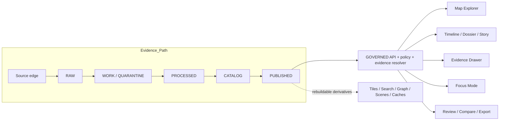

<!-- [KFM_META_BLOCK_V2]
doc_id: kfm://doc/TBD-VERIFY-root-readme-uuid
title: Kansas Frontier Matrix
type: standard
version: v1
status: review
owners: @bartytime4life
created: <NEEDS VERIFICATION>
updated: 2026-04-12
policy_label: public
related: [./.github/, ./.github/README.md, ./.github/actions/README.md, ./.github/watchers/README.md, ./.github/workflows/README.md, ./.github/CODEOWNERS, ./.github/PULL_REQUEST_TEMPLATE.md, ./.github/SECURITY.md, ./apps/, ./brand/, ./configs/, ./contracts/, ./data/, ./docs/, ./examples/, ./infra/, ./migrations/, ./packages/, ./pipelines/, ./pipelines/README.md, ./policy/, ./schemas/, ./scripts/, ./tests/, ./tools/, ./web/, ./CHANGELOG.md, ./CONTRIBUTING.md, ./CODE_OF_CONDUCT.md, ./LICENSE, ./Makefile, ./SECURITY.md]
tags: [kfm, root-doc, repo-root, governance, evidence-first, map-first, trust-system]
notes: [Root README revision candidate rechecked against the current public main tree on 2026-04-12 and tightened to keep the proof-spine, task-entrypoint, and root/control-plane boundaries visible; doc_id and original created date still require commit-history verification.]
[/KFM_META_BLOCK_V2] -->

# Kansas Frontier Matrix

Governed, evidence-first, map-first, time-aware repository for Kansas spatial evidence, publication, and trust-visible product surfaces.

> **Status:** Experimental  
> **Owners:** `@bartytime4life`  
>        
> **Quick jumps:** [Scope](#scope) · [Repo fit](#repo-fit) · [Accepted inputs](#accepted-inputs) · [Exclusions](#exclusions) · [Directory tree](#directory-tree) · [Quickstart](#quickstart) · [Usage](#usage) · [Diagram](#diagram) · [Operating tables](#operating-tables) · [Task list](#task-list-and-definition-of-done) · [FAQ](#faq) · [Appendix](#appendix)  
> **Repo fit:** `/README.md` · gatehouse [./.github/README.md](./.github/README.md) · docs [./docs/README.md](./docs/README.md) · data [./data/README.md](./data/README.md) · contract/policy [./contracts/README.md](./contracts/README.md), [./schemas/README.md](./schemas/README.md), [./policy/README.md](./policy/README.md) · runtime/execution [./apps/](./apps/), [./packages/README.md](./packages/README.md), [./infra/README.md](./infra/README.md), [./pipelines/README.md](./pipelines/README.md), [./web/](./web/) · task entrypoint [./Makefile](./Makefile)  
> **Accepted here:** root identity, public-tree navigation, doctrine summary, adjacent-surface routing, and a verification-first inspection path  
> **Not here:** full schema catalogs, full policy text, lane-by-lane source atlases, route-by-route runtime claims, unpublished workflow certainty, or unstaged implementation certainty

> [!IMPORTANT]
> This README is intentionally verification-first. It is grounded in the strongest visible KFM doctrine plus the current public repo tree. It does **not** claim direct verification of non-public branches, GitHub rulesets, required checks, environment approvals, deployment manifests, runtime proof objects, or platform-only settings that are not visible from the checked-in public surface.

| At a glance | Working rule |
|---|---|
| System identity | Governed Kansas spatial evidence system |
| Value unit | The inspectable claim, not merely the map, graph, dashboard, or fluent answer |
| Truth path | `Source edge → RAW → WORK / QUARANTINE → PROCESSED → CATALOG → PUBLISHED` |
| Catalog closure | Outward STAC / DCAT / PROV triplet plus release linkage |
| Trust boundary | Governed APIs plus evidence resolution, not direct client access to stores |
| Runtime rule | Cite or abstain |
| Surface rule | One map-first, time-aware shell with trust-visible evidence and negative states |
| 3D rule | 2D default; 3D is conditional and burden-bearing |

## Scope

This README covers the **repo-root identity and operating posture** of Kansas Frontier Matrix.

Use it for:

- root-level mission, boundaries, and non-negotiable invariants
- verification-first navigation across the public repo root
- a source-bounded map of what exists now on public `main`
- the minimum path from clone to trustworthy local inspection

Do not use it for:

- full contract text that belongs in [./contracts/](./contracts/) or [./schemas/](./schemas/)
- full policy rules that belong in [./policy/](./policy/)
- lane-by-lane source depth that belongs in [./docs/](./docs/) and the domain/source atlas
- runtime certainty that has not been re-verified on the exact branch or commit under review

### Evidence posture used in this README

| Label | Meaning in this README |
|---|---|
| **CONFIRMED** | Supported by attached KFM doctrine, current public repo structure, or checked-in public docs |
| **INFERRED** | Strongly implied by visible repo evidence, but not directly proven as live implementation behavior |
| **PROPOSED** | A recommended realization or starter pattern that fits doctrine but is not yet proven as current implementation reality |
| **UNKNOWN** | Not supported strongly enough to state as a live repo, runtime, or platform fact |
| **NEEDS VERIFICATION** | A path, owner, ruleset, or behavior that should be checked on the exact working branch before merge |

> [!NOTE]
> Public `main` is a useful baseline, but the branch you are changing outranks it. Treat working-branch evidence as the decisive source whenever it is available.

[Back to top](#kansas-frontier-matrix)

## Repo fit

**Path:** `/README.md`  
**Role:** Root orientation document and verification-first operating index for Kansas Frontier Matrix.

This file should do three jobs well:

1. explain what KFM is and is not
2. mark the verification boundary honestly
3. route readers into the correct repo surfaces without duplicating their owning docs

### Upstream and downstream anchors

| Relation | Surface | Why it matters |
|---|---|---|
| Path | `/README.md` | Repo-root entrypoint and public operating index |
| Gatehouse | [./.github/README.md](./.github/README.md), [./.github/actions/README.md](./.github/actions/README.md), [./.github/watchers/README.md](./.github/watchers/README.md), [./.github/workflows/README.md](./.github/workflows/README.md) | Review routing, reusable control-plane logic, watcher scaffolding, and workflow-lane boundaries |
| Contract / policy / verification | [./contracts/README.md](./contracts/README.md), [./schemas/README.md](./schemas/README.md), [./policy/README.md](./policy/README.md), [./tests/README.md](./tests/README.md) | Machine-checkable boundaries, deny-by-default posture, and verification intent |
| Data / long-form doctrine | [./data/README.md](./data/README.md), [./docs/README.md](./docs/README.md) | Truth-path zones, catalogs, doctrine, runbooks, standards, and ADRs |
| Runtime / execution | [./apps/](./apps/), [./packages/README.md](./packages/README.md), [./infra/README.md](./infra/README.md), [./pipelines/README.md](./pipelines/README.md), [./web/](./web/) | Visible runtime, shared library, operations, pipeline, and delivery-facing surfaces |
| Task entrypoint | [./Makefile](./Makefile) | Public repo-root shortcut for bootstrap, validation, local bring-up, and sample flows where those targets actually exist on the active branch |
| Public governance neighbors | [./CHANGELOG.md](./CHANGELOG.md), [./CONTRIBUTING.md](./CONTRIBUTING.md), [./SECURITY.md](./SECURITY.md), [./.github/SECURITY.md](./.github/SECURITY.md), [./CODE_OF_CONDUCT.md](./CODE_OF_CONDUCT.md), [./LICENSE](./LICENSE) | Release history, contribution flow, disclosure posture, conduct, and licensing |

### Current public root snapshot

| Surface family | Current public state | Why it matters |
|---|---|---|
| Root governance and evolution docs | `README.md`, `CHANGELOG.md`, `CONTRIBUTING.md`, `SECURITY.md`, `CODE_OF_CONDUCT.md`, `LICENSE` | Public onboarding, release history, conduct, disclosure, and legal posture are visible at repo root |
| Root task entrypoint | `Makefile` | The public root already exposes a task runner surface; docs should not rely on `make` while leaving its existence implicit |
| Control plane | `/.github/`, `/.github/CODEOWNERS`, `/.github/PULL_REQUEST_TEMPLATE.md`, `/.github/README.md`, `/.github/actions/README.md`, `/.github/watchers/README.md`, `/.github/workflows/README.md`, `/.github/SECURITY.md`, `/.github/dependabot.yml` | Review routing, templates, ownership, control-plane docs, and disclosure surfaces already exist as repo surfaces |
| Core system directories | `/apps/`, `/contracts/`, `/data/`, `/docs/`, `/infra/`, `/packages/`, `/pipelines/`, `/policy/`, `/schemas/`, `/tests/`, `/tools/`, `/scripts/`, `/web/` | The public tree exposes the main code, contract, policy, verification, execution, and web-facing lanes |
| Supporting directories | `/brand/`, `/configs/`, `/examples/`, `/migrations/` | The public tree shows identity, configuration, sample, and evolution surfaces that should not be silently dropped from repo navigation |

### Current public-main deltas worth carrying forward

| Confirmed current public signal | Why it matters at repo root | How this README responds |
|---|---|---|
| `CHANGELOG.md` is visible at repo root | Release / evolution history is a public root surface and should not be omitted from repo navigation | Added to the top block, repo-fit links, root snapshot, and task list |
| `Makefile` is visible at repo root and the root quickstart already uses `make` | The task runner is part of the visible repo surface and should be documented as a branch-verified helper, not an invisible assumption | Added to repo-fit links, tree, root-neighbor guide, quickstart inspection, and task list |
| `pipelines/` is visible at repo root and the public tree shows `soils/` plus `wbd-huc12-watcher/` | Execution and orchestration are part of the public repo shape, not just a future concept | Added to repo-fit links, tree, adjacent-surface routing, quickstart inspection, and operating tables |
| `.github/` includes `ISSUE_TEMPLATE/`, `actions/`, `watchers/`, `workflows/`, `CODEOWNERS`, `PULL_REQUEST_TEMPLATE.md`, `README.md`, `SECURITY.md`, and `dependabot.yml` | The gatehouse is broader than a single workflows README | Expanded the control-plane snapshot and cross-links accordingly |
| `.github/actions/` is a visible local action surface | Repo-local action reuse is a public control-plane seam and should not be flattened into generic “CI/CD” prose | Surfaced explicitly in operating tables and inspection commands |
| `.github/watchers/` is public but README-only on current `main` | Watchers are documented as a gatehouse lane, but not proven here as live checked-in jobs | Described conservatively as docs-first and emit-only |
| `.github/workflows/` is README-only on current `main` | Historical workflow names should not be mistaken for current checked-in YAML inventory | Kept as a README-only public-main fact and left merge-gate claims conservative |
| `web/` is visible at repo root | A checked-in web-facing surface now exists in the public tree even though its detailed role still needs direct inspection | Added to the root tree, repo-fit block, and top-level role map |
| `/SECURITY.md` now explicitly hands off to `/.github/SECURITY.md` | Disclosure routing is currently documented as a short root entrypoint plus an authoritative gatehouse policy | Updated the security note from “possible drift” to “keep both surfaces aligned, with the gatehouse policy authoritative” |

> [!NOTE]
> Public `main` currently documents security as a **two-step handoff**: the root [./SECURITY.md](./SECURITY.md) is the short public entrypoint, and [./.github/SECURITY.md](./.github/SECURITY.md) is the GitHub-facing canonical policy. Keep those two files aligned instead of treating them as competing authorities.

### Root-neighbor guide

| Surface | Working role at repo root |
|---|---|
| [./.github/README.md](./.github/README.md) | Gatehouse for contributor intake, review routing, workflow documentation, disclosure posture, and emit-only watcher scaffolding |
| [./docs/README.md](./docs/README.md) | Human-readable operating layer for doctrine, architecture, governance, runbooks, standards, and templates |
| [./data/README.md](./data/README.md) | Governed lifecycle surface for evidence-bearing data, catalog closure, receipts, and release artifacts |
| [./packages/README.md](./packages/README.md) | Shared internal package boundaries for truth-path support, evidence resolution, catalog work, and rebuildable projections |
| [./policy/README.md](./policy/README.md) | Executable policy surface for publication, runtime trust, rights and sensitivity handling, and visible correction |
| [./schemas/README.md](./schemas/README.md) | Parent boundary for the public schema scaffold while machine-file authority is reconciled |
| [./tests/README.md](./tests/README.md) | Governed verification surface for proof objects, trust cues, negative paths, and release/correction drills |
| [./infra/README.md](./infra/README.md) | Bring-up, deployment, runtime control, exposure management, observability, restore, and rollback surface |
| [./pipelines/README.md](./pipelines/README.md) | Human-readable pipeline contract and boundary guide beside the root `/pipelines/` execution surface |
| [./Makefile](./Makefile) | Repo-root task surface for bootstrap, validation, local bring-up, and sample-flow shortcuts where those targets are present and verified on the active branch |

> [!TIP]
> This README should point outward. Once a deeper lane has an accurate owning README, contract, or runbook, link to it instead of re-explaining it here.

[Back to top](#kansas-frontier-matrix)

## Accepted inputs

At repo root, this README should summarize the input families KFM is built to admit and govern, while pushing detailed schemas, source registers, connector rules, and runtime specifics into their owning docs.

| Input family | What belongs in KFM | Expected governed lane | Where detailed treatment should live |
|---|---|---|---|
| Historical tabular data | Census extracts, registries, land records, archival tables | `RAW/` → `WORK/` → `PROCESSED/` | `./data/`, `./contracts/`, `./schemas/`, `./docs/` |
| Vector geodata | Boundaries, parcels, routes, service areas, sites | `RAW/` → `PROCESSED/` | `./data/`, `./contracts/`, `./schemas/`, `./docs/` |
| Raster geodata | Land cover, DEMs, climate grids, scenes, hazard rasters | `RAW/` → `PROCESSED/` → `CATALOG/` | `./data/`, `./contracts/`, `./schemas/`, `./docs/` |
| Documentary evidence | Archives, newspapers, oral histories, scans, narrative support material | source intake → evidence flow | `./docs/`, `./data/`, evidence-related packages |
| Metadata and lineage | STAC, DCAT, PROV, manifests, receipts, run records | `CATALOG/` and proof surfaces | `./contracts/`, `./schemas/`, `./data/`, `./docs/` |
| Derived analytical artifacts | Summaries, projections, tiles, exports, scenes, indexes | derived lanes only, always release-linked | `./packages/`, `./apps/`, `./infra/`, `./pipelines/`, `./web/` |
| Validation and review artifacts | QA reports, fixtures, review notes, correction notices | `WORK/`, `tests/`, docs/runbooks | `./tests/`, `./docs/`, `./data/receipts/` |
| Policy-safe civic and environmental context | Hydrology, hazards, land use, infrastructure context | governed domain lanes | `./docs/`, `./data/`, `./policy/` |

[Back to top](#kansas-frontier-matrix)

## Exclusions

These do **not** belong in the governed publication path, and this root README should not present them as acceptable shortcuts.

| Exclusion | Why it stays out | Where it goes instead |
|---|---|---|
| Secrets, tokens, credentials | Never commit secrets into the repo or artifact path | Secret manager / environment provisioning |
| Direct client-to-store or client-to-model paths | Breaks the trust membrane | Governed APIs and protected adapters |
| Publishable artifacts without receipts, digests, or catalog closure | Cannot be audited, reproduced, or corrected safely | `WORK/QUARANTINE` until complete |
| Rights-unclear or sensitivity-unresolved material | Ambiguity must fail closed | Quarantine, metadata-only handling, redaction, generalized public-safe derivatives, or delayed publication |
| Uncited Story or Focus claims | Violates cite-or-abstain | Draft or internal review states only |
| Fine-grained restricted location exposure | Risks policy leakage and unsafe precision | Restricted lanes or generalized public-safe outputs |
| Workflow history treated as proof of current automation | Historical runs and deleted filenames do not prove current checked-in YAML inventory | Current branch inventory, workflow docs, and platform settings checked together |
| Docs that imply live behavior without proof | Weakens trust through overclaiming | Keep the statement `INFERRED`, `PROPOSED`, `UNKNOWN`, or `NEEDS VERIFICATION` |
| Detached reviewer or admin tools that sever geography, time, or evidence context | Breaks the governed shell model | Review and stewardship as shell variation, not a separate truth system |

[Back to top](#kansas-frontier-matrix)

## Directory tree

### Current public root snapshot

```text
<repo-root>/
├── .github/
│   ├── ISSUE_TEMPLATE/
│   ├── actions/
│   ├── watchers/
│   ├── workflows/
│   ├── CODEOWNERS
│   ├── PULL_REQUEST_TEMPLATE.md
│   ├── README.md
│   ├── SECURITY.md
│   └── dependabot.yml
├── apps/
├── brand/
├── configs/
├── contracts/
├── data/
├── docs/
├── examples/
├── infra/
├── migrations/
├── packages/
├── pipelines/
├── policy/
├── schemas/
├── scripts/
├── tests/
├── tools/
├── web/
├── CHANGELOG.md
├── CODE_OF_CONDUCT.md
├── CONTRIBUTING.md
├── LICENSE
├── Makefile
├── README.md
└── SECURITY.md
```

### Top-level role map

| Path target | Status | Working role |
|---|---|---|
| `./.github/` | **CONFIRMED** | Governance boundary, templates, ownership, reusable control-plane logic, watcher scaffolding, and workflow-facing control plane |
| `./apps/` | **CONFIRMED** path / **INFERRED** detailed role | Deployable user- and operator-facing runtime surfaces |
| `./brand/` | **CONFIRMED** path / **INFERRED** detailed role | Visual identity, brand, or presentation assets |
| `./configs/` | **CONFIRMED** path / **INFERRED** detailed role | Shared configuration and environment-shaping surfaces |
| `./contracts/` | **CONFIRMED** | Contract-facing documentation and shared object families |
| `./data/` | **CONFIRMED** path / **INFERRED** detailed role | Lifecycle zones, registries, catalog artifacts, and receipts |
| `./docs/` | **CONFIRMED** path / **INFERRED** detailed role | Architecture, governance, ADRs, runbooks, standards, and lane depth |
| `./examples/` | **CONFIRMED** path / **INFERRED** detailed role | Thin slices, demonstrations, and sample proof flows |
| `./infra/` | **CONFIRMED** path / **INFERRED** detailed role | Environment wiring, delivery surfaces, and operational scaffolding |
| `./migrations/` | **CONFIRMED** path / **INFERRED** detailed role | State evolution and migration-bearing change surfaces |
| `./packages/` | **CONFIRMED** path / **INFERRED** detailed role | Shared reusable libraries and domain-support packages |
| `./pipelines/` | **CONFIRMED** path / **INFERRED** detailed role | Pipeline, orchestration, or execution-lane material that still needs direct content inspection |
| `./policy/` | **CONFIRMED** | Deny-by-default policy doctrine, bundles, fixtures, and decision grammar |
| `./schemas/` | **CONFIRMED** | Schema boundary and validation-facing object definitions |
| `./scripts/` | **CONFIRMED** path / **INFERRED** detailed role | Supporting entrypoints, glue code, and helper commands |
| `./tests/` | **CONFIRMED** | Test-facing structure, fixtures, and verification surfaces |
| `./tools/` | **CONFIRMED** | Validation tooling and helper utilities |
| `./web/` | **CONFIRMED** path / **INFERRED** detailed role | Web-delivered client or presentation surface that should remain downstream of governed contracts, policy, and evidence |
| `./Makefile` | **CONFIRMED** path / **INFERRED** detailed role | Repo-root task entrypoint that should stay aligned with docs and verified branch-local targets |
| `./CHANGELOG.md` | **CONFIRMED** | Root release / evolution log surface |
| `./SECURITY.md` | **CONFIRMED** | Root disclosure and security entrypoint |
| `./.github/SECURITY.md` | **CONFIRMED** | Gatehouse-local canonical GitHub security policy; root `SECURITY.md` currently hands off here |

### Open verified public landmarks one layer down

| Surface | Verified current public landmarks |
|---|---|
| `.github/` | `ISSUE_TEMPLATE/`, `actions/`, `watchers/`, `workflows/`, `CODEOWNERS`, `PULL_REQUEST_TEMPLATE.md`, `README.md`, `SECURITY.md`, `dependabot.yml` |
| `docs/` | `adr/`, `analyses/`, `architecture/`, `connectors/`, `domains/`, `governance/`, `pipelines/`, `reports/`, `research/`, `runbooks/`, `search/`, `security/`, `standards/`, `templates/`, `README.md` |
| `data/` | `registry/README.md`, `catalog/README.md`, `catalog/stac/README.md`, `processed/README.md` |
| `packages/` | `README.md` plus `catalog/README.md`, `domain/README.md`, `evidence/README.md`, `genealogy_ingest/`, `indexers/README.md`, `ingest/README.md`, `policy/README.md` |
| `tests/` | `README.md` plus `accessibility/`, `contracts/`, `e2e/`, `integration/`, `policy/`, `reproducibility/`, `unit/` |
| `infra/` | `README.md` plus `backup/`, `compose/`, `dashboards/`, `gitops/`, `hosted/`, `kubernetes/`, `local/`, `monitoring/`, `systemd-or-compose/`, `systemd/`, `terraform/` |
| `pipelines/` | `README.md`, `soils/`, `wbd-huc12-watcher/`, `ssurgo_to_catchment.md` |

### What remains `UNKNOWN` or `NEEDS VERIFICATION`

- exact non-public branch deltas from public `main`
- GitHub rulesets, required checks, environment approvals, app permissions, OIDC wiring, and private-reporting settings
- actual checked-in workflow YAML inventory beyond what public `main` exposes now
- whether the visible `.github/actions/` folders are currently called by checked-in or platform-configured workflows
- whether the `.github/watchers/` scaffold is documentation-only on the active branch or already tied to live orchestration elsewhere
- real JSON Schema inventory versus README references only
- mounted policy bundle inventory and policy test harnesses
- runnable test entrypoints, merge-blocking checks, and emitted proof objects
- exact route trees, DTO inventories, and runtime negative-path coverage
- deployment overlays, observability joins, and release proof packs

[Back to top](#kansas-frontier-matrix)

## Quickstart

The safest root-level quickstart is **verification-first**, not assumption-first.

```bash
# identify the exact revision you are reviewing
git rev-parse HEAD 2>/dev/null || echo "Not inside a Git checkout"

# inspect the root and near-root directory shape
find . -maxdepth 2 -type d 2>/dev/null | sort | sed -n '1,240p'

# inspect likely control-plane, runtime, and documentation surfaces
find .github apps brand configs contracts data docs examples infra migrations packages pipelines policy schemas scripts tests tools web \
  -maxdepth 3 -type f 2>/dev/null | sort | sed -n '1,480p'

# inspect root governance neighbors, task entrypoint, and gatehouse surfaces
ls -la .github .github/actions .github/watchers .github/workflows 2>/dev/null || true
ls -la CHANGELOG.md CONTRIBUTING.md SECURITY.md CODE_OF_CONDUCT.md LICENSE Makefile 2>/dev/null || true

# inspect ownership, review, and gatehouse docs first
sed -n '1,180p' .github/CODEOWNERS 2>/dev/null || true
sed -n '1,260p' .github/PULL_REQUEST_TEMPLATE.md 2>/dev/null || true
sed -n '1,260p' .github/README.md 2>/dev/null || true
sed -n '1,240p' .github/actions/README.md 2>/dev/null || true
sed -n '1,240p' .github/watchers/README.md 2>/dev/null || true
sed -n '1,240p' .github/workflows/README.md 2>/dev/null || true

# inspect adjacent root-neighbor docs and task surface
sed -n '1,220p' docs/README.md 2>/dev/null || true
sed -n '1,220p' data/README.md 2>/dev/null || true
sed -n '1,220p' packages/README.md 2>/dev/null || true
sed -n '1,220p' policy/README.md 2>/dev/null || true
sed -n '1,220p' schemas/README.md 2>/dev/null || true
sed -n '1,220p' tests/README.md 2>/dev/null || true
sed -n '1,220p' infra/README.md 2>/dev/null || true
sed -n '1,220p' pipelines/README.md 2>/dev/null || true
sed -n '1,220p' Makefile 2>/dev/null || true

# inspect visible repo-local action contracts, if present
find .github/actions -maxdepth 2 \( -name 'README.md' -o -name 'action.yml' \) 2>/dev/null | sort

# pressure-test trust, contract, and evidence vocabulary
grep -RIn "EvidenceBundle\|EvidenceRef\|RuntimeResponseEnvelope\|DecisionEnvelope\|CorrectionNotice\|truth membrane\|cite-or-abstain" \
  docs contracts schemas policy tests tools scripts apps packages 2>/dev/null | sed -n '1,260p'

# pressure-test shell and trust-visible surface vocabulary
grep -RIn "Map Explorer\|Evidence Drawer\|Focus Mode\|Story\|Dossier\|Review\|Stewardship" \
  docs apps packages web 2>/dev/null | sed -n '1,260p'
```

> [!TIP]
> Run the inspection loop above before upgrading any statement from `INFERRED`, `PROPOSED`, `UNKNOWN`, or `NEEDS VERIFICATION` to `CONFIRMED`.

### Illustrative local-first contributor flow

Use this only where analogous targets actually exist on the branch you are working in.

```bash
make bootstrap
make validate-schemas
make test
make dev-up
make sample-ingest SOURCE=example_fixture
make catalog-validate
```

### Before documenting branch behavior as fact

1. Confirm what exists on the branch you are actually changing.
2. Reconcile that branch against the current public `main` snapshot, including `CHANGELOG.md`, `Makefile`, `.github/actions/`, `.github/watchers/`, `.github/workflows/`, `pipelines/`, and `web/`.
3. Confirm which checks actually block merges.
4. Confirm which contracts, schemas, policies, and validations are enforced today.
5. Confirm that at least one end-to-end governed slice exists from source admission to evidence-backed public read.
6. Confirm whether public surfaces expose evidence, freshness, and policy-visible negative states rather than hiding them.
7. Confirm whether rollback, correction, and supersession are visible and evidenced rather than merely implied.
8. Confirm whether root `SECURITY.md` and `.github/SECURITY.md` still intentionally delegate in the way the checked-in docs describe.
9. Confirm whether the `Makefile` targets named in docs still map cleanly to the active branch rather than historical task names.

[Back to top](#kansas-frontier-matrix)

## Usage

### What KFM is

KFM is:

- a governed spatial evidence system
- a provenance-preserving publication program
- a map-first, time-aware shell over place, chronology, evidence, review state, and policy state
- a coordinated family of product surfaces that remain behind one trust membrane
- a Kansas-first operating environment for history, land, hydrology, hazards, environment, services, and public knowledge
- a platform that can grow into bounded retrieval and AI assistance without weakening the evidence contract

### What KFM is not

KFM is not:

- a free-form chatbot
- a dashboard-only GIS stack
- a direct browser-to-database mapping surface
- a graph-first or vector-first authority engine
- a publication path that can skip rights, provenance, review, or release evidence
- a spectacle-first 3D product
- a detached admin console that severs review from geography, time, and evidence
- a repo where workflow history is treated as proof of current checked-in automation

### Non-negotiable invariants

| Invariant | Status | Practical meaning | What must never happen |
|---|---|---|---|
| Truth path | **CONFIRMED doctrine** | Data moves through `Source edge → RAW → WORK / QUARANTINE → PROCESSED → CATALOG → PUBLISHED` | Ad hoc publication from notebooks, transient transforms, or unpublished working states |
| Catalog closure | **CONFIRMED doctrine** | Outward publication closes through STAC / DCAT / PROV plus release linkage | Public claims with broken lineage or missing release references |
| Trust membrane | **CONFIRMED doctrine** | Public and role-limited access crosses governed APIs, policy, and evidence resolution | Direct UI or external access to canonical stores, raw buckets, or model runtimes |
| Cite-or-abstain | **CONFIRMED doctrine** | Story, map, dossier, export, and Focus claims resolve to evidence or abstain | Plausible uncited output presented as fact |
| Fail-closed posture | **CONFIRMED doctrine** | Unclear rights, unresolved sensitivity, or broken evidence blocks release | “Best effort” publication under ambiguity |
| Deterministic identity | **CONFIRMED / INFERRED doctrine** | Comparable inputs and the same spec produce stable identities and digests | Unstable versions or ambiguous lineage |
| Evidence as interface | **CONFIRMED doctrine** | Evidence must be operationally reachable through resolvable support objects | Provenance trapped in notes that surfaces cannot reach |
| Promotion as governed state change | **CONFIRMED doctrine** | Promotion emits typed artifacts, decision records, release scope, and correction posture | Deployment or file movement treated as publication proof |
| Documentation as production surface | **CONFIRMED doctrine** | Behavior-significant changes update docs, contracts, examples, diagrams, and runbooks together | Silent drift between behavior and procedure |
| 2D default, 3D conditional | **CONFIRMED doctrine** | 2D remains the default operating surface; 3D carries extra governance burden | Spectacle-first 3D becoming a parallel truth surface |

### Product surfaces and operating promise

| Surface | Status | What it should answer |
|---|---|---|
| Map Explorer | **CONFIRMED doctrine** | Where? |
| Timeline | **CONFIRMED doctrine** | When? |
| Dossier | **CONFIRMED doctrine / PROPOSED packaging** | What matters about this place, feature, or subject? |
| Story | **CONFIRMED doctrine** | Why does the evidence matter? |
| Evidence Drawer | **CONFIRMED doctrine** | What does a visible claim rest on? |
| Focus Mode | **CONFIRMED doctrine** | Natural-language investigation without bypassing evidence or policy |
| Review / Stewardship | **CONFIRMED doctrine / PROPOSED packaging** | Inspect, approve, restrict, correct, supersede, or withdraw within the same governed shell |
| Compare / Export | **CONFIRMED doctrine / PROPOSED packaging** | Compare release contexts and preview what leaves the system without dropping trust cues |
| Controlled 3D | **CONFIRMED doctrine / conditional mode** | Add burden-bearing 3D context without breaking the same evidence flow |

### Kansas operating lanes at a glance

| Lane | Typical grain | Why it matters early |
|---|---|---|
| Historical and demographic | county-version, county-year, event-time | Establishes time-aware joins and stable place/time scaffolding |
| Hydrology and water | station-time, watershed, raster | Strong public-safe thin-slice candidate |
| Hazards and environment | event-time, county, polygon, raster | High public value with visible governance needs |
| Land and cadastral history | parcel, tract, legal description, PLSS section | Supports land-tenure, settlement, and archival interpretation |
| Archives and heritage | document, place, event-time | Critical for story publication and evidence depth |
| Services and infrastructure context | place, corridor, service area | Useful early, but precision and rights posture must stay explicit |

### Preferred first governed slice

A strong first slice remains **hydrology-first**:

1. one released hydrology dataset family with stable source descriptors
2. one map + timeline surface that opens directly into an Evidence Drawer
3. one public-safe dossier or detail path
4. one Focus path that either cites correctly or abstains
5. one visible correction or supersession drill

[Back to top](#kansas-frontier-matrix)

## Diagram


```mermaid
flowchart LR
    subgraph Evidence_Path
      A[Source edge] --> B[RAW]
      B --> C[WORK / QUARANTINE]
      C --> D[PROCESSED]
      D --> E[CATALOG]
      E --> F[PUBLISHED]
    end

    F --> G[GOVERNED API + policy + evidence resolver]
    G --> H[Map Explorer]
    G --> I[Timeline / Dossier / Story]
    G --> J[Evidence Drawer]
    G --> K[Focus Mode]
    G --> L[Review / Compare / Export]

    F -. rebuildable derivatives .-> M[Tiles / Search / Graph / Scenes / Caches]
```

This is the root promise of the repo: every public or role-limited surface remains downstream of acquisition, policy checks, provenance capture, review state, release state, and evidence resolution.

[Back to top](#kansas-frontier-matrix)

## Operating tables

### Truth path and promotion contract

Promotion is not a file copy. It is a governed state transition.

| Gate | Minimum proof | Fail-closed behavior |
|---|---|---|
| Identity and versioning | stable IDs, deterministic digests, immutable version references | Block on missing, duplicated, or unstable identity |
| Rights and license | rights snapshot, attribution basis, reuse posture | Hold or quarantine when rights are unclear |
| Sensitivity and generalization | policy label, obligations, generalization or redaction plan | Restrict, generalize, or block publication |
| Schema and QA | schema validity, spatial/time/unit checks, domain QC | Route to `WORK/QUARANTINE` on blocking failure |
| Catalog closure | linked catalog, lineage, release linkage | Block if metadata and lineage do not resolve coherently |
| Receipt and review | run receipt, decision/review evidence, release inventory | Block if required review or proof objects are absent |
| Release and correction readiness | release manifest / proof pack, rollback and correction hooks | Block promotion until public-safe scope is inspectable and reversible |

### Canonical vs rebuildable rule

| Class | Examples |
|---|---|
| Canonical / authoritative | `RAW`, `PROCESSED`, catalog-closure objects, review/decision artifacts, release manifests, correction notices |
| Rebuildable / derived | tiles, search indexes, graphs, caches, summaries, scenes, denormalized projections, embeddings |

### First-wave proof spine *(starter shape only)*

| Object | Status | Why it matters at repo root |
|---|---|---|
| `spec_hash` | **CONFIRMED doctrine / PROPOSED first-wave contract** | Stable identity is the fastest way to keep comparable inputs, candidate patches, and release-bearing artifacts inspectable rather than hand-waved |
| `run_receipt` | **CONFIRMED doctrine / PROPOSED first-wave contract** | Review, promotion, rollback, and correction all need a typed record of what ran, against which inputs, and with which outputs |
| `ai_receipt` | **CONFIRMED doctrine / PROPOSED first-wave contract** | When AI materially participates, the model/runtime/tooling/evidence envelope must be reviewable instead of collapsing into prose |
| `EvidenceBundle` / `EvidenceRef` | **CONFIRMED doctrine** | Consequential visible claims need resolvable support objects at the point of use, not provenance trapped in notes |
| `ReleaseManifest` / proof pack | **CONFIRMED doctrine / PROPOSED packaging** | Publication must show what actually left the system, under what scope, review posture, and correction readiness |
| `CorrectionNotice` / supersession state | **CONFIRMED doctrine** | Trust depends on visible correction and lineage preservation rather than silent replacement or erasure |

### Current public control-plane snapshot

| Surface | Current public state | Why it matters |
|---|---|---|
| `./.github/CODEOWNERS` | Present with global fallback plus explicit `/README.md`, `/CHANGELOG.md`, and major-directory coverage | Review routing exists as a checked-in public surface and reaches the root README directly |
| `./.github/PULL_REQUEST_TEMPLATE.md` | Present with truth posture, evidence / publication impact, validation, risk / rollback, review routing, and definition-of-done sections | Contributor review is structured around KFM governance language rather than generic PR prose |
| `./.github/README.md` | Present and already treats `.github/` as a gatehouse, including watcher-related responsibility | Gatehouse doctrine is documented and worth keeping aligned with the root README |
| `./.github/actions/README.md` | Present and describes repo-local action contracts for validation, provenance, and review-bearing delivery | Repo-local action reuse is a confirmed public seam and should not be flattened into generic CI prose |
| `./.github/watchers/README.md` | Present; the current public tree shows a README-only watcher scaffold | Watchers are publicly documented as emit-only, derived, and review-bearing, but active inventory still needs verification |
| `./.github/workflows/README.md` | Present; `.github/workflows/` itself is README-only on current public `main` | Historical workflow names remain useful context, but not proof of current checked-in YAML inventory |
| `./Makefile` | Present at repo root, and the root quickstart already relies on `make` starter flows | Task-surface drift can mislead contributors just as easily as workflow-name drift |
| Root and gatehouse security docs | Both `./SECURITY.md` and `./.github/SECURITY.md` are visible, with root now delegating to the gatehouse policy | Disclosure ownership is currently documented as a short root handoff plus an authoritative GitHub-facing policy |

### Documented next move *(starter-shape only)*

> [!NOTE]
> The file and folder names below are starter-state. If the active branch already uses different paths, keep the doctrine and update the file map rather than forcing the repo to match older prose.

| Priority | Starter shape | Why it matters | Status |
|---|---|---|---|
| 1 | reconcile `README.md`, `CHANGELOG.md`, `Makefile`, `.github/README.md`, `.github/actions/README.md`, `.github/watchers/README.md`, `.github/workflows/README.md`, `SECURITY.md`, and `.github/SECURITY.md` into one truthful control-plane story | Prevents doc drift from hiding public-main changes or overstating enforcement | **PROPOSED** |
| 2 | resolve machine-contract authority around `contracts/`, documentary boundary at `schemas/`, and explicit fixture/validator pressure under `tests/contracts/` and `policy/tests/` | Turns doctrine into machine-checkable structure instead of parallel README-only promises | **PROPOSED** |
| 3 | make the first-wave proof spine visible through starter contracts for `spec_hash`, `run_receipt`, `ai_receipt` where AI participates, release-manifest references, and drawer-resolvable evidence objects | Converts artifactization pressure into reviewable proof instead of leaving it as packet lore | **PROPOSED** |
| 4 | prove one hydrology thin slice across `data/registry/`, `data/catalog/stac/`, `data/processed/`, contract/policy/tests, and one outward read surface | Proves one governed slice end to end on a public-safe lane | **PROPOSED** |
| 5 | reconcile visible repo-local actions, watcher scaffold docs, any reintroduced workflow YAML lanes under `.github/`, and any web-facing surface under `web/` | Keeps control-plane and delivery behavior explicit instead of inferred from history or wishful prose | **PROPOSED** |

[Back to top](#kansas-frontier-matrix)

## Task list and definition of done

Use this as the minimum repo-root gate list for substantial work.

- [ ] active working branch is compared against the current public `main` root snapshot, including `CHANGELOG.md`, `Makefile`, `.github/`, `pipelines/`, and `web/`
- [ ] `README.md`, `CHANGELOG.md`, `Makefile`, `.github/CODEOWNERS`, `.github/PULL_REQUEST_TEMPLATE.md`, `.github/README.md`, `.github/actions/README.md`, `.github/watchers/README.md`, `.github/workflows/README.md`, `CONTRIBUTING.md`, `SECURITY.md`, `.github/SECURITY.md`, `CODE_OF_CONDUCT.md`, and `LICENSE` are all rechecked before merge
- [ ] current public path existence and claimed branch-local contents are not conflated
- [ ] root links and path claims reflect the current visible repo shape, including `pipelines/`, `web/`, and any documented task entrypoints
- [ ] starter `make` targets referenced at repo root are rechecked against the active branch, or the quickstart is trimmed to the verified subset
- [ ] first-wave contract files exist as real machine-checkable schemas, not only README references
- [ ] valid and invalid fixtures validate in CI
- [ ] deny-by-default policy bundles and policy tests exist for integrity, provenance, rights/sensitivity, and runtime negative states
- [ ] any actual workflow YAML inventory is reconciled with `.github/workflows/README.md`
- [ ] any current use of `.github/actions/` or `.github/watchers/` is documented accurately and not inferred from wishful prose
- [ ] at least one merge-blocking workflow enforces contract, policy, and fixture validation
- [ ] the first-wave proof spine is visible where the slice requires it: `spec_hash`, `run_receipt`, `ai_receipt` when AI is involved, and reviewable attestation or proof references
- [ ] release candidates emit validation, catalog-closure, manifest, and proof-pack artifacts
- [ ] `EvidenceBundle` drill-through works from consequential visible claims
- [ ] `RuntimeResponseEnvelope`-style negative-state grammar is visible and testable
- [ ] Map Explorer, Timeline, Dossier, Story, Focus, Review, Compare, and Export surfaces expose trust-visible state where relevant
- [ ] Focus either cites with audit linkage or abstains cleanly
- [ ] derived freshness, correction, supersession, withdrawal, and stale-visible states remain explicit
- [ ] behavior-significant changes update docs, contracts, examples, diagrams, and runbooks in the same governed stream
- [ ] one hydrology-first slice proves descriptor → ingest → validation → dataset version → catalog closure → decision/review → release → map/read surface → correction
- [ ] one rollback or correction drill is rehearsed and leaves evidence-bearing output behind
- [ ] the relationship between root `SECURITY.md` and `.github/SECURITY.md` remains explicit before any disclosure-path claim is upgraded to `CONFIRMED`

[Back to top](#kansas-frontier-matrix)

## FAQ

### Why is this README stricter than a normal project landing page?

Because KFM is designed as a **trust system**, not just a code host or presentation layer. Provenance, policy, review, and evidence resolution are runtime obligations, not decoration.

### Why keep saying `CONFIRMED`, `INFERRED`, `PROPOSED`, `UNKNOWN`, or `NEEDS VERIFICATION`?

Because repo size and documentation density do not prove runtime governance. KFM’s own doctrine treats overclaiming as a trust failure.

### Why mention public `main` separately from the branch being edited?

Because public `main` is observable now, while a local or unpublished working branch may differ materially. Root docs should make that boundary obvious.

### Why call out `CHANGELOG.md`, `Makefile`, `pipelines/`, `.github/actions/`, `.github/watchers/`, and `web/` separately?

Because the current public tree exposes them now, and root docs should reflect the repo’s visible shape instead of freezing an older snapshot or hiding the task surface the quickstart already assumes.

### Why are `spec_hash`, `run_receipt`, and `ai_receipt` mentioned this early?

Because the current KFM doctrine has moved from pure architecture language toward proof objects. Root docs should acknowledge that shift without pretending those contracts are already fully mounted or enforced everywhere.

### Why are Evidence Bundles, catalogs, and receipts treated as first-class?

Because discoverability, reproducibility, review, and public trust depend on resolvable metadata and lineage, not just attractive maps or fluent answers.

### Why start with a narrow slice?

Because one fully governed slice proves the architecture honestly. Many half-governed features only prove that governance was bypassed.

### Why is hydrology the preferred first slice?

Because the doctrine repeatedly treats hydrology as the cleanest **public-safe, place/time-rich, operationally legible** thin slice for proving the system end to end.

### Why is 2D the default operating surface?

Because 2D keeps geography, chronology, evidence, and state easier to govern. 3D is allowed only when it adds real explanatory value and still returns users to the same evidence flow.

### Why mention both `SECURITY.md` paths?

Because the repo now documents them as a pair: the root file is the short public entrypoint, and `/.github/SECURITY.md` is the GitHub-facing canonical policy. If those two drift apart, reporters and maintainers will get conflicting instructions.

### Why are some details still placeholders?

Because `doc_id` and original creation date are not derivable from the evidence opened here without a dedicated history pass, and private GitHub settings remain outside current public-tree visibility.

[Back to top](#kansas-frontier-matrix)

## Appendix

<details>
<summary><strong>Open the root-doc verification appendix</strong></summary>

### Working basis for this README revision

This README stays aligned to the strongest existing root README structure, then reweights it against the current public repo tree, adjacent checked-in README surfaces, and the March–April 2026 KFM doctrine.

### Why placeholders remain in the meta block

The following values still require direct history verification before publication is final:

- `doc_id`
- `created`

### First verification targets after local checkout or richer connector access

- branch-local root tree and package/workspace inventory
- actual workflow YAML inventory, rulesets, required checks, environment approvals, app permissions, and OIDC wiring
- current callers, if any, for `.github/actions/` and `.github/watchers/`
- schema directories, fixtures, registry versions, and authoritative contract home
- actual policy bundle inventory and policy test harnesses
- `Makefile` target reality versus root quickstart wording
- route inventory, DTO inventory, and runtime negative-path coverage
- `EvidenceBundle` resolver contracts and traces
- proof-spine carriers for `spec_hash`, `run_receipt`, `ai_receipt`, attestation refs, and release manifests
- correction / rollback evidence and surface behavior
- release proof packs, deployment overlays, and observability joins

### Confirmed public root neighbors worth keeping linked

- [./CHANGELOG.md](./CHANGELOG.md)
- [./Makefile](./Makefile)
- [./.github/README.md](./.github/README.md)
- [./.github/actions/README.md](./.github/actions/README.md)
- [./.github/watchers/README.md](./.github/watchers/README.md)
- [./.github/workflows/README.md](./.github/workflows/README.md)
- [./.github/CODEOWNERS](./.github/CODEOWNERS)
- [./.github/PULL_REQUEST_TEMPLATE.md](./.github/PULL_REQUEST_TEMPLATE.md)
- [./.github/SECURITY.md](./.github/SECURITY.md)
- [./docs/README.md](./docs/README.md)
- [./data/README.md](./data/README.md)
- [./contracts/README.md](./contracts/README.md)
- [./schemas/README.md](./schemas/README.md)
- [./policy/README.md](./policy/README.md)
- [./tests/README.md](./tests/README.md)
- [./packages/README.md](./packages/README.md)
- [./infra/README.md](./infra/README.md)
- [./pipelines/README.md](./pipelines/README.md)
- [./CONTRIBUTING.md](./CONTRIBUTING.md)
- [./SECURITY.md](./SECURITY.md)
- [./CODE_OF_CONDUCT.md](./CODE_OF_CONDUCT.md)
- [./LICENSE](./LICENSE)

### Root README maintenance rule

Keep this file focused on:

- repo identity
- top-level navigation and boundaries
- non-negotiable invariants
- documented repo shape plus verification boundary
- the minimum governed quickstart
- root-level gates that help reviewers reject overclaiming early
- current public-main deltas that materially change how maintainers should read the tree

Push deep schema catalogs, route trees, lane-by-lane source atlases, environment-specific runbooks, action-by-action workflow mechanics, and task-level execution details into their owning docs once those files are verified directly on the active branch.

[Back to top](#kansas-frontier-matrix)

</details>
