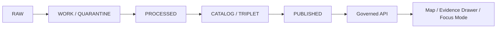
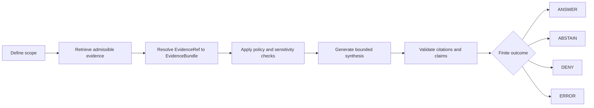

<!-- [KFM_META_BLOCK_V2]
doc_id: TODO: assign kfm://doc/<uuid>
title: Kansas Frontier Matrix
type: standard
version: v1
status: draft
owners: TODO: verify owner
created: 2026-04-26
updated: 2026-04-26
policy_label: TODO: verify policy label
related: [TODO: verify related paths]
tags: [kfm, readme, governance, evidence, maps, temporal]
notes: [Draft root README generated from corpus-only evidence; verify repository paths, owners, workflows, routes, package manager, license, and release state before commit.]
[/KFM_META_BLOCK_V2] -->

# Kansas Frontier Matrix

<p align="center">
  <strong>Evidence-first • map-first • time-aware • governed spatial knowledge and publication.</strong>
</p>

<p align="center">
  
  
  
  
  
  
</p>

<p align="center">
  <a href="#what-kfm-is">What KFM is</a> ·
  <a href="#repo-fit">Repo fit</a> ·
  <a href="#truth-path">Truth path</a> ·
  <a href="#map-and-ai-boundaries">Map & AI boundaries</a> ·
  <a href="#validation">Validation</a> ·
  <a href="#rollback-and-correction">Rollback</a>
</p>

> [!IMPORTANT]
> This README is evidence-bounded. Do not treat proposed paths, object families, validation commands, workflows, badges, API routes, UI components, or runtime behavior as current implementation until verified from current repository evidence.

| Field | Value |
|---|---|
| Status | `draft` |
| Owners | `TODO: verify owner` |
| Evidence mode | `CORPUS_ONLY` / `NEEDS VERIFICATION` for current repo behavior |
| Policy label | `TODO: verify policy label` |
| Repo fit | Proposed root landing file: `README.md`; upstream/downstream links `TODO: verify` |
| Public posture | Cite-or-abstain; fail closed on unresolved rights, sensitivity, source terms, or release state |
| Implementation depth | `UNKNOWN` until a mounted checkout, tests, workflows, runtime logs, or proof objects are inspected |

## What KFM is

Kansas Frontier Matrix, or KFM, is a governed spatial evidence and publication system. Its durable public unit of value is the **inspectable claim**: a public or semi-public statement that can be reconstructed to admissible evidence, spatial scope, temporal scope, source role, policy posture, review state, release state, and correction lineage.

KFM is designed so maps, summaries, dashboards, tiles, graph projections, story exports, AI answers, and rendered scenes remain downstream carriers of evidence. They are useful surfaces, not sovereign truth.

| KFM does | KFM does not |
|---|---|
| Builds traceable spatial claims from governed evidence. | Treat map polish as evidence. |
| Keeps time, source role, review state, policy posture, and correction lineage visible. | Publish uncited or weakly supported claims as authoritative. |
| Uses maps as primary navigation and inspection surfaces. | Let renderers, tiles, scenes, search indexes, or vector stores replace canonical truth. |
| Supports review, rollback, redaction, and correction workflows. | Expose RAW, WORK, QUARANTINE, or unpublished candidate data to public clients. |
| Allows bounded AI synthesis over admissible evidence. | Allow direct public model traffic or model output as proof. |

## Repo fit

This file is intended to serve as the repository landing page after maintainers verify the real checkout conventions.

| Area | Current README posture |
|---|---|
| Root file | `README.md` — proposed root orientation |
| Source registry | `TODO: verify source registry path` |
| Schemas/contracts | `TODO: verify schema and contract authority` |
| Policy | `TODO: verify policy path and enforcement engine` |
| Tests/fixtures | `TODO: verify test runner, fixture homes, and CI workflow names` |
| UI shell | `TODO: verify app path, MapLibre integration, Evidence Drawer, and Focus Mode implementation` |
| Release/proofs | `TODO: verify proof pack, release manifest, catalog, receipt, correction, and rollback paths` |

> [!NOTE]
> If this repository already contains a stronger root README or documented README convention, preserve stable anchors and merge this content as a patch rather than replacing verified material wholesale.

## Accepted inputs

KFM input classes should be admitted only through source-aware, policy-aware intake.

| Input class | Required posture |
|---|---|
| Authoritative or official source records | Verify source role, rights, temporal coverage, spatial support, update cadence, and release terms. |
| Archival, historical, field, or documentary evidence | Preserve provenance, interpretation status, uncertainty, and review trail. |
| Sensor, observation, remote-sensing, or model-derived data | Keep observations, detections, models, regulatory layers, and derived products distinct. |
| Human or steward-submitted contributions | Route through intake, review, rights, sensitivity, and correction controls. |
| AI-assisted summaries or classifications | Treat as interpretive outputs requiring evidence, citation validation, and policy checks. |

## Exclusions and fail-closed areas

KFM should quarantine, deny, redact, generalize, delay, or stage access when evidence or policy is unresolved.

| Exclusion / restricted class | Default handling |
|---|---|
| Unverified source terms, licenses, rights, or redistribution permissions | `ABSTAIN` or quarantine until resolved. |
| Exact locations for archaeology, sacred sites, burials, rare species, sensitive habitat, critical infrastructure, or private landowner exposure | Deny public exact exposure by default; require review and documented transforms. |
| Living-person, DNA, genomic, or private genealogy material | Restrict by default; separate assertions from canonical records. |
| Assessor, tax, or parcel data used as title truth | Do not publish as title truth without appropriate source role and evidence. |
| Direct model-runtime output, raw vector-search hits, or generated summaries | Never treat as proof. |
| RAW, WORK, QUARANTINE, or unpublished candidate stores | Not available to public clients or ordinary UI surfaces. |

## Truth path

KFM’s default lifecycle is intentionally conservative. Promotion is a governed state transition, not a file move.


```mermaid
flowchart LR
  RAW[RAW] --> WORK[WORK / QUARANTINE]
  WORK --> PROCESSED[PROCESSED]
  PROCESSED --> CATALOG[CATALOG / TRIPLET]
  CATALOG --> PUBLISHED[PUBLISHED]
  PUBLISHED --> API[Governed API]
  API --> UI[Map / Evidence Drawer / Focus Mode]
```

Core rule: public-facing surfaces should resolve evidence and policy posture before making consequential claims.

## Inspectable claim contract

A consequential KFM claim should be reconstructable to the following support surface.

| Required support | Purpose |
|---|---|
| EvidenceRef → EvidenceBundle | Shows what evidence supports the claim. |
| Spatial scope | Defines where the claim applies and with what geometric support. |
| Temporal scope | Defines valid time, observed time, source time, or release time as applicable. |
| Source role | Prevents confusing authority, context, observation, model, and interpretation. |
| PolicyDecision | Shows rights, sensitivity, access, and publication posture. |
| Review state | Separates draft, reviewed, released, corrected, withdrawn, or superseded claims. |
| Release state | Connects the claim to a governed publication event. |
| Correction lineage | Makes corrections, withdrawals, and rollback targets inspectable. |

## Map and AI boundaries

Maps and AI are important KFM surfaces, but both must remain subordinate to governed evidence.

### Map-first shell

KFM should use a map-first, time-aware shell where geography, time, evidence, policy, and review state remain visible at the point of use. MapLibre, Cesium, PMTiles, COGs, 3D Tiles, vector tiles, dashboards, and rendered scenes are delivery or rendering surfaces. They should not silently replace canonical truth.

### Governed AI / Focus Mode

AI should operate as a bounded interpretive layer behind governed APIs.


```mermaid
flowchart LR
  SCOPE[Define scope] --> EVIDENCE[Retrieve admissible evidence]
  EVIDENCE --> BUNDLE[Resolve EvidenceRef to EvidenceBundle]
  BUNDLE --> POLICY[Apply policy and sensitivity checks]
  POLICY --> SYNTH[Generate bounded synthesis]
  SYNTH --> CITE[Validate citations and claims]
  CITE --> OUTCOME{Finite outcome}
  OUTCOME --> ANSWER[ANSWER]
  OUTCOME --> ABSTAIN[ABSTAIN]
  OUTCOME --> DENY[DENY]
  OUTCOME --> ERROR[ERROR]
```

`ANSWER`, `ABSTAIN`, `DENY`, and `ERROR` are first-class outcomes. Prefer `ABSTAIN` over unsupported confidence, `DENY` over unsafe exposure, and `ERROR` over hiding technical failure.

## Proposed object families

These object families are preferred targets unless current repository evidence proves another accepted model.

| Family | Role |
|---|---|
| `SourceDescriptor` / `SourceIntakeRecord` | Source identity, source role, rights, terms, update cadence, and intake state. |
| `EvidenceRef` / `EvidenceBundle` | Claim support and reconstructable evidence payloads. |
| `DecisionEnvelope` / `PolicyDecision` | Structured policy, review, release, and outcome decisions. |
| `RuntimeResponseEnvelope` / `CitationValidationReport` | Governed AI and Focus Mode response boundaries. |
| `RunReceipt` / `AIReceipt` / `RedactionReceipt` / `ValidationReport` | Process memory, validation, redaction, and runtime traceability. |
| `PromotionDecision` / `ReleaseManifest` / `ProofPack` / `CatalogMatrix` | Publication readiness, release artifacts, and catalog closure. |
| `CorrectionNotice` / `RollbackPlan` | Correction, withdrawal, supersession, and recovery path. |
| `GeoManifest` | Spatial artifact integrity, layer metadata, and release linkage. |

> [!WARNING]
> The table above is `PROPOSED` unless matching schemas, contracts, validators, fixtures, or emitted artifacts are confirmed in the mounted repository.

## Domain lanes

KFM should grow through proof-bearing domain lanes rather than broad unreviewed expansion. Hydrology is a strong first proof lane because it can exercise source descriptors, temporal observations, regulated context, map delivery, Evidence Drawer payloads, policy checks, and release/rollback behavior without starting from the most sensitive domains.

| Lane family | Special caution |
|---|---|
| Hydrology, soils, geology, atmosphere, hazards | Keep observations, models, regulatory layers, operational context, and public summaries distinct. |
| Habitat, fauna, flora, agriculture | Fail closed on sensitive locations and source-rights uncertainty. |
| Roads, rail, settlements, infrastructure | Separate geometry, legal/administrative status, operator, restriction, and historical interpretation. |
| Archaeology and cultural heritage | Deny public exact site locations by default; require steward/cultural review and public-safe transforms. |
| People, genealogy, DNA, land ownership | Restrict living-person and DNA/genomic material; do not treat assessor/tax records as title truth. |
| UI, MapLibre, 3D, governed AI | Treat as trust-visible interpretation and delivery surfaces, not root truth. |

## Validation

Validation commands must be verified against the actual repo. Until then, only repository-discovery commands are safe to show as generic orientation.

```bash
# Local checkout orientation — verify in the real repository before relying on results.
git status --short
git branch --show-current
find . -maxdepth 2 -type f | sort | sed -n '1,120p'
```

Expected validation surfaces after implementation:

- [ ] Source descriptors validate source role, rights, terms, cadence, and access posture.
- [ ] EvidenceRefs resolve to EvidenceBundles.
- [ ] Citation validation fails unsupported claims.
- [ ] Policy gates deny unresolved rights, unclear sensitivity, missing review state, or unsafe exact geometry.
- [ ] Promotion requires catalog/proof/release closure.
- [ ] Public clients cannot access RAW, WORK, QUARANTINE, canonical/internal stores, or direct model output.
- [ ] Correction and rollback references are recorded for published or semi-public releases.

## Definition of Done

A build-facing KFM change is not done until the relevant evidence, policy, validation, and rollback surfaces are visible.

- [ ] Evidence basis is stated.
- [ ] Repository paths, owners, badges, links, routes, workflows, and package commands are verified or marked `TODO` / `NEEDS VERIFICATION`.
- [ ] Source role and source terms are recorded.
- [ ] EvidenceBundle resolution is tested for consequential claims.
- [ ] PolicyDecision is emitted or recorded where risk matters.
- [ ] Sensitive geometry is redacted, generalized, withheld, or denied by default.
- [ ] Release state and review state are explicit.
- [ ] Correction and rollback path are documented.
- [ ] Derived layers, tiles, search indexes, summaries, graphs, and scenes remain rebuildable derivatives.
- [ ] Documentation changed when behavior changed, or the reason it did not is recorded.

## Rollback and correction

KFM publication should be reversible and correctable.

| Event | Required response |
|---|---|
| Bad source intake | Quarantine or withdraw source; record reason and affected artifacts. |
| Broken validation | Block promotion; preserve ValidationReport and failed inputs. |
| Unsafe public exposure | Remove or restrict release; emit CorrectionNotice and RedactionReceipt where relevant. |
| Incorrect claim | Correct or withdraw claim; preserve lineage from prior claim to replacement. |
| Failed release | Roll back to prior ReleaseManifest or documented RollbackPlan. |
| Policy drift | Re-evaluate affected public surfaces and release manifests. |

## Current verification gaps

- [ ] Confirm actual root README conventions and stable anchors.
- [ ] Verify repository path map, package manager, test runner, and CI workflow names.
- [ ] Verify schema vs. contract authority and ADR conventions.
- [ ] Verify policy engine, validator registry, source registry, and fixture homes.
- [ ] Verify MapLibre shell, Evidence Drawer, Focus Mode, and governed API implementation paths.
- [ ] Verify release, proof, receipt, catalog, correction, and rollback artifact homes.
- [ ] Verify license, owners, CODEOWNERS, branch protection, deployment posture, and public access boundaries.

## License

`TODO: verify repository license before adding a license badge or license summary.`
