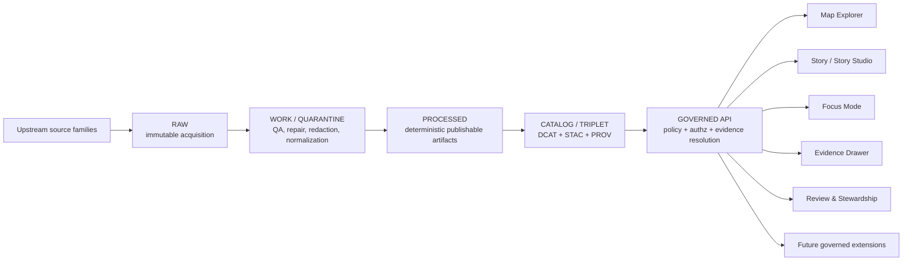

# Kansas Frontier Matrix

Evidence-first, map-first, time-aware infrastructure for exploring Kansas through place, time, narrative, inspectable evidence, and policy-safe decision support.

> Status: draft  
> Owners: verify [`.github/CODEOWNERS`](./.github/CODEOWNERS)  
>       
> Quick jump: [Purpose](#purpose) · [Truth labels](#truth-labels) · [Repo fit](#repo-fit) · [Read next](#read-next) · [Verified repo snapshot](#verified-repo-snapshot) · [Non-negotiables](#non-negotiables) · [First governed release slice](#first-governed-release-slice) · [Reference architecture](#reference-architecture) · [Canonical model](#canonical-model-and-three-clocks) · [Governed API](#governed-api-and-focus-mode) · [Product surfaces](#product-surfaces) · [Accepted inputs](#accepted-inputs) · [Exclusions](#exclusions) · [Quickstart](#quickstart) · [Definition of done](#definition-of-done--promotion-checklist)

## Purpose

Kansas Frontier Matrix (KFM) is a governed, evidence-linked, map-first, time-aware platform for Kansas history, environment, infrastructure, and public knowledge.

It is not merely a map portal, a loose story editor, a dashboard bundle, or a free-form AI surface. Its public promise is that a user can move from a visible claim to inspectable evidence without crossing an invisible boundary into unverified convenience.

The stable KFM operating promise is:

- **Map Explorer** answers where.
- **Time controls** answer when.
- **Story / Story Studio** answer why the evidence matters.
- **Evidence Drawer** answers what a visible claim rests on.
- **Focus Mode** provides natural-language access without bypassing evidence or policy.

This README is the repo-root operating contract for contributors. It is intentionally conservative. It upgrades claims to **CONFIRMED** only when they are supported by governing KFM doctrine or by repository evidence that is currently visible.

## Truth labels

| Label | Meaning here |
|---|---|
| **CONFIRMED** | Directly established by governing KFM documentation or by currently visible repository evidence. |
| **PROPOSED** | A buildable implementation choice or product extension that fits KFM doctrine, but is not yet proven as live behavior. |
| **UNKNOWN** | Not established by the supplied evidence and requiring branch, environment, or deployment verification before operational treatment. |

> [!IMPORTANT]
> Visible repository structure is **CONFIRMED**. Runtime completeness is not. Treat deeper behavior as **UNKNOWN** until it is verified by code, workflows, manifests, tests, or logs on the branch you are actually reviewing.

This README prefers auditable incompleteness over plausible fiction.

## Repo fit

**Path:** `/README.md`  
**Repo role:** root orientation document for the monorepo.

**Upstream**

- source systems and acquisition connectors
- normalization and transformation jobs
- catalog builders and provenance emitters
- policy decisions and review workflows
- domain briefs, documentation standards, and source registries

**Downstream**

- Map Explorer
- Evidence Drawer
- Story / Story Studio
- Focus Mode
- Review & Stewardship surfaces
- educational workspaces
- science / modeling surfaces
- future city / infrastructure extensions

KFM should be read as a **truth path → catalog → governed API → user surface** system. The repo root is where contributors should learn the platform contract before descending into service-specific code or directory docs.

## Read next

Start here, then move outward:

- [`./CONTRIBUTING.md`](./CONTRIBUTING.md) — contributor expectations and workflow
- [`./SECURITY.md`](./SECURITY.md) — security reporting and security posture
- [`./.github/README.md`](./.github/README.md) — GitHub-side control plane, workflow, and template discipline
- [`./docs/`](./docs/) — long-form architecture, governance, standards, and runbooks
- [`./contracts/`](./contracts/) and [`./schemas/`](./schemas/) — machine-readable contract and validation surfaces
- [`./policy/`](./policy/) — policy logic and rule packs

## Verified repo snapshot

The repo now exposes enough live surface to replace the old “working root layout assumption” with a verified top-level snapshot.

| Item | Status | Notes |
|---|---|---|
| Repository visibility | **CONFIRMED** | Public GitHub repository on `main`. |
| Top-level directories | **CONFIRMED** | `.github/`, `apps/`, `configs/`, `contracts/`, `data/`, `docs/`, `examples/`, `infra/`, `migrations/`, `packages/`, `policy/`, `schemas/`, `scripts/`, `tests/`, `tools/`. |
| Top-level files | **CONFIRMED** | `CHANGELOG.md`, `CODE_OF_CONDUCT.md`, `CONTRIBUTING.md`, `LICENSE`, `README.md`, `SECURITY.md`. |
| GitHub-side control plane docs | **CONFIRMED** | `/.github/README.md` exists and already models a high-discipline directory documentation pattern. |
| Exact merge-blocking rules, required checks, and environment approvals | **UNKNOWN** | Verify in GitHub rulesets, branch protection, and actual workflow outcomes. |
| Exact implementation depth of apps, policies, contracts, and services | **UNKNOWN** | Visible top-level structure does not prove runtime completeness. |

<details>
<summary><strong>Confirmed top-level tree</strong></summary>

```text
Kansas-Frontier-Matrix/
├── .github/
├── apps/
├── configs/
├── contracts/
├── data/
├── docs/
├── examples/
├── infra/
├── migrations/
├── packages/
├── policy/
├── schemas/
├── scripts/
├── tests/
├── tools/
├── CHANGELOG.md
├── CODE_OF_CONDUCT.md
├── CONTRIBUTING.md
├── LICENSE
├── README.md
└── SECURITY.md
```

</details>

### What this means

The project has already crossed the threshold from a purely speculative monorepo shape into a real, structured repository. That changes the job of the root README: it should be a **verified operating index for the real tree** while still refusing to overclaim implementation depth.

[Back to top](#kansas-frontier-matrix)

## What KFM is

KFM is:

- a governed geospatial knowledge platform
- a provenance-preserving data and publication system
- a catalog and evidence-resolution substrate
- a family of coordinated user surfaces over one policy and evidence boundary
- a foundation for Kansas historical, environmental, civic, and scientific work
- a possible educational and public-learning surface when evidence, privacy, accessibility, and fact/speculation controls remain intact
- a possible city/infrastructure decision surface when restricted layers remain policy-gated, auditable, and provenance-bearing

KFM is **not**:

- a free-form chatbot
- a generic upload-and-forget portal
- a direct browser-to-database GIS stack
- a publication path that can skip rights, validation, or provenance checks
- a repo where docs drift away from behavior without consequence
- a classroom sandbox that treats speculative outputs as settled fact
- a city dashboard that bypasses catalog, graph, policy, or evidence contracts

## Non-negotiables

The following are architectural laws, not stylistic preferences.

| Invariant | Status | What it means in practice | What must never happen |
|---|---|---|---|
| Truth path | **CONFIRMED** | Data moves through `RAW → WORK/QUARANTINE → PROCESSED → CATALOG/TRIPLET → PUBLISHED`. | Ad hoc publication from notebooks, temp files, or analyst-only transforms. |
| Trust membrane | **CONFIRMED** | Public and role-limited access crosses governed APIs, policy, and evidence resolution. | UI or external clients bypassing policy via direct store access. |
| Cite-or-abstain | **CONFIRMED** | Visible claims, stories, and Focus answers resolve to evidence or abstain. | Plausible uncited output presented as fact. |
| Default-deny / fail-closed | **CONFIRMED** | Unclear rights, unresolved sensitivity, or broken evidence blocks release. | “Best effort” publication under ambiguity. |
| Deterministic identity | **CONFIRMED** | Comparable inputs and the same spec produce the same logical identity and `spec_hash`. | Unstable IDs or ambiguous lineage. |
| Evidence as interface | **CONFIRMED** | `EvidenceRef` resolves to an inspectable `EvidenceBundle`. | Provenance trapped in prose, PDFs, or disconnected notes. |
| Separation of duty | **CONFIRMED** | Submission and policy-significant approval cross review boundaries. | Self-approval of sensitive or policy-significant releases. |
| Docs as production surface | **CONFIRMED** | Behavior changes update docs, templates, tests, and runbooks together. | Silent drift between behavior and procedure. |
| Fact / speculation boundary | **PROPOSED** | Educational and modeled outputs visibly distinguish baseline fact from projection. | Scenario output presented as observed reality or confirmed history. |
| Governance-by-default for civic / infrastructure data | **PROPOSED** | Sensitive city / infrastructure layers stay policy-gated, auditable, and redactable. | Fine-grained restricted layers exposed publicly for UX convenience. |
| Minimal learner-data posture | **PROPOSED** | Classroom workflows minimize collection, prefer pseudonymous identifiers, and avoid unnecessary permanent profiles. | Educational convenience driving silent telemetry growth or unnecessary identity capture. |

## First governed release slice

The first release should remain intentionally narrow. KFM’s strongest launch path is still **one fully governed vertical slice**, not a wide but weak feature spread.

1. One time-aware boundary system.
2. One promoted dataset family through the full truth path.
3. One map layer that opens directly into evidence.
4. One public story that resolves every claim.
5. One Focus Mode path that either cites correctly or abstains.

### Why this matters

A narrow release slice proves that the project actually honors its promotion gates, evidence contracts, and policy boundary. Many half-governed surfaces only prove that governance was bypassed.

## Reference architecture

KFM should be reasoned about as a layered system whose boundaries matter more than any one tool choice.


```mermaid
flowchart LR
    A[Upstream source families] --> B[RAW<br/>immutable acquisition]
    B --> C[WORK / QUARANTINE<br/>QA, repair, redaction, normalization]
    C --> D[PROCESSED<br/>deterministic publishable artifacts]
    D --> E[CATALOG / TRIPLET<br/>DCAT + STAC + PROV]
    E --> F[GOVERNED API<br/>policy + authz + evidence resolution]
    F --> G[Map Explorer]
    F --> H[Story / Story Studio]
    F --> I[Focus Mode]
    F --> J[Evidence Drawer]
    F --> K[Review & Stewardship]
    F --> L[Future governed extensions]
```

| Layer | Representative components | Canonical or rebuildable | Operational note |
|---|---|---|---|
| Source edge | Federal/state repositories, archives, APIs, downloads, sensor feeds, research distributions | Outside KFM | Capture request metadata, terms snapshots, and checksums at ingress. |
| RAW | Immutable payloads, manifests, fetch metadata, digests, rights snapshots | Canonical | Highest replay value; never directly user-visible. |
| WORK / QUARANTINE | Repairs, validations, transformations, redaction staging, failed-ingest holding area | Controlled intermediate | Normal workflow zone, not a shame folder. |
| PROCESSED | GeoParquet, COG, PMTiles, JSON, reports, derivative tables, run outputs | Canonical for versioned outputs | Only meaningful when cataloged and receipted. |
| CATALOG | DCAT dataset/service records, STAC collections/items/assets, PROV lineage records | Canonical metadata boundary | Discovery, lineage, and inspectability surface. |
| Operational stores | PostgreSQL/PostGIS, optional graph store, search index, vector index, tile caches | Mostly rebuildable | Operationally critical, but not sovereign over truth. |
| Governed API | REST/GraphQL endpoints, policy engine, evidence resolver, Focus runtime, run queue | Policy-mediated boundary | The trust membrane in executable form. |
| Surfaces | Map Explorer, Story, Focus, Review, future governed extensions | Downstream | Must never access stores directly. |

### Canonical vs rebuildable rule

- **Canonical:** RAW, PROCESSED, catalog triplet members, run receipts, signed manifests, policy decisions.
- **Rebuildable unless explicitly promoted:** search indexes, vector indexes, tiles, caches, denormalized summary tables, graph projections.

## Truth path and promotion contract

Promotion is not a file copy. It is a governed state transition.

| Gate | Minimum proof | Fail-closed behavior |
|---|---|---|
| Identity and versioning | `dataset_id`, `dataset_version`, `spec_hash`, stable logical key, deterministic naming | Fail if identity is missing, duplicated, or unstable. |
| Schema and QA | Schema validity, CRS sanity, geometry/topology checks, interval sanity, row-count invariants | Route to `QUARANTINE` on blocking validation failure. |
| Rights and license | License basis, source terms snapshot, attribution obligations, redistribution rules | Fail if rights are unclear or incompatible. |
| Sensitivity and redaction | Policy label, redaction parameters, generalization method, obligations | Fail or route to restricted tier if unresolved. |
| Catalog triplet | Valid DCAT, STAC, and PROV with working links and expected fields | Fail if any triplet member is missing or inconsistent. |
| Receipt and attestation | Run receipt, checksums, and lane-required signing / attestation state | Fail when the active lane requires proofs and they are absent. |
| Publish and ledger | Promotion receipt, audit append, registry/object write, API registration update | Fail if the final publish leaves the surface inconsistent. |

## Canonical model and three clocks

The canonical KFM fact is a long-form observation, not a pre-baked dashboard cell. Each publishable observation should bind metric, spatial unit, time interval, value, uncertainty, dataset version, evidence reference, rights posture, and policy label.

| Concept | Why it exists |
|---|---|
| `dataset` | Stable logical source family or curated product line |
| `dataset_version` | Immutable promoted release tied to a spec hash and receipts |
| `observation` | Canonical fact binding metric, place, time, value, uncertainty, provenance, rights, and policy |
| `EvidenceRef` | Stable citation token suitable for UI, API, stories, and Focus |
| `EvidenceBundle` | Resolved package of metadata, rights, provenance, freshness, checksums, and policy outcome |
| `Story Node` / `Story Card` | Versioned narrative unit linking text, maps, charts, and governed evidence |
| `run_receipt` | Machine-readable record of what ran, what it consumed, and what it emitted |
| `audit_ref` | Stable identifier linking a user-visible action or answer to the path that produced it |

### Three clocks

| Clock | Meaning |
|---|---|
| Valid time | When a fact was true in the modeled world |
| Event time | When an event occurred or a source document was published |
| Transaction time | When KFM ingested, corrected, or rematerialized the record |

## Governed API and Focus Mode

The governed API is the trust membrane in executable form. It does not merely expose data; it enforces authentication, authorization, publication state, policy evaluation, and evidence resolution. If a dataset version or evidence view is not promotable, the API must not expose it.

Focus Mode is a governed synthesis layer, not a truth source. It parses the question, retrieves admissible evidence, resolves `EvidenceBundles`, assembles a bounded answer context, verifies citations, and either returns a cited answer with an `audit_ref` or abstains.

### Illustrative governed route families

The following route families are **illustrative**. Treat them as a contract sketch until they are verified against code and live branch state.

```text
GET  /api/v1/catalog/datasets
GET  /api/v1/stac/collections
POST /api/v1/stac/search

GET  /api/v1/observations
GET  /api/v1/story-nodes
GET  /api/v1/evidence/{evidence_ref}
GET  /api/v1/audit/{audit_ref}

POST /api/v1/policy/check
POST /api/v1/focus/query
POST /api/v1/runs
POST /api/v1/briefs/export
```

## Product surfaces

### Core surfaces

| Surface | Status | Purpose |
|---|---|---|
| Map Explorer | **CONFIRMED** | Layered geographic exploration with time controls and evidence access. |
| Evidence Drawer | **CONFIRMED** | Open metadata, rights, provenance, freshness, and versioning behind a visible claim. |
| Story / Story Studio | **CONFIRMED concept** / **PROPOSED authoring shape** | Narrative publishing and evidence-linked story authoring under review state. |
| Focus Mode | **CONFIRMED** | Governed Q&A with citation verification, audit refs, and abstention behavior. |
| Review & Stewardship | **CONFIRMED concept** | Promotion approval, rights review, QA, corrections, and policy-aware publication controls. |

### Future governed extensions

| Surface | Status | Purpose |
|---|---|---|
| Educational Surface | **PROPOSED** | Evidence-first learning workspaces for Explore / Explain / Speculate / Teach. |
| Science & Physics Surface | **PROPOSED** | Governed scientific layers, model runs, and provenance-bearing analytical outputs. |
| Cities & Infrastructure | **PROPOSED** | City dossiers, infrastructure browsing, readiness/risk drilldowns, and exportable briefs inside the same evidence plane. |

### Trust-visible UX rules

- Every inspectable value should open into evidence.
- Rights, freshness, and uncertainty must be visible at the point of use.
- Derived and modeled outputs must be labeled as such.
- Restricted layers must deny cleanly and audibly rather than leaking through convenience paths.

## Kansas domain foundation

KFM should treat Kansas not simply as background geography but as the substantive domain the platform exists to explain.

| Domain | Why it matters | Immediate implication for KFM |
|---|---|---|
| Migration and settlement history | Kansas is defined by repeated waves of movement and displacement. | County-year demographic layers, movement corridors, and narrative evidence need first-class support. |
| Geology | Geology shapes soils, groundwater, hazards, and land use. | Stratigraphy, surficial history, and geologic layers should inform long-run place explanation. |
| Hydrology | Rivers, reservoirs, aquifers, drought, and floods are statewide organizing forces. | Hydrology is a first-wave data lane for maps, alerts, and modeling. |
| Hazards | Kansas faces drought, flood, severe weather, wildfire, and related cascading risks. | Hazard overlays and time-aware risk context belong in early public surfaces. |
| Agriculture | Farming and agricultural economies shape land, labor, migration, and infrastructure. | Agricultural indicators and land-cover / agri layers deserve first-class support. |
| Wildlife and habitat | Species movement and habitat sensitivity create rights and sensitivity constraints. | Some ecological data must remain generalized, redacted, or restricted. |

## Accepted inputs

This repo should accept only inputs that can participate in the evidence model and truth path.

| Input type | Examples | Typical landing zone | Notes |
|---|---|---|---|
| Historical tabular data | census extracts, land patents, registries, tabular archives | `RAW/` then `WORK/` | Preserve source metadata and acquisition receipts. |
| Vector geodata | county boundaries, PLSS, routes, parcels, sites, event polygons | `RAW/` then `PROCESSED/` | Standardize schemas and IDs before promotion. |
| Raster geodata | DEMs, land cover, climate grids, scenes, hazard rasters | `RAW/` then `PROCESSED/` | Prefer cloud-friendly formats and immutable checksums. |
| Narrative evidence | archival documents, newspapers, oral histories, story drafts | `RAW/` then evidence extraction flow | Rights and sensitivity review may be required. |
| Metadata and lineage records | DCAT, STAC, PROV, manifests, sidecars | `CATALOG/` | Cross-link IDs so `EvidenceRefs` resolve. |
| Derived outputs | analytics, statistics, anomaly layers, model products | `PROCESSED/` or governed runtime artifacts | Must remain linked to inputs, method, and receipts. |
| Validation artifacts | QA reports, accuracy tables, review notes, fixtures | `WORK/`, `docs/`, `tests/` | Governance artifacts are not disposable byproducts. |
| Policy-safe civic / infrastructure assets | city boundaries, service areas, readiness tiers, critical-facility summaries, briefs | governed data lanes | Public vs restricted exposure must be policy-resolved. |
| Policy-safe educational assets | lesson modules, rubrics, guided tours, scenario presets, Story Card templates | `docs/`, `contracts/`, governed app assets | Must not bypass provenance, role controls, or fact/speculation boundaries. |
| Scenario receipts | parameter sets, seeds, model versions, compare summaries | governed runtime artifacts | Must remain clearly separate from observational facts. |

## Exclusions

The following do **not** belong in KFM’s governed publication path.

| Exclusion | Why it stays out | Where it goes instead |
|---|---|---|
| Secrets, tokens, credentials | Never commit secrets to the repo. | Secret managers / environment configuration |
| Direct client-to-store access patterns | Breaks the trust membrane and bypasses policy. | Governed API routes and policy-aware services |
| Publishable artifacts without checksums, receipts, and catalogs | Cannot be audited or reproduced. | Keep in `WORK/QUARANTINE` until complete |
| Uncited story claims or unverified Focus answers | Violates cite-or-abstain. | Draft or failed run outputs; not publishable |
| Ambiguous-rights or unresolved restricted public data | Rights and sensitivity ambiguity must fail closed. | Quarantine, redacted derivative, or metadata-only record |
| Fine-grained restricted civic / infrastructure layers | Can expose sensitive assets or imply unauthorized precision. | Restricted lanes, generalized geometry, or aggregate views |
| Documentation that implies live implementation without verification | Breaks trust through overclaiming. | Mark `UNKNOWN`, add verification steps, then update |
| Classroom outputs that blur fact and speculation | Damages trust and teaches the wrong model. | Keep as draft instructional material until labeled and evidenced correctly |
| Permanent student dossiers or unnecessary learner telemetry | Violates minimal-data posture and increases governance burden. | Prefer pseudonymous, export-first, or local-first handling |

## Current repo posture

This section is intentionally conservative.

### CONFIRMED now

- The repository is public and currently exposes the verified top-level tree shown above.
- `/.github/README.md` already demonstrates a stronger directory-doc pattern than the old root README: explicit purpose, repo fit, accepted inputs, exclusions, current snapshot, quickstart, operating rules, definition of done, and FAQ.
- The repo has a visible GitHub Actions surface and an established commit history.

### UNKNOWN still

- Which checks actually block merges.
- Which services are fully implemented versus merely designed.
- Which contracts, policies, and validations are enforced today.
- The extent of live science / modeling, educational, or city / infrastructure implementation.
- Whether current deployment environments actually enforce the intended promotion contract.

## Quickstart

The safest root-level quickstart remains **verification-first**.

```bash
# clone if needed
git clone https://github.com/bartytime4life/Kansas-Frontier-Matrix.git
cd Kansas-Frontier-Matrix

# identify the exact revision
git rev-parse HEAD

# inspect the top-level and near-top-level shape
find . -maxdepth 2 -type d | sort

# inspect workflow inventory, if present
find .github -maxdepth 3 -type f | sort
ls -la .github/workflows 2>/dev/null || true

# look for core governance primitives
grep -RIn "spec_hash\|EvidenceRef\|EvidenceBundle\|policy_label\|opa\|rego" . || true

# inspect likely contract and policy surfaces
find contracts policy schemas tests -maxdepth 3 -type f 2>/dev/null | sort

# inspect likely catalog / truth-path artifacts
grep -RIn "DCAT\|STAC\|PROV\|run_receipt\|promotion receipt\|quarantine" . || true

# inspect science / scenario / educational traces, if any
grep -RIn "scenario_run\|lesson_module\|student_artifact\|Story Studio\|Focus Mode" . || true

# inspect civic / infrastructure traces, if any
grep -RIn "city dossier\|frontier_tier\|service_area\|infrastructure_asset\|readiness" . || true
```

### Illustrative local-first contributor flow

Only use the following if the repo actually implements analogous scripts or targets:

```bash
make bootstrap
make validate-schemas
make test
make dev-up
make sample-ingest SOURCE=example_fixture
make catalog-validate
```

### Verify before claiming the branch is real

1. What exists on this branch?
2. Which checks actually block merges?
3. Which contracts, policies, and validations are enforced today?
4. Is there one real end-to-end governed slice from acquisition to evidence-bearing publication?
5. Are science, educational, or civic / infrastructure surfaces represented as code, contracts, or only design posture?
6. Are fact/speculation, privacy, accessibility, and restricted-layer constraints represented in runtime or only in docs?

## Documentation and contributor discipline

Docs are part of the governed surface, not commentary on the side.

Every top-level directory README should, at minimum:

- explain its purpose
- state where it fits in the repo
- define accepted inputs
- define exclusions

Behavior changes should update:

- contracts
- docs
- tests
- runbooks
- fixtures or examples when relevant

### Directory README rule

Treat `/.github/README.md` as the current style benchmark for directory-level documentation. Other top-level directories should meet or exceed that standard.

## Definition of done / promotion checklist

Use this as the minimum repo-root gate list for serious work.

- Spec hashing is stable across environments for comparable inputs.
- Controlled vocabularies and schemas validate in CI.
- DCAT / STAC / PROV links resolve and broken links block merges.
- Policy tests default-deny and cover known restricted scenarios.
- `EvidenceRefs` resolve to policy-safe `EvidenceBundles` end to end.
- Map Explorer shows evidence, version, and rights information from the UI.
- Story publication requires review state and resolvable citations.
- Focus Mode either cites correctly with receipts or abstains.
- Rights and sensitivity labels are present for publishable data.
- Observational, derived, and speculative outputs are clearly separated.
- Cities & Infrastructure outputs, if present, expose tier rationale, freshness, and provenance.
- Restricted civic / infrastructure layers, if present, are auditable, role-aware, and deny cleanly.
- Scenario outputs, if present, are labeled speculative, reproducible, and assumption-bearing.
- Accessibility and privacy requirements are defined for any public-learning or classroom-facing surface.
- Runbooks and docs are updated alongside behavior changes.

## Highest-impact next steps

1. Keep the root README as a **verified operating index**, not a speculative design essay.
2. Keep deep source-library and annex material in `docs/`, not in the repo root.
3. Use the first governed slice as the organizing principle for backlog and demos.
4. Bring `apps/`, `contracts/`, `data/`, `docs/`, `infra/`, `packages/`, `policy/`, `schemas/`, `tests/`, and `tools/` up to the same explicit directory-README standard already visible in `/.github/README.md`.
5. Make verification state machine-readable with versioned manifests for required checks, docs coverage, and promotion-gate evidence.

## FAQ

### Why is KFM stricter than a normal map portal?

Because KFM is intended to be a trust system, not just a presentation layer. It treats provenance, policy, and evidence as runtime requirements.

### Why keep saying `UNKNOWN` when the repo is already large?

Because repo size and workflow activity do not prove runtime governance. Visible code can confirm structure; it cannot by itself confirm policy enforcement, release proofs, or production behavior.

### Why is the first release intentionally narrow?

Because one fully governed slice proves the architecture honestly. Many half-governed slices only prove that governance was bypassed.

### Why support science / modeling and education at all?

Because both surfaces can widen KFM’s value without weakening the evidence contract — but only if they preserve provenance, labeling, privacy, accessibility, and policy gates.

[Back to top](#kansas-frontier-matrix)

[contributing]: ./CONTRIBUTING.md
[security]: ./SECURITY.md
[github-readme]: ./.github/README.md
