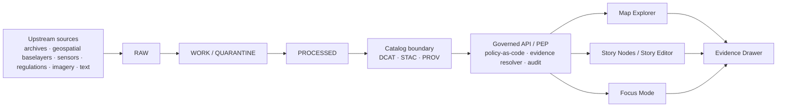
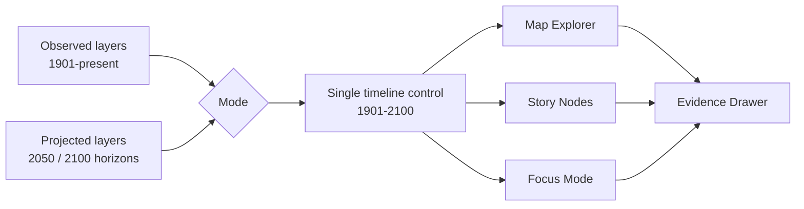

<!-- [KFM_META_BLOCK_V2]
doc_id: kfm://doc/df7426a0-4f44-4c3f-9d91-1d418f4fa4c5
title: Kansas Frontier Matrix (KFM) README
type: standard
version: v1
status: draft
owners: KFM Platform Engineering; exact ownership path verify in .github/CODEOWNERS on target branch
created: 2026-03-06
updated: 2026-03-06
policy_label: public
related: [docs/, contracts/, data/, apps/, packages/, policy/, infra/, .github/]
tags: [kfm, readme, governance, evidence, maps, temporal-windows]
notes: [Refined to preserve 1854-1900 as the adopted default v1 release window while adding a design-ready 1901-2100 alternative temporal window as a declared, metadata-bound extension. Deeper branch-specific implementation facts remain UNKNOWN until verified.]
[/KFM_META_BLOCK_V2] -->

<a id="top"></a>

# Kansas Frontier Matrix (KFM)
Evidence-first, map-first, time-aware infrastructure for turning governed Kansas data into traceable maps, timelines, Story Nodes, and cite-or-abstain Focus Mode answers.

<div align="center">

[](#impact)
[](#evidence--governance)
[](#evidence--governance)
[](#product-surfaces)
[](#repository-guide)

</div>

## Quick jump

- [Impact](#impact)
- [Scope](#scope)
- [Repo fit](#repo-fit)
- [Accepted inputs](#accepted-inputs)
- [Exclusions](#exclusions)
- [Repository guide](#repository-guide)
- [Quickstart](#quickstart)
- [Architecture](#architecture)
- [Temporal windows](#temporal-windows)
- [Evidence & governance](#evidence--governance)
- [Product surfaces](#product-surfaces)
- [Minimum honest MVP](#minimum-honest-mvp)
- [Definition of done](#definition-of-done)
- [FAQ](#faq)
- [Appendix](#appendix)

## Impact

| Field | Value |
|---|---|
| Status | draft |
| Owners | KFM Platform Engineering; verify exact ownership in `.github/CODEOWNERS` |
| Policy label | public |
| Repo path | `/README.md` |
| Quick links | [Scope](#scope) · [Repo fit](#repo-fit) · [Repository guide](#repository-guide) · [Quickstart](#quickstart) · [Architecture](#architecture) · [Temporal windows](#temporal-windows) · [Definition of done](#definition-of-done) · [FAQ](#faq) |

## Scope

| Status | Statement |
|---|---|
| CONFIRMED | KFM is a governed measurement, narrative, and publication platform whose public promise is traceable evidence. |
| CONFIRMED | KFM is map-first and time-aware, but it is not just a map viewer; it is also an evidence system, a narrative system, and a policy-enforced publication system. |
| CONFIRMED | Public-facing AI in KFM is a downstream consumer of governed evidence, not an upstream source of truth. |
| CONFIRMED | The adopted default operational window for v1 is **1854-1900**. |
| CONFIRMED | Alternative temporal scopes are allowed only when they are explicitly declared in dataset and story metadata. |
| PROPOSED | A design-ready alternative temporal window spans **1901-2100** as a single timeline with an explicit **Observed vs Scenario** mode split. |
| PROPOSED | For the 1901-2100 window, **county** is the safest default spatial unit, with regional aggregation for readability. |
| UNKNOWN | Exact branch-specific implementation coverage below the verified top-level tree and `.github/` control plane must be checked before being documented here as current fact. |

## Repo fit

- **Path:** `/README.md`
- **Upstream:** project governance and architecture manuals, issue and planning workflows, and repo metadata.
- **Downstream:** directory READMEs and implementation docs under `.github/`, `apps/`, `contracts/`, `data/`, `docs/`, `packages/`, `policy/`, `infra/`, `tests/`, and `tools/`.
- **Use this file for:** orientation, trust posture, declared scope, repo navigation, and the smallest honest delivery target.
- **Do not use this file for:** authoritative API schemas, dataset manifests, policy bundles, temporal scenario matrices, runbooks, or generated receipts.

## Accepted inputs

This file may contain:

- high-level purpose and project posture
- repo-wide navigation and directory responsibilities
- declared release scope and temporal-window posture
- MVP framing and release gates
- contributor routing and verification steps
- links to deeper docs and contracts

## Exclusions

This file must not become a dumping ground for:

- dataset catalogs or source registries that belong under `data/`
- OpenAPI or JSON schema definitions that belong under `contracts/` or `schemas/`
- policy code or fixtures that belong under `policy/`
- long-form runbooks, ADRs, or temporal-window implementation specs that belong under `docs/`
- generated evidence bundles, receipts, or build artifacts
- secrets, tokens, or credentials

## Repository guide

### Current top-level tree

**CONFIRMED on the public `main` branch at time of drafting:**

```text
repo/
├── .github/
├── apps/
├── configs/
├── contracts/
├── data/
├── docs/
├── examples/
├── infra/
├── migrations/
├── packages/
├── policy/
├── schemas/
├── scripts/
├── tests/
├── tools/
├── CHANGELOG.md
├── CODE_OF_CONDUCT.md
├── CONTRIBUTING.md
├── LICENSE
├── README.md
└── SECURITY.md
```

### Current `.github/` control plane snapshot

**CONFIRMED on the public `main` branch at time of drafting:**

```text
.github/
├── DISCUSSION_TEMPLATE/
├── ISSUE_TEMPLATE/
├── PULL_REQUEST_TEMPLATE/
├── actions/
├── workflows/
├── CODEOWNERS
├── CODE_OF_CONDUCT.md
├── PULL_REQUEST_TEMPLATE.md
├── README.md
├── SUPPORT.md
├── dependabot.yml
├── labeler.yml
└── required-checks.v1.json
```

### Directory responsibilities

| Path | Status | Intended contents |
|---|---|---|
| `.github/` | CONFIRMED path / PARTIALLY CONFIRMED contents | GitHub-side automation, templates, ownership routing, required-check manifests, and workflow entrypoints. Exact branch protections and rulesets still require out-of-repo verification. |
| `apps/` | CONFIRMED path / PROPOSED role | Runnable services such as governed API, UI, workers, and CLI entrypoints. |
| `configs/` | CONFIRMED path / PROPOSED role | Configuration templates for environments, pipelines, deployments, and UI settings. |
| `contracts/` | CONFIRMED path / PROPOSED role | Public contracts: OpenAPI definitions, schemas, vocabularies, and interface-level guarantees. |
| `data/` | CONFIRMED path / CONFIRMED role | Zone-oriented data surfaces for raw, work, processed, catalog, registry, and receipt material. |
| `docs/` | CONFIRMED path / PROPOSED role | Governance docs, architecture notes, ADRs, runbooks, temporal-window specs, and user guidance. |
| `examples/` | CONFIRMED path / PROPOSED role | Sample datasets, stories, policies, and tutorial fixtures. |
| `infra/` | CONFIRMED path / PROPOSED role | Deployment infrastructure such as Terraform, Kubernetes, GitOps, and monitoring. |
| `migrations/` | CONFIRMED path / PROPOSED role | Schema and storage migration scripts. |
| `packages/` | CONFIRMED path / PROPOSED role | Shared internal libraries such as ingest, catalog, evidence, tiles, and policy helpers. |
| `policy/` | CONFIRMED path / CONFIRMED role | Policy-as-code and fixtures used to enforce the trust membrane. |
| `schemas/` | CONFIRMED path / UNKNOWN role | Exists on the public repo, but its exact relationship to `contracts/` and other schema surfaces should be verified before this README narrows it further. |
| `scripts/` | CONFIRMED path / PROPOSED role | Build, release, promotion, and maintenance scripts. |
| `tests/` | CONFIRMED path / PROPOSED role | Unit, integration, e2e, policy, and data-pipeline verification suites. |
| `tools/` | CONFIRMED path / PROPOSED role | Validators, linters, hashers, catalog helpers, and other support utilities. |

### What belongs where

| Topic | Best home | Why |
|---|---|---|
| GitHub-side contribution control | `.github/` | Keeps ownership, templates, required checks, and workflow wiring separate from runtime code. |
| API shape | `contracts/` | Keeps public contracts stable and inspectable. |
| Runtime services | `apps/` | Keeps deployment entrypoints separate from shared logic. |
| Shared domain logic | `packages/` | Prevents UI or API code from owning business rules directly. |
| Dataset lifecycle and catalogs | `data/` | Preserves the truth path and promotion model. |
| Governance docs and runbooks | `docs/` | Keeps long-form operational knowledge versioned with the repo. |
| Temporal window specs and scenario matrices | `docs/` first, then `contracts/` as they harden | Keeps the root README concise while allowing temporal semantics to mature into versioned contracts. |
| Policy enforcement | `policy/` | Makes authorization and redaction explicit, testable, and reviewable. |
| Deployment definitions | `infra/` | Isolates runtime infrastructure from application code. |

[Back to top](#top)

## Quickstart

### Verification-first quickstart

Use this when you first clone the repo or when you need to re-ground documentation in reality.

```bash
# verification-first commands
# adapt as needed for your local environment

git clone https://github.com/bartytime4life/Kansas-Frontier-Matrix.git
cd Kansas-Frontier-Matrix

git rev-parse HEAD
find . -maxdepth 2 -type d | sort
find .github -maxdepth 3 -type f | sort
find contracts -maxdepth 3 -type f | sort || true
find policy -maxdepth 3 -type f | sort || true
find data -maxdepth 3 -type d | sort || true
find tests -maxdepth 3 -type f | sort || true
grep -RIn "^name:" .github/workflows || true
grep -RIn "^[[:space:]]*permissions:" .github/workflows || true
grep -RIn "concurrency:|timeout-minutes:|workflow_call:" .github/workflows || true
grep -RIn "scenario\|temporal\|timeline" docs contracts apps packages tests || true
```

### Four questions to answer before calling anything “done”

1. Which checks are actually merge-blocking on the target branch?
2. Which dataset can complete the full truth path end to end?
3. Which evidence path resolves in Map Explorer, Story publication, and Focus Mode on the target branch?
4. If projected layers exist, where is **Observed vs Scenario** separation enforced?

### Minimal contributor path

```bash
# illustrative only; adapt after branch verification
make bootstrap
make validate-schemas
make test
make dev-up
make sample-ingest SOURCE=example_fixture
make catalog-validate
```

## Architecture


```mermaid
flowchart LR
    A[Upstream sources<br/>archives · geospatial baselayers · sensors · regulations · imagery · text] --> B[RAW]
    B --> C[WORK / QUARANTINE]
    C --> D[PROCESSED]
    D --> E[Catalog boundary<br/>DCAT · STAC · PROV]
    E --> F[Governed API / PEP<br/>policy-as-code · evidence resolver · audit]
    F --> G[Map Explorer]
    F --> H[Story Nodes / Story Editor]
    F --> I[Focus Mode]
    G --> J[Evidence Drawer]
    H --> J
    I --> J
```

### System posture

| Status | Claim |
|---|---|
| CONFIRMED | KFM begins from upstream sources, preserves durable raw capture, transforms through work/quarantine and processed states, and only then exposes runtime surfaces through a catalog boundary built from DCAT, STAC, and PROV. |
| CONFIRMED | The public must never talk directly to raw or operational stores; the trust membrane is architecture, not a suggestion. |
| CONFIRMED | Map Explorer answers **where**, timeline controls answer **when**, Story surfaces explain **why**, and the Evidence Drawer answers **what a claim rests on**. |
| CONFIRMED | Focus Mode must synthesize from admissible evidence and either return a cited answer with an audit reference or abstain. |
| PROPOSED | A practical baseline stack is object storage for RAW/PROCESSED/receipts, PostgreSQL + PostGIS for canonical facts and joins, a governed API layer such as FastAPI, a TypeScript/React web client with MapLibre, and orchestration with Airflow or Prefect. |
| PROPOSED | The cleanest implementation split remains domain → use cases → interfaces → infrastructure, with policy and provenance enforced at the governed API boundary. |

## Temporal windows

### Temporal scope model

| Window family | Status | Meaning |
|---|---|---|
| **1854-1900** | CONFIRMED / adopted | Default v1 release window. Treat this as the bounded first delivery target unless an alternative scope is explicitly declared. |
| **Declared alternative scopes** | CONFIRMED rule / PROPOSED packaging | Later or broader windows are allowed only when they are named in dataset and story metadata rather than silently implied. |
| **1901-2100** | PROPOSED design-ready extension | Single time-navigation frame spanning observed 1901+ layers and projected 2050/2100 scenario layers. |
| **2050 / 2100 scenario horizons** | PROPOSED | Long-horizon layers are never presented as observed fact; they remain scenario-bound and uncertainty-marked. |

### 1901-2100 branching model


```mermaid
flowchart LR
    A[Observed layers<br/>1901-present] --> B{Mode}
    C[Projected layers<br/>2050 / 2100 horizons] --> B
    B --> D[Single timeline control<br/>1901-2100]
    D --> E[Map Explorer]
    D --> F[Story Nodes]
    D --> G[Focus Mode]
    E --> H[Evidence Drawer]
    F --> H
    G --> H
```

### Temporal window rules

| Rule | Status | Meaning |
|---|---|---|
| Observed vs Scenario separation | PROPOSED | Projected values never appear inside the observed channel. Future-facing views require explicit mode and scenario selection. |
| County default, regional presentation | PROPOSED | Compute or normalize at county when feasible, then aggregate to planning regions or sentinel places when readability matters. |
| Multi-resolution time bins | PROPOSED | Use decadal bins for 1901-1950 where sources are sparse, annual bins post-1950 where series support them, and finer grains only when source cadence justifies it. |
| Event anchors | PROPOSED | Policy changes, disasters, infrastructure shifts, and conservation regime changes are first-class timeline nodes. |
| Projected-layer disclosure | PROPOSED | Projected layers must carry scenario identity, driver assumptions, calibration basis, and uncertainty. |
| Uncertainty display | PROPOSED | Use non-color-only cues such as hatching, transparency, labels, or bands; clearly mark where observation ends and projection begins. |
| Time-native packaging | PROPOSED | Each layer should declare temporal extent and ship with catalog/provenance metadata, not as timeless blobs. |

[Back to top](#top)

## Evidence & governance

| Invariant | Status | What it means |
|---|---|---|
| Truth path | CONFIRMED | Data moves through `RAW → WORK/QUARANTINE → PROCESSED → CATALOG/TRIPLET → PUBLISHED`. |
| Trust membrane | CONFIRMED | Every public or role-limited request crosses a governed API plus policy boundary. |
| Cite-or-abstain | CONFIRMED | Stories, map values, and Focus answers resolve to evidence or abstain. |
| Default-deny | CONFIRMED | Unknown rights, unresolved sensitivity, or broken evidence blocks release. |
| Deterministic identity | CONFIRMED | Comparable inputs and the same spec produce the same identity and spec hash. |
| Evidence as interface | CONFIRMED | `EvidenceRef` must resolve to a policy-safe `EvidenceBundle`. |
| Docs as production surface | CONFIRMED | Behavior changes update docs, templates, tests, and runbooks together. |
| Observed/projected separation | PROPOSED | When future-facing windows are enabled, projected layers remain visibly distinct from observed evidence channels. |

### Promotion gates

| Zone | Status | Purpose | Required promotion artifacts |
|---|---|---|---|
| Raw | CONFIRMED | Immutable source capture | checksums, raw manifest, source license |
| Work | CONFIRMED | Repeatable transformation and QA | PROV activity, intermediate QA reports |
| Processed | CONFIRMED | Query-ready published surface | machine-checkable catalogs, validations, promotion receipts |

### Governed API expectations

> **IMPORTANT:** Concepts below are source-backed, but exact target-branch route names and payloads still require direct verification before they are documented as live implementation fact.

| Contract family | Status | Minimum expectation |
|---|---|---|
| Evidence resolution | CONFIRMED concept / PROPOSED example path | Example contract: `POST /api/v1/evidence/resolve` returns a policy-filtered `EvidenceBundle` or fails closed. |
| Dataset and catalog discovery | CONFIRMED concept / PROPOSED example paths | Example contracts: `GET /api/v1/datasets` and `GET /api/v1/stac/*` expose discoverable assets, time extents, and policy-filtered catalogs. |
| Facts / features / layers | CONFIRMED concept / PROPOSED example paths | Example contracts: time-aware feature or layer queries return promoted data only, not operational bypasses. |
| Story nodes | CONFIRMED concept / PROPOSED example paths | Example contracts: `GET/POST /api/v1/story` with versioning, citation checks, and review state. |
| Focus ask | CONFIRMED concept / PROPOSED example path | Example contract: `POST /api/v1/focus/ask` returns a cited answer or abstention plus `audit_ref`. |
| Temporal query / scenario selection | PROPOSED contract | Declared future-facing windows should query by time range and mode; projected queries must require explicit scenario context and preserve uncertainty. |

[Back to top](#top)

## Product surfaces

| Surface | Status | What it must do |
|---|---|---|
| Map Explorer | CONFIRMED concept / PROPOSED packaging | Layer toggles, legends, time filters, feature inspection, evidence launch points, and optional scenario overlays only when explicitly selected. |
| Timeline / time controls | CONFIRMED concept / PROPOSED interaction model | Chronology control, event sequencing, zoomable time navigation, and mode-switch support for declared Observed vs Scenario windows. |
| Evidence Drawer | CONFIRMED concept / PROPOSED packaging | Show source basis, dataset version, rights posture, lineage, checksums, validation status, redactions, and safe previews. |
| Story Editor / Story Nodes | CONFIRMED concept / PROPOSED packaging | Narrative authoring and reading with citations, map embeds, review states, publication gating, and reproducible map state. |
| Focus Mode | CONFIRMED concept / PROPOSED serving stack | Cited-or-abstaining answers with uncertainty framing, evidence links, and `audit_ref`; never collapse projected scenarios into observed fact. |
| Catalog / dataset discovery | PROPOSED but strongly aligned | Browse datasets, versions, temporal extents, policy labels, and lineage before map, story, or Focus use. |
| Review Console | PROPOSED but necessary | Promotion approval, policy assignment, QA inspection, and correction workflow. |
| 3D Story Node | Advanced PROPOSED extension | Temporary 2D→3D narrative shift without creating an uncontrolled second trust surface. |

### Accessibility

| Status | Requirement |
|---|---|
| CONFIRMED | Accessibility is a release gate; keyboard-operable controls and reachable evidence surfaces are part of the product contract. |
| CONFIRMED | Responsive design is mandatory because public users, contributors, stewards, and historians will use different device classes. |
| PROPOSED | Projected-layer uncertainty must not rely on color alone; legends and controls must explain projection state in text. |

## Minimum honest MVP

**CONFIRMED early release boundary:**

- [ ] one time-aware county-boundary system
- [ ] one census or population slice through the full promotion path
- [ ] one map layer that opens into an Evidence Drawer
- [ ] one public story with valid citations
- [ ] one Focus Mode path that either cites correctly or abstains

If the repo cannot do those five things, it is not ready to claim the architecture works.

**Scope discipline:** post-v1 declared extensions - including a 1901-2100 observed/scenario window - should be added only after the floor above is real.

## Suggested build order

| Phase | Status | Primary outcome |
|---|---|---|
| Trust foundation | PROPOSED | Lock schemas, spec-hash rules, receipts, promotion gates, one or two anchor domains, and minimal STAC/DCAT/PROV generation. |
| Discover & view | PROPOSED | Stand up catalog discovery, Map Explorer, layer delivery, and evidence inspection. |
| Publish & explain | PROPOSED | Ship Story publishing, Focus Mode MVP, and the evaluation harness that enforces cite-or-abstain. |
| Declared temporal expansion | PROPOSED | Add the 1901-2100 observed/scenario window only after the baseline trust path and evidence surfaces are stable. |

## Definition of done

Use this as the minimum repo-wide gate for claiming an evidence-native release.

- [ ] A public map value always resolves to a policy-safe `EvidenceBundle`, or the UI explicitly shows insufficient evidence.
- [ ] No public client can query operational stores directly.
- [ ] At least one boundary dataset and one census dataset complete the full truth path into a published API.
- [ ] Promotion fails on missing rights evidence, invalid catalog links, or failing policy tests.
- [ ] Reviewer workflow exists for approval, policy labeling, and quarantine release.
- [ ] Focus Mode returns `answer + citations + audit_ref`, or abstains.
- [ ] Core UX flows pass accessibility review and automated tests.
- [ ] Runbooks exist for source failure, failed promotion, rollback, and backup restore.
- [ ] Any projected layer is visibly marked as projected, scenario-bound, and uncertainty-aware, with no silent mixing into observed channels.

## Task list

- [ ] Verify `CODEOWNERS` and replace placeholder owner language with exact repo truth.
- [ ] Verify live workflow names and required checks from `.github/workflows/` and rulesets.
- [ ] Verify exact route names before documenting API paths as CONFIRMED branch fact.
- [ ] Verify whether `schemas/` complements or overlaps `contracts/`.
- [ ] Verify one end-to-end dataset through the full truth path.
- [ ] Verify one Focus Mode evidence-backed request path.
- [ ] Decide whether the 1901-2100 window belongs in root README scope or a dedicated temporal-window spec under `docs/`.
- [ ] Define how declared alternative windows encode observed vs scenario mode, uncertainty, and calibration basis in versioned docs/contracts.

## FAQ

### Is KFM just a map application?

No. **CONFIRMED:** it is a governed measurement, narrative, evidence, and publication system with map-first and time-aware interaction.

### Does KFM only cover frontier-era Kansas?

No. **CONFIRMED:** the adopted default v1 window is **1854-1900**. **CONFIRMED:** alternative scopes are allowed when explicitly declared in dataset and story metadata. **PROPOSED:** one design-ready extension is a 1901-2100 observed/scenario temporal window.

### Does the 1901-2100 window replace the 1854-1900 v1 window?

No. **CONFIRMED:** the v1 default remains 1854-1900. **PROPOSED:** the 1901-2100 window is an explicit, metadata-bound extension track, not a silent scope replacement.

### How should future layers appear in the UI?

**PROPOSED:** future layers should be clearly marked as projected, tied to an explicit scenario, and shown with uncertainty. They must not be merged into the observed channel as if they were settled historical fact.

### Can Focus Mode answer from its own model knowledge?

No. **CONFIRMED:** Focus Mode is a downstream consumer of governed evidence and must cite or abstain.

### Are the exact API routes and workflow gates in this README guaranteed to match the target branch?

No. **CONFIRMED:** the concepts are stable. **UNKNOWN:** exact branch-specific route names, required checks, rulesets, and environment protections still need direct verification before they should be documented as live implementation fact.

### Are all directory roles in this README verified on the live branch?

No. **CONFIRMED:** the top-level tree and the `.github/` control-plane snapshot are verified on the public `main` branch. **UNKNOWN:** deeper branch-specific contents and some directory responsibilities still need repo inspection before they should be documented as fact.

### Why is the Evidence Drawer treated as a first-class product feature?

Because **CONFIRMED** KFM turns provenance into an inspectable interface rather than a static appendix. If users cannot reach the evidence surface, the trust model exists only on paper.

## <a id="appendix"></a>Appendix

<details>
<summary>Source basis, temporal-window notes, and verification backlog</summary>

### Source basis

This README is grounded in:

- the KFM manuals and compendium for posture, invariants, v1 scope, product surfaces, and release boundaries
- the 1901-2100 temporal-window design report for alternative temporal scope, scenario separation, time-binning, uncertainty rules, and source-family guidance
- the current public GitHub repository tree on `main`, including the current `.github/` control-plane snapshot

### Design-ready 1901-2100 anchor examples

| Anchor | Status | Why it matters |
|---|---|---|
| 1930s drought / duststorms | PROPOSED for this window | Land-management, migration, and farm-economy shock. |
| 1935 soil conservation regime shift | PROPOSED | Governance and practice change tied to conservation response. |
| 1945 water-rights modern-era marker | PROPOSED | Useful legal/governance breakpoint for water allocation framing. |
| 1951 Kansas flood | PROPOSED | Settlement, infrastructure, and floodplain memory anchor. |
| 1954 Brown v. Board of Education | PROPOSED | Civil-rights and governance inflection. |
| 1956 Federal-Aid Highway Act | PROPOSED | Connectivity, logistics, and metro-growth breakpoint. |
| 1984 Minimum Desirable Streamflow trigger regime | PROPOSED | Streamflow restriction and water-governance anchor. |
| 2013-2016 LEMA example | PROPOSED | Measurable managed-decline intervention example. |
| 2022 Kansas Water Plan update | PROPOSED | Contemporary water-policy framing anchor. |
| 2050 / 2100 horizons | PROPOSED | Near- and long-horizon scenario layers with explicit uncertainty. |

### Temporal window source families

| Indicator family | Preferred source family | Suggested spatial unit | Suggested time grain |
|---|---|---|---|
| Demographics | Census QuickFacts + decennial products | county/state | annual recent, decadal historical |
| Farm structure & land use | USDA NASS AgCensus archive + Quick Stats | county | 5-year + selected annual |
| Land cover | USGS NLCD epochs + newer annual references | raster summarized to county | multi-epoch / annual |
| Climate | NOAA NCEI Climate at a Glance | county / climate division | monthly / annual |
| Groundwater | KGS High Plains Aquifer + USGS context | GMD / county | annual |
| Energy | EIA Kansas electricity profile | state | annual |
| Employment / economy | BLS EAG + BEA GDP by State | state / metro / county optional | monthly / quarterly / annual |
| Policy & governance | Kansas DWR + statute hosts + KCC | statewide + basins | event-based + effective date |
| Historical archives | Kansas Memory + related Kansas historical collections | county / region / event | event-based / document-based |

### Unknowns to verify before tightening this README

- exact branch-specific contents of `apps/`, `packages/`, `contracts/`, `data/`, and `tests/`
- workflow names and which checks under `.github/workflows/` are actually merge-blocking
- whether `schemas/` duplicates, complements, or supersedes specific `contracts/` schema surfaces on the target branch
- exact API route names already implemented versus still proposed
- whether target-branch contracts already encode time-mode, scenario selection, or uncertainty for projected layers
- which datasets already complete the full truth path end to end
- whether the current repo README strategy is root-level, directory-level, or both on the target branch

### Suggested next verification commands

```bash
find . -maxdepth 2 -type d | sort
find .github -maxdepth 3 -type f | sort
find apps -maxdepth 3 -type f | sort | head -n 100
find packages -maxdepth 3 -type f | sort | head -n 100
find data -maxdepth 4 | sort | head -n 200
find contracts -maxdepth 4 | sort | head -n 200
find tests -maxdepth 4 | sort | head -n 200
grep -RIn "scenario\|temporal\|timeline" docs contracts apps packages tests || true
```

</details>

[Back to top](#top)
