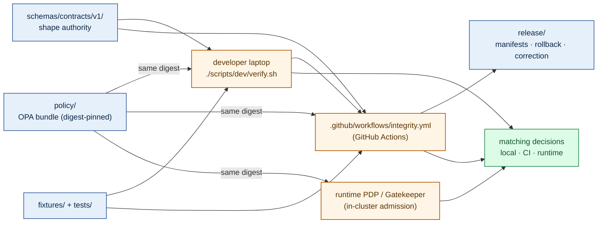
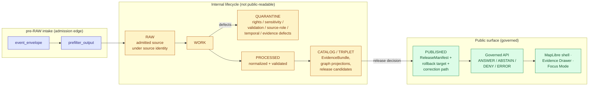

<!-- [KFM_META_BLOCK_V2]
doc_id: kfm://doc/root-readme
title: Kansas Frontier Matrix — Root README
type: standard
version: v1.2
status: draft
owners: <repo steward · docs steward · subsystem owners — placeholder, confirm via CODEOWNERS>
created: 2026-05-11
updated: 2026-07-08
policy_label: public
related:
  - docs/doctrine/directory-rules.md
  - docs/doctrine/ai-build-operating-contract.md
  - docs/doctrine/lifecycle-law.md
  - docs/doctrine/trust-membrane.md
  - docs/doctrine/truth-posture.md
  - docs/doctrine/authority-ladder.md
  - docs/registers/AUTHORITY_LADDER.md
  - docs/registers/DRIFT_REGISTER.md
  - docs/registers/VERIFICATION_BACKLOG.md
  - .github/README.md
  - tools/README.md
  - tools/validators/README.md
  - tools/watchers/README.md
  - tools/watchers/plants_watch/README.md
  - policy/README.md
  - release/README.md
tags: [kfm, root-readme, doctrine, governance, evidence-first, map-first, time-aware]
notes:
  - "Doctrine claims throughout this file are CONFIRMED by attached project corpus (Directory Rules, KFM Encyclopedia, Domains Atlas v1.1, Unified Implementation Manual, Whole-UI + Governed-AI Expansion, Master MapLibre, Pass-10 / Pass-23 / Pass-32 Idea Index, AI Build Operating Contract)."
  - "Implementation maturity is mixed: selected README surfaces were verified through the GitHub app in the 2026-07-08 update; executable behavior, CI, runtime, deployment, routes, DTOs, emitted receipts, branch protection, and end-to-end enforcement remain NEEDS VERIFICATION unless separately checked."
  - "This v1.2 update makes the root README repo-aware by reflecting confirmed README surfaces for README.md, tools/README.md, tools/validators/README.md, tools/watchers/README.md, and tools/watchers/plants_watch/README.md."
  - "MetaBlock v2 fields follow atlas card KFM-P22-PROG-0002; presentation follows KFM-P7-PROG-0008 (META / BADGES / DESCRIPTION / FILES / ACCEPTANCE)."
[/KFM_META_BLOCK_V2] -->

<p align="center">
  
</p>

# Kansas Frontier Matrix

> A governed, evidence-first, map-first, time-aware spatial knowledge system for Kansas and the surrounding frontier.

[](docs/doctrine/)
[](docs/doctrine/lifecycle-law.md)
[](docs/doctrine/truth-posture.md)
[](docs/architecture/governed-api.md)
[](docs/doctrine/promotion-gates.md)
[](#governance-enforcement-at-a-glance)
[](#core-invariants)
[](#status-and-maturity)
[](LICENSE)
[](#last-updated)

> [!NOTE]
> **Status & posture.** KFM doctrine, invariants, and governance contracts are **CONFIRMED** in attached project sources. This 2026-07-08 update also verifies selected repository README surfaces through the GitHub app: the root README plus `tools/`, `tools/validators/`, `tools/watchers/`, and `tools/watchers/plants_watch/`. **Executable behavior, CI, runtime, deployment, routes, DTOs, emitted receipts, branch protection, and end-to-end enforcement remain NEEDS VERIFICATION** unless separately checked. Badge targets shown as `TODO` are placeholders awaiting first-pass verification.

| Field | Value |
|---|---|
| **Status** | doctrine CONFIRMED · selected README surfaces CONFIRMED · implementation behavior NEEDS VERIFICATION |
| **Owners** | TODO — Repo steward · Docs steward · Subsystem owners (per `CODEOWNERS`) |
| **Last reviewed** | 2026-07-08 |
| **Authoritative placement rules** | [`docs/doctrine/directory-rules.md`](docs/doctrine/directory-rules.md) |
| **Authoritative AI-build contract** | [`docs/doctrine/ai-build-operating-contract.md`](docs/doctrine/ai-build-operating-contract.md) (`CONTRACT_VERSION = "3.0.0"`) |
| **Lifecycle invariant** | RAW → WORK / QUARANTINE → PROCESSED → CATALOG / TRIPLET → PUBLISHED |
| **Truth posture** | Cite-or-abstain. EvidenceRef must resolve to EvidenceBundle before consequential claims. |
| **Public path** | Standard clients consume **governed APIs and released artifacts only.** No public access to RAW / WORK / QUARANTINE / candidate / internal stores / model runtimes. |
| **Promotion** | A governed state transition, **not** a file move. Gates A–G (Pass-10 C5-01) fail-closed by default. |
| **Current repo evidence** | Root and tools README surfaces verified in this update; executable behavior remains bounded. |

---

## Quick jump

- [What KFM is](#what-kfm-is)
- [Why it works this way](#why-it-works-this-way)
- [Core invariants](#core-invariants)
- [Current repo evidence from this update](#current-repo-evidence-from-this-update)
- [Governance enforcement at a glance](#governance-enforcement-at-a-glance)
- [Repository layout](#repository-layout)
- [How a claim travels through KFM](#how-a-claim-travels-through-kfm)
- [Promotion gates A–G](#promotion-gates-ag)
- [Truth labels you'll see in this repo](#truth-labels-youll-see-in-this-repo)
- [Domains](#domains)
- [Public surfaces](#public-surfaces)
- [Getting oriented (no install yet)](#getting-oriented-no-install-yet)
- [Quickstart (when working locally)](#quickstart-when-working-locally)
- [Contributing](#contributing)
- [Status and maturity](#status-and-maturity)
- [FAQ](#faq)
- [Related docs](#related-docs)
- [Appendix: glossary](#appendix-glossary)

---

## What KFM is

The **Kansas Frontier Matrix (KFM)** is a governed spatiotemporal knowledge system whose outputs are designed to be **useful, inspectable, policy-conscious, traceable, correctable, and improvable.** Every consequential surface — a map popup, a public API answer, a Focus Mode response, a catalog entry, a release-supporting claim — is expected to resolve to admissible evidence, to carry visible governance state, and to be reversible if it turns out wrong.

KFM is **not**:

- not a generic GIS portal,
- not a model-of-the-week chatbot,
- not an emergency-alerting authority,
- not a flat data dump dressed up as a map.

KFM **is**:

- a **map-first** explorer whose renderer is a presentation surface, never a truth source;
- a **time-aware** evidence graph that distinguishes valid time, observed time, source/retrieval time, and release time;
- a **governed AI** runtime where generated language is interpretive and subordinate to resolved evidence;
- a **publication discipline** in which release, correction, and rollback are explicit, auditable acts.

CONFIRMED doctrine throughout the attached corpus.

---

## Why it works this way

Three commitments shape every other rule in the system.

1. **Evidence outranks fluent prose.** A claim that cannot resolve `EvidenceRef → EvidenceBundle` abstains — it does not improvise. This applies to API answers, Focus Mode replies, map popups, public layer explanations, catalog entries, and release-supporting claims.
2. **The public path is governed.** Public clients and ordinary UI surfaces consume only governed APIs, released artifacts, catalog records, tile services, EvidenceBundles, release manifests, and safe envelopes. **RAW / WORK / QUARANTINE / candidate / direct internal-store / direct model-runtime access is denied by default.**
3. **Promotion is a state transition, not a file move.** Material moves up the lifecycle only when validation, policy, citation closure, release manifest, review state, correction path, and rollback target are all in place.

> [!IMPORTANT]
> If a map, a tile, a graph index, a generated answer, or a polished report ever appears to be the **source** of truth rather than a **carrier** of resolved evidence, that is a bug in the trust membrane, not a feature.

---

## Core invariants

The system holds these invariants by default. A change that bends one requires an explicit tradeoff and (where Directory Rules §2.4 applies) an ADR.

| # | Invariant | Operational meaning |
|---|---|---|
| 1 | **Lifecycle law** | `RAW → WORK / QUARANTINE → PROCESSED → CATALOG / TRIPLET → PUBLISHED`. Promotion is a **governed state transition**, not a file move. |
| 2 | **Public path governance** | Public surfaces use governed interfaces; canonical/internal stores are not directly readable from the browser. |
| 3 | **Cite-or-abstain** | EvidenceRef must resolve to EvidenceBundle before claims; otherwise the surface returns `ABSTAIN`. |
| 4 | **Policy-aware fail-safe defaults** | Sensitive lanes (rare species, archaeology, infrastructure, living-person, DNA, exact location) **default to DENY** unless rights, sensitivity, validation, and review explicitly allow. |
| 5 | **Deterministic identity** | Object identity is stable across time and representations; spec hashes are RFC 8785 JCS + SHA-256 (Pass-10 C1-02); mistaken identity is treated as data corruption. |
| 6 | **Governed promotion** | Validation, policy decision, proof or citation closure, release manifest, review state, correction path, rollback target, and receipt trail are all required. Default-deny on absence of evidence (Pass-10 C5-02). |
| 7 | **Auditable governance trail** | Provenance, receipts, reviews, corrections, and rollback targets remain inspectable after the fact. |
| 8 | **AI is interpretive, not sovereign** | Generated text never substitutes for evidence, policy, review state, source authority, or release state. AI-authored artifacts require a `GENERATED_RECEIPT.json` (operating-contract §34). |
| 9 | **Watcher-as-non-publisher** | Watchers, CI workflows, and intake jobs emit candidate decisions, receipts, and intake records — they **never** mutate catalog, release, or `data/published/` directly. |
| 10 | **Policy parity (CI = runtime)** | The same OPA bundle digest gates merges in CI and admissions at runtime (Pass-10 C5-03). Drift between the two is a class of bug, not a configuration choice. |
| 11 | **Separation of duties** | Policy-significant release duties are separated from authoring when materiality justifies it. |

Primary doctrine: [`docs/doctrine/lifecycle-law.md`](docs/doctrine/lifecycle-law.md), [`docs/doctrine/trust-membrane.md`](docs/doctrine/trust-membrane.md), [`docs/doctrine/truth-posture.md`](docs/doctrine/truth-posture.md), [`docs/doctrine/authority-ladder.md`](docs/doctrine/authority-ladder.md), [`docs/doctrine/ai-build-operating-contract.md`](docs/doctrine/ai-build-operating-contract.md). Repo-state claims remain bounded to the files explicitly verified in the current update.

---

## Current repo evidence from this update

This root README is no longer a purely corpus-drafted scaffold. During the 2026-07-08 update, the GitHub app verified and/or updated the following repository surfaces:

| Surface | Current-session status | What it proves | What it does **not** prove |
|---|---|---|---|
| `README.md` | **CONFIRMED README** | The root README exists and has been updated to v1.2. | Runtime maturity, CI wiring, deployed routes, branch protection, receipts, or release behavior. |
| `tools/README.md` | **CONFIRMED README** | The `tools/` root now documents validators, watchers, generators, builders, proof-pack, release, QA, attest, and CI helper boundaries. | Presence or behavior of every named tooling family. |
| `tools/validators/README.md` | **CONFIRMED README** | Validator root exists and defines fail-closed checker posture. | Executable validator scripts, registry ids, fixtures, or CI invocation. |
| `tools/watchers/README.md` | **CONFIRMED README** | Watcher root exists and defines watchers as non-publishing candidate emitters. | Scheduler/network behavior, activation records, generated candidates, or runtime enforcement. |
| `tools/watchers/plants_watch/README.md` | **CONFIRMED README** | The Flora plant-source watcher lane documents PLANTS taxa drift and source-head watcher posture. | Actual watcher implementation, live source access, fixture coverage, or generated `SourceIntakeRecord`s. |

> [!IMPORTANT]
> **README presence is not implementation proof.** The updated docs are governance surfaces. Executable behavior remains **NEEDS VERIFICATION** until checked by files, tests, workflows, logs, receipts, or generated artifacts.

[Back to top](#kansas-frontier-matrix)

---

## Governance enforcement at a glance

> [!TIP]
> KFM doctrine is operationalized by a **minimum viable governance posture** — Pass-10 idea **C14-01** (CONFIRMED). The five files plus one CI workflow plus one local script below let CI, runtime, and a developer's laptop all evaluate the same gates against the same evidence.

| Starter-pack file | Canonical home | What it pins |
|---|---|---|
| `CODEOWNERS` | `.github/CODEOWNERS` *or* repo root | Path-to-reviewer routing for gate **G** (Reviewability). |
| `tool-versions.yaml` | `configs/` or repo root | Pinned toolchain (Pass-10 C13-01); enables reproducible CI signal. |
| `policy-bundle.json` | `policy/` (digest-pinned) | The single OPA bundle digest gating **CI = runtime** parity (C5-03). |
| `sbom.yaml` | `release/` or repo root | Software bill of materials for gate **F** (Provenance & Lineage). |
| `run_receipt.schema.json` | `schemas/contracts/v1/receipts/` | Canonical receipt schema for `RunReceipt` (C1-01) and `GENERATED_RECEIPT` (operating-contract §34). |
| `integrity.yml` *(CI workflow)* | `.github/workflows/integrity.yml` | The workflow that runs `verify.sh` on every push and PR. |
| `verify.sh` *(local script)* | `scripts/dev/` or `tools/` | The same script CI runs — locally reproducible by any contributor. |


```mermaid
flowchart LR
    classDef canon fill:#e6f0fb,stroke:#1f4f8f,color:#0b2545,stroke-width:1.2px;
    classDef hook fill:#fff5e6,stroke:#b25900,color:#5a3500,stroke-width:1.4px;
    classDef result fill:#dcfce7,stroke:#15803d,color:#14532d,stroke-width:1.2px;

    DEV["developer laptop<br/>./scripts/dev/verify.sh"]:::hook
    CI[".github/workflows/integrity.yml<br/>(GitHub Actions)"]:::hook
    RT["runtime PDP / Gatekeeper<br/>(in-cluster admission)"]:::hook

    POL["policy/<br/>OPA bundle (digest-pinned)"]:::canon
    SCH["schemas/contracts/v1/<br/>shape authority"]:::canon
    FIX["fixtures/ + tests/"]:::canon
    REL["release/<br/>manifests · rollback · correction"]:::canon

    POL -- "same digest" --> DEV
    POL -- "same digest" --> CI
    POL -- "same digest" --> RT
    SCH --> DEV
    SCH --> CI
    FIX --> DEV
    FIX --> CI
    CI --> REL
    DEV --> CI

    OUT["matching decisions<br/>local · CI · runtime"]:::result
    DEV --> OUT
    CI --> OUT
    RT --> OUT
```

**Reading the diagram.** The OPA bundle digest is pinned in exactly one place — `policy/` — and is referenced by the developer's `verify.sh`, by `.github/workflows/integrity.yml`, and by the runtime PDP / Gatekeeper in `infra/`. **C5-03** parity holds when all three reference the same digest. Drift in any one is a governance bug, not a configuration choice. *PROPOSED for this repo until mounted-state inspection confirms.*

---

## Repository layout

KFM uses **responsibility roots**, not topic roots. A file's location encodes who owns it, what governance it answers to, and what lifecycle it belongs to. Domains live as **lanes inside responsibility roots**, never as new top-level folders.

```text
Kansas-Frontier-Matrix/
├── README.md                    # this file
├── CHANGELOG.md
├── CONTRIBUTING.md
├── SECURITY.md
├── LICENSE
├── CODEOWNERS                   # may live in .github/CODEOWNERS instead
├── .github/                     # workflows, issue/PR templates, governance hooks
├── docs/                        # human-facing control plane (doctrine, ADRs, architecture, runbooks, brand)
├── control_plane/               # machine-readable governance maps & registers
├── contracts/                   # object-family MEANING (what an object is)
├── schemas/                     # machine-checkable SHAPE (default: schemas/contracts/v1/<…>)
├── policy/                      # admissibility, sensitivity, release policy (allow / deny / restrict / abstain)
├── tests/                       # enforceability proof
├── fixtures/                    # golden / valid / invalid test inputs
├── tools/                       # repo-wide validators, watchers, generators, builders
├── scripts/                     # small operational helpers (incl. dev/verify.sh)
├── apps/                        # deployable applications (governed-api, explorer-web)
├── packages/                    # shared libraries (ui, maplibre, evidence-resolver, …)
├── connectors/                  # source-specific fetchers / admitters
├── pipelines/                   # executable pipeline logic
├── pipeline_specs/              # declarative pipeline configuration
├── data/                        # lifecycle data and emitted proof
│   ├── raw/  work/  quarantine/  processed/  catalog/  triplets/
│   ├── receipts/  proofs/  published/  registry/  rollback/
├── release/                     # release decisions, manifests, rollback cards, correction notices
├── runtime/                     # local runtime adapters / harnesses
├── infra/                       # deployment, host, network, exposure posture
├── configs/                     # non-secret config defaults / templates
├── migrations/                  # database / schema / graph migrations
├── examples/                    # worked, runnable examples
└── artifacts/                   # OPTIONAL compatibility; build / docs / qa scratch only
```

> [!WARNING]
> **Status of this tree:** the **rules** that produce it are CONFIRMED in [`docs/doctrine/directory-rules.md`](docs/doctrine/directory-rules.md). The **presence** of any specific root in the live repo is **PROPOSED until verified** against mounted-repo evidence (see Directory Rules §0 and §5). Domain folders at repo root (e.g., `hydrology/`, `soil/`, `fauna/`) are **anti-patterns** — domains belong as lanes under responsibility roots.

### Where things go (quick map)

| If the file's primary responsibility is… | …it belongs under |
|---|---|
| Explains something to humans | `docs/` |
| Indexes "what governs what" (machine-readable) | `control_plane/` |
| Defines an object's **meaning** | `contracts/` |
| Defines an object's **machine shape** | `schemas/` |
| Decides allow / deny / restrict / abstain | `policy/` |
| Proves a rule is enforceable | `tests/` |
| Golden / valid / invalid sample data for tests | `fixtures/` |
| Repo-wide validator, watcher, generator, builder, checker | `tools/` |
| Deployable application | `apps/` |
| Shared library used by multiple deployables | `packages/` |
| Source-specific fetcher / admitter | `connectors/` |
| Executable pipeline logic | `pipelines/` |
| Declarative pipeline configuration | `pipeline_specs/` |
| Lifecycle data (raw, work, processed, catalog, triplets, published, …) | `data/` |
| Release decision, manifest, rollback card, correction notice | `release/` |
| Local runtime adapter / harness | `runtime/` |
| Deployment, host, network, exposure posture | `infra/` |
| Non-secret config defaults / templates | `configs/` |
| Database / schema / graph migration | `migrations/` |
| Worked, runnable example | `examples/` |

Source: [`docs/doctrine/directory-rules.md`](docs/doctrine/directory-rules.md) §4. PROPOSED for this repo until verified.

---

## How a claim travels through KFM

A simplified picture of the lifecycle and the trust membrane. Heavy detail lives in [`docs/architecture/`](docs/architecture/).


```mermaid
flowchart LR
    subgraph Intake["pre-RAW intake (admission edge)"]
        EV["event_envelope"]
        PF["prefilter_output"]
    end

    subgraph Internal["Internal lifecycle (not public-readable)"]
        RAW["RAW<br/>admitted source<br/>under source identity"]
        WORK["WORK"]
        QUAR["QUARANTINE<br/>rights / sensitivity /<br/>validation / source-role /<br/>temporal / evidence defects"]
        PROC["PROCESSED<br/>normalized + validated"]
        CAT["CATALOG / TRIPLET<br/>EvidenceBundle,<br/>graph projections,<br/>release candidates"]
    end

    subgraph Public["Public surface (governed)"]
        PUB["PUBLISHED<br/>ReleaseManifest +<br/>rollback target +<br/>correction path"]
        API["Governed API<br/>ANSWER / ABSTAIN /<br/>DENY / ERROR"]
        UI["MapLibre shell ·<br/>Evidence Drawer ·<br/>Focus Mode"]
    end

    EV --> PF --> RAW
    RAW --> WORK
    WORK -- defects --> QUAR
    WORK --> PROC
    PROC --> CAT
    CAT -- release decision --> PUB
    PUB --> API --> UI

    classDef internal fill:#fef3c7,stroke:#b45309,color:#78350f
    classDef public fill:#dcfce7,stroke:#15803d,color:#14532d
    classDef intake fill:#e0e7ff,stroke:#4338ca,color:#312e81
    class RAW,WORK,QUAR,PROC,CAT internal
    class PUB,API,UI public
    class EV,PF intake
```

**Reading the diagram.** Public clients only touch the green band on the right. Promotion across each arrow is a **governed transition** that requires the artifacts named in the lifecycle invariant — not a file move. The pre-RAW intake (`event_envelope`, `prefilter_output`, `event_run_receipt`) records attempted intake **before** material is admitted into RAW, so watchers, GitOps emission, and live feeds never blur the boundary between observed input and accepted source.

[Back to top](#kansas-frontier-matrix)

---

## Promotion gates A–G

> [!IMPORTANT]
> The **seven-gate matrix** is **CONFIRMED doctrine** (Pass-10 idea **C5-01**). Branch protection should require check names that match these gates one-for-one; a gate that did not run is a gate that failed — "we didn't check" is not a PASS.

| Gate | Intent | Required evidence (PROPOSED objects) |
|---|---|---|
| **A — Structure & Metadata** | MetaBlock presence, zone correctness, path-role validity | Path/drift scan + MetaBlock-v2 check (KFM-P22-PROG-0002) |
| **B — Schemas & Contracts** | Object conforms to schema + contract vocabulary | `SchemaValidationReport` against `schemas/contracts/v1/` and fixtures |
| **C — Policy Parity** | CI and runtime decide on the same OPA bundle digest | `PolicyDecision` from pinned bundle (C5-03) |
| **D — Security & Sensitivity** | Rights, sensitivity, license allowlist, secret hygiene | SPDX allowlist + sensitivity classifier + `RightsReviewRecord` |
| **E — Data Quality** | DQ profilers, assertions, threshold pass | DQ check outputs with `status: pass` |
| **F — Provenance & Lineage** | RunReceipt, spec_hash, signed bundle, catalog closure | `RunReceipt` + `CatalogMatrixReport` + `CitationValidationReport` |
| **G — Reviewability** | CODEOWNERS + two-key approval + policy approval | GitHub review state + `PromotionDecision` + `ReleaseManifest` + `RollbackCard` |

> [!CAUTION]
> **Default-deny on absence of evidence.** Promotion is denied unless `spec_hash` matches a recomputation, the run receipt is cosign-signed and verifiable, SPDX rights are in the allowlist, at least one attestation bundle is published, and every dataset-quality check has `status: pass` (Pass-10 **C5-02**).

CI surface lives in [`.github/`](.github/); per-domain Definitions of Done specialize the gate evidence per lane.

---

## Truth labels you'll see in this repo

KFM docs make confidence visible. Expect these labels in design notes, ADRs, idea cards, and READMEs:

| Label | Meaning |
|---|---|
| **CONFIRMED** | Verified in this session from attached docs, workspace evidence, tests, logs, or generated artifacts. |
| **INFERRED** | Reasonably derivable from visible evidence but not directly stated. |
| **PROPOSED** | Design, recommendation, file path, placement, or inference not yet verified in implementation. |
| **UNKNOWN** | Not resolvable without more evidence. |
| **NEEDS VERIFICATION** | Checkable, but not yet checked strongly enough to act as fact. |

> [!TIP]
> Memory is not evidence. Recollection, guessed paths, likely behavior, and generic best practice are not facts. If a section says "the repo contains X" without supporting evidence, treat it as PROPOSED until verified.

---

## Domains

KFM is organized as **domain lanes**, each with object families, source families, viewing modes, sensitivity defaults, and per-domain dossiers. Domains live **under responsibility roots**, never as root-level folders.

| Domain | Status (CONFIRMED doctrine / PROPOSED implementation) | Sensitivity default highlights |
|---|---|---|
| Spatial Foundation | doctrine / PROPOSED | T0 base layers; sensitive geometry fails closed |
| Hydrology | doctrine / PROPOSED | T0; first proof-bearing thin-slice candidate |
| Soil | doctrine / PROPOSED | T0 |
| Habitat | doctrine / PROPOSED | T0 mostly; T1 for stewardship zones |
| Fauna | doctrine / PROPOSED | **T4 default** for sensitive occurrences; T1 generalized |
| Flora | dossier / PROPOSED | **T4 default** for rare-plant records |
| Agriculture | dossier / PROPOSED | T0 aggregate · T1 field candidate · private-join DENY |
| Geology / Natural Resources | doctrine / PROPOSED | T0 unit · T2 sensitive detail |
| Atmosphere / Air | doctrine / PROPOSED | T0; source-role anti-collapse is acute |
| Hazards | doctrine / PROPOSED | T0 historical/context. **KFM is never an alert authority.** |
| Roads / Rail / Trade | doctrine / PROPOSED | T0 mostly; T2 / T4 for sensitive condition detail |
| Settlements / Infrastructure | doctrine / PROPOSED | **Critical-asset DENY lane** |
| Archaeology / Cultural Heritage | doctrine / PROPOSED | **T4 default**; sovereignty review path |
| People / Genealogy / DNA / Land | doctrine / PROPOSED | **Living-person, DNA, person-parcel DENY-default** |
| Frontier Matrix | doctrine / PROPOSED | County-year panels, threshold models, crosswalks |
| Planetary / 3D | doctrine / PROPOSED | 3D admission gate; Reality Boundary Note required |

Sensitivity tiers are CONFIRMED doctrine; specific tier assignments per source are PROPOSED until each lane's policy review records them. Per-domain dossiers live under `docs/domains/<domain>/` (PROPOSED).

---

## Public surfaces

What the **public** interacts with — and what they pointedly **do not**.

| Surface | What it is | Finite outcomes | What it **never** does |
|---|---|---|---|
| **MapLibre shell** | 2D presentation surface for released layers | (renders or shows abstain/deny state) | Read RAW / WORK / QUARANTINE / canonical stores / model runtimes |
| **Evidence Drawer** | Governed projection of `EvidenceBundle`, citations, policy/review/release/stale/correction state | `ANSWER / ABSTAIN / DENY / ERROR` | Display unsupported claims |
| **Focus Mode** (governed AI) | Evidence-bounded request/response | `ANSWER / ABSTAIN / DENY / ERROR` | Return uncited language; bypass `AIReceipt`; act as the truth source |
| **Governed API** | The only browser network path for trust payloads | `ANSWER / ABSTAIN / DENY / ERROR` | Expose internal store identifiers; serve unreleased candidates |
| **Story Nodes** | Evidence-backed narrative units linked to features, time, and sources | `ANSWER / ABSTAIN / DENY / ERROR` | Substitute synthesis for citation |
| **Exports / Reports** | Public artifacts carrying rights, sensitivity, and citation receipts | `ALLOWED / DENY / ERROR` | Carry unredacted sensitive content |
| **Correction submit** | Public-facing correction path | `ACCEPTED / DENY / ERROR` | Erase history; bypass review |
| **Review console** | Read-only steward proof/review queue surface | (queue state) | Provide author self-approval on policy-significant releases |

All surfaces are **CONFIRMED doctrine / PROPOSED implementation** in the supplied corpus. Routes, DTOs, and runtime behavior are **UNKNOWN** until repository inspection.

[Back to top](#kansas-frontier-matrix)

---

## Getting oriented (no install yet)

If you're new to KFM and the repo isn't checked out, read in this order. Each link is **PROPOSED** until verified against the mounted repo.

1. **Doctrine first.** [`docs/doctrine/directory-rules.md`](docs/doctrine/directory-rules.md), then [`docs/doctrine/ai-build-operating-contract.md`](docs/doctrine/ai-build-operating-contract.md), then [`docs/doctrine/lifecycle-law.md`](docs/doctrine/lifecycle-law.md), [`docs/doctrine/trust-membrane.md`](docs/doctrine/trust-membrane.md), [`docs/doctrine/truth-posture.md`](docs/doctrine/truth-posture.md), [`docs/doctrine/authority-ladder.md`](docs/doctrine/authority-ladder.md).
2. **Architecture.** [`docs/architecture/system-context.md`](docs/architecture/system-context.md), [`docs/architecture/governed-api.md`](docs/architecture/governed-api.md), [`docs/architecture/map-shell.md`](docs/architecture/map-shell.md), [`docs/architecture/contract-schema-policy-split.md`](docs/architecture/contract-schema-policy-split.md).
3. **Registers.** [`docs/registers/AUTHORITY_LADDER.md`](docs/registers/AUTHORITY_LADDER.md), [`CANONICAL_LINEAGE_EXPLORATORY.md`](docs/registers/CANONICAL_LINEAGE_EXPLORATORY.md), [`DRIFT_REGISTER.md`](docs/registers/DRIFT_REGISTER.md), [`VERIFICATION_BACKLOG.md`](docs/registers/VERIFICATION_BACKLOG.md).
4. **ADRs.** [`docs/adr/`](docs/adr/) — start with `ADR-0001-schema-home.md`.
5. **Governance hooks.** [`.github/README.md`](.github/README.md) — workflows, CODEOWNERS, PR/issue templates, the seven-gate CI map.
6. **Domains.** [`docs/domains/<domain>/`](docs/domains/) — pick the lane you care about.

---

## Quickstart (when working locally)

> [!NOTE]
> **Illustrative — not a verified pipeline.** The package manager, app entry points, and validator commands are PROPOSED until the actual toolchain, scripts, workflows, and package metadata are inspected. Treat this block as a placeholder for the eventual `runbooks/`-backed flow. The `verify.sh` invocation reflects the five-file starter pack (Pass-10 **C14-01**, CONFIRMED doctrine).

```bash
# 1) Clone (PROPOSED URL)
git clone https://github.com/<org>/Kansas-Frontier-Matrix.git
cd Kansas-Frontier-Matrix

# 2) Doctrine pre-flight: read the rules that govern placement and AI-build behavior
cat docs/doctrine/directory-rules.md
cat docs/doctrine/ai-build-operating-contract.md

# 3) Install dependencies (PROPOSED — package manager NEEDS VERIFICATION)
# e.g. one of:  pnpm install   |   npm install   |   yarn install

# 4) Reproduce the CI signal locally — same script CI runs (C14-01 verify.sh)
./scripts/dev/verify.sh
# (validates schemas + fixtures + policy bundle digest + receipt closure)

# 5) Run the governed API locally (PROPOSED path)
# e.g.:        pnpm --filter @kfm/governed-api dev

# 6) Run the explorer web client (PROPOSED path)
# e.g.:        pnpm --filter @kfm/explorer-web dev
```

If your command surface differs from the above, the **mounted repo is the truth source** — update `docs/runbooks/` (and this section) rather than retrofitting reality to the placeholders.

---

## Contributing

KFM treats placement, evidence, and release as governance, not paperwork. Before opening a PR:

- [ ] **Read** [`docs/doctrine/directory-rules.md`](docs/doctrine/directory-rules.md) and [`docs/doctrine/ai-build-operating-contract.md`](docs/doctrine/ai-build-operating-contract.md). Use the Directory Rules §4 Placement Protocol to choose a path.
- [ ] **Cite the rule** in your PR description that justifies any new, moved, or renamed path.
- [ ] **Truth-label** uncertain claims (`CONFIRMED`, `PROPOSED`, `UNKNOWN`, `NEEDS VERIFICATION`) rather than smoothing them away.
- [ ] **No parallel authority.** Do not create a sibling home for schemas, contracts, policy, sources, registries, releases, proofs, or receipts without an ADR (Directory Rules §2.4).
- [ ] **Trust content placement.** Receipts, proofs, manifests, and release decisions live in `data/receipts/`, `data/proofs/`, or `release/` — **never** in `artifacts/`.
- [ ] **Public path discipline.** A new route goes through `apps/governed-api/`, not directly to canonical stores.
- [ ] **README contract.** Affected folders carry a README that meets [Directory Rules §15](docs/doctrine/directory-rules.md).
- [ ] **Tests, fixtures, policy, runbook** updates accompany behavioral change. Docs are part of the working system — but they do **not** substitute for validation.
- [ ] **Rollback path** is named for any release-affecting change.
- [ ] **AI-authored work** carries a `GENERATED_RECEIPT.json` per operating-contract §34, and the PR body follows §27.1.

Full contribution guide: [`CONTRIBUTING.md`](CONTRIBUTING.md) (PROPOSED — verify presence and content).

Security disclosures and exposure-posture concerns: [`SECURITY.md`](SECURITY.md) (PROPOSED — verify presence and content).

---

## Status and maturity

> [!CAUTION]
> **Implementation maturity is bounded by current-session evidence.** The attached corpus is CONFIRMED **doctrine** with PROPOSED implementation patterns. The GitHub app has verified selected README surfaces in this update, but routes, DTOs, branch protections, CI workflows, emitted receipts, deployment posture, executable tooling, and runtime behavior remain **UNKNOWN / NEEDS VERIFICATION** unless separately checked. Do not infer maturity from the polish of this document.

| Area | Doctrine | Implementation evidence (this session) |
|---|---|---|
| Lifecycle law | CONFIRMED | NEEDS VERIFICATION — docs state the invariant; end-to-end pipeline behavior not checked |
| Trust membrane (public clients use governed APIs only) | CONFIRMED | UNKNOWN — route names, branch state, CI proof, and runtime access controls not verified |
| Cite-or-abstain | CONFIRMED | UNKNOWN — runtime/citation-validator state not verified |
| Sensitivity tiers (T0–T4) | CONFIRMED scheme | PROPOSED per-source assignments unless policy files/review records are verified |
| Governed AI finite outcomes (`ANSWER / ABSTAIN / DENY / ERROR`) | CONFIRMED | UNKNOWN — adapter/runtime not verified |
| Seven-gate matrix A–G | CONFIRMED (Pass-10 C5-01) | NEEDS VERIFICATION — branch-protection check names not inspected |
| Policy parity (CI = runtime, same OPA digest) | CONFIRMED (Pass-10 C5-03) | NEEDS VERIFICATION — CI/`infra/` digest match not inspected |
| Five-file starter pack + `integrity.yml` + `verify.sh` | CONFIRMED (Pass-10 C14-01) | NEEDS VERIFICATION — file presence and behavior not fully inspected |
| AI-build operating contract (`CONTRACT_VERSION = "3.0.0"`) | CONFIRMED authored | NEEDS VERIFICATION — adoption checklist §48 not exercised |
| `GENERATED_RECEIPT.json` gate on AI-authored merges | CONFIRMED requirement (§34) | UNKNOWN — CI gate wiring not verified |
| Directory Rules canonical roots | CONFIRMED | SELECTED README SURFACES CONFIRMED; full root inventory still NEEDS VERIFICATION |
| `tools/README.md` | Root tooling doctrine | CONFIRMED README in current update; executable behavior NEEDS VERIFICATION |
| `tools/validators/README.md` | Validator root posture | CONFIRMED README; scripts, registry ids, fixtures, and CI NEEDS VERIFICATION |
| `tools/watchers/README.md` | Watcher root posture | CONFIRMED README; scheduler, source activation, generated candidates, and CI NEEDS VERIFICATION |
| `tools/watchers/plants_watch/README.md` | Flora watcher posture | CONFIRMED README; actual PLANTS watcher implementation NEEDS VERIFICATION |
| ADR discipline | CONFIRMED | UNKNOWN — `docs/adr/` contents not fully verified |
| Domain dossiers | CONFIRMED doctrine per domain | PROPOSED implementation per domain |

The current-session evidence limit applies: doctrine speaks confidently because attached sources support it; implementation claims are bounded until the repo can be inspected.

[Back to top](#kansas-frontier-matrix)

---

## FAQ

<details>
<summary><strong>Why isn't this just a regular GIS portal?</strong></summary>

Because the public surface needs to **earn** every claim, and a generic GIS portal is built around layers, not around evidence, policy, review state, release state, and correction lineage. KFM treats those as first-class objects you can inspect, not as metadata the user is expected to take on faith.
</details>

<details>
<summary><strong>Why isn't the AI just answering questions directly?</strong></summary>

Because fluent generation isn't evidence. Focus Mode answers only what `EvidenceBundle` resolution and policy permit. If the evidence is missing, ambiguous, or restricted, the surface returns `ABSTAIN` or `DENY` — with a reason — rather than improvising. Every governed AI exchange emits an `AIReceipt` that records the provider/model adapter, the evidence references, the citation validation result, and the policy decision, without exposing private chain-of-thought. AI-authored repo changes additionally emit a `GENERATED_RECEIPT.json` per operating-contract §34.
</details>

<details>
<summary><strong>Why does the directory structure look so strict?</strong></summary>

Because **where a file lives encodes who owns it, what governance it answers to, and what lifecycle phase it belongs to**. A repo whose root drifts into topic folders, parallel schema homes, and "convenience" buckets loses its ability to enforce trust at the boundary. KFM keeps the root **boring**, with stable responsibility roots, and pushes domain depth into lanes. Directory Rules §3 and §13 catalog the anti-patterns that this prevents.
</details>

<details>
<summary><strong>What does "PROPOSED" mean in the docs?</strong></summary>

It means the design, path, placement, or recommendation is sound on paper but **not yet verified in implementation**. PROPOSED is not weak — it's honest. The repo's job is to move PROPOSED items to CONFIRMED through actual files, schemas, tests, and workflows, not through documentation polish.
</details>

<details>
<summary><strong>Can KFM be used as a hazard alert or emergency authority?</strong></summary>

**No.** KFM hazard surfaces are historical, regulatory, and contextual. They carry non-emergency disclaimers and policy DENY for life-safety guidance. Use authoritative emergency services for alerts.
</details>

<details>
<summary><strong>Where do living-person, DNA, exact archaeology, or sensitive infrastructure locations live?</strong></summary>

In **deny-by-default** lanes. Public-safe derivatives only appear after rights, sovereignty, sensitivity, validation, review, and release have all been resolved, often via redaction, generalization, or staged access. Unclear cases prefer quarantine, denial, or delay.
</details>

<details>
<summary><strong>What is "policy parity (CI = runtime)" and why does it matter?</strong></summary>

It's the rule that the OPA bundle digest evaluated in CI must be the same digest evaluated by the runtime PDP / Gatekeeper (Pass-10 **C5-03**). Without parity, a check that passes in CI can fail differently in production — or vice versa — and an audit can't answer what the system was actually enforcing yesterday. Parity is the difference between policy theatre and enforced policy.
</details>

<details>
<summary><strong>What does "watcher-as-non-publisher" mean in practice?</strong></summary>

Watchers, CI workflows, and intake jobs may *detect* change, *emit* candidate decisions, *record* receipts, and *trigger* downstream pipelines — but they MUST NOT mutate `data/catalog/`, `data/published/`, or `release/manifests/` directly. Promotion stays a governed transition with human review where materiality requires it. This invariant prevents fluent automation from quietly becoming the publisher.
</details>

---

## Related docs

> [!NOTE]
> Links below resolve once the doctrinal and architecture trees are in place. They are **PROPOSED paths**, consistent with Directory Rules §5–§7. Verify against mounted-repo state before treating as canonical.

- **Doctrine** — [`docs/doctrine/`](docs/doctrine/) (`directory-rules.md` · `ai-build-operating-contract.md` · `lifecycle-law.md` · `trust-membrane.md` · `truth-posture.md` · `authority-ladder.md`)
- **Architecture** — [`docs/architecture/`](docs/architecture/) (`system-context.md` · `governed-api.md` · `map-shell.md` · `contract-schema-policy-split.md`)
- **ADRs** — [`docs/adr/`](docs/adr/) (start with `ADR-0001-schema-home.md`)
- **Registers** — [`docs/registers/`](docs/registers/) (`AUTHORITY_LADDER`, `CANONICAL_LINEAGE_EXPLORATORY`, `DRIFT_REGISTER`, `VERIFICATION_BACKLOG`, `OBJECT_FAMILY_MAP`)
- **Domains** — [`docs/domains/`](docs/domains/) (per-domain dossiers and lane plans)
- **Sources & standards** — [`docs/sources/`](docs/sources/), [`docs/standards/`](docs/standards/)
- **Runbooks** — [`docs/runbooks/`](docs/runbooks/) (`ui_LOCAL_DEV`, `ui_VALIDATION`, `ui_ROLLBACK`, `governed_ai_*`)
- **Governance hooks** — [`.github/README.md`](.github/README.md) (workflows, CODEOWNERS, gate matrix)
- **Tools** — [`tools/README.md`](tools/README.md), [`tools/validators/README.md`](tools/validators/README.md), [`tools/watchers/README.md`](tools/watchers/README.md)
- **Policy** — [`policy/README.md`](policy/README.md) (OPA bundle home; digest-pinned)
- **Release** — [`release/README.md`](release/README.md) (manifests, rollback cards, correction notices)
- **Contributing & security** — [`CONTRIBUTING.md`](CONTRIBUTING.md), [`SECURITY.md`](SECURITY.md), [`CODEOWNERS`](CODEOWNERS)

[Back to top ↑](#kansas-frontier-matrix)

---

## Appendix: glossary

<details>
<summary><strong>Trust & evidence terms</strong></summary>

| Term | Definition |
|---|---|
| **Inspectable claim** | A public/semi-public statement reconstructable to evidence, scope, source role, policy posture, review state, release state, and correction lineage. |
| **EvidenceRef** | Pointer from a claim, feature, answer, layer, or proof item to evidence that must resolve before consequential release. |
| **EvidenceBundle** | Resolved evidence package supporting a claim, including source, scope, provenance, policy, citation, and review context. Outranks maps, tiles, and generated text. |
| **EvidenceDrawerPayload** | Governed UI projection of `EvidenceBundle`, citations, policy/review/release state, stale state, and correction links. |
| **SourceDescriptor** | Machine-readable source identity, source role, rights, cadence, access, steward, sensitivity, and release posture. |
| **PolicyDecision** | Explicit allow / deny / restrict / abstain / error decision tied to user, purpose, release class, evidence, and sensitivity. |
| **DecisionEnvelope / RuntimeResponseEnvelope** | Finite-outcome wrappers used by APIs, runtime surfaces, and UI/AI payloads to avoid ambiguous truth states. |
| **AIReceipt** | Runtime accountability record for bounded AI use; provider/model adapter, evidence refs, citation validation, policy result. Never a substitute for `EvidenceBundle`. |
| **GENERATED_RECEIPT.json** | Build-time accountability record for AI-authored repo changes (operating-contract §34). Required when AI authored or substantively modified files in the diff. |
| **CitationValidationReport** | Pass/fail citation closure object for Focus Mode, Story Nodes, popups, and exports. |
| **RunReceipt / PromotionReceipt** | Build/run receipts for pipeline or tile artifact generation; promotion-gate receipts for state transitions. |
| **ReleaseManifest** | The release-decision artifact (lives under `release/manifests/`). |
| **RollbackCard** | Rollback decision artifact (lives under `release/rollback_cards/`). |
| **CorrectionNotice** | Public notice of a corrected claim, listing invalidated derivatives. |
| **LayerManifest** | Released-layer descriptor; resolved by the layer manifest resolver under `apps/governed-api/`. |
| **MapContextEnvelope** | Bounded context carrying map camera, layer IDs, feature IDs, temporal snapshot, release refs, and selected evidence refs. |
| **Authority root / Compatibility root** | Responsibility-bearing canonical root vs. legacy/mirror/transitional root, per Directory Rules §5 / §8. |
| **Promotion** | Governed state transition between lifecycle phases. **Not a file move.** |
| **Trust membrane** | The boundary that prevents raw / unreviewed / model-generated / internal state from becoming public truth. Operational form: `apps/governed-api/`. |
| **Policy parity** | The CI = runtime invariant — same OPA bundle digest gates merges in CI and admissions at runtime (Pass-10 C5-03). |
| **Watcher-as-non-publisher** | Invariant that watchers, CI workflows, and intake jobs emit candidates and receipts only; never mutate catalog or release directly. |

</details>

<details>
<summary><strong>Finite outcome cheat-sheet</strong></summary>

| Outcome | When | Public effect |
|---|---|---|
| `ANSWER` | Evidence sufficient · policy permits · release state allows · review state recorded (if required) | Substantive answer with Evidence Drawer and citation |
| `ABSTAIN` | Evidence insufficient/incomplete · AI surface cannot cite · evidence stale and no released alternative | Non-substantive note with reason; **never invents** |
| `DENY` | Policy, rights, sensitivity, or release state forbids the answer (sensitive lanes default here) | Denial reason; offer alternative non-restricted surface where possible |
| `ERROR` | Governed API cannot evaluate — missing schema, malformed query, contract violation, infra failure | Finite, actionable error; **never silently falls through** to a different lane |
| `HOLD` | Promotion / release / correction paused pending steward, rights-holder, or policy review | Surface remains in prior state; no silent rollback or replacement |
| `PASS / FAIL` | Validator-class outcomes (not direct public answers) | Promotion gating; quarantine on FAIL |

</details>

<details>
<summary><strong>Sensitivity tiers (T0–T4)</strong></summary>

| Tier | Public posture (default) | Typical content |
|---|---|---|
| **T0** | Public-safe | Base layers, aggregate observations, historical/regulatory context |
| **T1** | Generalized public | Range polygons, stewardship zones, generalized footprints |
| **T2** | Restricted | Sensitive condition detail, sensitive resource detail |
| **T3** | Heavily restricted | Cross-lane joins requiring steward review |
| **T4** | **DENY default** | Exact sensitive coordinates, living-person fields, DNA, exact archaeology, critical-asset detail |

Tier upgrades (toward more public) require both a transform receipt **and** a review record. Tier downgrades (toward less public) need correction alone. CONFIRMED scheme; per-source tier assignments PROPOSED.

</details>

<details>
<summary><strong>Pass-10 / Pass-23 / Pass-32 idea-card anchors referenced by this README</strong></summary>

| Card | Status | Why it's cited here |
|---|---|---|
| **C1-01** RunReceipt | CONFIRMED | Receipt envelope referenced by gates F and G. |
| **C1-02** spec_hash (JCS + SHA-256) | CONFIRMED | Deterministic identity invariant. |
| **C5-01** Gate Matrix A–G | CONFIRMED | Seven-gate canonical labels used in this README. |
| **C5-02** Default-Deny Promotion | CONFIRMED | Absence-of-evidence-blocks-promotion rule. |
| **C5-03** Policy Parity (CI = Runtime) | CONFIRMED | Same OPA bundle digest in CI and runtime. |
| **C14-01** Five-File Starter Pack + `integrity.yml` | CONFIRMED | Minimum viable governance posture. |
| **KFM-P7-PROG-0008** META / BADGES / DESCRIPTION / FILES / ACCEPTANCE | CONFIRMED | Five-block doc template applied here. |
| **KFM-P22-PROG-0002** MetaBlock v2 release anchor | PROPOSED | Top-of-file YAML-in-comment block convention. |
| **KFM-P17-FEAT-0001** Deterministic obligations comment on PR failure | PROPOSED | CI behavior on policy-gated publish failure. |
| **KFM-P8-PROG-0005** GitHub Actions kill-switch | CONFIRMED | Named env-var pattern for emergency shutdown. |

</details>

---

### Last updated

`2026-07-08` — v1.2 revision. Updated the root README from the uploaded v1.1 scaffold to current repo-aware status language; added Current repo evidence section; reflected confirmed README surfaces for `tools/`, `tools/validators/`, `tools/watchers/`, and `tools/watchers/plants_watch/`; kept executable behavior, CI, runtime, receipts, release, and deployment as NEEDS VERIFICATION. Prior v1.1 added KFM Meta Block v2, brand seal at top center (`docs/brand/logo/The-Kansas-Frontier-Matrix-Seal-transparent-cropped.png`), Governance-enforcement-at-a-glance section with starter-pack diagram, explicit Promotion-Gates-A–G section, watcher-as-non-publisher and policy-parity invariants, AI-build operating-contract references throughout, and several FAQ entries. All repo-state claims remain bounded to current-session evidence.

Previous editions: `2026-05-22` — v1.1 polished root README revision. `2026-05-11` — initial polished draft authored from project doctrine (Directory Rules, KFM Encyclopedia, Domains Culmination Atlas v1.1, Unified Implementation Architecture Build Manual, Whole-UI + Governed AI Expansion Report, Master MapLibre Components Manual, Pass-18 Idea Index).

[Back to top ↑](#kansas-frontier-matrix)
