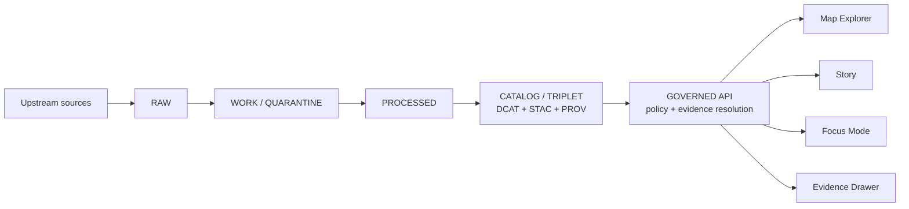

<!-- [KFM_META_BLOCK_V2]
doc_id: kfm://doc/3b5a5d0c-7d8a-4b3f-b9a0-8d2c6d3e8f1a
title: Kansas Frontier Matrix — README
type: standard
version: v1
status: draft
owners: TBD
created: 2026-03-03
updated: 2026-03-06
policy_label: public
related: []
tags: [kfm, readme]
notes:
  - Root README for the governed operating model.
  - Claims about current implementation state remain branch-dependent until verified.
[/KFM_META_BLOCK_V2] -->

# Kansas Frontier Matrix
Governed, evidence-first infrastructure for exploring Kansas through place, time, narrative, and inspectable evidence.


## Impact

**Status:** draft  
**Owners:** TBD  
**Policy label:** public  
**Repo path:** `README.md`  
**Quick links:** [Purpose](#purpose) · [Non-negotiables](#non-negotiables) · [System flow](#system-flow) · [What belongs here](#what-belongs-here) · [Quickstart](#quickstart)

## Purpose

**CONFIRMED:** KFM is a governed, evidence-first, map-first, time-aware system.

**CONFIRMED:** It is not just a map, not just a catalog, and not a free-form AI interface.

**CONFIRMED:** Public layers, story claims, and Focus answers are expected to resolve to policy-safe evidence or the system abstains.

This README is the repo-root contract for the project posture. It explains what KFM is, what may cross the trust boundary, and what must be verified on the current branch before anyone claims something is implemented.

## Where this README fits

**CONFIRMED:** This file belongs at the repo root and orients the whole system.

**CONFIRMED:** The operating path is data → governed pipelines → catalogs/provenance → governed API → Map / Story / Focus surfaces.

**UNKNOWN:** The exact branch layout, deployed services, and merge-blocking checks are not proven by this README and must be verified locally.

## Non-negotiables

| Rule | Status | Meaning |
|---|---|---|
| Truth path | CONFIRMED | Data moves through `RAW → WORK/QUARANTINE → PROCESSED → CATALOG/TRIPLET → PUBLISHED`. |
| Trust membrane | CONFIRMED | Clients never access storage or databases directly; all access crosses governed APIs and policy. |
| Cite-or-abstain | CONFIRMED | Stories, map claims, and Focus answers resolve to evidence or abstain. |
| Default-deny / fail-closed | CONFIRMED | Unclear rights, policy, validation, or evidence blocks publication. |
| Deterministic identity | CONFIRMED | Stable dataset/version IDs come from canonical hashing of specs and comparable artifacts. |
| Canonical vs rebuildable | CONFIRMED | Object storage, catalogs, receipts, and provenance are canonical; search, tiles, graphs, caches, and indexes are rebuildable projections. |

## System flow

**CONFIRMED:** Promotion is not a file copy. It is a policy-checked state transition.


```mermaid
flowchart LR
  A[Upstream sources] --> B[RAW]
  B --> C[WORK / QUARANTINE]
  C --> D[PROCESSED]
  D --> E[CATALOG / TRIPLET<br/>DCAT + STAC + PROV]
  E --> F[GOVERNED API<br/>policy + evidence resolution]
  F --> G[Map Explorer]
  F --> H[Story]
  F --> I[Focus Mode]
  F --> J[Evidence Drawer]
```

## Product surfaces

**CONFIRMED:** The core surfaces are Map Explorer, Story, Focus Mode, and the Evidence Drawer.

**CONFIRMED:** Users should be able to move between geography, chronology, narrative, and evidence without losing context.

**CONFIRMED:** Focus Mode is a governed Q&A path, not unconstrained generation.

## Default working scope

**PROPOSED:** Use frontier-era Kansas as the default initial scope.

**PROPOSED:** Use `1854–1900` as the default starting window unless a dataset or story explicitly declares a different scope.

**PROPOSED:** Use county-year as the practical opening analysis grain, and use finer grains only when source fidelity requires them.

## What belongs here

**PROPOSED:** This repo should contain the artifacts that make KFM governable and reproducible:

- contracts and schemas
- policy-as-code and policy tests
- data specs, registry entries, promotion manifests, and receipts
- ingestion, validation, catalog, and evidence-resolution tooling
- UI, API, and supporting services that remain behind the governed boundary
- runbooks, ADRs, standards, and reviewer-facing docs

## What does not belong here

**CONFIRMED / PROPOSED baseline:**

- direct client-to-database or client-to-object-storage access patterns
- publishable data without checksums, receipts, and catalog records
- uncited story claims or Focus outputs presented as fact
- secrets committed to the repo
- public artifacts that expose policy-restricted sensitive locations or unresolved rights
- code or docs that imply live implementation state without verification

## Expected repo shape

**PROPOSED:** A buildable KFM repo separates docs, data, policy, contracts, code, tools, tests, and workflows.

**UNKNOWN:** Treat this as a target shape, not proof of the current branch.

```text
repo/
├── README.md
├── docs/
├── data/
├── policy/
├── contracts/
├── src/
├── tools/
├── tests/
└── .github/workflows/
```

## Quickstart

**UNKNOWN:** Current repo state is branch-dependent. Before you describe anything as implemented, verify it.

```bash
git rev-parse HEAD
find . -maxdepth 2 -type d | sort
ls -la .github/workflows 2>/dev/null || true
grep -RIn "spec_hash\|EvidenceRef\|EvidenceBundle\|policy_label\|opa\|rego" . || true
```

Use the result to answer four questions:

1. What exists on this branch?
2. Which CI checks actually block merges?
3. Which services are implemented versus merely designed?
4. Which contracts are enforced today?

## Working rules for changes

**CONFIRMED / PROPOSED baseline:**

1. Make small, reversible, additive changes.
2. Update docs when behavior changes.
3. Treat contracts as production artifacts.
4. Promote data only with receipts, checksums, and catalog links.
5. Fail closed on policy, validation, or evidence uncertainty.
6. Do not claim “done” until tests and review gates agree.

## First-release discipline

**PROPOSED:** Keep the first complete release narrow. Prefer one fully governed vertical slice over many half-governed domains.

A sensible starting slice is:

- one time-aware boundary system
- one promoted dataset family
- one story that resolves every claim to evidence
- one Focus flow that cites correctly or abstains

## License and implementation status

**UNKNOWN:** Do not infer license, deployment posture, or shipped module coverage from this file alone.

Smallest verification steps:

1. check `LICENSE`
2. inspect the current tree
3. inspect `.github/workflows`
4. verify running services on the active branch