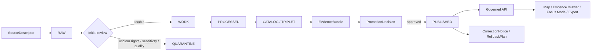

<!-- [KFM_META_BLOCK_V2]
doc_id: kfm://doc/NEEDS-VERIFICATION-root-readme
title: Kansas Frontier Matrix
type: standard
version: v1
status: review
owners: NEEDS_VERIFICATION
created: NEEDS_VERIFICATION
updated: 2026-04-26
policy_label: public
related: [
  ./.github/README.md,
  ./docs/README.md,
  ./data/README.md,
  ./data/registry/README.md,
  ./contracts/README.md,
  ./schemas/README.md,
  ./policy/README.md,
  ./tests/README.md,
  ./pipelines/README.md,
  ./tools/README.md,
  ./apps/,
  ./packages/,
  ./web/,
  ./infra/,
  ./release/
]
tags: [kfm, root-doc, repository-readme, evidence-first, map-first, time-aware, governance]
notes: [
  "Draft prepared from KFM corpus and current-session workspace evidence; verify mounted repo tree, links, owner, dates, CODEOWNERS, workflows, branch protections, runtime logs, and proof objects before publishing as current implementation.",
  "Use placeholders instead of inferred owner, created date, workflow, schema-home, runtime, or deployment claims until repo evidence confirms them."
]
[/KFM_META_BLOCK_V2] -->

<a id="top"></a>

# Kansas Frontier Matrix

Governed, evidence-first, map-first, time-aware spatial knowledge and publication system for Kansas.

> [!IMPORTANT]
> **Truth posture:** `review draft`  
> This README states KFM doctrine and provides repository orientation. It does **not** claim current implementation maturity, deployed runtime behavior, branch protections, workflow enforcement, source registry contents, generated proof objects, dashboards, or logs until those are verified in a mounted repository checkout.

**Quick jumps:** [Scope](#scope) · [Trust path](#trust-path) · [Repo fit](#repo-fit) · [Repository map](#repository-map) · [Operating rules](#operating-rules) · [Maps, UI, and AI](#maps-ui-and-ai) · [Domain caution](#domain-caution) · [Quickstart](#quickstart) · [Definition of done](#definition-of-done) · [Open verification](#open-verification)

---

## Scope

Kansas Frontier Matrix, or KFM, is built around one durable public unit of value: the **inspectable claim**.

An inspectable claim is a public or semi-public statement that can be reconstructed to admissible evidence, spatial scope, temporal scope, source role, policy posture, review state, release state, and correction lineage.

Maps, tiles, graphs, dashboards, story exports, scenes, AI answers, summaries, search indexes, vector indexes, and rendered UI views are useful carriers. They are not sovereign truth.

KFM is intended to help contributors answer questions such as:

- What evidence supports this statement?
- Where and when does the claim apply?
- Which source role is being used: observation, interpretation, regulatory context, model output, derived layer, or public communication product?
- Has the material passed rights, sensitivity, validation, review, and release checks?
- How can a public claim be corrected, withdrawn, rebuilt, or rolled back?

## Trust path

KFM preserves a governed lifecycle by default:

```text
RAW -> WORK / QUARANTINE -> PROCESSED -> CATALOG / TRIPLET -> PUBLISHED
```

That lifecycle is not a folder naming convention. It is the trust boundary that keeps source material, candidate work, released evidence, public UI, and correction/rollback state from collapsing into one undifferentiated bucket.


```mermaid
flowchart LR
  A[SourceDescriptor] --> B[RAW]
  B --> C{Initial review}
  C -->|usable| D[WORK]
  C -->|unclear rights / sensitivity / quality| E[QUARANTINE]
  D --> F[PROCESSED]
  F --> G[CATALOG / TRIPLET]
  G --> H[EvidenceBundle]
  H --> I[PromotionDecision]
  I -->|approved| J[PUBLISHED]
  J --> K[Governed API]
  K --> L[Map / Evidence Drawer / Focus Mode / Export]
  J --> M[CorrectionNotice / RollbackPlan]
```

Core distinction: **promotion is a governed state transition, not a file move**.

## Repo fit

| Field | Value |
|---|---|
| Path | `/README.md` |
| Role | Root orientation, doctrine summary, contributor entry point, and verification-first navigation surface |
| Accepted here | Project identity, trust-path summary, repository navigation, contribution posture, quick verification commands, and links to governing surfaces |
| Not here | Full schema catalogs, source atlases, policy bodies, route-by-route API claims, runtime logs, generated proof packs, or unstaged implementation certainty |
| Status | `review` until owner, links, branch state, workflow inventory, and current repo topology are verified |

Root README changes should be small, reviewable, and reversible. Subsystem-specific detail belongs in the relevant docs, contracts, schemas, policy, data, tests, apps, packages, tools, or pipeline surfaces.

## Repository map

> [!NOTE]
> The surfaces below are expected KFM navigation targets. Verify current path existence before publishing this README as current implementation truth.

| Surface | Intended role | Boundary rule |
|---|---|---|
| `.github/` | Governance gatehouse: CODEOWNERS, PR templates, workflow notes, security and review routing | Do not infer branch rules or required checks from files alone |
| `docs/` | Human doctrine, architecture, runbooks, ADRs, verification backlog, contradiction register | Docs can define intended doctrine; they do not prove runtime behavior by themselves |
| `contracts/` | Interface and object contracts where repo convention confirms this home | If `contracts/` and `schemas/` both exist, resolve schema authority with an ADR |
| `schemas/` | Machine-readable schemas where repo convention confirms this home | Avoid duplicate authority with `contracts/` |
| `policy/` | Policy-as-code, reason codes, fixtures, and publication gates | Policy should fail closed when rights, sensitivity, review, release, or evidence closure is unclear |
| `data/registry/` | Source descriptors, source roles, cadence, rights, sensitivity, and downstream-use rules | Source registry is not a public truth surface by itself |
| `data/receipts/` | Process memory such as ingest, validation, run, redaction, AI, and publication receipts | Receipts are not EvidenceBundles or ReleaseManifests |
| `data/proofs/` | Release proofs, proof packs, integrity records, and review artifacts | Proof objects remain distinct from catalogs and corrections |
| `data/catalog/` | Catalog records such as STAC/DCAT/PROV-style release metadata where adopted | Catalog entries should resolve to evidence and release state |
| `pipelines/` | Ingest, validation, normalization, publication, and dry-run orchestration | Live connectors require source-rights and endpoint verification |
| `tools/` | Validators, probes, diff tools, catalog builders, attestation helpers, and review utilities | Tools must not create public truth without policy and release gates |
| `tests/` | Fixtures and positive/negative-path validation | Trust-sensitive negative tests are first-class work |
| `apps/` | Governed API and service implementations, if present | Public clients should not read RAW, WORK, QUARANTINE, or canonical/internal stores directly |
| `packages/` | Shared libraries, adapters, runtime helpers, and domain packages, if present | Package boundaries should preserve source, evidence, policy, and release distinctions |
| `web/` | Public/steward UI surfaces, if present | UI must surface evidence and policy posture at the point of use |
| `infra/` | Deployment, local-hosting, reverse-proxy, VPN, and environment definitions, if present | Deny by default; keep admin and maintenance paths private unless explicitly justified |
| `release/` | Release manifests, release notes, and publication packaging, if present | Build, deploy, promote, and publish are different actions |

## Operating rules

### Evidence before fluency

KFM should answer with evidence or abstain. A well-written answer, attractive map, polished dashboard, or plausible model output is not enough.

### Public clients use governed interfaces

Ordinary public and steward surfaces should consume governed APIs, released artifacts, catalog records, triplet/graph records where applicable, tile services, EvidenceRef-to-EvidenceBundle resolution, and policy-safe runtime envelopes.

They should not read directly from RAW, WORK, QUARANTINE, unpublished candidates, canonical/internal stores, direct model-runtime output, or direct source-system side effects.

### Keep object families separate

KFM work should preserve the distinction between these object families unless current repository evidence proves a different accepted model:

| Family | Examples | Why it matters |
|---|---|---|
| Source identity | `SourceDescriptor`, `SourceIntakeRecord` | Shows what a source is, what role it may play, and what downstream use is allowed |
| Evidence closure | `EvidenceRef`, `EvidenceBundle` | Lets public claims resolve to admissible evidence |
| Decisions | `DecisionEnvelope`, `PolicyDecision`, `PromotionDecision` | Keeps review, policy, and publication decisions inspectable |
| Runtime output | `RuntimeResponseEnvelope`, `CitationValidationReport` | Prevents generated answers from becoming proof |
| Receipts | `RunReceipt`, `AIReceipt`, `RedactionReceipt`, `ValidationReport` | Preserves process memory without confusing it with released truth |
| Release proof | `ReleaseManifest`, `ProofPack`, `CatalogMatrix`, `GeoManifest` | Supports integrity checks and rebuildable publication |
| Repair state | `CorrectionNotice`, `RollbackPlan` | Keeps corrections, withdrawals, and rollback targets visible |

When these objects are proposed rather than verified in the repo, label them `PROPOSED` in docs, schemas, fixtures, and PR descriptions.

### Fail closed where trust matters

Prefer quarantine, redaction, generalization, staged access, delayed publication, or deny-by-default policy when rights, sensitivity, exact location exposure, living-person exposure, cultural context, DNA/genomics, private landowner exposure, source terms, review state, or release state is unclear.

## Maps, UI, and AI

### Map-first does not mean map-sovereign

KFM is map-first because place and time are the main ways users inspect claims. The map is still downstream of evidence, policy, and release state.

MapLibre, Cesium, 3D Tiles, PMTiles, vector tiles, COGs, GeoJSON, rendered scenes, dashboards, and story exports are delivery or rendering surfaces. Derived layers, search indexes, vector stores, scenes, and summaries are rebuildable derivatives.

### Evidence must be visible at the point of use

Public map popups, layer panels, story nodes, exports, Focus answers, review surfaces, and Evidence Drawers should resolve evidence and policy posture before making consequential claims.

### Governed AI stays subordinate

AI is an interpretive layer, not a root truth source.

A KFM-safe AI flow is:

1. Define the question scope.
2. Retrieve admissible evidence.
3. Resolve EvidenceRef to EvidenceBundle.
4. Apply policy and sensitivity checks.
5. Generate a bounded answer or structured output.
6. Validate citations and claims.
7. Emit a finite outcome: `ANSWER`, `ABSTAIN`, `DENY`, or `ERROR`.
8. Preserve receipts where the workflow requires them.

Do not expose a public direct model endpoint. Do not let model output, vector search, summaries, or embeddings become proof.

## Domain caution

| Domain or surface | Default posture |
|---|---|
| Archaeology, sacred sites, burials, cultural heritage | Deny public exact locations by default; require steward or cultural review and public-safe transforms |
| Rare species, habitat, fauna, flora | Fail closed on exact occurrence exposure; require geoprivacy transform and sensitivity review |
| People, genealogy, DNA, genomics, land ownership | Separate assertions from canonical records; restrict living-person and DNA/genomic material by default; assessor/tax records are not title truth |
| Critical infrastructure, roads, rail, facilities, hazards | Keep operational warnings, regulatory layers, observations, models, and resilience summaries distinct; do not become an emergency alert system |
| Hydrology, soils, geology, atmosphere, agriculture | Preserve source role, observation/model/regulatory distinction, temporal basis, units, uncertainty, and source terms |
| Urban planning, settlements, infrastructure | Separate legal status, administrative role, geometry, service area, historic interpretation, and public-safe representation |
| 3D, scenes, digital twins | Treat visualizations as evidence carriers or derived views; visual realism must not imply evidentiary certainty |

## Quickstart

Start every implementation or documentation pass by verifying the repository state.

```bash
git status --short
git branch --show-current
git rev-parse --show-toplevel
find . -maxdepth 2 -type f | sort | sed -n '1,200p'
find .github docs contracts schemas policy data apps packages pipelines tools tests infra release \
  -maxdepth 3 -type f 2>/dev/null | sort | sed -n '1,300p'
```

Then inspect available task entry points before running project commands:

```bash
find . -maxdepth 2 \
  \( -name Makefile -o -name package.json -o -name pnpm-lock.yaml -o -name pyproject.toml -o -name requirements.txt -o -name go.mod -o -name Cargo.toml \) \
  -print | sort
```

Only run validation commands that are present and documented in the current checkout. Do not infer a package manager, test runner, workflow, route, or deployment target from this README alone.

## Definition of done

A root README change is ready for review when it:

- preserves KFM’s governed lifecycle and cite-or-abstain posture;
- separates doctrine from implementation claims;
- avoids invented owners, paths, badges, links, workflows, routes, schemas, tests, dashboards, or deployment status;
- keeps maps, UI, AI, tiles, graphs, summaries, and scenes subordinate to evidence and policy;
- gives contributors a practical verification-first entry point;
- updates neighboring docs or records why no neighboring doc update is needed;
- identifies open verification items without turning them into false certainty;
- can be reverted cleanly without changing public meaning elsewhere.

## Recommended first PR when repo conventions are unsettled

Do not begin with live connectors, UI polish, public layers, direct model integration, broad data ingest, broad tile generation, or exposed deployment.

Prefer a small reversible first PR:

1. Documentation control plane.
2. Schema-home ADR.
3. Source ledger and source registry skeleton.
4. Core governance schemas and fixtures.
5. Offline validators and negative-path tests.
6. Policy stubs and policy tests.
7. One no-network public-safe proof slice.
8. Release dry-run and rollback/correction rehearsal.

## Open verification

Before this README can make stronger implementation claims, verify:

- repository owner and CODEOWNERS coverage;
- created date and stable document ID;
- current branch, dirty state, and mounted repo root;
- current top-level tree and all relative links in this README;
- schema-home authority between `contracts/` and `schemas/`;
- package manager, test runner, validator tooling, and CI workflow names;
- current governed API, UI, MapLibre, Evidence Drawer, and Focus Mode implementation surfaces;
- source registry contents and source-rights posture;
- emitted receipts, proof packs, release manifests, catalog records, correction notices, and rollback artifacts;
- branch protections, required checks, environment approvals, deployment posture, dashboards, and runtime logs.

## License

License and reuse terms are `NEEDS_VERIFICATION`. Check the repository `LICENSE` file if present, and do not assume public release rights for source data, derived layers, media, screenshots, or generated artifacts without source-specific review.

---

[Back to top](#top)
