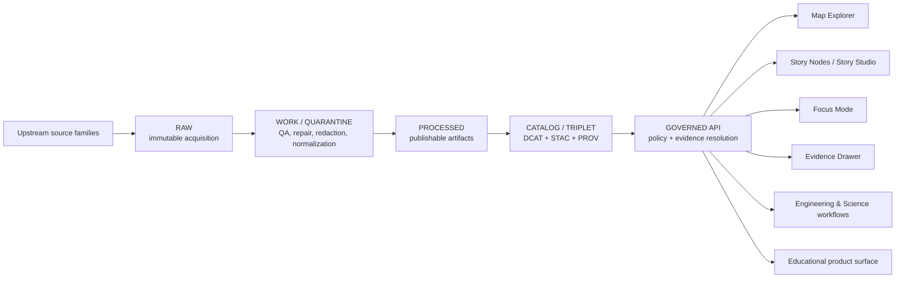
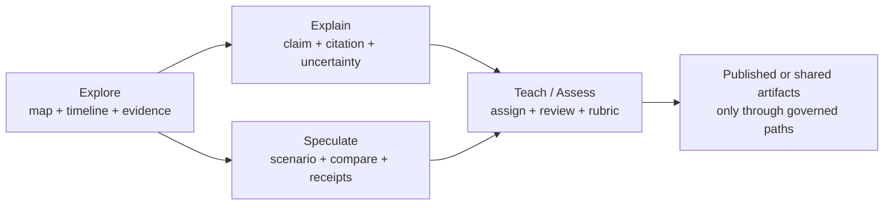

<!-- [KFM_META_BLOCK_V2]
doc_id: kfm://doc/readme-root-v2
title: Kansas Frontier Matrix
type: standard
version: v1
status: draft
owners: TBD (verify CODEOWNERS)
created: 2026-03-06
updated: 2026-03-06
policy_label: public
related: [/.github, /apps, /contracts, /data, /docs, /infra, /packages, /policy, /schemas, /tests, /tools]
tags: [kfm, readme, governance, evidence, gis, provenance, education]
notes: [Repo-root README aligned to the KFM unified manual and the attached educational product surface design. Educational and classroom-facing material below is intentionally labeled PROPOSED unless separately verified in the current branch.]
[/KFM_META_BLOCK_V2] -->

<a id="top"></a>

# Kansas Frontier Matrix
Governed, evidence-first infrastructure for exploring Kansas through place, time, narrative, analysis, inspectable evidence, and evidence-linked learning.

> **Status:** draft  
> **Owners:** TBD (`verify CODEOWNERS`)  
>       
> **Quick links:** [Purpose](#purpose) · [Repo fit](#repo-fit) · [Non-negotiables](#non-negotiables) · [Reference flow](#reference-flow) · [Product surfaces](#product-surfaces) · [Educational product surface](#educational-product-surface-proposed) · [Learning data model](#learning-data-model-proposed) · [Scenario discipline](#scenario-discipline-proposed) · [Current repo posture](#current-repo-posture) · [Quickstart](#quickstart) · [Source library integration map](#source-library-integration-map)

## Purpose
KFM is a **map-first, time-aware, policy-governed knowledge system** for Kansas. It turns heterogeneous sources—historical records, maps, narrative evidence, environmental data, remote sensing, derived analytics, and governed AI assistance—into inspectable public surfaces without losing provenance.

It is also designed to support **evidence-linked public learning and instructional use** without weakening the same trust controls that govern research and publication surfaces.

**CONFIRMED**
- KFM is designed as a **governed, evidence-first, map-first, and time-aware** system.
- Public-facing access is intended to cross a **trust membrane** through governed APIs and policy checks.
- User-visible claims are expected to resolve to **EvidenceRefs / EvidenceBundles** or the system must **abstain**.

**PROPOSED**
- This README acts as the repo-root contract for how those ideas should shape the monorepo, contributor behavior, and the first buildable vertical slice.
- The uploaded source library is used here as a design scaffold for data, GIS, metadata, UI, API, engineering, analysis, simulation, and educational product design.
- KFM can support a governed **educational product surface** with evidence-linked exploration, constrained story authoring, and explicitly labeled speculative scenario work.

**UNKNOWN**
- Current branch implementation depth, deployed services, exact CI rules, merge-blocking checks, and the extent of any educational/classroom implementation are not proven by this file alone and must be verified locally.

## Repo fit
**Path:** `/README.md`  
**Repo role:** root orientation document for the entire monorepo.  
**Upstream:** source systems, connectors, ingestion jobs, normalization pipelines, policy decisions, and documentation standards.  
**Downstream:** Map Explorer, Story Nodes, Focus Mode, Evidence Drawer, engineering/science workflows, and any future governed educational surface.

KFM should be read as a **pipeline → catalog → API → UI** system, not as a loose set of apps. The repo root is where contributors should learn the operating model before they descend into specific services or directories.

## Evidence posture
KFM uses three truth labels throughout its docs and code-adjacent planning:

| Label | Meaning here |
|---|---|
| **CONFIRMED** | Supported by the uploaded KFM manual corpus. |
| **PROPOSED** | Recommended implementation posture or repo discipline synthesized from the uploaded source library. |
| **UNKNOWN** | Not yet verified on the current branch, environment, or deployment. |

This README deliberately prefers **visible uncertainty over plausible fiction**.

## What KFM is
KFM is:
- a governed geospatial platform
- a provenance-preserving data pipeline
- a catalog and evidence-resolution system
- a set of user surfaces for map, time, story, and governed question answering
- a foundation for Kansas historical, environmental, scientific, and analytical work
- a **possible instructional and public-learning surface** when educational workflows stay inside the same governance boundary

KFM is **not**:
- a free-form chatbot
- a generic upload-and-forget data portal
- a direct browser-to-database GIS stack
- a publication path that can skip rights, sensitivity, validation, or provenance checks
- a repo where docs can drift away from behavior without consequence
- a classroom simulation toy that treats speculative outputs as settled historical fact

## Non-negotiables
The following are architectural laws, not stylistic preferences.

| Invariant | Status | What it means in practice | What must never happen |
|---|---|---|---|
| Truth path | CONFIRMED | Data moves through `RAW → WORK/QUARANTINE → PROCESSED → CATALOG/TRIPLET → PUBLISHED`. | Ad hoc publication from notebooks, temp files, or analyst-only transforms. |
| Trust membrane | CONFIRMED | Clients do not touch storage or databases directly; all access crosses governed APIs plus policy. | UI or external clients bypassing policy via direct store access. |
| Cite-or-abstain | CONFIRMED | Story claims, map claims, and Focus answers resolve to evidence or abstain. | Plausible uncited output presented as fact. |
| Default-deny / fail-closed | CONFIRMED | Unclear rights, unresolved sensitivity, failed validation, or broken evidence blocks release. | “Best effort” publication under ambiguity. |
| Deterministic identity | CONFIRMED | Comparable inputs and the same spec yield the same stable identity and spec hash. | Unstable versions or ambiguous lineage. |
| Evidence as interface | CONFIRMED | Evidence is operational and resolvable, not decorative. | Provenance trapped in dead files or disconnected notes. |
| Separation of duty | CONFIRMED | Submission and policy-significant approval cross a review boundary. | Self-approval of sensitive releases. |
| Docs as production surface | CONFIRMED | Behavior changes update docs, templates, tests, and runbooks together. | Silent drift between system behavior and written procedure. |
| Fact / speculation boundary | PROPOSED | Educational and simulation-facing outputs must visibly distinguish historical baseline from modeled projection. | Alternate-history or scenario output presented as confirmed history. |
| Minimal learner-data posture | PROPOSED | Classroom-facing workflows should minimize collection, prefer pseudonymous identifiers, and export artifacts without building unnecessary permanent profiles. | Educational convenience driving unnecessary identity capture or silent telemetry growth. |

## Reference flow
Promotion is not a file copy. It is a governed state transition.


```mermaid
flowchart LR
    A[Upstream source families] --> B[RAW<br/>immutable acquisition]
    B --> C[WORK / QUARANTINE<br/>QA, repair, redaction, normalization]
    C --> D[PROCESSED<br/>publishable artifacts]
    D --> E[CATALOG / TRIPLET<br/>DCAT + STAC + PROV]
    E --> F[GOVERNED API<br/>policy + evidence resolution]
    F --> G[Map Explorer]
    F --> H[Story Nodes / Story Studio]
    F --> I[Focus Mode]
    F --> J[Evidence Drawer]
    F --> K[Engineering & Science workflows]
    F --> L[Educational product surface]
```

### Product surfaces

| Surface | Status | Purpose |
|---|---|---|
| Map Explorer | CONFIRMED | Layered geographic exploration with time controls and evidence access. |
| Evidence Drawer | CONFIRMED | Open evidence, rights, version, and provenance from visible map or story claims. |
| Story Nodes | CONFIRMED | Narrative publishing bound to resolvable citations and review state. |
| Focus Mode | CONFIRMED | Governed Q&A with receipts, hard citation verification, and abstention behavior. |
| Engineering & Science workflows | PROPOSED | Model, simulate, compare, and publish derived analytical outputs without bypassing the same governance plane. |
| Educational product surface | PROPOSED | Evidence-linked exploration, explanation, speculative modeling, and classroom assessment without bypassing policy, provenance, or fact/speculation boundaries. |

[Back to top](#top)

## Educational product surface (PROPOSED)
The attached educational design suggests that KFM can support a governed learning surface without diluting its evidence-first posture.

The intended instructional surface is best understood as **four coordinated workspaces**:

| Workspace | Purpose | Trust requirement |
|---|---|---|
| **Explore** | Map + timeline + evidence drawer for asking what happened, where, and when. | Any visible value, layer, or claim must open into evidence. |
| **Explain** | Story-studio workflow for student or teacher explanations. | Claims require citations, and uncertainty or counterevidence must be expressible. |
| **Speculate** | Controlled “what if?” scenario lab. | Outputs must be labeled speculative, reproducible, and separated from historical baseline. |
| **Teach / Assess** | Classroom hub for assignments, supports, and rubrics. | Minimal learner-data collection, role-aware controls, and policy-safe artifact handling. |


```mermaid
flowchart LR
    A[Explore<br/>map + timeline + evidence] --> B[Explain<br/>claim + citation + uncertainty]
    A --> C[Speculate<br/>scenario + compare + receipts]
    B --> D[Teach / Assess<br/>assign + review + rubric]
    C --> D
    D --> E[Published or shared artifacts<br/>only through governed paths]
```

### Learning workspace rules

#### Explore
Explore should remain recognizably KFM:
- map canvas with layers and time controls
- evidence access from every inspectable value
- uncertainty and rights cues in the inspection flow
- no direct client access to raw or unpublished stores

#### Explain
Explain should use constrained authoring, not free-form assertion:
- prompt around a question
- 1–3 evidence-linked claims
- optional counterevidence
- explicit uncertainty note
- publish/share gate that blocks unsupported claims or labels them accordingly

#### Speculate
Speculate is permitted only when KFM keeps the boundary between **historical baseline** and **modeled alternate outcome** unmistakable:
- parameterized inputs
- deterministic and/or stochastic runs
- explicit assumptions
- reproducible run receipts
- visible “Speculative” labeling
- no language implying “what truly would have happened”

#### Teach / Assess
Teach / Assess should support classroom use without turning KFM into a student-data warehouse:
- assign modules
- lock or unlock layers and knobs
- collect reflections or story artifacts
- grade against embedded rubrics
- export results to other systems without requiring maximal user profiling

## Learning data model (PROPOSED)
The attached educational design strengthens a pattern already implicit in KFM: treat the system as a **spatiotemporal measurement cube** keyed by **metric × place × time**, with uncertainty and evidence pointers.

For a governed educational or public-learning surface, the data model should stay split into three lanes:

| Layer | Core entities | Purpose |
|---|---|---|
| Evidence-first data layer | `dataset`, `dataset_version`, `asset`, `metric`, `spatial_unit`, `time_period`, `observation`, `evidence_ref`, `evidence_bundle` | Preserve the canonical observation cube and evidence resolution model. |
| Scenario layer | `scenario`, `parameter_set`, `scenario_run`, `run_output` | Support reproducible speculation without confusing runs with historical observations. |
| Teaching / learning layer | `lesson_module`, `assignment`, `rubric`, `student_artifact` | Hold pedagogy and classroom artifacts separately from canonical historical/environmental facts. |

### Observation and scenario model
At minimum, the educational extension should preserve the following distinctions:

- **Observation:** historical or measured value linked to dataset version, metric, place, time, uncertainty, and evidence.
- **Scenario run:** modeled output linked to parameter set, random seed, model version, and provenance chain.
- **Student artifact:** learning output such as a Story Card, reflection, chart, or run receipt; never mistaken for source evidence itself.

### Recommended metadata posture
Educational, public-history, and scenario-facing lanes should continue to rely on:
- `DCAT` for dataset/service metadata
- `STAC` for spatial/temporal asset packaging and search
- `PROV` / `PROV-O` for lineage across ingestion, transformation, scenario runs, and exportable receipts

## Educational and public-learning source priorities (PROPOSED)
A classroom or museum-ready KFM should prefer high-signal, citable, historically anchored sources that fit the truth path.

| Need | Example source family | Why it fits |
|---|---|---|
| Frontier legal anchor | Kansas–Nebraska Act and related milestone materials | Gives primary-source grounding for the default historical window. |
| Population, agriculture, economy, boundaries | NHGIS-style summary tables and boundary files | Supports county-year observations and long-run comparisons. |
| Time-coded county boundaries | Historical county boundary atlases | Essential for time-aware comparisons and avoiding false fixed-boundary assumptions. |
| Land patents and surveys | BLM/GLO-style land records | Links land disposition to place, time, and evidence bundles. |
| Newspaper corpus | OCR-backed newspaper archives | Supports contemporaneous narrative evidence with explicit caveats. |
| Rail network | Historical railroad shapefiles / network data | Supports access, movement, settlement, and scenario comparisons. |
| Climate and weather shocks | Long-run climate station or derived environmental datasets | Supports stochastic or rule-based scenario inputs. |
| Base geography | National reference layers and topo resources | Supports map context and instructional navigation. |

## Scenario discipline (PROPOSED)
KFM should allow **disciplined speculation**, not unbounded alternate history.

### Scenario design rules
A scenario engine in KFM should be:
1. **Transparent** — learners can see which assumptions drove outputs.
2. **Reproducible** — same inputs and seed yield the same run.
3. **Bounded** — outputs are model-dependent projections, not claims of true alternate history.
4. **Evidence-linked** — defaults and calibrations point back to datasets or are marked as teacher/author assumptions.

### Modeling tiers
A staged learning and simulation model fits KFM better than one monolithic engine:

| Tier | Status | Description |
|---|---|---|
| Tier A | PROPOSED | Deterministic rule-based simulation; fast, understandable, good for introductory use. |
| Tier B | PROPOSED | Stochastic / Monte Carlo simulation for uncertainty literacy and distributional outcomes. |
| Tier C | PROPOSED | Agent-based modeling for advanced, emergent-behavior work; likely post-MVP. |

### Required scenario outputs
To keep speculation disciplined, Scenario Lab outputs should always include:
- baseline vs. scenario map
- difference map
- key-driver ranking
- uncertainty bands where stochastic methods are used
- run receipt with inputs, seed, datasets, and model version
- explicit fact/speculation boundary label

### Scenario anti-patterns
The following are out of bounds:
- presenting projections as confirmed history
- allowing uncited scenario narratives to publish cleanly
- hiding assumptions in tooltips or omitted metadata
- using fixed modern boundaries where time-aware boundary treatment materially changes interpretation
- implying historical certainty in sensitive or contested domains

## Accessibility, privacy, and classroom deployment posture (PROPOSED)

### Accessibility
Any educational or public-learning surface should treat accessibility as release-critical:
- WCAG-aligned keyboard navigation and focus order
- text alternatives and captions/transcripts for media
- non-visual access to map information through tabular or generated descriptive views
- color-safe palettes and pattern overlays
- reading supports such as glossary popovers or simplified summaries where appropriate

### Instructional flexibility
Learning modules should support more than one mode of participation:
- guided story or narrated walkthrough
- interactive map task
- writing, discussion, or audio explanation
- uncertainty-aware reasoning rather than one “correct” interface path

### Privacy
If KFM grows a classroom-facing lane, it should adopt privacy-minimizing defaults:
- pseudonymous student identifiers where possible
- no unnecessary collection of direct identifiers
- exportable artifacts rather than mandatory permanent profiles
- aggregated, non-identifying telemetry only
- district / institution opt-outs where applicable

### Offline / bandwidth-limited use
A field-trip or low-bandwidth deployment should still respect evidence:
- prepackaged lesson bundles
- cached basemap tiles and selected layers
- offline evidence snippets with checksums and later-verifiable citations
- deferred synchronization of notes, Story Cards, and run receipts

Offline mode must never create “floating facts” that cannot later resolve back to source-aware evidence.

## Accepted inputs
This repo should accept inputs that can participate in the truth path and evidence model.

| Input type | Examples | Typical landing zone | Notes |
|---|---|---|---|
| Historical tabular data | census slices, land patents, registries, tabular archives | `RAW/` then `WORK/` | Must preserve source metadata and acquisition receipt. |
| Vector geodata | county boundaries, PLSS, routes, parcels, sites, event polygons | `RAW/` then `PROCESSED/` | Standardize schemas and IDs before promotion. |
| Raster geodata | DEMs, land cover, climate grids, satellite scenes, hazard rasters | `RAW/` then `PROCESSED/` | Prefer cloud-friendly formats and stable checksums. |
| Narrative evidence | archival documents, oral histories, newspapers, story drafts | `RAW/` then evidence extraction flow | Rights and sensitivity review may be required before publication. |
| Metadata and lineage records | DCAT, STAC, PROV, sidecars, manifests | `CATALOG/` | Cross-link IDs so EvidenceRefs resolve. |
| Derived outputs | analytics, statistics, anomaly layers, model products | `PROCESSED/` or `WORK/` | Must remain linked to observational basis and derivation history. |
| Validation artifacts | QA reports, accuracy tables, review notes, test fixtures | `WORK/`, `docs/`, `tests/` | These are part of governance, not disposable byproducts. |
| Policy-safe educational assets | lesson modules, rubrics, guided tours, Story Card templates, scenario presets | `docs/`, `contracts/`, or governed app assets | Must not bypass policy, provenance, or role controls. |
| Scenario receipts | parameter sets, seeds, model versions, compare summaries | governed runtime artifacts | Must stay clearly separate from canonical historical observations. |

## Exclusions
The following do **not** belong in KFM’s governed publication path.

| Exclusion | Why it stays out | Where it goes instead |
|---|---|---|
| Secrets, tokens, credentials | Never commit secrets to the repo. | Secret managers / environment configuration. |
| Direct client-to-store access patterns | Breaks the trust membrane and bypasses policy. | Governed API routes and policy-aware services. |
| Publishable artifacts without checksums, receipts, and catalog records | Cannot be audited or reproduced. | Keep in `WORK/QUARANTINE` until complete. |
| Uncited story claims or unverified Focus answers | Violates cite-or-abstain. | Draft or failed run outputs; not publishable. |
| Ambiguous-rights or policy-restricted public data | Rights and sensitivity uncertainty must fail closed. | Quarantine, redacted derivative, or metadata-only record. |
| Documentation that implies live implementation without verification | Breaks trust through overclaiming. | Mark `UNKNOWN`, add verification steps, then update. |
| Classroom or museum outputs that blur fact and speculation | Damages trust and teaches the wrong mental model. | Keep as draft instructional material until labeled and evidenced correctly. |
| Permanent student dossiers or unnecessary learner telemetry | Violates minimal-data posture and creates governance burden. | Prefer pseudonymous, export-first, or local-first artifact handling. |

## Current repo posture
This section is intentionally conservative.

**UNKNOWN**
- I do **not** treat the educational product surface as a current branch fact.
- I do **not** treat any unverified implementation, classroom feature, or deployment package as live merely because it is designed in a source document.
- The exact current root tree, workflow inventory, and build coverage must be verified locally on the active branch.

### Working root layout assumptions
The following root-level shape is a **working assumption** for contributor orientation and should be verified locally before documentation is treated as branch truth:

```text
Kansas-Frontier-Matrix/
├── .github/
├── apps/
├── configs/
├── contracts/
├── data/
├── docs/
├── examples/
├── infra/
├── migrations/
├── packages/
├── policy/
├── schemas/
├── scripts/
├── tests/
├── tools/
├── CHANGELOG.md
├── CODE_OF_CONDUCT.md
├── CONTRIBUTING.md
├── LICENSE
├── README.md
└── SECURITY.md
```

### What each top-level area is for

| Path | Role in the repo |
|---|---|
| `.github/` | GitHub-native control plane for workflows, templates, review routing, and merge discipline. |
| `apps/` | Runnable services and user-facing applications. |
| `configs/` | Shared configuration that should not hard-code secrets. |
| `contracts/` | API contracts, schemas, vocabularies, and machine-enforced interface surfaces. |
| `data/` | Data specs, registries, examples, manifests, and other governed data-facing artifacts. |
| `docs/` | Architecture docs, ADRs, standards, runbooks, and long-form guidance. |
| `examples/` | Safe example material and demonstration assets. |
| `infra/` | Deployment, platform, and operations definitions. |
| `migrations/` | Database or data-structure migrations. |
| `packages/` | Shared libraries and internal core modules. |
| `policy/` | Policy-as-code, fixtures, and policy tests. |
| `schemas/` | Schemas that back validation, ingestion, and contract enforcement. |
| `scripts/` | Automation and helper scripts. |
| `tests/` | Unit, integration, policy, and end-to-end tests. |
| `tools/` | Validators, CLIs, link checkers, and other support tooling. |

**Verification rule:** before writing “the repo does X,” inspect the branch and confirm the relevant code, contract, or CI gate.

[Back to top](#top)

## Quickstart
The safest root-level quickstart is **verification-first**. Before describing anything as implemented, verify the current branch.

```bash
# clone if needed
# git clone https://github.com/bartytime4life/Kansas-Frontier-Matrix.git
# cd Kansas-Frontier-Matrix

# identify the exact revision you are looking at
git rev-parse HEAD

# inspect the top-level and near-top-level shape
find . -maxdepth 2 -type d | sort

# inspect GitHub workflow inventory, if present
find .github -maxdepth 3 -type f | sort
ls -la .github/workflows 2>/dev/null || true

# look for core governance primitives
grep -RIn "spec_hash\|EvidenceRef\|EvidenceBundle\|policy_label\|opa\|rego" . || true

# inspect likely contract and policy surfaces
find contracts policy schemas tests -maxdepth 3 -type f 2>/dev/null | sort

# inspect whether educational or classroom-specific material exists
grep -RIn "Story Studio\|Scenario Lab\|lesson_module\|rubric\|student_artifact\|education" . || true
```

### Answer these questions before documenting the branch as real
1. What exists on this branch?
2. Which checks actually block merges?
3. Which services are implemented versus merely designed?
4. Which contracts, policies, and validations are enforced today?
5. Is any educational or scenario-oriented surface present as code, docs, contracts, or prototypes?
6. Are fact/speculation, privacy, and accessibility constraints represented in runtime or only in docs?

## Working model for contributors
### Build order
A sensible thin-slice implementation order remains:
1. spec hashing and controlled vocabulary validation
2. catalog validators and link checking
3. policy pack plus fixture tests
4. evidence resolver service
5. dataset registry and discovery endpoints
6. Map Explorer baseline with Evidence Drawer
7. Story publishing with citation gates
8. Focus Mode MVP with evaluation harness
9. educational Explore workspace only after the evidence loop is stable
10. Story Studio authoring only after citation enforcement is buildable
11. deterministic Scenario Lab only after provenance and run receipts exist
12. stochastic / agent-based educational simulation only after the above proves out

### First-release discipline
Prefer **one fully governed vertical slice** over many half-governed features.

A good opening slice is:
- one time-aware boundary system
- one promoted dataset family
- one map layer that opens evidence
- one public story that resolves every claim
- one Focus flow that cites correctly or abstains

A good **post-core educational slice** is:
- one guided Explore module
- one structured Story Studio assignment
- one deterministic scenario with visible assumptions
- one run receipt and comparison report
- one rubric that teaches evidence quality rather than only presentation polish

## Domain and source sequencing
The repo should grow outward from trust foundations rather than inward from flashy features.

| Sequence | Status | What to prioritize |
|---|---|---|
| Foundations | CONFIRMED | IDs, catalog triplet, policy, EvidenceRef/EvidenceBundle, one complete truth path. |
| Historical core | CONFIRMED | Census-class sources, land patents, PLSS, rail, and archival narrative evidence. |
| Environmental base | CONFIRMED | Soils, land cover, hydrology, hazards, air, climate context. |
| Domain expansion | CONFIRMED | Biodiversity, wildlife, archaeology, public health, additional remote sensing. |
| Advanced derived layers | PROPOSED | Anomaly models, calibrated remote sensing products, simulation overlays, and 3D story surfaces. |
| Instructional / public-learning layer | PROPOSED | Guided tours, Story Studio, constrained scenario workflows, rubric-backed classroom artifacts, and museum/kiosk adaptations. |

## Engineering rules
1. Make **small, reversible, additive** changes.
2. Update docs when behavior changes.
3. Treat contracts as production artifacts.
4. Promote data only with receipts, checksums, validation, and catalog links.
5. Fail closed on policy, validation, or evidence uncertainty.
6. Keep UI and external clients behind the governed boundary.
7. Preserve observational versus modeled distinctions in data products.
8. Never let convenience outrun provenance.
9. Never let educational convenience outrun the fact/speculation boundary.
10. Prefer explicit uncertainty and assumptions over polished but misleading instructional outputs.

## Definition of done / promotion checklist
Use this as the minimum repo-root gate list for serious work.

- [ ] Spec hashing is stable across environments for comparable inputs.
- [ ] Controlled vocabularies and schemas validate in CI.
- [ ] DCAT/STAC/PROV links resolve and broken links block merges.
- [ ] Policy tests default-deny and cover known restricted scenarios.
- [ ] EvidenceRefs resolve to policy-safe EvidenceBundles end to end.
- [ ] Map Explorer shows evidence, version, and rights information from the UI.
- [ ] Story publication requires review state and resolvable citations.
- [ ] Focus Mode either cites correctly with receipts or abstains.
- [ ] Rights and sensitivity labels are present for publishable data.
- [ ] Observational, derived, and speculative outputs are clearly separated.
- [ ] Scenario outputs (if present) are labeled speculative, reproducible, and assumption-bearing.
- [ ] Accessibility and privacy requirements are defined for any public-learning or classroom-facing surface.
- [ ] Runbooks and docs were updated alongside behavior changes.

## FAQ
### Why is KFM stricter than a normal map portal?
Because KFM is intended to be a **trust system**, not just a presentation layer. It treats provenance, policy, and evidence as runtime requirements.

### Why is the README careful about saying `UNKNOWN`?
Because the repo can change faster than architecture prose. KFM’s own operating posture rejects unsupported claims about live implementation state.

### Why are catalogs and evidence objects treated as first-class?
Because discovery, reproducibility, review, and public trust all depend on resolvable metadata and lineage, not just on attractive maps.

### Why keep observational data distinct from modeled or AI-derived outputs?
Because KFM must preserve the difference between what was observed, what was inferred, what was simulated, and what was synthesized.

### Why is the first release intentionally narrow?
Because one fully governed slice proves the architecture honestly. Many half-governed slices only prove that governance was bypassed.

### Why add an educational product surface at all?
Because a governed learning surface can widen public understanding and classroom use **without** weakening the evidence contract—provided instructional workflows keep evidence resolution, provenance, privacy, accessibility, and fact/speculation separation intact.

### Can KFM support scenario-based historical learning?
Yes, but only as **PROPOSED**, explicitly speculative, reproducible, and evidence-linked modeling—not as a license to present alternate history as fact.

## Source library integration map
This README is rooted in the uploaded KFM manual corpus, but it also uses the broader uploaded source library as a structured design aid. The rule is simple: **the KFM manuals define project posture; the broader library informs implementation patterns, not live-repo claims.**

<details>
<summary><strong>A. Governing KFM project sources</strong></summary>

| Source | How it informs this README |
|---|---|
| `KFM_Unified_Master_Manual_FULL.pdf` | Primary integrated project synthesis; used for operating model, invariants, release discipline, trust surfaces, and evidence posture. |
| `KFM_Comprehensive_Master_Documentation_Compendium_v1.pdf` | Reinforces scope, MVP framing, role model, and the value proposition for map, time, story, evidence, and Focus surfaces. |
</details>

<details>
<summary><strong>B. Educational and public-learning surface</strong></summary>

| Source | How it informs this README |
|---|---|
| `Educational Product Surface for a Kansas Frontier Matrix System.pdf` | Introduces the governed educational surface: Explore, Explain, Speculate, Teach/Assess; the observation-cube framing for learning; scenario reproducibility; fact/speculation boundary rules; accessibility, privacy, offline bundles, and evidence-linked instructional workflows. |
</details>

<details>
<summary><strong>C. Metadata, provenance, time, linked data, and knowledge posture</strong></summary>

| Source | How it informs this README |
|---|---|
| `Introduction to Metadata.pdf` | Reinforces metadata as an enduring asset, not an afterthought. |
| `Practical Semantic Web and Linked Data Applications.pdf` | Supports graph-aware, cross-linked DCAT/STAC/PROV thinking and semantic interoperability. |
| `developing-time-oriented-database-applications-in-sql.pdf` | Strengthens time-aware schema and temporal query posture. |
| `Reverse Engineering of Real-Time System Models from Event Trace Recordings.pdf` | Informs auditable model reconstruction, traceability, and evaluation thinking. |
| `Crafting a Compiler.pdf` | Supports staged transformation, formal interfaces, and fail-closed verification discipline. |
</details>

<details>
<summary><strong>D. GIS, cartography, geospatial databases, and navigation</strong></summary>

| Source | How it informs this README |
|---|---|
| `a-primer-of-gis-fundamental-geographic-and-cartographic-concepts.pdf` | Supports map-first framing and geographic representation discipline. |
| `GIS in Sustainable Urban Planning and Management.pdf` | Informs planning-support, equity-aware, and management-oriented GIS thinking. |
| `mastering-postgis-modern-ways-to-create-analyze-and-implement-spatial-data.pdf` | Supports PostGIS-centered geospatial persistence and processing posture. |
| `Earth, Space, and Environmental Science Explorations with ArcGIS Pro ed2.pdf` | Adds applied GIS analysis and environmental workflow patterns. |
| `Map Reading & Land Navigation.pdf` | Reinforces practical wayfinding, coordinate, and field-navigation awareness. |
| `Understanding_Map_Projections.pdf` | Strengthens projection awareness and cartographic correctness. |
</details>

<details>
<summary><strong>E. Remote sensing, earth observation, and environmental analysis</strong></summary>

| Source | How it informs this README |
|---|---|
| `Cloud-Based Remote Sensing with Google Earth Engine-Fundamentals and Applications.pdf` | Supports cloud-based remote sensing, large-scale image collections, and analysis workflows. |
| `Earth, Space, and Environmental Science Explorations with ArcGIS Pro ed2.pdf` | Adds environmental exploration workflows and hazard-oriented GIS examples. |
| `Applications of MATLAB in Science & Engineering.pdf` | Contributes scientific modeling patterns for analytical modules. |
| `MATLAB Applications for the Practical Engineer.pdf` | Supports engineering simulation and applied numerical workflows. |
</details>

<details>
<summary><strong>F. Data engineering, analytics, machine learning, and AI</strong></summary>

| Source | How it informs this README |
|---|---|
| `The Data Engineering Cookbook.pdf` | Informs practical data plumbing, repeatable pipelines, and operations thinking. |
| `Open-Source-Data-Pipelines-red-hat-developer-1.pdf` | Supports pipeline-oriented architecture decisions. |
| `Practical-Guide-to-Pandas-for-Data-Science.pdf` | Helps shape pragmatic tabular analysis and data cleaning posture. |
| `Text Mining with R_ A Tidy Approach.pdf` | Informs corpus mining and narrative extraction possibilities. |
| `Data Mining Concepts & applictions.pdf` | Adds clustering, classification, anomaly detection, and pattern-discovery perspective. |
| `python-machine-learning-a-crash-course-for-beginners-to-understand-machine-learning-artificial-intelligence-neural-networks-and-deep-learning-with-scikit-learn-tensorflow-and-keras.pdf` | Supports ML experimentation language around classification, regression, and validation. |
| `AI_Concepts_Using_Python.pdf` | Adds AI concept framing for the analytics layer. |
| `Python & Coding Theory.pdf` | Contributes algorithmic rigor and problem-solving discipline. |
| `Introduction to Python for Computational Science and Engineering - book.pdf` | Strengthens scientific computing posture and numerical experimentation. |
</details>

<details>
<summary><strong>G. Web, UI, API, frontend, and interaction design</strong></summary>

| Source | How it informs this README |
|---|---|
| `Undisturbed REST_v1.pdf` | Supports API-first, long-lived, governed interface design. |
| `learn-to-code-html-and-css-develop-and-style-websites.pdf` | Grounds the basic web structure and presentation layer. |
| `Programming TypeScript.pdf` | Supports strongly typed frontend and backend interface work. |
| `fullstack-react-the-complete-guide-to-reactjs-and-friends.pdf` | Informs React-based UI architecture and component thinking. |
| `fullstack-react-with-typescript.pdf` | Adds React + TypeScript integration patterns. |
| `Building User Interfaces for Modern Web Applications_ React Programming.pdf` | Supports modern component-based web UI composition. |
| `designing-interfaces.pdf` | Reinforces interface patterns, layout, navigation, progressive disclosure, and instructional clarity. |
| `create-graphical-user-interfaces-with-python.pdf` | Adds approachable GUI composition ideas for tools or internal utilities. |
| `Developing Graphics Frameworks with Python & OpenGL.pdf` | Informs richer visualization and future graphical or 3D work. |
</details>

<details>
<summary><strong>H. Software architecture, engineering discipline, and build practice</strong></summary>

| Source | How it informs this README |
|---|---|
| `97_Things_Every_Programmer_Should_Know.pdf` | Reinforces code hygiene, build cleanliness, and practical engineering habits. |
| `97-things-every-software-architect-should-know.pdf` | Strengthens boundary thinking, tradeoff awareness, and architecture stewardship. |
| `design-it-from-programmer-to-software-architect.pdf` | Supports risk-driven architecture, stakeholder empathy, and design documentation. |
| `Crafting a Compiler.pdf` | Reinforces contracts, staged transformation, and validation as engineering behavior. |
</details>

<details>
<summary><strong>I. Programming paradigms and implementation literacy</strong></summary>

| Source | How it informs this README |
|---|---|
| `mostly-adequate-guide to functional programming.pdf` | Contributes compositional and functional design discipline. |
| `sketchy-lisp-an-introduction-to-functional-programming-in-scheme-3rd-edition.pdf` | Supports functional thinking and symbolic processing intuition. |
| `Introduction to Python for Computational Science and Engineering - book.pdf` | Encourages reproducible scientific scripting and exploration. |
| `Python & Coding Theory.pdf` | Adds algorithmic problem framing and careful reasoning. |
| `Applications of MATLAB in Science & Engineering.pdf` | Supports quantitative modeling literacy. |
| `MATLAB Applications for the Practical Engineer.pdf` | Supports engineering-oriented numerical implementation patterns. |
</details>

<details>
<summary><strong>J. Knowledge posture, invention, and long-horizon project culture</strong></summary>

| Source | How it informs this README |
|---|---|
| `Dare to Invent the Future.pdf` | Reinforces the project’s intellectual ambition, public-purpose framing, and builder mindset. |
</details>

[Back to top](#top)

## Notes for maintainers
- Keep this README aligned with the strongest KFM source material.
- Treat the educational surface as **PROPOSED** until the active branch proves otherwise.
- When a claim becomes implementation fact, verify it on the current branch and update the corresponding `UNKNOWN` or `PROPOSED` language.
- When a workflow, contract, surface, or policy changes behavior, update this README as part of the same change.
- If Scenario Lab or any other learning surface ships, ensure the same PR updates privacy, accessibility, run receipts, and fact/speculation labeling rules.
- Do not let a polished README become a hidden policy bypass.
