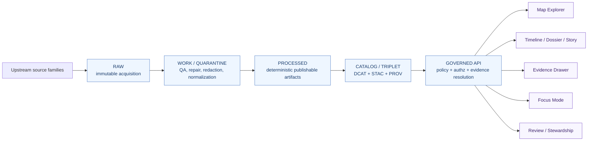

<!-- [KFM_META_BLOCK_V2]
doc_id: kfm://doc/TBD-VERIFY-root-readme-uuid
title: Kansas Frontier Matrix
type: standard
version: v1
status: review
owners: TBD (verify ./.github/CODEOWNERS)
created: YYYY-MM-DD (verify first commit date)
updated: 2026-03-18
policy_label: public
related: [./CONTRIBUTING.md, ./.github/README.md, ./SECURITY.md, ./docs/, ./contracts/, ./schemas/, ./policy/, ./data/, ./tests/]
tags: [kfm, root-doc, governance, evidence-first, map-first, trust-system]
notes: [Root README revision candidate; doc_id, owners, created date, active CODEOWNERS state, live repo topology, and branch-local implementation details still require verification against repo metadata and the active branch.]
[/KFM_META_BLOCK_V2] -->

# Kansas Frontier Matrix

Governed, evidence-first, map-first, time-aware monorepo for Kansas spatial evidence, publication, and trust-visible product surfaces.

> **Status:** Experimental  
> **Owners:** TBD — verify in [`.github/CODEOWNERS`][codeowners]  
>        
> **Quick jumps:** [Scope](#scope) · [Repo fit](#repo-fit) · [Accepted inputs](#accepted-inputs) · [Exclusions](#exclusions) · [Directory tree](#directory-tree) · [Quickstart](#quickstart) · [Usage](#usage) · [Diagram](#diagram) · [Operating tables](#operating-tables) · [Task list](#task-list--definition-of-done) · [FAQ](#faq) · [Appendix](#appendix)  
> **Repo fit:** `/README.md` — root operating index for doctrine, navigation, and verification-first onboarding.

> [!IMPORTANT]
> This file is intentionally conservative. Treat it as the repo-root operating index, not as proof that every contract, workflow, route, or deployment profile is already live on the active branch.

| At a glance | Operating rule |
|---|---|
| Truth path | `Source edge → RAW → WORK / QUARANTINE → PROCESSED → CATALOG / TRIPLET → PUBLISHED` |
| Access boundary | Governed APIs, not direct client access to canonical stores or model runtimes |
| Evidence rule | Cite or abstain |
| Release rule | Promotion is a governed state change, not a file copy |
| UI rule | Map-first, time-aware, Evidence Drawer mandatory |

## Scope

This README covers the repo-root identity and operating posture of Kansas Frontier Matrix.

Use it for:

- root-level mission and non-negotiable invariants
- branch-honest navigation across doctrine, contracts, policy, data, testing, apps, and operations
- documented repo-root shape that still needs live-branch verification
- the minimum verification-first path from clone to trustworthy local inspection

Do not use it for:

- normative contract text that belongs in [`./contracts/`][contracts-dir] or [`./schemas/`][schemas-dir]
- full policy rules that belong in [`./policy/`][policy-dir]
- exhaustive domain/source coverage that belongs in [`./docs/`][docs-dir] or the domain atlas
- runtime or deployment claims that have not been re-verified on the active branch

### Evidence posture

| Label | Meaning in this README |
|---|---|
| **CONFIRMED** | Supported by attached KFM doctrine or other directly visible current-session evidence. |
| **INFERRED** | Strongly implied by repeated corpus patterns, but not directly verified against the active branch. |
| **PROPOSED** | Recommended realization or working repo shape consistent with doctrine, but not branch-verified. |
| **NEEDS VERIFICATION** | A likely repo-local fact or path that should be checked on the active branch before being treated as current. |
| **UNKNOWN** | Not supported strongly enough in the current session to state as current repo or runtime reality. |

> [!NOTE]
> The current session exposed the KFM PDF corpus, not a mounted repository checkout. This README therefore preserves doctrine confidently while keeping repo-local implementation details visibly bounded.

[Back to top](#kansas-frontier-matrix)

## Repo fit

**Path:** `/README.md`  
**Role:** Root orientation document and operating index for the Kansas Frontier Matrix repository.

| Direction | Surface | Why it matters |
|---|---|---|
| Upstream | [`./CONTRIBUTING.md`][contributing] | Contribution contract, review discipline, and contributor expectations. |
| Upstream | [`.github/README.md`][github-readme] | GitHub control-plane conventions, workflows, and repo-level automation context. |
| Upstream | [`./docs/`][docs-dir] | Architecture, governance, domain, ADR, and runbook depth. |
| Upstream | [`./contracts/`][contracts-dir], [`./schemas/`][schemas-dir], [`./policy/`][policy-dir] | Machine-checkable contract, schema, and policy surfaces. |
| Downstream | [`./apps/`][apps-dir] | Deployable user- and operator-facing applications. |
| Downstream | [`./packages/`][packages-dir] | Shared reusable modules that support governed execution. |
| Downstream | [`./data/`][data-dir] | Registry, truth-path, catalog, and artifact-bearing data surfaces. |
| Downstream | [`./infra/`][infra-dir] | Deployment, runtime, observability, and operational infrastructure. |
| Downstream | [`./tests/`][tests-dir], [`./tools/`][tools-dir] | Verification harnesses, validators, and support tooling. |

KFM is easiest to understand as a **truth path → catalog / evidence → governed API → trust-visible surface** system. The root README exists to keep that order clear before contributors descend into service-, package-, or domain-specific detail.

[Back to top](#kansas-frontier-matrix)

## Accepted inputs

At repo scale, “accepted inputs” means the source, data, metadata, and governance families KFM is designed to onboard and govern.

| Input family | Examples | Typical landing zone | Why it belongs |
|---|---|---|---|
| Historical tabular data | census extracts, registries, land records, archival tables | `RAW/` → `WORK/` | Supports time-aware joins, county/year baselines, and narrative explanation. |
| Vector geodata | boundaries, parcels, routes, service areas, sites | `RAW/` → `PROCESSED/` | Carries spatial identity into governed publication. |
| Raster geodata | DEMs, land cover, climate grids, scenes, hazard rasters | `RAW/` → `PROCESSED/` | Supports map-first delivery and evidence-linked derivatives. |
| Documentary evidence | archives, newspapers, oral histories, scans, story-support material | source intake → evidence flow | Enables story, dossier, and evidence-bearing publication when rights are clear. |
| Metadata and lineage | STAC, DCAT, PROV, manifests, sidecars, receipts | `CATALOG/` and proof surfaces | Makes discovery, lineage, and evidence resolution operational. |
| Derived analytical artifacts | summaries, model outputs, anomaly layers, released exports | governed processed or derived lanes | Allowed only when source, method, and release linkage remain visible. |
| Validation and review artifacts | QA reports, fixtures, review notes, correction notices | `WORK/`, `docs/`, `tests/` | Governance artifacts are part of the system, not disposable byproducts. |
| Policy-safe civic and infrastructure context | service summaries, generalized facility layers, corridor and service-area context | governed domain lanes | Must remain policy-labeled, precision-aware, and auditable. |

## Exclusions

These do **not** belong in the governed publication path.

| Exclusion | Why it stays out | Where it goes instead |
|---|---|---|
| Secrets, tokens, credentials | Never commit secrets into the repo or artifact path. | Secret manager / environment provisioning |
| Direct client-to-store or client-to-model paths | Breaks the trust membrane and bypasses policy and evidence resolution. | Governed APIs and protected runtime adapters |
| Publishable artifacts without receipts, digests, or catalog closure | Cannot be audited, reproduced, or corrected safely. | `WORK/QUARANTINE` until complete |
| Rights-unclear or sensitivity-unresolved material | Ambiguity must fail closed. | Quarantine, metadata-only handling, redaction, or generalized public-safe derivatives |
| Uncited Story or Focus claims | Violates cite-or-abstain. | Draft or internal review states only |
| Fine-grained restricted location exposure | Risks policy leakage, rights violations, or unsafe precision. | Restricted lanes or generalized public-safe outputs |
| Docs that imply live behavior without proof | Overclaiming weakens trust. | Mark `PROPOSED`, `UNKNOWN`, or `NEEDS VERIFICATION`, then revisit after branch inspection |
| Detached review/admin products that sever geography or evidence context | Breaks the shell model and trust-visible review posture. | Review and stewardship as governed shell variation |

[Back to top](#kansas-frontier-matrix)

## Directory tree

### Documented repo-root shape *(NEEDS VERIFICATION against the active branch)*

```text
Kansas-Frontier-Matrix/
├── .github/
├── apps/
├── configs/
├── contracts/
├── data/
├── docs/
├── examples/
├── infra/
├── migrations/
├── packages/
├── policy/
├── schemas/
├── scripts/
├── tests/
├── tools/
├── CONTRIBUTING.md
├── README.md
├── SECURITY.md
└── ... (other root files and metadata)
```

### Top-level role map

| Path | Repo role |
|---|---|
| [`.github/`][github-dir] | GitHub-side control plane for workflows, templates, review routing, and merge discipline |
| [`./apps/`][apps-dir] | Deployable surfaces: public, expert, steward, API, and worker applications |
| [`./configs/`][configs-dir] | Shared configuration that should remain reviewable and secret-free |
| [`./contracts/`][contracts-dir] | API contracts, vocabularies, and interface surfaces |
| [`./data/`][data-dir] | Registry entries, truth-path data zones, example artifacts, and catalog surfaces |
| [`./docs/`][docs-dir] | Architecture, governance, domain, ADR, diagram, and runbook documentation |
| [`./examples/`][examples-dir] | Safe example inputs, payloads, or demo materials |
| [`./infra/`][infra-dir] | Runtime, deployment, observability, and infrastructure-as-code surfaces |
| [`./migrations/`][migrations-dir] | Schema, data, contract, or runtime migration work |
| [`./packages/`][packages-dir] | Shared modules and reusable governed logic |
| [`./policy/`][policy-dir] | Policy bundles, fixtures, and policy tests |
| [`./schemas/`][schemas-dir] | Validation schemas for contracts, artifacts, and publishable objects |
| [`./scripts/`][scripts-dir] | Automation entrypoints, helpers, and execution scaffolding |
| [`./tests/`][tests-dir] | Unit, contract, policy, integration, runtime, and end-to-end verification |
| [`./tools/`][tools-dir] | Validators, CLIs, link checkers, and support tooling |

### What remains `UNKNOWN` or `NEEDS VERIFICATION`

- exact live repo tree and root file set
- exact schema registry layout and current contract inventory
- exact workflow inventory under `.github/workflows`
- exact deployment overlays, runtime topology, and observability depth
- exact mounted route tree, DTO set, and proof-object emission coverage

[Back to top](#kansas-frontier-matrix)

## Quickstart

The safest root-level quickstart is **verification-first**, not assumption-first.

```bash
# identify the exact revision you are reviewing
git rev-parse HEAD

# inspect the repo root and near-root shape
find . -maxdepth 2 -type d | sort

# inspect GitHub control-plane files
find .github -maxdepth 3 -type f 2>/dev/null | sort
ls -la .github/workflows 2>/dev/null || true

# inspect likely contract, schema, policy, and test surfaces
find contracts policy schemas tests -maxdepth 3 -type f 2>/dev/null | sort

# inspect documentation and data-facing surfaces
find docs data -maxdepth 3 -type f 2>/dev/null | sort | sed -n '1,200p'

# inspect evidence and policy vocabulary pressure
grep -RIn "EvidenceRef\\|EvidenceBundle\\|spec_hash\\|policy_label\\|RuntimeResponseEnvelope" . || true
grep -RIn "DCAT\\|STAC\\|PROV\\|release_manifest\\|run_receipt\\|quarantine" . || true

# inspect map/surface and thin-slice clues if present
grep -RIn "Map Explorer\\|Evidence Drawer\\|Focus Mode\\|hydrology" . || true
```

> [!TIP]
> Run the inspection loop above before upgrading any implementation-shaped statement from `PROPOSED` or `UNKNOWN` to `CONFIRMED`.

<details>
<summary>Illustrative local-first contributor flow (use only where analogous targets actually exist)</summary>

```bash
make bootstrap
make validate-schemas
make test
make dev-up
make sample-ingest SOURCE=example_fixture
make catalog-validate
```

</details>

### Before documenting branch behavior as fact

1. Confirm what exists on this branch now.
2. Confirm which checks actually block merges.
3. Confirm which contracts, policies, and validations are enforced today.
4. Confirm that at least one end-to-end governed slice exists from source admission to evidence-backed public read.
5. Confirm whether public surfaces expose evidence, freshness, and policy-visible negative states rather than hiding them.

[Back to top](#kansas-frontier-matrix)

## Usage

### What KFM is

KFM is:

- a governed spatial evidence system
- a provenance-preserving publication program
- a map-first, time-aware shell over place, chronology, evidence, review, and release state
- a family of coordinated product surfaces that remain behind one trust membrane
- a Kansas-first operating environment for history, environment, land, hazards, and public knowledge
- a platform that can grow into bounded retrieval and AI assistance without weakening the evidence contract

### What KFM is not

KFM is **not**:

- a free-form chatbot
- a dashboard-only GIS stack
- a direct browser-to-database mapping surface
- a graph-first or vector-first authority engine
- a publication path that can skip rights, provenance, review, or release evidence
- a spectacle-first 3D product
- a detached admin console that severs review from geography, time, and evidence

### Non-negotiable invariants

| Invariant | Status | Practical meaning | What must never happen |
|---|---|---|---|
| Truth path | **CONFIRMED doctrine** | Data moves through `Source edge → RAW → WORK / QUARANTINE → PROCESSED → CATALOG / TRIPLET → PUBLISHED`. | Ad hoc publication from transient transforms, notebooks, or unpublished working states |
| Trust membrane | **CONFIRMED doctrine** | Public and role-limited access crosses governed APIs, policy, and evidence resolution. | Direct UI or external access to canonical stores, raw buckets, or model runtimes |
| Cite-or-abstain | **CONFIRMED doctrine** | Story, map, dossier, export, and Focus claims resolve to evidence or abstain. | Plausible uncited output presented as fact |
| Default-deny / fail-closed | **CONFIRMED doctrine** | Unclear rights, unresolved sensitivity, or broken evidence blocks release. | “Best-effort” publication under ambiguity |
| Deterministic identity | **CONFIRMED doctrine** | Comparable inputs and the same spec produce stable identities and digests. | Unstable versions or ambiguous lineage |
| Evidence as interface | **CONFIRMED doctrine** | Evidence must be operationally reachable through resolvable support objects. | Provenance trapped in notes that surfaces cannot reach |
| Documentation as production surface | **CONFIRMED doctrine** | Behavior changes update docs, contracts, examples, diagrams, and runbooks together. | Silent drift between system behavior and written procedure |
| 2D default, 3D conditional | **CONFIRMED doctrine** | 2D remains the default operating surface; 3D carries extra governance burden. | Spectacle-first 3D becoming a parallel truth surface |

### Product surfaces and operating promise

| Surface | Status | What it should answer |
|---|---|---|
| Map Explorer | **CONFIRMED concept** | **Where** |
| Timeline | **CONFIRMED concept** | **When** |
| Dossier | **CONFIRMED concept** | **What matters about this place, feature, or subject** |
| Story | **CONFIRMED concept** | **Why the evidence matters** |
| Evidence Drawer | **CONFIRMED concept** | **What a visible claim rests on** |
| Focus Mode | **CONFIRMED concept** | Natural-language investigation **without bypassing evidence or policy** |
| Review & Stewardship | **PROPOSED packaging** | Inspect, approve, restrict, correct, supersede, or withdraw within the same governed shell |

### Kansas operating lanes at a glance

| Lane | Typical grain | Why it matters early |
|---|---|---|
| Historical and demographic | county-version, county-year, event-time | Establishes time-aware joins and stable place/time scaffolding |
| Hydrology and water | station-time, watershed, raster | Strong public-safe thin-slice candidate |
| Hazards and environment | event-time, county, polygon, raster | High public value with visible governance needs |
| Land and cadastral history | parcel, tract, legal description, PLSS section | Supports land-tenure, settlement, and archival interpretation |
| Archives and heritage | document, place, event-time | Critical for story publication and evidence depth |
| Services and infrastructure context | place, corridor, service area | Useful early, but precision and rights posture must stay explicit |

### Preferred first governed slice

A strong first slice is **hydrology-first**:

1. one released hydrology dataset family with stable source descriptors
2. one map + timeline surface that opens directly into an Evidence Drawer
3. one public-safe dossier or detail path
4. one Focus path that either cites correctly or abstains
5. one visible correction or supersession drill

[Back to top](#kansas-frontier-matrix)

## Diagram


```mermaid
flowchart LR
    A[Upstream source families] --> B[RAW<br/>immutable acquisition]
    B --> C[WORK / QUARANTINE<br/>QA, repair, redaction, normalization]
    C --> D[PROCESSED<br/>deterministic publishable artifacts]
    D --> E[CATALOG / TRIPLET<br/>DCAT + STAC + PROV]
    E --> F[GOVERNED API<br/>policy + authz + evidence resolution]
    F --> G[Map Explorer]
    F --> H[Timeline / Dossier / Story]
    F --> I[Evidence Drawer]
    F --> J[Focus Mode]
    F --> K[Review / Stewardship]

    classDef canon fill:#eef6ff,stroke:#4a78c2,color:#183b6b;
    classDef surface fill:#f8f6ff,stroke:#7c52c7,color:#3e246d;
    class B,C,D,E,F canon;
    class G,H,I,J,K surface;
```

This is the core promise of the repo: every public or role-limited surface remains downstream of acquisition, policy checks, provenance capture, review state, and evidence resolution.

[Back to top](#kansas-frontier-matrix)

## Operating tables

### Truth path and promotion contract

Promotion is not a file copy. It is a governed state transition.

| Gate | Minimum proof | Fail-closed behavior |
|---|---|---|
| Identity and versioning | stable IDs, deterministic hashes/digests, immutable version references | Block on missing, duplicated, or unstable identity |
| Rights and license | rights snapshot, attribution basis, reuse posture | Hold or quarantine when rights are unclear |
| Sensitivity and generalization | policy label, obligations, generalization or redaction plan | Restrict, generalize, or block publication |
| Schema and QA | schema validity, spatial/time/unit checks, domain QC | Route to `WORK/QUARANTINE` on blocking failure |
| Catalog closure | linked DCAT, STAC, and PROV or equivalent closure | Block if metadata and lineage do not resolve coherently |
| Receipt and review | run receipt, decision/review evidence, release inventory | Block if required review or proof objects are absent |
| Release and correction readiness | release manifest / proof pack, rollback and correction hooks | Block promotion until public-safe scope is inspectable and reversible |

### Canonical vs rebuildable rule

| Class | Examples |
|---|---|
| **Canonical / authoritative** | `RAW`, `PROCESSED`, catalog closure objects, review/decision artifacts, release manifests, correction notices |
| **Rebuildable / derived** | tiles, search indexes, vector indexes, graphs, caches, summaries, scenes, denormalized projections |

### Reference implementation profiles

| Profile | Recommended shape | Why it fits |
|---|---|---|
| Local-first development | governed API, relational-spatial core, artifact tree or object storage, policy engine, worker jobs, map-first UI, local/private model runtime behind an adapter | Preserves the trust membrane while staying small and legible |
| Cloud-ready production | versioned object storage, relational-spatial core, policy bundles, governed APIs, separated derived delivery, signed release flow, centralized observability | Keeps the same boundaries while scaling throughput, reliability, and auditability |

[Back to top](#kansas-frontier-matrix)

## Task list / Definition of done

Use this as the minimum repo-root gate list for substantial work.

- [ ] documented implementation evidence baseline exists: repo tree, manifests, schema inventory, workflow inventory, and sample proof objects
- [ ] controlled vocabularies and schemas validate in CI
- [ ] STAC / DCAT / PROV or equivalent closure resolves cleanly
- [ ] policy tests default-deny and cover restricted or generalized scenarios
- [ ] `EvidenceRef`-like citations resolve to policy-safe support objects end to end
- [ ] Map Explorer, Timeline, Dossier, Story, and Focus surfaces expose trust-visible state where relevant
- [ ] Evidence Drawer drill-through works from consequential visible claims
- [ ] story publication requires review state and resolvable citations
- [ ] Focus Mode either cites correctly with audit linkage or abstains
- [ ] observational, documentary, derived, modeled, corrected, and synthesized outputs remain visibly distinct
- [ ] behavior-significant changes update docs, contracts, examples, diagrams, and runbooks
- [ ] rollback, correction, and supersession paths are visible and tested for at least one governed slice

## FAQ

### Why is KFM stricter than a normal map portal?

Because KFM is designed as a **trust system**, not just a presentation layer. Provenance, policy, review, and evidence resolution are runtime obligations, not decoration.

### Why does this README keep saying `UNKNOWN` or `NEEDS VERIFICATION`?

Because repo size and documentation density do not prove runtime governance. Branch-local facts should be verified from the active repo and live artifacts, not inferred from persuasive prose.

### Why are Evidence Bundles, catalogs, and receipts treated as first-class?

Because discoverability, reproducibility, review, and public trust depend on resolvable metadata and lineage, not just attractive maps or fluent answers.

### Why keep observed, documentary, derived, modeled, and AI-synthesized outputs distinct?

Because KFM must preserve the difference between what was observed, what was recorded, what was derived, what was simulated, and what was synthesized for explanation.

### Why start with a narrow slice?

Because one fully governed slice proves the architecture honestly. Many half-governed features only prove that governance was bypassed.

### Why is 2D the default operating surface?

Because 2D keeps geography, chronology, evidence, and state easier to govern. 3D is allowed only when it adds real explanatory value and still returns users to the same evidence flow.

[Back to top](#kansas-frontier-matrix)

## Appendix

<details>
<summary>Open the root-doc verification appendix</summary>

### Baseline authority for this README

This README is aligned to the co-primary doctrinal posture used across the March 2026 KFM corpus: governing doctrine first, recent realization overlays second, supporting technical consequence manuals third, and active-branch evidence above all implementation-shaped prose when direct repo inspection becomes available.

### Inspection basis used for this revision

This revision used:

- the attached March 2026 KFM doctrine, realization, verification, delivery, tooling, UI, data, and source-of-truth manuals
- direct current-session inspection of the accessible workspace, which exposed PDF artifacts only
- documented repo-root and workflow expectations from the corpus, treated as branch-verification targets rather than live fact

### Next repo surfaces to inspect

- [`.github/README.md`][github-readme]
- [`./CONTRIBUTING.md`][contributing]
- [`./docs/`][docs-dir]
- [`./contracts/`][contracts-dir]
- [`./schemas/`][schemas-dir]
- [`./policy/`][policy-dir]
- [`./tests/`][tests-dir]
- [`./infra/`][infra-dir]

### Root README maintenance rule

Keep this file focused on:

- repo identity
- top-level navigation and boundaries
- non-negotiable invariants
- documented repo shape plus verification boundary
- the minimum governed quickstart
- definition-of-done signals that help reviewers reject overclaiming early

Push deep schema catalogs, route trees, domain atlases, and environment-specific runbooks into their owning docs once those files exist and are verified.

[Back to top](#kansas-frontier-matrix)

</details>

[codeowners]: ./.github/CODEOWNERS
[contributing]: ./CONTRIBUTING.md
[github-readme]: ./.github/README.md
[github-dir]: ./.github/
[apps-dir]: ./apps/
[configs-dir]: ./configs/
[contracts-dir]: ./contracts/
[data-dir]: ./data/
[docs-dir]: ./docs/
[examples-dir]: ./examples/
[infra-dir]: ./infra/
[migrations-dir]: ./migrations/
[packages-dir]: ./packages/
[policy-dir]: ./policy/
[schemas-dir]: ./schemas/
[scripts-dir]: ./scripts/
[tests-dir]: ./tests/
[tools-dir]: ./tools/