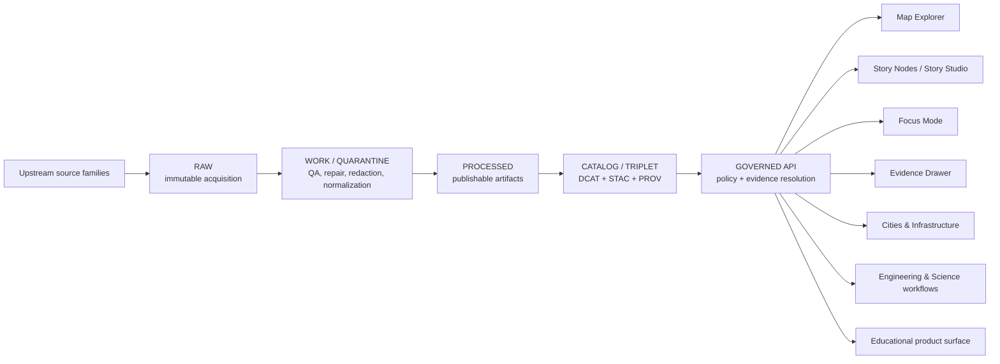
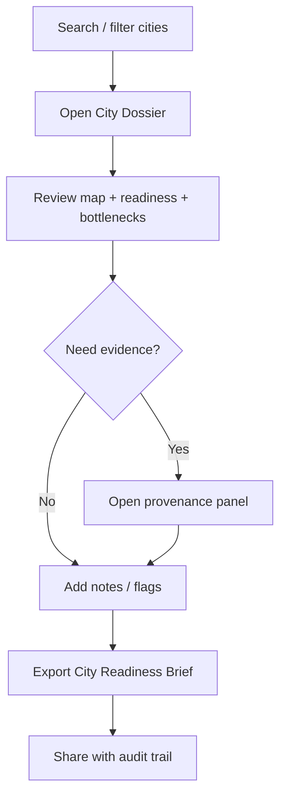
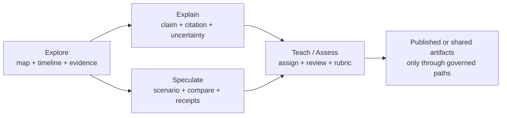

<!-- [KFM_META_BLOCK_V2]
doc_id: kfm://doc/readme-root-v2
title: Kansas Frontier Matrix
type: standard
version: v1
status: draft
owners: TBD (verify CODEOWNERS)
created: 2026-03-06
updated: 2026-03-07
policy_label: public
related: [/.github, /apps, /contracts, /data, /docs, /infra, /packages, /policy, /schemas, /tests, /tools]
tags: [kfm, readme, governance, evidence, gis, provenance, cities, infrastructure, education]
notes: [Repo-root README aligned to the KFM manual corpus, the attached Cities & Infrastructure design material, and the broader GIS/metadata/UI/engineering source library. Domain-vertical and classroom-facing material below is intentionally labeled PROPOSED unless separately verified in the current branch.]
[/KFM_META_BLOCK_V2] -->

<a id="top"></a>

# Kansas Frontier Matrix
Governed, evidence-first infrastructure for exploring Kansas through place, time, narrative, analysis, inspectable evidence, and evidence-linked decision support.

> **Status:** draft  
> **Owners:** TBD (`verify CODEOWNERS`)  
>       
> **Quick links:** [Purpose](#purpose) · [Repo fit](#repo-fit) · [Evidence posture](#evidence-posture) · [Non-negotiables](#non-negotiables) · [Reference flow](#reference-flow) · [Product surfaces](#product-surfaces) · [Cities & Infrastructure](#cities--infrastructure-product-surface-proposed) · [Educational surface](#educational-product-surface-proposed) · [Engineering & Science](#engineering--science-workflows-proposed) · [Accepted inputs](#accepted-inputs) · [Current repo posture](#current-repo-posture) · [Quickstart](#quickstart) · [Source alignment](#source-library-integration-map)

## Purpose
KFM is a **map-first, time-aware, policy-governed knowledge system** for Kansas. It turns heterogeneous sources—historical records, maps, narrative evidence, environmental data, remote sensing, civic and infrastructure layers, derived analytics, and governed AI assistance—into inspectable public surfaces without losing provenance.

KFM is also designed to support **evidence-linked public learning, analytical work, and decision support** without weakening the same trust controls that govern research and publication surfaces.

**CONFIRMED**
- KFM is designed as a **governed, evidence-first, map-first, and time-aware** system.
- Public-facing access is intended to cross a **trust membrane** through governed APIs and policy checks.
- User-visible claims are expected to resolve to **EvidenceRefs / EvidenceBundles** or the system must **abstain**.

**PROPOSED**
- This README acts as the repo-root contract for how those ideas should shape the monorepo, contributor behavior, and the first buildable vertical slices.
- KFM should support not only historical/environmental exploration, but also a governed **Cities & Infrastructure** vertical with city dossiers, infrastructure browsing, provenance panels, policy-gated restricted layers, and exportable readiness briefs.
- KFM can support a governed **educational product surface** with evidence-linked exploration, constrained story authoring, and explicitly labeled speculative scenario work.
- KFM can support governed **Engineering & Science** workflows for simulation, modeling, and scenario comparison, provided those outputs remain provenance-bearing, reviewable, and clearly separated from observational facts.

**UNKNOWN**
- Current branch implementation depth, deployed services, exact CI rules, merge-blocking checks, and the extent of any Cities & Infrastructure, educational, or Engineering & Science implementation are not proven by this file alone and must be verified locally.

## Repo fit
**Path:** `/README.md`  
**Repo role:** root orientation document for the entire monorepo.  
**Upstream:** source systems, connectors, ingestion jobs, normalization pipelines, policy decisions, documentation standards, and domain-specific source registries.  
**Downstream:** Map Explorer, Timeline, Story Nodes, Evidence Drawer, Focus Mode, Engineering & Science workflows, and any future governed Cities & Infrastructure or educational surface.

KFM should be read as a **pipeline → catalog → API → UI** system, not as a loose set of apps. The repo root is where contributors should learn the operating model before they descend into specific services or directories.

## Evidence posture
KFM uses three truth labels throughout docs and code-adjacent planning:

| Label | Meaning here |
|---|---|
| **CONFIRMED** | Supported by the uploaded KFM manuals or the strongest attached product-design documents. |
| **PROPOSED** | Recommended implementation posture or domain extension synthesized from the attached source library. |
| **UNKNOWN** | Not yet verified on the current branch, environment, or deployment. |

This README deliberately prefers **visible uncertainty over plausible fiction**.

## What KFM is
KFM is:
- a governed geospatial platform
- a provenance-preserving data pipeline
- a catalog and evidence-resolution system
- a set of user surfaces for map, time, story, and governed question answering
- a foundation for Kansas historical, environmental, civic, and analytical work
- a **possible planning-grade city/infrastructure decision surface** when those workflows stay inside the same governance boundary
- a **possible instructional and public-learning surface** when educational workflows stay inside the same governance boundary

KFM is **not**:
- a free-form chatbot
- a generic upload-and-forget data portal
- a direct browser-to-database GIS stack
- a publication path that can skip rights, sensitivity, validation, or provenance checks
- a repo where docs can drift away from behavior without consequence
- a one-off city dashboard that bypasses catalog, graph, policy, or provenance contracts
- a classroom simulation toy that treats speculative outputs as settled fact

## Non-negotiables
The following are architectural laws, not stylistic preferences.

| Invariant | Status | What it means in practice | What must never happen |
|---|---|---|---|
| Truth path | CONFIRMED | Data moves through `RAW → WORK/QUARANTINE → PROCESSED → CATALOG/TRIPLET → PUBLISHED`. | Ad hoc publication from notebooks, temp files, or analyst-only transforms. |
| Trust membrane | CONFIRMED | Clients do not touch storage or databases directly; all access crosses governed APIs plus policy. | UI or external clients bypassing policy via direct store access. |
| Cite-or-abstain | CONFIRMED | Story claims, map claims, briefs, and Focus answers resolve to evidence or abstain. | Plausible uncited output presented as fact. |
| Default-deny / fail-closed | CONFIRMED | Unclear rights, unresolved sensitivity, failed validation, or broken evidence blocks release. | “Best effort” publication under ambiguity. |
| Deterministic identity | CONFIRMED | Comparable inputs and the same spec yield the same stable identity and spec hash. | Unstable versions or ambiguous lineage. |
| Evidence as interface | CONFIRMED | Evidence is operational and resolvable, not decorative. | Provenance trapped in dead files or disconnected notes. |
| Separation of duty | CONFIRMED | Submission and policy-significant approval cross a review boundary. | Self-approval of sensitive releases. |
| Docs as production surface | CONFIRMED | Behavior changes update docs, templates, tests, and runbooks together. | Silent drift between system behavior and written procedure. |
| Fact / speculation boundary | PROPOSED | Educational and simulation-facing outputs must visibly distinguish baseline fact from modeled projection. | Scenario output presented as confirmed history or observed reality. |
| Governance-by-default for civic/infrastructure data | PROPOSED | Sensitive city/infrastructure layers must be policy-gated, auditable, and redactable when needed. | Fine-grained restricted layers exposed publicly because the UX “needed it.” |
| Minimal learner-data posture | PROPOSED | Classroom-facing workflows should minimize collection, prefer pseudonymous identifiers, and export artifacts without building unnecessary permanent profiles. | Educational convenience driving unnecessary identity capture or silent telemetry growth. |

## Reference flow
Promotion is not a file copy. It is a governed state transition.


```mermaid
flowchart LR
    A[Upstream source families] --> B[RAW<br/>immutable acquisition]
    B --> C[WORK / QUARANTINE<br/>QA, repair, redaction, normalization]
    C --> D[PROCESSED<br/>publishable artifacts]
    D --> E[CATALOG / TRIPLET<br/>DCAT + STAC + PROV]
    E --> F[GOVERNED API<br/>policy + evidence resolution]
    F --> G[Map Explorer]
    F --> H[Story Nodes / Story Studio]
    F --> I[Focus Mode]
    F --> J[Evidence Drawer]
    F --> K[Cities & Infrastructure]
    F --> L[Engineering & Science workflows]
    F --> M[Educational product surface]
```

## Product surfaces

| Surface | Status | Purpose |
|---|---|---|
| Map Explorer | CONFIRMED | Layered geographic exploration with time controls and evidence access. |
| Evidence Drawer | CONFIRMED | Open evidence, rights, version, and provenance from visible map or story claims. |
| Story Nodes | CONFIRMED | Narrative publishing bound to resolvable citations and review state. |
| Focus Mode | CONFIRMED | Governed Q&A with receipts, citation verification, and abstention behavior. |
| Cities & Infrastructure | PROPOSED | City dossiers, infrastructure browsing, risk/readiness drilldowns, and exportable briefs that stay inside the same evidence and policy plane. |
| Engineering & Science workflows | PROPOSED | Model, simulate, compare, and publish derived analytical outputs without bypassing the same governance boundary. |
| Educational product surface | PROPOSED | Evidence-linked exploration, explanation, constrained speculation, and classroom assessment without bypassing policy, provenance, or fact/speculation boundaries. |

[Back to top](#top)

## Cities & Infrastructure product surface (PROPOSED)
The attached city/infrastructure design work points toward a **planning-grade KFM domain vertical**, not a standalone dashboard. The surface should treat cities as durable **place entities** with repeatable dossiers, and infrastructure as **assets + service areas + systems** that can be layered on maps, summarized in dashboards, and audited back to source datasets and lineage.

### Surface model

| Workspace | Purpose | Trust requirement |
|---|---|---|
| **City Catalog** | Find and compare cities by tier, county, readiness, risk, and freshness. | Every derived score or tier must expose why it exists and what sources it depends on. |
| **City Dossier** | Canonical city page with map, scorecard, bottlenecks, services, assets, and narrative. | Visible facts open into provenance, dates, rights, and quality notes. |
| **Infrastructure Explorer** | Browse assets by category, service areas, and risk overlays. | Restricted layers must be policy-gated and audit-visible. |
| **Dataset Catalog + Story Nodes** | Show what data is being used and turn dossiers into defensible briefs. | Discovery and export must preserve DCAT/STAC/PROV links and citation requirements. |


```mermaid
flowchart TD
    A[Search / filter cities] --> B[Open City Dossier]
    B --> C[Review map + readiness + bottlenecks]
    C --> D{Need evidence?}
    D -->|Yes| E[Open provenance panel]
    D -->|No| F[Add notes / flags]
    E --> F
    F --> G[Export City Readiness Brief]
    G --> H[Share with audit trail]
```

### Frontier-tier discipline
The city/infrastructure design suggests keeping **legal city class** distinct from **functional/infrastructure tier**. The latter should be a computed classification, explainable with citations, rather than a relabeling of statutory city classes.

| Frontier tier | Intended meaning | Example analytic question |
|---|---|---|
| **Metro Core** | Major metro employment and multimodal hub with high redundancy. | Where do cascading failures propagate fastest? |
| **Regional Hub** | Multi-county service center with strong access and anchor institutions. | Which hubs stabilize surrounding frontier areas? |
| **Growth Node** | Emerging node with uneven capacity and capital-project bottlenecks. | What investments unlock near-term constraints? |
| **Service Center** | Rural anchor with thin but essential services and higher single-point-of-failure risk. | Where is single-point-of-failure risk highest? |
| **Frontier** | Sparse service availability and the lowest redundancy. | Where do we prioritize minimum viable service coverage? |

Every tier assignment should surface:
- the indicators used
- the datasets used
- missingness or uncertainty notes
- the last time the tier was computed

### Core domain model
A useful minimum domain split for this vertical is:

| Entity | Why it exists |
|---|---|
| `city` | The canonical place entity: name, boundary, centroid, county links, legal class, frontier tier, rationale, population, last computed date. |
| `infrastructure_asset` | Point/line/polygon asset with typed capacity/condition/status fields, owner/operator, city links, and source dataset ID. |
| `service_area` | The served territory for utilities, water, broadband, or other coverage-bearing systems. |
| `provider` | The operating entity behind a service area. |
| `hazard_indicator` | Risk-bearing measure with geometry, time range, uncertainty, and source dataset ID. |
| `investment_project` | Future or active projects that may change readiness, resilience, or bottlenecks. |
| `dataset` / `asset_collection` | Catalog objects that preserve DCAT/STAC discovery and retrieval semantics. |
| `provenance_activity` | The activity record that links transformations, compute steps, inputs, outputs, and code version. |

### Infrastructure taxonomy
The product surface should standardize infrastructure into a stable taxonomy shared by filters, schemas, datasets, and narrative surfaces.

| System family | Typical examples |
|---|---|
| Transportation | roads, bridges, rail, airports, freight nodes, safety assets |
| Utilities | electric distribution/transmission, gas, telecom |
| Broadband | availability, providers, middle-mile/backhaul indicators |
| Water | public water systems, sources, treatment, wells, surface-water dependencies |
| Energy | generation, substations, transmission |
| Public safety | PSAPs, stations, emergency operations, deployable resources |
| Healthcare | hospitals, clinics, EMS |
| Education | district boundaries, campuses, workforce centers |
| Waste / environment | solid waste sites, landfills, floodplains, wetlands, sensitive habitats |

A practical early slice should bias toward categories that already have repeatable Kansas GIS semantics and public or role-governed update flows, such as **transportation**, **water**, **broadband**, **critical facilities**, and selected **waste/environment** layers.

### First-wave Kansas source priorities (PROPOSED)
The attached city/infrastructure material suggests prioritizing GIS-ready, already-modeled Kansas and federal source families for the first ingestion wave.

| Category | Likely first-wave sources | Why they fit |
|---|---|---|
| Transportation | KDOT asset extracts, KanPlan, TIGER/Line | Repeatable statewide transport geometry and roadway context. |
| Water systems | Kansas Water Office / KRWA / DASC continuity layers | System/service boundaries and resilience context. |
| Broadband | FCC maps, Kansas broadband program context | Coverage and provider questions, with clear caveats about aggregation. |
| Environment / hazards | KDHE public GIS, FEMA/KDA floodplain, NWI wetlands | Strong public GIS semantics and planning relevance. |
| Emergency | KDEM geospatial hubs, critical facility layers | Operational risk context and situational drilldowns. |
| Basemaps / boundaries | DASC, NG911 imagery, Census TIGER/Line, USGS water | Stable geography keys and visual grounding. |

### Representative API strata
A KFM-aligned cities/infrastructure surface should expose **three API strata**, not one undifferentiated endpoint set:

| Stratum | Examples |
|---|---|
| **Catalog APIs** | dataset list, STAC collections/items, freshness and quality views |
| **Domain APIs** | city search, dossier retrieval, asset queries, service-area queries |
| **Narrative / AI APIs** | Story Nodes for city briefs, Focus Mode queries bound to selected city context bundles |

Illustrative endpoints:

```text
GET  /api/v1/catalog/datasets
GET  /api/v1/stac/collections
POST /api/v1/stac/search

GET  /api/v1/cities
GET  /api/v1/cities/{city_id}/dossier
GET  /api/v1/assets
GET  /api/v1/service-areas

GET  /api/v1/provenance/{artifact_id}
POST /api/v1/policy/check
GET  /api/v1/story-nodes
POST /api/v1/briefs/export
POST /api/v1/ai/query
```

### Cities & Infrastructure MVP slice
A credible first slice for this domain vertical is:

- one **City Catalog** with computed Frontier tiers
- one **City Dossier** shell with map, scorecard, bottlenecks, and provenance hooks
- one **Infrastructure Explorer** across a few high-signal categories
- one **provenance panel** that makes the “map behind the map” inspectable
- one exportable **City Readiness Brief**
- one path for **policy-gated restricted layers**
- one **Focus Mode** city briefing flow that still cites or abstains

### Risks that should be designed in early
These should be treated as product and governance concerns, not later cleanup.

| Risk | Why it matters | Preferred mitigation |
|---|---|---|
| Sensitive infrastructure exposure | Fine-grained utility / critical-facility geometry can be harmful if overexposed. | Default-deny, role claims, redacted geometry modes, auditable denials. |
| Coverage and freshness drift | Statewide coverage is uneven across categories and municipalities. | Make freshness and coverage first-class UI dimensions; keep a data-gap register. |
| Identity resolution failures | City, provider, and asset joins will drift across heterogeneous source IDs. | Maintain stable geography keys plus an entity registry and provenance-bearing alias map. |
| Overconfidence in scores | Readiness scores can be mistaken for ground truth. | Expose rationale, uncertainty, and score drivers with citations. |
| Gated source friction | Some Kansas systems require accounts or constrained access. | Support hybrid ingestion: automated public feeds plus explicitly governed credentialed ingestion. |

### KPI ideas for this vertical
A useful KPI set should measure **coverage**, **trust**, **user value**, and **performance**, not usage alone.

| KPI family | Representative examples |
|---|---|
| Coverage & freshness | `% cities with complete dossiers`, `% categories with statewide coverage`, median data age, `% layers with DCAT+STAC+PROV completeness` |
| Trust & governance | `% user-visible facts with resolvable citations`, `# policy denials`, `# blocked/redacted restricted exports`, export audit completeness |
| User value | median time-to-brief, repeat usage by persona, number of briefs exported, number of city comparisons run |
| Performance | p95 map load, p95 dossier load, p95 dense-area asset query time |

## Educational product surface (PROPOSED)
KFM can support a governed learning surface without diluting its evidence-first posture.

The intended instructional surface is best understood as **four coordinated workspaces**:

| Workspace | Purpose | Trust requirement |
|---|---|---|
| **Explore** | Map + timeline + evidence drawer for asking what happened, where, and when. | Any visible value, layer, or claim must open into evidence. |
| **Explain** | Story-authoring workflow for student or teacher explanations. | Claims require citations, and uncertainty or counterevidence must be expressible. |
| **Speculate** | Controlled “what if?” scenario lab. | Outputs must be labeled speculative, reproducible, and separated from baseline fact. |
| **Teach / Assess** | Classroom hub for assignments, supports, and rubrics. | Minimal learner-data collection, role-aware controls, and policy-safe artifact handling. |


```mermaid
flowchart LR
    A[Explore<br/>map + timeline + evidence] --> B[Explain<br/>claim + citation + uncertainty]
    A --> C[Speculate<br/>scenario + compare + receipts]
    B --> D[Teach / Assess<br/>assign + review + rubric]
    C --> D
    D --> E[Published or shared artifacts<br/>only through governed paths]
```

### Learning workspace rules

#### Explore
Explore should remain recognizably KFM:
- map canvas with layers and time controls
- evidence access from every inspectable value
- uncertainty and rights cues in the inspection flow
- no direct client access to raw or unpublished stores

#### Explain
Explain should use constrained authoring, not free-form assertion:
- prompt around a question
- 1–3 evidence-linked claims
- optional counterevidence
- explicit uncertainty note
- publish/share gate that blocks unsupported claims or labels them accordingly

#### Speculate
Speculate is permitted only when KFM keeps the boundary between **historical baseline** and **modeled alternate outcome** unmistakable:
- parameterized inputs
- deterministic and/or stochastic runs
- explicit assumptions
- reproducible run receipts
- visible `Speculative` labeling
- no language implying “what truly would have happened”

#### Teach / Assess
Teach / Assess should support classroom use without turning KFM into a student-data warehouse:
- assign modules
- lock or unlock layers and knobs
- collect reflections or story artifacts
- grade against embedded rubrics
- export results to other systems without requiring maximal user profiling

## Learning data model (PROPOSED)
A governed educational or public-learning extension should stay split into three lanes:

| Layer | Core entities | Purpose |
|---|---|---|
| Evidence-first data layer | `dataset`, `dataset_version`, `asset`, `metric`, `spatial_unit`, `time_period`, `observation`, `evidence_ref`, `evidence_bundle` | Preserve the canonical observation cube and evidence resolution model. |
| Scenario layer | `scenario`, `parameter_set`, `scenario_run`, `run_output` | Support reproducible speculation without confusing runs with historical observations. |
| Teaching / learning layer | `lesson_module`, `assignment`, `rubric`, `student_artifact` | Hold pedagogy and classroom artifacts separately from canonical facts. |

At minimum, KFM should preserve the distinction between:
- **observation**
- **derived analytic output**
- **scenario run**
- **student artifact**

## Engineering & Science workflows (PROPOSED)
Engineering and scientific analysis should remain **inside the same governance plane**, not beside it. Simulation services, notebooks, and analytical pipelines are allowed to be computationally rich, but they do not get a provenance or policy exemption.

### Operating rule
Engineering & Science outputs should be treated as:

| Artifact class | Minimum requirement |
|---|---|
| Parameter set | versioned input definition with named assumptions |
| Scenario run | seed / model version / execution receipt / inputs / outputs |
| Derived layer | source links, derivation history, uncertainty note, promotion state |
| Comparative report | baseline vs scenario distinction, citations, reproducibility metadata |
| Published analytical surface | same policy, rights, and evidence gates as any other KFM output |

### Modeling tiers
A staged modeling posture fits KFM better than one monolithic simulation engine:

| Tier | Status | Description |
|---|---|---|
| Tier A | PROPOSED | Deterministic rule-based modeling for transparent introductory analysis. |
| Tier B | PROPOSED | Stochastic / Monte Carlo simulation for uncertainty-aware distributions. |
| Tier C | PROPOSED | Agent-based or system-dynamics modeling for advanced emergent-behavior work. |

### Domain-fit examples
Engineering & Science work can eventually power:
- capacity and redundancy analysis for city/infrastructure systems
- hazard overlays and resilience scoring
- environmental trend comparison
- scenario comparison reports for public learning or planning support

### Hard boundary
Observational, modeled, and AI-synthesized outputs must remain explicitly separated in both data contracts and UI labels.

## Accepted inputs
This repo should accept inputs that can participate in the truth path and evidence model.

| Input type | Examples | Typical landing zone | Notes |
|---|---|---|---|
| Historical tabular data | census slices, land patents, registries, tabular archives | `RAW/` then `WORK/` | Must preserve source metadata and acquisition receipt. |
| Vector geodata | county boundaries, PLSS, routes, parcels, sites, event polygons | `RAW/` then `PROCESSED/` | Standardize schemas and IDs before promotion. |
| Raster geodata | DEMs, land cover, climate grids, satellite scenes, hazard rasters | `RAW/` then `PROCESSED/` | Prefer cloud-friendly formats and stable checksums. |
| Narrative evidence | archival documents, oral histories, newspapers, story drafts | `RAW/` then evidence extraction flow | Rights and sensitivity review may be required before publication. |
| Metadata and lineage records | DCAT, STAC, PROV, sidecars, manifests | `CATALOG/` | Cross-link IDs so EvidenceRefs resolve. |
| Derived outputs | analytics, statistics, anomaly layers, model products | `PROCESSED/` or `WORK/` | Must remain linked to observational basis and derivation history. |
| Validation artifacts | QA reports, accuracy tables, review notes, test fixtures | `WORK/`, `docs/`, `tests/` | These are part of governance, not disposable byproducts. |
| Policy-safe civic / infrastructure assets | city boundaries, service areas, critical-facility summaries, infrastructure indicators, readiness tiers, briefs | governed data lanes | Public vs restricted exposure must be policy-resolved, not implied. |
| Policy-safe educational assets | lesson modules, rubrics, guided tours, Story Card templates, scenario presets | `docs/`, `contracts/`, or governed app assets | Must not bypass policy, provenance, or role controls. |
| Scenario receipts | parameter sets, seeds, model versions, compare summaries | governed runtime artifacts | Must stay clearly separate from canonical historical observations. |

## Exclusions
The following do **not** belong in KFM’s governed publication path.

| Exclusion | Why it stays out | Where it goes instead |
|---|---|---|
| Secrets, tokens, credentials | Never commit secrets to the repo. | Secret managers / environment configuration. |
| Direct client-to-store access patterns | Breaks the trust membrane and bypasses policy. | Governed API routes and policy-aware services. |
| Publishable artifacts without checksums, receipts, and catalog records | Cannot be audited or reproduced. | Keep in `WORK/QUARANTINE` until complete. |
| Uncited story claims or unverified Focus answers | Violates cite-or-abstain. | Draft or failed run outputs; not publishable. |
| Ambiguous-rights or policy-restricted public data | Rights and sensitivity uncertainty must fail closed. | Quarantine, redacted derivative, or metadata-only record. |
| Fine-grained city/infrastructure layers with unresolved exposure risk | Can expose sensitive assets or imply unauthorized precision. | Restricted lanes, generalized geometry, or redacted aggregate views. |
| Documentation that implies live implementation without verification | Breaks trust through overclaiming. | Mark `UNKNOWN`, add verification steps, then update. |
| Classroom or museum outputs that blur fact and speculation | Damages trust and teaches the wrong mental model. | Keep as draft instructional material until labeled and evidenced correctly. |
| Permanent student dossiers or unnecessary learner telemetry | Violates minimal-data posture and creates governance burden. | Prefer pseudonymous, export-first, or local-first artifact handling. |

## Current repo posture
This section is intentionally conservative.

**UNKNOWN**
- I do **not** treat the Cities & Infrastructure surface as current branch fact.
- I do **not** treat the educational product surface as current branch fact.
- I do **not** treat any unverified implementation, city dossier, classroom feature, or deployment package as live merely because it is designed in a source document.
- The exact current root tree, workflow inventory, and build coverage must be verified locally on the active branch.

### Working root layout assumptions
The following root-level shape is a **working assumption** for contributor orientation and should be verified locally before documentation is treated as branch truth:

```text
Kansas-Frontier-Matrix/
├── .github/
├── apps/
├── configs/
├── contracts/
├── data/
├── docs/
├── examples/
├── infra/
├── migrations/
├── packages/
├── policy/
├── schemas/
├── scripts/
├── tests/
├── tools/
├── CHANGELOG.md
├── CODE_OF_CONDUCT.md
├── CONTRIBUTING.md
├── LICENSE
├── README.md
└── SECURITY.md
```

### What each top-level area is for

| Path | Role in the repo |
|---|---|
| `.github/` | GitHub-native control plane for workflows, templates, review routing, and merge discipline. |
| `apps/` | Runnable services and user-facing applications. |
| `configs/` | Shared configuration that should not hard-code secrets. |
| `contracts/` | API contracts, schemas, vocabularies, and machine-enforced interface surfaces. |
| `data/` | Data specs, registries, examples, manifests, and other governed data-facing artifacts. |
| `docs/` | Architecture docs, ADRs, standards, runbooks, and long-form guidance. |
| `examples/` | Safe example material and demonstration assets. |
| `infra/` | Deployment, platform, and operations definitions. |
| `migrations/` | Database or data-structure migrations. |
| `packages/` | Shared libraries and internal core modules. |
| `policy/` | Policy-as-code, fixtures, and policy tests. |
| `schemas/` | Schemas that back validation, ingestion, and contract enforcement. |
| `scripts/` | Automation and helper scripts. |
| `tests/` | Unit, integration, policy, and end-to-end tests. |
| `tools/` | Validators, CLIs, link checkers, and other support tooling. |

**Verification rule:** before writing “the repo does X,” inspect the branch and confirm the relevant code, contract, or CI gate.

[Back to top](#top)

## Quickstart
The safest root-level quickstart is **verification-first**. Before describing anything as implemented, verify the current branch.

```bash
# clone if needed
# git clone https://github.com/bartytime4life/Kansas-Frontier-Matrix.git
# cd Kansas-Frontier-Matrix

# identify the exact revision you are looking at
git rev-parse HEAD

# inspect the top-level and near-top-level shape
find . -maxdepth 2 -type d | sort

# inspect GitHub workflow inventory, if present
find .github -maxdepth 3 -type f | sort
ls -la .github/workflows 2>/dev/null || true

# look for core governance primitives
grep -RIn "spec_hash\|EvidenceRef\|EvidenceBundle\|policy_label\|opa\|rego" . || true

# inspect likely contract and policy surfaces
find contracts policy schemas tests -maxdepth 3 -type f 2>/dev/null | sort

# inspect whether city/infrastructure-specific material exists
grep -RIn "city dossier\|frontier_tier\|service_area\|infrastructure_asset\|readiness brief\|critical facility" . || true

# inspect whether educational or classroom-specific material exists
grep -RIn "Story Studio\|Scenario Lab\|lesson_module\|rubric\|student_artifact\|education" . || true
```

### Answer these questions before documenting the branch as real
1. What exists on this branch?
2. Which checks actually block merges?
3. Which services are implemented versus merely designed?
4. Which contracts, policies, and validations are enforced today?
5. Is any city/infrastructure, educational, or scenario-oriented surface present as code, docs, contracts, or prototypes?
6. Are fact/speculation, privacy, accessibility, and restricted-layer constraints represented in runtime or only in docs?

## Working model for contributors

### Build order
A sensible thin-slice implementation order remains:

1. spec hashing and controlled vocabulary validation
2. catalog validators and link checking
3. policy pack plus fixture tests
4. evidence resolver service
5. dataset registry and discovery endpoints
6. Map Explorer baseline with Evidence Drawer
7. Story publishing with citation gates
8. Focus Mode MVP with evaluation harness
9. Cities & Infrastructure dossier shell after the evidence loop is stable
10. infrastructure browser plus provenance panel
11. readiness brief export and restricted-layer policy
12. educational Explore workspace only after the evidence loop is stable
13. Story Studio authoring only after citation enforcement is buildable
14. deterministic Scenario Lab only after provenance and run receipts exist
15. stochastic / agent-based simulation only after the above proves out

### First-release discipline
Prefer **one fully governed vertical slice** over many half-governed features.

A good opening slice is:
- one time-aware boundary system
- one promoted dataset family
- one map layer that opens evidence
- one public story that resolves every claim
- one Focus flow that cites correctly or abstains

A good **post-core Cities & Infrastructure slice** is:
- one city catalog with transparent tier logic
- one city dossier with provenance hooks
- one infrastructure browser across a few high-signal categories
- one exportable readiness brief
- one restricted-layer denial / redaction path

A good **post-core educational slice** is:
- one guided Explore module
- one structured Story Studio assignment
- one deterministic scenario with visible assumptions
- one run receipt and comparison report
- one rubric that teaches evidence quality rather than only presentation polish

## Domain and source sequencing
The repo should grow outward from trust foundations rather than inward from flashy features.

| Sequence | Status | What to prioritize |
|---|---|---|
| Foundations | CONFIRMED | IDs, catalog triplet, policy, EvidenceRef/EvidenceBundle, one complete truth path. |
| Historical core | CONFIRMED | Census-class sources, land patents, PLSS, rail, and archival narrative evidence. |
| Environmental base | CONFIRMED | Soils, land cover, hydrology, hazards, air, climate context. |
| Cities & infrastructure | PROPOSED | City entities, service areas, critical facilities, transport, water, broadband, readiness/risk layers. |
| Advanced derived layers | PROPOSED | Anomaly models, calibrated remote-sensing products, resilience scoring, simulation overlays, and 3D story surfaces. |
| Instructional / public-learning layer | PROPOSED | Guided tours, Story Studio, constrained scenario workflows, rubric-backed artifacts, and museum/kiosk adaptations. |

## Documentation and contributor discipline
Docs are part of the governed surface, not commentary on the side.

A directory README should, at minimum:
- explain its purpose
- state where it fits in the repo
- define accepted inputs
- define exclusions

Behavior changes should update:
- contracts
- docs
- tests
- runbooks
- examples or fixtures when relevant

The repo root README should remain conservative:
- verify before upgrading `UNKNOWN` or `PROPOSED` to `CONFIRMED`
- preserve the trust labels
- prefer relative links
- include diagrams where they clarify the operating model
- treat link checking and contract drift as real engineering work

## Engineering rules
1. Make **small, reversible, additive** changes.
2. Update docs when behavior changes.
3. Treat contracts as production artifacts.
4. Promote data only with receipts, checksums, validation, and catalog links.
5. Fail closed on policy, validation, or evidence uncertainty.
6. Keep UI and external clients behind the governed boundary.
7. Preserve observational versus modeled distinctions in data products.
8. Never let convenience outrun provenance.
9. Never let planning convenience outrun the governance model for sensitive civic/infrastructure layers.
10. Never let educational convenience outrun the fact/speculation boundary.
11. Prefer explicit uncertainty and assumptions over polished but misleading outputs.
12. Treat governance, contract enforcement, provenance, and QA as **mandatory engineering**, not optional polish.

## Definition of done / promotion checklist
Use this as the minimum repo-root gate list for serious work.

- [ ] Spec hashing is stable across environments for comparable inputs.
- [ ] Controlled vocabularies and schemas validate in CI.
- [ ] DCAT/STAC/PROV links resolve and broken links block merges.
- [ ] Policy tests default-deny and cover known restricted scenarios.
- [ ] EvidenceRefs resolve to policy-safe EvidenceBundles end to end.
- [ ] Map Explorer shows evidence, version, and rights information from the UI.
- [ ] Story publication requires review state and resolvable citations.
- [ ] Focus Mode either cites correctly with receipts or abstains.
- [ ] Rights and sensitivity labels are present for publishable data.
- [ ] Observational, derived, and speculative outputs are clearly separated.
- [ ] Cities & Infrastructure outputs (if present) expose tier rationale, freshness, and provenance.
- [ ] Restricted city/infrastructure layers (if present) are auditable, role-aware, and deny cleanly.
- [ ] Scenario outputs (if present) are labeled speculative, reproducible, and assumption-bearing.
- [ ] Accessibility and privacy requirements are defined for any public-learning or classroom-facing surface.
- [ ] Runbooks and docs were updated alongside behavior changes.

## FAQ

### Why is KFM stricter than a normal map portal?
Because KFM is intended to be a **trust system**, not just a presentation layer. It treats provenance, policy, and evidence as runtime requirements.

### Why is the README careful about saying `UNKNOWN`?
Because the repo can change faster than architecture prose. KFM’s own operating posture rejects unsupported claims about live implementation state.

### Why are catalogs and evidence objects treated as first-class?
Because discovery, reproducibility, review, and public trust all depend on resolvable metadata and lineage, not just on attractive maps.

### Why keep observational data distinct from modeled or AI-derived outputs?
Because KFM must preserve the difference between what was observed, what was inferred, what was simulated, and what was synthesized.

### Why is the first release intentionally narrow?
Because one fully governed slice proves the architecture honestly. Many half-governed slices only prove that governance was bypassed.

### Why add a Cities & Infrastructure surface?
Because the attached design work shows a credible way to turn KFM into a planning-grade, map-first decision surface without weakening the evidence contract: city dossiers, infrastructure browsing, provenance panels, readiness briefs, and restricted-layer governance all fit the same trust model.

### Can KFM support planning and infrastructure analytics?
Yes, but only inside the same policy/provenance boundary. Forecasts, network optimization, resilience scoring, and scenario models are useful only if their assumptions, inputs, lineage, and restrictions remain inspectable.

### Why add an educational product surface at all?
Because a governed learning surface can widen public understanding and classroom use **without** weakening the evidence contract—provided instructional workflows keep evidence resolution, provenance, privacy, accessibility, and fact/speculation separation intact.

### Can KFM support scenario-based historical or civic learning?
Yes, but only as **PROPOSED**, explicitly speculative, reproducible, and evidence-linked modeling—not as a license to present alternate history or projected civic futures as fact.

## Source library integration map
This README is rooted in the uploaded KFM manual corpus, and it now also absorbs the newly attached Cities & Infrastructure design work. The rule remains simple: **the KFM manuals define project posture; domain designs and the broader attached library inform implementation patterns, not live-repo claims.**

<details>
<summary><strong>A. Governing KFM project sources</strong></summary>

| Source | How it informs this README |
|---|---|
| `KFM_Unified_Master_Manual_FULL.pdf` | Reinforces the integrated operating model: trust membrane, truth path, narrow first release boundary, evidence-first runtime surfaces, and governed analytical extensions. |
| `KFM_Comprehensive_Master_Documentation_Compendium_v1.pdf` | Provides the clearest line on editorial discipline, release gating, traceable evidence, and the deliberately small first production slice. |

</details>

<details>
<summary><strong>B. Cities & Infrastructure domain design</strong></summary>

| Source | How it informs this README |
|---|---|
| `Cities and Infrastructure Product Surface for the Kansas Frontier Matrix.pdf` | Introduces the city dossier model, computed Frontier tiers, infrastructure taxonomy, STAC/DCAT/PROV-backed civic discovery, policy-gated restricted layers, readiness briefs, and a catalog+graph+API+UI framing. |
| `Kansas Frontier Matrix – Cities & Infrastructure Product Surface.pdf` | Adds complementary stakeholder, data-layer, analytics, roadmap, and UX ideas for the same domain vertical, with emphasis on Kansas/federal source families and planning-grade workflows. |

</details>

<details>
<summary><strong>C. Metadata, provenance, time, and linked-data posture</strong></summary>

| Source | How it informs this README |
|---|---|
| `Introduction to Metadata.pdf` | Reinforces metadata as an enduring asset, not an afterthought. |
| `Practical Semantic Web and Linked Data Applications.pdf` | Supports graph-aware, linked, interoperable catalog and provenance thinking. |
| `developing-time-oriented-database-applications-in-sql.pdf` | Strengthens time-aware schema and temporal-query posture. |
| `Reverse Engineering of Real-Time System Models from Event Trace Recordings.pdf` | Informs traceability, model reconstruction, and evaluation thinking for governed analytical workflows. |

</details>

<details>
<summary><strong>D. GIS, cartography, geospatial databases, and planning support</strong></summary>

| Source | How it informs this README |
|---|---|
| `a-primer-of-gis-fundamental-geographic-and-cartographic-concepts.pdf` | Supports map-first framing and geographic representation discipline. |
| `GIS in Sustainable Urban Planning and Management.pdf` | Informs planning-support, equity-aware, and management-oriented GIS thinking. |
| `mastering-postgis-modern-ways-to-create-analyze-and-implement-spatial-data.pdf` | Supports PostGIS-centered geospatial persistence and processing posture. |
| `Earth, Space, and Environmental Science Explorations with ArcGIS Pro ed2.pdf` | Adds applied GIS analysis and environmental workflow patterns. |
| `Understanding_Map_Projections.pdf` | Strengthens projection awareness and cartographic correctness. |
| `Map Reading & Land Navigation.pdf` | Reinforces practical wayfinding, coordinates, and field-orientation awareness. |
| `Cloud-Based Remote Sensing with Google Earth Engine-Fundamentals and Applications.pdf` | Supports cloud-scale remote sensing, analysis-ready imagery, and modern EO workflows. |

</details>

<details>
<summary><strong>E. Data engineering, analytics, machine learning, and AI</strong></summary>

| Source | How it informs this README |
|---|---|
| `The Data Engineering Cookbook.pdf` | Informs practical data plumbing, repeatable pipelines, and operations thinking. |
| `Open-Source-Data-Pipelines-red-hat-developer-1.pdf` | Supports pipeline-oriented architecture decisions. |
| `Practical-Guide-to-Pandas-for-Data-Science.pdf` | Helps shape pragmatic tabular analysis and data cleaning posture. |
| `Text Mining with R_ A Tidy Approach.pdf` | Informs corpus mining and narrative extraction possibilities. |
| `Data Mining Concepts & applictions.pdf` | Adds clustering, classification, anomaly detection, and pattern-discovery perspective. |
| `python-machine-learning-a-crash-course-for-beginners-to-understand-machine-learning-artificial-intelligence-neural-networks-and-deep-learning-with-scikit-learn-tensorflow-and-keras.pdf` | Supports ML experimentation language around regression, classification, and validation. |
| `AI_Concepts_Using_Python.pdf` | Adds general AI concept framing for the analytics layer. |
| `Introduction to Python for Computational Science and Engineering - book.pdf` | Strengthens scientific computing posture and numerical experimentation. |

</details>

<details>
<summary><strong>F. Web, UI, API, frontend, and interaction design</strong></summary>

| Source | How it informs this README |
|---|---|
| `Undisturbed REST_v1.pdf` | Supports API-first, long-lived, governed interface design. |
| `Programming TypeScript.pdf` | Supports strongly typed frontend and backend contract work. |
| `fullstack-react-the-complete-guide-to-reactjs-and-friends.pdf` | Informs React-based UI architecture and component thinking. |
| `fullstack-react-with-typescript.pdf` | Adds React + TypeScript integration patterns. |
| `Building User Interfaces for Modern Web Applications_ React Programming.pdf` | Supports modern component-based web UI composition. |
| `designing-interfaces.pdf` | Reinforces interface patterns, progressive disclosure, dashboard clarity, and scanability. |
| `learn-to-code-html-and-css-develop-and-style-websites.pdf` | Grounds basic web structure and presentation layer thinking. |
| `create-graphical-user-interfaces-with-python.pdf` | Adds approachable GUI composition ideas for utilities or internal tools. |
| `Developing Graphics Frameworks with Python & OpenGL.pdf` | Informs richer visualization and future graphics-heavy work. |

</details>

<details>
<summary><strong>G. Software architecture, engineering discipline, and implementation literacy</strong></summary>

| Source | How it informs this README |
|---|---|
| `97_Things_Every_Programmer_Should_Know.pdf` | Reinforces code hygiene, build cleanliness, and practical engineering habits. |
| `97-things-every-software-architect-should-know.pdf` | Strengthens boundary thinking, tradeoff awareness, and architecture stewardship. |
| `design-it-from-programmer-to-software-architect.pdf` | Supports risk-driven architecture, stakeholder empathy, and design documentation. |
| `Crafting a Compiler.pdf` | Reinforces contracts, staged transformation, and validation as engineering behavior. |
| `mostly-adequate-guide to functional programming.pdf` | Contributes compositional and functional design discipline. |
| `sketchy-lisp-an-introduction-to-functional-programming-in-scheme-3rd-edition.pdf` | Supports functional thinking and symbolic-processing intuition. |

</details>

<details>
<summary><strong>H. Knowledge posture and long-horizon project culture</strong></summary>

| Source | How it informs this README |
|---|---|
| `Dare to Invent the Future.pdf` | Reinforces the project’s intellectual ambition, public-purpose framing, and builder mindset. |

</details>

[Back to top](#top)

## Notes for maintainers
- Keep this README aligned with the strongest KFM source material.
- Treat Cities & Infrastructure, Engineering & Science, and educational surfaces as **PROPOSED** until the active branch proves otherwise.
- When a claim becomes implementation fact, verify it on the current branch and update the corresponding `UNKNOWN` or `PROPOSED` language.
- When a workflow, contract, surface, or policy changes behavior, update this README as part of the same change.
- If the city/infrastructure vertical ships, ensure the same PR updates restricted-layer handling, freshness/coverage UX, provenance panels, and export audit rules.
- If Scenario Lab or another learning surface ships, ensure the same PR updates privacy, accessibility, run receipts, and fact/speculation labeling rules.
- Do not let a polished README become a hidden policy bypass.