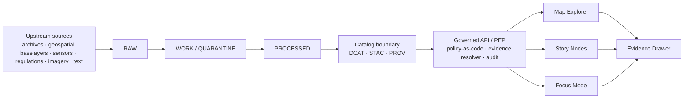

<!-- [KFM_META_BLOCK_V2]
doc_id: kfm://doc/df7426a0-4f44-4c3f-9d91-1d418f4fa4c5
title: Kansas Frontier Matrix (KFM) README
type: standard
version: v1
status: draft
owners: KFM Platform Engineering; TBD verify in CODEOWNERS
created: 2026-03-06
updated: 2026-03-06
policy_label: public
related: [docs/, contracts/, data/, apps/, packages/, policy/, infra/]
tags: [kfm, readme, governance, evidence, maps]
notes: [Generated from uploaded KFM manuals and a live public repo snapshot; deeper repo state remains partially unverified.]
[/KFM_META_BLOCK_V2] -->

# Kansas Frontier Matrix (KFM)
Evidence-first, map-first, time-aware infrastructure for turning governed Kansas data into traceable maps, timelines, Story Nodes, and Focus Mode answers.

<div align="center">

[](#impact)
[](#evidence--governance)
[](#evidence--governance)
[](#product-surfaces)
[](#repository-guide)

</div>

## Impact

| Field | Value |
|---|---|
| Status | draft |
| Owners | KFM Platform Engineering; verify exact ownership in `CODEOWNERS` |
| Policy label | public |
| Repo path | `/README.md` |
| Quick links | [Scope](#scope) · [Where it fits](#where-it-fits) · [Repository guide](#repository-guide) · [Quickstart](#quickstart) · [Architecture](#architecture) · [Minimum honest MVP](#minimum-honest-mvp) · [Definition of done](#definition-of-done) · [FAQ](#faq) |

## Scope

| Status | Statement |
|---|---|
| CONFIRMED | KFM is a governed measurement and narrative platform whose public promise is traceable evidence. |
| CONFIRMED | KFM is map-first and time-aware, but it is not just a map viewer; it is also a narrative system, an evidence system, and a policy-enforced publication system. |
| CONFIRMED | Public-facing AI in KFM is a downstream consumer of governed evidence, not an upstream source of truth. |
| PROPOSED | This root README should be the first-stop onboarding surface for contributors, reviewers, and operators. |
| UNKNOWN | Branch-specific implementation coverage below the top-level tree must be verified before it is documented here as fact. |

## Where it fits

- **Path:** `/README.md`
- **Upstream:** project governance and architecture manuals, issue and planning workflows, and repo metadata.
- **Downstream:** directory READMEs and implementation docs under `.github/`, `apps/`, `contracts/`, `data/`, `docs/`, `packages/`, `policy/`, `infra/`, `tests/`, and `tools/`.
- **Use this file for:** orientation, trust posture, repo navigation, and the smallest honest delivery target.
- **Do not use this file for:** authoritative API schemas, dataset manifests, policy bundles, runbooks, or generated receipts.

## Acceptable inputs

This file may contain:

- high-level purpose and project posture
- repo-wide navigation and directory responsibilities
- MVP framing and release gates
- contributor routing and verification steps
- links to deeper docs and contracts

## Exclusions

This file must not become a dumping ground for:

- dataset catalogs or source registries that belong under `data/`
- OpenAPI or JSON schema definitions that belong under `contracts/` or `schemas/`
- policy code or fixtures that belong under `policy/`
- long-form runbooks or ADRs that belong under `docs/`
- generated evidence bundles, receipts, or build artifacts
- secrets, tokens, or credentials

## Repository guide

### Current top-level tree

**CONFIRMED on the public `main` branch at time of drafting:**

```text
repo/
├── .github/
├── apps/
├── configs/
├── contracts/
├── data/
├── docs/
├── examples/
├── infra/
├── migrations/
├── packages/
├── policy/
├── schemas/
├── scripts/
├── tests/
├── tools/
├── CHANGELOG.md
├── CODE_OF_CONDUCT.md
├── CONTRIBUTING.md
├── LICENSE
├── README.md
└── SECURITY.md
```

### Directory responsibilities

| Path | Status | Intended contents |
|---|---|---|
| `.github/` | CONFIRMED path / PROPOSED role | GitHub-side automation, contribution controls, workflow entrypoints, and merge gates. |
| `apps/` | CONFIRMED path / PROPOSED role | Runnable services such as API, UI, workers, and CLI entrypoints. |
| `configs/` | CONFIRMED path / PROPOSED role | Configuration templates for environments, pipelines, deployments, and UI settings. |
| `contracts/` | CONFIRMED path / PROPOSED role | Public contracts: OpenAPI definitions, schemas, vocabularies, and interface-level guarantees. |
| `data/` | CONFIRMED path / CONFIRMED role | Zone-oriented data surfaces for raw, work, processed, catalog, and registry material. |
| `docs/` | CONFIRMED path / PROPOSED role | Governance docs, architecture notes, ADRs, runbooks, and user guidance. |
| `examples/` | CONFIRMED path / PROPOSED role | Sample datasets, stories, policies, and tutorial fixtures. |
| `infra/` | CONFIRMED path / PROPOSED role | Deployment infrastructure such as Terraform, Kubernetes, GitOps, and monitoring. |
| `migrations/` | CONFIRMED path / PROPOSED role | Schema and storage migration scripts. |
| `packages/` | CONFIRMED path / PROPOSED role | Shared internal libraries such as ingest, catalog, evidence, tiles, and policy helpers. |
| `policy/` | CONFIRMED path / CONFIRMED role | Policy-as-code and fixtures used to enforce the trust membrane. |
| `schemas/` | CONFIRMED path / UNKNOWN role | Exists on the live repo, but its relationship to `contracts/schemas/` should be verified before documentation is tightened. |
| `scripts/` | CONFIRMED path / PROPOSED role | Build, release, promotion, and maintenance scripts. |
| `tests/` | CONFIRMED path / PROPOSED role | Unit, integration, e2e, policy, and data-pipeline verification suites. |
| `tools/` | CONFIRMED path / PROPOSED role | Validators, linters, hashers, catalog helpers, and other support utilities. |

### What belongs where

| Topic | Best home | Why |
|---|---|---|
| API shape | `contracts/` | Keeps public contracts stable and inspectable. |
| Runtime services | `apps/` | Keeps deployment entrypoints separate from shared logic. |
| Shared domain logic | `packages/` | Prevents UI or API code from owning business rules directly. |
| Dataset lifecycle and catalogs | `data/` | Preserves the truth path and promotion model. |
| Governance docs and runbooks | `docs/` | Keeps long-form operational knowledge versioned with the repo. |
| Policy enforcement | `policy/` | Makes authorization and redaction explicit, testable, and reviewable. |
| Deployment definitions | `infra/` | Isolates runtime infrastructure from application code. |

[Back to top](#kansas-frontier-matrix-kfm)

## Quickstart

### Verification-first quickstart

Use this when you first clone the repo or when you need to re-ground documentation in reality.

```bash
# verification-first commands
# adapt as needed for your local environment

git clone https://github.com/bartytime4life/Kansas-Frontier-Matrix.git
cd Kansas-Frontier-Matrix

git rev-parse HEAD
find . -maxdepth 2 -type d | sort
find .github -maxdepth 3 -type f | sort
find contracts -maxdepth 3 -type f | sort || true
find policy -maxdepth 3 -type f | sort || true
find data -maxdepth 3 -type d | sort || true
find tests -maxdepth 3 -type f | sort || true
```

### Three questions to answer before calling anything “done”

1. Which checks are actually merge-blocking on the target branch?
2. Which dataset can complete the full truth path end to end?
3. Which API route resolves evidence for Map Explorer, Story publishing, and Focus Mode?

### Minimal contributor path

```bash
# pseudocode: adapt to the actual toolchain after repo verification
# 1) install dependencies
# 2) run validators and tests
# 3) run API and UI locally
# 4) verify evidence resolution before claiming success

# examples only
make validate
make test
make dev
```

## Architecture


```mermaid
flowchart LR
    A[Upstream sources\narchives · geospatial baselayers · sensors · regulations · imagery · text] --> B[RAW]
    B --> C[WORK / QUARANTINE]
    C --> D[PROCESSED]
    D --> E[Catalog boundary\nDCAT · STAC · PROV]
    E --> F[Governed API / PEP\npolicy-as-code · evidence resolver · audit]
    F --> G[Map Explorer]
    F --> H[Story Nodes]
    F --> I[Focus Mode]
    G --> J[Evidence Drawer]
    H --> J
    I --> J
```

### System posture

| Status | Claim |
|---|---|
| CONFIRMED | KFM begins from upstream sources, preserves durable raw capture, transforms through work/quarantine and processed states, and only then exposes runtime surfaces through a catalog boundary built from DCAT, STAC, and PROV. |
| CONFIRMED | The public must never talk directly to raw or operational stores; the trust membrane is architecture, not a suggestion. |
| CONFIRMED | Map Explorer answers **where**, timeline controls answer **when**, Story surfaces explain **why**, and the Evidence Drawer answers **what a claim rests on**. |
| CONFIRMED | Focus Mode must synthesize from admissible evidence and either return a cited answer with an audit reference or abstain. |
| PROPOSED | The cleanest implementation split is domain → use cases → interfaces → infrastructure, with policy and provenance enforced at the governed API boundary. |

## Evidence & governance

| Invariant | Status | What it means |
|---|---|---|
| Truth path | CONFIRMED | Data moves through `RAW → WORK/QUARANTINE → PROCESSED → CATALOG/TRIPLET → PUBLISHED`. |
| Trust membrane | CONFIRMED | Every public or role-limited request crosses a governed API plus policy boundary. |
| Cite-or-abstain | CONFIRMED | Stories, map values, and Focus answers resolve to evidence or abstain. |
| Default-deny | CONFIRMED | Unknown rights, unresolved sensitivity, or broken evidence blocks release. |
| Deterministic identity | CONFIRMED | Comparable inputs and the same spec produce the same identity and spec hash. |
| Evidence as interface | CONFIRMED | `EvidenceRef` must resolve to a policy-safe `EvidenceBundle`. |
| Docs as production surface | CONFIRMED | Behavior changes update docs, templates, tests, and runbooks together. |

### Promotion gates

| Zone | Status | Purpose | Required promotion artifacts |
|---|---|---|---|
| Raw | CONFIRMED | Immutable source capture | checksums, raw manifest, source license |
| Work | CONFIRMED | Repeatable transformation and QA | PROV activity, intermediate QA reports |
| Processed | CONFIRMED | Query-ready published surface | machine-checkable catalogs, validations, promotion receipts |

### Governed API expectations

| Endpoint family | Status | Minimum expectation |
|---|---|---|
| `/api/v1/evidence/resolve` | CONFIRMED concept | Resolve `EvidenceRef` to `EvidenceBundle` with policy and redaction obligations applied. |
| `/api/v1/datasets` | CONFIRMED concept | Discover datasets and versions with policy filtering. |
| `/api/v1/stac/*` | CONFIRMED concept | Browse imagery/assets through STAC surfaces linked to DCAT and PROV. |
| `/api/v1/story` | CONFIRMED concept | Read/publish Story Nodes only when citations resolve and review state is captured. |
| `/api/v1/focus/ask` | CONFIRMED concept | Return a cited answer plus `audit_ref`, or abstain. |

[Back to top](#kansas-frontier-matrix-kfm)

## Product surfaces

| Surface | Status | What it must do |
|---|---|---|
| Map Explorer | CONFIRMED concept | Layer toggles, legends, time filters, feature inspection, and evidence launch points. |
| Timeline | CONFIRMED concept | Chronology control and change-over-time navigation. |
| Evidence Drawer | CONFIRMED model / PROPOSED packaging | Show source basis, dataset version, rights posture, lineage, checksums, policy label, and safe previews. |
| Story Editor / Reader | CONFIRMED concept / PROPOSED productization | Narrative authoring with citations, map embeds, review states, and publication gating. |
| Focus Mode | CONFIRMED concept / PROPOSED serving stack | Cited-or-abstaining answers with uncertainty framing, evidence links, and `audit_ref`. |
| Review Console | PROPOSED | Promotion approval, policy assignment, QA inspection, and correction workflow. |
| 3D Story Node | PROPOSED optional extension | Temporary 2D→3D narrative shift without creating an uncontrolled second trust surface. |

### Accessibility

| Status | Requirement |
|---|---|
| CONFIRMED | Accessibility is a release gate; keyboard-operable controls and reachable evidence surfaces are part of the product contract. |
| CONFIRMED | Responsive design is mandatory because public users, contributors, stewards, and historians will use different device classes. |

## Minimum honest MVP

**CONFIRMED early release boundary:**

- [ ] one time-aware county-boundary system
- [ ] one census or population slice through the full promotion path
- [ ] one map layer that opens into an Evidence Drawer
- [ ] one public story with valid citations
- [ ] one Focus Mode path that either cites correctly or abstains

If the repo cannot do those five things, it is not ready to claim the architecture works.

## Suggested build order

| Phase | Status | Primary outcome |
|---|---|---|
| Trust foundation | PROPOSED | Lock schemas, spec-hash rules, receipts, promotion gates, one or two anchor domains, and minimal STAC/DCAT/PROV generation. |
| Discover & view | PROPOSED | Stand up catalog discovery, Map Explorer, layer delivery, and evidence inspection. |
| Publish & explain | PROPOSED | Ship story publishing, Focus Mode MVP, and the evaluation harness that enforces cite-or-abstain. |

## Definition of done

Use this as the minimum repo-wide gate for claiming an evidence-native release.

- [ ] A public map value always resolves to a policy-safe `EvidenceBundle`, or the UI explicitly shows insufficient evidence.
- [ ] No public client can query operational stores directly.
- [ ] At least one boundary dataset and one census dataset complete the full truth path into a published API.
- [ ] Promotion fails on missing rights evidence, invalid catalog links, or failing policy tests.
- [ ] Reviewer workflow exists for approval, policy labeling, and quarantine release.
- [ ] Focus Mode returns `answer + citations + audit_ref`, or abstains.
- [ ] Core UX flows pass accessibility review and automated tests.
- [ ] Runbooks exist for source failure, failed promotion, rollback, and backup restore.

## Repository change rules

1. Keep gates fail-closed.
2. Keep permissions narrow.
3. Update docs when behavior changes.
4. Preserve separation of duty.
5. Prefer small, reversible edits.
6. Never bypass policy, provenance, or evidence resolution for convenience.

## FAQ

### Is KFM just a map application?

No. **CONFIRMED:** it is a governed measurement, narrative, evidence, and publication system with map-first and time-aware interaction.

### Can Focus Mode answer from its own model knowledge?

No. **CONFIRMED:** Focus Mode is a downstream consumer of governed evidence and must cite or abstain.

### Are all directory roles in this README verified on the live branch?

No. **CONFIRMED:** the top-level paths are verified on the public `main` branch. **UNKNOWN:** deeper branch-specific contents and some directory responsibilities still need repo inspection before they should be documented as fact.

### Why is the Evidence Drawer treated as a first-class product feature?

Because **CONFIRMED** KFM turns provenance into an inspectable interface rather than a static appendix. If users cannot reach the evidence surface, the trust model exists only on paper.

## <a id="appendix"></a>Appendix

<details>
<summary>Source basis and verification backlog</summary>

### Source basis

This README is grounded in:

- the March 2026 KFM compendium and build manuals for posture, invariants, surfaces, and release boundaries
- the February 2026 data integration blueprint for clean-layer architecture, trust membrane mechanics, and promotion gates
- the current public GitHub repository view for the top-level directory tree on `main`

### Unknowns to verify before tightening this README

- exact branch-specific contents of each top-level directory
- workflow names and required checks under `.github/`
- whether `schemas/` duplicates or complements `contracts/schemas/`
- which API routes are already implemented versus still planned
- which datasets already complete the full truth path end to end
- which tests are merge-blocking versus informational

### Suggested next verification commands

```bash
# verification commands
find . -maxdepth 2 -type d | sort
find .github -maxdepth 3 -type f | sort
find apps -maxdepth 3 -type f | sort | head -n 100
find packages -maxdepth 3 -type f | sort | head -n 100
find data -maxdepth 4 | sort | head -n 200
find contracts -maxdepth 4 | sort | head -n 200
find tests -maxdepth 4 | sort | head -n 200
```

</details>
