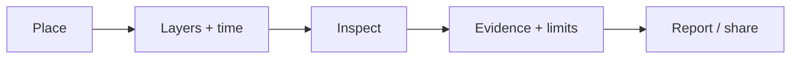

<!-- [KFM_META_BLOCK_V2]
doc_id: kfm://doc/root-readme
title: Kansas Frontier Matrix — Project Home
type: repository-readme
version: v3.1.0
status: repository-grounded draft
owners: ["@bartytime4life"]
created: 2026-05-11
updated: 2026-09-14
policy_label: public
current_path: README.md
owning_root: repository-root
responsibility: repository-wide identity, orientation, contribution, and validation entry point
truth_posture: cite-or-abstain; implementation claims require pinned repository evidence
evidence_snapshot:
  repository: bartytime4life/Kansas-Frontier-Matrix
  base_ref: main
  base_commit: 6c5be18cf8448654be95a6db688d98546cd5276e
related:
  - docs/doctrine/directory-rules.md
  - docs/adr/ADR-0029-adopt-directory-governance-standard-v2.md
  - docs/doctrine/ai-build-operating-contract.md
  - docs/doctrine/lifecycle-law.md
  - docs/doctrine/trust-membrane.md
  - docs/doctrine/truth-posture.md
  - CONTRIBUTING.md
  - SECURITY.md
  - .github/README.md
notes:
  - "Adds a visitor-first project orientation while preserving the governed root README identity."
  - "Current implementation claims are bounded to the exact GitHub snapshot recorded above."
  - "The public Explorer address is linked as a project entry point; hosted availability and version state remain separately verifiable runtime claims."
  - "The Science Pack section is an explicitly proposed north-star profile; it does not claim installation, source admission, model validity, release, deployment, or publication."
[/KFM_META_BLOCK_V2] -->

<p align="center">
  
</p>

# Kansas Frontier Matrix

<p align="center">
  <strong>Make place, time, and evidence easier to explore.</strong><br />
  A governed, map-first spatial knowledge system for Kansas and the surrounding frontier.
</p>

<p align="center">
  <a href="https://kansas-frontier-matrix-explorer.blackbart-55.chatgpt.site"></a>
  <a href="#why-kfm"></a>
  <a href="#the-kfm-experience"></a>
  <a href="#current-posture"></a>
</p>

<p align="center">
  <a href="https://kansas-frontier-matrix-explorer.blackbart-55.chatgpt.site">Open the Explorer</a> ·
  <a href="apps/kansas-frontier-matrix-explorer/README.md">Read the site guide</a> ·
  <a href="CONTRIBUTING.md">Contribute</a> ·
  <a href="SECURITY.md">Report a security concern</a>
</p>

> [!NOTE]
> KFM is an active build. The repository contains real applications, contracts, schemas, policy, validators, fixtures, tests, and workflows. Some production-facing transitions—live renderer admission, live governed transport, release, deployment, and publication—remain explicitly held or unknown.

**New here?** Start with [Why KFM](#why-kfm), [Explore](#start-here), [The KFM experience](#the-kfm-experience), [the Science Pack north star](#a-finished-kfm-with-a-science-pack), or [Current posture](#current-posture). Contributors can jump to [Run locally](#run-locally), [Validation](#validation), and [Contributing](#contributing).

## Why KFM

Most maps answer **where**. KFM is being built to help answer **where, when, what supports the claim, what changed, and what can responsibly be shown**.

The project brings geography, history, natural systems, people, infrastructure, time, and source lineage into one inspectable experience. A map is the doorway—not the authority. A fluent explanation is useful only when it remains downstream of evidence, policy, and review.

| What makes KFM interesting | What that means for a user |
|---|---|
| **Explore connected systems** | Move from a place to layers, time, context, and related evidence instead of browsing isolated pins. |
| **Inspect the claim** | See the source role, evidence reference, time context, correction state, and limits behind a consequential result. |
| **Make uncertainty visible** | Missing, stale, restricted, conflicted, or unsupported information can become an honest abstention—not a confident guess. |
| **Protect what should not be exposed** | Rights, cultural sensitivity, living-person data, rare species, archaeology, infrastructure, and harmful precision are handled conservatively. |
| **Keep the trail recoverable** | Identity, provenance, review, release, correction, and rollback remain part of the system’s design. |

KFM’s public value is not a larger pile of layers. It is a more trustworthy path from **question → place and time → evidence → bounded action**.

## Start here

| If you want to… | Start with… |
|---|---|
| **See the project’s public-facing Explorer** | [KFM Explorer](https://kansas-frontier-matrix-explorer.blackbart-55.chatgpt.site) — the repository records this OpenAI Sites/Vinext project, slug, and public address. Hosted availability and version state require current runtime verification. |
| **Understand the current site application** | [`apps/kansas-frontier-matrix-explorer/`](apps/kansas-frontier-matrix-explorer/) — the single-route Vinext site, synthetic/generalized catalog surface, renderer-neutral shell, fail-closed evidence behavior, and public-safe export boundary. |
| **Study the browser workbench** | [`apps/explorer-web/`](apps/explorer-web/) — a Vite/TypeScript local composition with bounded Map, Knowledge, Features, Trust, Focus, Story, Evidence Drawer, and validation slices. |
| **Learn the project’s rules** | [`docs/doctrine/`](docs/doctrine/), [`docs/architecture/`](docs/architecture/), and [`docs/adr/`](docs/adr/). |
| **Make a change safely** | [`CONTRIBUTING.md`](CONTRIBUTING.md), [`Directory Rules`](docs/doctrine/directory-rules.md), and the README nearest the path you will touch. |
| **Understand evidence and public boundaries** | [`Trust Membrane`](docs/doctrine/trust-membrane.md), [`Truth Posture`](docs/doctrine/truth-posture.md), [`Lifecycle Law`](docs/doctrine/lifecycle-law.md), and [`SECURITY.md`](SECURITY.md). |
| **Find the machine side** | [`contracts/`](contracts/), [`schemas/`](schemas/), [`policy/`](policy/), [`data/`](data/), [`pipelines/`](pipelines/), [`runtime/`](runtime/), and [`tools/`](tools/). |

## The KFM experience

The north-star interaction path is:

**Map → area of interest → layers → time → inspect → evidence → report → share**

This is a product direction, not a claim that every stage is integrated today. Each link in the chain must preserve the distinction between a user interaction, a derived carrier, a supported claim, and a governed action.


```mermaid
flowchart LR
    place["Place"] --> context["Layers + time"]
    context --> inspect["Inspect"]
    inspect --> evidence["Evidence + limits"]
    evidence --> action["Report / share"]
```

The Explorer is intended to make that chain feel natural:

- begin with a place, region, layer, story, or question;
- narrow the spatial and temporal context before making a claim;
- open the evidence and provenance context instead of treating pixels as proof;
- compare or report only what remains within the applicable rights, sensitivity, release, and correction boundaries;
- share a safe, inspectable result—or clearly say why the system cannot.

## Exploration themes

KFM organizes work across connected themes rather than treating each domain as a separate application.

| Living landscapes | History and human stories | Built world and change |
|---|---|---|
| Geology, soil, hydrology, habitat, flora, fauna, atmosphere, and agriculture | Archaeology, settlements, people, genealogy, DNA, and land—subject to stronger privacy, cultural, consent, and stewardship controls | Hazards, roads, rail, trade, infrastructure, and the changing relationship between people and place |

These are exploration and implementation lanes, not a promise that each theme has live, complete, or publishable data. Rights, source terms, stewardship, cultural authority, sensitive geometry, and currentness remain claim-specific.

> [!WARNING]
> Exact archaeological, burial, sacred, rare-species, infrastructure, private-land, living-person, DNA/genomic, and other harmful-precision details are not assumed to be public-safe. KFM defaults to quarantine, redaction, generalization, staged access, delay, abstention, or denial when the required authority is unclear.

## A finished KFM with a Science Pack

> [!IMPORTANT]
> **North-star / PROPOSED.** In this README, a **Science Pack** means a versioned, reviewable capability profile—not a package that is currently installable, configured, admitted, released, or operating end to end. The term does not make a dataset authoritative, a model scientifically valid, or an output public-safe.

Imagine choosing a Kansas watershed, drawing an area of interest, and moving one time control across geological context, historic land change, and current observations. Terrain rises into 3D; soil, water, atmosphere, agriculture, habitat, cities, roads, and rail appear only when their time and support models can be compared honestly. Select a pattern and the Evidence Drawer explains the sources, methods, units, uncertainty, transformations, withheld detail, and correction state. Ask Focus Mode why something changed and it answers from governed evidence—or returns `ABSTAIN`, `DENY`, or `ERROR`.

That is the finished-system possibility: not just a map of Kansas, but an inspectable spatial science workbench.

### What “installed and configured” would have to mean

| State | Minimum meaning | What it does **not** prove |
|---|---|---|
| **Installed** | Pinned pack definition, dependencies, schemas, adapters, and immutable fixture or artifact identities are present. | Source admission, scientific validity, runtime health, or permission to publish. |
| **Configured** | Area, time, CRS and vertical datum, units, source roles, methods, uncertainty, performance budgets, and allowed questions are explicit. | That a source is current, rights-cleared, sensitive-safe, or fit for every claim. |
| **Admitted** | Source, evidence, policy, rights, sensitivity, review, and negative-path gates close for a bounded use. | Release, deployment, or a broader authority than the admitted scope. |
| **Released** | Public-safe artifacts are bound to manifests, proofs, correction lineage, and a tested rollback target. | Permanent correctness; freshness and withdrawal remain operational duties. |
| **Operational** | Governed APIs, Explorer surfaces, observability, expiry, correction, withdrawal, and recovery are verified for an exact release. | Emergency, legal, medical, engineering, or regulatory authority. |

### What it could make possible

| Finished experience | What a person could do | Required truth boundary |
|---|---|---|
| **Kansas through time** | Scrub, compare, or narrate released editions of terrain, waterways, land cover, settlement, roads, rail, and cities without inventing motion between observations. | Every frame retains acquisition/effective time, release identity, gaps, and reconstruction labels. |
| **Watershed and drought laboratory** | Trace a watershed; align precipitation, soil moisture, streamflow, reservoir context, vegetation response, and drought indicators; then export the exact area, interval, methods, and citations. | Station observations, remote sensing, interpolations, forecasts, and scenarios remain distinct. |
| **Terrain-to-subsurface investigation** | Move from LiDAR/DEM relief and elevation profiles to mapped geology, aquifers, soils, landforms, and generalized resource context in 2D or 3D. | Vertical reference, scale, accuracy, interpretation, private wells, infrastructure, and sensitive resource locations remain explicit or withheld. |
| **Atmosphere-to-land analysis** | Follow weather, smoke, air quality, fire context, and land-surface response through synchronized, field-driven animation. | Observation, forecast, satellite detection, modeled transport, advisory, and official alert roles never collapse. |
| **Agriculture and ecosystem context** | Compare soil capability, crop/land-cover history, water availability, habitat models, and flora/fauna observations for a public-safe area. | Classification uncertainty, sampling bias, geoprivacy, land ownership, protected species, and regulatory status remain bounded. |
| **People, infrastructure, and landscape change** | Explore how settlements, transport networks, public aggregates, land use, hazards, and environmental systems changed together. | No living-person tracking, DNA inference, private-property claim, protected archaeology, or unsafe infrastructure precision. |
| **Repeatable spatial research** | Save an area, layer stack, time window, query, method version, and evidence set; rerun it against a later release; inspect the delta; produce a citable report. | A correlation is not causation, a model is not an observation, and AI language is not evidence. |
| **Evidence-bounded science assistant** | Ask a local or governed model to explain a visible pattern, compare supported hypotheses, identify missing evidence, or draft a reproducible investigation plan. | The model reads only allowed envelopes, cites resolved evidence, proposes rather than approves, and cannot mutate source, policy, release, or publication state. |

A Science Pack therefore succeeds only when the full path is inspectable:

**question → area and time → released layers → methods and uncertainty → EvidenceBundle → policy outcome → explanation or abstention → reproducible report**

The existing domain lanes, Explorer workbenches, contracts, schemas, policies, fixtures, and validators are building blocks toward that direction. Their presence is not proof that this cross-domain pack exists. The current gaps and safest next slices remain tracked in the [verification backlog](docs/registers/VERIFICATION_BACKLOG.md).

## Current posture

The table below is the honest maturity snapshot for the repository inspected at `main@6c5be18cf8448654be95a6db688d98546cd5276e`. Execution evidence remains bounded to the exact revisions and runs named in each row.

| Surface | Current repository evidence | Boundary |
|---|---|---|
| **Repository foundation** | Responsibility roots for apps, contracts, schemas, policy, data, pipelines, runtime, docs, tests, tools, and release are present. | A path’s presence does not make it truth, policy, release, or publication authority. |
| **Repository validation evidence** | The earlier exact-main `validator-suite` run [34645138385](https://github.com/bartytime4life/Kansas-Frontier-Matrix/actions/runs/34645138385) passed its ordinary validator, documentation, workflow-security, and aggregate lanes but remained `FAIL_INVARIANT` at repository-topology because six current drift fingerprints replaced six stale baseline fingerprints. | The topology baseline was not rewritten; this inherited governance hold remains tracked by [#4228](https://github.com/bartytime4life/Kansas-Frontier-Matrix/issues/4228) and [#3366](https://github.com/bartytime4life/Kansas-Frontier-Matrix/issues/3366). |
| **KFM Explorer site app** | `apps/kansas-frontier-matrix-explorer/` contains a Vinext application, a renderer-neutral `NullMapRuntime` composition, synthetic/generalized catalog metadata, fail-closed evidence behavior, public-safe export guidance, Sites identity metadata, and a sanitized root UI error boundary with retry/reset. | This proves tracked implementation slices. It does not prove a live renderer, live data, hosted health, release, or publication. |
| **Explorer Web workbench** | `apps/explorer-web/` contains a Vite/TypeScript workspace with a repository-grounded local site composition, public navigation/context, shared trust surface, synthetic Focus workspace, Evidence Drawer behavior, Story Player and map-selection slices, and tests. | The production shell decision, admitted MapLibre dependency, live governed transport, and released layers remain separate gates. |
| **MapLibre path** | Renderer-neutral ports, package/adaptor surfaces, performance governance, and synthetic validation support exist in the repository. | Functional renderer admission and a live map boot are held until their dependency, compatibility, accessibility, performance, and rollback evidence is closed. |
| **Evidence and trust path** | Contracts, finite outcomes, defensive adapters, fail-closed fixtures, negative cases, and policy-boundary tests are present in bounded slices. | End-to-end EvidenceBundle resolution, source admission, live transport, and public release are not established by this README. |
| **Science Pack path** | Repository domain lanes, Explorer workbenches, contracts, schemas, policies, fixtures, and validators provide partial building blocks for governed scientific exploration. | No single installable, configured, admitted, released, or operational cross-domain Science Pack was established by this review. |
| **AI path** | KFM treats AI as interpretive and downstream of evidence, policy, review, release, correction, and rollback. | Browser code must not become a model provider, internal-store reader, evidence authority, or publication path. A model response is never evidence by itself. |
| **Hosting** | The repository records the OpenAI Sites/Vinext project identity and preserves the existing Explorer slug and public address. | Hosted version history, availability, authentication, CSP/CORS, observability, and production operation require current runtime evidence. |

### How to read KFM status

- **CONFIRMED** — verified from the named repository bytes, tests, or exact snapshot.
- **PROPOSED** — a design or decision that is not yet adopted or fully implemented.
- **NEEDS VERIFICATION** — checkable, but not established by the evidence in scope.
- **HOLD** — intentionally blocked until a named dependency, authority, safety, rights, sensitivity, or review condition is met.

Implementation maturity and authority are separate axes. An implemented validator can enforce only a proposed profile; an accepted decision can still be only partially implemented.

## How KFM protects meaning

KFM keeps the system’s trust path explicit:

1. **Source and lineage** identify where material came from, what role it has, and what remains unresolved.
2. **Evidence** binds a consequential claim to an `EvidenceRef` and an `EvidenceBundle` or to an already governed public-safe artifact.
3. **Policy** evaluates rights, sensitivity, access, precision, time, consent, cultural or stewardship limits, and release conditions.
4. **Review and release** remain governed transitions. A receipt, test, badge, commit, pull request, merge, or generated explanation cannot silently perform them.
5. **Public carriers**—maps, tiles, graphs, indexes, scenes, reports, dashboards, and AI language—display bounded results while preserving citations, uncertainty, correction, and rollback context.

The core lifecycle remains:

**RAW → WORK / QUARANTINE → PROCESSED → CATALOG / TRIPLETS → PUBLISHED**

Promotion is a governed state transition, not a file move. Public clients use governed APIs and released public-safe artifacts; they do not read internal lifecycle stores, candidate material, private records, or model-runtime stores directly.

## Repository map

This is the verified direct-child snapshot of the repository at the evidence commit above. Child READMEs own deeper detail.

```text
Kansas-Frontier-Matrix/
├── .editorconfig
├── .env.example
├── .github/
├── .gitignore
├── .pre-commit-config.yaml
├── AUTHORS.md
├── CHANGELOG.md
├── CITATION.cff
├── CODE_OF_CONDUCT.md
├── CONTRIBUTING.md
├── LICENSE
├── Makefile
├── README.md
├── SECURITY.md
├── apps/
├── artifacts/
├── catalog/
├── configs/
├── connectors/
├── contracts/
├── control_plane/
├── data/
├── docs/
├── examples/
├── fixtures/
├── infra/
├── migrations/
├── package.json
├── packages/
├── pipeline_specs/
├── pipelines/
├── pnpm-lock.yaml
├── pnpm-workspace.yaml
├── policy/
├── pyproject.toml
├── release/
├── runtime/
├── schemas/
├── scripts/
├── tests/
└── tools/
```

### Where common work belongs

| Responsibility | Home |
|---|---|
| Browser and deployable applications | [`apps/`](apps/) |
| Semantic meaning and interfaces | [`contracts/`](contracts/) |
| Machine-checkable shapes | [`schemas/`](schemas/) |
| Rights, sensitivity, access, and release policy | [`policy/`](policy/) |
| Lifecycle records, evidence, receipts, and proofs | [`data/`](data/) |
| Executable transformations and specifications | [`pipelines/`](pipelines/) and [`pipeline_specs/`](pipeline_specs/) |
| Runtime composition and bounded adapters | [`runtime/`](runtime/) and [`packages/`](packages/) |
| Human doctrine, decisions, architecture, and runbooks | [`docs/`](docs/) |
| Tests, validators, fixtures, and operator tools | [`tests/`](tests/), [`fixtures/`](fixtures/), and [`tools/`](tools/) |
| Release, correction, withdrawal, and rollback decisions | [`release/`](release/) |

Directory placement is part of the trust model. Read the adopted [Directory Rules decision](docs/adr/ADR-0029-adopt-directory-governance-standard-v2.md) and the current [Directory Rules](docs/doctrine/directory-rules.md) before creating a path, reviving a deprecated root, or introducing a parallel authority.

## Run locally

The repository pins Node `>=22.13 <23` and `pnpm@11.17.0` for its private JavaScript workspace. Use the lane that matches what you are inspecting.

### Explorer Web workbench

```bash
corepack enable
pnpm install --frozen-lockfile
pnpm --filter explorer-web build
pnpm --filter explorer-web test
pnpm --filter explorer-web dev
```

The workbench’s local composition and fixture-first tests are useful for inspecting trust-visible UI, bounded Focus and Story behavior, map-selection handoffs, accessibility paths, and negative states. They do not establish a deployed product or live data path.

### KFM Explorer Sites application

The Sites application targets Node `>=22.13.0` and Linux helpers such as `flock`, `curl`, and GNU `timeout` for its bounded install/build scripts.

```bash
cd apps/kansas-frontier-matrix-explorer
npm run install:ci
npm run build
npm test
npm run dev
```

The project’s Sites identity, replacement, version, and rollback boundaries are documented in [`apps/kansas-frontier-matrix-explorer/README.md`](apps/kansas-frontier-matrix-explorer/README.md) and [`apps/kansas-frontier-matrix-explorer/docs/openai-sites-in-place-replacement.md`](apps/kansas-frontier-matrix-explorer/docs/openai-sites-in-place-replacement.md). A repository checkout does not deploy or restore a Site version.

### Python and repository validators

The Python project declares Python `>=3.11`. The package manifest is still a scaffold that points Hatch at `src/kfm`, while `src/` is not currently a physical root in the verified tree. Treat packaging and release claims as a known edge until that drift is separately resolved.

```bash
python3 -m venv .venv
. .venv/bin/activate
python -m pip install -e ".[test]"
make validate
git diff --check
```

`make validate` is the repository-native aggregate validator entry point. Run the narrowest relevant target for the changed area and report its exact scope.

## Validation

Validation is evidence about a declared scope, not a universal correctness or release claim.

| Change | Proportionate evidence |
|---|---|
| README or documentation only | One H1, stable headings, relative links, balanced code fences/HTML, accurate status language, final newline, and `git diff --check`. |
| Contract, schema, policy, or validator | Focused positive and negative fixtures, the owning validator/tests, and review of downstream consumers. |
| Explorer UI or browser behavior | Targeted unit/browser tests, keyboard and focus paths, prior-render clearing, no-leak checks, and exact tested SHA. |
| Map-facing behavior | Renderer-import boundary, synthetic selection, governed resolver injection, no direct internal-store access, and compatibility evidence. |
| Release or publication-adjacent work | Evidence, rights, sensitivity, integrity, review, release, correction, and rollback records; a green test is not enough. |

Useful repository targets include:

```bash
make validate
make boundary-guards
make deny-test
make governed-api-smoke
make governed-api-verify
make ui-build
make maplibre-govern
make maplibre-proof
```

Some Make targets are readiness markers that intentionally print `TODO`, and the root JavaScript `lint`, `test`, and `build` scripts intentionally report `WORKFLOW_HOLD`. A zero exit status from a marker is not validation evidence; a workflow pass proves only its declared job for its exact revision and inputs.

## Contributing

The best contribution is a small, inspectable improvement that leaves the next step easier and safer.

1. Read [`CONTRIBUTING.md`](CONTRIBUTING.md), the applicable path-scoped README, and the [Directory Rules](docs/doctrine/directory-rules.md).
2. Define one observable goal, its owning responsibility root, affected contracts or interfaces, validation, and rollback.
3. Search for overlapping work and use a feature branch based on the current `main`.
4. Preserve evidence, rights, sensitivity, time, correction, and release boundaries in code and documentation.
5. Add focused tests, fixtures, receipts, or docs when they are direct dependencies of the change.
6. Open a draft pull request with exact base/head evidence, performed and skipped checks, open unknowns, and a clear rollback path.

Good first contribution shapes include:

- improve an existing validator or negative fixture;
- make a trust-visible UI state more accessible;
- document one verified path without promoting its maturity;
- close a small contract-to-test gap;
- reconcile a stale link, anchor, or status claim;
- add a public-safe, deterministic example with its provenance and limitations.

Please use [`CODE_OF_CONDUCT.md`](CODE_OF_CONDUCT.md) for community expectations and [`SECURITY.md`](SECURITY.md) for private security reporting. Do not put credentials, restricted geometry, living-person or genomic data, private review material, or sensitive exploit detail into public issues or pull requests.

## Governing principles

KFM preserves these principles across maps, APIs, pipelines, reports, and AI-assisted workflows:

1. **Evidence outranks fluency.** If required support cannot be resolved, narrow, abstain, deny, hold, or report an error.
2. **A carrier is not an authority.** Maps, tiles, graphs, indexes, scenes, summaries, tests, badges, and generated language can carry a result; they do not become truth by displaying it.
3. **Public access crosses a trust membrane.** Ordinary clients consume governed interfaces and released public-safe artifacts, not internal stores.
4. **Sensitive material fails closed.** Unclear rights, sovereignty, cultural authority, privacy, consent, or harmful precision are reasons to restrict exposure—not to guess.
5. **Automation proposes; governance decides.** Watchers, builders, receipts, checks, and pull requests support review but do not perform approval, promotion, release, deployment, or publication by implication.
6. **Corrections remain visible.** Identity, supersession, correction, withdrawal, provenance, and rollback stay traceable when consequences require them.

Read the [Trust Membrane](docs/doctrine/trust-membrane.md), [Truth Posture](docs/doctrine/truth-posture.md), [Lifecycle Law](docs/doctrine/lifecycle-law.md), [AI Build Operating Contract](docs/doctrine/ai-build-operating-contract.md), and [accepted ADR-0029](docs/adr/ADR-0029-adopt-directory-governance-standard-v2.md) before changing a trust-bearing boundary.

## Current edges and non-goals

This README does not:

- admit a renderer dependency or claim a live MapLibre map;
- create a live API, model-provider, Qwen/Ollama, or internal-store browser path;
- install, configure, admit, release, or operate a Science Pack;
- activate a source or promote a lifecycle record;
- release a dataset, publish a report, deploy a site, or change hosting/settings;
- establish rights, cultural authority, stewardship, consent, review approval, or public-use permission;
- replace a contract, schema, policy, evidence bundle, receipt, proof, release record, or rollback card.

The most important open edges are the exact packaging mismatch noted above, hosted Explorer runtime/version verification, the integrated Explorer route and transport contract, renderer admission for the held path, end-to-end evidence closure, complete accessibility and operational evidence, and governed release/publication proof. The repository-topology ratchet is also held at this snapshot pending the separate governed correction; this PR does not reset its baseline.

## Project references

| Reference | Purpose |
|---|---|
| [`CONTRIBUTING.md`](CONTRIBUTING.md) | Contribution, branch, pull-request, evidence, validation, and rollback discipline |
| [`SECURITY.md`](SECURITY.md) | Vulnerability reporting and sensitive-disclosure boundary |
| [`docs/`](docs/) | Human-readable doctrine, architecture, decisions, standards, source guidance, and runbooks |
| [`apps/kansas-frontier-matrix-explorer/`](apps/kansas-frontier-matrix-explorer/) | Public-facing Sites application source and hosting boundary |
| [`apps/explorer-web/`](apps/explorer-web/) | Renderer-neutral, fixture-first Explorer Web workbench |
| [`apps/governed-api/`](apps/governed-api/) | Governed API implementation boundary |
| [`packages/maplibre/`](packages/maplibre/) | MapLibre-facing package and adapter seam |
| [`contracts/`](contracts/) and [`schemas/`](schemas/) | Meaning and machine-checkable shape |
| [`policy/`](policy/) and [`release/`](release/) | Admissibility and release/correction/rollback boundaries |
| [`CITATION.cff`](CITATION.cff) | Citation metadata for the repository |
| [`CHANGELOG.md`](CHANGELOG.md) | Tracked change history; not release or publication proof by itself |
| [`docs/registers/VERIFICATION_BACKLOG.md`](docs/registers/VERIFICATION_BACKLOG.md) | Repository-grounded capability gaps, boundaries, and smallest safe next slices |

## Last evidence review

| Field | Value |
|---|---|
| Repository | `bartytime4life/Kansas-Frontier-Matrix` |
| Evidence snapshot | `main@6c5be18cf8448654be95a6db688d98546cd5276e` |
| Open pull requests at review time | `0` |
| Reviewed | Current root README, repository head and open-PR state, Directory Rules, the verification backlog, current topology-governance issue posture, and supplied KFM science, domain, pipeline, MapLibre, and atlas planning sources |
| Change class | Root README showcase refresh: proposed Science Pack north star and maturity clarification |
| No mutation implied | No source activation, settings change, release, deployment, promotion, publication, or lifecycle transition |
| Not proved | Full repository correctness, current aggregate validation, an installable or configured Science Pack, scientific validity, source admission, hosted runtime health, live data, rights clearance, human approval, release readiness, or public operation |

Re-review this README when repository topology, Explorer identity or host, authority boundaries, package metadata, validation entry points, or the adopted Directory Rules change.
