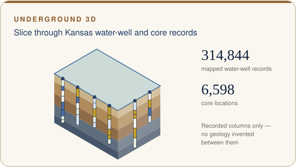
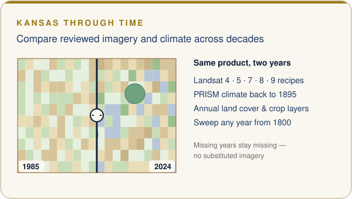
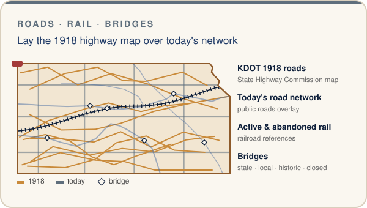
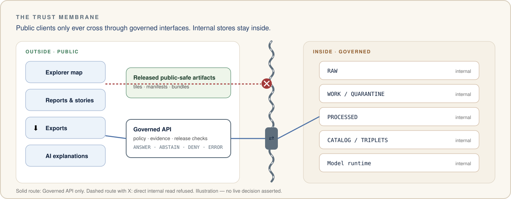
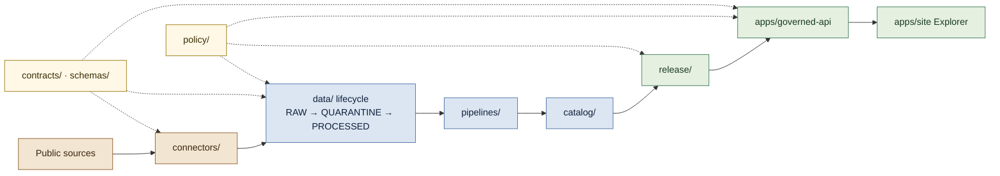

<!-- [KFM_META_BLOCK_V2]
doc_id: kfm://doc/root-readme
title: Kansas Frontier Matrix — Project Home
type: repository-readme
version: v3.4.0
status: repository-grounded draft
owners: ["@bartytime4life"]
created: 2026-05-11
updated: 2026-10-08
policy_label: public
current_path: README.md
owning_root: repository-root
responsibility: repository-wide identity, orientation, contribution, and validation entry point
truth_posture: cite-or-abstain; implementation claims require pinned repository evidence
evidence_snapshot:
  repository: bartytime4life/Kansas-Frontier-Matrix
  base_ref: main
  base_commit: 7d79ce10ace694e3bedb5e1a01b96bd479759577
related:
  - docs/doctrine/directory-rules.md
  - docs/adr/ADR-0029-adopt-directory-governance-standard-v2.md
  - docs/doctrine/ai-build-operating-contract.md
  - docs/doctrine/lifecycle-law.md
  - docs/doctrine/trust-membrane.md
  - docs/doctrine/truth-posture.md
  - CONTRIBUTING.md
  - SECURITY.md
  - docs/runbooks/local-pc-data-store.md
  - apps/site/README.md
  - docs/brand/readme/README.md
notes:
  - "v3.4.0 adds an animated Explorer walkthrough, Focus Mode gate trace, layer stack, capability board built from apps/site/source/app/site-features.ts, trust-membrane diagram, by-the-numbers row, four more feature cards, guided explorations, an FAQ, theme-aware dark variants and section dividers. All figures are counted from the repository at the evidence commit; all artwork stays illustrative."
  - "v3.3.0 was a visitor-first showcase refresh: illustrated feature tour, time-depth and source-lane graphics, and a build-status summary. Feature descriptions are drawn from the linked Site guides at the evidence commit; they do not add runtime, admission, release, or publication claims."
  - "All imagery under docs/brand/readme/ is illustrative artwork, not screenshots, map products, or data displays. Animations are slow, decorative-only, and stop under prefers-reduced-motion."
  - "The current standalone Site mirror, saved version, source parity and validation are pinned by apps/site/README.md and its linked delivery receipts. Private D1/R2 records remain excluded."
  - "The repository maturity table under Current posture remains a historical snapshot bounded to main@6c5be18cf8448654be95a6db688d98546cd5276e and the runs named in each row."
  - "The public Explorer address is linked as a project entry point; the Site currently retains an owner-only audience, and hosted availability and version state remain separately verifiable runtime claims."
  - "The Science Pack section is an explicitly proposed north-star profile; it does not claim installation, source admission, model validity, release, deployment, or publication."
[/KFM_META_BLOCK_V2] -->

<p align="center">
  <a href="#see-it-in-action"></a>
</p>

# Kansas Frontier Matrix

<p align="center">
  <strong>Pick a place in Kansas. Scrub through two centuries. See exactly where every answer came from.</strong><br />
  A map-first, time-aware, evidence-first atlas of Kansas — built in the open.
</p>

<p align="center">
  <a href="#see-it-in-action"></a>
  <a href="#take-the-tour"></a>
  <a href="#where-the-data-comes-from"></a>
  <a href="#travel-through-time"></a>
</p>

<p align="center">
  <a href="#build-status-at-a-glance"></a>
  <a href="LICENSE"></a>
  <a href="CONTRIBUTING.md"></a>
  <a href="CITATION.cff"></a>
</p>

<p align="center">
  <a href="#try-it-yourself"><b>Run it yourself</b></a> ·
  <a href="#things-to-try">Things to try</a> ·
  <a href="https://kansas-frontier-matrix-explorer.blackbart-55.chatgpt.site">Explorer (private preview)</a> ·
  <a href="apps/site/README.md">Explorer source</a> ·
  <a href="#faq">FAQ</a> ·
  <a href="CONTRIBUTING.md">Contribute</a>
</p>

> [!NOTE]
> **KFM is an active build, and this page says so plainly.** The Explorer is real, runs locally, and connects to real public providers today — but it is currently an owner-only preview, its live layers are labelled *external context*, and nothing on the map is yet a released KFM dataset. See [Build status at a glance](#build-status-at-a-glance) for exactly what works now and what is still ahead. Every picture on this page is an **illustration**, not a screenshot.

<p align="center">
  
</p>

## See it in action

From a place to a shareable, evidence-bounded result in eight moves. The walkthrough below loops through the journey the Explorer is built around.

<p align="center">
  <picture><source media="(prefers-color-scheme: dark)" srcset="docs/brand/readme/kfm-explorer-walkthrough-dark.svg" /></picture>
</p>

| <kbd>1</kbd> Map | <kbd>2</kbd> Area | <kbd>3</kbd> Layers | <kbd>4</kbd> Time | <kbd>5</kbd> Inspect | <kbd>6</kbd> Evidence | <kbd>7</kbd> Report | <kbd>8</kbd> Share |
|:--:|:--:|:--:|:--:|:--:|:--:|:--:|:--:|
| Open on real county and water sources | Frame a place and choose **Show this area** | Turn on gauges, radar, geology, roads… | Sweep from 1800 or step through an archive | Click a gauge, quake or log interval | See source, clocks, role and limits | **New from map** builds a draft | Share the view, protected detail withheld |

<p align="center">
  <picture><source media="(prefers-color-scheme: dark)" srcset="docs/brand/readme/kfm-by-the-numbers-dark.svg" /></picture>
</p>

## Why KFM

Most maps answer **where**. KFM is being built to answer **where, when, what supports the claim, what changed, and what can responsibly be shown**.

Kansas is a landscape of layered stories — rivers that moved, prairies that became fields, rail lines that made and unmade towns, aquifers drawn down beneath them, storms and smoke that cross the state in an afternoon. KFM brings those systems into one inspectable map where you can move through space *and* time, and where every layer carries its receipts.

| What makes KFM different | What that means for you |
|---|---|
| 🗺️ **Connected systems, not isolated pins** | Move from a place to its water, ground, sky, history and infrastructure — on one map, on one clock. |
| 🕰️ **Every layer keeps its own clock** | Observation time, provider publication time, retrieval time and release time stay separate. A 2024 gauge reading never masquerades as a 2024 map edition. |
| 🔎 **Click anything, see its receipts** | The Evidence Drawer shows source, time, role, uncertainty and limits for what you selected. |
| 🌫️ **Gaps stay visible** | Missing, stale, partial or unsupported data becomes an honest *gap*, *hold* or *abstain* — never a confident guess or an implied all-clear. |
| 🛡️ **Sensitive places stay protected** | Archaeology, burials, rare species, living people, DNA and critical infrastructure are generalized, withheld or denied by default. |

KFM's public value is not a bigger pile of layers. It is a more trustworthy path from **question → place and time → evidence → bounded answer**.

<p align="center">
  
</p>

## Take the tour

The KFM Explorer is a MapLibre-based web app (source in [`apps/site/`](apps/site/README.md)). These ten workspaces exist in the source today. Each picture is an **illustration** of the workspace, not a screenshot — follow the links for the real behavior, tests and limits.

<table>
  <tr>
    <td width="50%" valign="top">
      <a href="apps/site/source/docs/water-flow-paths.md"><picture><source media="(prefers-color-scheme: dark)" srcset="docs/brand/readme/kfm-feature-river-pulse-dark.svg" /></picture></a>
      <p><strong>🌊 River Pulse</strong> — Live USGS discharge from Kansas stream gauges, replayed frame by frame, with 7-day, 30-day and 1-year station histories. NOAA river forecasts, National Water Model guidance and hydrography sit alongside as clearly separate roles. Gaps in a hydrograph stay gaps.<br/><sub><a href="apps/site/source/docs/water-flow-paths.md">Water guide</a> · <a href="apps/site/source/README.md#river-pulse-and-temporal-hydrology">River Pulse details</a></sub></p>
    </td>
    <td width="50%" valign="top">
      <a href="apps/site/source/README.md#date-bound-event-observatory"><picture><source media="(prefers-color-scheme: dark)" srcset="docs/brand/readme/kfm-feature-observatory-dark.svg" /></picture></a>
      <p><strong>⛈️ Event Observatory</strong> — Pick a date and replay it: archived NOAA radar mosaics back to 1995, HMS smoke polygons from 2005, USGS earthquakes, daily satellite backgrounds and streamflow — in 1, 6 or 24-hour steps with Central/UTC labels and a reduced-motion mode.<br/><sub><a href="apps/site/source/README.md#date-bound-event-observatory">Observatory details</a> · <a href="apps/site/source/docs/smoke-imagery-bridges.md">Smoke &amp; imagery</a></sub></p>
    </td>
  </tr>
  <tr>
    <td width="50%" valign="top">
      <a href="apps/site/source/docs/underground-explorer.md"><picture><source media="(prefers-color-scheme: dark)" srcset="docs/brand/readme/kfm-feature-underground-dark.svg" /></picture></a>
      <p><strong>⛏️ Underground 3D</strong> — Frame an area, then orbit a 3D cutaway of recorded water-well logs and cores from the Kansas Geological Survey: 314,844 mapped WWC5 records and 6,598 core locations, aquifer ranges, geophysical profiles and soil horizons. Only recorded columns are drawn — no geology is invented between them.<br/><sub><a href="apps/site/source/docs/underground-explorer.md">Underground guide</a> · <a href="apps/site/source/docs/subsurface-data.md">Subsurface data</a></sub></p>
    </td>
    <td width="50%" valign="top">
      <a href="apps/site/source/README.md#official-kansas-context-adapters"><picture><source media="(prefers-color-scheme: dark)" srcset="docs/brand/readme/kfm-feature-evidence-drawer-dark.svg" /></picture></a>
      <p><strong>🧾 Evidence Drawer</strong> — Select a gauge, quake, fire detection or log interval and the drawer shows where it came from, when it was observed and retrieved, what role it plays, and what it cannot tell you. Live provider data is labelled <code>EXTERNAL_CONTEXT_ONLY</code> until it passes admission.<br/><sub><a href="docs/brand/evidence-drawer-microcopy.md">Drawer language</a> · <a href="apps/site/source/README.md#official-kansas-context-adapters">Context adapters</a></sub></p>
    </td>
  </tr>
  <tr>
    <td width="50%" valign="top">
      <a href="apps/site/source/docs/history-comparison.md"><picture><source media="(prefers-color-scheme: dark)" srcset="docs/brand/readme/kfm-feature-history-dark.svg" /></picture></a>
      <p><strong>🕰️ Kansas through time</strong> — Sweep any year from 1800, step event by event, accumulate or A/B-compare. Prepare same-product Landsat 4/5/7/8/9 imagery, PRISM climate back to 1895, and annual land-cover and crop layers. Unavailable years stay unavailable; nothing is substituted.<br/><sub><a href="apps/site/source/docs/history-comparison.md">History comparison</a> · <a href="apps/site/source/README.md#temporal-sweep">Temporal sweep</a></sub></p>
    </td>
    <td width="50%" valign="top">
      <a href="apps/site/source/README.md#nasa-smap-soil-moisture-display--september-29-2026"><picture><source media="(prefers-color-scheme: dark)" srcset="docs/brand/readme/kfm-feature-atmosphere-dark.svg" /></picture></a>
      <p><strong>🌾 Sky to soil</strong> — NASA SMAP surface and root-zone soil moisture with uncertainty views (daily since 2015), GFS forecast wind flow, NOAA-20 thermal detections, smoke, NWS alerts and radar loops. Illustrative motion is labelled as such; color is never presented as a sensor reading.<br/><sub><a href="apps/site/source/README.md#nasa-smap-soil-moisture-display--september-29-2026">Soil moisture</a> · <a href="apps/site/source/docs/EARTH_ENGINE_DISCOVERY.md">Earth Engine discovery</a></sub></p>
    </td>
  </tr>
  <tr>
    <td width="50%" valign="top">
      <a href="apps/site/source/docs/kansas-reference-layers.md"><picture><source media="(prefers-color-scheme: dark)" srcset="docs/brand/readme/kfm-feature-roads-rail-dark.svg" /></picture></a>
      <p><strong>🛤️ Roads, rail &amp; bridges</strong> — Lay KDOT's georeferenced 1918 State Highway Commission map over today's public roads, with active and abandoned railroad references and state, local, historic and closed bridges — each with its own opacity and scale guidance.<br/><sub><a href="apps/site/source/docs/kansas-reference-layers.md">Reference layers</a> · <a href="docs/encyclopedia/chapters/11-settlements-infrastructure.md">Settlements &amp; infrastructure</a></sub></p>
    </td>
    <td width="50%" valign="top">
      <a href="apps/site/source/docs/lightning-flash-loop.md"><picture><source media="(prefers-color-scheme: dark)" srcset="docs/brand/readme/kfm-feature-hazards-dark.svg" /></picture></a>
      <p><strong>⚡ Hazards &amp; disasters</strong> — FEMA disaster declarations by county, NFHL flood-zone imagery, NOAA 15-minute lightning density and NASA's 1995–2014 flash-rate climatology. A county designation is never drawn as an impact footprint, and no empty layer is an all-clear.<br/><sub><a href="apps/site/source/docs/lightning-flash-loop.md">Lightning loop</a> · <a href="apps/site/source/docs/kansas-reference-layers.md">Reference layers</a></sub></p>
    </td>
  </tr>
  <tr>
    <td width="50%" valign="top">
      <a href="apps/site/source/docs/kansas-reference-layers.md"><picture><source media="(prefers-color-scheme: dark)" srcset="docs/brand/readme/kfm-feature-survey-dark.svg" /></picture></a>
      <p><strong>📐 Survey &amp; land records</strong> — Compare BLM Public Land Survey townships, sections and intersected survey at the right scales, inspect identifiers at the map center, and view direct-match oil and gas lease cases. Survey reference — never parcels, title or access.<br/><sub><a href="apps/site/source/docs/kansas-reference-layers.md">Reference layers</a></sub></p>
    </td>
    <td width="50%" valign="top">
      <a href="apps/site/source/docs/map-research-tools.md"><picture><source media="(prefers-color-scheme: dark)" srcset="docs/brand/readme/kfm-feature-reports-dark.svg" /></picture></a>
      <p><strong>📝 Reports &amp; stories</strong> — <b>New from map</b> carries the current extent or selection, visible layers, time, representation and evidence posture into a report or guided story. Pinned place dossiers and saved workspaces stay on your device.<br/><sub><a href="apps/site/source/docs/map-research-tools.md">Research tools</a> · <a href="apps/site/source/README.md#current-public-scope">Public scope</a></sub></p>
    </td>
  </tr>
</table>

**Also in the Explorer:** a searchable layer catalog, a priority context deck, pinned place dossiers, an Earth Engine catalog with downloadable Kansas recipes, a private data-contribution and steward-review desk, 2D / Terrain 3D / Globe representations with natural and topographic relief and mapped 3D buildings, and an opt-in **local** Qwen companion that reads only a bounded context and never becomes a source of evidence. See the [feature matrix](docs/encyclopedia/chapters/09-master-feature-matrix.md) and the [feature, connection and action map](apps/site/source/docs/SITE_FEATURE_CONNECTION_ACTION_MAP.md).

### One place, many layers

Every theme lives on the same map and the same clock. Layers outside the active time step aside rather than pretending to be current, and each keeps its own source, clocks and limits.

<p align="center">
  <picture><source media="(prefers-color-scheme: dark)" srcset="docs/brand/readme/kfm-layer-stack-dark.svg" /></picture>
</p>

### Ask, and see why

**Focus Mode** answers questions about what you selected — *Explain*, *Why*, *Lineage* or *Time* — but only after six gates have run. The gate trace is shown to you, and every answer ends in exactly one of four finite outcomes.

<p align="center">
  <picture><source media="(prefers-color-scheme: dark)" srcset="docs/brand/readme/kfm-focus-mode-dark.svg" /></picture>
</p>

| Outcome | When it happens | Example code from the Explorer |
|---|---|---|
| ✅ **`ANSWER`** | Evidence resolves for the selected place and time | `CITATIONS_VALID` |
| ⏸️ **`ABSTAIN`** | Support is missing, stale, generalized, superseded — or the time does not match | `TIME_SCOPE_MISMATCH`, `SUPPORT_INSUFFICIENT`, `GEOMETRY_IS_NOT_EVIDENCE` |
| ⛔ **`DENY`** | Rights, sensitivity or policy forbid public disclosure | `PUBLIC_DISCLOSURE_BLOCKED` |
| ⚠️ **`ERROR`** | Something failed — and nothing was substituted for it | `ADAPTER_UNAVAILABLE` |

Focus Mode is a **bounded proof** today: it runs against site-local demonstration fixtures ([`focus-mode.ts`](apps/site/source/app/focus-mode.ts)). A model may explain a result only downstream of these gates, and never issues life-safety, regulatory, health or engineering instructions.

## Things to try

Run the Explorer locally ([two commands below](#try-it-yourself)) and try one of these. Labels in **bold** are the controls you'll see.

<details>
<summary>⛈️ <b>Replay a storm, hour by hour</b></summary>

1. Open the **Event Observatory** (`/observatory`) from the Explorer's navigation.
2. Pick a date — radar archives reach back to 1995, HMS smoke polygons to 2005.
3. Choose **1 h** steps, then play. Radar frames, smoke footprints and that day's earthquakes advance together; gaps in coverage stay visible.
4. Toggle **Central / UTC** labels, or switch on reduced motion to step frame by frame.

[Observatory details →](apps/site/source/README.md#date-bound-event-observatory)
</details>

<details>
<summary>⛏️ <b>Look underneath a place</b></summary>

1. Open **Underground** from the map dock. The 2D selector fits Kansas.
2. Pan and zoom to a place, then choose **Show this area**.
3. Orbit, move and zoom the cutaway. Click a column to open its original interval in the Evidence Drawer.
4. Scrub **record time** to see which well and core records existed by a given year, or open **Tools** for specialist views such as the 3D slice of one recorded column.

[Underground guide →](apps/site/source/docs/underground-explorer.md)
</details>

<details>
<summary>🛤️ <b>Drive the 1918 highways</b></summary>

1. Open **Map layers** → **Roads, rail &amp; bridges**.
2. Switch on **Historical roads · 1918**, then today's roads, and lower the opacity of one to compare.
3. Add active and abandoned railroads and bridges, and read each layer's scale guidance and source limits.

[Reference layers →](apps/site/source/docs/kansas-reference-layers.md)
</details>

<details>
<summary>🌾 <b>Watch soil moisture breathe</b></summary>

1. Under **Official sources**, switch on **Soil moisture** (it starts off).
2. Pick surface (0–5 cm) or root-zone (0–100 cm) — or their uncertainty views.
3. Play the daily loop, which reaches back to 31 March 2015. Use **Exact image cells** to turn off visual blending.

[Soil moisture details →](apps/site/source/README.md#nasa-smap-soil-moisture-display--september-29-2026)
</details>

<details>
<summary>🌊 <b>Follow one river gauge</b></summary>

1. With **USGS River Pulse** on (it's on by default), click a gauge.
2. Switch between 7-day, 30-day and 1-year views; note the gaps.
3. Check one UTC day to see every returned observation timestamp for that station.

[Water guide →](apps/site/source/docs/water-flow-paths.md)
</details>

<details>
<summary>📝 <b>Turn your view into a report</b></summary>

1. Frame an area and switch on the layers you care about.
2. Choose **New from map** and pick a report or a guided story.
3. The draft carries your extent, layers, time and evidence posture — and stays on your device until you decide otherwise.

[Research tools →](apps/site/source/docs/map-research-tools.md)
</details>

<p align="center">
  
</p>

## Travel through time

<p align="center">
  <picture><source media="(prefers-color-scheme: dark)" srcset="docs/brand/readme/kfm-time-depth-dark.svg" /></picture>
</p>

Every source has its own reach into the past, and KFM keeps those reaches honest. The shared map clock can step through every calendar year from 1800; individual sources answer only for the periods they actually cover. A provider's first year is not a promise of complete Kansas coverage, uninterrupted observations, or equivalent sensors — the [historical source review](apps/site/source/docs/free-data-history-delivery.md) records each family's real scope and caveats.

## Where the data comes from

<p align="center">
  <picture><source media="(prefers-color-scheme: dark)" srcset="docs/brand/readme/kfm-source-lanes-dark.svg" /></picture>
</p>

KFM draws on public data from federal, state, university and community sources. They reach KFM in two different ways, and the difference matters:

- **Live context in the Explorer (today).** The Explorer's layer catalog connects to a fixed allowlist of official providers — sixteen source-specific Kansas connections plus soil moisture and the Observatory's archive carriers. These render as attributed *external context*: visible, inspectable, never silently promoted to evidence.
- **Connector lanes in this repository (being built).** The [`connectors/`](connectors/README.md) root holds 104 source-specific lane directories (some are aliases or umbrella lanes). A lane is where capture, parsing and admission code for one source lives; a lane existing does not mean the source is active, admitted or published.

<details>
<summary><strong>Browse sources by theme</strong> — what is live in the Explorer and what has a connector lane</summary>

<br />

| Theme | Live in the Explorer today (external context) | Connector lanes in the repository |
|---|---|---|
| 🌊 **Water** | USGS River Pulse streamflow · NOAA NWPS gauges + forecasts · USGS 3DHP hydrography · USGS/NRCS WBD watersheds · NOAA National Water Model analysis + 18-hour outlook | [`usgs`](connectors/usgs/) · [`noaa`](connectors/noaa/) · [`kgs_kdhe_wwc5`](connectors/kgs_kdhe_wwc5/) · [`drought-monitor`](connectors/drought-monitor/) · [`nrcs-scan`](connectors/nrcs-scan/) |
| 🌩️ **Sky & air** | NOAA nowCOAST radar loops · IEM radar archive (1995+) · NOAA HMS smoke · NWS alert areas · NASA GIBS NOAA-20 thermal detections · GOES imagery · GFS forecast wind flow | [`nws-api`](connectors/nws-api/) · [`noaa-hms-smoke`](connectors/noaa-hms-smoke/) · [`hrrr_smoke`](connectors/hrrr_smoke/) · [`goes_abi_aod`](connectors/goes_abi_aod/) · [`viirs_hotspot`](connectors/viirs_hotspot/) · [`nasa-firms`](connectors/nasa-firms/) · [`airnow`](connectors/airnow/) · [`epa_aqs`](connectors/epa_aqs/) · [`openaq`](connectors/openaq/) · [`kansas_mesonet`](connectors/kansas_mesonet/) · [`noaa-uscrn`](connectors/noaa-uscrn/) · [`noaa-storm-events`](connectors/noaa-storm-events/) |
| 🪨 **Earth & geology** | USGS earthquakes · Raspberry Shake station metadata · USGS 3DEP LiDAR hillshade + slope · KGS surface geology · KGS water-well and core records (Underground) · USDA soil horizons | [`kgs_bedrock`](connectors/kgs_bedrock/) · [`kgs_surficial`](connectors/kgs_surficial/) · [`kgs_oil_gas_wells`](connectors/kgs_oil_gas_wells/) · [`kgs_las`](connectors/kgs_las/) · [`kcc_oil_gas_reg`](connectors/kcc_oil_gas_reg/) · [`usgs_ngmdb`](connectors/usgs_ngmdb/) · [`usgs_mrds`](connectors/usgs_mrds/) · [`usgs-earthquake`](connectors/usgs-earthquake/) · [`nrcs-ssurgo`](connectors/nrcs-ssurgo/) · [`isric`](connectors/isric/) |
| 🌾 **Land & agriculture** | NASA SMAP soil moisture · reviewed USDA CDL and Crop-CASMA rasters · Earth Engine catalog and Kansas recipes · Landsat and PRISM history preparation | [`usda-nass`](connectors/usda-nass/) · [`nlcd`](connectors/nlcd/) · [`lf`](connectors/lf/) (LANDFIRE) · [`nasa-hls`](connectors/nasa-hls/) · [`nasa-smap`](connectors/nasa-smap/) · [`nasa-earthdata`](connectors/nasa-earthdata/) · [`usda-plants`](connectors/usda-plants/) · [`ksu_research_extension`](connectors/ksu_research_extension/) |
| 🦬 **Living things** | GBIF annual plant and animal record-density hexagons (generalized; no exact occurrence points) | [`gbif`](connectors/gbif/) · [`idigbio`](connectors/idigbio/) · [`inaturalist`](connectors/inaturalist/) · [`ebird`](connectors/ebird/) · [`symbiota`](connectors/symbiota/) · [`ku_herbarium`](connectors/ku_herbarium/) · [`natureserve`](connectors/natureserve/) · [`usfws-ecos`](connectors/usfws-ecos/) · [`kdwp`](connectors/kdwp/) · [`eddmaps`](connectors/eddmaps/) · [`kbs`](connectors/kbs/) |
| 📜 **History & people** | Census 2020 county population and housing · USGS historical mine-map editions (1934–1996) · USGS historical topographic map scans (prepared on request, owner-reviewed before display) | [`loc`](connectors/loc/) · [`kansas_memory`](connectors/kansas_memory/) · [`kansas_state_archives`](connectors/kansas_state_archives/) · [`khri`](connectors/khri/) · [`newspapers`](connectors/newspapers/) · [`gnis`](connectors/gnis/) · [`archaeology`](connectors/archaeology/) — *people, genealogy and DNA lanes are deny-by-default* |
| 🛤️ **Built world & hazards** | OpenStreetMap context basemap · Census TIGER counties · NIFC wildfire incident reports | [`kdot`](connectors/kdot/) · [`fhwa_hpms`](connectors/fhwa_hpms/) · [`fhwa_nhfn`](connectors/fhwa_nhfn/) · [`fra_gcis`](connectors/fra_gcis/) · [`fra_form57`](connectors/fra_form57/) · [`stb_class1`](connectors/stb_class1/) · [`ntad`](connectors/ntad/) · [`wzdx`](connectors/wzdx/) · [`hifld`](connectors/hifld/) · [`fema-nfhl`](connectors/fema-nfhl/) · [`fema-openfema`](connectors/fema-openfema/) · [`tiger_line`](connectors/tiger_line/) · [`openstreetmap`](connectors/openstreetmap/) |

Live connections are listed in the Explorer's [official context adapters](apps/site/source/README.md#official-kansas-context-adapters) and [Observatory carriers](apps/site/source/README.md#date-bound-event-observatory). Admission rules live in [`docs/sources/`](docs/sources/) and the [lifecycle law](docs/doctrine/lifecycle-law.md). Every source keeps its own terms, attribution and access limits.

</details>

> [!WARNING]
> Exact archaeological, burial, sacred, rare-species, infrastructure, private-land, living-person, DNA/genomic and other harmful-precision details are not assumed to be public-safe. KFM defaults to quarantine, redaction, generalization, staged access, delay, abstention or denial when the required authority is unclear. See the [deny-by-default register](docs/encyclopedia/chapters/13-sensitive-deny-by-default-register.md).

<p align="center">
  
</p>

## How KFM protects meaning

<p align="center">
  <picture><source media="(prefers-color-scheme: dark)" srcset="docs/brand/readme/kfm-trust-membrane-dark.svg" /></picture>
</p>

Public clients never reach into internal stores. Everything they show crosses a **trust membrane** through governed interfaces — and a layer earns its way onto a public map along the trust path below.

<p align="center">
  <picture><source media="(prefers-color-scheme: dark)" srcset="docs/brand/readme/kfm-trust-path-dark.svg" /></picture>
</p>

Every source moves through the same lifecycle:

**RAW → WORK / QUARANTINE → PROCESSED → CATALOG / TRIPLETS → PUBLISHED**

Promotion is a governed decision, not a file move. Along the way:

1. **Source and lineage** record where material came from, what role it has, and what remains unresolved.
2. **Evidence** binds a consequential claim to an `EvidenceRef` and an `EvidenceBundle`, or to an already-governed public-safe artifact.
3. **Policy** checks rights, sensitivity, access, precision, time, consent, cultural or stewardship limits, and release conditions.
4. **Review and release** remain governed transitions. A receipt, test, badge, commit, pull request, merge or generated explanation cannot silently perform them.
5. **Public carriers** — maps, tiles, graphs, scenes, reports, dashboards and AI language — display bounded results while preserving citations, uncertainty, correction and rollback context.

When KFM is asked something, it answers with one of a small set of finite outcomes: **`ANSWER`** when evidence supports it, **`ABSTAIN`** when support is missing or stale, **`DENY`** when policy forbids it, and **`ERROR`** when something failed. Public clients read only governed interfaces and released public-safe artifacts — never internal stores, candidates, private records or model-runtime state.

## Build status at a glance

<p align="center">
  <picture><source media="(prefers-color-scheme: dark)" srcset="docs/brand/readme/kfm-capability-board-dark.svg" /></picture>
</p>

The board above is drawn straight from the Explorer's own [feature registry](apps/site/source/app/site-features.ts). The table below summarizes the wider repository.

A quick, honest read of where things stand at `main@7d79ce10`. Each row links to the record that carries its exact evidence.

| | Capability | Where it stands |
|---|---|---|
| ✅ | **Explorer app runs locally** | Standalone source in [`apps/site/source/`](apps/site/README.md) with its own build, TypeScript checks, Node test suite and offline smoke test. The [current Site checkpoint](apps/site/README.md#current-site-checkpoint) pins the exact version and validation. |
| ✅ | **Live public-provider context** | USGS, NOAA, NWS, NASA, Census, KGS, GBIF and others render as attributed `EXTERNAL_CONTEXT_ONLY` layers with visible failure, partial and empty states. |
| ✅ | **Local PC data store** | [`tools/local_data/`](tools/local_data/README.md) provides `doctor`, `init`, `plan`, `sync` and `verify` for a private, offline, quarantine-first store outside the checkout. |
| ✅ | **Contracts, schemas, policy and validators** | Bounded slices with positive and negative fixtures, fail-closed tests and a repository topology ratchet. See [`make validate`](#validation). |
| 🟡 | **Hosted Explorer** | Deployed privately with an owner-only audience. Public access, full accessibility, device/WebGL and long-session acceptance remain open. |
| 🟡 | **Source admission** | Connector lanes and the `connectors-core` package exist; end-to-end admission of a first governed layer is the next planned pilot ([source gap register](apps/site/source/docs/KFM_SOURCE_GAP_REGISTER.md)). |
| 🟡 | **Evidence resolution** | Contracts, finite outcomes and resolver fixtures exist; end-to-end `EvidenceBundle` resolution against released data is not yet established. |
| 🔭 | **Released KFM datasets and Science Pack** | Not yet. Releases, publication and the cross-domain [Science Pack](#a-finished-kfm-with-a-science-pack) are the north star. |

✅ works today in bounded form · 🟡 partially in place · 🔭 planned. Gaps and next slices are tracked in the [verification backlog](docs/registers/VERIFICATION_BACKLOG.md).

<p align="center">
  
</p>

## Try it yourself

### Run the Explorer on your machine

You need Linux, Node.js `>=22.13.0`, and the helpers listed in the [Site README](apps/site/README.md#run-locally) (`flock`, `curl`, `sha256sum`, GNU `timeout`).

```bash
git clone https://github.com/bartytime4life/Kansas-Frontier-Matrix.git
cd Kansas-Frontier-Matrix/apps/site/source
npm run install:ci
npm run build
../serve-local.sh          # opens on http://127.0.0.1:4173 by default
```

The Site uses its own npm lockfile and sits outside the root pnpm workspace. Live provider responses, private D1/R2 records and separately stored local data are not bundled. After a build, `../smoke-local.sh` checks every API route that can answer without a provider network. Read the [Site README](apps/site/README.md) for configuration, the [installation guide](docs/installation.md) for the repository-wide dependency map, and [Explorer source notes](apps/site/source/README.md) for every feature's behavior and limits.

### Set up a private local data store

On Ubuntu, keep your data separate from the checkout:

```bash
cd Kansas-Frontier-Matrix
python3 tools/local_data/doctor.py
export KFM_DATA_ROOT="$HOME/KFM-data"
python3 tools/local_data/manage.py init
```

Python `>=3.11` is required; the local-data tools use only the standard library. `doctor` checks prerequisites and emits JSON — its `PASS` covers those prerequisites only. Then follow the [local PC data-store runbook](docs/runbooks/local-pc-data-store.md) to inventory downloaded maps and pictures, sync them into a private **QUARANTINE** store, verify bytes, back up and plan backfill. For a first exercise, try the [committed 24-byte synthetic capture](docs/runbooks/local-pc-data-store.md#try-one-small-synthetic-capture). A capture receipt proves a bounded local capture — not source admission, promotion, release or map visibility. The owner decision for this schema is recorded in [#4613](https://github.com/bartytime4life/Kansas-Frontier-Matrix/issues/4613).

### Validate the repository

```bash
python3 -m venv .venv
. .venv/bin/activate
python tools/ci/install_python_ci.py project-test
make validate
git diff --check
```

`make governed-api-dev` starts the current fixture API at `http://127.0.0.1:8000`. Repository commands do not load `.env` automatically; export settings explicitly (see [`.env.example`](.env.example)). The current Compose images are security-review placeholders, not a complete local deployment.

## A finished KFM with a Science Pack

> [!IMPORTANT]
> **North-star / PROPOSED.** A **Science Pack** means a versioned, reviewable capability profile — not a package that is currently installable, configured, admitted, released or operating end to end. The term does not make a dataset authoritative, a model scientifically valid, or an output public-safe.

Imagine choosing a Kansas watershed, drawing an area of interest, and moving one time control across geological context, historic land change and current observations. Terrain rises into 3D; soil, water, atmosphere, agriculture, habitat, cities, roads and rail appear only when their time and support models can be compared honestly. Select a pattern and the Evidence Drawer explains the sources, methods, units, uncertainty, transformations, withheld detail and correction state. Ask Focus Mode why something changed and it answers from governed evidence — or returns `ABSTAIN`, `DENY` or `ERROR`.

That is the finished-system possibility: not just a map of Kansas, but an inspectable spatial science workbench.

<details>
<summary><strong>What a finished Science Pack could make possible</strong></summary>

<br />

| Finished experience | What a person could do | Required truth boundary |
|---|---|---|
| **Kansas through time** | Scrub, compare or narrate released editions of terrain, waterways, land cover, settlement, roads, rail and cities without inventing motion between observations. | Every frame retains acquisition/effective time, release identity, gaps and reconstruction labels. |
| **Watershed and drought laboratory** | Trace a watershed; align precipitation, soil moisture, streamflow, reservoir context, vegetation response and drought indicators; then export the exact area, interval, methods and citations. | Station observations, remote sensing, interpolations, forecasts and scenarios remain distinct. |
| **Terrain-to-subsurface investigation** | Move from LiDAR/DEM relief and elevation profiles to mapped geology, aquifers, soils, landforms and generalized resource context in 2D or 3D. | Vertical reference, scale, accuracy, interpretation, private wells, infrastructure and sensitive resource locations remain explicit or withheld. |
| **Atmosphere-to-land analysis** | Follow weather, smoke, air quality, fire context and land-surface response through synchronized, field-driven animation. | Observation, forecast, satellite detection, modeled transport, advisory and official alert roles never collapse. |
| **Agriculture and ecosystem context** | Compare soil capability, crop/land-cover history, water availability, habitat models and flora/fauna observations for a public-safe area. | Classification uncertainty, sampling bias, geoprivacy, land ownership, protected species and regulatory status remain bounded. |
| **People, infrastructure and landscape change** | Explore how settlements, transport networks, public aggregates, land use, hazards and environmental systems changed together. | No living-person tracking, DNA inference, private-property claim, protected archaeology or unsafe infrastructure precision. |
| **Repeatable spatial research** | Save an area, layer stack, time window, query, method version and evidence set; rerun it against a later release; inspect the delta; produce a citable report. | A correlation is not causation, a model is not an observation, and AI language is not evidence. |
| **Evidence-bounded science assistant** | Ask a local or governed model to explain a visible pattern, compare supported hypotheses, identify missing evidence, or draft a reproducible investigation plan. | The model reads only allowed envelopes, cites resolved evidence, proposes rather than approves, and cannot mutate source, policy, release or publication state. |

</details>

<details>
<summary><strong>What “installed and configured” would have to mean</strong></summary>

<br />

| State | Minimum meaning | What it does **not** prove |
|---|---|---|
| **Installed** | Pinned pack definition, dependencies, schemas, adapters, and immutable fixture or artifact identities are present. | Source admission, scientific validity, runtime health, or permission to publish. |
| **Configured** | Area, time, CRS and vertical datum, units, source roles, methods, uncertainty, performance budgets, and allowed questions are explicit. | That a source is current, rights-cleared, sensitive-safe, or fit for every claim. |
| **Admitted** | Source, evidence, policy, rights, sensitivity, review, and negative-path gates close for a bounded use. | Release, deployment, or a broader authority than the admitted scope. |
| **Released** | Public-safe artifacts are bound to manifests, proofs, correction lineage, and a tested rollback target. | Permanent correctness; freshness and withdrawal remain operational duties. |
| **Operational** | Governed APIs, Explorer surfaces, observability, expiry, correction, withdrawal, and recovery are verified for an exact release. | Emergency, legal, medical, engineering, or regulatory authority. |

</details>

A Science Pack succeeds only when the full path is inspectable:

**question → area and time → released layers → methods and uncertainty → EvidenceBundle → policy outcome → explanation or abstention → reproducible report**

The existing domain lanes, Explorer workspaces, contracts, schemas, policies, fixtures and validators are building blocks toward that direction; their presence is not proof that this cross-domain pack exists.

## Start here

| If you want to… | Start with… |
|---|---|
| **See what KFM can do** | The [tour](#take-the-tour) above, then the [feature matrix](docs/encyclopedia/chapters/09-master-feature-matrix.md) and [domain atlas](docs/encyclopedia/chapters/05-master-domain-atlas.md). |
| **Read the project as a book** | The draft [KFM encyclopedia reader guide](docs/encyclopedia/chapters/01-cover.md). |
| **Run the Explorer locally** | [`apps/site/`](apps/site/README.md) — application, checked-in assets and local scripts. |
| **Preserve files you already downloaded** | [Local PC runbook](docs/runbooks/local-pc-data-store.md), [`tools/local_data/`](tools/local_data/README.md) and [bounded acquisition](docs/runbooks/free-data-acquisition.md). |
| **Learn the project's rules** | [`docs/doctrine/`](docs/doctrine/), [`docs/architecture/`](docs/architecture/) and [`docs/adr/`](docs/adr/). |
| **Make a change safely** | [`CONTRIBUTING.md`](CONTRIBUTING.md), [Directory Rules](docs/doctrine/directory-rules.md), and the README nearest the path you will touch. |
| **Understand evidence and public boundaries** | [Trust Membrane](docs/doctrine/trust-membrane.md), [Truth Posture](docs/doctrine/truth-posture.md), [Lifecycle Law](docs/doctrine/lifecycle-law.md) and [`SECURITY.md`](SECURITY.md). |
| **Find the machine side** | [`contracts/`](contracts/), [`schemas/`](schemas/), [`policy/`](policy/), [`data/`](data/), [`pipelines/`](pipelines/), [`runtime/`](runtime/) and [`tools/`](tools/). |

## Contributing

<p align="center">
  <a href="CONTRIBUTING.md"><picture><source media="(prefers-color-scheme: dark)" srcset="docs/brand/readme/kfm-contributor-paths-dark.svg" /></picture></a>
</p>

The best contribution is a small, inspectable improvement that leaves the next step easier and safer — and there is room for many kinds of help: geographers, historians, ecologists, cartographers, accessibility reviewers, data engineers and front-end developers.

1. Read [`CONTRIBUTING.md`](CONTRIBUTING.md), the applicable path-scoped README, and the [Directory Rules](docs/doctrine/directory-rules.md).
2. Define one observable goal, its owning responsibility root, affected contracts or interfaces, validation, and rollback.
3. Search for overlapping work and use a feature branch based on the current `main`.
4. Preserve evidence, rights, sensitivity, time, correction, and release boundaries in code and documentation.
5. Add focused tests, fixtures, receipts, or docs when they are direct dependencies of the change.
6. Open a draft pull request with exact base/head evidence, performed and skipped checks, open unknowns, and a clear rollback path.

Good first contributions:

- 🧪 improve an existing validator or negative fixture;
- ♿ make a trust-visible UI state more accessible;
- 📍 document one verified path without promoting its maturity;
- 🔗 close a small contract-to-test gap, or reconcile a stale link, anchor or status claim;
- 🗂️ add a public-safe, deterministic example with its provenance and limitations.

Please use [`CODE_OF_CONDUCT.md`](CODE_OF_CONDUCT.md) for community expectations and [`SECURITY.md`](SECURITY.md) for private security reporting. Do not put credentials, restricted geometry, living-person or genomic data, private review material, or sensitive exploit detail into public issues or pull requests.

## FAQ

<details>
<summary><b>Can I use the Explorer right now?</b></summary>

The hosted Explorer is an owner-only private preview. Anyone can run the same application locally from [`apps/site/`](apps/site/README.md) — see [Try it yourself](#try-it-yourself). Live provider data is fetched at runtime; private review records and uploads are never bundled.
</details>

<details>
<summary><b>Is the data on the map official or “released”?</b></summary>

Not yet. Today's map layers come straight from public providers and are labelled `EXTERNAL_CONTEXT_ONLY`: attributed, inspectable context — not a KFM release, an alert or an all-clear. Promotion to a released KFM dataset is a separate, governed decision ([lifecycle law](docs/doctrine/lifecycle-law.md)).
</details>

<details>
<summary><b>Why would the map say “ABSTAIN” instead of answering?</b></summary>

Because a confident guess is worse than an honest gap. When evidence is missing, stale, generalized or doesn't match the active time, KFM abstains and shows you which gate held. See [Ask, and see why](#ask-and-see-why).
</details>

<details>
<summary><b>Does KFM use AI?</b></summary>

Only downstream of evidence. The Explorer offers an opt-in **local** Qwen companion that runs on your own machine through a loopback bridge and reads a bounded context; the hosted model route is dormant and fails closed. Generated language is interpretation — never evidence, approval or publication. See the [AI build operating contract](docs/doctrine/ai-build-operating-contract.md).
</details>

<details>
<summary><b>How are sensitive places protected?</b></summary>

By default. Archaeology, burials, sacred places, rare species, living people, DNA and critical infrastructure are generalized, withheld or denied unless the required authority is clear — see the [deny-by-default register](docs/encyclopedia/chapters/13-sensitive-deny-by-default-register.md). Please never post exact sensitive locations in public issues; use [`SECURITY.md`](SECURITY.md) instead.
</details>

<details>
<summary><b>Can I cite KFM or reuse its code?</b></summary>

Yes. The repository is [Apache-2.0](LICENSE), and [`CITATION.cff`](CITATION.cff) gives citation metadata. Data shown in the Explorer stays under each provider's own terms; KFM does not relicense it.
</details>

## Current posture

The table below is the detailed maturity snapshot recorded for `main@6c5be18cf8448654be95a6db688d98546cd5276e`. It is historical; [Build status at a glance](#build-status-at-a-glance) gives the current summary, and the [Site checkpoint](apps/site/README.md#current-site-checkpoint) carries the newest Explorer evidence. Execution evidence remains bounded to the exact revisions and runs named in each row.

<details>
<summary><strong>Detailed maturity snapshot</strong></summary>

<br />

| Surface | Repository evidence at that snapshot | Boundary |
|---|---|---|
| **Repository foundation** | Responsibility roots for apps, contracts, schemas, policy, data, pipelines, runtime, docs, tests, tools, and release are present. | A path's presence does not make it truth, policy, release, or publication authority. |
| **Repository validation evidence** | The earlier exact-main `validator-suite` run [34645138385](https://github.com/bartytime4life/Kansas-Frontier-Matrix/actions/runs/34645138385) passed its ordinary validator, documentation, workflow-security, and aggregate lanes but remained `FAIL_INVARIANT` at repository-topology because six current drift fingerprints replaced six stale baseline fingerprints. | The topology baseline was not rewritten; this inherited governance hold was tracked by [#4228](https://github.com/bartytime4life/Kansas-Frontier-Matrix/issues/4228) and [#3366](https://github.com/bartytime4life/Kansas-Frontier-Matrix/issues/3366). |
| **Explorer Site source** | The standalone mirror is under [`apps/site/source/`](apps/site/README.md); the two older monorepo app directories are retired. | Local builds and tests do not prove hosted health, complete provider data, source admission, release, or publication. |
| **MapLibre path** | Renderer-neutral ports, package/adaptor surfaces, performance governance, and synthetic validation support exist in the repository. | Functional renderer admission for the governed package path is held until its dependency, compatibility, accessibility, performance, and rollback evidence is closed. |
| **Evidence and trust path** | Contracts, finite outcomes, defensive adapters, fail-closed fixtures, negative cases, and policy-boundary tests are present in bounded slices. | End-to-end EvidenceBundle resolution, source admission, live transport, and public release are not established by this README. |
| **Science Pack path** | Repository domain lanes, Explorer workspaces, contracts, schemas, policies, fixtures, and validators provide partial building blocks for governed scientific exploration. | No single installable, configured, admitted, released, or operational cross-domain Science Pack exists. |
| **AI path** | KFM treats AI as interpretive and downstream of evidence, policy, review, release, correction, and rollback. | Browser code must not become a model provider, internal-store reader, evidence authority, or publication path. A model response is never evidence by itself. |
| **Hosting** | The repository records the OpenAI Sites/Vinext project identity and preserves the existing Explorer slug and address. | Hosted version history, availability, authentication, CSP/CORS, observability, and production operation require current runtime evidence. |

</details>

### How to read KFM status

- **CONFIRMED** — verified from the named repository bytes, tests, or exact snapshot.
- **PROPOSED** — a design or decision that is not yet adopted or fully implemented.
- **NEEDS VERIFICATION** — checkable, but not established by the evidence in scope.
- **HOLD** — intentionally blocked until a named dependency, authority, safety, rights, sensitivity, or review condition is met.

Implementation maturity and authority are separate axes. An implemented validator can enforce only a proposed profile; an accepted decision can still be only partially implemented.

## Repository map

Child READMEs own deeper detail. Directory placement is part of the trust model: read the adopted [Directory Rules decision](docs/adr/ADR-0029-adopt-directory-governance-standard-v2.md) and the current [Directory Rules](docs/doctrine/directory-rules.md) before creating a path, reviving a deprecated root, or introducing a parallel authority.


```mermaid
flowchart LR
    classDef src fill:#F2E6D2,stroke:#8E5A2A,color:#3A2410
    classDef gov fill:#FFF8E6,stroke:#9A7A12,color:#3A2E05
    classDef life fill:#DCE6F2,stroke:#4A6FA5,color:#0E1F3A
    classDef pub fill:#E5F0E0,stroke:#3B7A57,color:#1B3A24
    SRC["Public sources"]:::src --> CON["connectors/"]:::src
    CON --> DATA["data/ lifecycle<br/>RAW → QUARANTINE → PROCESSED"]:::life
    DATA --> PIPE["pipelines/"]:::life --> CAT["catalog/"]:::life
    CAT --> REL["release/"]:::pub --> API["apps/governed-api"]:::pub --> APP["apps/site Explorer"]:::pub
    CTR["contracts/ · schemas/"]:::gov -.-> CON & DATA & API
    POL["policy/"]:::gov -.-> DATA & REL & API
```

| Responsibility | Home |
|---|---|
| Browser and deployable applications | [`apps/`](apps/) |
| Source-specific capture and admission | [`connectors/`](connectors/) |
| Semantic meaning and interfaces | [`contracts/`](contracts/) |
| Machine-checkable shapes | [`schemas/`](schemas/) |
| Rights, sensitivity, access, and release policy | [`policy/`](policy/) |
| Lifecycle records, evidence, receipts, and proofs | [`data/`](data/) |
| Executable transformations and specifications | [`pipelines/`](pipelines/) and [`pipeline_specs/`](pipeline_specs/) |
| Runtime composition and bounded adapters | [`runtime/`](runtime/) and [`packages/`](packages/) |
| Human doctrine, decisions, architecture, and runbooks | [`docs/`](docs/) |
| Tests, validators, fixtures, and operator tools | [`tests/`](tests/), [`fixtures/`](fixtures/), and [`tools/`](tools/) |
| Release, correction, withdrawal, and rollback decisions | [`release/`](release/) |

<details>
<summary><strong>Top-level tree</strong></summary>

```text
Kansas-Frontier-Matrix/
├── .github/         ├── data/            ├── pipeline_specs/
├── apps/            ├── docs/            ├── pipelines/
├── artifacts/       ├── examples/        ├── policy/
├── catalog/         ├── fixtures/        ├── release/
├── configs/         ├── infra/           ├── runtime/
├── connectors/      ├── migrations/      ├── schemas/
├── contracts/       ├── packages/        ├── scripts/
├── control_plane/   │                    ├── tests/
│                    │                    └── tools/
└── root files: README.md, CONTRIBUTING.md, SECURITY.md, CODE_OF_CONDUCT.md, CHANGELOG.md,
    CITATION.cff, AUTHORS.md, LICENSE, Makefile, package.json, pnpm-lock.yaml,
    pnpm-workspace.yaml, pyproject.toml, .editorconfig, .env.example, .gitignore,
    .pre-commit-config.yaml
```

</details>

## Validation

Validation is evidence about a declared scope, not a universal correctness or release claim.

| Change | Proportionate evidence |
|---|---|
| README or documentation only | One H1, stable headings, relative links, balanced code fences/HTML, accurate status language, final newline, and `git diff --check`. |
| Contract, schema, policy, or validator | Focused positive and negative fixtures, the owning validator/tests, and review of downstream consumers. |
| Explorer UI or browser behavior | Targeted unit/browser tests, keyboard and focus paths, prior-render clearing, no-leak checks, and exact tested SHA. |
| Map-facing behavior | Renderer-import boundary, synthetic selection, governed resolver injection, no direct internal-store access, and compatibility evidence. |
| Release or publication-adjacent work | Evidence, rights, sensitivity, integrity, review, release, correction, and rollback records; a green test is not enough. |

Useful repository targets include:

```bash
make validate
make boundary-guards
make deny-test
make governed-api-smoke
make governed-api-verify
make proof-slice
```

Some Make targets are readiness lanes that exit with a named HOLD (status 3), and the root JavaScript `lint`, `test`, and `build` scripts intentionally report `WORKFLOW_HOLD`. A zero exit status from a marker is not validation evidence; a workflow pass proves only its declared job for its exact revision and inputs. The `explorer-site` workflow validates the standalone Site; other validators retain their own data, policy, MapLibre and Governed API scopes.

## Governing principles

1. **Evidence outranks fluency.** If required support cannot be resolved, narrow, abstain, deny, hold, or report an error.
2. **A carrier is not an authority.** Maps, tiles, graphs, indexes, scenes, summaries, tests, badges, and generated language can carry a result; they do not become truth by displaying it.
3. **Public access crosses a trust membrane.** Ordinary clients consume governed interfaces and released public-safe artifacts, not internal stores.
4. **Sensitive material fails closed.** Unclear rights, sovereignty, cultural authority, privacy, consent, or harmful precision are reasons to restrict exposure — not to guess.
5. **Automation proposes; governance decides.** Watchers, builders, receipts, checks, and pull requests support review but do not perform approval, promotion, release, deployment, or publication by implication.
6. **Corrections remain visible.** Identity, supersession, correction, withdrawal, provenance, and rollback stay traceable when consequences require them.

Read the [Trust Membrane](docs/doctrine/trust-membrane.md), [Truth Posture](docs/doctrine/truth-posture.md), [Lifecycle Law](docs/doctrine/lifecycle-law.md), [AI Build Operating Contract](docs/doctrine/ai-build-operating-contract.md), and [accepted ADR-0029](docs/adr/ADR-0029-adopt-directory-governance-standard-v2.md) before changing a trust-bearing boundary.

## Current edges and non-goals

This README does not:

- admit a renderer dependency into the governed package path or claim public map availability;
- create a live API, model-provider, Qwen/Ollama, or internal-store browser path;
- install, configure, admit, release, or operate a Science Pack;
- activate a source or promote a lifecycle record;
- release a dataset, publish a report, deploy a site, or change hosting/settings;
- establish rights, cultural authority, stewardship, consent, review approval, or public-use permission;
- replace a contract, schema, policy, evidence bundle, receipt, proof, release record, or rollback card.

The illustrations on this page are artwork. They show the *kind* of experience each workspace offers; they are not screenshots, map products, data displays or acceptance evidence. Their sources and usage notes live in [`docs/brand/readme/`](docs/brand/readme/README.md).

## Project references

| Reference | Purpose |
|---|---|
| [`CONTRIBUTING.md`](CONTRIBUTING.md) | Contribution, branch, pull-request, evidence, validation, and rollback discipline |
| [`SECURITY.md`](SECURITY.md) | Vulnerability reporting and sensitive-disclosure boundary |
| [`docs/`](docs/) | Human-readable doctrine, architecture, decisions, standards, source guidance, and runbooks |
| [`apps/site/`](apps/site/README.md) | Current Explorer application source and local-hosting entry point |
| [`apps/governed-api/`](apps/governed-api/) | Governed API implementation boundary |
| [`connectors/`](connectors/README.md) | Source-specific fetch, capture, and admission lanes |
| [`packages/maplibre/`](packages/maplibre/) | MapLibre-facing package and adapter seam |
| [`contracts/`](contracts/) and [`schemas/`](schemas/) | Meaning and machine-checkable shape |
| [`policy/`](policy/) and [`release/`](release/) | Admissibility and release/correction/rollback boundaries |
| [`docs/brand/`](docs/brand/README.md) | Visual language, voice, and README artwork |
| [`CITATION.cff`](CITATION.cff) | Citation metadata for the repository (Apache-2.0) |
| [`CHANGELOG.md`](CHANGELOG.md) | Tracked change history; not release or publication proof by itself |
| [`docs/registers/VERIFICATION_BACKLOG.md`](docs/registers/VERIFICATION_BACKLOG.md) | Repository-grounded capability gaps, boundaries, and smallest safe next slices |

## Last evidence review

| Field | Value |
|---|---|
| Repository | `bartytime4life/Kansas-Frontier-Matrix` |
| Evidence snapshot | `main@7d79ce10ace694e3bedb5e1a01b96bd479759577` |
| Reviewed | Root README, `apps/site/source/app/site-features.ts` and `focus-mode.ts`, `apps/site/README.md` checkpoint stack, `apps/site/source/README.md` and its feature guides (water, Observatory, underground, history, soil moisture, context adapters), `connectors/` direct-child inventory, `docs/brand/` visual language and palette |
| Change class | Showcase expansion: animated walkthrough, Focus Mode, layer stack, capability board, trust membrane, by-the-numbers, four more feature cards, guided explorations, FAQ, theme-aware dark variants and dividers |
| No mutation implied | No source activation, settings change, release, deployment, promotion, publication, or lifecycle transition |
| Not proved | Hosted runtime health, public availability, complete provider coverage, source admission, scientific validity, rights clearance, human approval, release readiness, or public operation |

Re-review this README when the Explorer audience or checkpoint, repository topology, authority boundaries, validation entry points, or the adopted Directory Rules change.

<p align="center">
  <a href="#kansas-frontier-matrix"></a>
</p>
