<!--
GOVERNED ARTIFACT NOTICE
This README is part of the KFM trust boundary: it communicates non-negotiable invariants.
If you change meaning (not just phrasing), route through the governance review path.
-->

<div align="center">

# Kansas Frontier Matrix (KFM‑NG) — Governed Geospatial & Historical Knowledge System 🧭🗺️

**KFM turns heterogeneous Kansas history + geospatial data into a governed, evidence-first system:**  
**data → pipeline → catalogs → governed APIs → Focus Mode + map UI**

<br/>


<!-- OPTIONAL: replace ORG/REPO with real values once workflows exist -->
<!--
[](https://github.com/ORG/REPO/actions/workflows/ci.yml)
[](https://github.com/ORG/REPO/actions/workflows/docs.yml)
[](https://github.com/ORG/REPO/actions/workflows/policy.yml)
-->

</div>

> [!IMPORTANT]
> KFM‑NG is designed around a **trust membrane** (governed API + policy boundary).  
> **UI/external clients never talk to databases.** Policy evaluates **every** request and **fails closed**.  
> Focus Mode **must cite or abstain**. When in doubt: **deny**.

---

## Table of Contents

- [Why KFM Exists](#why-kfm-exists)
- [Non-Negotiable Guarantees](#non-negotiable-guarantees)
- [How KFM Works End-to-End](#how-kfm-works-end-to-end)
- [System Architecture](#system-architecture)
- [Data Lifecycle Raw → Work → Processed](#data-lifecycle-raw--work--processed)
- [Focus Mode and Evidence Resolver](#focus-mode-and-evidence-resolver)
- [Repository Structure](#repository-structure)
- [Local Development](#local-development)
- [CI Gates](#ci-gates)
- [Roadmap](#roadmap)
- [Governance and Sensitivity](#governance-and-sensitivity)
- [Contributing](#contributing)
- [Security](#security)
- [License](#license)
- [Provenance Notes](#provenance-notes)

---

## Why KFM Exists

Kansas history and geography live across **maps, archives, datasets, and narrative sources**. KFM‑NG unifies those sources into a **reproducible, inspectable, citation-first** system that supports:

- **Layered maps over time** (raster + vector; historical → modern)
- **Text-to-place linkage** (documents tied to locations + dates)
- **Governed AI** that must show its work (**citations + audit references**)
- **Public-facing exploration** (web map UI + Focus Mode + Story Nodes)

KFM‑NG is a **provenance-first geospatial knowledge hub**:

- Explore layers on an interactive map (with provenance + licensing surfaced).
- Read **Story Nodes** (governed narrative units) that synchronize map/time state.
- Ask **Focus Mode** (grounded Q&A) that returns **citations + an audit reference** — or **abstains**.

> [!IMPORTANT]
> If evidence cannot be resolved, the system must **abstain** rather than guess.

---

## Non-Negotiable Guarantees

These are the invariants the system must keep true **regardless of implementation details**.

| Invariant | What it means | Why it exists | Minimum enforcement |
|---|---|---|---|
| **Trust membrane** | UI/external clients never access databases directly; all access goes through **governed API + policy boundary** | Prevents bypassing governance, provenance, and sensitivity rules | Network isolation + gateway middleware |
| **Fail-closed policy** | If policy cannot prove a request is allowed, **deny** | Safer-than-sorry for sensitive or uncertain cases | OPA default deny + policy tests |
| **Dataset promotion gates** | Only promoted datasets can serve production queries | Stops “raw/unvalidated” artifacts from becoming “truth” | CI checksums + catalog validation |
| **Focus Mode must cite or abstain** | Every answer returns citations + an **audit reference** | Prevents ungrounded claims | Output validator + policy rule |
| **Processed zone is source of truth** | API serves only validated artifacts | Avoids serving intermediates | Serve from processed catalogs only |

### Definition of Done ✅ (top-level)

- [ ] Datasets ingest via **raw → processed** promotion with **STAC/DCAT/PROV** artifacts
- [ ] Web UI browses layers + Story Nodes
- [ ] Focus Mode returns **citations or abstains**
- [ ] Policy **fails closed** and is unit-tested
- [ ] Governed docs/data/stories/policies pass CI validation

---

## How KFM Works End-to-End

```mermaid
flowchart LR
  A[External Sources<br/>maps • records • APIs • archives] --> B[Ingest + Normalize<br/>fetch • convert • reproject • parse]
  B --> C[data/raw<br/>immutable inputs + checksums]
  C --> D[data/work<br/>intermediate + QA reports]
  D -->|promotion gate| E[data/processed<br/>serving truth]
  E --> F[Catalogs<br/>STAC + DCAT + PROV]
  F --> G[Governed APIs<br/>data • tiles • search • evidence • Focus Mode]
  G --> H[UI + Story Nodes + Focus Mode<br/>map • timeline • narrative]
  G --> I[Audit Ledger<br/>append-only<br/>policy + outputs]
```



---

## System Architecture

### Clean layers + trust membrane

KFM‑NG follows strict boundaries:

- **Domain layer:** pure entities + invariants (no DB/UI deps)
- **Use case/service layer:** workflows + business rules; depends only on interfaces
- **Interfaces/integration layer:** ports/contracts + DTOs; API boundaries live here
- **Infrastructure layer:** PostGIS/Postgres, graph DB, search/vector, object storage, runtime hosts

> [!IMPORTANT]
> **Trust membrane** = UI never talks directly to storage, and core logic never bypasses repository interfaces.

### Trust membrane + runtime components (container view)

```mermaid
flowchart LR
  subgraph UI[Web UI (React/TS + MapLibre)]
    Map[Map + Layers]
    Story[Story Nodes]
    Focus[Focus Mode Panel]
    Audit[Audit / Evidence Drawer]
  end

  UI -->|HTTPS| GW[API Gateway (FastAPI REST + optional GraphQL)]
  GW --> PDP[Policy PDP (OPA/Rego)]
  PDP -->|allow/deny| GW

  GW --> PG[(PostGIS: geo + tiles)]
  GW --> G[(Neo4j: knowledge graph)]
  GW --> S[(Search/Vector: OpenSearch or Postgres)]
  GW --> O[(Object store: COGs + media)]
  GW --> PL[Pipeline/orchestrator]
  GW --> AL[(Audit ledger: append-only)]
```

### Key runtime flow: Focus Mode query


---

## Data Lifecycle Raw → Work → Processed

KFM‑NG organizes data into zones with **promotion gates** (CI + steward review):


### Promotion Gate Checklist (CI-enforced)

To promote anything to **processed/public**, require:

- [ ] License present
- [ ] Sensitivity classification present
- [ ] Schema + geospatial checks pass
- [ ] Checksums computed
- [ ] **STAC/DCAT/PROV** artifacts exist **and validate**
- [ ] Audit event recorded
- [ ] Human approval if sensitive

### Minimum Artifacts (recommended)

| Artifact | Purpose | Typical location (recommended) |
|---|---|---|
| `manifest.yml` | Deterministic acquisition + expected checksums | `data/raw/<dataset_id>/manifest.yml` |
| `run_record.json` | Captures inputs/outputs/code hash | `data/work/<dataset_id>/run_record.json` |
| `validation_report.json` | Gate report (what passed/failed) | `data/work/<dataset_id>/validation_report.json` |
| DCAT JSON | Dataset discovery + distributions | `data/catalog/dcat/<dataset_id>.json` |
| STAC Collection/Items | Geospatial assets + extent | `data/catalog/stac/<dataset_id>/...` |
| PROV record | Provenance lineage + agents/activities | `data/catalog/prov/<dataset_id>/...` |

---

## Focus Mode and Evidence Resolver

### Contract fragment (documented)

`POST /api/v1/ai/query`  
**Request:** `FocusQuery { question, context{ time_range, bbox, active_layers, story_node_id } }`  
**Response:** `FocusAnswer { answer_markdown, citations[], audit_ref }`

> [!IMPORTANT]
> Focus Mode cannot “just answer.” Every nontrivial claim must be traceable via citations — otherwise it **abstains**.

### Evidence reference schemes

Every `citation.ref` must be resolvable to a human-readable evidence view in a small number of API calls.

| Scheme | What it points to | Why it exists |
|---|---|---|
| `prov://` | Provenance record / activity / entity | Lineage + auditability |
| `stac://` | STAC collection/item/asset | Spatial/temporal asset trace |
| `dcat://` | DCAT dataset/distribution | Licensing + discovery |
| `doc://` | Document locator + span | Textual evidence anchors |
| `graph://` | Graph node/edge concept | Structured meaning + joins |

<details>
<summary><strong>Example: FocusQuery + FocusAnswer</strong> (illustrative)</summary>

```json
{
  "question": "What trend is visible in the selected region over time?",
  "context": {
    "time_range": ["1850-01-01T00:00:00Z", "1900-12-31T23:59:59Z"],
    "bbox": [-100, 37, -96, 39],
    "active_layers": ["layer_example_dataset"],
    "story_node_id": "story_example"
  }
}
```

```json
{
  "answer_markdown": "…answer with footnotes…",
  "citations": [
    {
      "id": "c1",
      "kind": "prov",
      "ref": "prov://activity/run_2026-02-12T...",
      "locator": "processed/example.parquet (sha256=...)"
    }
  ],
  "audit_ref": "audit://event/01J..."
}
```

</details>

### Policy-as-code: default deny + cite-or-abstain

```rego
package kfm.ai

default allow := false

allow if {
  input.answer.has_citations == true
  input.answer.sensitivity_ok == true
}
```

> [!NOTE]
> Policies should validate their input schema explicitly and **fail closed** if required keys are missing.

---

## Repository Structure

This README assumes a repo layout that supports governance + CI gates. Adjust names, keep the intent.

### Suggested layout (CI-friendly + reviewable)

```text
.
├── .github/
│   ├── README.md
│   ├── workflows/
│   │   ├── ci.yml
│   │   ├── docs.yml
│   │   ├── policy.yml
│   │   └── data-gates.yml
│   ├── ISSUE_TEMPLATE/
│   └── PULL_REQUEST_TEMPLATE.md
├── docs/
│   ├── architecture/
│   ├── governance/
│   ├── runbooks/
│   └── story-nodes/
│       └── templates/
├── services/
│   ├── api-gateway/
│   ├── focus-mode/
│   ├── data-catalog/
│   └── policy/
├── packages/
│   ├── ui/
│   └── shared/
├── data/
│   ├── raw/
│   ├── work/
│   ├── processed/
│   └── catalog/
│       ├── stac/
│       ├── dcat/
│       └── prov/
├── infra/
│   ├── docker/
│   ├── k8s/
│   └── terraform/
├── scripts/
└── Makefile
```

### Clean-architecture service skeleton (recommended)

Each backend service can be structured internally with clean layers (example):

```text
services/focus-mode/
├── src/
│   ├── domain/
│   ├── usecases/
│   ├── integration/     # ports/contracts + DTOs + schemas
│   └── infrastructure/  # DB/search adapters, HTTP handlers, OPA adapter
└── tests/
```

> [!WARNING]
> Any adapter that allows “UI → DB direct” access is a design break and should be treated as a **release blocker**.

---

## Local Development

> [!NOTE]
> Local commands are template-friendly. Replace with your real Make targets / Compose files once confirmed in-repo.

### Typical workflow (recommended)

```bash
# 1) Bring up the stack
docker compose up -d --build

# 2) Watch logs
docker compose logs -f

# 3) Tear down
docker compose down
```

### Troubleshooting checklist

- Port conflicts (Postgres, Neo4j, API/UI) → adjust Compose mappings
- Volumes/permissions (especially on macOS/Windows) → ensure mounted dirs writable
- Rebuild after dependency changes → `docker compose up -d --build`

---

## CI Gates

Recommended minimal CI hardening includes:

- [ ] **Docs:** lint + link-check + template validator
- [ ] **Stories:** Story Node v3 validator + citation resolution
- [ ] **Data:** STAC/DCAT/PROV validation + checksums
- [ ] **Policy:** `opa test` (default deny, cite-or-abstain)
- [ ] **Supply chain:** SBOM (SPDX) + provenance attestation (SLSA/in-toto)

<details>
<summary><strong>Recommended CI philosophy</strong></summary>

- Fail fast on policy violations (default deny).
- Treat data/catalog validation as “tests,” not “best effort.”
- Require proofs (checksums + provenance) before serving new datasets.

</details>

---

## Roadmap

The blueprint proposes converting core requirements into a tracked backlog:

| Epic | Deliverables | Acceptance criteria |
|---|---|---|
| **E1 Governance + CI** | Story validator, catalog validator, policy tests, SBOM + provenance | PR fails if governed artifacts invalid; release gates enforced |
| **E2 Data pipeline** | Run records, validators, promotion gate, catalog generators | Processed datasets always have STAC/DCAT/PROV + checksums |
| **E3 Evidence resolver** | Evidence endpoints + UI evidence views | All citation refs resolvable; evidence view shows locator/snippet |
| **E4 Focus Mode** | Retrieval pipeline + audit ledger + evaluation harness | Cite-or-abstain enforced; audit_ref always present; regression passes |
| **E5 UI narrative engine** | Story viewer + view state sync + provenance drawer | Playback deterministic; citations visible; provenance accessible |
| **E6 Productionization** | K8s manifests + observability + runbook | SLO dashboards; backups tested; incident drills completed |

---

## Governance and Sensitivity

KFM governance explicitly incorporates **FAIR + CARE** considerations.

### Sensitivity handling pattern (required)

If a dataset includes sensitive locations or culturally restricted knowledge:

- Publish a **generalized derivative** for general audiences
- Store precise data under **restricted access**
- Maintain **separate provenance chains** documenting redaction/generalization

> [!IMPORTANT]
> When in doubt, route through governance review and **deny by default** for public audiences.

---

## Contributing

We welcome contributions—**with provenance**.

### Pull request checklist ✅

- [ ] I did **not** introduce UI → DB direct access
- [ ] I updated/added **tests appropriate to the layer**
- [ ] If I changed governed artifacts (stories/data/policies/contracts), CI validators pass
- [ ] I added/updated provenance/citations where required
- [ ] I documented the decision (ADR) if this changes architecture/contracts

### ADRs (recommended)

Use ADRs to keep decisions reviewable and auditable:

- Status: Proposed \| Accepted \| Deprecated
- Context → Decision → Alternatives → Consequences → Verification

---

## Security

- **Policy-as-code (OPA):** default deny; output validation for Focus Mode
- **Audit ledger:** append-only; checkpointed with checksums (tamper-evident)
- **Supply chain:** SBOM + provenance attestations as CI gates

> [!NOTE]
> Security is a system property: trust membrane + policy + provenance are enforced together.

---

## License

**TBD** (add SPDX identifier once chosen).

---

## Provenance Notes

- This README intentionally treats some items as **recommended / proposed / illustrative** when repo-specific details (exact service names, ports, Story Node v3 schema, additional endpoints) may vary by implementation.
- If you need to “lock” a detail into CI enforcement, first verify it against the repository contracts and governed docs before making it a release gate.

<div align="center">

**KFM Principle:** *If it can’t be traced, it can’t be trusted.* 🔎

</div>
