<div align="center">

# 🧭 Kansas Frontier Matrix — **Root Repository Overview**

`/`

**Purpose:** Open-source, AI-powered, geospatial-historical knowledge system for Kansas — integrating maps, archives, environmental data, and AI reasoning into a reproducible, FAIR+CARE-aligned knowledge graph.  
This repository houses all source code, data pipelines, documentation, and governance artifacts under the **Master Coder Protocol (MCP-DL v6.3)**.

[](docs/architecture/repo-focus.md)
[](LICENSE)
[](docs/standards/faircare-validation.md)
[](./.github/workflows/stac-validate.yml)
[](./.github/workflows/site.yml)

</div>

---

## 📚 Overview

**Kansas Frontier Matrix (KFM)** is a multi-layered, open-science repository uniting historical, cultural, ecological, and geospatial knowledge about Kansas.  
The system combines **AI/ML pipelines**, **ETL data processing**, **semantic knowledge graphs**, and a **MapLibre + React web interface**, providing an interactive timeline-map explorer.  
All components are open-source, containerized, and reproducible — designed for long-term transparency and interoperability.

The repository follows a **documentation-first** and **monorepo** design, ensuring that data, code, and governance evolve together under MCP-DL reproducibility principles.

---

## 🧩 Repository Layout

```plaintext
Kansas-Frontier-Matrix/
├── src/                # Python backend: ETL pipelines, AI/NLP, Neo4j graph integration
├── web/                # React + MapLibre frontend (timeline, map, AI assistant)
├── data/               # Datasets, sources, schemas, and STAC catalog
│   ├── raw/            # Immutable source data
│   ├── work/           # Processed, temporary, and validation workspaces
│   ├── stac/           # SpatioTemporal Asset Catalog (STAC 1.0)
│   └── releases/       # Versioned exports, manifests, and telemetry
├── docs/               # Documentation (architecture, standards, governance, FAIR+CARE)
├── tools/              # Utility scripts, Makefile, and deployment helpers
├── tests/              # Unit and integration test suites
├── .github/            # GitHub Actions, issue templates, workflows
├── LICENSE             # Code (MIT) and data/docs (CC-BY 4.0)
└── README.md           # Root overview (this file)
```

> **Tip:** Each major directory has its own README following KFM’s “Platinum README Template v7.1,” ensuring consistent metadata, badges, and governance annotations.

---

## ⚙️ System Architecture

```mermaid
flowchart TD
A[Raw Data Sources – NOAA · USGS · KHS · DASC] --> B[ETL Pipelines – Python · GDAL · spaCy]
B --> C[AI and ML Modules – NER · Summarization · GeoReasoning]
C --> D[Knowledge Graph – Neo4j · CIDOC CRM Ontology]
D --> E[Focus Mode AI · Temporal-Spatial Correlation Engine]
E --> F[React + MapLibre Frontend – Timeline and Map Explorer]
F --> G[Governance and FAIR+CARE Ledger · Audit Trails]
G --> H[STAC Catalog and Open Data APIs]
```



- **ETL Pipelines:** Extract, transform, and load data into normalized geospatial formats (GeoTIFF, GeoJSON, CSV).  
- **AI Layer:** spaCy, Transformers, and GeoAI models perform entity extraction, summarization, and spatiotemporal analysis.  
- **Knowledge Graph:** Neo4j schema aligns with CIDOC CRM, DCAT, and OWL-Time for semantic linkage across domains.  
- **Frontend:** Built in React + MapLibre, allowing timeline-based historical navigation and Focus Mode exploration.  
- **Governance:** Each workflow step is verified under MCP-DL, ensuring provenance, checksum validation, and ethical AI oversight.

---

## 🧠 Focus Mode — AI-Assisted Exploration

The **Focus Mode** feature allows users to “zoom in” on specific people, places, or events.  
Once selected, Focus Mode:
- Filters maps and timelines to the entity’s context.  
- Generates AI summaries and links related documents, treaties, or environmental data.  
- Displays confidence-weighted insights and reasoning chains.  
- Monitors AI drift and explainability metrics (logged in `/data/work/tmp/hazards/logs/ai/`).  

Focus Mode bridges **semantic understanding** and **geospatial visualization**, offering a living atlas of Kansas through AI-guided exploration.

---

## 🧩 Standards & Compliance

| Framework | Purpose | Implementation |
|------------|----------|----------------|
| **FAIR Principles** | Findable, Accessible, Interoperable, Reusable | STAC, DCAT, and JSON-LD metadata for all datasets |
| **CARE Principles** | Ethical data governance for communities | Governance docs + FAIR+CARE Ethics Board |
| **MCP-DL v6.3** | Documentation & Reproducibility Framework | README templates, make targets, audit scripts |
| **CIDOC CRM / OWL-Time** | Semantic interoperability | Neo4j ontology alignment for events & time intervals |
| **STAC 1.0 / DCAT 3.0** | Geospatial metadata & discoverability | `data/stac/` catalog + `schemas/telemetry/*.json` |

---

## 🔍 Governance, Ethics & Provenance

KFM is built under **open governance**, ensuring transparent versioning, reproducibility, and ethical data use.

### Governance Features:
- **Automated Governance Ledger:** Each commit verified for provenance and checksum consistency.  
- **Ethics & FAIR+CARE Board:** Oversees AI model integrity and dataset sensitivity.  
- **Provenance Chain:** Each dataset and AI output is cryptographically traceable to its origin.  
- **Audit Pipelines:** Continuous validation for schema compliance, FAIR metrics, and model drift.  

Governance metadata is published in:
- `reports/audit/ai_hazards_ledger.json`  
- `docs/standards/governance/`  
- `releases/v9.3.2/focus-telemetry.json`

---

## 🚀 Getting Started

### 🔧 Installation
```bash
git clone https://github.com/bartytime4life/Kansas-Frontier-Matrix.git
cd Kansas-Frontier-Matrix
make setup
```
> Requires Python 3.10+, Node.js 18+, and Docker.

### 🧪 Running Pipelines
```bash
make etl-hazards        # Run hazards ETL workflow
make validate-hazards   # Run schema validation
make focus-mode         # Launch Focus AI reasoning service
make serve-web          # Start React + MapLibre web interface
```

---

## 🧩 FAIR+CARE Compliance Summary

FAIR:
- **Findable:** Indexed via STAC catalog and searchable through Focus Mode API.  
- **Accessible:** Open datasets, transparent code, and detailed metadata.  
- **Interoperable:** Standards-aligned schemas and linked ontologies.  
- **Reusable:** Full documentation and version-controlled releases.  

CARE:
- **Collective Benefit:** Serves scientific, civic, and cultural needs.  
- **Authority to Control:** Communities retain visibility over sensitive data layers.  
- **Responsibility:** Continuous governance monitoring of AI & data.  
- **Ethics:** Verified by FAIR+CARE Ethics Council (audit logs published).

---

## 🧾 Version History

| Version | Date       | Author              | Summary                                         |
|----------|------------|--------------------|------------------------------------------------|
| v9.3.2   | 2025-10-28 | @kfm-architecture  | Updated to Platinum MCP-DL v6.3 standards.     |
| v9.3.1   | 2025-10-27 | @bartytime4life    | Added Focus Mode AI integration + governance.  |
| v9.3.0   | 2025-10-26 | @kfm-etl-ops       | Migrated to unified monorepo & STAC indexing.  |

---

<div align="center">

**Kansas Frontier Matrix** · *Geospatial Intelligence × Ethical AI × Open Knowledge*  
[🌐 Website](https://github.com/bartytime4life/Kansas-Frontier-Matrix) • [📖 Documentation Portal](docs/) • [🧭 Governance Dashboard](docs/standards/governance/)

</div>
