<div align="center">

# 🧭 **Kansas Frontier Matrix — Root Repository Overview**

### *“Time · Terrain · History · Knowledge Graphs”*

[](./.github/workflows/site.yml)
[](./.github/workflows/stac-validate.yml)
[](./.github/workflows/codeql.yml)
[](./.github/workflows/trivy.yml)
[](./.github/workflows/sbom.yml)
[](./.github/workflows/slsa.yml)
[](./docs/)
[](./LICENSE)

</div>

---

## 🌾 Mission

The **Kansas Frontier Matrix (KFM)** is an open-science platform that connects **time, terrain, and history** across Kansas.  
It integrates climate, land, treaty, and historical archives into a **semantic knowledge graph** (Neo4j + CIDOC CRM + OWL-Time) visualized in an **interactive React + MapLibre** timeline-map interface.

> *Every dataset tells a story; every story is mapped, cited, and reproducible.*

---

## 🧠 Core Concepts

| Layer                 | Purpose                                                      |
|:----------------------|:-------------------------------------------------------------|
| **ETL / Processing**  | Extract, transform, validate → geospatial layers (COG/GeoJSON/CSV) |
| **AI / ML Enrichment**| OCR, NLP, geocoding, summarization, entity linking           |
| **Knowledge Graph**   | Neo4j with CIDOC CRM · OWL-Time · GeoSPARQL + JSON-LD views |
| **API Layer**         | FastAPI + GraphQL: entities, events, tiles, dossiers         |
| **Web Frontend**      | React + MapLibre + Canvas/D3 timeline; Focus Mode            |

---

## 🏛 Architecture Snapshot

```mermaid
flowchart TD
  A["Data Sources<br/>NOAA · USGS · FEMA · KHS · Treaties · Archives"]
    --> B["ETL + AI Pipeline<br/>Python · GDAL · spaCy · Transformers"]
  B --> C["Processed Layers<br/>COG · GeoJSON · CSV"]
  C --> D["STAC Catalog<br/>Collections · Items · Assets"]
  B --> E["Knowledge Graph<br/>Neo4j · CIDOC CRM · OWL-Time · GeoSPARQL"]
  D --> E
  E --> F["FastAPI / GraphQL API<br/>JSON/GeoJSON/JSON-LD"]
  F --> G["Web Frontend<br/>React · MapLibre · Timeline · AI Assistant / Focus Mode"]
  C --> H["Google Earth Exports<br/>KML/KMZ"]
```



---

## 🧱 Repository Structure

```text
Kansas-Frontier-Matrix/
├─ src/                      # ETL, AI/ML, graph, API
│  ├─ etl/                   # Ingestion & transforms (GDAL/Rasterio/Pandas)
│  ├─ ai/                    # OCR/NLP/summarization/entity linking
│  ├─ api/                   # FastAPI + GraphQL
│  └─ graph/                 # Neo4j schema & loaders
├─ web/                      # React + MapLibre frontend
├─ data/
│  ├─ sources/               # Source manifests (license, coverage, URLs)
│  ├─ raw/                   # Inputs (LFS/DVC pointers)
│  ├─ processed/             # GeoJSON, COGs, CSVs, thumbnails
│  └─ stac/                  # STAC Items & Collections (versioned)
├─ docs/                     # Architecture, SOPs, design, templates, glossary
├─ tools/                    # CLI scripts, deploy helpers
├─ tests/                    # Unit + integration tests
├─ .github/                  # Workflows, CODEOWNERS, issue/PR templates
├─ .dvc/ (optional)          # DVC config (if DVC is enabled)
└─ Makefile                  # Reproducible pipeline targets
```

> **Data architecture:** Each dataset includes provenance, **SHA-256**, and a STAC entry; large binaries tracked via **LFS/DVC** for reproducibility.

---

## ⚙️ Quickstart

### 🧰 Prerequisites
- **Python 3.11+**
- **Node.js 20+** (with **pnpm**)
- **Neo4j 5.x**
- **GDAL / Rasterio**
- **Make**

### 🚀 Setup

```bash
git clone https://github.com/bartytime4life/Kansas-Frontier-Matrix.git
cd Kansas-Frontier-Matrix

# Backend
pip install -r requirements.txt

# Frontend
cd web && pnpm install && cd ..

# Environment
export NEO4J_URI=bolt://localhost:7687
export NEO4J_USER=neo4j
export NEO4J_PASS=neo4j
export VITE_API_URL=http://localhost:8000
export VITE_MAP_STYLE_URL=/tiles/style.json
```

### 🧮 Run Pipeline

```bash
make fetch          # Download raw datasets from manifests
make process        # Transform → data/processed/
make stac           # Generate & validate STAC catalog
make serve          # Start API + web (dev)
# Optional hardening / supply chain
make sbom           # Generate SBOM (Syft); scan with Grype
make dvc-sync       # Sync DVC pointers (if enabled)
```

Open **http://localhost:3000** (web UI) and **http://localhost:7474** (Neo4j, if local).

---

## 🧩 Major Components

| Component      | Location       | Description                                      |
|:---------------|:---------------|:-------------------------------------------------|
| **ETL Engine** | `src/etl/`     | Ingestion, geoprocessing, schema normalization   |
| **AI Pipeline**| `src/ai/`      | OCR (Tesseract), NLP (spaCy/Transformers), linking |
| **API Server** | `src/api/`     | FastAPI + GraphQL, JSON-LD responses             |
| **Graph**      | `src/graph/`   | Neo4j (CIDOC CRM · OWL-Time · GeoSPARQL)         |
| **Frontend**   | `web/src/`     | Map, timeline, AI Assistant / Focus Mode         |
| **STAC Data**  | `data/stac/`   | Dataset/asset metadata & lineage                 |
| **Docs**       | `docs/`        | Standards, workflows, runbooks, templates        |

---

## 🔒 Security & Provenance

- **Static Analysis:** CodeQL (SARIF)
- **CVE Scans:** Trivy for images/dependencies
- **Integrity:** **SHA-256** for data/artifacts; checksum diffs in PRs
- **Provenance:** PROV-O annotations; STAC lineage (`derived_from`)
- **Supply Chain:** **SBOM** (Syft) + Grype scan; **SLSA attestations** on releases
- **Workflow Hygiene:** Pinned action versions; least-privilege OIDC; signed commits
- **Audit Trails:** CI logs and provenance artifacts retained per policy

---

## 🧾 Versioning & Governance

| Domain   | Versioning      | Standard                  |
|:---------|:-----------------|:--------------------------|
| **Code** | SemVer           | MCP-DL v6.3               |
| **Data** | STAC properties  | STAC 1.0                  |
| **Docs** | MCP metadata     | CC-BY 4.0                 |
| **Models** | Model cards    | FAIR / MCP (hash + metrics)|

**Release assistants:** Dependabot/Renovate (grouped weekly updates) + Release-Please (changelog/tags).

---

## 🧪 Documentation & CI (Docs-as-Code)

- **docs-validate:** Markdownlint + link checker + metadata schema  
- **actionlint:** Validates workflows on changes to `.github/**`  
- **Mermaid:** Diagrams must end with `%% END OF MERMAID`  
- **Style:** Follow `docs/standards/markdown_rules.md` & `docs/standards/markdown_guide.md`

---

## 🧪 AI Governance (Quality & Ethics)

- **Training Data Hashes:** Logged in model artifacts; stored in model card  
- **Quality Gates:** Minimum F1/ROUGE thresholds before publish  
- **Bias Checks:** Curated benchmark set; block on regression  
- **Human-in-the-Loop:** `@kfm-ai` approval required to update model cards  
- **Focus Mode:** AI summaries/dossiers cite sources; confidence displayed

---

## 🧾 Data Ethics & Cultural Safeguards

- **Indigenous & sensitive datasets:** STAC `properties.data_ethics` required (e.g., `restricted-derivatives`), license/source documented  
- **Public artifact scrubbing:** Restricted layers excluded from public Pages builds; retention limited  
- **Provenance completeness:** `license`, `derived_from`, `created`, `providers` must be set

---

## 🤝 Contributing

1. Fork & branch (`feature/*`)  
2. Add/update documentation (README or SOP)  
3. Validate STAC (`make stac`) and checksums (`make checksums`)  
4. Run tests & lints (`pre-commit run --all-files`)  
5. Submit PR using the template; include provenance logs and changelog

**Templates:**  
- `docs/templates/sop.md` · `docs/templates/experiment.md` · `docs/templates/model_card.md`  
- `.github/PULL_REQUEST_TEMPLATE.md` · `.github/ISSUE_TEMPLATE/*`

---

## 🧠 Standards & Alignment

- **MCP-DL v6.3** — Documentation & Provenance Framework  
- **STAC 1.0 / DCAT 2.0** — Dataset metadata & catalogs  
- **CIDOC CRM / OWL-Time / GeoSPARQL** — Semantic interoperability  
- **WCAG 2.1 AA** — Accessibility in UI  
- **FAIR** — Findable · Accessible · Interoperable · Reusable

---

## 📚 References

- `docs/architecture/system-architecture-overview.md`  
- `docs/architecture/file-architecture.md`  
- `docs/architecture/ai-automation.md`  
- `docs/standards/markdown_rules.md` · `docs/standards/markdown_guide.md`  
- `data/stac/` · `data/sources/`  
- `tests/`

---

## 🧾 Versioning & Metadata

| Field            | Value                                                  |
|:-----------------|:-------------------------------------------------------|
| **Doc Version**  | `v6.3.3`                                               |
| **Release Type** | **Stable**                                             |
| **Last Updated** | 2025-10-18                                             |
| **Maintainers**  | @kfm-architecture · @kfm-data · @kfm-web · @kfm-ai     |
| **Alignment**    | STAC · DCAT · CIDOC CRM · OWL-Time · GeoSPARQL · FAIR |
| **Checksums**    | CI publishes SHA-256 sidecars for artifacts            |

---

<div align="center">

🏛 *Document the Frontier · Reconstruct the Past · Illuminate Connections*  
© 2025 Kansas Frontier Matrix — MIT (code) · CC-BY 4.0 (data/docs)

</div>