<div align="center">

# 🧭 **Kansas Frontier Matrix — Root Repository Overview (v2.0.0 · Tier-Ω+∞ Certified)**

### *“Time · Terrain · History · Knowledge Graphs”*

[](./.github/workflows/site.yml)
[](./.github/workflows/stac-validate.yml)
[](./.github/workflows/codeql.yml)
[](./.github/workflows/trivy.yml)
[](./.github/workflows/sbom.yml)
[](./.github/workflows/slsa.yml)
[](./docs/)
[](./LICENSE)

</div>

---

```yaml
---
title: "Kansas Frontier Matrix — Root Repository Overview"
document_type: "Repository Index"
version: "v2.0.0"
last_updated: "2025-11-14"
owners: ["@kfm-architecture","@kfm-data","@kfm-web","@kfm-ai","@kfm-accessibility"]
status: "Active"
maturity: "Production"
license: ["MIT (code)","CC-BY-4.0 (docs/data)"]
tags: ["kfm","knowledge-graph","stac","neo4j","react","maplibre","etl","ai","provenance","fair","care","slsa","sbom"]
alignment:
  - MCP-DL v6.3
  - STAC 1.0 / DCAT 2.0
  - CIDOC CRM / OWL-Time / GeoSPARQL
  - WCAG 2.1 AA / 3.0 readiness
  - FAIR / CARE
validation:
  ci_enforced: true
  artifact_checksums: "SHA-256"
  sbom_required: true
  slsa_attestations: true
observability:
  endpoint: "https://metrics.kfm.ai/root"
  metrics: ["build_status","stac_pass_rate","codeql_crit","trivy_crit","a11y_score","gai_score"]
preservation_policy:
  replication_targets: ["GitHub","Zenodo DOI","OSF"]
  checksum_algorithm: "SHA-256"
  retention: "365d artifacts · 90d logs · releases permanent"
---
```

---

## 🌾 Mission

The **Kansas Frontier Matrix (KFM)** is an open-science platform connecting **time, terrain, and history**.  
We integrate climate, land, treaty, and archival sources into a **semantic knowledge graph** (Neo4j + CIDOC CRM + OWL-Time) and surface them via an **interactive React + MapLibre** timeline-map interface.

> *Every dataset tells a story; every story is mapped, cited, and reproducible.*

---

## 🧠 Core Concepts

| Layer | Purpose |
|:--|:--|
| **ETL / Processing** | Ingest → transform → validate to geospatial layers (COG/GeoJSON/CSV) |
| **AI / ML Enrichment** | OCR, NLP, geocoding, summarization, entity linking |
| **Knowledge Graph** | Neo4j + CIDOC CRM + OWL-Time + GeoSPARQL; JSON-LD/GraphQL views |
| **API Layer** | FastAPI + GraphQL: entities, events, tiles, dossiers |
| **Web Frontend** | React + MapLibre; Timeline (Canvas/D3); Focus Mode / AI Assistant |

---

## 🏛 Architecture Snapshot

```mermaid
flowchart TD
  A["Data Sources<br/>NOAA · USGS · FEMA · KHS · Treaties · Archives"]
    --> B["ETL + AI Pipeline<br/>Python · GDAL · spaCy · Transformers"]
  B --> C["Processed Layers<br/>COG · GeoJSON · CSV"]
  C --> D["STAC Catalog<br/>Collections · Items · Assets"]
  B --> E["Knowledge Graph<br/>Neo4j · CIDOC CRM · OWL-Time · GeoSPARQL"]
  D --> E
  E --> F["FastAPI / GraphQL API<br/>JSON/GeoJSON/JSON-LD"]
  F --> G["Web Frontend<br/>React · MapLibre · Timeline · AI Assistant / Focus Mode"]
  C --> H["Google Earth Exports<br/>KML/KMZ"]
```


<!-- END OF MERMAID -->

---

## 🧱 Repository Structure

```text
Kansas-Frontier-Matrix/
├─ src/                      # ETL, AI/ML, graph, API
│  ├─ etl/                   # Ingestion & transforms (GDAL/Rasterio/Pandas)
│  ├─ ai/                    # OCR/NLP/summarization/entity linking
│  ├─ api/                   # FastAPI + GraphQL
│  └─ graph/                 # Neo4j schema & loaders
├─ web/                      # React + MapLibre frontend
├─ data/
│  ├─ sources/               # Source manifests (license, coverage, URLs)
│  ├─ raw/                   # Inputs (LFS/DVC pointers)
│  ├─ processed/             # GeoJSON, COGs, CSVs, thumbnails
│  └─ stac/                  # STAC Items & Collections (versioned)
├─ docs/                     # Architecture, SOPs, design, templates, glossary
├─ tools/                    # CLI scripts, deploy helpers
├─ tests/                    # Unit + integration tests
├─ .github/                  # Workflows, CODEOWNERS, issue/PR templates
├─ .dvc/ (optional)          # DVC config (if used)
└─ Makefile                  # Reproducible pipeline targets
```

> **Data architecture:** Every dataset declares **provenance**, **SHA-256**, and a **STAC entry**; large binaries tracked via **LFS/DVC**.

---

## ⚙️ Quickstart

### 🧰 Prerequisites
- Python 3.11+ · Node.js 20+ (pnpm) · Neo4j 5.x · GDAL/Rasterio · Make

### 🚀 Setup

```bash
git clone https://github.com/bartytime4life/Kansas-Frontier-Matrix.git
cd Kansas-Frontier-Matrix

# Backend
pip install -r requirements.txt

# Frontend
cd web && pnpm install && cd ..

# Environment
export NEO4J_URI=bolt://localhost:7687
export NEO4J_USER=neo4j
export NEO4J_PASS=neo4j
export VITE_API_URL=http://localhost:8000
export VITE_MAP_STYLE_URL=/tiles/style.json
```

### 🧮 Run Pipeline

```bash
make fetch          # Download raw datasets from manifests
make process        # Transform → data/processed/
make stac           # Generate & validate STAC catalog
make serve          # Start API + web (dev)

# Hardening / supply chain (optional)
make sbom           # Syft SBOM; scan with Grype
make dvc-sync       # Sync DVC if enabled
```

Open **http://localhost:3000** (web UI) and **http://localhost:7474** (Neo4j).

---

## 🔒 Security & Supply Chain

- **CodeQL** static analysis; **Trivy** CVE scans; **Gitleaks** secret scan  
- **SBOM** (Syft CycloneDX) attached to releases; **SLSA** provenance attestations  
- **Action pinning** (version/SHA) + **OIDC least-privilege** + **signed commits**

---

## 🧾 Provenance & FAIR Registration

- **STAC** lineage (`derived_from`) and dataset providers; **PROV-O** annotations in docs  
- **DOIs** minted for major releases (Zenodo)  
- **Provenance bundles** (`.prov.json`, SBOM, SLSA) published under release assets

---

## 🧪 Documentation & CI (Docs-as-Code)

- `docs-validate.yml`: Markdownlint + link checker + front-matter schema  
- `actionlint`: workflow linting required on `.github/**`  
- **Mermaid**: diagrams terminate with `<!-- END OF MERMAID -->` marker  
- **Style**: `docs/standards/markdown_rules.md` & `docs/standards/markdown_guide.md`

---

## 🤖 AI Governance (Quality & Ethics)

- **Model cards** (hashes, metrics, dataset links) in `docs/models/*`  
- **Quality gates**: min F1/ROUGE; **bias baselines** enforced  
- **Human-in-the-loop** (`@kfm-ai`) approves model card changes  
- **Focus Mode**: all AI outputs cite sources + confidence bands

---

## 🧾 Data Ethics & Cultural Safeguards

- STAC `properties.data_ethics` for culturally sensitive datasets  
- Redaction of PII & sensitive geometry for public artifacts  
- Ethics ledger stored at `docs/standards/ethics/ledger/`

---

## 🧮 Design → Implementation Traceability (Preview)

| Mockup | Component | Token Set | Status |
|:--|:--|:--|:--:|
| `map_overlay_v2.0` | `web/src/components/map/Legend.tsx` | `--kfm-color-accent`,`--kfm-space-md` | ✅ |
| `timeline_v2.3` | `web/src/components/timeline/Slider.tsx` | `--kfm-motion-smooth` | ⚙️ QA |

---

## 🧾 Versioning & Release Governance

```yaml
versioning:
  code: "SemVer"
  data: "STAC item versions"
  docs: "MCP metadata with changelog"
  models: "Model card + hash"
  release_automation: "release-please.yml"
  doi_on_major: true
```

**Release tags:** `kfm-vMAJOR.MINOR.PATCH` (code); `mockups-v*` (design); `stac-v*` (catalogs).

---

## 🧪 Health & Observability

- Dashboard: **https://metrics.kfm.ai/root**  
- Metrics: build status, STAC pass rate, CodeQL/Trivy critical, A11y (GAI), action pinning %, artifact verification %

---

## 📚 References

- `docs/architecture/system-architecture-overview.md`  
- `docs/architecture/file-architecture.md`  
- `docs/architecture/ai-automation.md`  
- `docs/standards/markdown_rules.md` · `docs/standards/markdown_guide.md`  
- `data/stac/` · `data/sources/`  
- `tests/`

---

## 🗓 Version History

| Version | Date | Author | Summary | Type |
|:--|:--|:--|:--|:--|
| **v2.0.0** | 2025-11-14 | @kfm-architecture | Tier-Ω+∞ upgrade: FAIR provenance bundle, supply-chain badges, versioning policy, design→code traceability, dashboards. | Major |
| v1.6.3 | 2025-10-18 | @kfm-architecture | Consolidated Quickstart + security hardening. | Minor |
| v1.6.0 | 2025-10-04 | @kfm-web | Added Make targets for SBOM & DVC sync. | Minor |
| v1.5.0 | 2025-09-20 | @kfm-data | STAC/DCAT alignment and ethics flags. | Minor |
| v1.0.0 | 2024-06-01 | Founding Team | Initial repository overview. | Major |

---

<div align="center">

🏛 *Document the Frontier · Reconstruct the Past · Illuminate Connections*  
© 2025 Kansas Frontier Matrix — MIT (code) · CC-BY 4.0 (data/docs)

</div>