<!--
GOVERNED ARTIFACT NOTICE
This README is part of the KFM trust boundary: it communicates non-negotiable invariants.
If you change meaning (not just phrasing), route through the governance review path.
-->

<div align="center">

# Kansas Frontier Matrix (KFM‑NG) — Governed Geospatial and Historical Knowledge System 🧭🗺️

**KFM turns heterogeneous Kansas history + geospatial data into a governed, evidence-first system:**  
**data → watchers and pipelines → receipts and catalogs → governed APIs → map UI + Story Nodes + Focus Mode**

<br/>


<!-- OPTIONAL: replace ORG/REPO with real values once workflows exist -->
<!--
[](https://github.com/ORG/REPO/actions/workflows/ci.yml)
[](https://github.com/ORG/REPO/actions/workflows/policy-regression.yml)
[](https://github.com/ORG/REPO/actions/workflows/api-contract.yml)
[](https://github.com/ORG/REPO/actions/workflows/supply-chain.yml)
-->

</div>

> [!IMPORTANT]
> **KFM is built around a trust membrane:** a **governed API + policy boundary** that mediates _all_ access.  
> **UI and external clients never talk to databases.** Policy evaluates **every** request and **fails closed**.  
> **Focus Mode must cite or abstain.** When in doubt: **deny**.

---

## Governance Header (Treat as Production)

| Field | Value |
|---|---|
| Document | `README.md` |
| Status | **Governed draft** (changes require review) |
| Applies to | Product guarantees, trust membrane, data lifecycle, promotion contract expectations, evidence UX requirements |
| Version | `v1.2.0` |
| Effective date | **2026-02-15** |
| Review cadence | **Quarterly** + out-of-band for security/toolchain changes |
| Owners | `.github/CODEOWNERS` *(required; repo may not have yet — treat as a governance gap)* |
| Change impact | Changes that alter invariants are **release-blocking** until governance review completes |

> [!WARNING]
> **Fail-closed governance rule:** If a required enforcement surface is missing (policy, catalogs, receipts, contract tests), promotion/merge/release must **deny** by default.

---

## Quick Links

> Use these as the entry points for repo-level governance and implementation details.

- **Repo governance + CI gates (single source of truth):** `.github/README.md`
- **CODEOWNERS (required):** `.github/CODEOWNERS`
- **Workflows:** `.github/workflows/`
- **Policies (OPA/Rego + Conftest):** `policy/` *(path name may differ — verify in repo)*
- **Data zones (Raw → Work → Processed):** `data/` *(path name may differ — verify in repo)*
- **Catalogs (preferred):** `data/catalog/{dcat,stac,prov}/`
- **Contracts & schemas:** `contracts/` **or** `schemas/` *(choose one canonical location; enforce in CI)*
- **Docs (Story Nodes, ADRs, runbooks):** `docs/` *(not confirmed in repo — expected for KFM)*

---

## If You Are New Here, Start Here

1) Read the invariants in **[Non‑Negotiable Guarantees](#non-negotiable-guarantees)**.  
2) Run the stack via **[Quickstart Local](#quickstart-local)** and then run the **acceptance harness**.  
3) Understand how we prevent “raw becomes truth” via **[Data Lifecycle: Raw → Work → Processed](#data-lifecycle-raw--work--processed)**.  
4) Understand why Focus Mode **cannot bluff** via **[Focus Mode and Evidence Resolver](#focus-mode-and-evidence-resolver)**.  
5) If you are adding a source, follow **[Adding or Updating a Dataset](#adding-or-updating-a-dataset)**.

---

## What This README Is and Is Not

**This README is a trust-boundary artifact.** It sets non-negotiables and “must/shall” constraints.

**This README is not**:
- a guarantee that every component is already implemented
- a license to publish sensitive locations or personal data
- a replacement for upstream data license terms or culturally restricted knowledge protocols

> [!NOTE]
> Where implementation details vary by environment, this README uses **recommended** and **illustrative** labels.
> Everything labeled **non-negotiable** is an invariant and should be treated as a release blocker if violated.

> [!NOTE]
> Specific endpoint paths and schema details are **governed proposals** until locked into canonical contracts and enforced in CI.
> See `.github/README.md` for merge-blocking enforcement expectations.

---

## Table of Contents

- [Quickstart Local](#quickstart-local)
- [Why KFM Exists](#why-kfm-exists)
- [Non‑Negotiable Guarantees](#non-negotiable-guarantees)
- [Key Definitions Glossary](#key-definitions-glossary)
- [How KFM Works End to End](#how-kfm-works-end-to-end)
- [System Architecture](#system-architecture)
- [Promotion Contract and Validation Gates](#promotion-contract-and-validation-gates)
- [Addressing and Immutability](#addressing-and-immutability)
- [Watchers and Materiality](#watchers-and-materiality)
- [Governed API Surface Overview](#governed-api-surface-overview)
- [Focus Mode and Evidence Resolver](#focus-mode-and-evidence-resolver)
- [Audit Ledger: Tamper‑Evident](#audit-ledger-tamper-evident)
- [Data Lifecycle: Raw → Work → Processed](#data-lifecycle-raw--work--processed)
- [Sensitivity, Redaction, and FAIR/CARE](#sensitivity-redaction-and-faircare)
- [Adding or Updating a Dataset](#adding-or-updating-a-dataset)
- [Governed Artifacts: Ownership and Reviews](#governed-artifacts-ownership-and-reviews)
- [CI Gates](#ci-gates)
- [Operations Runbook Minimum](#operations-runbook-minimum)
- [Repository Structure](#repository-structure)
- [Roadmap](#roadmap)
- [Contributing](#contributing)
- [Security](#security)
- [License](#license)
- [Provenance Notes](#provenance-notes)

---

## Quickstart Local

> [!NOTE]
> This repo is **stack-first**: bring up the trust membrane + stores + API + UI together so governance is exercised end-to-end.

### Prerequisites

- Docker + Docker Compose v2
- Toolchains as required by your implementation (often: Node.js for UI, Python or Go for API/pipelines)
- Recommended: `make`, `jq`, `opa`, `conftest`, `cosign`

### Bring up the stack

```bash
cp .env.example .env
docker compose up --build
```

### Run the acceptance harness

> [!IMPORTANT]
> The acceptance harness is a merge-blocking concept in KFM: it validates catalogs, policy, and signatures.
> If your local wiring does not yet include it, treat that as a missing governance gate.

```bash
# recommended
make verify
```

### What to open

- UI: `http://localhost:3000`
- API docs: `http://localhost:8000/docs` *(framework-dependent)*
- OPA policy: `http://localhost:8181` *(implementation-dependent)*

### Governance smoke test minimum

**Map UI**
- Load the map UI
- Toggle a layer: provenance metadata must be visible (not just “pretty tiles”)
- Open the Evidence/Audit drawer and confirm evidence locators render

**Receipts**
- Open a receipt or run manifest view (if wired)
- Confirm schema validation occurs and signature verification is displayed (trust badge pattern)

**Focus Mode (Grounded Q&A)**
- Ask one question with explicit view context (time range + bbox + active layers)
- Confirm:
  - citations exist **or** the response abstains
  - `audit_ref` exists (always)
  - each `citation.ref` is resolvable (see [Evidence resolver](#focus-mode-and-evidence-resolver))

> [!IMPORTANT]
> If OPA is down, policy fails to load, required keys are missing, a signature cannot be verified,
> or evidence validation fails: **the system must deny**. Fail closed.

---

## Why KFM Exists

Kansas history and geography live across **maps, archives, datasets, and narrative sources**. KFM‑NG unifies those sources into a **reproducible, inspectable, citation-first** system that supports:

- **Layered maps over time** (raster + vector; historical → modern)
- **Text-to-place linkage** (documents tied to locations + dates)
- **Governed AI** that must show its work (**citations + audit references**) or abstain
- **Public-facing exploration** (web map UI + Story Nodes + Focus Mode)

KFM‑NG is a **provenance-first geospatial knowledge hub**:
- Explore layers on an interactive map with provenance and licensing surfaced.
- Read **Story Nodes** that synchronize map and time state.
- Ask **Focus Mode** grounded Q&A that returns citations + an audit reference — or abstains.

> [!IMPORTANT]
> **Abstention is a feature, not a bug.** If evidence cannot be resolved for the current view, the system must abstain rather than guess.

---

## Non‑Negotiable Guarantees

These invariants must remain true **regardless of implementation**.

| Invariant | What it means | Why it exists | Minimum enforcement |
|---|---|---|---|
| **Trust membrane** | UI/external clients never access databases directly; all access goes through **governed API + policy boundary** | Prevent governance, provenance, and sensitivity bypass | Network isolation + gateway middleware + architecture lint rules |
| **Fail‑closed policy** | If policy cannot prove a request is allowed, **deny** | Safer-than-sorry for sensitive/uncertain cases | OPA default deny + policy tests |
| **Processed zone serves truth** | APIs serve only validated artifacts from processed and cataloged zones | Stops intermediates from becoming “truth” | Serve from processed catalogs only |
| **Promotion Contract required** | Promotion is blocked unless required receipts, catalogs, checksums, and validations exist | Makes governance enforceable by CI | Merge-blocking CI gate + schema validation + signature verification |
| **Deterministic spec hashing** | Change detection and gating use a canonical `spec_hash` for watcher and pipeline specs | Prevents “I changed nothing” ambiguity | RFC 8785 JCS canonicalization + hash gate in CI |
| **Digest pinning** | Consumers use immutable digests for artifacts/bundles | Prevents substitution attacks and “moving targets” | Digest-only references + verification checks |
| **Evidence refs resolvable** | Every `citation.ref` resolves to a human-readable evidence view | Enables review, reproducibility, audits | Evidence resolver + contract tests |
| **Focus Mode cite or abstain** | Every answer includes citations + `audit_ref` **or** abstains | Prevents ungrounded claims | Output validator + policy rule + audit append |
| **Audit is tamper‑evident** | Audit events are append-only and integrity is verifiable | Accountability + incident forensics | Append-only ledger + checkpoint hashes |
| **Redaction recorded** | Redaction/generalization are first-class transformations with lineage | Prevents silent suppression | Derived datasets + PROV records |

### Top-level Definition of Done

- [ ] Datasets ingest via **Raw → Work → Processed** promotion with validated **STAC/DCAT/PROV**
- [ ] Promotion is blocked unless required **run manifest/receipt**, checksums, and validation reports exist
- [ ] A **bundle resolver** can deterministically serve evidence bundles by digest
- [ ] Web UI browses layers + Story Nodes with provenance visible
- [ ] Focus Mode returns **citations or abstains**, and always includes `audit_ref`
- [ ] Evidence resolver can resolve every citation reference to a human-readable view
- [ ] Policy fails closed and is regression-tested, including prior leak tests
- [ ] Governed docs, stories, policies, catalogs, receipts, and contracts pass CI validation

---

## Key Definitions Glossary

| Term | Definition in KFM usage |
|---|---|
| **Dataset** | A governed unit of ingestion and serving with license, sensitivity label, and catalogs. |
| **DatasetVersion** | A versioned snapshot tied to checksums, run metadata, and provenance. |
| **Run record** | Machine-readable capture of inputs, outputs, code identity, validation report, and PROV links. |
| **Run manifest / receipt** | The minimum “proof bundle” required by the Promotion Contract for publishing. |
| **Promotion Contract** | The merge-blocking requirements that must be true before artifacts are promoted and served. |
| **spec_hash** | Deterministic hash of a canonicalized spec used for change detection and gating. |
| **bundle_digest** | Immutable digest identifying an evidence bundle resolvable by a bundle resolver endpoint. |
| **Evidence reference** | Resolvable pointer: `prov://`, `stac://`, `dcat://`, `doc://`, or `graph://`. |
| **Watcher** | A governed process that monitors an upstream source and triggers ingest via PR workflow when material changes occur. |
| **Watchers registry** | A signed catalog of watchers with schema validation and provenance metadata. |
| **Story Node** | Governed narrative unit binding map/time state + claims + citations. |
| **ViewState** | Canonical map/time context passed into Focus Mode queries. |
| **Abstain** | Correct response when the system cannot ground a claim to resolvable evidence. |

---

## How KFM Works End to End

```mermaid
flowchart LR
  A[External Sources<br/>maps • records • APIs • archives] --> W[Watchers + Connectors<br/>poll/webhook • conditional fetch • spec_hash]
  W --> RZ[data/raw<br/>immutable inputs + manifests + checksums]
  RZ --> P[Pipeline Runs<br/>normalize • validate • enrich]
  P --> WZ[data/work<br/>run_record • validation_report • receipts]
  WZ -->|Promotion Contract gate| PRZ[data/processed<br/>serving truth]
  PRZ --> C[Catalogs<br/>DCAT + STAC + PROV<br/>cross-linked + validated]
  C --> B[Evidence Bundles<br/>bundle_digest • signatures<br/>OCI referrers or object store]
  C --> IDX[Indexes<br/>search • vector • graph]
  B --> API[Governed APIs<br/>policy checks • redaction • evidence resolver]
  IDX --> API
  API --> UI[UI<br/>Map • Timeline • Story Nodes • Focus Mode]
  API --> AL[Audit Ledger<br/>append-only + checkpoints]
```



---

## System Architecture

### Clean layers and trust membrane

KFM‑NG follows strict boundaries:

- **Domain layer:** pure entities and invariants
- **Use case layer:** workflows and business rules; depends only on interfaces
- **Interfaces layer:** ports, DTOs, and schemas; API boundaries live here
- **Infrastructure layer:** PostGIS/Postgres, graph DB, search/vector, object storage, runtime hosts

> [!IMPORTANT]
> Trust membrane rule is non-negotiable:  
> **Frontend and external clients never access databases directly.**  
> **Core backend logic never bypasses repository interfaces to talk directly to storage.**

### Runtime components (container view)

```mermaid
flowchart LR
  subgraph UI
    direction TB
    MapCanvas["MapCanvas"]
    LayerPanel["LayerPanel"]
    Timeline["Timeline"]
    StoryViewer["StoryViewer"]
    FocusPanel["FocusPanel<br/>(Grounded Q&A)"]
    AuditDrawer["AuditDrawer"]
    ReceiptViewer["ReceiptViewer<br/>(schema + signature verify)"]
  end

  UI -->|"HTTPS"| GW["API Gateway<br/>REST (and optional GraphQL)"]
  GW --> PDP["Policy PDP<br/>OPA Rego default deny"]
  PDP -->|"allow/deny + redaction decisions"| GW

  GW --> PG["PostGIS/Postgres"]
  GW --> KG["Graph DB"]
  GW --> SV["Search/Vector"]
  GW --> OBJ["Object store<br/>COGs • media • checkpoints"]
  GW --> BR["Bundle resolver<br/>/bundles/{digest}"]
  GW --> AL["Audit ledger<br/>append-only"]
```



### Knowledge extraction graph (conceptual)


---

## Promotion Contract and Validation Gates

> [!IMPORTANT]
> “Data added” is not “data served.” Only artifacts that satisfy the Promotion Contract can be promoted and served.

### Promotion Contract (non-negotiable behaviors)

- Missing required receipts, catalogs, checksums, or signatures must fail closed.
- Promotion must be blocked if validation gates have not run or reports are incomplete.
- A policy kill switch must be able to disable risky surfaces without a redeploy.

### Acceptance harness (recommended minimum)

The acceptance harness is the concrete CI and local gate that validates:

- STAC, DCAT, and PROV artifacts validate and cross-link
- Policy tests pass with default deny semantics
- Signature and attestation verification passes (when required)
- `spec_hash` is reproducible for specs that drive watchers and pipelines

> [!TIP]
> Treat the acceptance harness as a reusable CI module and a local `make verify` target.  
> See `.github/README.md` for merge-blocking CI gate expectations.

---

## Addressing and Immutability

KFM uses two distinct identity primitives:

### `spec_hash` for governed specs

`spec_hash` is a deterministic digest computed from a canonicalized spec, used for:
- watcher specs
- pipeline recipes
- policy bundles and other governed “entry” specs

Recommended rule:
- Canonicalize spec JSON using RFC 8785 JSON Canonicalization Scheme, then compute `sha256`.

### `bundle_digest` for evidence bundles

`bundle_digest` identifies a specific evidence bundle.
Evidence bundles may be stored in object storage or published through an OCI registry as referrers.

Recommended capability:
- a bundle resolver endpoint that can serve/describe a bundle by digest

```text
GET /bundles/{digest}
```

> [!NOTE]
> When a system component refers to an artifact, it should do so by **digest**, not by mutable tags.

---

## Watchers and Materiality

Watchers allow ingestion to be driven by upstream change signals rather than manual runs.

### Watcher workflow pattern

```mermaid
flowchart LR
  U[Upstream endpoint] --> CF[Conditional fetch<br/>ETag • Last-Modified]
  CF --> CAN[Canonicalize JSON]
  CAN --> SH[Compute spec_hash]
  SH --> PR[Open PR with evidence]
  PR --> CI[Acceptance harness]
  CI --> REG[Publish bundles<br/>ORAS push + referrers]
  REG --> SIG[Sign and attest<br/>cosign]
  SIG --> PROM[Promotion gate]
```



### Watchers registry requirements (recommended)

Watchers should be discoverable, schema-validated, and signed objects (optionally with a DCAT wrapper).

Minimum fields recommended for watcher specs:
- `watcher_id`
- `endpoint`
- polling/webhook mode
- `policy` section (license, sensitivity, cadence)
- `outputs`
- `spec_hash`
- `signature_ref`

### Materiality rules (recommended)

Materiality rules are provider-aware thresholds that decide:
- when a watcher should open a PR
- when a change is minor vs material
- when promotion requires extra review

---

## Governed API Surface Overview

> [!NOTE]
> Treat this section as an API map. Lock details into OpenAPI and JSON Schemas before enforcing in CI.

Core principles:
- Every endpoint is authorized by policy default deny.
- Every response is attributable to promoted artifacts.
- Evidence resolution is first-class.

### Endpoint families

| Family | Example endpoints | Purpose |
|---|---|---|
| Health | `GET /healthz` | readiness/connectivity checks |
| Catalogs | `GET /api/v1/catalog/dcat/...` `GET /api/v1/catalog/stac/...` `GET /api/v1/catalog/prov/...` | discovery + lineage |
| Bundles | `GET /bundles/{digest}` | resolve evidence bundles by digest |
| Data and tiles | `GET /api/v1/layers/...` `GET /api/v1/tiles/{z}/{x}/{y}` | map rendering + layer metadata |
| Stories | `GET /api/v1/stories/{story_id}` | governed narrative playback |
| Evidence | `GET /api/v1/evidence/resolve?ref=prov://...` | resolves `prov://` `stac://` `dcat://` `doc://` `graph://` |
| Focus Mode | `POST /api/v1/ai/query` | grounded Q&A with citations + audit |

---

## Focus Mode and Evidence Resolver

Focus Mode cannot “just answer.” Every nontrivial claim must be traceable via resolvable citations or it must abstain.

> [!NOTE]
> In KFM, “Focus Mode” refers to **grounded Q&A** (cite-or-abstain), not merely a distraction-free UI view.

### ViewState contract (recommended)

```ts
type ViewState = {
  timeRange: [string, string];
  bbox: [number, number, number, number];
  activeLayers: string[];
  storyNodeId?: string;
  storyStepId?: string;
  userRole?: string;
};
```

### Focus query contract fragment

`POST /api/v1/ai/query`

**Request**
```json
{
  "question": "…",
  "context": {
    "time_range": ["1850-01-01T00:00:00Z", "1900-12-31T23:59:59Z"],
    "bbox": [-102.0, 36.9, -94.6, 40.0],
    "active_layers": ["…"],
    "story_node_id": "…"
  }
}
```

**Response**
```json
{
  "answer_markdown": "…",
  "citations": [
    {"ref": "prov://…", "label": "…"},
    {"ref": "doc://…", "label": "…"}
  ],
  "audit_ref": "audit://event/01J..."
}
```

### Non-negotiable acceptance criterion

- Given any `citation.ref` in a Focus Mode answer, the UI can resolve it to a human-readable evidence view in **2 API calls or fewer**.

### Evidence reference schemes

| Scheme | Points to | Why it exists |
|---|---|---|
| `prov://` | provenance record/activity/entity | lineage + auditability |
| `stac://` | STAC collection/item/asset | spatiotemporal asset trace |
| `dcat://` | dataset/distribution | licensing + discovery |
| `doc://` | document locator + span | textual evidence anchors |
| `graph://` | graph node/edge | structured meaning and joins |

### Required abstention behavior

If evidence is insufficient for the current view, Focus Mode must abstain and still emit an audit reference.

```json
{
  "answer_markdown": "I can't answer that from the verified KFM sources available for this view. Try narrowing the time range or selecting relevant layers.",
  "citations": [],
  "audit_ref": "audit://event/01J..."
}
```

### Policy-as-code cite-or-abstain (illustrative)

```rego
package kfm.ai

default allow := false

allow if {
  input.answer.has_citations == true
  input.answer.sensitivity_ok == true
}
```

---

## Audit Ledger: Tamper‑Evident

> [!IMPORTANT]
> The audit ledger is not “just logs.” It is a governed, queryable record of policy decisions and outputs.

Non-negotiable properties:
- Append-only writes
- Every Focus Mode response produces an `audit_ref`
- Checkpointing to object storage with checksums for tamper evidence

Minimum audit event fields:

| Field | Meaning |
|---|---|
| `audit_ref` | stable ID returned to the client |
| `timestamp` | when the event was recorded |
| `actor` | role + attributes; no PII in public logs |
| `request` | endpoint + sanitized request metadata |
| `policy` | allow/deny + policy bundle version |
| `evidence_bundle_hash` | digest of evidence pack used |
| `output_hash` | digest of response payload |
| `prov_links[]` | PROV references for datasets/activities |

> [!WARNING]
> If audit recording fails, the request must fail. No audit, no answer.

---

## Data Lifecycle: Raw → Work → Processed

KFM‑NG organizes data into zones with promotion gates.

```mermaid
flowchart LR
  Raw[data/raw<br/>immutable manifests + checksums] --> Work[data/work<br/>run_record • validation_report • receipts]
  Work -->|Promotion Contract gate| Proc[data/processed<br/>queryable, publishable artifacts]
  Proc --> Cat[data/catalog<br/>DCAT + STAC + PROV]
  Cat --> API[Governed API]
  API --> UI[UI layers + Story Nodes + Focus Mode]
```



### Promotion gate checklist (CI-enforced)

To promote anything to processed and serve it:
- [ ] License present
- [ ] Sensitivity classification present
- [ ] Schema and geospatial checks pass
- [ ] Checksums computed
- [ ] DCAT exists and validates (**always required**)
- [ ] STAC exists when spatial assets are published (**conditional**)
- [ ] PROV exists and validates (**required for promotion**)  
- [ ] Run record exists and links inputs, outputs, and code identity
- [ ] Run manifest/receipt exists and passes schema validation
- [ ] Signatures and attestations verify when required
- [ ] Audit event recorded
- [ ] Human approval when sensitivity != public

### Minimum artifacts (recommended)

| Artifact | Purpose | Typical location (recommended) |
|---|---|---|
| `manifest.yml` | deterministic acquisition + expected checksums | `data/raw/<dataset_id>/manifest.yml` |
| `checksums.sha256` | raw integrity | `data/raw/<dataset_id>/checksums.sha256` |
| `run_record.json` | inputs, outputs, code hash, PROV link | `data/work/<dataset_id>/runs/<run_id>/run_record.json` |
| `validation_report.json` | promotion gate report pass/fail | `data/work/<dataset_id>/runs/<run_id>/validation_report.json` |
| `run_manifest.json` | Promotion Contract receipt | `data/work/<dataset_id>/runs/<run_id>/run_manifest.json` |
| DCAT JSON | discovery + licensing | `data/catalog/dcat/<dataset_id>.json` |
| STAC collection/items | geospatial assets + extents | `data/catalog/stac/<dataset_id>/...` |
| PROV bundle | lineage for activities/entities | `data/catalog/prov/<dataset_id>/...` |
| bundle descriptor | digest-addressed evidence bundle | `data/bundles/<bundle_digest>/descriptor.json` |

> [!NOTE]
> Some repos place PROV under `data/prov/` instead of `data/catalog/prov/`. Prefer the unified `data/catalog/{dcat,stac,prov}/` layout for discoverability and cross-linking.

---

## Sensitivity, Redaction, and FAIR/CARE

Some data must be treated as sensitive.
KFM protects people and sites by design using policy labels, derived datasets, and fail-closed checks.

### Sensitivity classes (required)

| Class | Meaning | Examples | Required handling |
|---|---|---|---|
| Public | safe to publish without redaction | most open data | normal serving |
| Restricted | requires role-based access | parcel ownership, high PII risk | RBAC + field-level redaction |
| Sensitive-location | coordinates must be generalized/suppressed | archaeology sites, sensitive species | generalized geometry + strict access |
| Aggregate-only | only publish above thresholds | small-count health/crime | min cell size + suppression |

### Redaction as first-class transformation

- Raw inputs remain immutable.
- Redacted/generalized outputs are separate derived DatasetVersions with their own provenance.
- Redaction methods must be recorded in PROV for auditability.

### Policy regression suite (required)

Every release should include:
- golden queries that previously leaked restricted fields must fail forever
- negative tests proving sensitive-location layers cannot be returned at high precision to unauthorized roles
- field-level tests verifying owner names, health small counts, and exact archaeological coordinates are redacted
- audit integrity tests proving every API response includes `audit_ref` and evidence bundle hash

> [!NOTE]
> FAIR supports machine-actionable discovery and reuse. CARE ensures rights-aware governance when knowledge has sensitive cultural implications.

---

## Adding or Updating a Dataset

> [!IMPORTANT]
> Only processed and cataloged datasets can be served. Raw and work zones are never served directly.

### Integration workflow (recommended)

1) Discover endpoints, auth, rate limits, cadence  
2) Acquire incremental when possible, else snapshot + diff  
3) Normalize encoding, geometry, and time  
4) Validate schema, geo, time, license, sensitivity  
5) Enrich join keys and normalization  
6) Publish: promote to processed, emit catalogs, refresh indexes  

### Dataset integration Definition of Done

- [ ] Connector implemented and registered in source registry *(not confirmed in repo — expected pattern)*
- [ ] Raw acquisition produces deterministic manifest and checksums
- [ ] Normalization emits canonical schema and/or STAC assets (if spatial)
- [ ] Validation gates implemented and enforced in CI
- [ ] Policy labels defined and redaction implemented where required
- [ ] Catalogs emitted, validate, and are link-check clean
- [ ] Run record and run manifest exist and cross-link to PROV
- [ ] API contract tests pass for at least one representative query
- [ ] Backfill strategy documented

### Secret handling (non-negotiable)

- Secrets are never committed
- Local `.env` is for local-only convenience
- Production uses a secrets manager

---

## Governed Artifacts: Ownership and Reviews

Treat these as production inputs. Changes require review and validation.

| Artifact type | What it controls | Typical path (recommended) | CI checks minimum |
|---|---|---|---|
| Policies | authorization, redaction, cite-or-abstain | `policy/` | `opa test` + regression suite |
| Catalogs | what can be served and how cited | `data/catalog/` | schema validation + link-check |
| Processed data | queryable truth | `data/processed/` | checksums + invariants + drift |
| Story Nodes | governed narrative state machine | `docs/story_nodes/` | template validator + citation resolution |
| Run manifests/receipts | Promotion Contract proofs | `data/work/**/runs/**/` | schema validation + signature verification |
| Watchers registry | what watchers exist and how governed | `data/registry/watchers/` | schema validation + signature verification |
| API contracts | public surface | `contracts/` or `docs/contracts/` | OpenAPI + JSON Schema lint + contract tests |
| Runbooks | ops invariants | `docs/runbooks/` | link-check + required sections |

### Governance review path (recommended)

Any change that affects trust membrane, policy defaults, sensitivity behavior, Promotion Contract, or cite-or-abstain enforcement is a release blocker until reviewed.

Minimum reviewer roles:
- policy changes: governance + security
- sensitive dataset changes: data steward + governance
- API contracts: API owner + policy reviewer
- published Story Nodes: story editor + evidence reviewer

---

## CI Gates

> For the authoritative CI gate list and branch-protection expectations, see `.github/README.md`.

Recommended minimal hardening:

- [ ] Docs: markdown lint + link-check + required headings
- [ ] Story Nodes: template validator + citation resolution
- [ ] Data: STAC, DCAT, PROV validation + checksums + drift checks
- [ ] Receipts: run manifest schema validation + required fields matrix
- [ ] Policy: OPA tests with default deny and cite-or-abstain regression suite
- [ ] Acceptance harness: conftest + cosign verify + spec_hash check
- [ ] Supply chain (release): SBOM + provenance attestation

<details>
<summary><strong>CI philosophy</strong></summary>

- Fail fast on policy violations.
- Treat catalogs and receipts as tests, not best-effort.
- Require proofs before serving new datasets.
- Keep non-regression tests for prior leakage bugs.

</details>

---

## Operations Runbook Minimum

Production readiness requires operational discipline.

### Dataset freshness SLOs (required)

Each dataset carries a freshness SLO appropriate to its cadence (examples):
- Mesonet: less than 1 hour
- Storm Events: less than 30 days
- Static archives: exempt

### Observability signals (minimum)

- ingest runs: success, duration, rows/bytes, retries
- freshness: last success timestamp + expected cadence
- quality drift: distributions, missingness, geometry errors
- API: latency, cache hit, policy denials, evidence resolution failures
- storage: object store growth, PostGIS index health, search lag

### Incident response patterns

- data leak: deny via policy toggle, rotate credentials, withdraw artifacts, publish redacted derivative with new provenance
- unsafe AI output: disable Focus Mode via policy, preserve audit logs, fix validator/policy, add regression test
- corrupted processed artifacts: verify checksums, roll back version, rebuild indexes

### Emergency deny switch (required)

Maintain a policy-controlled kill switch to disable public endpoints and Focus Mode without redeploying code.

---

## Repository Structure

> [!IMPORTANT]
> Canonical top-level boundaries: `data/`, `docs/`, `src/`, `web/`, `policy/`, `.github/`.  
> Names may differ, but the boundaries must not.

```text
.
├── .github/
│   ├── workflows/                         # CI gates: docs, policy, catalogs, receipts, api-contract, build
│   ├── ISSUE_TEMPLATE/
│   ├── PULL_REQUEST_TEMPLATE.md
│   └── CODEOWNERS                         # Ownership: policy/, catalogs, docs/story_nodes, registry
│
├── docs/                                  # (expected) docs hub, ADRs, architecture, governance, runbooks, stories
│   ├── adr/
│   ├── architecture/
│   ├── governance/
│   ├── runbooks/
│   └── story_nodes/
│       ├── templates/
│       ├── drafts/
│       └── published/
│
├── contracts/                              # (preferred) Promotion Contract + schemas (or use ./schemas/ as canonical)
│   ├── promotion/
│   ├── receipts/
│   ├── catalogs/
│   └── api/
│
├── policy/
│   ├── rego/
│   ├── tests/
│   ├── bundles/
│   └── README.md
│
├── data/
│   ├── registry/                           # sources, datasets, watchers (signed objects)
│   ├── raw/                                # immutable manifests + checksums
│   ├── work/                               # run records + receipts + validation reports
│   ├── processed/                          # publishable, policy-labeled outputs (CI-only writes)
│   ├── catalog/                            # DCAT/STAC/PROV (validated + cross-linked)
│   │   ├── dcat/
│   │   ├── stac/
│   │   └── prov/
│   ├── bundles/                            # bundle descriptors + fixtures
│   └── audit/                              # checkpoints (if stored in-repo; often object store instead)
│
├── src/                                    # backend API (ports/adapters enforced)
├── web/                                    # React/TS UI (no direct DB calls)
├── scripts/                                # local wrappers for validators + harness
├── infra/                                  # deployment (k8s/helm/gitops)
├── docker-compose.yml
└── README.md
```

> [!NOTE]
> This structure is a **KFM standard**. If your repo differs, document the mapping and keep the trust membrane and promotion gates identical.

---

## Roadmap

| Epic | Deliverables | Acceptance criteria |
|---|---|---|
| E1 Governance and CI | validators, policy tests, doc and story lint | PR fails if governed artifacts invalid |
| E2 Promotion Contract | run manifest schema, merge-block rules, kill switch | promotion blocked without proofs |
| E3 Bundles and Resolver | bundle_digest, /bundles resolver, evidence pack wiring | bundles resolvable and verifiable |
| E4 Data pipeline | run records, validators, promotion gates, catalogs | processed datasets always have catalogs + checksums |
| E5 Evidence resolver | resolver endpoints + UI evidence views | citation refs resolvable within 2 calls |
| E6 Watchers registry | schema, signed registry, reference watchers | watcher changes are auditable and discoverable |
| E7 Focus Mode | retrieval pipeline + audit ledger + eval harness | cite-or-abstain enforced, audit_ref always present |
| E8 UI narrative engine | story viewer + viewstate sync + provenance drawer | deterministic playback; citations visible |
| E9 Productionization | GitOps manifests + observability + runbook | backups tested; incident drills completed |

---

## Contributing

We welcome contributions with provenance.

### Pull request checklist

- [ ] I did not introduce UI-to-DB direct access
- [ ] I updated or added tests appropriate to the layer
- [ ] If I changed governed artifacts, validators and policy tests pass
- [ ] I added or updated provenance and citations where required
- [ ] I documented the decision in an ADR if this changes architecture/contracts

---

## Security

- Policy-as-code default deny and output validation for Focus Mode
- Audit ledger append-only and checkpointed with checksums
- Supply chain uses SBOM and provenance attestations

> [!NOTE]
> Security is a system property: trust membrane, policy, provenance, and receipts must be enforced together.

---

## License

TBD. Add SPDX identifier once chosen.

---

## Provenance Notes

- This README is a governed artifact. Changes that affect system meaning must route governance review.
- Many examples are illustrative. Lock details into canonical contracts before enforcing in CI.
- This README is aligned to Feb‑2026 KFM governance integration patterns:
  - cite-or-abstain Focus Mode
  - validated STAC/DCAT/PROV promotion gates
  - Promotion Contract with receipts, signatures, and fail-closed behavior
  - digest-addressed evidence bundles and a bundle resolver

<div align="center">

**KFM Principle:** *If it can’t be traced, it can’t be trusted.* 🔎

</div>
