# Kansas Frontier Matrix (KFM) 🧭🌾🗺️  
**An open-source geospatial + knowledge graph + modeling hub for Kansas** — built for **maps + documents + time + models** with **provenance-first** and **contract-first** guardrails ✅

<div align="left">

<a href="https://github.com/bartytime4life/Kansas-Frontier-Matrix/actions/workflows/ci.yml"></a>
<a href="https://github.com/bartytime4life/Kansas-Frontier-Matrix/actions/workflows/codeql.yml"></a>
<a href="https://github.com/bartytime4life/Kansas-Frontier-Matrix/issues"></a>
<a href="#contributing-"></a>
<a href="#license-"></a>


</div>

> [!IMPORTANT]
> **KFM’s trust model is simple:** anything that shows up in the UI, Story Nodes, or Focus Mode must be traceable back to **cataloged sources** and **provable processing** (STAC/DCAT/PROV + checks).  
> No “mystery layers.” No bypasses. No unsourced narrative. 🧾

> [!NOTE]
> **New here?** Start with these *repo-level source-of-truth* docs (keep them current):  
> - 📘 **Master Guide (v13 draft):** `docs/MASTER_GUIDE_v13.md` *(export source: `docs/specs/MARKDOWN_GUIDE_v13.md.gdoc`)*  
> - 🧭 **System guide + onboarding:** `docs/specs/Kansas Frontier Matrix (KFM) – Comprehensive Technical Documentation.docx`  
> - 🌟 **Vision + future proposals:** `docs/specs/🌟 Kansas Frontier Matrix – Latest Ideas & Future Proposals.docx`  
> - 📝 **Markdown governance & patterns:** `docs/specs/Comprehensive Markdown Guide_ Syntax, Extensions, and Best Practices.docx`  
> - 🧪 **Research discipline (MCP):** `docs/specs/Scientific Method _ Research _ Master Coder Protocol Documentation.pdf` *(if present)*  
> - 🧱 **Architecture blueprints:** `docs/architecture/` *(v13 redesign / next stages / full vision)*  
> - 🧾 **Standards & profiles:** `docs/standards/` *(STAC/DCAT/PROV profiles, ontology protocols, doc schemas)*  
> - ⚖️ **Governance, ethics, sovereignty:** `docs/governance/`  
> - 📚 **Reference library index:** `docs/library/README.md` + `docs/library/MANIFEST.yml` *(add if missing)*  
> - 🔐 **Security policy:** `SECURITY.md` or `/.github/SECURITY.md` *(add if missing)*  
> - 📌 **Project citation:** `CITATION.cff` *(add if missing)*

---

## Table of contents 📌
- [Quick links](#quick-links-)
- [KFM in 60 seconds](#kfm-in-60-seconds-)
- [What KFM is](#what-kfm-is-)
- [The non-negotiable pipeline](#the-non-negotiable-pipeline-)
- [Governed automation](#governed-automation-)
- [KFM artifacts](#kfm-artifacts-)
- [Modes](#modes-)
- [Architecture at a glance](#architecture-at-a-glance-)
- [Repository map](#repository-map-)
- [Documentation discipline](#documentation-discipline-)
- [Quickstart](#quickstart-)
- [Core workflows](#core-workflows-)
- [Data standards](#data-standards-)
- [Validation and CI/CD](#validation-and-cicd-)
- [Story Nodes and Focus Mode](#story-nodes-and-focus-mode-)
- [Modeling and analytics](#modeling-and-analytics-)
- [Scalability and performance](#scalability-and-performance-)
- [Security and privacy](#security-and-privacy-)
- [Governance and ethics](#governance-and-ethics-)
- [Contributing](#contributing-)
- [Roadmap](#roadmap-)
- [Project reference library](#project-reference-library-)
- [License](#license-)
- [Acknowledgements](#acknowledgements-)

---

## Quick links 🔗

| Action | Link |
|---|---|
| 🐛 Report a bug | <https://github.com/bartytime4life/Kansas-Frontier-Matrix/issues/new?template=bug_report.yml> |
| ✨ Request a feature | <https://github.com/bartytime4life/Kansas-Frontier-Matrix/issues/new?template=feature_request.yml> |
| 🗺️ Request a data layer or source | <https://github.com/bartytime4life/Kansas-Frontier-Matrix/issues/new?template=data_layer_request.yml> |
| ❓ Ask a question | <https://github.com/bartytime4life/Kansas-Frontier-Matrix/issues/new?template=question.yml> |
| 🧪 CI runs | <https://github.com/bartytime4life/Kansas-Frontier-Matrix/actions> |
| 🔐 Private security reporting | `Security` tab → “Report a vulnerability” *(preferred)* |

> [!TIP]
> If a template link 404s, use the chooser: <https://github.com/bartytime4life/Kansas-Frontier-Matrix/issues/new/choose>

---

## KFM in 60 seconds ⚡

KFM is a **Kansas-scale spatial workbench** that treats:

✅ **datasets** (vector/raster/tables)  
✅ **documents** (PDFs, scans, archives)  
✅ **time** (timelines, ranges, event sequences)  
✅ **model outputs** (plots, metrics, simulations)  

…as **first-class, versioned, auditable artifacts**. 🧾

**You can use KFM to:**
- 🗺️ Georeference historical scans into **time-aware** map layers  
- 🛰️ Generate remote-sensing layers (Earth Engine-style workflows) and publish them with metadata  
- 🧾 Connect documents ↔ places ↔ time (with citations + traceability)  
- 🎬 Publish **Story Nodes** that guide people through Kansas history in 2D + 3D  
- 📈 Run reproducible analytics (EDA → regression → Bayesian → simulation) with stored evidence artifacts  
- 🧠 Run **Focus Mode** summaries that link back to evidence, not vibes  
- 🔁 Promote changes safely via **PR-first automation** (Watcher → Planner → Executor) without bypassing governance

---

## What KFM is 🧭

KFM is a **“spatial truth + provenance + modeling” hub** for Kansas — a **living atlas** that can grow without losing trust.

KFM is designed to:
- 🗂️ keep a **catalog-first** view of assets (layers, docs, runs, outputs)  
- 🧾 record **how** an asset was made (sources → transforms → published artifacts)  
- 🔎 make datasets **searchable, mappable, and auditable**  
- 🧪 support analysis from **EDA → inference → simulation**  
- 🌐 deliver results through a **map UI + timeline + Story Nodes**  
- ⚖️ preserve human accountability via governance + ethics + sovereignty guardrails  

### What KFM is NOT 🚫
- ❌ “Just a map viewer” (KFM is pipeline + provenance + publishing discipline)  
- ❌ “A data dump” (datasets ship only when discoverable + validated)  
- ❌ “Autonomous AI” (Focus Mode is advisory + evidence-backed + human-controlled)  

---

## The non-negotiable pipeline 🚦

> [!IMPORTANT]
> **Pipeline ordering is absolute** — this is the core invariant:
>
> **ETL → Catalogs (STAC/DCAT/PROV) → Graph → API → UI → Story Nodes → Focus Mode**
>
> No stage can consume outputs that haven’t passed the previous stage’s formal artifacts + checks.

```mermaid
flowchart LR
  ETL["🧰 ETL / Pipelines"] --> CAT["🗂️ Catalogs<br/>(STAC • DCAT • PROV)"]
  CAT --> GRAPH["🕸️ Knowledge Graph<br/>(entities • events • citations)"]
  GRAPH --> API["🔌 Governed API<br/>(contracts + redaction)"]
  API --> UI["🖥️ UI<br/>(map • timeline • downloads)"]
  UI --> STORY["🎬 Story Nodes<br/>(machine-ingestible narrative)"]
  STORY --> FOCUS["🧠 Focus Mode<br/>(evidence-backed summaries)"]
```



### KFM invariants (must not regress) 🧱
- ✅ **API boundary rule:** UI never queries the graph directly (all access goes through governed APIs).  
- ✅ **Provenance first:** every published asset has STAC/DCAT + PROV lineage before it’s used anywhere else.  
- ✅ **Deterministic, idempotent ETL:** same inputs → same outputs; pipelines are safe to re-run.  
- ✅ **Evidence-first narrative:** Story Nodes + Focus Mode cannot include uncited claims.  
- ✅ **Sovereignty + classification propagation:** outputs can’t be less restricted than their inputs.

### Why this matters 🧠
- **Catalogs** prevent “mystery layers” and enable federation/indexing  
- **PROV lineage** preserves “how it was made” (auditability)  
- **Graph** enables cross-linking (docs ↔ places ↔ events ↔ datasets)  
- **API boundary** enforces governance (no UI direct-to-graph shortcuts)  
- **Narratives** become *traceable artifacts*, not “hand-wavy storytelling” 

---

## Governed automation 🤖🔁

KFM supports an optional **PR-first automation loop** that *cannot bypass governance*:

> **Watcher → Planner → Executor** (W·P·E)

- 👀 **Watcher:** observes repos, catalogs, runtime signals → produces **immutable facts + alerts** (no mutations)  
- 🧠 **Planner:** deterministic planning → produces **plan.yml + diff.patch + evidence** (PR-ready artifacts only)  
- 🛠️ **Executor:** applies plan by **opening/updating PRs** with attestations and proofs (never merges)

```mermaid
flowchart TB
  W["👀 Watcher<br/>facts.ndjson + alerts.json"] --> P["🧠 Planner<br/>plan.yml + diff.patch + evidence/"]
  P --> E["🛠️ Executor<br/>opens PR (no merge)"]
  E --> PR["🔀 Governed PR<br/>reviews + required checks"]
  PR --> MERGE["✅ Merge (human/maintainer)"]
  MERGE --> PIPE["🚦 Canonical pipeline<br/>(ETL → catalogs → graph → API → UI)"]
```



### Minimal runtime invariants (W·P·E) 🧯
- 🔑 **Idempotency keys:** `{component}.{subject}.{window}.{commit_seed}` so replays are safe  
- 🌱 **Deterministic commit seeds:** pinned inputs + seed → identical artifacts  
- 🛑 **Kill-switch:** `ops/feature_flags/agents.yml` → `enabled: false` stops Planner/Executor immediately  
- 🧱 **Network boundaries:** no direct writes to prod stores; PRs only  
- 🔐 **Least privilege:** Watcher/Planner are read-only; Executor token is PR-only (no merge scope)

### Detect → Validate → Promote (DVPr) 🔎✅📦
A v13-aligned CI/CD loop (automation-friendly, human-controlled):
- **Detect**: discover what changed (checksums/ETags/repo events)  
- **Validate**: run lane-based checks + policy pack + doc governance  
- **Promote**: generate signed artifacts + open a PR (never auto-merge)

> [!TIP]
> Treat automation outputs like data: catalog them, provenance them, and review them.  
> If it can’t be audited, it doesn’t ship. 🧾

---

## KFM artifacts 🧾📦

KFM ships “things” as a small set of governed artifact types:

| Artifact | What it is | Where it lives (typical) | Gate(s) |
|---|---|---|---|
| 📘 **Governed doc** | versioned documentation with front-matter + citations | `docs/**` | doc schema + required fields |
| 🧾 **Source manifest** | what we used + license + access notes | `data/sources/**` | schema + license required |
| 📥 **Raw input** | immutable raw inputs | `data/raw/**` | checksum + immutability rules |
| 🧼 **Work product** | intermediate outputs (not publishable yet) | `data/work/**` | validation required before promotion |
| 🗄️ **Processed data** | ready-to-use geo/tabular assets | `data/processed/**` | geo validation + bounds + policy gates |
| 🗂️ **STAC** | spatial asset metadata | `data/stac/**` *(collections/items)* | STAC schema + links |
| 🗃️ **DCAT** | dataset/distribution discovery | `data/catalog/dcat/**` | DCAT schema + links |
| 🧬 **PROV** | lineage (inputs → transforms → outputs) | `data/prov/**` | required for promotion |
| 🕸️ **Graph bundle** | entity/event/citation ingest or export | `data/graph/**` or `src/graph/**` | ID stability + constraints |
| 📜 **API contract** | OpenAPI/GraphQL specs | `src/server/contracts/**` | contract-first review |
| 🎬 **Story Node** | narrative + map steps + citations | `docs/reports/story_nodes/**` + `web/story_nodes/**` | citations + governance hard gate |
| 🧪 **Evidence artifact** | analysis output treated like data | `mcp/**` + catalogs | reproducibility + PROV |
| 🧠 **Plan bundle** | deterministic change plan + diff + evidence | `plans/**` | schema + policy + reproducibility |
| 🧾 **Attestations** | SBOM/SLSA/Sigstore proofs | `sbom/**` + `artifacts/**` | required for protected promotion |
| 🛡️ **Policy pack** | machine-enforced governance rules (data/docs/API) | `tools/validation/policy/**` | must pass in CI |
| 📡 **Telemetry events** | ops/quality events (OpenLineage-style) | `telemetry/**` | schema + retention rules |

> [!TIP]
> **v13 mindset:** artifacts are interfaces. If it crosses a boundary, it must be machine-checkable.

---

## Modes 🎛️

KFM is intentionally multi-modal so different audiences can use the same “truth layer” without needing the same tooling background.

| Mode | What it feels like | What it’s for |
|---|---|---|
| 🗺️ Explore Mode | Layer browser + map + timeline | Browse datasets, overlays, inspect features |
| 🎬 Story Mode | Guided narrative + map steps | Teaching, public storytelling, curated tours |
| 📊 Analysis Mode | Charts + downloads + notebooks | Evidence distillation, decision support |
| 🧠 Focus Mode | Evidence-backed summaries + citations | “Explain this place/layer/event” with traceability |
| 🧊 3D Story Mode | Smooth 2D → 3D transitions | Terrain context, corridors, uncertainty volumes |

---

## Architecture at a glance 🧱

KFM keeps a clean separation of concerns: **UI ↔ API ↔ pipeline workers ↔ storage**, alongside a **knowledge graph** for “documents ↔ places ↔ time” linking.

### Clean architecture layers 🏗️

```mermaid
flowchart TB
  subgraph Layers["🏗️ Clean Architecture Layers"]
    DL["🧩 Domain Layer<br/>core entities (no deps)"]
    SL["🧠 Service Layer<br/>use-cases + rules"]
    IL["🔌 Integration Layer<br/>interfaces/adapters"]
    INFL["🧰 Infrastructure Layer<br/>DBs, APIs, storage"]
    DL --> SL --> IL --> INFL
  end
```


### System overview 🌐

```mermaid
flowchart TB
  subgraph Sources["🧾 Sources"]
    A["🗺️ Historical maps (scans)"]
    B["🛰️ Remote sensing (GEE-style)"]
    C["📚 Docs (PDFs, archives)"]
    D["📊 Datasets (CSV/GeoJSON/COG/Parquet)"]
  end

  subgraph Pipelines["🧰 ETL / Pipelines"]
    E["🧼 Normalize + validate"]
    F["🧭 Geo ops (GCPs, reprojection, tiling)"]
    G["🗂️ Catalog build (STAC + DCAT)"]
    H["🧾 Provenance emit (W3C PROV / PROV-O)"]
  end

  subgraph Storage["🗄️ Storage"]
    I["🪣 Object storage / files<br/>COG • GeoJSON • Parquet • PDFs"]
    J["🗃️ Postgres/PostGIS<br/>spatial queries + index"]
    K["🕸️ Knowledge graph<br/>Neo4j (entities • events • citations)"]
  end

  subgraph Delivery["🌐 Delivery"]
    L["🔌 API layer (FastAPI/services + GraphQL)"]
    M["🖥️ Web UI (React)"]
    N["🗺️ 2D maps (MapLibre)"]
    O["🧊 3D viewer (CesiumJS + 3D Tiles)"]
    P["🎬 Story Nodes + Focus Mode"]
  end

  Sources --> Pipelines --> Storage --> Delivery
  M --> N
  M --> O
  M --> P
```


> [!NOTE]
> **Mapping stack (default):** PostGIS for vector queries, tile generation + caching for performance, MapLibre for 2D WebGL rendering, CesiumJS for optional 3D scenes. 🗺️🧊

---

## Repository map 🗂️

> [!NOTE]
> Repos evolve. This is a **v13-aligned target map** to reduce drift and speed onboarding.  
> If your repo still uses legacy folders (e.g. `api/`, `pipelines/`), keep shipping — but migrate toward single-home layouts over time.

### Target shape (v13 + PR-first automation) 🎯
```text
Kansas-Frontier-Matrix/
├─ 📁 .github/                          # 🤝 Collaboration + CI/CD
├─ 📁 docs/
│  ├─ 📁 architecture/                  # 🧱 blueprints, ADRs, diagrams
│  ├─ 📁 governance/                    # ⚖️ FAIR/CARE, ethics, sovereignty
│  ├─ 📁 standards/                     # 🧾 governed profiles (STAC/DCAT/PROV, ontology, doc schemas)
│  ├─ 📁 library/                       # 📚 reference library index + manifests (PDFs may be LFS/local)
│  ├─ 📁 data/                          # 🧭 domain runbooks (docs/data/<domain>/README.md)
│  ├─ 📁 patterns/
│  │  └─ 📁 pipelines/                  # 🔁 promotion patterns (Detect→Validate→Promote)
│  ├─ 📁 templates/                     # 🧾 governed templates (docs, story nodes, API)
│  ├─ 📁 reports/
│  │  ├─ 📁 story_nodes/
│  │  │  ├─ 📁 draft/                   # 📝 WIP stories
│  │  │  └─ 📁 published/               # ✅ reviewed stories
│  │  └─ 📁 analyses/                   # 📈 exported reports + evidence artifacts
│  ├─ 📄 glossary.md                    # 📖 shared terms (add if missing)
│  ├─ 📄 MASTER_GUIDE_v13.md            # 📘 canonical rules & invariants (exported from specs)
│  └─ 📄 README.md                      # 🧭 docs landing page (optional)
├─ 📁 schemas/                          # 🧩 JSON Schemas (STAC/DCAT/PROV/story nodes/contracts/telemetry/docs)
├─ 📁 data/
│  ├─ 📁 sources/                       # 🧾 source manifests (URLs, license, access notes)
│  ├─ 📁 raw/                           # 📥 immutable raw inputs
│  ├─ 📁 work/                          # 🧪 staging area (scratch / intermediate)
│  ├─ 📁 processed/                     # 🗄️ official derived assets (versioned)
│  ├─ 📁 stac/                          # 🗂️ STAC catalogs/collections/items (v13 canonical)
│  ├─ 📁 catalog/
│  │  └─ 📁 dcat/                       # 🗃️ DCAT rollups (datasets/distributions)
│  ├─ 📁 prov/                          # 🧬 provenance JSON-LD (per run / per asset)
│  └─ 📁 graph/                         # 🕸️ graph bundles (optional export/import)
├─ 📁 src/
│  ├─ 📁 pipelines/                     # 🛰️ ETL jobs & runners (deterministic)
│  ├─ 📁 graph/                         # 🕸️ ontology bindings + ingest scripts + constraints
│  └─ 📁 server/                        # 🔌 API boundary (contracts + implementations)
├─ 📁 web/                              # 🖥️ Frontend (React)
│  ├─ 📁 viewers/                       # 🗺️ MapLibre + 🧊 Cesium integration
│  └─ 📁 story_nodes/                   # 🎬 UI packaging for Story Nodes
├─ 📁 mcp/                              # 🧪 Methods & Computational Experiments (runs, model cards)
├─ 📁 tools/                            # 🧰 detection/validation/promotion tooling
│  ├─ 📁 detection/                     # 🔍 change detection + deterministic planner
│  ├─ 📁 validation/                    # ✅ lanes (STAC, CRS, links, policy, docs, etc.)
│  ├─ 📁 promote/                       # ✍️ signed promotion + attestations
│  └─ 📁 policy/                        # 🛡️ OPA/Conftest policy packs (recommended home)
├─ 📁 plans/                            # 🧠 Planner outputs (plan.yml, diff.patch, evidence/)
├─ 📁 artifacts/                        # 📦 CI artifacts (provenance, reports, previews)
├─ 📁 sbom/                             # 🧾 Software bill of materials (supply chain)
├─ 📁 manifests/                        # 🧾 CI + pipeline manifests (pinning + config)
├─ 📁 telemetry/                        # 📡 operational telemetry + audit events
├─ 📁 releases/                         # 🏷️ release notes + snapshot manifests (optional but recommended)
├─ 📁 ops/
│  └─ 📁 feature_flags/                 # 🛑 kill-switches & runtime flags
├─ 🧪 tests/                            # ✅ unit + integration tests
├─ 🐳 docker-compose.yml
├─ 🧾 .env.example
├─ 🧷 .editorconfig                     # ✍️ editor rules (recommended)
├─ 🧲 .pre-commit-config.yaml           # ✅ formatting + lint gates (recommended)
├─ 🧾 CITATION.cff                      # 🧑‍🏫 cite the project (recommended)
├─ 📄 CHANGELOG.md                      # 🗓️ human-readable change log (recommended)
└─ 📘 README.md
```

---

## Documentation discipline 📝🧾

KFM treats **documentation as governed infrastructure** (not “extra credit”).

### Governed docs (recommended rules) ✅
- 🧾 **YAML front-matter** for governed docs (title, version, status, license, sensitivity/care labels, doc UUID)  
- 🔗 **Every significant claim gets evidence** (citations, dataset IDs, commit SHAs, or catalog references)  
- 🧪 **Docs get validated in CI** (front-matter shape + link checking + Story Node citation checks)  
- 🔁 **Docs evolve via PRs** like code (review + checks + changelog notes)

### Why this matters 🌾
- It keeps narrative aligned with the pipeline  
- It prevents “soft drift” between docs and reality  
- It makes Story Nodes and Focus Mode parseable + auditable

> [!TIP]
> If you add a new Story Node authoring rule, enforce it in CI with a lane.  
> Governance isn’t a page — it’s a gate. 🛡️

---

## Quickstart 🚀

### Option A — Docker recommended 🐳
```bash
# 1) Clone
git clone https://github.com/bartytime4life/Kansas-Frontier-Matrix.git
cd Kansas-Frontier-Matrix

# 2) Configure environment
cp .env.example .env

# 3) Run
docker compose up --build
```

### Option B — Local dev Python + Node 💻
> [!TIP]
> If this repo has per-service docs, prefer those:
> - `src/server/README.md` (backend)
> - `web/README.md` (frontend)

```bash
# Python backend
python -m venv .venv
source .venv/bin/activate

# pick the requirements path used by your repo layout
pip install -r src/server/requirements.txt  # v13 recommended home
# pip install -r api/requirements.txt        # legacy layout (if present)

# Start command depends on the framework used:
# - FastAPI: uvicorn src.server.app.main:app --reload
# - Flask:   flask --app src.server.app run --debug

# Web frontend
cd web
npm install
npm run dev
```

✅ Typical local endpoints:
- `http://localhost:8000` → API  
- `http://localhost:5173` → Web UI  

---

## Core workflows 🧰

These workflows mirror KFM’s “contracts-first, evidence-first” discipline.

### 1) Add a new dataset layer 🗺️
**Definition of Done (DoD):**
- ✅ Source manifest created (`data/sources/...`) with license + attribution  
- ✅ Deterministic pipeline step produces processed asset(s)  
- ✅ STAC + DCAT created/updated  
- ✅ PROV lineage emitted (inputs → transforms → outputs)  
- ✅ QA passes (schema + links + geo/bounds + policy gates)  
- ✅ Optional: Story Node or Docs updated *(recommended)*

```mermaid
sequenceDiagram
  participant S as 🧾 Source manifest
  participant P as 🧰 Pipeline
  participant C as 🗂️ Catalogs
  participant G as 🕸️ Graph
  participant A as 🔌 API
  participant U as 🖥️ UI
  S->>P: config + source refs
  P->>P: normalize / transform / tile (deterministic)
  P->>C: STAC + DCAT + PROV
  C->>G: stable IDs + references (no duplication)
  G->>A: governed access (redaction/classification)
  A->>U: UI-backed views + downloads
```



### 2) Add a pipeline step 🛰️
- ✅ deterministic + config-driven (same input → same output)  
- ✅ emits PROV with parameters + tool versions  
- ✅ writes to `data/work/` until validation passes  
- ✅ publishes atomically into `data/processed/` + catalogs

### 3) Add a Story Node 🎬
A Story Node is a small narrative unit that can:
- 🧭 define view state (layers, bounds, time range)  
- 🧾 attach citations + evidence  
- 🕸️ link to knowledge-graph entities  
- 🎛️ orchestrate UI transitions, including 2D → 3D sequences  

**Hard gates**
- ✅ Provenance for every claim (citations to cataloged sources)  
- ✅ Fact vs interpretation is explicit  
- ✅ Graph entity references use stable IDs  
- ✅ Sensitive-location rules are honored (mask/jitter/generalize)

### 4) Add an evidence artifact (analysis/model output) 🧪
Treat analysis output like “data with lineage,” not screenshots in a PR:
- ✅ store artifacts in `mcp/` (plots, metrics, notebooks, model cards)  
- ✅ register them in STAC/DCAT + PROV  
- ✅ link them into stories only after registration

> [!NOTE]
> **Evidence artifacts are first-class datasets.**  
> AI outputs, simulations, and derived layers must flow through the same pipeline ordering and governance as “regular” datasets.

### 5) Add an API endpoint/service 🔌
- ✅ define contract (OpenAPI/GraphQL) before implementation  
- ✅ tests + versioning strategy (avoid breaking changes)  
- ✅ redaction rules if data is sensitive  
- ✅ UI uses the API (no “direct graph” shortcuts)

### 6) Add a UI feature 🖥️
- ✅ layer UI links back to provenance (STAC/DCAT/PROV)  
- ✅ legends/popup show attribution + license  
- ✅ responsive + accessible patterns (mobile-first where possible)  
- ✅ honors governance gates (sensitive locations, consent, restricted data)

---

## Data standards 🗺️🧾

KFM stays scalable by being boring in the right places.

### Formats ✅
- 🧭 **Vector:** GeoJSON (transport), GeoPackage accepted for ingest  
- 🧊 **Raster:** Cloud-Optimized GeoTIFF (**COG**) for web streaming  
- 🧪 **Tables:** Parquet preferred; CSV accepted for ingest  
- 🗂️ **Catalog:** STAC (assets) + DCAT (discovery)  
- 🧬 **Lineage:** W3C PROV / PROV‑O bundles per run and per derived asset  

### Profiles (v13) 🧾
- `docs/standards/stac/` → KFM STAC profile + required extensions  
- `docs/standards/dcat/` → KFM DCAT profile + distribution rules  
- `docs/standards/prov/` → KFM PROV JSON-LD conventions  
- `docs/standards/docs/` → governed Markdown front-matter schema *(recommended)*

### Naming (recommended) 🏷️
Use stable, searchable IDs:
```text
kfm.<state>.<domain>.<layer>.<time>.<version>

# example
kfm.ks.transport.railroads.1870_1910.v1
```

### Coordinate and projection rules 🧭
- Preserve original CRS **and** publish web-ready derivatives when needed  
- Track CRS explicitly in metadata (don’t assume consumers “guess right”)  
- Kansas bounds check for any dataset claiming Kansas scope:
  - Reference bbox: `[-102.05, 36.99, -94.59, 40.00]`

### Scan ingestion rules (maps & archives) 🖼️
- Prefer **lossless** formats for masters (archival)  
- Use **lossy** derivatives only for previews/quicklooks  
- Record compression choices in provenance (it’s a scientific decision)

### Minimal STAC-like manifest example 🧾
```json
{
  "id": "kfm.ks.transport.railroads.1870_1910.v1",
  "title": "Kansas Railroads (1870–1910)",
  "type": "vector",
  "format": "geojson",
  "bbox": [-102.05, 36.99, -94.59, 40.00],
  "time_range": {"start": "1870-01-01", "end": "1910-12-31"},
  "crs": "EPSG:4326",
  "provenance": {
    "sources": [
      {"label": "Kansas Historical Society", "ref": "KHS:<id-or-url>", "accessed": "<YYYY-MM-DD>"}
    ],
    "license": "TBD",
    "attribution": "TBD"
  },
  "transforms": [
    {"step": "georeference", "tool": "gdalwarp", "date": "<YYYY-MM-DD>", "by": "<github-handle>"}
  ],
  "assets": {
    "data": {"href": "data/processed/transport/railroads_1870_1910.geojson", "sha256": "<checksum>"}
  }
}
```

---

## Validation and CI/CD ✅🧪

KFM’s CI philosophy: **detect → validate → promote** (PR-first), with deterministic plans and auditable artifacts.

### Fast “catalog QA” quick gate ⚡
Recurring failure modes in geospatial catalogs are simple stuff:
- missing `license` or `providers`
- missing `stac_extensions`
- broken links that derail federation/indexing

```bash
python3 tools/validation/catalog_qa/run_catalog_qa.py \
  --root data/ \
  --glob "**/collection.json" \
  --fail-on-warn
```

### Promotion lanes (recommended) 🛣️
Instead of one giant validator, use **lanes** — small, focused, composable checks:

| Lane | What it verifies | Example impact |
|---|---|---|
| 🗂️ `stac_catalog` | schema + links + required fields | prevents broken catalogs |
| 🧭 `geo_crs` | CRS presence/validity + bounding sanity | prevents projection surprises |
| 🔐 `policy_gate` | sovereignty / sensitivity rules | prevents unsafe publication |
| ♻️ `repro_gate` | rebuild hashes match | prevents “works on my machine” |
| 📝 `doc_governance` | YAML front-matter + links + Story Node citations | prevents narrative drift |

### Policy Pack (recommended) 🛡️
Treat governance rules as code:
- **OPA/Rego** policy packs for data + docs + API contracts  
- **Conftest** (or similar) to run policy checks in CI  
- “Planner must refuse unsafe plan” is a **hard invariant** (automation never argues with policy)

**Example policy intents**
- no Story Node publish without citations  
- sensitive location layers must be generalized/redacted  
- no output may be less restricted than any input

### PR-first promotion workflow 🔁
KFM’s direction is to prefer a workflow like:

- Detect changes → build a deterministic plan  
- Run lanes → generate evidence + provenance + attestations  
- If all gates pass → **open a PR** with diffs + artifacts  
- Humans review → merge

This makes automation helpful *without being autonomous*. 🤖✅

---

## Story Nodes and Focus Mode 🎬🧠

Story Nodes are how KFM becomes a **living atlas** instead of “just another GIS repo.”

### Story Node folder shape (UI package) 📦
```text
web/story_nodes/
└─ kansas_from_above/
   ├─ config.json         # camera steps, layer fades, timings
   ├─ narrative.md        # human-readable story (with citations)
   └─ assets/             # optional images / tiles / media
```

### Governed Story Node shape (reviewable) ✅
```text
docs/reports/story_nodes/
└─ published/
   └─ kansas_from_above/
      ├─ STORY_NODE.md     # template-based, citations hard gate
      ├─ config.json
      └─ assets/
```

### 3D Story Nodes 🧊
Recommended approach:
- MapLibre remains the primary 2D engine  
- CesiumJS becomes a Story Node mode (not a full UI replacement)  
- Story Nodes orchestrate the transition (camera lock, fades, engine switch)  

---

## Modeling and analytics 🧠📈

KFM is not just a map viewer — it’s a **modeling workbench**.

### What belongs here
- 📈 **Statistics and regression** (trend modeling, diagnostics, uncertainty)  
- 🎲 **Bayesian workflows** (priors/posteriors, credible intervals, decision support)  
- 🛰️ **Remote sensing analytics** (indices, reducers, time series, transitions)  
- 🧪 **Simulation & scenario testing** (V&V, UQ, sensitivity analysis, repeatable runs)  

### Scientific hygiene checklist ✅🧪
KFM expects analysis work to behave like research:
- ✅ define question + hypothesis  
- ✅ write a reproducible method (protocol) before running  
- ✅ collect data with clear labeling + IDs  
- ✅ analyze with documented tooling + parameters  
- ✅ report uncertainty + limitations  
- ✅ store outputs as evidence artifacts (catalog + PROV)  
- ✅ iterate with clear next steps

### Research-grade simulation discipline (recommended) 🧪🛰️
For simulation-heavy work (hydrology, groundwater, fire regimes, climate proxies):
- 🔍 **Verification**: “did we solve the equations right?” (unit tests, numerical checks)  
- ✅ **Validation**: “did we solve the right equations?” (compare to observations)  
- 🎯 **UQ**: quantify uncertainty (sensitivity, ranges, credible intervals)  
- 🧾 **Assumptions registry**: assumptions become an artifact (cataloged + versioned)

> [!CAUTION]
> Analytics is vulnerable to “false certainty” without experimental design, replication discipline, and clear reporting.

---

## Scalability and performance ⚙️📦

KFM is built to grow from “a few layers” into **Kansas-scale** multi-modal spatiotemporal data.

### Practical scaling principles
- 🧱 separate cold storage from query indices (object storage ↔ PostGIS/graph indices)  
- 🧮 push computation to data where possible (cloud-style remote sensing workflows)  
- ♻️ prefer immutable, versioned artifacts (processed outputs + catalogs + lineage)  
- ⚡ optimize for interactive exploration (fast bbox/time queries, cached tiles, previews)

### Future-friendly extension points 🔭
- pattern queries over spatiotemporal streams (events/situations)  
- adaptive execution and compilation strategies  
- heterogeneous acceleration (GPU/parallel pipelines)  
- visual analytics loops to tune parameters interactively (map-first debugging)

---

## Security and privacy 🛡️🔒

KFM is a public-knowledge project — but **not all spatial data should be public at full resolution**.

### Sensitive location policy 🧭
If a dataset contains sensitive locations (e.g., culturally sensitive sites, protected resources):
- generalize location precision (mask/jitter/grid indexing)  
- restrict access where required  
- do not publish exact coordinates unless explicitly allowed  
- ensure classification/sovereignty restrictions **propagate to outputs**

### Baseline security posture ✅
- 🔐 secrets never committed (use `.env`, CI secrets)  
- ✅ CodeQL + dependency scanning  
- 🧾 supply-chain hygiene (SBOM, provenance attestations where possible)  
- 🧪 least-privilege access for admin tools  
- 🛑 automation kill-switches for agents (`ops/feature_flags/`)  

> [!IMPORTANT]
> Reference security PDFs in `docs/library/` are used to improve **defensive hardening**.  
> This repo does **not** accept contributions that add misuse-ready exploitation instructions.

---

## Governance and ethics ❤️🧭

KFM’s north star is public knowledge with responsible handling.

### Governance pillars
- **FAIR** discoverability for non-sensitive data (findable, accessible, interoperable, reusable)  
- **CARE** respect for community rights and narratives (especially Indigenous knowledge)  
- **Human-centered accountability** (systems support decisions; they don’t replace accountability)  

### “Mapping is not neutral” 🗺️⚖️
Maps and data practices are socially embedded. KFM prioritizes transparency, provenance, and respectful representation.

### Documentation as governance 🧾
KFM treats documentation as an enforceable artifact:
- ✅ YAML front-matter (where applicable) for ownership, versioning, license, and governance refs  
- ✅ Definition-of-Done checklists in templates  
- ✅ `care_label` / sensitivity markings to trigger extra review gates

---

## Contributing 🤝

We welcome contributions that improve:
- 🧾 provenance, ingest tooling, validation  
- 🗺️ mapping UX and performance  
- 🎬 Story Nodes and educational walkthroughs  
- 🧠 Focus Mode reliability and citations  
- 📈 modeling modules and reproducibility  
- 📚 documentation, standards, and templates  

**Start here →** `/.github/README.md` ✅

### Contribution categories (v13 mindset) 🧩
| Category | Example change | What must be updated |
|---|---|---|
| (A) New data | new dataset/layer | manifests + STAC/DCAT + PROV + QA |
| (B) New pipeline | new ETL transform | deterministic config + provenance + tests |
| (C) New graph entity type | new ontology node | schema/IDs + ingestion rules + docs |
| (D) New API endpoint | new service route | OpenAPI/GraphQL contract + tests + redaction |
| (E) New UI feature | new overlay/story UI | provenance UI + accessibility + API usage |
| (F) Automation / CI | new lane / promotion step | plan schema + evidence + attestations + kill-switch |
| (G) Docs/Standards | new standard / template | doc schema + CI lane + examples |

> [!TIP]
> If your PR changes anything “public-facing” (UI, Story Nodes, published data), expect governance review.  
> That’s not friction — it’s how KFM stays trustworthy. 🌾🧾

---

## Roadmap 🛣️

### 🚀 Near-term (foundation you can build on)
- [ ] 🧩 `schemas/` for manifests + story nodes + contracts + telemetry + governed docs  
- [ ] ✅ Lane-based validation wired into CI (fail-on-warn)  
- [ ] 🧾 PROV emission standard (per pipeline run) + PR→PROV linkage experiments  
- [ ] 🗂️ STAC + DCAT publishing templates + examples  
- [ ] 🕸️ Graph schema + stable ID protocol (entities/events/citations)  
- [ ] 📖 `docs/glossary.md` + `docs/data/<domain>/README.md` runbooks  
- [ ] 🤖 W·P·E agent scaffolding behind kill-switch  
- [ ] 📡 OpenLineage-style telemetry schema + minimal emitters  
- [ ] 🧾 SBOM + build provenance (SLSA/Sigstore) for promoted changes  
- [ ] 📚 `docs/library/MANIFEST.yml` + license/attribution tracking for references  

### 🎬 Product surface (MVP that feels real)
- [ ] 🗺️ Map + timeline MVP (layer browser + feature inspect)  
- [ ] 🎬 Story Node template pack + authoring guide  
- [ ] 🧊 3D Story Node demo “Kansas From Above” 
- [ ] 🧠 Focus Mode rules + citation enforcement (no unsourced summaries)

### 🌾 High-value expansions (design + research)
- [ ] 🎙️ Oral histories + Indigenous narratives ingestion path *(with sovereignty gates)*  
- [ ] 🔥 Historic fire regimes + paleoclimate proxies + hydrology modeling hooks  
- [ ] 🧾 Treaty timeline: land transfers + context linked to sources  
- [ ] 📈 Modeling notebooks: regression / Bayesian / simulation examples with stored artifacts  
- [ ] 🧾 `CITATION.cff` + DOI-ready release process for academic use  
- [ ] 🧪 “Launch on Binder/JupyterHub” for public reproducible demos  
- [ ] 🌐 Federation: multi-region “Frontier Matrix” compatibility via shared schemas/APIs

---

## Project reference library 📚🎒

> [!WARNING]
> Reference PDFs may have **different licenses** than this repo.  
> Preferred approach: keep an **index + manifest** in-repo, store large PDFs via **LFS or local-only** paths, and always honor upstream terms.

### ✅ Recommended library structure
```text
docs/library/
├─ README.md            # what’s here + how to use it
├─ MANIFEST.yml         # filename → purpose → license → source URL → notes
└─ pdf/
   ├─ gis/
   ├─ remote_sensing/
   ├─ modeling/
   ├─ systems/
   ├─ ethics/
   └─ security_defense/
```

<details>
<summary><strong>🧠 Influence map (what each reference is “for”)</strong></summary>

| Subsystem | What it influences | References (examples) |
|---|---|---|
| 🧱 KFM system design | architecture, modules, workflows, repo structure | `docs/specs/Kansas Frontier Matrix (KFM) – Comprehensive Technical Documentation.docx` • `docs/MASTER_GUIDE_v13.md` |
| 📝 Doc governance | YAML front-matter, citations discipline, reviewable narrative | `docs/specs/Comprehensive Markdown Guide_ Syntax, Extensions, and Best Practices.docx` |
| 🗺️ GIS + spatial ops | PostGIS patterns, geometry ops, exporting, overlays | `docs/library/python-geospatial-analysis-cookbook.pdf` • `docs/library/PostgreSQL Notes for Professionals - PostgreSQLNotesForProfessionals.pdf` |
| 🛰️ Remote sensing | cloud workflows, reducers, time-series, export/publish | `docs/library/Cloud-Based Remote Sensing with Google Earth Engine-Fundamentals and Applications.pdf` |
| 🎨 Cartography + map design | hierarchy, labels, legends, visual discipline | `docs/library/making-maps-a-visual-guide-to-map-design-for-gis.pdf` • `docs/library/Mobile Mapping_ Space, Cartography and the Digital - 9789048535217.pdf` |
| 🧊 3D + graphics | WebGL fundamentals, rendering mental models | `docs/library/webgl-programming-guide-interactive-3d-graphics-programming-with-webgl.pdf` |
| 📱 Web UI | responsive layout + accessibility | `docs/library/responsive-web-design-with-html5-and-css3.pdf` |
| 🖼️ Raster formats | file format tradeoffs + compression mindset | `docs/library/compressed-image-file-formats-jpeg-png-gif-xbm-bmp.pdf` |
| 📈 Stats + inference | regression, EDA, experimental design pitfalls | `docs/library/Understanding Statistics & Experimental Design.pdf` • `docs/library/regression-analysis-with-python.pdf` • `docs/library/graphical-data-analysis-with-r.pdf` |
| 🎲 Bayesian reasoning | priors/posteriors, credible intervals, uncertainty | `docs/library/think-bayes-bayesian-statistics-in-python.pdf` |
| 🧪 Simulation discipline | verification/validation, UQ, sensitivity analysis | `docs/library/Scientific Modeling and Simulation_ A Comprehensive NASA-Grade Guide.pdf` |
| ⚙️ Systems + scaling | concurrency, future hardware, query compilation | `docs/library/Scalable Data Management for Future Hardware.pdf` • `docs/library/concurrent-real-time-and-distributed-programming-in-java-threads-rtsj-and-rmi.pdf` |
| 🧭 Interoperability | cross-org sharing, governance patterns | `docs/library/Data Spaces.pdf` |
| ❤️ Ethics + accountability | human-centered governance + autonomy framing | `docs/library/Introduction to Digital Humanism.pdf` • `docs/library/Principles of Biological Autonomy - book_9780262381833.pdf` |
| ⚖️ AI + law concepts | conceptual foundations for ML-era governance | `docs/library/On the path to AI Law’s prophecies and the conceptual foundations of the machine learning age.pdf` |
| 🧮 Advanced math + optimization | graph theory + structural optimization primitives | `docs/library/Spectral Geometry of Graphs.pdf` • `docs/library/Generalized Topology Optimization for Structural Design.pdf` |
| 🛡️ Security (defense) | hardening mindset + countermeasures | `docs/library/ethical-hacking-and-countermeasures-secure-network-infrastructures.pdf` • `docs/library/Gray Hat Python - Python Programming for Hackers and Reverse Engineers (2009).pdf` |
| 🧰 General programming shelf | offline cross-language fundamentals | `docs/library/A programming Books.pdf` • `docs/library/B-C programming Books.pdf` • `docs/library/D-E programming Books.pdf` • `docs/library/F-H programming Books.pdf` • `docs/library/I-L programming Books.pdf` • `docs/library/M-N programming Books.pdf` • `docs/library/O-R programming Books.pdf` • `docs/library/S-T programming Books.pdf` • `docs/library/U-X programming Books.pdf` |

</details>

<details>
<summary><strong>📦 Project files inventory (as included in this project)</strong></summary>

### 🧭 Core project docs
- `docs/specs/Kansas Frontier Matrix (KFM) – Comprehensive Technical Documentation.docx`  
- `docs/specs/🌟 Kansas Frontier Matrix – Latest Ideas & Future Proposals.docx`  
- `docs/specs/MARKDOWN_GUIDE_v13.md.gdoc` *(export to `docs/MASTER_GUIDE_v13.md`)*  
- `docs/specs/Comprehensive Markdown Guide_ Syntax, Extensions, and Best Practices.docx`  

### 🗺️ GIS, geoprocessing, cartography
- `docs/library/python-geospatial-analysis-cookbook.pdf`  
- `docs/library/PostgreSQL Notes for Professionals - PostgreSQLNotesForProfessionals.pdf`  
- `docs/library/making-maps-a-visual-guide-to-map-design-for-gis.pdf`  
- `docs/library/Mobile Mapping_ Space, Cartography and the Digital - 9789048535217.pdf`  
- `docs/library/compressed-image-file-formats-jpeg-png-gif-xbm-bmp.pdf`  

### 🛰️ Remote sensing and Earth Engine
- `docs/library/Cloud-Based Remote Sensing with Google Earth Engine-Fundamentals and Applications.pdf`  

### 🌐 Web and graphics and 3D
- `docs/library/responsive-web-design-with-html5-and-css3.pdf`  
- `docs/library/webgl-programming-guide-interactive-3d-graphics-programming-with-webgl.pdf`  

### 📈 Statistics, experiments, and modeling discipline
- `docs/library/Understanding Statistics & Experimental Design.pdf`  
- `docs/library/regression-analysis-with-python.pdf`  
- `docs/library/Regression analysis using Python - slides-linear-regression.pdf`  
- `docs/library/graphical-data-analysis-with-r.pdf`  
- `docs/library/think-bayes-bayesian-statistics-in-python.pdf`  
- `docs/library/Scientific Modeling and Simulation_ A Comprehensive NASA-Grade Guide.pdf`  
- `docs/library/Deep Learning for Coders with fastai and PyTorch - Deep.Learning.for.Coders.with.fastai.and.PyTorchpdf` *(rename to add `.pdf` extension)*  

### 🧪 Simulation, optimization, advanced math
- `docs/library/Generalized Topology Optimization for Structural Design.pdf`  
- `docs/library/Spectral Geometry of Graphs.pdf`  

### 🧰 Systems, scalable data, and interoperability
- `docs/library/Scalable Data Management for Future Hardware.pdf`  
- `docs/library/concurrent-real-time-and-distributed-programming-in-java-threads-rtsj-and-rmi.pdf`  
- `docs/library/Data Spaces.pdf`  

### ❤️ Ethics, autonomy, and governance
- `docs/library/Introduction to Digital Humanism.pdf`  
- `docs/library/Principles of Biological Autonomy - book_9780262381833.pdf`  
- `docs/library/On the path to AI Law’s prophecies and the conceptual foundations of the machine learning age.pdf`  

### 🛡️ Security (defensive)
- `docs/library/ethical-hacking-and-countermeasures-secure-network-infrastructures.pdf`  
- `docs/library/Gray Hat Python - Python Programming for Hackers and Reverse Engineers (2009).pdf`  

### 🧱 General programming shelf (bundles)
- `docs/library/A programming Books.pdf`  
- `docs/library/B-C programming Books.pdf`  
- `docs/library/D-E programming Books.pdf`  
- `docs/library/F-H programming Books.pdf`  
- `docs/library/I-L programming Books.pdf`  
- `docs/library/M-N programming Books.pdf`  
- `docs/library/O-R programming Books.pdf`  
- `docs/library/S-T programming Books.pdf`  
- `docs/library/U-X programming Books.pdf`  

</details>

---

## License 🧾
**MIT** for code, unless otherwise noted.

> [!IMPORTANT]
> 🗃️ **Data note:** datasets, scans, and third‑party documents can have different licenses and attribution than the code. Track this in source manifests and metadata.

---

## Acknowledgements 🙌🌾
Built by combining **geospatial engineering**, **data science rigor**, **systems design**, **cartographic discipline**, and **human-centered governance** into a cohesive platform for Kansas-scale exploration and decision support.
