<!--
GOVERNED ARTIFACT NOTICE
FILE: README.md

This README is part of the KFM trust boundary: it communicates non-negotiable invariants,
repo boundaries, and the “truth path.”

If you change meaning (not just phrasing), route through the governance review path:
CODEOWNERS + required CI gates + promotion contract checks.

KFM rule: if a guarantee is not machine-enforced (schemas + validators + CI wiring),
treat it as NOT yet proven.
-->

<div align="center">

# Kansas Frontier Matrix (KFM‑NG) 🧭🗺️  
## Governed Geospatial + Historical Knowledge System for Kansas

**KFM turns heterogeneous Kansas history + geospatial data into a governed, evidence-first system:**  
**data → connectors + pipelines → receipts + catalogs → governed APIs → Map UI + Story Nodes + Focus Mode**

<br/>

<!-- Core governance posture -->


<!-- Nice-to-have (targets; treat as “not proven” until enforced by CI) -->


-6b7280)


<!-- OPTIONAL: replace ORG/REPO with real values once workflows exist -->
<!--
[](https://github.com/ORG/REPO/actions/workflows/ci.yml)
[](https://github.com/ORG/REPO/actions/workflows/policy-regression.yml)
[](https://github.com/ORG/REPO/actions/workflows/contracts.yml)
-->
</div>

> [!IMPORTANT]
> **Trust membrane:** a governed API plus policy boundary mediates **all access**.  
> **UI and external clients never talk to databases or object storage directly.**  
> **Fail closed:** missing policy inputs, receipts, catalogs, or citations → **deny or abstain**.  
> **Story Nodes + Focus Mode must cite or abstain** and always return an **audit reference**.

---

## Governance header

| Field | Value |
|---|---|
| Document | `README.md` |
| Status | **Governed draft** |
| Version | `v2.1.0-draft` |
| Effective date | **2026-02-16** |
| Applies to | constitutional invariants, repo boundaries, promotion requirements, evidence UX requirements |
| Review cadence | quarterly + out-of-band for security/toolchain changes |
| Owners | `.github/CODEOWNERS` *(required; if missing, treat as governance gap)* |
| Change impact | invariant changes are **release-blocking** until governance review completes |

> [!WARNING]
> **Fail-closed governance rule:** if required enforcement surfaces are missing (policy, receipts, catalogs, contract tests),
> promotion/merge/release must **deny by default**.

---

## Table of contents

- [Start here](#start-here)
- [What makes KFM different](#what-makes-kfm-different)
- [North-star experiences](#north-star-experiences)
- [Authority ladder](#authority-ladder)
- [KFM constitution](#kfm-constitution)
- [Core concepts](#core-concepts)
- [System overview](#system-overview)
- [Truth path](#truth-path)
- [Evidence chain](#evidence-chain)
- [Governed artifacts inventory](#governed-artifacts-inventory)
- [Promotion Contract](#promotion-contract)
- [Catalogs and provenance cross-links](#catalogs-and-provenance-cross-links)
- [Evidence resolution and citations](#evidence-resolution-and-citations)
- [Evidence packs and retrieval constraints](#evidence-packs-and-retrieval-constraints)
- [Story Nodes](#story-nodes)
- [Focus Mode](#focus-mode)
- [Knowledge graph and entity resolution](#knowledge-graph-and-entity-resolution)
- [Data quality uncertainty and reproducibility](#data-quality-uncertainty-and-reproducibility)
- [Visualization governance](#visualization-governance)
- [Policy decision point](#policy-decision-point)
- [Audit ledger](#audit-ledger)
- [Security baseline](#security-baseline)
- [Operations and observability](#operations-and-observability)
- [CI gates and verification harness](#ci-gates-and-verification-harness)
- [Quickstart local](#quickstart-local)
- [Repository layout](#repository-layout)
- [Roadmap thin slices](#roadmap-thin-slices)
- [Definition of done checklists](#definition-of-done-checklists)
- [Contributing and governance workflow](#contributing-and-governance-workflow)
- [License data rights and citation](#license-data-rights-and-citation)
- [References and source anchors](#references-and-source-anchors)
- [Glossary](#glossary)
- [Provenance notes](#provenance-notes)

---

## Start here

1) Read the **[KFM constitution](#kfm-constitution)** (non-negotiables).  
2) Confirm this repo has a runnable “verification harness” (**`make verify`** or equivalent).  
3) Bring up a minimal stack (or confirm the dev stack exists): **[Quickstart local](#quickstart-local)**.  
4) Internalize the rule: **processed serves truth** via **[Truth path](#truth-path)**.  
5) Learn the output rule: **cite or abstain with `audit_ref`** via **[Evidence resolution](#evidence-resolution-and-citations)** and **[Focus Mode](#focus-mode)**.

> [!TIP]
> If there is no runnable `make verify` (or equivalent) that matches CI, treat it as a **P0 governance gap**.

---

## What makes KFM different

Most “data + map” systems break trust in subtle ways: drift between raw and published outputs, unclear rights, silent edits, and AI answers that *sound right* but can’t be traced.

KFM is designed so **trust is not a vibe**—it’s **machine-enforced**:

- **Every served claim can be traced** to cataloged evidence through a resolver.
- **Every publish/promotion is provable** via receipts, checksums, and catalogs.
- **Every user-facing output returns an `audit_ref`** so actions are accountable.
- **Missing proof is not a warning—it is a block** (deny or abstain).

> [!IMPORTANT]
> KFM’s product promise is not “pretty maps.”  
> It’s **reproducible, citeable Kansas history and geography—served safely.**

---

## North-star experiences

These are “exciting details” *and* testable UX contracts. Each item implies a validator or integration test.

### 1) “Follow the truth” (one click)

A user reads a claim in a Story Node or Focus Mode answer and clicks a citation:

`Claim → citation → evidence view → (catalog + receipt + checksum) → raw source`

✅ If any hop fails to resolve: the system must **block publication** (Story) or **abstain** (Focus Mode).

### 2) “Time travel Kansas” (playback with receipts)

A Story Node step rewinds Kansas to 1870 county boundaries, overlays rail corridors, and shows population change.
The step includes:

- ViewState (time range, bbox, layers, camera)
- Citations for every layer + derived statistic
- Sensitivity flags
- Replayability: the same Story Node renders the same view for the same versions

### 3) “Ask hard questions, get grounded answers”

A user asks: “Which counties grew fastest from 1870→1880 and what changed nearby?”

Focus Mode:

- Builds an evidence pack from **only** policy-allowed, promoted, cataloged artifacts
- Produces a cited answer *or abstains*
- Emits an `audit_ref` always

### 4) “Publish safely by default”

If a dataset contains sensitive or culturally restricted locations, KFM:

- Serves generalized representations (heatmaps, coarse grids, bounding regions)
- Logs the transform as provenance (no silent redaction)
- Blocks raw coordinates unless policy explicitly allows

---

## Authority ladder

If something conflicts, resolve in this order:

1) **KFM constitution** (this README + `.github/README.md`)  
2) **Fail-closed policy** (default deny; “missing proof → deny/abstain”)  
3) **Contracts and schemas** (`contracts/` or `schemas/`)  
4) **Receipts and catalogs** (`data/work/**`, `data/catalog/**`)  
5) **Runbooks and docs** (`docs/**`)  

> [!NOTE]
> If a change relaxes an invariant, write an ADR and update **contracts + tests first**. Never weaken gates “just to ship.”

---

## KFM constitution

These invariants must remain true regardless of implementation details.

### Constitutional contracts

Each contract has an ID so it can be referenced in:
- CI gate names
- policy tests
- incident reports
- ADRs

| Contract ID | Invariant | Meaning | Minimum enforcement surface |
|---|---|---|---|
| **KFM‑C0** | **Trust membrane** | UI/external clients never access DBs/object storage directly | network isolation + API-only access + no direct credentials in frontend |
| **KFM‑C1** | **Fail-closed policy** | missing inputs/proofs → deny or abstain | default deny policies + regression tests |
| **KFM‑C2** | **Processed serves truth** | only processed + cataloged artifacts are served | API reads from processed catalogs only |
| **KFM‑C3** | **Promotion Contract required** | promotion denies without receipts/checksums/catalogs | CI gates + schema validation |
| **KFM‑C4** | **Deterministic spec hashing** | `spec_hash = sha256(JCS(spec))` (RFC 8785) | receipt validator + reproducibility tests |
| **KFM‑C5** | **Evidence refs resolvable** | citations resolve to evidence views | resolver contract tests |
| **KFM‑C6** | **Cite or abstain + audit_ref** | Story Nodes + Focus Mode must cite or abstain; always return `audit_ref` | output validator + policy |
| **KFM‑C7** | **Audit integrity** | append-only audit events; integrity verifiable | ledger + checkpoints (or hash chain) |
| **KFM‑C8** | **No silent redaction** | redaction/generalization is a provenance-tracked transform | derived datasets + PROV |
| **KFM‑C9** | **Immutable releases** | releases are append-only shipping records | release folder immutability + checksums |
| **KFM‑C10** | **Rights-first publishing** | missing license/rights/access terms → deny promotion | DCAT-required fields + promotion gate |

> [!IMPORTANT]
> **No source, no answer** is enforced in KFM.

---

## Core concepts

This section is intentionally “definition-first” so that docs, contracts, UI labels, and API payloads stay consistent.

| Concept | Definition | Where enforced |
|---|---|---|
| **Dataset family** | A repeatable ingestion unit (stable `dataset_id`) with a registry profile and pipeline blueprint | registry schema + CI onboarding checks |
| **Dataset version** | A promoted “servable truth” snapshot (stable `version_id`) | Promotion Contract + catalogs |
| **Run** | A single pipeline execution producing receipts and outputs (stable `run_id`) | receipts schema + audit |
| **Receipt bundle** | Machine-validatable proof for what ran and what it produced | Promotion Contract validator |
| **Evidence ref** | A resolvable reference used for citations (`prov://…`, `stac://…`, `dcat://…`) | evidence resolver contract |
| **Evidence view** | A bounded, UI-ready explanation of lineage + checksums + access decision | resolver + policy |
| **Evidence pack** | The set of evidence objects retrieved for an answer (bounded, policy-filtered) | retrieval + policy + output validator |
| **ViewState** | Serialized map/time UI state for replay (bbox, time range, layers, camera, filters) | Story Node schema + playback test |
| **Sensitivity class** | Policy label that drives redaction/generalization behavior | registry + policy |
| **Audit ref** | Stable handle proving an action/answer was logged | audit ledger |

> [!TIP]
> Treat these definitions as API vocabulary. If the UI invents a new term, update the glossary and schema.

---

## System overview

KFM is a *governed system*, not “a map with data.” Governance is a first-class production concern.

### Clean layers and the trust membrane

KFM follows clean architecture boundaries:

- **Domain layer:** entities/models (no DB/UI dependencies)
- **Use case/service layer:** workflows + business rules; calls only abstract interfaces
- **Integration/interface layer:** ports/contracts + adapters; repository interfaces + API boundaries
- **Infrastructure layer:** concrete implementations (PostGIS, graph DB, object storage, search, FastAPI/GraphQL, React/MapLibre, CI/CD)

**Trust membrane rule (non-negotiable):**
- Frontend/external clients never touch storage directly.
- Backend business logic never bypasses repository interfaces to talk directly to storage.

### Planes (how to reason about KFM)

| Plane | What it contains | Governed outputs |
|---|---|---|
| **Data plane** | ingestion + validation + transformation + promotion | processed artifacts + checksums + receipts |
| **Governance plane** | policy + contracts + validators + audit | allow/deny decisions + machine-readable reports |
| **Product plane** | APIs + UI + Story Nodes + Focus Mode | evidence-backed user experiences |

### Target runtime architecture (conceptual)

> [!NOTE]
> This is a *reference architecture* diagram. Treat it as “intended” until proven by runnable stack + smoke tests.

```mermaid
flowchart TB
  subgraph DataPlane[Data plane]
    S[Upstream sources] --> W[Watchers / connectors]
    W --> RAW[data/raw]
    RAW --> P[Pipeline orchestration]
    P --> WORK[data/work receipts]
    WORK --> PROMO[Promotion gate]
    PROMO --> PROC[data/processed]
    PROC --> CAT[Catalog emit: DCAT/STAC/PROV]
  end

  subgraph Stores[Stores]
    PROC --> OBJ[(Object store)]
    PROC --> PG[(PostGIS)]
    PROC --> IDX[(Search / Vector index)]
    PROC --> G[(Graph store)]
  end

  subgraph GovPlane[Governance plane]
    POL[Policy engine<br/>default deny] --> API
    AUD[Audit ledger<br/>append-only] --> API
  end

  subgraph ProductPlane[Product plane]
    API[Governed API + Evidence Resolver] --> UI[Map UI + Timeline]
    API --> STORY[Story Nodes]
    API --> FM[Focus Mode (cite or abstain)]
  end
```

---

## Truth path

This is the only allowed route to “servable truth.”

```mermaid
flowchart LR
  S[Sources] --> C[Connectors / Watchers<br/>fetch • normalize • spec_hash]
  C --> RAW[data/raw<br/>manifests • checksums]
  RAW --> RUN[Pipeline runs<br/>validate • enrich • transform]
  RUN --> WORK[data/work<br/>run_record • validation_report • run_manifest]
  WORK -->|Promotion Contract gate| PROC[data/processed<br/>servable artifacts + checksums]
  PROC --> CAT[Catalogs<br/>DCAT required • STAC conditional • PROV required]
  CAT --> API[Governed API<br/>policy • redaction • evidence resolver]
  API --> UI[UI<br/>Map • Timeline • Story Nodes]
  API --> FM[Focus Mode<br/>cite or abstain]
  API --> AUD[Audit ledger<br/>append-only]
```



> [!WARNING]
> If any link in this chain is bypassed (e.g., serving from `raw/` or `work/`), KFM’s trust model is broken.

---

## Evidence chain

KFM’s “truth path” explains how data is produced. The **evidence chain** explains how **claims** are allowed to exist.


**Fail-closed rule:** if any node in this chain is missing or denied → **do not publish / abstain**.

---

## Governed artifacts inventory

This table answers: “What must exist for KFM to safely ship anything?”

> [!NOTE]
> “Location” below is the recommended canonical home. If your repo uses different paths, document the mapping and keep the boundary identical.

| Artifact | Purpose | Canonical location | Served to users? | Required validation |
|---|---|---|---:|---|
| Dataset registry entry | onboarding driver: license, cadence, sensitivity, contacts | `data/registry/` | ❌ | schema + policy checks |
| Raw manifest + checksums | immutable capture of upstream inputs | `data/raw/<dataset_id>/` | ❌ | checksum validation |
| Run receipts | prove what ran, when, with which inputs/outputs | `data/work/<dataset_id>/runs/<run_id>/` | ❌ | Promotion Contract schema |
| Validation report | quality + schema + geometry + license checks | same as above | ❌ | report schema + thresholds |
| Processed artifacts + checksums | publishable truth | `data/processed/<dataset_id>/<version_id>/` | ✅ | checksums + format validators |
| DCAT record | interoperable dataset catalog | `data/catalog/dcat/` | ✅ | DCAT validator + required fields |
| STAC collection/items | spatiotemporal asset metadata (as needed) | `data/catalog/stac/` | ✅ | STAC schema validation |
| PROV lineage | traceability for transformations | `data/catalog/prov/` | ✅ (bounded views) | PROV validator + cross-links |
| Evidence views | UI-ready proofs behind citations | API output + cached views | ✅ | resolver contract tests |
| Story Nodes | governed narratives w/ citations + view state | `docs/reports/story_nodes/` | ✅ | Story Node schema + citation resolution |
| Focus Mode responses | grounded Q&A | API output | ✅ | cite-or-abstain output schema |
| Audit events | proof that governed actions happened | `audit/` (or external) | ✅ (`audit_ref`) | append-only + integrity |
| Visualization assets (maps/legends/3D) | reproducible UI assets with provenance | `docs/reports/visualization/**` | ✅ | CRS/metadata/a11y validation |
| Telemetry bundles (optional) | performance/sustainability/a11y evidence | `docs/reports/telemetry/**` + `releases/**` | ✅ | telemetry schema + thresholds |

---

## Promotion Contract

Promotion is where KFM becomes real: it is the hard gate between “work” and “servable truth.”

### Promotion gates (fail closed)

Promotion is denied unless each gate passes:

1) **Raw capture gate:** immutable manifest + checksums exist  
2) **Receipt gate:** `run_record.json` + `validation_report.json` + `run_manifest.json` validate  
3) **Determinism gate:** stable spec hashing and stable digests  
4) **Catalog gate:** DCAT + PROV exist and validate; STAC exists where applicable  
5) **Cross-link gate:** catalogs ↔ receipts ↔ checksums can be followed end-to-end  
6) **Rights gate:** license/rights/access terms present (deny if missing)  
7) **Policy gate:** classification exists; redaction transforms are tracked when needed  
8) **Audit gate:** promotion event emitted; `audit_ref` stored/returned  

> [!CAUTION]
> “Docs say it happened” is not proof. Promotion must be machine-provable.

### Receipt bundle (minimum shape)

This is illustrative; enforce via JSON Schema in `contracts/` (or `schemas/`).

```json
{
  "dataset_id": "kfm_example_dataset",
  "run_id": "run_01J0EXAMPLE",
  "version_id": "v_2026_02_16_001",
  "spec_hash": "sha256:...",
  "started_at": "2026-02-16T18:00:00Z",
  "ended_at": "2026-02-16T18:12:10Z",
  "inputs": [
    {"uri": "raw://kfm_example_dataset/manifest.yml", "sha256": "..."}
  ],
  "outputs": [
    {"path": "data/processed/kfm_example_dataset/v_2026_02_16_001/out.parquet", "sha256": "..."}
  ],
  "catalogs": {
    "dcat": "data/catalog/dcat/kfm_example_dataset.json",
    "prov": "data/catalog/prov/kfm_example_dataset/run_run_01J0EXAMPLE.json",
    "stac": "data/catalog/stac/kfm_example_dataset/collection.json"
  },
  "validation_report": "data/work/kfm_example_dataset/runs/run_01J0EXAMPLE/validation_report.json"
}
```

---

## Catalogs and provenance cross-links

Catalogs are not “nice to have.” They are the *index* into truth.

### Cross-link contract (non-negotiable)

A human (and a machine) must be able to follow:

`UI claim → citation → evidence view → (catalog + receipt + checksum) → raw source`

If that chain is broken, KFM must **not publish the claim**.

### Minimum metadata expectations (practical)

- **DCAT (required)**
  - `dataset_id`, `version_id`
  - license / rights / access restrictions
  - temporal + spatial coverage
  - distributions with checksums (or checksum references)
- **STAC (conditional but strongly recommended for spatial assets)**
  - Collection + Items validate
  - Assets include checksum metadata where feasible
  - Items/Collections link (directly or via resolver) to DCAT + PROV
- **PROV (required)**
  - Entities for raw inputs and processed outputs
  - Activities for pipeline steps
  - Agents for pipeline executors/owners
  - Links enabling trace: output → activity → inputs

> [!TIP]
> If your catalog content is hand-edited, drift is guaranteed. Prefer generating catalogs from receipts + registries.

---

## Evidence resolution and citations

KFM treats citations as **resolvable references**, not arbitrary URLs.

### Supported reference schemes (recommended)

- `prov://`, `stac://`, `dcat://`, `doc://`, `graph://`, and optional `oci://`

### Citation object (minimum)

```json
{
  "ref": "prov://kfm_example_dataset/run/run_01J0EXAMPLE#entity=output_0",
  "label": "Example dataset — processed output (run_01J0EXAMPLE)",
  "span": {"start": 120, "end": 184},
  "notes": "Optional, short."
}
```

### Evidence view object (bounded, UI-ready)

Evidence resolution should return a compact “view” suitable for UI display (not raw dumps).

```json
{
  "ref": "prov://...",
  "title": "Lineage for kfm_example_dataset v_2026_02_16_001",
  "dataset_id": "kfm_example_dataset",
  "version_id": "v_2026_02_16_001",
  "checksums": [{"path": "data/processed/.../out.parquet", "sha256": "..."}],
  "links": {
    "dcat": "dcat://kfm_example_dataset",
    "stac": "stac://kfm_example_dataset/collection",
    "receipt": "doc://data/work/.../run_manifest.json"
  },
  "policy": {"decision": "allow", "decision_ref": "audit://policy/..."}
}
```

### Resolver UX contract (recommended)

- Missing target → 404  
- Unauthorized or policy deny → 403 with **non-leaky** semantics  
- UI goal: resolve any citation in **≤ 2 API calls**

---

## Evidence packs and retrieval constraints

This is the missing “bridge concept” between governance doctrine and AI behavior.

### What is an evidence pack?

An **evidence pack** is a bounded set of evidence objects selected for a question or story step:

- contains only **promoted** and **cataloged** artifacts  
- filtered by **policy** (roles, sensitivity class, rights, environment)
- includes enough provenance to support citations
- is **auditable** (record pack composition by reference, not raw payload)

> [!IMPORTANT]
> A Focus Mode answer is only allowed to reference evidence inside the evidence pack.

### Why it matters

Without explicit evidence packs, systems “accidentally” do unsafe things:

- retrieving from raw/work zones
- mixing versions across time
- citing a dataset without tying to a specific version/run
- leaking sensitive point locations via “helpful” aggregation

### Suggested evidence pack record (illustrative)

```json
{
  "pack_id": "ep_01J0EXAMPLE",
  "question": "What counties grew fastest between 1870 and 1880 in Kansas?",
  "inputs": {
    "view_state": {"time_range": ["1870-01-01", "1880-12-31"], "layers": ["nhgis_county_population"]}
  },
  "evidence_refs": [
    "dcat://nhgis_county_population/v_1870_1880",
    "prov://nhgis_county_population/run/run_01J0EXAMPLE#entity=out_0"
  ],
  "policy": {"decision": "allow", "decision_ref": "audit://policy/dec_..."}
}
```

---

## Story Nodes

Story Nodes are governed narrative artifacts that synchronize map/time state and citations.

### Story Node minimum requirements

- lintable (template + schema)
- every citation resolves through the evidence resolver
- contains map/timeline state deltas (ViewState) per step
- carries sensitivity flags and obeys policy gates
- publish is blocked if any citation is unresolvable or policy denies

### Optional “exciting” Story Node patterns (planned, but high leverage)

<details>
<summary><strong>Patterns that make Story Mode feel “alive” without breaking governance</strong></summary>

- **Martini-glass structure:** guided steps → free exploration (publishable because every guided step is cited; exploration remains within policy boundaries).
- **Forensic arc:** start with a present-day pattern → rewind to causal candidates → compare evidence lenses → explicitly list assumptions.
- **Split-map comparisons:** observed vs scenario layers with synchronized time scrubber (scenario outputs must record model version + inputs + citations).
- **Checkpoint + snapshot:**  
  - *checkpoint* = “where I am in the story”  
  - *snapshot* = “the evidence pack + view state + outputs I can cite later”

</details>

### Minimal Story Node shape (illustrative)

```yaml
story_id: story_kansas_railroads_001
version: 1
status: draft # draft|published
title: "Railroads and Town Growth in Kansas"
summary: "A guided narrative connecting rail lines, settlements, and census change over time."
audience: public # public|classroom|research
steps:
  - id: step_01
    title: "The first corridors"
    view_state:
      time_range: ["1865-01-01", "1875-12-31"]
      bbox: [-102.05, 36.99, -94.59, 40.00]
      layers: ["rail_lines_1870", "towns_1870"]
    narrative_md: |
      Rail expansion accelerated settlement along corridors. [^1]
    citations:
      - ref: "prov://..."
        label: "Rail lines (source + processing lineage)"
footnotes:
  - id: "1"
    citation_ref: "prov://..."
```

> [!NOTE]
> If you don’t have a Story Node schema yet, treat it as a **P0 gap** for Story Mode governance.

---

## Focus Mode

Focus Mode is KFM’s grounded Q&A surface. It must cite resolvable evidence or abstain.

### Focus Mode response envelope (required)

```json
{
  "answer_markdown": "…",
  "citations": [{"ref":"prov://…","label":"…"}],
  "audit_ref": "audit://event/…"
}
```

### Focus Mode request envelope (recommended minimum)

```json
{
  "question": "What counties grew fastest between 1870 and 1880 in Kansas?",
  "view_state": {
    "time_range": ["1870-01-01", "1880-12-31"],
    "bbox": [-102.05, 36.99, -94.59, 40.00],
    "layers": ["nhgis_county_population"]
  },
  "constraints": {
    "max_citations": 12,
    "sensitivity_floor": "public"
  }
}
```

### Cite-or-abstain is enforced

- If the evidence pack is empty → abstain  
- If policy denies any required evidence → abstain  
- If citations cannot resolve → abstain  
- If sensitivity requires generalization and it is not available → abstain  

> [!IMPORTANT]
> Focus Mode must never “fill in” missing evidence with plausible text.

### Example (human-readable)

> **Q:** “Did rail expansion correlate with population growth in western Kansas before 1880?”  
> **A:** KFM returns either:  
> - a short cited summary (with evidence refs + audit_ref), **or**  
> - “Cannot answer from available evidence” (with audit_ref), with a hint about what evidence is missing (non-leaky).

---

## Knowledge graph and entity resolution

KFM becomes dramatically more powerful when places/people/events can be linked across datasets—**but only if linking is governed.**

### What the graph is for (intended)

- **Entities:** places, counties, towns, rail lines, land parcels (PLSS), persons/organizations, events
- **Links:** “same-as,” “located-in,” “occurred-at,” “mentions,” “derived-from”
- **Queries:** “show me everything related to Fort Hays in 1870–1880” (and cite the results)

### Governance rules for linking

- entity merges must be **auditable**
- probabilistic matching must surface **confidence + rationale**
- graph results must still cite through evidence resolver (no “graph-only facts”)

> [!WARNING]
> Entity resolution is a primary source of narrative error. Treat it as a governed pipeline product with receipts.

---

## Data quality uncertainty and reproducibility

If KFM is going to be used in teaching, journalism, or research, it must surface *what’s solid* and *what’s uncertain*.

### Minimum validation categories (recommended)

- **Schema validity:** required columns/fields present, types correct  
- **Geometry validity:** valid polygons/lines, non-self-intersecting, non-empty  
- **CRS correctness:** declared CRS matches data; transformations recorded  
- **Time model:** dates normalized; time precision explicit (year vs day)  
- **Completeness:** missingness rates; “coverage holes” flagged  
- **Duplicates / joins:** duplicate keys and join explosions detected  
- **Rights & access:** license fields present; access restrictions explicit  
- **Sensitivity:** classification present; generalization outputs exist when required  

### Uncertainty UX (high-impact “exciting detail”)

- show confidence intervals or “data quality badges” per layer
- highlight boundary changes (e.g., historical county line changes) that can mislead comparisons
- provide “cannot compare directly” warnings when versions/geometries differ

> [!TIP]
> If you can’t compute uncertainty, say so—and block public claims that require it.

---

## Visualization governance

KFM treats *visual outputs* (maps, legends, icons, 3D scenes, snapshots) as **governed artifacts** when they can influence public narratives.

### Visualization asset registry (recommended)

**Goal:** make map assets reproducible, discoverable, and safe to publish.

**Minimum buildable slice:** one domain folder containing:
- `README.md`
- `stac.json` (Collection for the domain)
- ≥ 2 assets (e.g., `pmtiles`, `cog.tif`, `geojson`, `svg`, `glb`)
- `provenance.json` (per folder or per asset)
- telemetry evidence (optional, but recommended)

Example layout:

```text
docs/reports/visualization/
└─ focus_mode/
   └─ assets/
      └─ maps/<domain>/
         ├─ README.md
         ├─ stac.json
         ├─ <asset_1>.(tif|geojson|png|svg|pmtiles|glb)
         ├─ <asset_2>.…
         └─ provenance.json
```

### Event symbols and legend system (recommended)

**Goal:** standardize how events are represented across timelines, Story Nodes, and map legends.

Minimum artifacts:
- `event-symbols.json` registry (schema + entries)
- SVG/PNG assets
- Story Node binding map
- snapshot tests that verify assets exist and render consistently

### Telemetry + governance scorecard (optional but high-leverage)

If adopted, **every visualization build** emits telemetry (performance/a11y/sustainability) into:
- a per-run telemetry record
- an aggregated `focus-telemetry.json` bundle (often in `releases/**`)
- a `governance_scorecard.json` that summarizes pass/fail across gates (STAC, FAIR+CARE, security, telemetry)

> [!NOTE]
> Telemetry thresholds should be policy defaults (warn vs fail) and calibrated to CI runners, not one developer workstation.

---

## Policy decision point

Policy is on-path both in **CI** and at **runtime**.

### What policy must decide (minimum)

- can this actor access this dataset/version?
- can a response include precise coordinates?
- can Story Nodes be published?
- can Focus Mode answer, or must it abstain?
- can promotion occur (receipts/catalogs/checksums valid)?
- can a visualization asset be published (a11y + sensitivity + provenance)?

### Policy input envelope (recommended)

```json
{
  "actor": {"subject": "user:123", "roles": ["viewer"]},
  "action": "serve_layer",
  "resource": {"dataset_id": "kfm_example_dataset", "version_id": "v_2026_02_16_001"},
  "context": {"environment": "dev", "request_id": "req_..."},
  "claims": {"sensitivity": "public"}
}
```

### Policy properties (required)

- **default deny** if policy cannot prove allow  
- **non-leaky errors** (avoid confirming existence of restricted resources)  
- policy decisions should emit a reference (`decision_ref`) usable in audit logs  

---

## Audit ledger

Audit is governed:

- append-only writes
- `audit_ref` returned on governed responses
- checkpoints or integrity chaining where supported

**No audit, no answer.**

### Audit event minimum fields (recommended)

- `audit_ref` (stable handle)
- `timestamp`
- `actor` (who)
- `action` (what)
- `resource` (dataset/story/focus endpoint)
- `policy_decision` (allow/deny)
- `citations` (refs only; avoid sensitive payloads)
- `integrity` (hash/chain pointer where supported)

> [!CAUTION]
> Audit logs are not an excuse to store sensitive raw content. Store **references**, not secrets.

---

## Security baseline

Minimum viable security for a governed system (treat missing items as governance gaps):

- **authn/authz**: non-public endpoints require authentication; authorization is policy-driven  
- **secrets hygiene**: no secrets in repo; `.env` not committed; secret scanning enabled  
- **least privilege**: CI tokens + runtime identities scoped to minimum  
- **rate limits**: evidence resolution and AI endpoints especially  
- **dependency hygiene**: pinned actions where feasible; dependency review for critical paths  
- **logging**: do not log sensitive payloads; logs include `audit_ref` and request IDs  

### GitHub hardening (recommended)

- branch protection on main/release branches (PR reviews + required checks)
- CODEOWNERS on high-risk paths (`.github/`, `policy/`, `contracts/`, `infra/`)
- signed commits (where feasible)
- Actions pinned to commit SHAs
- workflow permissions set to least privilege; avoid risky triggers for untrusted PRs

> [!NOTE]
> These are standard repo/pipeline hardening patterns and should be treated as merge-blocking once implemented. :contentReference[oaicite:0]{index=0}

### Supply chain (recommended)

- SBOM generation + verification
- provenance attestations (SLSA/in-toto style)
- signature verification (where supported)
- “no unsigned release artifacts” policy for production

---

## Operations and observability

KFM should be operable as a long-lived system, not a demo.

### Recommended operational signals

- **SLOs:** API latency (tiles/features/evidence), error rates, policy decision latency
- **data freshness:** last successful run per dataset, staleness alerts
- **governance drift:** number of failing validators by gate + trendline
- **cost controls:** storage growth (processed + catalogs), index size, tile generation cost
- **a11y checks:** baseline Story Mode and Focus Mode usability (keyboard + contrast)

> [!TIP]
> Treat governance checks as “production health,” not “docs quality.”

---

## CI gates and verification harness

### Non-negotiable rule

> [!IMPORTANT]
> **No merge without proof.** If required checks are missing, CI must fail closed.

### Required gates (minimum)

These should match branch protection required checks:

| Gate | Purpose | Typical triggers |
|---|---|---|
| `docs` | docs lint + link-check | `docs/**`, `README.md` |
| `contracts` | schema + fixtures + compat tests | `contracts/**` or `schemas/**` |
| `receipts` | Promotion Contract + checksums | `data/work/**`, `data/processed/**` |
| `catalogs` | DCAT/STAC/PROV validation | `data/catalog/**` |
| `policy` | OPA + conftest regression | `policy/**` |
| `stories` | Story Node schema + citations | `docs/reports/story_nodes/**` |
| `visualization` | CRS/legend/a11y checks for visual assets | `docs/reports/visualization/**` |
| `security` | SBOM/secrets/deps scanning | dependency changes + workflows |
| `build` | build/lint/unit smoke | cross-cutting |

### Report directory contract (recommended)

Every workflow should emit machine-readable reports into a canonical structure:

```text
reports/
├─ self-validation/
│  ├─ stac/
│  └─ docs/
├─ fair/                   # FAIR+CARE summaries and audits
├─ visualization/          # CRS, legends, a11y validation
├─ security/               # SBOM summaries, attestations, prompt-defense audits
└─ audit/                  # workflow ledger, AI models ledger, experiment ledger
```

---

## Quickstart local

> [!WARNING]
> If the repo cannot start a local stack, treat that as a **P0 delivery gap**. KFM governance depends on runnable verification.

### Prerequisites (typical)

- Docker + Docker Compose v2
- Recommended: `make`, `jq`, `opa`, `conftest`

### Start the stack (if compose is present)

```bash
cp .env.example .env
docker compose up --build
```

### Verify (must mirror CI)

```bash
make verify
```

Useful drills (examples; adjust to your tooling):

```bash
opa test policy -v
conftest test . -p policy/conftest

./scripts/validate_contracts.sh
./scripts/validate_receipts.sh
./scripts/validate_catalogs.sh
```

---

## Repository layout

> [!IMPORTANT]
> **One canonical home per subsystem.** If your repo differs, document the mapping and keep boundaries identical.

```text
repo-root/
├─ .github/                     # governance SSoT: CI gates, templates, branch protection expectations
├─ policy/                      # policy-as-code + tests (default deny; promotion guard; cite-or-abstain)
├─ contracts/                   # Promotion Contract + receipt schemas + catalog minimums + API contracts
│                              # (or choose schemas/ as canonical home; do not split authority)
├─ data/                        # governed data boundary: raw/work/processed + catalogs + bundles
│  ├─ registry/                 # dataset profiles + controlled vocab (classification and flags)
│  ├─ raw/                      # immutable manifests + checksums (never served)
│  ├─ work/                     # receipts + validation reports (never served)
│  ├─ processed/                # publishable artifacts + checksums (servable truth)
│  └─ catalog/
│     ├─ dcat/                  # DCAT required
│     ├─ stac/                  # STAC conditional
│     └─ prov/                  # PROV required
├─ docs/                        # governed docs + standards + templates + Story Nodes + runbooks
├─ src/                         # backend: API gateway + pipelines + evidence resolver + audit
├─ web/                         # UI: Map + timeline + narratives (never direct DB/object-store access)
├─ tools/                       # validators + CI gates (verification tooling)
├─ tests/                       # trust gates (policy/receipts/catalogs/evidence/ui)
├─ scripts/                     # thin runners (parity with CI; fail closed)
├─ reports/                     # machine-readable gate outputs (recommended)
├─ infra/                       # GitOps/deploy (optional; governed if present)
└─ releases/                    # immutable shipping records + manifests + checksums
```

---

## Roadmap thin slices

KFM prefers **thin slices** that produce shippable, validated artifacts.

### Slice sequence (recommended)

- **Slice 0 — Scaffolding**  
  Create canonical folder contracts (`reports/`, `releases/`, telemetry schemas, visualization report layout). Decide public vs restricted defaults.

- **Slice 1 — STAC/DCAT baseline + validation**  
  Implement one STAC Collection + two Items; wire schema validation that writes JSON reports and fails on violation.

- **Slice 2 — Provenance + release manifest ledger**  
  Require provenance for one visualization bundle; emit SBOM + manifest hashes; enforce docs link-check.

- **Slice 3 — Story Node schema + versioning endpoints**  
  Ship Story Node schema; expose minimal lineage/diff endpoints; version STAC items.

- **Slice 4 — Symbols + legends + snapshot tests**  
  Event symbol registry + assets + binding maps + snapshot tests.

- **Slice 5 — Telemetry export + governance scorecard**  
  Emit telemetry per build; aggregate governance status across gates.

- **Slice 6 — One domain end-to-end**  
  Pick one domain and implement full loop: ETL → catalogs → graph → API → UI/Focus Mode + legends + telemetry + governance sign-off.

### Candidate “anchor datasets” (examples)

> [!NOTE]
> These are suggested candidates for early end-to-end proof. Treat as a planning list until a dataset registry entry exists for each.

- NHGIS / historical census geographies and tables (good for time-series + boundary change)
- BLM GLO land patents (excellent for “names + parcels + time” stories)
- Kansas Mesonet climate observations (strong for time-series + public-domain-ish rules)
- Kansas Memory / Kansas Historical Society collections (high value, but rights-sensitive; may require metadata-only mirroring)

---

## Definition of done checklists

### DoD: adding a new dataset family

- [ ] `data/registry/<dataset_id>.{yml,json}` created (license, cadence, sensitivity, contacts)
- [ ] raw capture produces immutable manifest + checksums (`data/raw/<dataset_id>/…`)
- [ ] pipeline produces receipts: `run_record.json`, `validation_report.json`, `run_manifest.json`
- [ ] processed outputs land in `data/processed/<dataset_id>/<version_id>/` with checksums
- [ ] DCAT + PROV produced and validated; STAC produced if spatial assets exist
- [ ] cross-links validated (catalogs ↔ receipts ↔ checksums)
- [ ] policy classification present; redaction/generalization transforms tracked in PROV if needed
- [ ] evidence resolver can resolve representative refs for the dataset
- [ ] tests added: receipts validator, catalog validator, policy regression fixture
- [ ] docs updated: `data/README.md` + dataset notes

### DoD: adding/updating a Story Node

- [ ] Story Node validates against schema/template
- [ ] every citation resolves via evidence resolver
- [ ] sensitivity labels are present and correct
- [ ] publish path blocked if any citation is unresolvable or policy denies
- [ ] playback smoke test exists (even minimal)

### DoD: adding a visualization / legend / 3D scene

- [ ] includes provenance record and references a STAC item/collection
- [ ] declares CRS + output format contract (COG/GeoJSON/PMTiles/GLB/etc.)
- [ ] includes legend assets and accessibility metadata (alt text, contrast checks)
- [ ] passes visualization validation gate and any FAIR+CARE rules

### DoD: changing policy

- [ ] change is default-deny safe (no widening without explicit approval)
- [ ] `opa test` passes; regression suite updated
- [ ] at least one negative test added (“deny when missing input/proof”)
- [ ] docs updated in `.github/README.md` if gates/expectations change

---

## Contributing and governance workflow

See `CONTRIBUTING.md` and `.github/PULL_REQUEST_TEMPLATE.md`.

Rules:
- keep changes small and evidence-backed
- do not weaken gates to “make CI green”
- if you change meaning of a contract: update schemas, validators, and tests first
- for invariant changes: write an ADR in `docs/adrs/` and route through CODEOWNERS

---

## License data rights and citation

- Code license: `LICENSE`
- Citation metadata: `CITATION.cff`

> [!WARNING]
> Many historical and cultural assets carry reuse restrictions. KFM treats missing or unclear rights as **deny by default** (see **KFM‑C10**).

---

## References and source anchors

These internal documents are treated as **design authority inputs** for KFM’s governed patterns and are useful for deeper implementation detail:

- Software Security Guide for Developers (2026 Edition) – Expanded Sections :contentReference[oaicite:1]{index=1}  
- RESTful Web Services (resource-oriented API design reference) :contentReference[oaicite:2]{index=2}  
- KFM Data Sources inventory :contentReference[oaicite:3]{index=3}  
- Professional Markdown Guide for GitHub Documentation (doc style/quality) :contentReference[oaicite:4]{index=4}  
- KFM Comprehensive Data Source Integration Blueprint v1 (engineering blueprint) :contentReference[oaicite:5]{index=5}  
- Deep Research Report on Craft KFM Focus Mode (cross-system “focus” patterns; adapt carefully) :contentReference[oaicite:6]{index=6}  
- Crafting a Comprehensive Story Mode for KFM (Story Mode patterns + governance) :contentReference[oaicite:7]{index=7}  
- KFM Cultivated Integration Ideas (thin slices + modules) :contentReference[oaicite:8]{index=8}  
- Kansas Frontier Matrix Companion Blueprint (system synthesis) :contentReference[oaicite:9]{index=9}  
- Kansas Frontier Matrix Project Blueprint (governance-first roadmap) :contentReference[oaicite:10]{index=10}  
- KFM Master Corpus Consolidation and Build-Integration Specification (LLM retrieval + corpus governance) :contentReference[oaicite:11]{index=11}  
- Kansas Frontier Matrix System Audit and Expansion Report (gap + plan) :contentReference[oaicite:12]{index=12}  
- Massive Gap-Filling Diagnosis for Kansas Frontier Matrix (P0 enforcement gaps) :contentReference[oaicite:13]{index=13}  

---

## Glossary

| Term | Meaning in KFM |
|---|---|
| **Connector / watcher** | governed fetch + normalization boundary for upstream sources |
| **Dataset ID** | stable identifier for a dataset family |
| **Version ID** | stable identifier for a promoted processed version |
| **Run ID** | immutable identifier for a pipeline run producing receipts + outputs |
| **Receipt** | machine-validated proof artifacts of how an output was produced |
| **Catalog** | discoverability + interoperability metadata (DCAT/STAC) |
| **Provenance** | lineage graph recording entities, activities, and agents |
| **Evidence ref** | resolvable reference like `prov://...` used for citations |
| **Evidence pack** | policy-bounded set of evidence refs used to answer a question |
| **Audit ref** | resolvable reference proving governed outputs were logged |
| **Fail closed** | deny or abstain if proofs are missing or policy cannot prove allow |
| **Processed serves truth** | only processed outputs with catalogs + receipts are served |
| **ViewState** | serialized map/time UI state for replay (bbox, time range, layers, camera, filters) |

---

## Provenance notes

This README aligns to Feb 2026 KFM governance patterns:
- fail-closed promotion using receipts, catalogs, and checksums
- deterministic spec hashing (RFC 8785 JCS + sha256)
- cite-or-abstain Story Nodes and Focus Mode with resolvable evidence refs
- audit references on governed responses
- immutable releases as shipping proof

<div align="center">

**KFM Principle:** *If it can’t be traced, it can’t be trusted.* 🔎

</div>
