# Kansas Frontier Matrix System (KFM) 🧭🗺️  
> A **provenance-first, evidence-backed** “living atlas” of Kansas — where **data, maps, narratives, and AI** stay traceable to sources.


-informational)
%20%2B%20GraphQL-informational)
-informational)

---

## 📌 Table of Contents
- [What this is](#-what-this-is)
- [The Trust Contract](#-the-trust-contract)
- [What you can do with KFM](#-what-you-can-do-with-kfm)
- [Architecture at a glance](#-architecture-at-a-glance)
- [Repository layout](#-repository-layout)
- [Quickstart](#-quickstart)
- [Data lifecycle](#-data-lifecycle)
- [Story Nodes + Focus Mode](#-story-nodes--focus-mode)
- [APIs](#-apis)
- [Governance, ethics, and safety](#-governance-ethics-and-safety)
- [Tooling](#-tooling)
- [Roadmap](#-roadmap)
- [Contributing](#-contributing)
- [Project library](#-project-library)
- [Citation & reuse](#-citation--reuse)

---

## 🌾 What this is
**Kansas Frontier Matrix (KFM)** is an open-source **geospatial + historical knowledge system** (a “living atlas” of Kansas). It:

- ingests **heterogeneous sources** (rasters, vectors, documents, time series, etc.)
- publishes governed metadata catalogs:
  - **STAC** for spatial assets
  - **DCAT** for dataset discovery
  - **PROV** for lineage (how outputs were produced)
- builds a semantically-structured **Neo4j knowledge graph** (people ⇄ places ⇄ events ⇄ documents ⇄ datasets)
- serves evidence through **contracted APIs** into a combined **map + narrative UI**
- supports governed storytelling via **Story Nodes**, and evidence-backed Q&A via **Focus Mode**

> 🧠 KFM is designed so **every narrative claim can be traced to versioned evidence**, and **every derived data product has explicit lineage**.

---

## 🔒 The Trust Contract
These are the project’s “guardrails” — if we violate them, we’re not building KFM anymore.

### ✅ Non‑negotiables
- **Pipeline ordering is absolute**  
  **ETL → STAC/DCAT/PROV catalogs → Graph → API → UI → Story Nodes → Focus Mode**
- **API boundary rule**  
  The **frontend must never query Neo4j directly** — access is only through the governed API layer (contracts + redaction).
- **Provenance-first**  
  If it shows up in the UI (or in an AI answer), it must be traceable back to cataloged sources and provable processing — no “mystery layers.”
- **Deterministic, idempotent ETL**  
  Pipelines are config-driven, reproducible, and safe to re-run.
- **Evidence-first narrative**  
  No unsourced content in Story Nodes or Focus Mode. AI-generated text must be clearly labeled and accompanied by provenance/confidence metadata.
- **Governance & sovereignty are explicit**  
  FAIR/CARE principles, licensing clarity, sensitivity flags, and review gates are part of the definition of done.

---

## ✨ What you can do with KFM
### 🗺️ Map + Timeline exploration
- Toggle datasets like layers in a GIS (vector + raster + tiles)
- Navigate time with a **timeline slider**
- Click features for details, charts, and provenance
- 2D via **MapLibre**, optional 3D via **Cesium** (including **3D Tiles** streaming)

### 🔎 Evidence discovery (not just keyword search)
- Use the graph to discover related datasets, events, people, places, and documents
- Run relationship-aware queries (e.g., “events involving X near Y during Z”)

### 📖 Story Nodes (governed, machine-ingestible storytelling)
- Narratives authored in **Markdown**, synchronized to map state via **JSON step configs**
- Stories can hyperlink entities (people/places/events) into graph-backed panels
- Designed for educators, historians, researchers, and public storytelling

### 🧠 Focus Mode (AI assistant with receipts)
- Ask questions about the current map view, place, time window, or dataset
- Answers are **graph-grounded** and **citation-backed**
- The system can fetch dataset provenance to cite sources rather than guessing

---

## 🏗️ Architecture at a glance

```mermaid
flowchart LR
  subgraph Data
    A["Raw Sources"] --> B["ETL + Normalization"]
    B --> C["STAC Items + Collections"]
    C --> D["DCAT Dataset Views"]
    C --> E["PROV Lineage Bundles"]
  end

  C --> G["Neo4j Graph (references back to catalogs)"]
  G --> H["API Layer (contracts + redaction)"]
  H --> I["Map UI — React · MapLibre · (optional) Cesium"]
  I --> J["Story Nodes (governed narratives)"]
  J --> K["Focus Mode (provenance-linked context bundle)"]
```


> 🧩 Every stage consumes the outputs of the previous stage — so you can trace a public-facing story sentence back to the exact input sources and transformations.

---

## 🗂️ Repository layout
This repo follows a **contract-first + evidence-first** structure (v13 blueprint). The key idea: every subsystem has **one canonical home** (no duplicate “mystery” folders).

```text
📁 .github/
  └─ 📁 workflows/                         # CI, security scans, validation gates

📁 data/
  ├─ 📁 stac/
  │  ├─ 📁 collections/                    # STAC Collections
  │  └─ 📁 items/                          # STAC Items
  ├─ 📁 catalog/
  │  └─ 📁 dcat/                           # DCAT outputs (JSON-LD)
  ├─ 📁 prov/                               # PROV bundles (per run / per dataset)
  ├─ 📁 graph/
  │  ├─ 📁 csv/                             # Graph import CSV exports
  │  └─ 📁 cypher/                          # Optional post-import scripts
  ├─ 📁 <domain>/                           # hydrology/, air-quality/, historical/, etc.
  │  ├─ 📁 raw/                             # Raw source data (read-only)
  │  ├─ 📁 work/                            # Intermediate outputs
  │  ├─ 📁 processed/                       # Final processed outputs
  │  ├─ 📁 mappings/                        # Dataset→STAC/DCAT/PROV mapping notes (optional)
  │  └─ 📄 README.md                        # Domain runbook
  └─ 📄 README.md                           # General data catalog README

📁 docs/
  ├─ 📄 MASTER_GUIDE_v13.md                 # Canonical pipeline & structure reference
  ├─ 📄 glossary.md
  ├─ 📁 architecture/                       # Blueprints, ADRs, diagrams
  ├─ 📁 standards/                          # STAC/DCAT/PROV profiles, repo standards
  ├─ 📁 templates/                          # Story Node + API contract templates
  ├─ 📁 governance/                         # ethics, sovereignty, review gates
  └─ 📁 reports/
     └─ 📁 story_nodes/
        ├─ 📁 draft/
        └─ 📁 published/
           └─ 📁 <story_slug>/
              ├─ 📄 story.md
              └─ 📁 assets/

📁 schemas/                                  # JSON Schemas for STAC/DCAT/PROV/story/ui/telemetry
  ├─ 📁 stac/
  ├─ 📁 dcat/
  ├─ 📁 prov/
  ├─ 📁 storynodes/
  ├─ 📁 ui/
  └─ 📁 telemetry/

📁 src/
  ├─ 📁 pipelines/                          # ETL jobs, transforms (domain pipelines)
  ├─ 📁 graph/                              # Graph build code (ontology bindings, ingest, constraints)
  └─ 📁 server/                             # API boundary + contracts + redaction

📁 web/                                      # Frontend app (React + MapLibre + optional Cesium)
📁 tools/                                    # Validators, utilities, devops helpers
  └─ 📁 rs/                                  # Rust tooling (fast validators/tilers/etc.)

📁 mcp/                                      # Methods & Computational Experiments (runs, notebooks, model cards)
📁 tests/                                    # Unit/integration tests
📁 releases/                                 # Versioned release bundles, manifests, SBOMs

📄 README.md                                 # You are here 🙂
📄 LICENSE
📄 CITATION.cff
📄 CONTRIBUTING.md
📄 SECURITY.md
📄 CHANGELOG.md
📄 docker-compose.yml
📄 .env.example
```

---

## ⚡ Quickstart
> 🧰 KFM is intentionally modular. The fastest path is Docker for dependencies + local dev for API/UI.

### 1) Prerequisites
- **Docker + Docker Compose** (recommended)
- **Python 3.11+** (API + pipelines)
- **Node.js 18+** (web UI)
- **Rust stable** (optional, for `tools/rs`)
- Optional but common in geospatial stacks: **GDAL**, **PostgreSQL/PostGIS** tooling

### 2) Bring up core services (recommended)
```bash
cp .env.example .env
docker compose up -d
```

### 3) Run the API (example)
```bash
cd src/server
python -m venv .venv && source .venv/bin/activate
pip install -r requirements.txt
uvicorn kfm_server.main:app --reload
```

### 4) Run the web app (example)
```bash
cd web
npm install
npm run dev
```

### 5) Verify
- API docs (OpenAPI/Swagger): `http://localhost:8000/docs` *(or your configured port)*
- UI: `http://localhost:5173` *(or your configured port)*

> 🧭 For the canonical workflows and directory rules, start with **docs/MASTER_GUIDE_v13.md**.

---

## 📦 Data lifecycle
KFM treats data like code: **it must compile** (validate) before it can ship.

### Required staging (always)
- `data/<domain>/raw/` → **ingest only** (read-only sources)
- `data/<domain>/work/` → intermediate transforms
- `data/<domain>/processed/` → published outputs

### Required boundary artifacts (before “published”)
Every published dataset must generate:
- **STAC** records  
  `data/stac/collections/` and `data/stac/items/`
- **DCAT** dataset entry (JSON-LD)  
  `data/catalog/dcat/`
- **PROV** lineage bundle  
  `data/prov/`

### “No mystery layers”
If it can be toggled in the UI, it must have:
- a data contract (source, license, spatial/temporal extent, processing steps, etc.)
- validators passing in CI
- provenance that the API/Focus Mode can cite

---

## 📖 Story Nodes + Focus Mode
### Story Nodes = governed narrative as data
A Story Node is typically:
- `story.md` (Markdown narrative, citations, annotations)
- `story.json` (step-by-step map/timeline instructions)
- `/assets/` (images, figures, supporting media)

**Story Node rules (high level):**
- Every factual claim has a citation to cataloged sources
- Key entities (people/places/events/documents) reference stable graph IDs
- Facts vs interpretation are clearly separated

### Focus Mode = AI answers with evidence
Focus Mode:
- relies on the graph as the contextual knowledge base
- surfaces references and provenance for datasets, events, and documents
- is guarded by “hard gate” rules to prevent unsourced claims from entering the system

---

## 🔌 APIs
### REST (FastAPI)
- Contracted endpoints with **OpenAPI/Swagger** schemas
- Intended for both UI consumption and external integrations

### GraphQL
- Best for relationship-heavy queries (people ⇄ events ⇄ places)
- The resolver layer should guard expensive queries (depth limits, pagination, etc.)

> 🧱 API boundary rule reminder: UI uses APIs; APIs talk to PostGIS + Neo4j + storage.

---

## 🛡️ Governance, ethics, and safety
KFM is built to be **adoptable by institutions** (schools, libraries, agencies) without compromising trust:

- **FAIR**: findable, accessible, interoperable, reusable metadata
- **CARE / sovereignty**: explicitly consider sensitive data and community impact
- **Licensing clarity**: dataset licenses are first-class metadata (no ambiguity)
- **Review gates**: contributions are validated (schemas, provenance completeness, link integrity, security scans)
- **Security posture**: secrets scanning, dependency scanning, responsible disclosure

---

## 🧰 Tooling
### `tools/` (validators + helpers)
Typical responsibilities:
- validate dataset contracts (STAC/DCAT/PROV + KFM extensions)
- run link checks, schema checks, policy checks
- generate graph import artifacts
- produce release manifests + SBOMs

### `tools/rs/` (Rust tooling 🚀)
Rust is ideal for:
- fast validation on large catalogs
- tiling / packaging utilities
- batch transforms that benefit from speed and memory safety

> 🔧 See `tools/rs/README.md` for Rust-specific workflows and crates.

### `mcp/` (Methods & Computational Experiments)
A governed space for:
- reproducible notebooks
- model cards
- experiment runs and outputs that must also be cataloged + provenanced if promoted to “published” datasets

---

## 🧭 Roadmap
A few directionally consistent goals (summarized from project planning):

### Near-term
- ✅ **Dataset schema + validator** (treat metadata “like code”)
- ✅ **CI catalog QA gates** (prevent broken provenance, missing licenses, invalid geometries/CRS)
- 🛰️ **Remote sensing pipeline templates** (including Earth Engine-backed workflows)
- 🗺️ **Map + timeline MVP hardening** (performance, layer ergonomics, accessibility)

### Medium-term
- 🧱 Story Builder GUI (make Story Nodes accessible to non-devs)
- 📦 Offline “education packs” / PWA mode
- 🧩 Richer evidence panels (uncertainty/completeness surfaced in UI)

### Long-term
- 🌐 Federation (“Frontier Matrix” blueprint for other regions, interoperable hubs)
- 📚 DOI-backed releases for data snapshots + research workflows (Binder/Colab integrations)

---

## 🤝 Contributing
KFM welcomes contributions from **developers and domain experts** (historians, educators, scientists, cartographers).

### Contribution types (how to think about changes)
- **(A) New data / domain**: add raw sources + pipeline + publish STAC/DCAT/PROV
- **(C) Graph enrichment**: new entity types, ontology bindings, new relationships
- **(D) API endpoint/service**: contract-first (schemas first), then implementation + tests
- **(E) UI layer/feature**: register layers; ensure provenance is visible in UI

### Definition of done (practical)
A contribution is “done” when:
- schemas/contracts validate
- provenance is complete (STAC/DCAT/PROV)
- tests pass
- governance requirements are addressed (FAIR/CARE, licensing, sensitivity)
- CI is green ✅

---

## 📚 Project library
This repo is deliberately “research-backed.” The PDFs below inform architecture, modeling, geospatial pipelines, UI, governance, and security posture.

<details>
  <summary><b>📦 Library index (click to expand)</b></summary>

### 🧪 Scientific modeling, statistics, and inference
- *Scientific Modeling and Simulation — A Comprehensive NASA‑Grade Guide*  
- *Regression Analysis with Python* (book)
- *Regression analysis using Python* (slides: linear regression)
- *Understanding Statistics & Experimental Design*
- *Think Bayes: Bayesian Statistics in Python*
- *Graphical Data Analysis with R*

### 🛰️ GIS, mapping, remote sensing, and 3D geospatial
- *Cloud‑Based Remote Sensing with Google Earth Engine — Fundamentals and Applications*
- *Python Geospatial Analysis Cookbook*
- *Making Maps — A Visual Guide to Map Design for GIS*
- *Mobile Mapping: Space, Cartography and the Digital*
- *Archaeological 3D GIS*
- *WebGL Programming Guide — Interactive 3D Graphics with WebGL*

### 🗄️ Databases, performance, and scalable data systems
- *PostgreSQL Notes for Professionals*
- *Database Performance at Scale*
- *Scalable Data Management for Future Hardware*
- *Data Spaces* (FAIR governance + architecture framing)

### 🧠 Graph theory + structure discovery
- *Spectral Geometry of Graphs* (useful for clustering/centrality thinking in knowledge graphs)

### 🧩 Design, systems thinking, and humanistic framing
- *Introduction to Digital Humanism*
- *Principles of Biological Autonomy*

### ⚖️ Law, evidence integrity, and ML governance
- *On the path to AI Law’s prophecies and the conceptual foundations of the machine learning age*

### 🛡️ Security & secure engineering references
- *Ethical Hacking and Countermeasures — Secure Network Infrastructures* (defense-oriented)
- *Gray Hat Python* (security awareness / defensive understanding)

### 🖼️ Media formats and compression
- *Compressed Image File Formats (JPEG/PNG/GIF/XBM/BMP)*

### 📚 Programming mega-packs (multi-book compilations)
- *A programming Books*
- *B‑C programming Books*
- *D‑E programming Books*
- *F‑H programming Books*
- *I‑L programming Books*
- *M‑N programming Books*
- *O‑R programming Books*
- *S‑T programming Books*
- *U‑X programming Books*

### 🏗️ Specialized modeling references
- *Generalized Topology Optimization for Structural Design*
</details>

---

## 🧾 Citation & reuse
- For software citation, use **CITATION.cff** (and consider publishing a DOI for releases).
- For data reuse, always consult:
  - dataset **license** fields in metadata
  - **PROV** lineage bundles for processing steps
  - source attribution requirements (no “unknown provenance” data is accepted)

> 📌 If you’re building research outputs on top of KFM, prefer citing a **versioned data release** (snapshot) so results remain reproducible.

---

### 🧭 Final note
KFM’s goal is bigger than “a map.” It’s a **community knowledge system**: open, evidence-driven, and built to scale across time, disciplines, and data types—without losing trust.