<!--
GOVERNED ARTIFACT NOTICE
FILE: README.md
This README is part of the KFM trust boundary: it communicates non-negotiable invariants, repo boundaries, and the “truth path.”
If you change meaning (not just phrasing), route through the governance review path (CODEOWNERS + CI gates).
-->

<div align="center">

# Kansas Frontier Matrix (KFM-NG) — Governed Geospatial and Historical Knowledge System 🧭🗺️

**KFM turns heterogeneous Kansas history + geospatial data into a governed, evidence-first system:**  
**data → watchers/connectors + pipelines → receipts + catalogs → governed APIs → map UI + Story Nodes + Focus Mode**

<br/>


<!-- OPTIONAL: replace ORG/REPO with real values once workflows exist -->
<!--
[](https://github.com/ORG/REPO/actions/workflows/ci.yml)
[](https://github.com/ORG/REPO/actions/workflows/policy-regression.yml)
[](https://github.com/ORG/REPO/actions/workflows/api-contract.yml)
[](https://github.com/ORG/REPO/actions/workflows/supply-chain.yml)
-->
</div>

> [!IMPORTANT]
> **Trust membrane:** a governed API + policy boundary mediates _all_ access.  
> **UI/external clients never talk to databases or object storage directly.**  
> **Fail-closed:** missing policy inputs/receipts/catalogs/citations → deny/abstain.  
> **Focus Mode must cite or abstain** and always returns an **audit reference**.

---

## Governance header

| Field | Value |
|---|---|
| Document | `README.md` |
| Status | **Governed draft** (changes require review) |
| Applies to | system guarantees, trust membrane, promotion/receipt requirements, evidence UX requirements |
| Version | `v1.7.0-draft` |
| Effective date | **2026-02-15** |
| Review cadence | quarterly + out-of-band for security/toolchain changes |
| Owners | `.github/CODEOWNERS` *(required; if missing, treat as governance gap)* |
| Change impact | invariant changes are **release-blocking** until governance review completes |

> [!WARNING]
> **Fail-closed governance rule:** If required enforcement surfaces are missing (policy, receipts, catalogs, contract tests), promotion/merge/release must **deny** by default.

---

## What KFM is for

KFM is a “living atlas” for Kansas built to be **inspectable**:

- 🗺️ **Maps + layers** with provenance and licensing surfaced
- ⏳ **Time navigation** (time ranges, timelines, temporal filters)
- 📖 **Story Nodes** (governed narratives synchronized to map/time state)
- 🎯 **Focus Mode** grounded Q&A that must **cite or abstain**
- 🔎 **Evidence UX** (resolve citations to human-readable evidence views)
- 🧾 **Receipts + catalogs** that prove how publishable artifacts were produced
- 🧯 **Safety controls** (sensitivity classes, redaction/generalization, default deny)
- 🧱 **Auditability** (`audit_ref` on governed responses; append-only audit ledger)

> [!NOTE]
> This repo can contain both “implemented” and “design-intent” parts. Anything required for trust is treated as governed and must be enforced by CI + policy (see `.github/README.md`).

---

## Quick links

### Governance SSoT (start here)
- **Repo governance + CI gates (SSoT):** `.github/README.md`
- **Security reporting:** `.github/SECURITY.md`
- **Contributing:** `CONTRIBUTING.md` and `.github/PULL_REQUEST_TEMPLATE.md`
- **CODEOWNERS (required):** `.github/CODEOWNERS`

### System planes (each is governed)
- **Docs governance:** `docs/README.md`
- **Data governance:** `data/README.md`
- **Backend governance:** `src/README.md`
- **Web UI governance:** `web/README.md`
- **Tools (validators):** `tools/README.md`
- **Tests (trust gates):** `tests/README.md`
- **Releases (immutable shipping records):** `releases/README.md`

---

## Table of contents

- [If you are new here](#if-you-are-new-here-start-here)
- [Authority ladder](#authority-ladder)
- [Non-negotiable guarantees](#non-negotiable-guarantees)
- [Core features](#core-features)
- [Repo directory layout](#repo-directory-layout)
- [Truth path](#truth-path)
- [Quickstart local](#quickstart-local)
- [How to verify](#how-to-verify-no-merge-without-proof)
- [System architecture](#system-architecture)
- [Promotion Contract and proof artifacts](#promotion-contract-and-proof-artifacts)
- [Evidence resolver and citation schemes](#evidence-resolver-and-citation-schemes)
- [Focus Mode contract](#focus-mode-contract)
- [Audit ledger](#audit-ledger-tamper-evident)
- [Sensitivity and redaction](#sensitivity-redaction-and-faircare)
- [CI gates](#ci-gates)
- [Release model](#release-model-immutable-shipping-records)
- [Operations runbook minimum](#operations-runbook-minimum)
- [Roadmap](#roadmap)
- [Contributing](#contributing)
- [Security](#security)
- [License and citation](#license-and-citation)
- [Provenance notes](#provenance-notes)

---

## If you are new here start here

1) Read **[Non-negotiable guarantees](#non-negotiable-guarantees)**.  
2) Run **[Quickstart local](#quickstart-local)**.  
3) Run the verification harness (**[How to verify](#how-to-verify-no-merge-without-proof)**).  
4) Internalize **processed is truth** via **[Truth path](#truth-path)** and **[Promotion Contract](#promotion-contract-and-proof-artifacts)**.  
5) Learn why Focus Mode cannot bluff via **[Evidence resolver](#evidence-resolver-and-citation-schemes)** and **[Focus Mode contract](#focus-mode-contract)**.

---

## Authority ladder

If something conflicts, resolve in this order:

1) **Non-negotiable guarantees** (this README + `.github/README.md`)  
2) **Policy remains default deny** (fail closed)  
3) **Contracts/schemas** (`contracts/` or `schemas/`)  
4) **Receipts + catalogs** (`data/work/**`, `data/catalog/**`)  
5) **Docs/runbooks** (`docs/**`)  

> [!NOTE]
> If a change requires relaxing an invariant, write an ADR and update contracts + tests first. Do not weaken gates as a shortcut.

---

## Non-negotiable guarantees

These invariants must remain true regardless of implementation.

| Invariant | What it means | Minimum enforcement |
|---|---|---|
| **Trust membrane** | UI/external clients never access DBs/object storage directly | network isolation + API-only access |
| **Fail-closed policy** | missing inputs/proofs → deny | default deny + regression tests |
| **Processed serves truth** | only processed + cataloged artifacts are served | API reads from processed catalogs only |
| **Promotion Contract required** | promotion denies without receipts/checksums/catalogs | CI gates + schema validation |
| **Deterministic spec hashing** | `spec_hash = sha256(JCS(spec))` (RFC 8785) | receipt gate + reproducibility tests |
| **Evidence refs resolvable** | citations resolve to evidence views | resolver contract tests |
| **Focus Mode cite-or-abstain** | cite or abstain; `audit_ref` always | output validator + policy |
| **Audit tamper-evident** | append-only audit events; integrity verifiable | ledger + checkpoints |
| **No silent redaction** | redaction/generalization is a provenance-tracked transform | derived datasets + PROV |

> [!IMPORTANT]
> **No source, no answer** is not a slogan. It is an enforced contract.

---

## Core features

These are the “boss-level” features KFM is designed to provide (some may be partially implemented depending on repo state):

### 🗺️ Map + time product surface
- Layer browsing, toggles, filters, feature inspection
- Time-range control and time-aware layer rendering
- Provenance/metadata drawer per layer (license, attribution, coverage)
- Evidence drawer that resolves citations into human-readable evidence views

### 📖 Story Nodes
- Narrative steps that synchronize map/time state (“interactive documentary”)
- Inline citations with resolvable evidence refs
- Draft/published lifecycle with template validation and CI gates

### 🎯 Focus Mode (grounded Q&A)
- Uses **ViewState** (time range, bbox, active layers, story context)
- Builds an evidence pack; answer is allowed only when citations are present and sensitivity is OK
- Returns `{ answer_markdown, citations[], audit_ref }` or abstains with `audit_ref`

### 🧾 Receipts, catalogs, provenance (the proof layer)
- Run receipts: `run_record.json`, `run_manifest.json`, `validation_report.json`
- Catalogs: DCAT (required), STAC (conditional), PROV (required)
- Determinism: checksums for artifacts + `spec_hash` for specs (RFC 8785 JCS + sha256)

### 🛡️ Policy-as-code governance
- Default deny across sensitive surfaces
- Field-level redaction, sensitive-location precision constraints, aggregate-only thresholds
- Promotion guard policies that block publish without proofs
- Kill switch to deny publish/promote and risky endpoints without redeploy

### 🔎 Evidence resolution and auditability
- Evidence resolver supports ref schemes (`prov://`, `stac://`, `dcat://`, `doc://`, `graph://`, optional `oci://`)
- Evidence resolution is bounded (UI goal: ≤ 2 API calls per citation)
- Audit ledger is append-only; every governed response yields `audit_ref`

### 📦 Immutable releases
- `releases/` holds immutable shipping records (manifest + checksums + evidence snapshots)
- Never edit an existing release folder; ship a new release

---

## Repo directory layout

> [!IMPORTANT]
> **One canonical home per subsystem.** If your repo differs, document the mapping and keep boundaries identical.

```text
repo-root/
├─ .github/                     # governance SSoT: CI gates, templates, branch protection expectations
├─ policy/                      # OPA/Rego policies + tests (default deny; promotion guard; cite-or-abstain)
├─ contracts/                   # Promotion Contract + receipt schemas + catalog minimums + API contracts (or ./schemas/)
├─ schemas/                     # optional alternate canonical home (choose ONE: contracts/ OR schemas/)
│
├─ data/                        # governed data boundary (raw/work/processed + catalogs + bundles)
│  ├─ registry/                 # dataset/watchers registry + controlled vocab (classification/flags)
│  ├─ raw/                      # immutable manifests + checksums (never served)
│  ├─ work/                     # receipts + validation reports (never served)
│  ├─ processed/                # publishable artifacts + checksums (servable truth)
│  ├─ catalog/
│  │  ├─ dcat/                  # DCAT (required)
│  │  ├─ stac/                  # STAC (conditional)
│  │  └─ prov/                  # PROV (required)
│  ├─ bundles/                  # optional: bundle descriptors + fixtures
│  └─ audit/                    # optional: local audit checkpoints (prod often external)
│
├─ docs/                        # governed docs + standards + templates + Story Nodes + runbooks
├─ src/                         # backend: API gateway + pipelines + graph + shared (clean layers)
├─ web/                         # React/TS UI (never direct DB)
├─ tools/                       # validators and CI gates (verification tooling)
├─ tests/                       # trust gates (policy/receipts/catalogs/evidence/ai/ui)
├─ scripts/                     # thin runners/wrappers (parity with CI; fail-closed) (optional)
├─ watchers/                    # automation registry/specs (optional; governed if present)
├─ infra/                       # GitOps/cluster/deploy (optional; governed if present)
└─ releases/                    # immutable shipping records + manifests + checksums
```

### Deep layout highlights (the “easy to miss” pieces)

<details>
<summary><strong>📁 data plane (what makes truth servable)</strong></summary>

```text
data/
├─ registry/                    # dataset profiles + policy taxonomy (build driver)
├─ raw/<dataset_id>/            # manifest.yml + checksums.sha256
├─ work/<dataset_id>/runs/<run_id>/
│  ├─ run_record.json
│  ├─ validation_report.json
│  └─ run_manifest.json         # Promotion Contract receipt
├─ processed/<dataset_id>/<version_id>/
│  └─ checksums.sha256
└─ catalog/
   ├─ dcat/<dataset_id>.json
   ├─ stac/<dataset_id>/**       # conditional
   └─ prov/<dataset_id>/run_<run_id>.json
```
</details>

<details>
<summary><strong>📁 docs plane (templates + story nodes + runbooks)</strong></summary>

```text
docs/
├─ templates/                   # universal doc + story node v3 + api contract extension
├─ standards/                   # STAC/DCAT/PROV profiles + markdown work protocol
├─ governance/                  # ethics/sovereignty/review gates
├─ runbooks/                    # ops playbooks + incident response
└─ reports/story_nodes/
   ├─ draft/<story_slug>/story.md
   └─ published/<story_slug>/story.md
```
</details>

<details>
<summary><strong>📁 src plane (clean layers + ports/adapters)</strong></summary>

```text
src/
├─ server/                      # governed API + evidence resolver + audit
├─ pipelines/                   # ingestion/promotion/catalogs/receipts
├─ graph/                       # ontology + migrations + sync jobs
└─ shared/                      # ids/time/provenance helpers
```
</details>

---

## Truth path

```mermaid
flowchart LR
  S[Sources] --> W[Watchers/Connectors<br/>conditional fetch • spec_hash]
  W --> RAW[data/raw<br/>manifests • checksums]
  RAW --> RUN[Pipeline runs<br/>normalize • validate • enrich]
  RUN --> WORK[data/work<br/>run_record • validation_report • run_manifest]
  WORK -->|Promotion Contract gate| PROC[data/processed<br/>servable artifacts + checksums]
  PROC --> CAT[Catalogs<br/>DCAT • STAC • PROV]
  CAT --> API[Governed API<br/>policy • redaction • evidence resolver]
  API --> UI[UI<br/>Map • Timeline • Story Nodes]
  API --> FM[Focus Mode<br/>cite or abstain]
  API --> AUD[Audit ledger<br/>append-only]
```



---

## Quickstart local

### Prerequisites
- Docker + Docker Compose v2
- Recommended: `make`, `jq`, `opa`, `conftest`

### Start the stack
```bash
cp .env.example .env
docker compose up --build
```

Optional profiles (if defined):
```bash
docker compose --profile policy --profile storage --profile vector --profile search up --build
```

### Default URLs
- UI: `http://localhost:3000`
- API docs: `http://localhost:8000/docs`
- Neo4j: `http://localhost:7474`
- OPA (optional): `http://localhost:8181`

---

## How to verify (no merge without proof)

Preferred: run the same checks CI runs.

```bash
# umbrella (recommended if present)
make verify
```

Useful drills (repo-dependent wrappers):
```bash
# policy
opa test policy -v
conftest test . -p policy/conftest

# receipts/catalogs (examples; adjust to your scripts/tools)
./scripts/validate_receipts.sh
./scripts/validate_catalogs.sh
./scripts/validate_contracts.sh
```

> [!IMPORTANT]
> If any validator cannot run due to missing tooling, that is a governance gap. Add the tooling or adjust the repo to make checks reproducible.

---

## System architecture

KFM follows clean boundaries (Domain → Usecases → Integration → Infrastructure) and enforces the trust membrane:
- UI never talks to stores directly
- core backend never bypasses repository ports to storage
- policy and audit are on the request path

---

## Promotion Contract and proof artifacts

Promotion requires (minimum):
- receipts: `run_record.json` + `run_manifest.json`
- validation: `validation_report.json`
- deterministic checksums (raw + processed)
- catalogs: DCAT always; STAC conditional; PROV required
- sensitivity classification + redaction provenance when needed
- audit event recorded

---

## Evidence resolver and citation schemes

KFM treats citations as resolvable references, not URLs.

Supported schemes (expected):
- `prov://`, `stac://`, `dcat://`, `doc://`, `graph://` (+ optional `oci://`)

Acceptance criteria:
- citations resolve to human-readable evidence views
- missing target → 404; unauthorized/policy deny → 403 (non-leaky)
- UI goal: resolve any citation in ≤ 2 API calls

---

## Focus Mode contract

Focus Mode must cite resolvable evidence or abstain; always returns `audit_ref`.

```json
{
  "answer_markdown": "…",
  "citations": [{"ref":"prov://…","label":"…"}],
  "audit_ref": "audit://event/…"
}
```

---

## Audit ledger (tamper-evident)

Audit is governed:
- append-only writes
- `audit_ref` returned on governed responses
- checkpoints/integrity chaining where supported

No audit, no answer.

---

## Sensitivity, redaction, and FAIR/CARE

Common sensitivity classes:
- public
- restricted
- sensitive-location
- aggregate-only

Rules:
- redaction/generalization is a first-class transformation (tracked in PROV)
- deny on missing classification (fail closed)
- never leak precise sensitive coordinates to unauthorized roles

---

## CI gates

Authoritative list: `.github/README.md`

Expected minimum:
- docs + stories
- contracts + receipts
- catalogs
- policy
- api-contract
- build/smoke
- optional supply-chain verification when enabled

---

## Release model: immutable shipping records

Releases are immutable proof of what shipped:
- `releases/` is append-only
- do not edit existing release folders
- release manifests + checksums are required

See `releases/README.md`.

---

## Operations runbook minimum

Minimum operational signals:
- ingest success/failure + duration
- dataset freshness vs cadence
- drift metrics (missingness/distributions/geometry errors)
- policy denials and evidence resolution failures
- audit ledger health

Emergency controls:
- policy-controlled kill switch to disable publish/promote and risky endpoints without redeploy

---

## Roadmap

- governance and CI hardening (validators, policy regressions)
- Promotion Contract and receipts standardization
- evidence bundles + resolver UX
- dataset integrations at scale (registry-driven, repeatable)
- Story Nodes and Focus Mode eval harness (gold sets)

---

## Contributing

See `CONTRIBUTING.md` and `.github/PULL_REQUEST_TEMPLATE.md`.  
Keep changes small and evidence-backed; prefer reversible increments.

---

## Security

See `.github/SECURITY.md` for private vulnerability reporting.  
Security is a system property: trust membrane + policy + receipts + catalogs + audit must hold together.

---

## License and citation

- License: `LICENSE`
- Citation metadata: `CITATION.cff`

---

## Provenance notes

Aligned to Feb-2026 governance patterns:
- fail-closed promotion (receipts + catalogs + checksums)
- deterministic spec hashing (RFC 8785 JCS + sha256)
- cite-or-abstain Focus Mode with resolvable evidence refs
- audit references on governed responses
- immutable releases as shipping proof

<div align="center">

**KFM Principle:** *If it can’t be traced, it can’t be trusted.* 🔎

</div>
