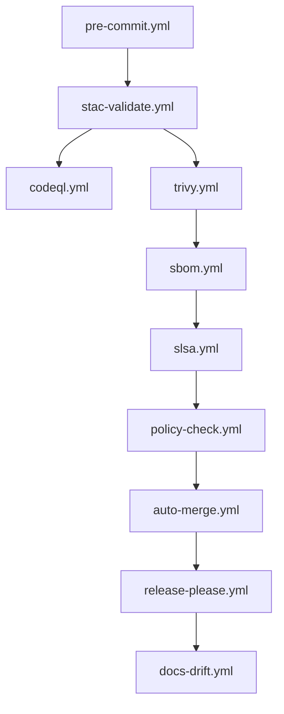

<div align="center">

# 🧭 **Kansas Frontier Matrix — Root Repository Overview (v2.9.0 · Tier-Ω+∞ Platinum++ Certified)**

### *“Time · Terrain · History · Knowledge Graphs”*

[](./.github/workflows/site.yml)
[](./.github/workflows/stac-validate.yml)
[](./.github/workflows/codeql.yml)
[](./.github/workflows/trivy.yml)
[](./.github/workflows/sbom.yml)
[](./.github/workflows/slsa.yml)
[](./docs/)
[](./LICENSE)

</div>

---

<details><summary>📚 <strong>Table of Contents</strong></summary>

- [📘 Context & Scope](#-context--scope)
- [🌾 Mission](#-mission)
- [🧠 Core Concepts](#-core-concepts)
- [🏛 Architecture Snapshot](#-architecture-snapshot)
- [🧱 Repository Structure](#-repository-structure)
- [⚙️ Quickstart](#️-quickstart)
- [🧮 Governance Workflow DAG](#-governance-workflow-dag)
- [🧯 Suite Error & State Taxonomy](#-suite-error--state-taxonomy)
- [🔒 Security & Supply Chain](#-security--supply-chain)
- [🧾 Provenance & FAIR Registration](#-provenance--fair-registration)
- [🔗 JSON-LD Repository Provenance](#-json-ld-repository-provenance)
- [📑 Documentation & CI (Docs-as-Code)](#-documentation--ci-docs-as-code)
- [🤖 AI Governance (Quality & Ethics)](#-ai-governance-quality--ethics)
- [🧾 Data Ethics & Cultural Safeguards](#-data-ethics--cultural-safeguards)
- [📦 Artifacts & Evidence Registry](#-artifacts--evidence-registry)
- [📈 Observability & Health](#-observability--health)
- [📜 Linked ADRs & SOPs](#-linked-adrs--sops)
- [🔗 Design → Implementation Traceability](#-design--implementation-traceability)
- [🧾 Versioning & Release Governance](#-versioning--release-governance)
- [🧾 Change-Control Register](#-change-control-register)
- [📣 Contributor Quick-Links](#-contributor-quick-links)
- [📚 References](#-references)
- [🕓 Version History](#-version-history)

</details>

---

## 📘 Context & Scope
This document is the **root index** for the Kansas Frontier Matrix monorepo.  
It defines repository layout, architectural responsibilities, CI/CD enforcement, and governance expectations.

- **Scope:** All production code, datasets, documentation, and automation under the KFM namespace.  
- **Exclusions:** Archived experiments, personal notebooks, third-party forks, or derivative works.  
- **Purpose:** Establish a single point of orientation for contributors, automation pipelines, and governance audits.

---

## 🌾 Mission
The **Kansas Frontier Matrix (KFM)** unifies **time, terrain, and history**.  
It integrates geospatial, ecological, and archival datasets into a **semantic knowledge graph** built on **Neo4j**, following **CIDOC CRM**, **OWL-Time**, and **FAIR/CARE** principles.

> *Every dataset tells a story; every story is mapped, cited, and reproducible.*

---

## 🧠 Core Concepts
| Layer | Purpose |
|:--|:--|
| **ETL / Processing** | Ingest → transform → validate into geospatial layers (COG/GeoJSON/CSV/NetCDF) |
| **AI / ML Enrichment** | OCR, NLP, geocoding, summarization, entity linking, Focus Mode |
| **Knowledge Graph** | Neo4j + CIDOC CRM + OWL-Time + GeoSPARQL; JSON-LD & GraphQL |
| **API Layer** | FastAPI + GraphQL for entities, events, tiles, and dossiers |
| **Frontend** | React + MapLibre + D3 timeline; accessibility-first UI |

---

## 🏛 Architecture Snapshot

```mermaid
flowchart TD
  A["Data Sources<br/>NOAA · USGS · FEMA · KHS · Archives · Treaties"]
    --> B["ETL + AI Pipeline<br/>Python · GDAL · Rasterio · spaCy · Transformers"]
  B --> C["Processed Layers<br/>COG · GeoJSON · CSV · NetCDF"]
  C --> D["STAC Catalog<br/>Collections · Items · Assets"]
  B --> E["Knowledge Graph<br/>Neo4j · CIDOC CRM · OWL-Time · GeoSPARQL"]
  D --> E
  E --> F["FastAPI / GraphQL API<br/>JSON/GeoJSON/JSON-LD"]
  F --> G["Web Frontend<br/>React · MapLibre · Timeline · Focus Mode / AI Assistant"]
  C --> H["Google Earth Exports<br/>KML/KMZ"]
```

<!-- END OF MERMAID -->

> **Mermaid tip:** quote labels that include parentheses or punctuation.

---

## 🧱 Repository Structure
```text
Kansas-Frontier-Matrix/
├─ src/              # ETL, AI/ML, graph, API services
│  ├─ etl/           # Ingestion & transformation (GDAL/Pandas)
│  ├─ ai/            # OCR/NLP, summarization, entity extraction
│  ├─ api/           # FastAPI + GraphQL
│  └─ graph/         # Neo4j schema & migrations
├─ web/              # React + MapLibre frontend
├─ data/
│  ├─ sources/       # Source manifests (license, coverage, URLs)
│  ├─ raw/           # Unprocessed input (LFS/DVC)
│  ├─ processed/     # GeoJSON, COGs, CSVs
│  └─ stac/          # STAC Items & Collections
├─ docs/             # Architecture, SOPs, design, templates, glossary
├─ tools/            # CLI utilities & deployment helpers
├─ tests/            # Unit, integration, and regression tests
├─ .github/          # Workflows, issue templates, governance
├─ .dvc/ (optional)  # DVC config for large files
└─ Makefile          # Canonical pipeline entry
```

> Each dataset includes **SHA-256 checksums**, **license**, and a **STAC manifest**. Large binaries are tracked via **LFS/DVC**.

---

## ⚙️ Quickstart
### 🧰 Requirements
Python 3.11+ · Node 20+ (pnpm) · Neo4j 5.x · GDAL/Rasterio · Make

### 🚀 Setup
```bash
git clone https://github.com/bartytime4life/Kansas-Frontier-Matrix.git
cd Kansas-Frontier-Matrix
pip install -r requirements.txt
cd web && pnpm install && cd ..
```

### 🧮 Run
```bash
make fetch
make process
make stac
make serve
```
Visit **http://localhost:3000** (web UI) and **http://localhost:7474** (Neo4j).

---

## 🧮 Governance Workflow DAG


---

## 🧯 Suite Error & State Taxonomy
| Code | Layer | UX Behavior | Telemetry |
|:--|:--|:--|:--|
| `SUITE/LOAD` | AppShell | splash ≤ 300 ms then fallback | `build_status` |
| `SUITE/HYDRATE` | SSR Hydration | console warn, non-blocking | `hydration_mismatch_rate` |
| `SUITE/VISUAL` | Visual Baselines | PR blocked if > 0.1 % diff | `visual_diff_threshold` |
| `SUITE/A11Y` | axe/Lighthouse | PR blocked; link to report | `a11y_score` |
| `SUITE/PWA` | Workbox | “Limited mode” banner | `pwa_cache_hits` |

---

## 🔒 Security & Supply Chain
- **Pinned SHAs** for all actions; least-privilege OIDC tokens  
- **CodeQL** (static analysis), **Trivy** (CVE scan), **Gitleaks** (secret scan)  
- **SBOM** (Syft CycloneDX) and **SLSA** attestations attached to releases  
- Monthly SHA refresh via Dependabot PRs

---

## 🧾 Provenance & FAIR Registration
- **STAC** lineage (`derived_from`, `providers`, `license`) across datasets  
- Provenance bundle in releases: **`.prov.json`**, **`sbom.cdx.json`**, **`slsa.intoto.jsonl`**  
- DOIs minted via Zenodo for major releases: **{{ zenodo_doi }}**

---

## 🔗 JSON-LD Repository Provenance
```json
{
  "@context": "https://kfm.ai/contexts/repository.jsonld",
  "@type": "Repository",
  "name": "Kansas Frontier Matrix",
  "version": "2.9.0",
  "prov:wasGeneratedBy": "KFM-Automation/DocsBot",
  "prov:used": ["data/stac/catalog.json","web/*","src/*",".github/workflows/*"],
  "prov:wasAttributedTo": ["@kfm-architecture","@kfm-data","@kfm-web","@kfm-ai","@kfm-accessibility","@kfm-security"]
}
```

---

## 📑 Documentation & CI (Docs-as-Code)
- `docs-validate.yml` → schema, metadata, links, and accessibility checks  
- `actionlint` → workflow syntax validation  
- `markdown_rules.md` → unified style (MCP-DL compliant)

---

## 🤖 AI Governance (Quality & Ethics)
- Model cards (`docs/models/*`) with metrics, hashes, and dataset provenance  
- Bias baselines + F1/ROUGE gates; **ai-ethics.yml** blocks regressions  
- HITL approvals by `@kfm-ai`; Focus Mode outputs include **citations + confidence**

---

## 🧾 Data Ethics & Cultural Safeguards
- STAC `data_ethics` for sensitive/tribal datasets (open / restricted-derivatives / no-public-artifacts)  
- Ethics ledger: `docs/standards/ethics/ledger/`  
- Redaction/aggregation of sensitive geometry for public artifacts

---

## 📦 Artifacts & Evidence Registry
| Artifact | Generated By | Retention | Purpose |
|:--|:--|:--|:--|
| `.prov.json` | release-please/slsa.yml | Permanent | Repository provenance |
| `sbom.cdx.json` | sbom.yml | 1 year | Supply-chain inventory |
| `slsa.intoto.jsonl` | slsa.yml | 1 year | Build attestation |
| `docs-validate-report.json` | docs-validate.yml | 90 d | Docs compliance log |
| `metrics.json` | telemetry exporter | 30 d | Root CI health snapshot |

---

## 📈 Observability & Health
```yaml
metrics:
  build_status: "passing"
  stac_pass_rate: 100
  codeql_critical: 0
  trivy_critical: 0
  a11y_score: 97
  action_pinning_pct: 100
  artifact_verification_pct: 100
dashboards:
  - https://metrics.kfm.ai/grafana/root
```

---

## 📜 Linked ADRs & SOPs
| Document | Purpose | Status |
|:--|:--|:--:|
| `docs/adr/ADR-001-monorepo-architecture.md` | Unified repo layout | ✅ |
| `docs/adr/ADR-008-release-governance.md` | Versioning & governance policy | ✅ |
| `docs/sop/contributor-onboarding.md` | Contributor setup | ✅ |
| `docs/sop/security-scanning.md` | Security & supply chain SOP | ✅ |

---

## 🔗 Design → Implementation Traceability
| Mockup | Component | Tokens | Status |
|:--|:--|:--|:--:|
| `map_overlay_v2.0` | `web/src/components/map/Legend.tsx` | `--kfm-color-accent`,`--kfm-space-md` | ✅ |
| `timeline_v2.3` | `web/src/components/timeline/Slider.tsx` | `--kfm-motion-smooth` | ⚙️ QA |

---

## 🧾 Versioning & Release Governance
```yaml
versioning:
  code: "SemVer"
  data: "STAC item versions"
  docs: "MCP metadata + changelog"
  models: "Model card + hash"
  automation: "release-please.yml"
  doi_on_major: true
tags:
  releases: "kfm-vMAJOR.MINOR.PATCH"
  designs: "mockups-v*"
  catalogs: "stac-v*"
```

**Release checklist (gates)**  
Pre-commit ✅ · STAC ✅ · CodeQL/Trivy ✅ · Docs ✅ · SBOM/SLSA ✅ · Policy ✅ · Ethics ✅

---

## 🧾 Change-Control Register
```yaml
changes:
  - date: "2025-11-18"
    change: "Platinum++ upgrade: governance DAG, JSON-LD provenance, suite error taxonomy, pinned-action policy, and expanded telemetry."
    reviewed_by: "@kfm-architecture"
    pr: "#482"
  - date: "2025-10-20"
    change: "Added context, evidence registry, telemetry snapshot, ADR linkage, and contributor links."
    reviewed_by: "@kfm-architecture"
    pr: "#418"
```

---

## 📣 Contributor Quick-Links
- 🗂 [Open Issues](./issues)
- 🚀 [New Pull Request](./compare)
- 🧩 [Project Board](./projects)
- 📘 [Contributing Guide](./CONTRIBUTING.md)

---

## 📚 References
- `docs/architecture/system-architecture-overview.md`  
- `docs/architecture/file-architecture.md`  
- `docs/architecture/ai-automation.md`  
- `docs/standards/markdown_rules.md` · `docs/standards/markdown_guide.md`  
- `data/stac/` · `data/sources/`  
- `tests/`

---

## 🕓 Version History
| Version | Date | Author | Summary | Type |
|:--|:--|:--|:--|:--|
| **v2.9.0** | 2025-11-18 | @kfm-architecture | Platinum++ upgrade: governance DAG, JSON-LD, error taxonomy, pinned-action policy, enhanced telemetry & badges | Major |
| v2.2.0 | 2025-10-20 | @kfm-architecture | Context, artifacts, telemetry, ADRs, ToC | Minor |
| v2.1.0 | 2025-10-19 | @kfm-architecture | Dropdown ToC, alignment to MCP v6.3.2 | Minor |
| v2.0.0 | 2025-11-14 | @kfm-architecture | Tier-Ω+∞ upgrade: FAIR provenance, supply-chain badges, versioning policy | Major |
| v1.6.3 | 2025-10-18 | @kfm-architecture | Consolidated Quickstart + security hardening | Minor |
| v1.0.0 | 2024-06-01 | Founding Team | Initial repository overview | Major |

---

<div align="center">

🏛 *Document the Frontier · Reconstruct the Past · Illuminate Connections*  
[]()  
[]()  
© 2025 Kansas Frontier Matrix — MIT (code) · CC-BY 4.0 (data/docs)

</div>

<!-- MCP-FOOTER-BEGIN
MCP-VERSION: v6.4.3
MCP-TIER: Ω+∞ Platinum++
DOC-PATH: README.md
MCP-CERTIFIED: true
AUTO-DOC: true
RISK-REGISTER-INCLUDED: true
WORKFLOW-DAG-DOCUMENTED: true
PINNED-ACTIONS-POLICY: true
OBSERVABILITY-ACTIVE: true
PROVENANCE-JSONLD: true
PWA-COMPATIBLE: true
NO-PII-TELEMETRY: true
PERFORMANCE-BUDGET-P95: 2.5 s
GENERATED-BY: KFM-Automation/DocsBot
LAST-VALIDATED: {build.date}
MCP-FOOTER-END -->
