<div align="center">

# 🌾 Kansas-Frontier-Matrix

### **Time · Terrain · History** — *A mission-grade, open-source, spatiotemporal knowledge hub for Kansas*

[](./.github/workflows/site.yml)
[](https://bartytime4life.github.io/Kansas-Frontier-Matrix/)
[](./.github/workflows/stac-validate.yml)
[](./.github/workflows/codeql.yml)
[](./.github/workflows/trivy.yml)
[](./docs/)
[%20%7C%20CC--BY%20(data)-blue)](./LICENSE)

**A living atlas of Kansas** that fuses historical documents, maps, climate & hazards data into a **timeline + map** you can explore, query, and extend.  
Built for **reproducibility, provenance, and open science**.

</div>

---

## 🔭 What is this?

Kansas-Frontier-Matrix (KFM) ingests **scans, rasters, vectors, and texts**, enriches them with **AI/NLP**, links them in a **knowledge graph**, and serves them via an **interactive React/MapLibre web app** (timeline + map).  
Under the hood: **ETL pipelines (Python/Make)**, a **STAC catalog**, **Neo4j** (aligned to CIDOC-CRM + OWL-Time), and **FastAPI/GraphQL** for access.

---

## 🧭 Quickstart

```bash
# 0) prerequisites
# - Docker / Docker Compose
# - Python 3.11+, Node 18+, git-lfs (optional), make

# 1) clone
git clone https://github.com/bartytime4life/Kansas-Frontier-Matrix.git
cd Kansas-Frontier-Matrix

# 2) bootstrap (build containers, install deps)
make bootstrap

# 3) fetch & process data (sources -> COG/GeoJSON -> STAC)
make data         # fetch declared sources (data/sources/*.json) + ETL
make stac         # build/validate STAC catalog
make checksums    # integrity sidecars for provenance

# 4) run the stack
docker compose up -d           # api + db + tiles + web
make serve-web                 # dev server for the React app

# 5) open the viewer
# http://localhost:5173  (MapLibre timeline + layers)
````

> All ETL steps are **scripted & reproducible** (Make + Python), with **checksums** and **schema validation** baked into CI.

---

## 🗂️ Repository layout (monorepo)

```
Kansas-Frontier-Matrix/
├─ src/          # ETL, AI/NLP, graph code (Python)
├─ web/          # React app (MapLibre timeline + UI)
├─ data/
│  ├─ sources/   # JSON descriptors (catalog pointers to external data)
│  ├─ raw/       # fetched artifacts (DVC/LFS pointers)
│  ├─ processed/ # COGs, GeoJSON, CSV; derived outputs
│  └─ stac/      # STAC collections/items/assets (JSON)
├─ docs/         # MCP docs: SOPs, experiment templates, model cards, architecture
├─ tools/        # utilities (importers, georef scripts, etc.)
├─ tests/        # CI tests for ETL/NLP/graph/web
└─ .github/      # workflows, issue/PR templates
```

**Why this structure?** It enables **atomic updates** across code, data, and docs; a **single STAC** for discovery; and **MCP** rigor in docs-first workflows.

---

## 🏗 Architecture (end-to-end)

```mermaid
flowchart TD
  A["Sources (scans · rasters · vectors · documents)"] --> B["ETL Pipeline (Make · Python · checksums)"]
  B --> C["Processed Layers (COGs · GeoJSON)"]
  B --> I["AI/ML Enrichment (NER · geocoding · linking)"]
  C --> D["STAC Catalog (collections · items · assets)"]
  D --> E["Config Build (app.config.json · layers.json)"]
  D --> H["Knowledge Graph (Neo4j · CIDOC CRM · OWL-Time)"]
  I --> H
  H --> J["API Layer (FastAPI · GraphQL)"]
  D --> J
  J --> F["Frontend (React + MapLibreGL) · timeline · search · filters"]
  E --> F
  E --> G["Google Earth Exports (KML · KMZ)"]
```



*Reference architecture.*

---

## 🗃 Data catalog & formats

* **Source descriptors** (`data/sources/*.json`) are **pointers** to external datasets (URLs/REST/APIs) + metadata (title, license, bbox, time). ETL reads these to fetch & transform into open formats.
* **Processed outputs** use **COG GeoTIFF** (rasters) & **GeoJSON** (vectors) for broad GIS compatibility and efficient web delivery.
* **STAC** (`data/stac/`) indexes every layer with spatial, temporal, and provenance metadata for discovery and validation.

> **Pro tip:** Convert historic MrSID or non-WGS84 data to **COG (EPSG:4326)** with overviews; reproject NAD27/NAD83 using GDAL before publish.

---

## 📚 What’s inside the map (featured layers)

**Basemaps & terrain**

* Kansas LiDAR / 1-m DEM → hillshade/slope/aspect rasters (COGs).
* Historic Topographic Maps (USGS & UT PCL) — 1890s–1950s DRGs & quads, georeferenced & time-tagged.

**Hydrology & land cover**

* Rivers/floodplains, reservoirs, wetlands; **NLCD** land cover & historic vegetation/prairie reconstructions.

**Soils & geology**

* **SSURGO** soils, surface geology, aquifer extents, mining/oil fields (vector + attributes).

**Boundaries, routes & settlements**

* Treaty & reservation boundaries (time-enabled), county formation timeline; **Santa Fe/Oregon Trails**; railroad expansion by year; forts/towns POIs.

**Climate & hazards**

* NOAA **GHCN-Daily** (1880s–present), **Daymet** (1980–present), **U.S. Climate Normals** baselines.
* **NOAA Storm Events** (1950–present), **SPC Tornado tracks** (1950–present), **FEMA disasters** (1953–present).

**Cultural & textual overlays**

* Kansas Memory (KSHS), Chronicling America — OCR’d texts → **NER-extracted People/Places/Events**, geo-tagged snippets on the map.

> **Power users:** see **`docs/`** for data-resource guides, ingestion notes, and licensing details.

---

## 🤖 AI/ML enrichment & knowledge graph

* **NLP (spaCy + transformers):** extract **dates, places, people, orgs, events** from OCR’d texts; geocode via GNIS; summarize for tooltips; log provenance to each fact.
* **Entity linking & scoring:** alias/fuzzy/context disambiguation to connect references into **Neo4j**; confidence scores & curator review queues.
* **Semantics:** align graph patterns to **CIDOC-CRM** (cultural events) + **OWL-Time** (intervals) to enable chronology-aware queries & inference.
* **Symbolic rules:** optional rule layer (e.g., “TreatySigning involves Place inside Territory ⇒ link Territory as affected”) to **deduce implicit facts** and surface uncertainty.

---

## 🖥 Web UI (React + MapLibre + Canvas)

* **Map:** GPU-accelerated vector/raster rendering (MapLibre), layer toggles, legends, filter chips.
* **Timeline:** fast, **HTML5 Canvas**–based track with zoom/pan & brushing to filter map by time.
* **Details panel:** entity dossiers (AI summaries + citations), with cross-links to documents, trails, hazards, and people.
* **Accessibility:** WAI-ARIA roles; keyboard focus paths; responsive layout.

> The UI is event-driven (single UI thread) with retained rendering; long tasks are offloaded to keep interactions snappy.

---

## 🧪 Reproducibility & MCP (Master Coder Protocol)

* **Docs-first:** architecture, SOPs, experiments, and model cards live under `docs/` and gate changes via PR review.
* **Experiment template:** Problem → Hypothesis → Method → Variables → Data → Results → Conclusion.
* **STAC & JSON Schema** validation in CI, **checksums** for all artifacts, and **data pointers (DVC/LFS)** to avoid repo bloat while keeping lineage.

---

## 🛠 Make targets (common)

* `make data` — fetch & process all declared sources (COG/GeoJSON + STAC).
* `make stac` — build/validate the STAC catalog; emit report.
* `make serve-web` — run the React app; hot-reload.
* `make checksums` — generate/verify SHA-256 sidecars for provenance.

---

## 🤝 Contributing

We welcome historians, GIS pros, developers, and students. Start with:

* **Good first issues** (help-wanted label)
* **Data additions:** propose a `data/sources/*.json` entry + brief README + license
* **Experiments:** open a PR with `docs/experiments/EXP-…md` using the template

> All contributions must include **provenance** (source URLs, license, method) and **validation artifacts** where applicable.

---

## 🧩 Roadmap highlights

* **Paleoclimate & proxies:** tree rings, pollen cores, charcoal/fire regimes → drought/flood links.
* **Predictive layers:** ML for settlement corridors & site discovery; sims for drought/hazard scenarios.
* **Tribal treaties UX:** narrative overlays & oral histories co-curated with tribal partners.

---

## 🔗 Selected upstream data portals (curated)

KDOT & Kansas GIS Hub • USGS Topo & NWIS • UT PCL Maps • FEMA MSC • Drought Monitor • KGS geology/water • NOAA Storm Events • SPC tornado tracks
(See **Docs** for the full index and usage notes.)

---

## 📄 Citation & license

* **Code:** MIT
* **Generated data & docs:** CC-BY 4.0 (cite this repo and the original data providers)
* **Source datasets** retain their original licenses / terms (see each STAC Item).

When citing this project, please reference **Kansas-Frontier-Matrix** and the relevant **STAC Items** for datasets used.

---

### 📨 Contact

Open a discussion in **GitHub Discussions**, or file an issue with the **question** label.
Let’s stitch Kansas’s fragmented history into a shared, auditable, and beautiful whole.

---

<sub>Frontend canvas / text techniques informed by standard HTML5 / Canvas / CSS practices.</sub>

```

---

Once your **`site.yml`** workflow successfully deploys to Pages, that **Pages Deploy badge** will turn green and link straight to:

> 🔗 https://bartytime4life.github.io/Kansas-Frontier-Matrix/
