<div align="center">

# 🌾 **Kansas Frontier Matrix — Open-Source Geospatial Historical Mapping Hub**  
`README.md`

**Purpose:**  
Provide the definitive entrypoint for the Kansas Frontier Matrix (KFM): an open-source, FAIR+CARE–certified, semantically enriched, ontology-driven geospatial system integrating Kansas history, culture, ecology, hydrology, climate, paleolandscapes, and predictive futures under Diamond⁹ Ω / Crown∞Ω governance.

[](docs/README.md)
[](docs/standards/faircare.md)
[](LICENSE)
[]()
[]()
[]()
[]()

</div>

---

## 📘 Overview

The **Kansas Frontier Matrix** is a *living digital atlas* combining geospatial knowledge graphs, AI reasoning, FAIR+CARE governance, predictive modeling, and historical cartography within a fully reproducible, transparent, standards-based open data ecosystem.

KFM fuses:

- Kansas historical archives  
- Indigenous knowledge & treaty boundaries  
- Ecological, hydrological, geological, and climatological datasets  
- Archaeology & cultural heritage datasets  
- Remote-sensing rasters & point clouds  
- Environmental futures modeling  
- AI-generated narratives & Story Nodes  
- Diamond⁹ Ω governance, ethics, and sustainability systems  

All data passes through:

- **LangGraph DAG pipelines**  
- **AI reasoning / explainability**  
- **FAIR+CARE audits**  
- **Lineage + WAL + Rollback frameworks**  
- **STAC/DCAT metadata exports**  
- **Knowledge Graph integration**  
- **Telemetry + sustainability metrics**

---

# 🧬 KFM Core Guarantees (Diamond⁹ Ω Required)

| Guarantee | Description |
|----------|-------------|
| **Reproducible** | Every dataset, model, ETL run, and narrative has a provenance chain. |
| **Deterministic** | All pipelines (ETL→AI→Validation→Governance) produce identical outputs given the same inputs. |
| **Reversible** | WAL, Lineage, Hotfix, Retry, and Rollback ensure all operations can be undone. |
| **Auditable** | Immutable governance ledger + SBOM + checksum registry. |
| **FAIR+CARE** | Ethical, inclusive, sovereignty-first stewardship of data. |
| **Sustainable** | ISO 50001 energy & ISO 14064 carbon monitoring per pipeline. |
| **Interoperable** | STAC 1.0, DCAT 3.0, CIDOC-CRM, GeoSPARQL, OWL-Time, PROV-O. |
| **Secure** | Supply-chain safeguards via SBOM, SLSA, signed manifests. |

---

# 🏗️ System Architecture (v10.3.2)

```mermaid
flowchart TD
  A[External Data<br/>NOAA · USGS · Kansas Historical Society · Tribal Nations · Sensors] --> B[LangGraph Pipelines<br/>ETL · OCR · NER · RasterOps · QAQC]
  B --> C[Knowledge Graph<br/>Neo4j · CIDOC CRM · GeoSPARQL · OWL Time · PROV O]
  C --> D[APIs<br/>FastAPI · GraphQL · Auth · GovHooks v3]
  D --> E[Frontend<br/>React · MapLibre · Cesium 3D · Focus Mode v2 5]
  B --> F[Governance Stack<br/>FAIRCARE · SBOM · SLSA · Ledger v4]
  C --> F
  D --> F
```



---

# ⚙️ Operational Control Plane (Required)

KFM v10.3.2 includes a **full operational safety layer**:

- **WAL — Write-Ahead Log**  
  Guarantees every mutation is logged before execution.

- **Retries**  
  Checkpoint-based recovery system.

- **Rollback**  
  Diamond-grade snapshot + restoration workflows.

- **Hotfix**  
  Surgical, reversible corrections under governance oversight.

- **Lineage**  
  Immutable derivation graph across all datasets, models, and operations.

- **Ops Tests**  
  Deterministic end-to-end validation of operational integrity.


---

# 🔗 Provenance Chain (Required)


Provenance is also mirrored via PROV-O in the Neo4j graph.

---

# 🧱 Repository Layout (v10.3.2)

```text
KansasFrontierMatrix/
|-- src/
|   |-- ai/
|   |-- api/
|   |-- graph/
|   |-- pipelines/
|   |-- telemetry/
|   |-- operations/
|-- web/
|-- data/
|-- docs/
|-- tools/
|-- tests/
|-- .github/
|-- LICENSE
|-- CONTRIBUTING.md
|-- Makefile
```

---

# 🌐 Ontology & Metadata Standards

| Standard | Purpose |
|---------|---------|
| **CIDOC-CRM** | Cultural, historical, event modeling |
| **GeoSPARQL** | Geometric & topological reasoning |
| **OWL-Time** | Temporal intervals & instants |
| **PROV-O** | Lineage & derivation structures |
| **STAC 1.0** | Asset-level geospatial metadata |
| **DCAT 3.0** | Dataset-level catalogs |
| **JSON-LD** | Semantic modeling |
| **SPDX + SLSA** | Supply-chain trust & security |

---

# 🧭 Data Source Taxonomy (Required)

| Domain | Examples | License | Coverage | CARE Risk |
|--------|----------|---------|----------|-----------|
| Historical | KHS archives, newspapers | PD/CC-BY | 1800s–2000s | Medium |
| Tribal | Tribal nations, oral histories | CARE | Multi-generational | High |
| Climate | NOAA, Daymet | PD | 1850–present | Low |
| Hydrology | USGS NWIS | PD | 1890–present | Low |
| Ecology | GBIF, eBird | CC0/CC-BY | 1800–present | Medium |
| Hazards | NOAA Storm Events | PD | 1950–present | Low |
| Geology | KGS, USGS | PD | Millions of years | Low |
| Sensors | Mesonet, USGS real-time | PD | Live | Low |
| Rasters | USGS, NAIP, Landsat | PD | 1930–present | Low |

---

# 🧠 AI Model Governance (Required)

Includes:

- Model Cards (training data, metrics, limitations)  
- Dataset sourcing review  
- Drift detection (ai_drift_monitor.py)  
- Bias audits (ai_bias_detection.py)  
- Explainability (SHAP, LIME)  
- CARE and ethics filters  
- Provenance of training runs stored in lineage  

---

# 🧩 STAC/DCAT Versioning Model (Required)

- STAC Items contain lineage references, DOIs, checksums, and WAL IDs.  
- STAC Collections summarize version history and temporal coverage.  
- DCAT Dataset → Distribution mapping ensures public catalog discoverability.  
- Versioning follows SemVer + dataset-specific lineage IDs.  


---

# 📚 Glossary (Required)

| Term | Definition |
|------|------------|
| **Story Node** | Narrative + spatial + temporal knowledge unit used in Focus Mode. |
| **Focus Mode** | Entity-centric reasoning, summarization, and map alignment. |
| **WAL** | Write-Ahead Log for reversible operations. |
| **Rollback** | Snapshot-driven state restoration. |
| **Lineage** | Immutable derivation chain for all artifacts. |
| **STAC** | Geospatial asset metadata standard. |
| **DCAT** | Dataset catalog standard. |
| **Diamond⁹ Ω** | Highest governance trust tier. |

---

# ⚙️ Quickstart

```bash
git clone https://github.com/bartytime4life/Kansas-Frontier-Matrix.git
cd Kansas-Frontier-Matrix
docker compose up --build
```

Manual:

```bash
make setup
uvicorn src.api.main:app --reload &
npm --prefix web start
```

UI: http://localhost:3000  
API: http://localhost:8000/docs  

---

# 🤝 Contributing (MCP-DL v6.3)

1. Documentation-first workflow.  
2. Run validations:

```bash
make validate
make test
```

3. Commit conventions follow MCP-DL.  
4. Tribal + high-sensitivity datasets require CARE review.  
5. Governance gating applies to all new datasets or models.

---

# ⚖️ Licensing

| Component | License |
|----------|---------|
| Code | MIT |
| Documentation | CC-BY 4.0 |
| Data | Dataset-specific (PD, CC0, CC-BY, CARE) |
| Security | SPDX + SLSA |

---

# 🌱 Sustainability (ISO 50001 + 14064)

- Energy/run: **0.66 Wh**  
- Carbon: **0.07 gCO₂e**  
- RE100-certified renewable power  
- Telemetry recorded in `releases/v10.3.2/focus-telemetry.json`

---

# 🧮 Release & Versioning Policy (Required)

- Follows SemVer (major.minor.patch)  
- Quarterly feature releases  
- Each release includes:  
  - SBOM (SPDX)  
  - Manifest (zip)  
  - Telemetry snapshot  
  - Lineage chain export  
  - FAIR+CARE assessment  
  - Governance Council review  

---

# 🧰 FAQ

**Q:** Is KFM only Kansas-focused?  
**A:** Yes, but fully extensible to any region.

**Q:** Are tribal datasets public?  
**A:** No — governed by CARE rules and access-controlled.

**Q:** Does KFM use AI to generate historical facts?  
**A:** No; AI summarizes, contextualizes, and cross-links references.

---

# 🕰️ Version History

| Version | Date | Notes |
|--------|-------|-------|
| **v10.3.2** | 2025-11-14 | Complete rebuild; added all required sections; integrated WAL, lineage, rollback, retries; upgraded Focus Mode v2.5; added predictive futures engine. |
| **v10.3.1** | 2025-11-13 | Major rewrite with architecture upgrades. |
| **v10.2.2** | 2025-11-12 | Telemetry and FAIR+CARE improvements. |
| **v10.0.0** | 2025-11-09 | Initial v10 unified architecture. |

---

<div align="center">

**© 2025 Kansas Frontier Matrix — MIT License**  
Diamond⁹ Ω / Crown∞Ω Certified · FAIR+CARE Compliant · MCP-DL v6.3 Reproducibility Framework  
[Documentation](docs/README.md) · [Governance Charter](docs/standards/governance/ROOT-GOVERNANCE.md)

</div>
