<!--
GOVERNED ARTIFACT NOTICE
This README is part of the KFM trust boundary: it communicates non-negotiable invariants.
If you change meaning (not just phrasing), route through the governance review path.
-->

<div align="center">

# Kansas Frontier Matrix KFM‑NG — Governed Geospatial and Historical Knowledge System 🧭🗺️

**KFM turns heterogeneous Kansas history + geospatial data into a governed, evidence-first system:**  
**data → watchers and pipelines → receipts and catalogs → governed APIs → map UI + Story Nodes + Focus Mode**

<br/>


<!-- OPTIONAL: replace ORG/REPO with real values once workflows exist -->
<!--
[](https://github.com/ORG/REPO/actions/workflows/ci.yml)
[](https://github.com/ORG/REPO/actions/workflows/docs.yml)
[](https://github.com/ORG/REPO/actions/workflows/policy.yml)
[](https://github.com/ORG/REPO/actions/workflows/data-gates.yml)
[](https://github.com/ORG/REPO/actions/workflows/acceptance-harness.yml)
-->

</div>

> [!IMPORTANT]
> **KFM is built around a trust membrane:** a **governed API + policy boundary** that mediates _all_ access.  
> **UI and external clients never talk to databases.** Policy evaluates **every** request and **fails closed**.  
> **Focus Mode must cite or abstain.** When in doubt: **deny**.

---

## If You Are New Here Start Here

1) Read the invariants in **[Non‑Negotiable Guarantees](#non-negotiable-guarantees)**.  
2) Run the stack via **[Quickstart Local](#quickstart-local)** and then run the **acceptance harness**.  
3) Understand how we prevent “raw becomes truth” via **[Data Lifecycle Raw Work Processed](#data-lifecycle-raw-work-processed)**.  
4) Understand why Focus Mode **cannot bluff** via **[Focus Mode and Evidence Resolver](#focus-mode-and-evidence-resolver)**.  
5) If you are adding a source: follow **[Adding or Updating a Dataset](#adding-or-updating-a-dataset)**.

---

## What This README Is And Is Not

**This README is a trust-boundary artifact.** It sets non-negotiables and “must/shall” constraints.

**This README is not**:
- a guarantee that every component is already implemented
- a license for publishing sensitive locations or personal data
- a replacement for upstream data license terms or culturally restricted knowledge protocols

> [!NOTE]
> Where implementation details vary by environment, this README uses **recommended** and **illustrative** labels.
> Everything labeled **non-negotiable** is an invariant and should be treated as a release blocker if violated.

> [!NOTE]
> The internal blueprint that motivates these invariants is authoritative for **principles and guarantees**.  
> Specific endpoint paths and schema details are **governed proposals** until locked into `docs/contracts/` and enforced in CI.

---

## Table of Contents

- [Quickstart Local](#quickstart-local)
- [Why KFM Exists](#why-kfm-exists)
- [Non‑Negotiable Guarantees](#non-negotiable-guarantees)
- [Key Definitions Glossary](#key-definitions-glossary)
- [How KFM Works End to End](#how-kfm-works-end-to-end)
- [System Architecture](#system-architecture)
- [Promotion Contract and Validation Gates](#promotion-contract-and-validation-gates)
- [Addressing and Immutability](#addressing-and-immutability)
- [Watchers and Materiality](#watchers-and-materiality)
- [Governed API Surface Overview](#governed-api-surface-overview)
- [Focus Mode and Evidence Resolver](#focus-mode-and-evidence-resolver)
- [Audit Ledger Tamper‑Evident](#audit-ledger-tamper-evident)
- [Data Lifecycle Raw Work Processed](#data-lifecycle-raw-work-processed)
- [Sensitivity Redaction and FAIR CARE](#sensitivity-redaction-and-fair-care)
- [Adding or Updating a Dataset](#adding-or-updating-a-dataset)
- [Governed Artifacts Ownership and Reviews](#governed-artifacts-ownership-and-reviews)
- [CI Gates](#ci-gates)
- [Operations Runbook Minimum](#operations-runbook-minimum)
- [Repository Structure](#repository-structure)
- [Roadmap](#roadmap)
- [Contributing](#contributing)
- [Security](#security)
- [License](#license)
- [Provenance Notes](#provenance-notes)

---

## Quickstart Local

> [!NOTE]
> This repo is **stack-first**: bring up the trust membrane + stores + API + UI together so governance is exercised end-to-end.

### Prerequisites

- Docker + Docker Compose v2
- Toolchains as required by your implementation (often: Node.js for UI, Python or Go for API and pipelines)
- Recommended: `make`, `jq`, `opa`, `conftest`, `cosign`

### Bring up the stack

```bash
cp .env.example .env
docker compose up --build
```

### Run the acceptance harness

> [!IMPORTANT]
> The acceptance harness is a merge-blocking concept in KFM: it validates catalogs, policy, and signatures.
> If your local wiring does not yet include it, treat that as a missing governance gate.

```bash
# recommended
make verify
```

### What to open

- UI: `http://localhost:3000`
- API docs: `http://localhost:8000/docs`
- OPA policy: `http://localhost:8181` (implementation-dependent)

### Governance smoke test minimum

**Map UI**
- Load the map UI
- Toggle a layer: provenance metadata must be visible (not just “pretty tiles”)
- Open the Evidence or Audit drawer and confirm evidence locators render

**Receipts**
- Open a receipt or run manifest view (if wired)
- Confirm schema validation occurs and signature verification is displayed (trust badge pattern)

**Focus Mode**
- Ask one question with explicit view context (time range + bbox + active layers)
- Confirm:
  - citations exist **or** the response abstains
  - `audit_ref` exists (always)
  - each `citation.ref` is resolvable (see [Evidence resolver](#focus-mode-and-evidence-resolver))

> [!IMPORTANT]
> If OPA is down, policy fails to load, required keys are missing, a signature cannot be verified,
> or evidence validation fails: **the system must deny**. Fail closed.

---

## Why KFM Exists

Kansas history and geography live across **maps, archives, datasets, and narrative sources**. KFM‑NG unifies those sources into a **reproducible, inspectable, citation-first** system that supports:

- **Layered maps over time** (raster + vector; historical → modern)
- **Text-to-place linkage** (documents tied to locations + dates)
- **Governed AI** that must show its work (**citations + audit references**) or abstain
- **Public-facing exploration** (web map UI + Story Nodes + Focus Mode)

KFM‑NG is a **provenance-first geospatial knowledge hub**:
- Explore layers on an interactive map with provenance and licensing surfaced.
- Read **Story Nodes** that synchronize map and time state.
- Ask **Focus Mode** grounded Q&A that returns citations + an audit reference — or abstains.

> [!IMPORTANT]
> **Abstention is a feature, not a bug.** If evidence cannot be resolved for the current view, the system must abstain rather than guess.

---

## Non‑Negotiable Guarantees

These invariants must remain true **regardless of implementation**.

| Invariant | What it means | Why it exists | Minimum enforcement |
|---|---|---|---|
| **Trust membrane** | UI and external clients never access databases directly; all access goes through **governed API + policy boundary** | Prevent bypassing governance, provenance, and sensitivity rules | Network isolation + gateway middleware + architecture lint rules |
| **Fail‑closed policy** | If policy cannot prove a request is allowed, **deny** | Safer-than-sorry for sensitive/uncertain cases | OPA default deny + policy tests |
| **Processed zone serves truth** | APIs serve only validated artifacts from processed and cataloged zones | Stops intermediates from becoming “truth” | Serve from processed catalogs only |
| **Promotion Contract required** | Promotion is blocked unless required receipts, catalogs, checksums, and validations exist; missing proofs fail closed | Makes governance enforceable by CI | Merge-blocking CI gate + schema validation + signature verification |
| **Deterministic spec hashing** | Change detection and gating use a canonical `spec_hash` for watcher and pipeline specs | Prevents “I changed nothing” ambiguity | RFC‑8785 JCS canonicalization + hash gate in CI |
| **Digest pinning** | Consumers must use immutable digests for artifacts and bundles | Prevents substitution attacks and “moving targets” | Digest-only references + verification checks |
| **Evidence refs resolvable** | Every `citation.ref` resolves to a human-readable evidence view | Enables review, reproducibility, audits | Evidence resolver + contract tests |
| **Focus Mode cite or abstain** | Every answer includes citations + `audit_ref` **or** abstains | Prevents ungrounded claims | Output validator + policy rule + audit append |
| **Audit is tamper‑evident** | Audit events are append-only and integrity is verifiable | Accountability + incident forensics | Append-only ledger + checkpoint hashes |
| **Redaction recorded** | Redaction and generalization are first-class transformations with lineage | Prevents silent suppression | Derived datasets + PROV records |

### Top-level Definition of Done

- [ ] Datasets ingest via **raw → work → processed** promotion with validated **STAC/DCAT/PROV**
- [ ] Promotion is blocked unless required **run manifest or receipt**, checksums, and validation reports exist
- [ ] A **bundle resolver** can deterministically serve evidence bundles by digest
- [ ] Web UI browses layers + Story Nodes with provenance visible
- [ ] Focus Mode returns **citations or abstains**, and always includes `audit_ref`
- [ ] Evidence resolver can resolve every citation reference to a human-readable view
- [ ] Policy fails closed and is regression-tested, including prior leak tests
- [ ] Governed docs, stories, policies, registries, receipts, and contracts pass CI validation

---

## Key Definitions Glossary

| Term | Definition in KFM usage |
|---|---|
| **Dataset** | A governed unit of ingestion and serving with license, sensitivity label, and catalogs. |
| **DatasetVersion** | A versioned snapshot tied to checksums, run metadata, and provenance. |
| **Run record** | Machine-readable capture of inputs, outputs, code identity, validation report, and PROV links. |
| **Run manifest or receipt** | The minimum “proof bundle” required by the Promotion Contract for publishing. |
| **Promotion Contract** | The merge-blocking set of requirements that must be true before artifacts are promoted and served. |
| **spec_hash** | Deterministic hash of a canonicalized spec used for change detection and gating. |
| **bundle_digest** | Immutable digest identifying an evidence bundle that can be resolved by a bundle resolver endpoint. |
| **Evidence reference** | A resolvable pointer such as `prov://`, `stac://`, `dcat://`, `doc://`, or `graph://`. |
| **Watcher** | A governed process that monitors an upstream source and triggers ingest via PR workflow when material changes occur. |
| **Watchers registry** | A signed catalog of watchers with schema validation and provenance metadata. |
| **Story Node** | A governed narrative unit that binds map/time state + claims + citations. |
| **ViewState** | Canonical map and time context passed into Focus Mode queries. |
| **Abstain** | The correct response when the system cannot ground a claim to resolvable evidence. |

---

## How KFM Works End to End

```mermaid
flowchart LR
  A[External Sources<br/>maps • records • APIs • archives] --> W[Watchers + Connectors<br/>poll/webhook • conditional fetch • spec_hash]
  W --> RZ[data/raw<br/>immutable inputs + manifests + checksums]
  RZ --> P[Pipeline Runs<br/>normalize • validate • enrich]
  P --> WZ[data/work<br/>run_record • validation_report • receipts]
  WZ -->|Promotion Contract gate| PRZ[data/processed<br/>serving truth]
  PRZ --> C[Catalogs<br/>DCAT + STAC + PROV<br/>cross-linked + validated]
  C --> B[Evidence Bundles<br/>bundle_digest • signatures<br/>OCI referrers or object store]
  C --> IDX[Indexes<br/>search • vector • graph]
  B --> API[Governed APIs<br/>policy checks • redaction • evidence resolver]
  IDX --> API
  API --> UI[UI<br/>Map • Timeline • Story Nodes • Focus Mode]
  API --> AL[Audit Ledger<br/>append-only + checkpoints]
```



---

## System Architecture

### Clean layers and trust membrane

KFM‑NG follows strict boundaries:

- **Domain layer:** pure entities and invariants
- **Use case layer:** workflows and business rules; depends only on interfaces
- **Interfaces layer:** ports, DTOs, and schemas; API boundaries live here
- **Infrastructure layer:** PostGIS/Postgres, graph DB, search/vector, object storage, runtime hosts

> [!IMPORTANT]
> Trust membrane rule is non-negotiable:  
> **Frontend and external clients never access databases directly.**  
> **Core backend logic never bypasses repository interfaces to talk directly to storage.**

### Runtime components container view


### Knowledge layer extraction graph and concept catalog

KFM treats document structure, chunks, concepts, relationships, and citations as governed objects.


---

## Promotion Contract and Validation Gates

> [!IMPORTANT]
> “Data added” is not “data served.” Only artifacts that satisfy the Promotion Contract can be promoted and served.

### Promotion Contract non-negotiable behaviors

- Missing required receipts, catalogs, checksums, or signatures must fail closed.
- Promotion must be blocked if validation gates have not run or reports are incomplete.
- A policy kill switch must be able to disable risky surfaces without a redeploy.

### Acceptance harness recommended minimum

The acceptance harness is the concrete CI and local gate that validates:

- STAC, DCAT, and PROV artifacts validate and cross-link
- Policy tests pass with default deny semantics
- Signature and attestation verification passes
- spec_hash is reproducible for specs that drive watchers and pipelines

> [!TIP]
> Treat the acceptance harness as a reusable CI module and a local `make verify` target.

---

## Addressing and Immutability

KFM uses two distinct “identity primitives”:

### spec_hash for specs

**spec_hash** is a deterministic digest computed from a canonicalized spec, used for:
- watcher specs
- pipeline recipes
- policy bundles and other governed “entry” specs

Recommended rule:
- Canonicalize spec JSON using RFC‑8785 JSON Canonicalization Scheme, then compute sha256.

### bundle_digest for evidence bundles

**bundle_digest** identifies a specific evidence bundle.
Evidence bundles may be stored in object storage or published through an OCI registry as referrers.

Recommended capability:
- a bundle resolver endpoint that can serve or describe a bundle by digest

```text
GET /bundles/{digest}
```

> [!NOTE]
> When a system component refers to an artifact, it should do so by **digest**, not by mutable tags.

---

## Watchers and Materiality

Watchers allow ingestion to be driven by upstream change signals rather than manual runs.

### Watcher workflow pattern

```mermaid
flowchart LR
  U[Upstream endpoint] --> CF[Conditional fetch<br/>ETag • Last-Modified]
  CF --> CAN[Canonicalize JSON]
  CAN --> SH[Compute spec_hash]
  SH --> PR[Open PR with evidence]
  PR --> CI[Acceptance harness]
  CI --> REG[Publish bundles<br/>ORAS push + referrers]
  REG --> SIG[Sign and attest<br/>cosign]
  SIG --> PROM[Promotion gate]
```



### Watchers registry requirements

Recommended: Watchers are discoverable, schema-validated, and signed objects with a DCAT wrapper.

Minimum fields recommended for watcher specs:
- `watcher_id`
- `endpoint`
- polling or webhook mode
- `policy` section
- `outputs`
- `spec_hash`
- `signature_ref`

### Materiality rules

Materiality rules are provider-aware thresholds that decide:
- when a watcher should open a PR
- when a change should be considered a minor vs material release
- when promotion should require extra review

Examples of provider-aware triggers:
- soils updates
- realtime air quality feeds
- transportation work zone feeds

---

## Governed API Surface Overview

> [!NOTE]
> Treat this section as an API map. Lock details into OpenAPI and JSON Schemas before enforcing in CI.

Core principles:
- Every endpoint is authorized by policy default deny.
- Every response is attributable to promoted artifacts.
- Evidence resolution is a first-class capability.

### Endpoint families

| Family | Example endpoints | Purpose |
|---|---|---|
| Health | `GET /healthz` | readiness and connectivity checks |
| Catalogs | `GET /api/v1/catalog/dcat/...` `GET /api/v1/catalog/stac/...` `GET /api/v1/catalog/prov/...` | discovery and lineage |
| Bundles | `GET /bundles/{digest}` | resolve evidence bundles by digest |
| Data and tiles | `GET /api/v1/layers/...` `GET /api/v1/tiles/{z}/{x}/{y}` | map rendering and layer metadata |
| Stories | `GET /api/v1/stories/{story_id}` | governed narrative playback |
| Evidence | `GET /api/v1/evidence/resolve?ref=prov://...` | resolves `prov://` `stac://` `dcat://` `doc://` `graph://` |
| Focus Mode | `POST /api/v1/ai/query` | grounded Q&A with citations + audit |

---

## Focus Mode and Evidence Resolver

Focus Mode cannot “just answer.” Every nontrivial claim must be traceable via resolvable citations or it must abstain.

### ViewState contract recommended

```ts
type ViewState = {
  timeRange: [string, string];
  bbox: [number, number, number, number];
  activeLayers: string[];
  storyNodeId?: string;
  storyStepId?: string;
  userRole?: string;
};
```

### Focus query contract fragment

`POST /api/v1/ai/query`

**Request**
```json
{
  "question": "…",
  "context": {
    "time_range": ["1850-01-01T00:00:00Z", "1900-12-31T23:59:59Z"],
    "bbox": [-102.0, 36.9, -94.6, 40.0],
    "active_layers": ["…"],
    "story_node_id": "…"
  }
}
```

**Response**
```json
{
  "answer_markdown": "…",
  "citations": [
    {"ref": "prov://…", "label": "…"},
    {"ref": "doc://…", "label": "…"}
  ],
  "audit_ref": "audit://event/01J..."
}
```

### Acceptance criterion non-negotiable

- Given any `citation.ref` in a Focus Mode answer, the UI can resolve it to a human-readable evidence view in **2 API calls or fewer**.

### Evidence reference schemes

| Scheme | Points to | Why it exists |
|---|---|---|
| `prov://` | provenance record, activity, entity | lineage and auditability |
| `stac://` | STAC collection, item, asset | spatiotemporal asset trace |
| `dcat://` | dataset or distribution | licensing and discovery |
| `doc://` | document locator and span | textual evidence anchors |
| `graph://` | graph node or edge | structured meaning and joins |

### Required abstention behavior

If evidence is insufficient for the current view, Focus Mode must abstain and still emit an audit reference.

```json
{
  "answer_markdown": "I can't answer that from the verified KFM sources available for this view. Try narrowing the time range or selecting relevant layers.",
  "citations": [],
  "audit_ref": "audit://event/01J..."
}
```

### Policy-as-code cite-or-abstain illustrative

```rego
package kfm.ai

default allow := false

allow if {
  input.answer.has_citations == true
  input.answer.sensitivity_ok == true
}
```

---

## Audit Ledger Tamper‑Evident

> [!IMPORTANT]
> The audit ledger is not “just logs.” It is a governed, queryable record of policy decisions and outputs.

Non-negotiable properties:
- Append-only writes
- Every Focus Mode response produces an `audit_ref`
- Checkpointing to object storage with checksums for tamper evidence

Minimum audit event fields:

| Field | Meaning |
|---|---|
| `audit_ref` | stable ID returned to the client |
| `timestamp` | when the event was recorded |
| `actor` | role + attributes; no PII in public logs |
| `request` | endpoint + sanitized request metadata |
| `policy` | allow/deny + policy bundle version |
| `evidence_bundle_hash` | digest of evidence pack used |
| `output_hash` | digest of response payload |
| `prov_links[]` | PROV references for datasets and activities |

> [!WARNING]
> If audit recording fails, the request must fail. No audit, no answer.

---

## Data Lifecycle Raw Work Processed

KFM‑NG organizes data into zones with promotion gates.


### Ingestion workflow recommended

- Discover: resolve endpoints and auth; cache capability metadata.
- Acquire: incremental slices when possible; otherwise snapshot and diff.
- Normalize: UTF‑8, WGS84 geometry, ISO 8601 time.
- Validate: schema, geometry, timestamps, license and policy checks.
- Enrich: join keys, place and time normalization, entity resolution candidates.
- Publish: promote to processed, update catalogs, trigger index refresh.

### Promotion gate checklist

To promote anything to processed and serve it:
- [ ] License present
- [ ] Sensitivity classification present
- [ ] Schema and geospatial checks pass
- [ ] Checksums computed
- [ ] DCAT always exists and validates
- [ ] STAC and PROV exist where applicable and validate
- [ ] Run record exists and links inputs, outputs, and code identity
- [ ] Run manifest or receipt exists and passes schema validation
- [ ] Signatures and attestations verify when required
- [ ] Audit event recorded
- [ ] Human approval when sensitive

### Minimum artifacts recommended

| Artifact | Purpose | Typical location recommended |
|---|---|---|
| `manifest.yml` | deterministic acquisition + expected checksums | `data/raw/<dataset_id>/manifest.yml` |
| `checksums.sha256` | raw integrity | `data/raw/<dataset_id>/checksums.sha256` |
| `run_record.json` | inputs, outputs, code hash, PROV link | `data/work/<dataset_id>/runs/<run_id>/run_record.json` |
| `validation_report.json` | promotion gate report pass/fail | `data/work/<dataset_id>/runs/<run_id>/validation_report.json` |
| `run_manifest.json` | Promotion Contract receipt | `data/work/<dataset_id>/runs/<run_id>/run_manifest.json` |
| DCAT JSON | discovery + licensing | `data/catalog/dcat/<dataset_id>.json` |
| STAC collection and items | geospatial assets + extents | `data/catalog/stac/<dataset_id>/...` |
| PROV bundle | lineage for activities and entities | `data/catalog/prov/<dataset_id>/...` |
| bundle descriptor | digest-addressed evidence bundle | `data/bundles/<bundle_digest>/descriptor.json` |

---

## Sensitivity Redaction and FAIR CARE

Some data must be treated as sensitive.
KFM protects people and sites by design using policy labels, derived datasets, and fail-closed checks.

### Sensitivity classes required

| Class | Meaning | Examples | Required handling |
|---|---|---|---|
| Public | safe to publish without redaction | most open data | normal serving |
| Restricted | requires role-based access | parcel ownership, high PII risk | RBAC + field-level redaction |
| Sensitive-location | coordinates must be generalized or suppressed | archaeology sites, sensitive species | generalized geometry + strict access |
| Aggregate-only | only publish above thresholds | small-count health and crime | min cell size + suppression |

### Redaction as first-class transformation

- Raw inputs remain immutable.
- Redacted and generalized outputs are separate derived DatasetVersions with their own provenance.
- Redaction methods must be recorded in PROV for auditability.

### Policy regression suite required

Every release must include:
- golden queries that previously leaked restricted fields must fail forever
- negative tests proving sensitive-location layers cannot be returned at high precision to unauthorized roles
- field-level tests verifying owner names, health small counts, and exact archaeological coordinates are redacted
- audit integrity tests proving every API response includes `audit_ref` and evidence bundle hash

> [!NOTE]
> FAIR supports machine-actionable discovery and reuse. CARE ensures rights-aware governance when knowledge may have sensitive cultural implications.

---

## Adding or Updating a Dataset

> [!IMPORTANT]
> Only processed and cataloged datasets can be served. Raw and work zones are never served directly.

### Integration workflow

1) Discover endpoints, auth, rate limits, cadence
2) Acquire incremental when possible, else snapshot and diff
3) Normalize encoding, geometry, and time
4) Validate schema, geo, time, license, sensitivity
5) Enrich join keys and normalization
6) Publish: promote to processed, emit catalogs, refresh indexes

### Dataset integration Definition of Done

- [ ] Connector implemented and registered in source registry
- [ ] Raw acquisition produces deterministic manifest and checksums
- [ ] Normalization emits canonical schema and or STAC assets
- [ ] Validation gates implemented and enforced in CI
- [ ] Policy labels defined and redaction implemented where required
- [ ] Catalogs emitted, validate, and are link-check clean
- [ ] Run record and run manifest exist and cross-link to PROV
- [ ] API contract tests pass for at least one representative query
- [ ] Backfill strategy documented

### Secret handling non-negotiable

- Secrets are never committed
- Local `.env` is for local-only convenience
- Production uses a secrets manager

---

## Governed Artifacts Ownership and Reviews

Treat these as production inputs. Changes require review and validation.

| Artifact type | What it controls | Typical path | CI checks minimum |
|---|---|---|---|
| Policies | authorization, redaction, cite-or-abstain | `policy/` | `opa test` + regression suite |
| Catalogs | what can be served and how cited | `data/catalog/` | schema validation + link-check |
| Processed data | queryable truth | `data/processed/` | checksums + invariants + drift |
| Story Nodes | governed narrative state machine | `docs/story_nodes/` | template validator + citation resolution |
| Run manifests and receipts | Promotion Contract proofs | `data/work/**/runs/**/` | schema validation + signature verification |
| Watchers registry | what watchers exist and how governed | `data/registry/watchers/` | schema validation + signature verification |
| KFM entries | standards, playbooks, patterns, notes | `docs/entries/` | schema lint + link-check |
| API contracts | public surface | `docs/contracts/` | OpenAPI and JSON Schema lint + contract tests |
| Runbooks | ops invariants | `docs/runbooks/` | link-check + required sections |

### Governance review path recommended

Any change that affects trust membrane, policy defaults, sensitivity behavior, Promotion Contract, or cite-or-abstain enforcement is a release blocker until reviewed.

Minimum reviewer roles:
- policy changes: governance + security
- sensitive dataset changes: data steward + governance
- API contracts: API owner + policy reviewer
- published Story Nodes: story editor + evidence reviewer

---

## CI Gates

Recommended minimal hardening:

- [ ] Docs: markdown lint + link-check + required headings
- [ ] Story Nodes: template validator + citation resolution
- [ ] Data: STAC, DCAT, PROV validation + checksums + drift checks
- [ ] Receipts: run manifest schema validation + required fields matrix
- [ ] Policy: OPA tests with default deny and cite-or-abstain regression suite
- [ ] Acceptance harness: conftest + cosign verify + spec_hash check
- [ ] Supply chain: SBOM + provenance attestation

<details>
<summary><strong>CI philosophy</strong></summary>

- Fail fast on policy violations.
- Treat catalogs and receipts as tests, not best-effort.
- Require proofs before serving new datasets.
- Keep non-regression tests for prior leakage bugs.

</details>

---

## Operations Runbook Minimum

Production readiness requires operational discipline.

### Dataset freshness SLOs required

Each dataset carries a freshness SLO appropriate to its cadence:
- Mesonet: less than 1 hour
- Storm Events: less than 30 days
- Static archives: exempt

### Observability signals minimum

- ingest runs: success, duration, rows and bytes, retries
- freshness: last success timestamp + expected cadence
- quality drift: distributions, missingness, geometry errors
- API: latency, cache hit, policy denials, evidence resolution failures
- storage: object store growth, PostGIS index health, search lag

### Incident response patterns

- data leak: deny via policy toggle, rotate credentials, withdraw artifacts, publish redacted derivative with new provenance
- unsafe AI output: disable Focus Mode via policy, preserve audit logs, fix validator or policy, add regression test
- corrupted processed artifacts: verify checksums, roll back version, rebuild indexes

### Emergency deny switch required

Maintain a policy-controlled kill switch to disable public endpoints and Focus Mode without redeploying code.

---

## Repository Structure

> [!IMPORTANT]
> Canonical top-level paths: `data/`, `docs/`, `src/`, `web/`, `policy/`, `.github/`.

```text
.
├── .github/
│   ├── workflows/                         # CI gates: docs, policy, data catalogs, receipts, acceptance harness
│   ├── ISSUE_TEMPLATE/
│   ├── PULL_REQUEST_TEMPLATE.md
│   └── CODEOWNERS                         # Ownership: policy/, data/catalog/, docs/story_nodes/, data/registry/
│
├── docs/
│   ├── README.md                          # Docs hub
│   ├── adr/                               # Architecture Decision Records
│   ├── architecture/                      # C4 diagrams, trust membrane writeups
│   ├── governance/                        # FAIR/CARE, sensitivity, review paths, Promotion Contract docs
│   ├── contracts/                         # OpenAPI, GraphQL, JSON schema references
│   ├── runbooks/                          # Ops SOPs and incident response
│   ├── entries/                           # KFM entries: standards, playbooks, patterns, schemas, notes
│   │   ├── standards/
│   │   ├── playbooks/
│   │   ├── patterns/
│   │   ├── schemas/
│   │   └── notes/
│   └── story_nodes/                       # Story Node content lifecycle
│       ├── templates/
│       ├── drafts/
│       └── published/
│
├── schemas/
│   ├── audit/
│   ├── story_nodes/
│   ├── policy/
│   ├── catalogs/
│   ├── receipts/                          # run_manifest and receipt schemas
│   └── entries/                           # schema for docs/entries objects
│
├── policy/
│   ├── rego/
│   ├── tests/
│   ├── bundles/
│   ├── data/
│   └── README.md
│
├── data/
│   ├── README.md
│   ├── registry/
│   │   ├── sources.yml
│   │   ├── datasets.yml
│   │   ├── watchers/                       # watchers registry objects + signatures
│   │   └── crosswalks/
│   ├── raw/
│   ├── work/
│   │   └── <dataset_id>/
│   │       └── runs/<run_id>/              # run_record.json, validation_report.json, run_manifest.json
│   ├── processed/
│   ├── catalog/
│   │   ├── dcat/
│   │   └── stac/
│   ├── prov/
│   ├── bundles/                            # bundle descriptors and tiny fixtures
│   ├── audit/
│   └── fixtures/
│
├── src/
│   ├── server/
│   ├── services/
│   ├── pipelines/
│   ├── graph/
│   └── shared/
│
├── web/
│   ├── app/
│   ├── components/
│   ├── routes/
│   ├── styles/
│   ├── tests/
│   └── README.md
│
├── tests/
│   ├── contract/
│   ├── integration/
│   └── e2e/
│
├── tools/
│   ├── lint/
│   ├── validate/
│   ├── verify/                             # local acceptance harness helpers
│   └── scripts/
│
├── releases/
│   ├── sbom/
│   ├── attestations/
│   ├── changelogs/
│   └── artifacts/
│
├── infra/
│   ├── docker/
│   ├── k8s/
│   ├── openshift/
│   └── terraform/
│
├── docker-compose.yml
├── .env.example
├── Makefile
├── README.md
├── LICENSE
├── SECURITY.md
├── CONTRIBUTING.md
└── CHANGELOG.md
```

---

## Roadmap

| Epic | Deliverables | Acceptance criteria |
|---|---|---|
| E1 Governance and CI | validators, policy tests, doc and story lint | PR fails if governed artifacts invalid |
| E2 Promotion Contract | run manifest schema, merge-block rules, kill switch | promotion blocked without proofs |
| E3 Bundles and Resolver | bundle_digest, /bundles resolver, evidence pack wiring | bundles resolvable and verifiable |
| E4 Data pipeline | run records, validators, promotion gates, catalogs | processed datasets always have catalogs + checksums |
| E5 Evidence resolver | resolver endpoints + UI evidence views | citation refs resolvable within 2 calls |
| E6 Watchers registry | schema, signed registry, reference watchers | watcher changes are auditable and discoverable |
| E7 Focus Mode | retrieval pipeline + audit ledger + eval harness | cite-or-abstain enforced, audit_ref always present |
| E8 UI narrative engine | story viewer + viewstate sync + provenance drawer | deterministic playback; citations visible |
| E9 Productionization | GitOps manifests + observability + runbook | backups tested; incident drills completed |

---

## Contributing

We welcome contributions with provenance.

### Pull request checklist

- [ ] I did not introduce UI to DB direct access
- [ ] I updated or added tests appropriate to the layer
- [ ] If I changed governed artifacts, validators pass
- [ ] I added or updated provenance and citations where required
- [ ] I documented the decision in an ADR if this changes architecture or contracts

---

## Security

- Policy-as-code default deny and output validation for Focus Mode
- Audit ledger append-only and checkpointed with checksums
- Supply chain uses SBOM and provenance attestations

> [!NOTE]
> Security is a system property. Trust membrane, policy, provenance, and receipts must be enforced together.

---

## License

TBD. Add SPDX identifier once chosen.

---

## Provenance Notes

- This README is a governed artifact. Changes that affect system meaning must route governance review.
- Many examples are illustrative. Lock details into canonical contracts before enforcing in CI.
- This README is aligned to the internal KFM blueprint and Feb‑2026 governance integration work:
  - cite-or-abstain Focus Mode
  - validated STAC, DCAT, and PROV promotion gates
  - Promotion Contract with receipts, signatures, and fail-closed behavior
  - digest-addressed evidence bundles and a bundle resolver

<div align="center">

**KFM Principle:** *If it can’t be traced, it can’t be trusted.* 🔎

</div>
