```mermaid
flowchart LR
  A["External Sources<br/>(NOAA · USGS · FEMA · KHS · Treaties)"]
    --> B["Python ETL + AI Pipeline<br/>(OCR · NER · Geocoding · Summarization)"]
  B --> C["Processed Layers<br/>COG · GeoJSON · CSV"]
  C --> D["STAC Catalog<br/>Collections · Items · Assets"]
  B --> E["Entity Extraction & Linking<br/>spaCy · Transformers · Rules"]
  E --> F["Neo4j Knowledge Graph<br/>CIDOC CRM · OWL-Time · GeoSPARQL"]
  D --> F
  F --> G["FastAPI / GraphQL API"]
  G --> H["React + MapLibre Web UI<br/>Map · Timeline · AI Panels"]
  C -.-> I["Google Earth Exports<br/>KML/KMZ"]
%% END OF MERMAID
```

<div align="center">

# 🏗️ **Kansas Frontier Matrix — System Architecture**

### *Time · Terrain · History · Knowledge Graphs*

[](../../actions/workflows/site.yml)
[](../../actions/workflows/stac-validate.yml)
[](../../actions/workflows/codeql.yml)
[](../../actions/workflows/trivy.yml)
[](../docs/)
[](../LICENSE)
[](../docs/standards/)

</div>

---

## 📚 Table of Contents

* [🌾 Mission](#-mission)
* [🏛 Principles](#-principles)
* [🗺 High-Level Diagram](#-high-level-diagram)
* [🧱 Layered Architecture](#-layered-architecture)
* [🗂 Repository & Data Layout](#-repository--data-layout)
* [🧮 AI/ML Pipeline](#-aiml-pipeline)
* [🌐 API & Integration](#-api--integration)
* [🖥 Frontend](#-frontend)
* [🔒 Security, Integrity & Provenance](#-security-integrity--provenance)
* [🚀 CI/CD & Release Management](#-cicd--release-management)
* [🏁 Quickstart](#-quickstart)
* [🤝 Contributing](#-contributing)
* [📎 References](#-references)

---

## 🌾 Mission

**Kansas Frontier Matrix (KFM)** is an open-source geospatial–historical knowledge system for Kansas that unites people, places, events, and documents in a Neo4j-backed semantic graph, explored via an interactive map and timeline interface. It integrates diverse open datasets – from NOAA climate records and USGS maps to FEMA disaster logs and the Kansas Historical Society’s archives – to provide rich spatial and temporal context.

Our vision is to build a “living atlas” of Kansas’s frontier history, bringing historical data to life through AI-driven insights and interactive storytelling. Powered by an AI-assisted pipeline and knowledge graph, the system can answer complex historical questions (e.g., “show all references to buffalo in western Kansas in the 1850s”) by linking information across sources. KFM follows open-science best practices (MCP-DL v6.3), meaning every change comes with documentation, versioning, and provenance metadata for reproducibility.

**Key Features:**

* **Interactive Timeline Map**
* **AI-Assisted Extraction**
* **Knowledge Graph Backend**
* **Open Data & Provenance**
* **Standards-Based API**

---

## 🏛 Principles

| Principle              | Description                                                      |
| ---------------------- | ---------------------------------------------------------------- |
| Documentation-First    | Every change co-ships with docs, ADR/SOP updates, and metadata.  |
| Reproducibility        | Deterministic ETL, pinned environments, SHA-256 checksums.       |
| Open Standards         | STAC, DCAT, CIDOC CRM, OWL-Time, GeoSPARQL, PROV-O.              |
| Separation of Concerns | ETL/AI ↔ Graph ↔ API ↔ Web, with clean interfaces.               |
| Defense-in-Depth       | CodeQL, Trivy, signed workflows, artifact retention, audit logs. |

---

## 🗺 High-Level Diagram



<!-- END OF MERMAID -->

---

## 🧱 Layered Architecture

### 1. ETL & Data Processing

* Extract: APIs/archives → `data/raw/`
* Transform: GIS/CSV processing → `data/processed/`
* Catalog: STAC generation → `data/stac/`
* Validation: Schema checks + hash checks

### 2. AI/ML Enrichment

* OCR: Tesseract/OpenCV
* NLP: spaCy NER + transformers
* Linking: Rules + gazetteer mapping
* Provenance: PROV-O lineage, confidence scores

### 3. Knowledge Graph (Neo4j)

* CIDOC CRM · OWL-Time · GeoSPARQL
* Relationships: `MENTIONS`, `OCCURRED_AT`, etc.
* RDF/JSON-LD optional exports

### 4. API Layer (FastAPI + GraphQL)

* REST/GraphQL endpoints
* JSON, GeoJSON, STAC, DCAT, JSON-LD
* Auth, logs, schema enforcement

### 5. Frontend (React + MapLibre + D3)

* Map + Timeline sync
* AI-augmented panels
* Accessible UX + Responsive layout

---

## 🗂 Repository & Data Layout

```text
Kansas-Frontier-Matrix/
├─ src/                # ETL, AI/ML, graph integration code
├─ web/                # React SPA (map, timeline, search)
├─ data/
│  ├─ sources/         # JSON manifests (provenance)
│  ├─ raw/             # DVC/LFS pointers
│  ├─ processed/       # GeoTIFF, GeoJSON, CSV
│  └─ stac/            # STAC catalog
├─ docs/               # Architecture, SOPs, templates, glossary
├─ tools/              # Importers, scripts, deployment configs
├─ tests/              # Unit/integration tests
└─ .github/            # CI/CD configs, PR templates
```

---

## 🧮 AI/ML Pipeline

| Stage         | Tooling              | Output                          |
| ------------- | -------------------- | ------------------------------- |
| OCR           | Tesseract, OpenCV    | Scanned text (page coordinates) |
| NER           | spaCy                | People, Places, Dates           |
| Summarization | BART/T5 Transformers | Concise summaries               |
| Geocoding     | GeoPy + GNIS         | Lat/long, disambiguated names   |
| Linking       | Rules + Similarity   | Canonical entity IDs            |

---

## 🌐 API & Integration

**Key Endpoints**:

* `/api/events?start=1850&end=1870&bbox=...`
* `/api/entities/{id}`
* `/api/search?q=...`
* `/api/tiles/{layer}/{z}/{x}/{y}.pbf`
* `/stac/catalog.json`

**Standards**:

* STAC 1.0, DCAT 2.0, JSON-LD
* RDF vocabularies: CIDOC CRM, OWL-Time, GeoSPARQL
* Exports: KML/KMZ (Google Earth), GeoJSON

---

## 🖥 Frontend

| Subsystem     | Stack          | Features                                    |
| ------------- | -------------- | ------------------------------------------- |
| Map           | MapLibre GL JS | Custom tile layers, overlays, interactions  |
| Timeline      | D3.js + Canvas | Smooth zoom, filters, dynamic events        |
| Panels        | React + Redux  | Summaries, sources, relationships           |
| Accessibility | WAI-ARIA + CSS | WCAG 2.1 AA, keyboard/screen-reader support |

---

## 🔒 Security, Integrity & Provenance

| Control             | Mechanism                            |
| ------------------- | ------------------------------------ |
| Static Analysis     | GitHub CodeQL                        |
| Dependency Scanning | Trivy container scanner              |
| Provenance Tracking | PROV-O + CI logs                     |
| Data Integrity      | SHA-256 checksums                    |
| Auth/AuthZ          | JWT, RBAC, endpoint protection       |
| CI Governance       | Pinned workflows + branch protection |

---

## 🚀 CI/CD & Release Management

* Pre-commit hooks
* STAC + schema validation
* Code & security tests (pytest, Jest, CodeQL, Trivy)
* Semantic versioning (code), versioned STAC catalog (data)
* GitHub Pages auto-deployment from `main`

---

## 🏁 Quickstart

```bash
# Clone and setup
pip install -r requirements.txt
cd web && npm install

# Run Neo4j locally or via docker-compose
# Configure: NEO4J_URI, NEO4J_USER, NEO4J_PASS

# ETL pipeline
make fetch         # download data
make process       # generate processed layers
make stac-validate # schema validation

# Launch app
make serve         # start backend + frontend dev servers
```

Visit `http://localhost:3000` to explore the map and timeline. Access Neo4j browser at `http://localhost:7474` (if running locally).

---

## 🤝 Contributing

* Use [docs/templates/sop.md](docs/templates/sop.md) and [experiment.md](docs/templates/experiment.md)
* Add [model_card.md](docs/templates/model_card.md) for ML components
* All data must include:

  * Source manifest (`data/sources/`)
  * License & provenance
  * STAC entry + checksums
* Follow PR template, run full test suite & validation before submitting

---

## 📎 References

* `docs/architecture/architecture.md`
* `docs/architecture/file-architecture.md`
* `docs/templates/model_card.md`
* `docs/glossary.md`
* `data/sources/*.json`
* `data/stac/*.json`

<div align="center">

🏛 *Document the Frontier · Reconstruct the Past · Illuminate Connections.*
© 2025 Kansas Frontier Matrix — MIT (code) · CC-BY 4.0 (docs)

</div>
