# Kansas Frontier Matrix (KFM) 🧭🗺️  
> A **provenance-first, evidence-backed** “living atlas” of Kansas — where **data, maps, narratives, simulations, and AI** stay traceable to sources.  
> **North Star:** *Every pixel and every sentence has receipts.* 🧾✅


%20%2B%20GraphQL-informational)
-informational)


-informational)


-informational)


---

## 🧭 Start here (fast orientation)

> [!IMPORTANT]  
> KFM is **contract-first + policy-gated + evidence-first**: you can’t “ship” a dataset, story, or AI answer unless it validates ✅

### 🗺️ Read these (in order) 📚
1) 📘 **System + repo blueprint (canonical):** `docs/MASTER_GUIDE_v13.md` *(source of truth)*  
2) 🧱 **Architecture deep dive:** [KFM – Comprehensive Architecture, Features, and Design](<Kansas Frontier Matrix (KFM) – Comprehensive Architecture, Features, and Design.pdf>)  
3) 🗺️ **Platform overview + roadmap:** [KFM – Comprehensive Platform Overview and Roadmap](<Kansas Frontier Matrix (KFM) – Comprehensive Platform Overview and Roadmap.pdf>)  
4) 🖥️ **UI architecture guide:** [KFM – Comprehensive UI System Overview](<Kansas Frontier Matrix (KFM) – Comprehensive UI System Overview (Technical Architecture Guide).pdf>)  
5) 🧠 **AI system overview:** [KFM – AI System Overview](<Kansas Frontier Matrix (KFM) – AI System Overview 🧭🤖.pdf>)  
6) 🧰 **Implementation reference:** [KFM – Comprehensive Technical Documentation](<Kansas Frontier Matrix (KFM) – Comprehensive Technical Documentation.pdf>)  
7) 🧪 **Extra depth:** [KFM – Expanded Technical & Design Guide](<📚 Kansas Frontier Matrix (KFM) – Expanded Technical & Design Guide.pdf>)  
8) 🤖 **Local LLM option:** [KFM AI Infrastructure – Ollama Integration Overview](<KFM AI Infrastructure – Ollama Integration Overview.pdf>)

### 🧩 Where things live
- 📘 **Master guide / doc map:** `docs/` *(blueprints, governance, standards/profiles, templates)*  
- 🧱 **Architecture decisions & diagrams:** `docs/architecture/`  
- 🧩 **Schemas & contracts (STAC/DCAT/PROV/Story/UI/Telemetry):** `schemas/`  
- 🗂️ **Catalog outputs:** `data/stac/` · `data/catalog/dcat/` · `data/prov/`  
- 🧠 **AI + Focus Mode + evals/model cards:** `mcp/` *(and optionally `ai/`)*  
- 📖 **Stories (governed narratives):** `story_nodes/`  
- 🧪 **Notebooks/tutorials (repro capsules):** `notebooks/` *(optional)*  

---

## 📌 Table of Contents
- [What this is](#-what-this-is)
- [The Trust Contract](#-the-trust-contract)
- [Receipts model](#-receipts-model)
- [Architecture at a glance](#-architecture-at-a-glance)
- [Clean Architecture boundaries](#-clean-architecture-boundaries)
- [What you can do with KFM](#-what-you-can-do-with-kfm)
- [Data lifecycle](#-data-lifecycle)
- [Streaming & real-time data](#-streaming--real-time-data)
- [Story Nodes and Focus Mode](#-story-nodes-and-focus-mode)
- [AI system and automation](#-ai-system-and-automation)
- [Local LLM stack (Ollama)](#-local-llm-stack-ollama)
- [Simulation and modeling](#-simulation-and-modeling)
- [APIs](#-apis)
- [Policy, QA, and security gates](#-policy-qa-and-security-gates)
- [Observability & sustainability](#-observability--sustainability)
- [Federation & multi-region network](#-federation--multi-region-network)
- [Repository layout](#-repository-layout)
- [Quickstart](#-quickstart)
- [Golden paths](#-golden-paths)
- [Governance, ethics, and safety](#-governance-ethics-and-safety)
- [Tooling](#-tooling)
- [Roadmap](#-roadmap)
- [Contributing](#-contributing)
- [Project library](#-project-library)
- [Citation and reuse](#-citation-and-reuse)

---

## 🌾 What this is
**Kansas Frontier Matrix (KFM)** is an open-source **geospatial + historical knowledge system** (a “living atlas” of Kansas) designed to:

- ingest **heterogeneous sources** *(rasters, vectors, documents, time series, ML outputs, and even streaming feeds)*
- publish governed **metadata catalogs** (**evidence-first publishing**):
  - **STAC** for spatial assets *(COGs, tiles, features, 3D Tiles)*
  - **DCAT** for dataset discovery *(JSON-LD)*
  - **PROV** for lineage *(how outputs were produced, by whom/what, when)*
- maintain a semantically-structured **knowledge graph (Neo4j)**  
  *(people ⇄ places ⇄ events ⇄ documents ⇄ datasets ⇄ processing runs)*
  - with ontology alignment where useful *(e.g., CIDOC-CRM, GeoSPARQL, OWL-Time, PROV-O)* 🕸️
- power a hybrid query fabric:
  - **PostGIS** for geospatial + tabular truth
  - **Neo4j** for relationship-first discovery + provenance traversal
  - **Search index** (OpenSearch/Elasticsearch/Whoosh + embeddings) for document retrieval
- serve everything through a governed **API boundary** (FastAPI + GraphQL)
- deliver a combined **map + narrative UI** (MapLibre; optional Cesium for 3D)
- enable **Focus Mode**: AI-assisted Q&A that is **citation-backed**, **policy-gated**, and **advisory-only** 🧠🧯

> [!NOTE]  
> KFM’s promise is simple: **if it appears on the map or in text, the system can show the receipts.** 🧾

---

## 🔒 The Trust Contract
These are the guardrails — if we violate them, we’re not building KFM anymore.

### ✅ Non‑negotiables
- **Pipeline ordering is absolute**  
  **ETL → STAC/DCAT/PROV → Graph/Search → API → UI → Story Nodes → Focus Mode**
- **API boundary rule**  
  The **frontend must never query Neo4j/PostGIS directly** — only through the governed API layer *(contracts + redaction + policy)*.
- **Provenance-first (no mystery layers)**  
  If it shows up in the UI (or in an AI answer), it must be traceable back to cataloged sources and provable processing.
- **Deterministic, idempotent ETL**  
  Pipelines are config-driven, reproducible, safe to re-run *(random seeds pinned; environments recorded; no silent overwrites)*.
- **Evidence-first narrative**  
  No unsourced content in Story Nodes or Focus Mode. AI-generated text must be labeled and accompanied by provenance/confidence metadata.
- **AI is advisory-only** 🧯  
  Focus Mode can explain, cite, summarize, and recommend… but it does not “do actions” unless explicitly enabled and policy-approved.  
  Default posture: **tool allowlist = empty**.
- **Policy is enforcement, not a suggestion**  
  A **Policy Pack** (OPA/Rego + Conftest) can **block** promotion of data, stories, docs, or answers.
- **Docs are governed artifacts** 📘  
  Key docs/stories include **YAML front-matter** and must pass **link checks + schema checks + doc protocol rules** in CI.
- **Governance & sovereignty are explicit**  
  FAIR/CARE principles, licensing clarity, sensitivity labels, and review gates are part of “done.”

---

## 🧾 Receipts model
KFM’s “receipt system” is a **catalog triplet** plus an **Evidence Bundle**.

### 🧾 The Catalog Triplet (minimum receipts)
Every publishable dataset produces:

- **STAC** → what exists as geospatial assets (items/collections)
- **DCAT** → how people discover & reuse the dataset (JSON-LD record)
- **PROV** → how it was made (lineage + run metadata)

### 📦 Evidence Bundle (powers UI + AI)
When KFM renders a layer or answers a question, it assembles an **Evidence Bundle** that typically includes:

- dataset IDs (STAC/DCAT) + asset URIs  
- PROV run ID(s) + environment/config pins  
- checksums / manifests *(content-addressable where possible)*  
- license + attribution requirements  
- sensitivity classification + redaction rules applied  
- policy decision metadata *(policy version/hash + allow/deny outcome)*  
- citations back to documents/datasets  
- (optional) telemetry slice *(timing + resource cost + energy/carbon signals)* 📈🌿

Example shape (conceptual):

```json
{
  "answer_text": "…",
  "citations": [{ "kind": "dcat", "id": "dcat:dataset:…", "title": "…", "uri": "…" }],
  "assets": [{ "kind": "stac", "collection": "…", "item": "…", "asset": "cog|pmtiles|3dtiles", "href": "…" }],
  "lineage": [{ "prov_activity": "prov:run:…", "code_ref": "git:…", "env": "docker:sha256:…" }],
  "policy": { "decision": "allow", "policy_pack_sha": "…", "redactions": ["…"] }
}
```

> [!TIP]  
> The Evidence Bundle is what makes **“inspect source”** possible in the UI — and what makes Focus Mode *refuse* when evidence is insufficient.

---

## 🏗️ Architecture at a glance

```mermaid
flowchart LR
  subgraph Data["📦 Data + Processing"]
    A["Raw Sources<br/>(data/raw/)"] --> B["ETL + Normalization<br/>(pipelines/ · scripts/)<br/>(batch + streaming micro-batches)"]
    B --> W["Work Outputs<br/>(data/work/)"]
    W --> P["Published Outputs<br/>(data/processed/)<br/>(COG · GeoParquet · PMTiles · 3D Tiles)"]
    P --> C["STAC Items + Collections<br/>(data/stac/)"]
    P --> D["DCAT Dataset Views (JSON-LD)<br/>(data/catalog/dcat/)"]
    P --> E["PROV Lineage Bundles<br/>(data/prov/)"]
  end

  subgraph Knowledge["🧠 Knowledge + Discovery"]
    C --> G["Knowledge Graph<br/>(Neo4j · ontologies)"]
    D --> G
    E --> G
    P --> R["Spatial Truth<br/>(PostGIS)"]
    P --> S["Search Index<br/>(OpenSearch/Elastic/Whoosh + embeddings)"]
  end

  subgraph Governance["⚖ Governance"]
    X["Policy Pack<br/>(OPA/Rego + Conftest)"]
  end

  G --> H["API Layer<br/>(FastAPI + GraphQL)<br/>(contracts + redaction + policy)"]
  R --> H
  S --> H
  X --> H

  H --> I["Map + Narrative UI<br/>(React · MapLibre · optional Cesium)"]
  I --> J["Story Nodes<br/>(governed narratives)"]
  I --> K["Focus Mode<br/>(policy-gated AI Q&A)"]

  subgraph Ops["📈 Ops"]
    T["Telemetry<br/>(OpenTelemetry + decision logs + sustainability signals)"]
  end
  B --> T
  H --> T
```


### 🧠 Why hybrid?
- **PostGIS** is the system of record for geospatial features + analytics
- **Neo4j** encodes relationships *(entity discovery, provenance traversal, narrative context)*
- **Search** powers document retrieval *(keyword + semantic similarity)*

> 🧩 Everything is stitched via catalogs and IDs — no hidden facts.

---

## 🧱 Clean Architecture boundaries
KFM’s implementation is designed to stay **modular, auditable, and swappable** over time.

### 🧅 Concentric architecture (conceptual)

```mermaid
flowchart TB
  subgraph Core["🧠 Core (pure logic)"]
    Domain["Domain Layer<br/>Entities · value objects · contracts"]
    App["Application Services<br/>Use-cases: query, evidence bundles, Focus Mode orchestration"]
    Domain --> App
  end

  subgraph Ports["🔌 Ports (interfaces)"]
    P1["Catalog ports (STAC/DCAT/PROV)"]
    P2["Graph ports (Neo4j)"]
    P3["Spatial ports (PostGIS)"]
    P4["Search ports (OpenSearch/Elastic + embeddings)"]
    P5["Policy ports (OPA)"]
    P6["LLM ports (Ollama/remote)"]
  end

  subgraph Adapters["🧰 Adapters (swap-friendly)"]
    A1["PostGIS adapter"]
    A2["Neo4j adapter"]
    A3["Search adapter"]
    A4["OPA adapter"]
    A5["LLM adapter"]
  end

  subgraph Edge["🌐 Edge (I/O)"]
    API["FastAPI + GraphQL (contract-first)"]
    UI["React UI (thin client)"]
    ETL["Pipelines (batch/stream)"]
  end

  App --> Ports
  Ports <--> Adapters
  Adapters --> API --> UI
  ETL --> Adapters
```


### ✅ Boundary rules (practical)
- UI talks to **API only** (never DBs directly)
- Domain logic stays **pure** (no HTTP, no DB calls, no file system)
- Infra can evolve *(swap search engine, swap LLM runtime, change tile backend)* without breaking core contracts

---

## ✨ What you can do with KFM
### 🗺️ Map + timeline exploration (2D + optional 3D)
- Toggle datasets like layers in a GIS (vector + raster + tiles)
- Navigate time with a **timeline slider** ⏳ *(“4D” exploration: space + time + optional 3D)*
- Click features for details, charts, and provenance
- 2D via **MapLibre**, optional 3D via **Cesium** *(3D Tiles; time-dynamic scenes via CZML; lightweight exports via KML/KMZ)*

### 🔎 Evidence discovery (not just keyword search)
- Discover related datasets, events, people, places, and documents via the graph
- Search text archives by **keywords + semantic similarity** (embeddings), then jump to map context

### 📖 Story Nodes (governed storytelling as data)
- Narratives authored in **Markdown**, synchronized to map state via **JSON step configs**
- Story playback can drive the UI (map moves, layers toggle, timeline advances) 🎬
- Built for educators, historians, researchers, and public storytelling

### 🧠 Focus Mode (AI assistant with receipts)
- Ask questions about the current map view, place, time window, or dataset
- Answers are **graph-grounded**, **catalog-backed**, and **citation-backed**
- If evidence is insufficient (or policy blocks), Focus Mode **refuses or asks for refinement** 🧾🛡️

### 📦 Offline “education packs” (evolving)
- Curated bundles (datasets + stories + tiles) for classrooms and field use  
  *(PMTiles / COGs / lightweight catalogs + a PWA-style UI)*

### 🧪 Reproducible “what-if” work
- Deterministic sandbox runs *(simulation + scenario testing)* with the same receipts discipline as “real” data

---

## 📦 Data lifecycle
KFM treats data like code: **it must compile** before it can ship.

### Required staging (always)
- `data/raw/` → ingest only *(read-only source drops + checksums tracked)*
- `data/work/` → intermediate transforms *(re-runnable)*
- `data/processed/` → published outputs *(what the world can depend on)*

### Dual-format outputs (recommended)
Many datasets should publish:
- **analysis-friendly** format *(e.g., GeoParquet)*
- **UI-friendly** format *(e.g., PMTiles for vector tiles; COG for rasters)*

> [!TIP]  
> This keeps the UI fast **without sacrificing provenance**: both artifacts share the same STAC/DCAT/PROV receipts.

### Evidence artifacts (AI/sim/analysis outputs) = first-class
If an AI run, model, or notebook produces a publishable layer/report:
- it lands in `data/processed/`
- it receives **STAC/DCAT/PROV**
- it is labeled as **derived / computational origin**
- it is exposed only through governed APIs

---

## 🌊 Streaming & real-time data
KFM supports **batch** and **streaming** ingestion — without weakening provenance.

### 🧪 “Streaming as micro-batches”
- A watcher listens for new observations *(API, queue, polling)*
- Each increment is processed as a deterministic micro-batch
- Provenance is appended *(PROV activities + run metadata)*
- UI can update via polling or WebSockets subscriptions 🔁

Examples of streaming-friendly domains:
- weather station readings 🌦️
- traffic sensors 🚦
- GTFS-RT transit feeds 🚌 *(pattern reference)*
- near-real-time environmental monitoring 🧪

> [!IMPORTANT]  
> Streaming does **not** mean “trust me, it’s live.” It means “live **with receipts**.”

---

## 📖 Story Nodes and Focus Mode
### Story Nodes = governed narrative as data
A Story Node is typically:
- `story.md` (Markdown narrative, citations, annotations)
- `story.json` (step-by-step map/timeline instructions)
- `/assets/` (images, figures, supporting media)

#### Story JSON drives UI transitions 🎬
A step config can trigger:
- map camera movements
- layer toggles
- timeline jumps
- highlighted entities (graph-backed panels)

#### Optional doc metadata (recommended)
For docs and stories, add **YAML front matter** for governance:

```yaml
---
title: "Dust Bowl in Kansas"
status: "draft"
license: "CC-BY-4.0"
sensitivity: "public"
care_label: "Public"
governance_ref: "docs/governance/ROOT_GOVERNANCE.md"
---
```

### Focus Mode = AI answers with evidence
Focus Mode:
- retrieves evidence from **catalogs + graph + search**
- filters/redacts through **policy**
- generates answers that **must cite sources**
- refuses if evidence is missing or policy is violated

> 🧾 Focus Mode is not “chat that guesses.” It’s **retrieval + grounding + receipts + policy**.

---

## 🤖 AI system and automation
KFM’s AI design is intentionally boring (in the best way): **auditable, policy-gated, provenance-linked**.

### 🧠 Focus Mode pipeline (conceptual)


### 🛡️ Policy mechanics (why OPA matters)
- **Runtime policies** can evolve without changing application code (agile governance)
- **Policy versioning + hashes** enable auditability (“what rule was in effect then?”)
- **Decision logs** record allow/deny and redactions

### 🧾 AI provenance (yes, even for answers)
- AI outputs can be recorded as PROV Activities *(model version + inputs + citations + timestamps)*
- Maintain an append-only “AI ledger” *(hash/signed entries)* for accountability

### 🤖 Watcher → Planner → Executor (W‑P‑E) agents (optional / gated)
- **Watcher**: detects new data, drift, broken links, missing provenance
- **Planner**: proposes minimal, reviewable change plans *(including schema drift detection)*
- **Executor**: runs pipelines / opens PRs **only** when policy gates pass

> 🧯 **Kill-switch is part of the design:** if automation becomes risky, it can be disabled globally.

---

## 🧠 Local LLM stack (Ollama)
KFM can run fully **offline / on-prem** with a local LLM runtime (optional).

### Why Ollama? 🦙
- local inference for sensitive workflows
- predictable model versioning (pin model + Modelfile)
- pairs well with embedding models for semantic search
- plays nicely with containerized deployments

### Guardrails still apply ✅
Even with a local LLM:
- **Prompt Gate** sanitizes user input
- **tool allowlist** defaults to none
- **OPA output checks** enforce: citations, sensitivity, no disallowed content
- AI behavior stays measurable via evals + model cards

> [!NOTE]  
> Ollama is an implementation option — not an excuse to loosen governance.

---

## 🧪 Simulation and modeling
KFM treats simulations the same way it treats datasets: **publishable, reproducible evidence**.

### `kfm-sim-run` pattern (evolving)
- deterministic simulation runner *(inputs + configuration + version pins)*
- outputs stored under `data/work/sims/` then promoted to `data/processed/`
- simulation results get STAC/DCAT/PROV like any other dataset
- UI can render outputs as time-aware layers + dashboards

### Uncertainty is first-class 🎛️
KFM is built to support:
- Bayesian / probabilistic reasoning
- robust scenario planning *(chance constraints / distributional uncertainty patterns where appropriate)*
- explicit assumptions + confidence metadata in outputs

### Notebooks bridge “view → analyze → publish” 📓
- curated notebooks + templates (domain examples)
- future-friendly: Jupyter widget / in-notebook map selection
- notebook outputs can publish back into KFM as evidence artifacts *(with receipts)*

---

## 🔌 APIs
### REST (FastAPI)
- Contracted endpoints with OpenAPI schemas
- Used by UI and external integrations
- Enforces redaction + evidence bundle inclusion as needed

### GraphQL
- Great for relationship-heavy queries (people ⇄ events ⇄ places)
- Guardrails: pagination, depth limits, cost controls
- Future-friendly: GraphQL federation for multi-region networks 🌐

### Tiles & assets
- **COG** rasters (range requests; caching-friendly)
- vector tiles via **PMTiles** or PostGIS MVT
- 3D streaming via **3D Tiles** (Cesium)
- lightweight 3D via **KML/KMZ** where appropriate

### Standards-forward (optional)
- OGC API patterns (Features/Tiles) where they improve interoperability
- metadata alignment with ISO-aligned patterns where useful *(e.g., ISO 19115 concepts)*

---

## 🛡️ Policy, QA, and security gates
KFM treats data and documentation like code: **it must compile** (validate + pass policy) before it can ship.

### ✅ Typical hard gates (CI + local)
| Gate 🧱 | What it prevents 🚫 |
|---|---|
| Markdown protocol + front-matter validation | unguided / ungov docs & stories |
| Schema validation (contracts) | broken metadata / malformed content |
| STAC validation | invalid items/collections |
| DCAT JSON-LD validation | broken discovery records |
| PROV validation | missing lineage / incomplete run trace |
| Geometry/CRS checks | invalid geometries, missing CRS |
| Graph integrity tests | ontology regressions, broken entity constraints |
| API contract tests | breaking UI/clients without noticing |
| License + attribution checks | unknown / incompatible licensing |
| Sensitivity + sovereignty policy checks | leaking restricted info (redaction failures) |
| Link integrity checks | dead citations, broken references |
| AI answer policies | uncited assertions, hallucinated entities |
| Security scans (deps/secrets/PII) | supply chain risks and secret leaks |
| Telemetry/SLO checks | regressions in time/energy budgets |
| Release manifests + checksums + signing | unverifiable releases |

> [!IMPORTANT]  
> **Fail-closed is the default:** if a dataset/story/answer can’t prove compliance, it does not promote.

---

## 📈 Observability & sustainability
KFM treats observability as part of trust: you can’t govern what you can’t measure.

### What we track 📊
- pipeline timings + outcomes *(including drift detection events)*
- API latency + error budgets
- search latency
- AI response metrics *(with policy decisions logged)*
- sustainability signals *(energy consumption / carbon footprint proxies where feasible)* 🌿

### Why this matters 🌍
- prevents “silent” regressions and trust erosion
- makes scaling decisions evidence-driven
- supports green computing goals with measurable budgets *(SLOs can include time + energy bounds)*

---

## 🌐 Federation & multi-region network
KFM is designed as a **blueprint** that can be replicated and federated.

### What federation enables
- Kansas + “Nebraska Frontier Matrix” + others → shared discovery network
- cross-state research queries *(Great Plains, watersheds, migrations, climate impacts)*
- resilience (knowledge isn’t siloed in one instance)

### How it works (directionally)
- shared core schemas + ontologies
- compatible API contracts across instances
- possible **GraphQL federation** to stitch queries
- trust framework + data sharing agreements for sensitive data

---

## 🗂️ Repository layout
One canonical home per subsystem — no duplicate “mystery” folders. 🧹✨

> [!NOTE]  
> The layout below is the **target blueprint**; specific repos may add/remove modules as needed.

```text
📁 .github/
  └─ 📁 workflows/                      # CI, security scans, validation + policy gates

📁 docs/                                # 📘 Canonical documentation (Master Guide, governance, profiles)
  ├─ 📁 architecture/
  ├─ 📁 governance/
  ├─ 📁 standards/
  └─ 📁 templates/

📁 api/                                 # Governed boundary (FastAPI + GraphQL)
  ├─ 📁 src/
  │  ├─ 📁 domain/                      # Canonical models (contracts reflected here)
  │  ├─ 📁 services/                    # Use-cases (Evidence Bundles + Focus orchestrators)
  │  ├─ 📁 adapters/                    # PostGIS / Neo4j / storage / search adapters
  │  └─ 📁 routers/                     # REST + GraphQL routers
  └─ 📁 scripts/
     └─ 📁 policy/                      # OPA/Rego policy pack + Conftest harness

📁 ai/                                  # 🤖 Optional AI runtime module (e.g., Ollama integration)
  ├─ 📁 focus/                          # Focus Mode orchestration (if split from api/)
  ├─ 📁 prompt_gate/                    # input sanitization + injection hardening
  └─ 📁 evals/                          # AI regression tests (can mirror mcp/evals)

📁 web/                                 # Frontend (React + MapLibre + optional Cesium)
  ├─ 📁 src/
  └─ 📁 public/

📁 pipelines/                           # ETL jobs, transforms, streaming watchers
📁 scripts/                             # Small CLI utilities (fetch/georef/pack/validate helpers)

📁 data/
  ├─ 📁 sources/                        # Source registries (JSON): URLs, extents, licenses, notes
  ├─ 📁 raw/                            # Raw source drops (read-only; checksums tracked)
  ├─ 📁 work/                           # Intermediate outputs (re-runnable)
  │  └─ 📁 sims/                        # kfm-sim-run outputs (deterministic)
  ├─ 📁 processed/                      # Published outputs (COG/GeoParquet/PMTiles/3D Tiles)
  ├─ 📁 stac/                           # STAC collections/items (static JSON)
  ├─ 📁 catalog/
  │  └─ 📁 dcat/                        # DCAT outputs (JSON-LD)
  ├─ 📁 prov/                           # PROV bundles (per run / per dataset)
  └─ 📁 graph/
     ├─ 📁 csv/                         # Graph import CSV exports
     └─ 📁 cypher/                      # Constraints / post-import scripts

📁 story_nodes/                         # Governed narratives
  ├─ 📁 draft/
  └─ 📁 published/
     └─ 📁 <story_slug>/
        ├─ 📄 story.md                  # narrative + citations
        ├─ 📄 story.json                # step-by-step map/timeline instructions
        └─ 📁 assets/

📁 schemas/                             # JSON Schemas (STAC/DCAT/PROV/story/ui/telemetry)
  ├─ 📁 stac/
  ├─ 📁 dcat/
  ├─ 📁 prov/
  ├─ 📁 storynodes/
  ├─ 📁 ui/
  └─ 📁 telemetry/

📁 tools/
  ├─ 📁 validation/                     # Validators, link checks, policy checks
  └─ 📁 rs/                             # Rust tooling (fast validators/tilers/etc.)

📁 mcp/                                 # Methods & Computational Experiments (MCP)
  ├─ 📁 model_cards/                    # Model cards + evaluation summaries
  ├─ 📁 evals/                          # Regression tests for Focus Mode
  ├─ 📁 experiments/                    # Reproducible experiments (notebooks, reports)
  └─ 📁 sops/                           # Standard operating procedures

📁 notebooks/                           # Tutorials / reproducible research capsules (optional)
📁 releases/                            # Versioned bundles, manifests, checksums, attestations

📄 README.md                            # You are here 🙂
📄 LICENSE
📄 CITATION.cff
📄 CONTRIBUTING.md
📄 SECURITY.md
📄 CHANGELOG.md
📄 docker-compose.yml
📄 .env.example
```

---

## ⚡ Quickstart
> 🧰 KFM is intentionally modular. Use Docker for dependencies + local dev for API/UI.

### 1) Prerequisites
- **Docker + Docker Compose** (recommended)
- **Python 3.11+** (API + pipelines)
- **Node.js 18+** (web UI)
- **GDAL** tooling (highly recommended for geospatial ETL)
- Optional but helpful:
  - **Rust stable** (for `tools/rs`)
  - **DVC** (for large artifacts)
  - **QGIS / Google Earth** (optional validation/inspection tools)
  - **Ollama** (optional local LLM runtime)

### 2) Bring up core services
```bash
cp .env.example .env
docker compose up -d
```

### 3) Run the API (example)
```bash
cd api
python -m venv .venv && source .venv/bin/activate
pip install -r requirements.txt
uvicorn kfm_server.main:app --reload
```

### 4) Run the web app (example)
```bash
cd web
npm install
npm run dev
```

### 5) Verify
- API docs (OpenAPI/Swagger): `http://localhost:8000/docs`
- UI: `http://localhost:5173`

> [!TIP]  
> If your repo includes a `Makefile`, aim for “one command” dev flows like `make dev`, `make validate`, `make publish` ✅

---

## 🧭 Golden paths
These are the “happy paths” that keep KFM consistent and auditable.

### (A) Add a new dataset (end-to-end)
1) **Register the source**  
   Add a JSON entry under `data/sources/` describing:
   - source URL(s)
   - license + attribution requirements
   - spatial/temporal extent
   - sensitivity + sovereignty tags (if any)
2) **Ingest + normalize (batch or streaming)**
   - fetch raw → `data/raw/` *(checksums recorded)*
   - normalize → `data/work/`
   - publish → `data/processed/` *(versioned; no silent overwrites)*
3) **Generate receipts (Triplet)**
   - STAC → `data/stac/`
   - DCAT → `data/catalog/dcat/`
   - PROV → `data/prov/`
4) **Index + graph link**
   - graph nodes/edges reference catalog IDs *(no “mystery nodes”)*
   - update search indices (for docs/text) if applicable
5) **Expose via API + UI**
   - add governed endpoints (REST/GraphQL)
   - register UI layer configuration *(style + legend + provenance panel integration)*
6) **(Optional) Release + signing**
   - publish manifest + checksums
   - sign artifacts/attestations *(Sigstore/Cosign)*

### (B) Add a Story Node
1) Create `story_nodes/draft/<story_slug>/`
2) Add:
   - `story.md` (narrative + citations)
   - `story.json` (map/timeline steps)
   - `assets/` (figures/media)
3) Run validation *(schema + link integrity + front-matter protocol)*
4) Promote to `published/` once policy gates pass ✅

> [!NOTE]  
> Story Nodes should clearly separate **facts** (with citations) from **interpretation** (explicitly labeled).

### (C) Add/modify Focus Mode behavior safely
- Add regression tests to `mcp/evals/`
- Update model cards / behavior notes in `mcp/model_cards/`
- Ensure policy checks still pass *(citations required; sensitive content guarded)*

### (D) Run a what‑if scenario (`kfm-sim-run`)
- Define a scenario config (inputs, assumptions, constraints)
- Run deterministic sandbox pipeline → `data/work/sims/`
- Promote only if it’s publishable evidence *(Triplet + policy applies)*

---

## 🛡️ Governance, ethics, and safety
KFM is built to be adoptable by institutions (schools, libraries, agencies) **without compromising trust**.

### 🌿 Governance principles
- **FAIR**: findable, accessible, interoperable, reusable metadata
- **CARE / sovereignty**: consider sensitive data + community impact
- **Licensing clarity**: dataset licenses are first-class metadata (no ambiguity)
- **Review gates**: contributions validated (schemas, provenance, link integrity, policy)
- **Public trust UX**: provenance isn’t hidden — it’s part of the UI

### 🔐 Security posture
- secrets scanning + dependency scanning
- policy-as-code enforcement (OPA/Rego)
- supply chain posture *(manifests, checksums; SBOM concepts; signed attestations)*
- safe pipeline execution *(sanitize inputs; avoid shell injection patterns; least privilege)*
- responsible disclosure (see `SECURITY.md`)

---

## 🧰 Tooling
### `tools/` (validators + helpers)
Typical responsibilities:
- validate dataset contracts (STAC/DCAT/PROV + KFM extensions)
- run link checks, schema checks, policy checks
- generate graph import artifacts
- produce release manifests + checksums (+ SBOM scaffolding)
- run doc protocol checks *(front-matter + required sections)*

### `tools/rs/` (Rust tooling 🚀)
Rust is ideal for:
- fast validation on large catalogs
- tiling / packaging utilities
- batch transforms that benefit from speed and memory safety

### Data artifact versioning (recommended)
- **DVC** for large rasters/models without bloating Git
- content-addressable outputs (hashes) for integrity and reproducibility
- optional OCI artifact storage *(ORAS)* + signing *(Cosign)*

---

## 🧭 Roadmap
Directionally consistent goals (current docs + future proposals):

### Near-term ✅🧱
- ✅ Schema + validator mindset (“metadata must compile”)
- ✅ CI catalog QA gates (broken provenance, missing licenses, invalid geometry/CRS)
- 🧾 Provenance UX hardening (make it impossible to ignore receipts)
- 🛰️ Remote sensing pipeline templates (COG-first patterns)
- 🧩 Notebook templates + publish-back evidence artifacts

### Medium-term 🧩🚀
- 🧱 Story Builder GUI (Story Nodes for non-devs)
- 📦 Offline “education packs” (PWA mode + curated tiles/datasets/stories)
- 🧪 Simulation runner & dashboards (`kfm-sim-run`)
- 🤖 W‑P‑E automation agents (policy-gated PRs only)
- 🔏 Artifact signing + attestations for releases
- 🧑‍🏫 Public storytelling workshops + community “data sprints”

### Long-term 🌐✨
- 🌍 Federation (“Frontier Matrix” blueprint for other regions)
- 🔗 GraphQL federation across instances
- 🧠 GeoXAI / uncertainty-first UI (confidence + completeness as first-class)
- 🥽 AR/VR extensions (museum/field overlays; guided tours)
- 📚 DOI-backed releases for data snapshots + research workflows

---

## 🤝 Contributing
KFM welcomes contributions from developers **and** domain experts (historians, educators, scientists, cartographers). 🌾

### Contribution types
- **(A) New data/domain**: raw sources → pipeline → publish STAC/DCAT/PROV
- **(B) Story Nodes**: narratives with citations + map steps
- **(C) Graph enrichment**: entity types, ontology bindings, relationships
- **(D) API endpoints/services**: contract-first, then implementation + tests
- **(E) UI features**: layer registration; provenance always visible

### Definition of done ✅
A contribution is “done” when:
- [ ] schemas/contracts validate
- [ ] provenance is complete (STAC/DCAT/PROV)
- [ ] policy pack passes (sensitivity/licensing rules)
- [ ] tests pass
- [ ] governance requirements addressed (FAIR/CARE, licensing, sensitivity)
- [ ] CI is green ✅

> [!TIP]  
> For AI or research changes: add/update `mcp/evals/`, `mcp/model_cards/`, and (if needed) `mcp/experiments/` so behavior stays measurable and reviewable.

---

## 📚 Project library
These documents inform architecture, modeling, geospatial pipelines, UI, governance, security posture, and implementation.

> [!NOTE]  
> Several files are **PDF portfolios** (they contain embedded PDFs).  
> To extract embedded files on Linux/macOS:  
> `pdfdetach -saveall "<portfolio>.pdf"` *(Poppler)*

<details>
  <summary><b>🧭 Core KFM design docs (source of truth)</b></summary>

- 🧱 [KFM – Comprehensive Architecture, Features, and Design](<Kansas Frontier Matrix (KFM) – Comprehensive Architecture, Features, and Design.pdf>)
- 🗺️ [KFM – Comprehensive Platform Overview and Roadmap](<Kansas Frontier Matrix (KFM) – Comprehensive Platform Overview and Roadmap.pdf>)
- 🖥️ [KFM – Comprehensive UI System Overview (Technical Architecture Guide)](<Kansas Frontier Matrix (KFM) – Comprehensive UI System Overview (Technical Architecture Guide).pdf>)
- 🧠 [KFM – AI System Overview 🧭🤖](<Kansas Frontier Matrix (KFM) – AI System Overview 🧭🤖.pdf>)
- 📚 [KFM – Expanded Technical & Design Guide](<📚 Kansas Frontier Matrix (KFM) – Expanded Technical & Design Guide.pdf>)
- 🧾 [KFM – Comprehensive Technical Documentation](<Kansas Frontier Matrix (KFM) – Comprehensive Technical Documentation.pdf>)
- 🦙 [KFM AI Infrastructure – Ollama Integration Overview](<KFM AI Infrastructure – Ollama Integration Overview.pdf>)

</details>

<details>
  <summary><b>📦 Supporting portfolios (AI · data management · mapping · programming)</b></summary>

- 🤖 [AI Concepts & more](<AI Concepts & more.pdf>) *(embedded books/papers)*
- 🗄️ [Data Management · Data Science · Bayesian methods](<Data Managment-Theories-Architures-Data Science-Baysian Methods-Some Programming Ideas.pdf>) *(embedded books/papers)*
- 🛰️ [Maps · Virtual Worlds · Archaeology · Geospatial WebGL](<Maps-GoogleMaps-VirtualWorlds-Archaeological-Computer Graphics-Geospatial-webgl.pdf>) *(embedded books/papers)*
- 🧑‍💻 [Various programming languages & resources](<Various programming langurages & resources 1.pdf>) *(embedded books/papers)*
- 🧰 [Mapping/Modeling · Python · Git · HTTP · CSS · Docker · GraphQL · Compression · Linux · Security](<Mapping-Modeling-Python-Git-HTTP-CSS-Docker-GraphQL-Data Compression-Linux-Security.pdf>)
- 🧪 [Geographic Info · Security · Git · R · SciPy · MATLAB · ArcGIS · Spark · TypeScript · Web Apps](<Geographic Information-Security-Git-R coding-SciPy-MATLAB-ArcGIS-Apache Spark-Type Script-Web Applications.pdf>)

</details>

---

## 🧾 Citation and reuse
- For software citation, use **CITATION.cff** (consider DOI-backed releases for snapshots).
- For data reuse, always consult:
  - dataset **license** fields in metadata
  - **PROV** lineage bundles for processing steps
  - source attribution requirements

> 📌 If you’re building research outputs on top of KFM, prefer citing a **versioned data release** so results remain reproducible.

---

### 🧭 Final note
KFM’s goal is bigger than “a map.” It’s a **community knowledge system**: open, evidence-driven, and built to scale across time, disciplines, and data types—without losing trust. 🌾🧠🗺️