# Kansas Frontier Matrix (KFM)

> **A provenance-first geospatial knowledge system for Kansas.**  
> KFM integrates maps, data, historical narratives, and AI-assisted analysis using a governed  
> **“pipeline → catalogs → databases → API → UI”** architecture so that every map, story, and answer is traceable back to sources.

<!-- Badges: replace placeholders with real repo URLs/workflow names -->
[](#ci--quality-gates)
[](#license)
[](#citation)

---

## Table of contents

- [Start here](#start-here)
- [Documentation map](#documentation-map)
- [What KFM is](#what-kfm-is)
- [Core principles](#core-principles)
- [Architecture overview](#architecture-overview)
- [End-to-end system flow](#end-to-end-system-flow)
- [Repository layout](#repository-layout)
- [Quickstart](#quickstart)
- [Working with data](#working-with-data)
- [Story Nodes and Focus Mode](#story-nodes-and-focus-mode)
- [APIs](#apis)
- [CI and quality gates](#ci-and-quality-gates)
- [Security and governance](#security-and-governance)
- [Contributing](#contributing)
- [Citation](#citation)
- [License](#license)
- [Maintainers and contact](#maintainers-and-contact)
- [Glossary](#glossary)

---

## Start here

**Canonical (v13) system truth:**

- **Master Guide (canonical):** `docs/MASTER_GUIDE_v13.md`
- **Repo structure standard:** `docs/standards/KFM_REPO_STRUCTURE_STANDARD.md`
- **Markdown rules + governed doc workflow:** `docs/standards/KFM_MARKDOWN_WORK_PROTOCOL.md`
- **AI-assisted work protocol (governed):** `docs/standards/KFM_CHATGPT_WORK_PROTOCOL.md` *(if present in this repo)*
- **STAC/DCAT/PROV profiles:**  
  - `docs/standards/KFM_STAC_PROFILE.md`  
  - `docs/standards/KFM_DCAT_PROFILE.md`  
  - `docs/standards/KFM_PROV_PROFILE.md`
- **Templates (use these; CI expects structure):**
  - `docs/templates/TEMPLATE__KFM_UNIVERSAL_DOC.md`
  - `docs/templates/TEMPLATE__STORY_NODE_V3.md`
  - `docs/templates/TEMPLATE__API_CONTRACT_EXTENSION.md`

**Operational checklists and reference:**

- PR definition-of-done checklist: `docs/ci/checklists/PR_CHECKLIST.md` *(if present)*
- Reference library: `docs/reference/REFERENCE_LIBRARY.md` *(if present)*
- Glossary: `docs/glossary.md`

> [!IMPORTANT]
> **Keep one source of truth:** if this README disagrees with `docs/MASTER_GUIDE_v13.md`, update one so they converge.

---

## Documentation map

| Area | Path | Purpose |
|---|---|---|
| Canonical guide | `docs/MASTER_GUIDE_v13.md` | Repository structure + pipeline sequence + governance gates |
| Architecture | `docs/architecture/` | Blueprints, ADRs, diagrams |
| Standards | `docs/standards/` | Work protocols, repo standards, STAC/DCAT/PROV profiles |
| Templates | `docs/templates/` | Governed doc templates (Universal Doc, Story Node v3, API contract extension) |
| Governance | `docs/governance/` | Root governance + ethics/sovereignty + review gates |
| Story Nodes | `docs/reports/story_nodes/` | Draft/published narrative artifacts + assets |
| Schemas | `schemas/` | JSON Schemas for catalogs, story nodes, UI, telemetry |
| CI checklists | `docs/ci/` | PR checklists + validation procedures |
| MCP | `mcp/` | Methods & Computational Experiments (runs, experiments, model cards) |

> [!NOTE]
> If your repo uses alternative paths, document the divergence in `docs/MASTER_GUIDE_v13.md` and keep this README in sync.

---

## What KFM is

KFM is designed as a **trustworthy, auditable geospatial + historical knowledge system**:

- **Pipeline-first:** raw sources are transformed deterministically into processed datasets.
- **Catalog-first:** every publishable dataset produces **STAC + DCAT + PROV** artifacts before it becomes visible in the UI.
- **Governed delivery:** the UI and external clients access data **only through the API “trust membrane”** (never by querying databases directly).
- **Narratives as artifacts:** Story Nodes are versioned, machine-ingestible Markdown narratives with evidence linkages.
- **Focus Mode:** a read-only experience that presents Story Nodes with map/timeline context and only provenance-linked content.

### What KFM is not

- A loose collection of scripts and ad-hoc maps.
- A system where “AI answers” can bypass evidence or provenance.
- A UI that directly connects to PostGIS/Neo4j (this is explicitly forbidden).

---

## Core principles

### Provenance-first

Every user-facing output (layer, story, chart, AI answer) must be traceable to sources via catalogs and lineage logs.

### Deterministic truth path (fail-closed)

Data must flow through the canonical stages **with no shortcuts**.

**v13 repo structure (domain-scoped):**

- `data/<domain>/raw/` → `data/<domain>/work/` → `data/<domain>/processed/`
- plus boundary artifacts:
  - `data/stac/` (STAC collections/items)
  - `data/catalog/dcat/` (DCAT JSON-LD)
  - `data/prov/` (W3C PROV lineage)
  - (optional) `data/graph/` exports for graph loading (CSV/Cypher)

If required metadata or provenance is missing, the item is **not publishable**.

### Trust membrane

> [!IMPORTANT]
> **Frontend (React/MapLibre) and external clients never access databases directly.**  
> **Backend core logic never bypasses repository interfaces to talk directly to storage.**  
> All access routes through governed contracts (API + policy checks).

### Contract-first interfaces

APIs, schemas, and templates are first-class versioned artifacts. Breaking changes require explicit versioning and compatibility review.

### FAIR + CARE

KFM aims to be **Findable, Accessible, Interoperable, Reusable** while also honoring **Collective Benefit, Authority to Control, Responsibility, and Ethics**—especially for sensitive or sovereignty-relevant content.

> [!WARNING]
> If a dataset or narrative contains culturally sensitive information or precise locations that should not be public, **do not publish raw coordinates**. Use redaction/generalization and flag for governance review.

---

## Architecture overview

KFM follows a **Clean Architecture** layering model:

| Layer | Responsibility | Examples |
|---|---|---|
| **Domain** | Pure entities & core concepts, no DB/UI code | `HistoricalEvent`, `Place`, `StoryNode` |
| **Use Case / Service** | Business workflows, policies, orchestration | ingestion, validation, timeline generation |
| **Integration / Interface** | Ports + adapters (interfaces for storage/APIs) | repository interfaces, API presenters |
| **Infrastructure** | Concrete tech implementations | PostGIS, Neo4j, FastAPI, React/MapLibre, CI/CD |

> [!TIP]
> Clean Architecture is enforced by **dependencies**: inner layers must not import outer layers. Prefer interfaces/ports defined inward, implemented outward.

---

## End-to-end system flow

```mermaid
flowchart LR
  subgraph Ingestion["📥 Ingestion & ETL (deterministic)"]
    raw["data/<domain>/raw (immutable sources)"] --> work["data/<domain>/work (intermediate)"]
    work --> processed["data/<domain>/processed (final outputs)"]

    processed --> stac["data/stac (STAC collections/items)"]
    processed --> dcat["data/catalog/dcat (DCAT JSON-LD)"]
    processed --> prov["data/prov (W3C PROV lineage)"]
  end

  stac --> storage["Storage: PostGIS + Neo4j (+ optional search/vector index)"]
  dcat --> storage
  prov --> storage

  storage --> api["API boundary: FastAPI (REST + optional GraphQL)"]
  api --> ui["UI: React (MapLibre · optional Cesium)"]
  ui --> story["Story Nodes + Focus Mode"]
```



---

## Repository layout

**Expected v13 top-levels (see `docs/MASTER_GUIDE_v13.md` for canonical rules):**

```text
.
├── .github/                 # CI/CD workflows, security policy
├── data/
│   ├── stac/
│   │   ├── collections/     # STAC Collections
│   │   └── items/           # STAC Items
│   ├── catalog/
│   │   └── dcat/            # DCAT outputs (JSON-LD)
│   ├── prov/                # PROV bundles (per run / per dataset)
│   ├── graph/               # Optional graph import artifacts
│   │   ├── csv/
│   │   └── cypher/
│   ├── <domain>/            # e.g. hydrology/, air-quality/, historical/
│   │   ├── raw/             # Raw source data (read-only)
│   │   ├── work/            # Working data (intermediate outputs)
│   │   ├── processed/       # Final processed data outputs
│   │   ├── mappings/        # Dataset → STAC/DCAT/PROV mapping docs (optional)
│   │   └── README.md        # Domain runbook / notes
│   └── README.md            # General data catalog README
├── docs/
│   ├── MASTER_GUIDE_v13.md
│   ├── glossary.md
│   ├── architecture/        # Blueprints, ADRs, diagrams
│   ├── standards/           # Protocols, repo structure, STAC/DCAT/PROV profiles
│   ├── templates/           # Governed templates
│   ├── governance/          # ROOT_GOVERNANCE, ETHICS, SOVEREIGNTY, REVIEW_GATES
│   └── reports/
│       └── story_nodes/     # Story nodes: templates/, draft/, published/
├── schemas/                 # JSON Schemas: stac/, dcat/, prov/, storynodes/, ui/, telemetry/
├── src/
│   ├── pipelines/           # ETL jobs / data transformation code
│   ├── graph/               # Graph build code (ontology bindings, ingest scripts, constraints)
│   └── server/              # API service implementation + API contract definitions
├── web/                     # Frontend web application (React + MapLibre)
├── mcp/                     # Methods & Computational Experiments (runs, experiments, model cards)
├── tools/                   # Utility scripts, validators, devops tools
├── tests/                   # Unit + integration tests
├── releases/                # Versioned release artifacts (data bundles, manifests, SBOM)
├── docker-compose.yml       # Local dev stack (db + api + ui + graph)
├── .env.example             # Example env vars (if present)
├── .pre-commit-config.yaml  # Local validation hooks (if present)
├── CHANGELOG.md             # Release notes (if present)
├── SECURITY.md              # Security policy (if present)
├── CONTRIBUTING.md
├── LICENSE
└── CITATION.cff
```

> [!NOTE]
> If your repository uses alternative layout (e.g., `api/` instead of `src/server/`), keep the **interfaces and invariants** the same—and document the divergence in `docs/MASTER_GUIDE_v13.md`.

---

## Quickstart

### Prerequisites

- Docker + Docker Compose (v2 recommended: `docker compose ...`)
- Git
- Optional (for running outside containers): Python + Node.js

### Run

```bash
# 1) clone (adjust org/repo if using a fork)
git clone https://github.com/bartytime4life/Kansas-Frontier-Matrix.git
cd Kansas-Frontier-Matrix

# 2) configure environment (if provided)
cp .env.example .env  # if present

# 3) start the full stack
docker compose up --build
# (older installs may require: docker-compose up --build)
```

### Verify (default dev conventions)

- FastAPI docs (OpenAPI/Swagger): `http://localhost:8000/docs`
- (Optional) FastAPI health: `http://localhost:8000/health` *(if implemented)*
- React UI: `http://localhost:3000`
- Neo4j browser (if enabled): `http://localhost:7474`
- Neo4j Bolt (drivers): `bolt://localhost:7687`

> [!TIP]
> Port conflicts are common (5432/7474/8000/3000). If you already run Postgres/Neo4j locally, change the `ports:` mappings in `docker-compose.yml`.

### Stop and reset (development)

```bash
# stop containers
docker compose down

# reset volumes too (destructive; local dev only)
docker compose down -v
```

> [!WARNING]
> Default dev credentials (e.g., `postgres/postgres`) are for local development only. Use proper secrets management in staging/production.

---

## Working with data

### Adding a new dataset

Minimum checklist (fail-closed publishing):

- [ ] Place immutable sources under `data/<domain>/raw/` with a manifest (if required by the domain)
- [ ] Run deterministic ETL to produce `data/<domain>/processed/...`
- [ ] Generate boundary artifacts:
  - [ ] STAC collection/item records (`data/stac/...`)
  - [ ] DCAT dataset entry (`data/catalog/dcat/...`)
  - [ ] PROV lineage record (`data/prov/...`)
- [ ] Ensure required governance metadata exists (license, sensitivity, provenance refs)
- [ ] Run local validation (pre-commit/CI equivalents) and open a PR

> [!IMPORTANT]
> Treat any analysis output (including AI-derived artifacts) as a **first-class dataset**:
> store it under `data/<domain>/processed/...` and publish STAC/DCAT/PROV before it can appear in the UI.

### Publishing rule of thumb

If you can’t answer **“where did this come from?”** with a chain of links from UI → API → catalog → provenance → raw source, it’s not publishable.

---

## Story Nodes and Focus Mode

Story Nodes are governed narrative artifacts designed to be rendered in the UI with map/timeline choreography.

**v13 location:**
- `docs/reports/story_nodes/`
  - `templates/`
  - `draft/`
  - `published/<story_slug>/story.md`
  - `published/<story_slug>/assets/`

See template:
- `docs/templates/TEMPLATE__STORY_NODE_V3.md`

### Story Node minimum expectations

- Evidence-first: major claims supported by citations or dataset/catalog IDs.
- Sensitivity-aware: redact/generalize as required; flag for governance review.
- Render-friendly: use structured Markdown (tables, callouts, footnotes, Mermaid, etc.) so Focus Mode renders reliably.

---

## APIs

KFM typically exposes:

- REST endpoints for core data access and UI needs
- Optional GraphQL for flexible querying (deployment-dependent)

### Contract rules

- API schemas are versioned artifacts.
- Breaking changes require:
  - explicit version bump,
  - compatibility notes,
  - contract tests updated.

> [!TIP]
> Treat API responses as “public knowledge artifacts”: stable, documented, and provenance-friendly.

### Discoverability

- OpenAPI docs are expected at: `/docs` (Swagger UI) and/or `/openapi.json`
- GraphQL (if enabled) may be at `/api/v1/graphql` or `/graphql` depending on deployment

---

## CI and quality gates

KFM treats code, data, and documentation as governed artifacts.

Typical CI checks include:

- Backend tests (unit + integration)
- Frontend tests (where applicable)
- Markdown lint + structure/schema validation + link checks
- Policy checks (OPA/Rego) for:
  - required metadata fields (license/sensitivity)
  - citation/provenance requirements for AI answers (where enforced)
  - access controls and publishing gates
- Secret scanning

### PR definition of done

See `docs/ci/checklists/PR_CHECKLIST.md` *(if present)*.

Recommended minimum:

- [ ] Architectural boundaries maintained (no UI→DB, no core→DB direct calls)
- [ ] Data changes follow truth path and include catalogs + provenance
- [ ] Docs follow KFM Markdown standards and templates
- [ ] CI green (tests, lint, policy, link check)
- [ ] Governance review completed for sensitive content (if applicable)

---

## Security and governance

### Policy enforcement

KFM’s governance membrane can include enforcement at:

- **runtime** (API middleware / gateway checks)
- **CI** (policy tests / fail-closed publishing gates)

Policies may cover:

- authentication & authorization
- dataset sensitivity rules
- AI response requirements (e.g., “must include citations”)
- publishing gates for catalogs

### Sensitivity handling

If a dataset or narrative contains culturally sensitive information or precise locations that should not be public:

- do not publish raw coordinates
- publish generalized geometry (e.g., coarse bounding boxes) or redacted representations
- document the decision and route for governance review

---

## Contributing

See `CONTRIBUTING.md`.

At a minimum:

1. Make changes in a branch/fork.
2. Ensure data follows the truth path (raw → processed + catalogs + provenance).
3. Ensure docs follow KFM’s Markdown standards (tables, callouts, Mermaid, etc. where appropriate).
4. Open a PR; CI must pass; maintainers review for governance compliance.

> [!NOTE]
> If you add a new template, schema, or API contract, treat it as a governed artifact: version it, document it, and include compatibility guidance.

---

## Citation

KFM is designed to be citable. If present, use `CITATION.cff` for academic citations.

---

## License

See `LICENSE`.

> [!NOTE]
> Some KFM deployments use split licensing (e.g., code vs. data). Confirm the intended licensing model in this repo.

---

## Maintainers and contact

- Project governance: see `docs/governance/` (ROOT_GOVERNANCE, ETHICS, SOVEREIGNTY, REVIEW_GATES)
- Issues: use GitHub Issues

---

## Glossary

| Term | Meaning in KFM |
|---|---|
| **Truth path** | The governed lifecycle from `data/<domain>/raw` → `work` → `processed` + catalogs + provenance |
| **Trust membrane** | The enforced boundary: clients use the API; backend core uses repository interfaces |
| **Catalog-first** | Catalog metadata (STAC/DCAT/PROV) is required before exposure in UI |
| **Story Node** | Governed narrative artifact rendered in Focus Mode with evidence linkages |
| **Focus Mode** | Read-only, provenance-linked presentation mode (story + map/timeline context) |
| **OPA/Rego policies** | Policy-as-code gates used in CI/runtime to enforce metadata, access, and citation rules |

---