<div align="center">

# 🌾 **Kansas Frontier Matrix**  
### _An Open-Source Geospatial–Historical Knowledge System for Kansas_

[](../../actions/workflows/site.yml)
[](../../actions/workflows/stac-validate.yml)
[](../../actions/workflows/codeql.yml)
[](../../actions/workflows/trivy.yml)
[](./docs/)
[%20%7C%20CC--BY%204.0%20(docs)-blue)](./LICENSE)
[](./docs/standards/)

</div>

---

```yaml
---
title: "Kansas Frontier Matrix — Root Repository"
version: "v6.3.1"
last_updated: "2025-10-15"
authors: ["Andy Barta et al."]
status: "Stable"
maturity: "Production"
tags: ["geospatial","historical","ai","timeline","maplibre","stac","cidoc","mcp","open-data"]
license: "MIT (code) | CC-BY 4.0 (docs)"
semantic_alignment:
  - CIDOC CRM
  - OWL-Time
  - GeoSPARQL
  - DCAT 2.0
  - STAC 1.0
---
````

---

## 📚 Overview

**Kansas Frontier Matrix (KFM)** is a reproducible, open-source **geospatial–historical knowledge hub** that unites Kansas’s environmental, geological, and cultural records in an interactive **map–timeline knowledge graph**.
It links **people ↔ places ↔ events ↔ documents** through a **Neo4j-based semantic graph**, powered by **AI/ML enrichment**, standardized **STAC/DCAT metadata**, and rigorous **MCP-DL v6.3+** documentation.

---

## 🧭 Mission

> *To reconstruct Kansas’s frontier history and ecology as an auditable, reproducible digital atlas.*
> Every dataset, script, and document is versioned, traceable, and aligned with the FAIR principles — **Findable · Accessible · Interoperable · Reusable**.

---

## 🏗️ System Architecture

```mermaid
flowchart LR
    A["External Sources<br/>(NOAA · USGS · FEMA · KHS · Treaties)"]
      --> B["Python ETL + AI Pipeline<br/>(OCR · NER · Geocoding · Summarization)"]
      --> C["Neo4j Knowledge Graph<br/>(People · Places · Events · Documents)"]
      --> D["FastAPI / GraphQL API"]
      --> E["React + MapLibre Web UI<br/>(Map · Timeline · AI Panels)"]
%% END OF MERMAID
```



| Layer                | Technology                    | Function                                             |
| :------------------- | :---------------------------- | :--------------------------------------------------- |
| **Data Extraction**  | Python ETL (`src/pipelines/`) | Harvest & normalize data from APIs and archives      |
| **AI/ML Processing** | spaCy · Transformers          | NER, OCR, summarization, reasoning                   |
| **Knowledge Graph**  | Neo4j (+ GeoSPARQL)           | Store/query entities with spatial + temporal indexes |
| **API Layer**        | FastAPI / GraphQL             | Deliver structured data to UI and external clients   |
| **Frontend**         | React + MapLibre GL + D3      | Interactive map + timeline visualization             |
| **Docs / CI/CD**     | GitHub Actions · MkDocs       | Validation, security, release + site deployment      |

---

## 🗂️ Repository Layout (Monorepo)

```text
Kansas-Frontier-Matrix/
├─ src/           # Python ETL & AI/ML pipelines (ingest, NER, graph integration)
├─ web/           # React frontend (MapLibre GL + timeline UI)
├─ data/
│  ├─ sources/    # JSON source manifests (pointers to external data)
│  ├─ raw/        # Immutable original data (DVC/LFS)
│  ├─ processed/  # Standardized outputs (COG, GeoJSON, CSV)
│  └─ stac/       # SpatioTemporal Asset Catalog metadata
├─ docs/          # Architecture, SOPs, model cards, MCP standards
├─ tools/         # Utilities (data conversion, deployment, checksums)
├─ tests/         # Unit + integration tests
└─ .github/       # CI/CD workflows + issue/PR templates
```

Every subdirectory includes a local `README.md` following **MCP-DL v6.3** for provenance, dependencies, and usage.

---

## 🧮 Core Data Domains

| Domain                     | Example Datasets                               | Format / Standard                              |
| :------------------------- | :--------------------------------------------- | :--------------------------------------------- |
| **Terrain & Elevation**    | USGS 3DEP LiDAR · KS DEM 1 m                   | Cloud-Optimized GeoTIFF (COG) · STAC Item JSON |
| **Hydrology**              | NHD Flowlines · Kansas Rivers                  | GeoJSON / Shapefile · GeoSPARQL                |
| **Climate & Hazards**      | NOAA Daymet · Storm Events · FEMA Disasters    | CSV / NetCDF / JSON · DCAT Metadata            |
| **Historical Records**     | Kansas Memory · Chronicling America · Treaties | Text + OCR JSON · CIDOC CRM E73 Documents      |
| **Cultural & Archaeology** | Site Inventories · Oral Histories              | GeoJSON + Transcripts · CRM E5 Events          |

Each dataset declares provenance, license, spatial extent, temporal range, and checksum (SHA-256).

---

## 💠 Documentation & Standards

* **MCP-DL v6.3** – canonical Markdown language for structured, semantic docs.
* **STAC 1.0 / DCAT 2.0** – dataset cataloging & metadata exchange.
* **CIDOC CRM · OWL-Time · GeoSPARQL** – ontology & temporal alignment.
* **YAML Front-Matter + JSON-LD** – machine-readable metadata.
* **Docs Validation CI** – automated lint & link checks in GitHub Actions.

See [`docs/standards/`](./docs/standards/) for templates, schemas, and MCP-DL spec.

---

## 🤖 AI and Analytics Modules

* **Entity Extraction (NER):** spaCy custom models tuned on frontier texts.
* **Summarization:** BART/T5 transformers for abstract summaries.
* **Pattern Detection:** Spatio-temporal clustering (Bayesian + Fractal methods).
* **Symbolic Reasoning:** Ontology-driven inference and rule-based logic.

All AI modules maintain [`MCP Model Cards`](./docs/templates/model_card.md) for transparency, bias, and provenance.

---

## 🧩 Contributing

We welcome **historians, developers, data scientists, and Kansas citizens** to collaborate.
See [`CONTRIBUTING.md`](./CONTRIBUTING.md) for workflow, semantic-commit rules, and MCP checklists.

### ✅ Pull-Request Requirements

1. Updated README/STAC metadata for new data or code.
2. Passing tests + docs validation (`make test` · `make docs-validate`).
3. Verified data license (CC-BY 4.0 or Public Domain preferred).

---

## 📜 License & Attribution

* **Code:** MIT License — reuse with attribution.
* **Data & Docs:** Creative Commons BY 4.0 (CC-BY-4.0).

> *Barta, A. et al. (2025). *Kansas Frontier Matrix v6.3 — An Open Geospatial–Historical Knowledge System.**
> DOI pending (see `CITATION.cff`).

---

## 🧾 Version History

| Version    | Date       | Notes                                                                        |
| :--------- | :--------- | :--------------------------------------------------------------------------- |
| **v6.3.1** | 2025-10-15 | Refined MCP-DL formatting · added badges · aligned docs to style guide v6.3. |
| **v6.3**   | 2025-10-14 | Expanded AI pipeline · added CI security audits · improved monorepo layout.  |
| **v6.2**   | 2025-10-13 | Adopted MCP-DL v6.2 standard and ontology alignment.                         |
| **v6.1**   | 2025-09    | Initial standardization under MCP-DL series.                                 |

---

<div align="center">

### 🏛 “Document the Frontier · Reconstruct the Past · Illuminate Connections.”

© 2025 Kansas Frontier Matrix  ·  MIT / CC-BY 4.0

</div>
```
