<!--
GOVERNED ARTIFACT NOTICE
This README is part of the KFM trust boundary: it communicates non-negotiable invariants.
If you change meaning (not just phrasing), route through the governance review path.
-->

<div align="center">

# Kansas Frontier Matrix (KFM‑NG) — Governed Geospatial & Historical Knowledge System 🧭🗺️

**KFM turns heterogeneous Kansas history + geospatial data into a governed, evidence-first system:**  
**data → pipeline → catalogs/provenance → governed APIs → Focus Mode + map UI**

<br/>


<!-- OPTIONAL: replace ORG/REPO with real values once workflows exist -->
<!--
[](https://github.com/ORG/REPO/actions/workflows/ci.yml)
[](https://github.com/ORG/REPO/actions/workflows/docs.yml)
[](https://github.com/ORG/REPO/actions/workflows/policy.yml/badge.svg)
[](https://github.com/ORG/REPO/actions/workflows/data-gates.yml)
-->

</div>

> [!IMPORTANT]
> **KFM is built around a trust membrane**: a **governed API + policy boundary** that mediates _all_ access.  
> **UI/external clients never talk to databases.** Policy evaluates **every** request and **fails closed**.  
> **Focus Mode must cite or abstain**. When in doubt: **deny**.

---

## If You’re New Here: Start Here (90 seconds)

1) Read the invariants in **[Non‑Negotiable Guarantees](#non-negotiable-guarantees)**.  
2) Run the stack via **[Quickstart](#quickstart-local)** (then run the governance smoke tests).  
3) Understand how we prevent “raw becomes truth” via **[Data Lifecycle](#data-lifecycle-raw--work--processed)**.  
4) Understand why Focus Mode **can’t bluff** via **[Focus Mode](#focus-mode-and-evidence-resolver)**.  
5) If you’re adding a source: follow **[Adding or Updating a Dataset](#adding-or-updating-a-dataset)**.

---

## What This README Is (And Is Not)

**This README is a trust-boundary artifact**. It sets non-negotiables and “must/shall” constraints.

**This README is not**:
- a guarantee that every component is already implemented
- a license for publishing sensitive locations or personal data
- a replacement for upstream data license terms or culturally restricted knowledge protocols

> [!NOTE]
> Where implementation details vary by environment, this README uses **(recommended)** and **(illustrative)** labels.
> Everything labeled **non-negotiable** is an invariant and should be treated as a release blocker if violated.

---

## Table of Contents

- [Quickstart (Local)](#quickstart-local)
- [Why KFM Exists](#why-kfm-exists)
- [Non‑Negotiable Guarantees](#non-negotiable-guarantees)
- [Key Definitions (Glossary)](#key-definitions-glossary)
- [How KFM Works End‑to‑End](#how-kfm-works-end-to-end)
- [System Architecture](#system-architecture)
- [Governed API Surface](#governed-api-surface-overview)
- [Focus Mode and Evidence Resolver](#focus-mode-and-evidence-resolver)
- [Audit Ledger (Tamper‑Evident)](#audit-ledger-tamper-evident)
- [Data Lifecycle Raw → Work → Processed](#data-lifecycle-raw--work--processed)
- [Sensitivity, Redaction, and FAIR/CARE](#sensitivity-redaction-and-faircare)
- [Adding or Updating a Dataset](#adding-or-updating-a-dataset)
- [Governed Artifacts, Ownership, and Reviews](#governed-artifacts-ownership-and-reviews)
- [CI Gates](#ci-gates)
- [Operations Runbook (Minimum)](#operations-runbook-minimum)
- [Repository Structure](#repository-structure)
- [Roadmap](#roadmap)
- [Contributing](#contributing)
- [Security](#security)
- [License](#license)
- [Provenance Notes](#provenance-notes)

---

## Quickstart (Local)

> [!NOTE]
> This repo is **stack-first**: bring up the trust membrane + stores + API + UI together so governance is exercised end-to-end.

### Prerequisites

- Docker + Docker Compose (v2)
- Toolchains as required by your implementation (often: Node.js for UI, Python for API/pipelines)
- Optional but common: `make`, `jq`, `opa`

### Bring up the stack (documented baseline)

```bash
cp .env.example .env
docker compose up --build
```

### What to open

- UI: `http://localhost:3000`
- API docs: `http://localhost:8000/docs`
- OPA (policy): `http://localhost:8181` (implementation dependent)

### Governance smoke test (minimum)

**Map UI**
- Load the map UI
- Toggle a layer: provenance metadata must be visible (not just “pretty tiles”)
- Open the Evidence/Audit drawer (must render evidence locators)

**Focus Mode**
- Ask one question with an explicit view context (time range + bbox + active layers)
- Confirm:
  - citations exist **or** the response abstains
  - `audit_ref` exists (always)
  - each `citation.ref` is resolvable (see [Evidence Resolver](#focus-mode-and-evidence-resolver))

> [!IMPORTANT]
> If OPA is down, policy fails to load, required keys are missing, or evidence validation fails:  
> **the system must deny** (fail closed).

---

## Why KFM Exists

Kansas history and geography live across **maps, archives, datasets, and narrative sources**. KFM‑NG unifies those sources into a **reproducible, inspectable, citation-first** system that supports:

- **Layered maps over time** (raster + vector; historical → modern)
- **Text-to-place linkage** (documents tied to locations + dates)
- **Governed AI** that must show its work (**citations + audit references**)
- **Public-facing exploration** (web map UI + Focus Mode + Story Nodes)

KFM‑NG is a **provenance-first geospatial knowledge hub**:
- Explore layers on an interactive map (with provenance + licensing surfaced).
- Read **Story Nodes** (governed narrative units) that synchronize map/time state.
- Ask **Focus Mode** (grounded Q&A) that returns **citations + an audit reference** — or **abstains**.

> [!IMPORTANT]
> **Abstention is a feature, not a bug.** If evidence cannot be resolved for the current view, the system must abstain rather than guess.

---

## Non‑Negotiable Guarantees

These invariants must remain true **regardless of implementation**.

| Invariant | What it means | Why it exists | Minimum enforcement |
|---|---|---|---|
| **Trust membrane** | UI/external clients never access databases directly; all access goes through **governed API + policy boundary** | Prevent bypassing governance, provenance, sensitivity rules | Network isolation + gateway middleware + architecture lint rules |
| **Fail‑closed policy** | If policy cannot prove a request is allowed, **deny** | Safer-than-sorry for sensitive/uncertain cases | OPA default deny + policy tests |
| **Dataset promotion gates** | Only promoted datasets can serve queries | Stops “raw/unvalidated” artifacts from becoming “truth” | CI checksums + catalog validation + steward review |
| **Processed zone is serving truth** | API serves only validated artifacts (never raw/work) | Avoids serving intermediates | Serve from processed catalogs only |
| **Focus Mode cite‑or‑abstain** | Every answer includes citations + `audit_ref` **or** abstains | Prevents ungrounded claims; supports audits | Output validator + policy rule + audit append |
| **Evidence refs are resolvable** | Every `citation.ref` resolves to a human-readable evidence view | Enables review, reproducibility, and audits | Evidence resolver endpoint + contract tests |
| **Audit is tamper‑evident** | Audit events are append-only; integrity is verifiable | Accountability + incident forensics | Append-only ledger + checkpoint hashes |
| **Redaction is recorded** | Redaction/generalization is a first-class transformation with lineage | Prevents “silent” suppression and supports reviewers | Redaction produces derived datasets + PROV records |

### Top-level Definition of Done ✅

- [ ] Datasets ingest via **raw → work → processed** promotion with **STAC/DCAT/PROV** artifacts
- [ ] Web UI browses layers + Story Nodes (with provenance visible)
- [ ] Focus Mode returns **citations or abstains**, and always includes `audit_ref`
- [ ] Evidence resolver can resolve every citation reference to a human-readable view
- [ ] Policy **fails closed** and is unit-tested, including regression tests for prior leaks
- [ ] Governed docs/data/stories/policies/contracts pass CI validation

---

## Key Definitions (Glossary)

| Term | Definition (KFM usage) |
|---|---|
| **Dataset** | A governed unit of data ingestion and serving (has license, sensitivity label, catalogs). |
| **DatasetVersion** | A versioned snapshot/derivative of a dataset tied to checksums + run metadata. |
| **Run Record** | A machine-readable capture of inputs, outputs, code identity, and validation report. |
| **Promotion Gate** | CI + human approvals required to move work → processed (serving truth). |
| **Evidence Reference** | A resolvable pointer (e.g., `prov://`, `stac://`) to inspectable proof. |
| **Story Node** | A governed narrative unit that binds map/time state + claims + citations. |
| **ViewState** | The canonical map/time/layer context passed into Focus Mode queries. |
| **Abstain** | The correct response when the system cannot ground a claim to resolvable evidence. |

---

## How KFM Works End‑to‑End

```mermaid
flowchart LR
  A[External Sources<br/>maps • records • APIs • archives] --> B[Ingest + Normalize<br/>fetch • convert • reproject • parse]
  B --> C[data/raw<br/>immutable inputs + checksums]
  C --> D[data/work<br/>intermediate + QA reports]
  D -->|promotion gate| E[data/processed<br/>serving truth]
  E --> F[Catalogs<br/>STAC + DCAT + PROV]
  F --> G[Governed APIs<br/>data • tiles • search • evidence • Focus Mode]
  G --> H[UI + Story Nodes + Focus Mode<br/>map • timeline • narrative]
  G --> I[Audit Ledger<br/>append-only<br/>policy + outputs]
```



---

## System Architecture

### Clean layers + trust membrane

KFM‑NG follows strict boundaries:

- **Domain layer:** pure entities + invariants (no DB/UI deps)
- **Use case/service layer:** workflows + business rules; depends only on interfaces
- **Interfaces/integration layer:** ports/contracts + DTOs + schemas; API boundaries live here
- **Infrastructure layer:** PostGIS/Postgres, graph DB, search, object storage, runtime hosts

> [!IMPORTANT]
> Trust membrane rule (non-negotiable):  
> **Frontend/external clients never access databases directly.**  
> **Core backend logic never bypasses repository interfaces to talk directly to storage.**

### Trust membrane + runtime components (container view)


---

## Governed API Surface (Overview)

> [!NOTE]
> Treat this section as an API map. Lock details into OpenAPI/GraphQL contracts before enforcing in CI.

**Core principles**
- Every endpoint is authorized by policy (default deny).
- Every response is attributable to promoted artifacts (processed + catalogs).
- Evidence resolution is a first-class API capability.

### Endpoint families (recommended)

| Family | Example endpoints | Purpose |
|---|---|---|
| **Health** | `GET /healthz` | readiness + connectivity checks |
| **Catalogs** | `GET /api/v1/catalog/dcat/...`, `GET /api/v1/catalog/stac/...`, `GET /api/v1/catalog/prov/...` | machine-readable discovery + lineage |
| **Data/tiles** | `GET /api/v1/layers/...`, `GET /api/v1/tiles/{z}/{x}/{y}` | map rendering + layer metadata |
| **Stories** | `GET /api/v1/stories/{story_id}` | governed narrative playback |
| **Evidence** | `GET /api/v1/evidence/resolve?ref=prov://...` | resolves `prov://`, `stac://`, `dcat://`, `doc://`, `graph://` |
| **Focus Mode** | `POST /api/v1/ai/query` | grounded Q&A with citations + audit |

---

## Focus Mode and Evidence Resolver

### Contract fragment (documented)

`POST /api/v1/ai/query`  
**Request:** `FocusQuery { question, context{ time_range, bbox, active_layers, story_node_id } }`  
**Response:** `FocusAnswer { answer_markdown, citations[], audit_ref }`

> [!IMPORTANT]
> Focus Mode cannot “just answer.” 
> **Every nontrivial claim must be traceable via resolvable citations** — otherwise it abstains.

### Acceptance criterion (must-have)

- Given any `citation.ref` in a FocusAnswer, the UI can resolve it to a **human-readable evidence view in ≤ 2 API calls**.

### Evidence reference schemes

Every `citation.ref` must be resolvable.

| Scheme | What it points to | Why it exists |
|---|---|---|
| `prov://` | Provenance record / activity / entity | lineage + auditability |
| `stac://` | STAC collection/item/asset | spatial/temporal asset trace |
| `dcat://` | DCAT dataset/distribution | licensing + discovery |
| `doc://` | Document locator + span | textual evidence anchors |
| `graph://` | Graph node/edge concept | structured meaning + joins |

### Required abstention behavior

If evidence is insufficient for the current view (time/bbox/layers), Focus Mode returns an abstain response **with an audit reference**.

```json
{
  "answer_markdown": "I can't answer that from the verified KFM sources available for this view. Try narrowing the time range or selecting relevant layers.",
  "citations": [],
  "audit_ref": "audit://event/01J..."
}
```

### Policy-as-code: default deny + cite-or-abstain (illustrative)

```rego
package kfm.ai

default allow := false

allow if {
  input.answer.has_citations == true
  input.answer.sensitivity_ok == true
}
```

---

## Audit Ledger (Tamper‑Evident)

> [!IMPORTANT]
> The audit ledger is not “just logs.” It is a governed, queryable record of policy decisions and outputs.

**Non-negotiable properties**
- Append-only writes (no edits in place)
- Every Focus Mode response produces an `audit_ref`
- Checkpointing to object storage with checksums (tamper-evident)

### What belongs in an audit event (minimum)

| Field | Meaning |
|---|---|
| `audit_ref` | stable ID returned to the client |
| `timestamp` | when the event was recorded |
| `actor` | role + attributes (no PII in public logs) |
| `request` | endpoint + sanitized request metadata |
| `policy` | allow/deny + policy bundle version |
| `evidence_bundle_hash` | digest of evidence pack used for output |
| `output_hash` | digest of response payload |
| `prov_links[]` | PROV references for datasets/activities |

> [!WARNING]
> If audit recording fails, **the request must fail** (fail closed). “No audit, no answer.”

---

## Data Lifecycle Raw → Work → Processed

KFM‑NG organizes data into zones with promotion gates (CI + steward review):


### Promotion Gate Checklist (CI-enforced)

To promote anything to **processed/public**, require:

- [ ] License present
- [ ] Sensitivity classification present
- [ ] Schema + geospatial checks pass
- [ ] Checksums computed
- [ ] **STAC/DCAT/PROV** artifacts exist **and validate**
- [ ] Audit event recorded
- [ ] Human approval if sensitive

### Minimum Artifacts (recommended)

| Artifact | Purpose | Typical location (recommended) |
|---|---|---|
| `manifest.yml` | deterministic acquisition + expected checksums | `data/raw/<dataset_id>/manifest.yml` |
| `run_record.json` | inputs/outputs/code hash | `data/work/<dataset_id>/run_record.json` |
| `validation_report.json` | gate report (pass/fail) | `data/work/<dataset_id>/validation_report.json` |
| DCAT JSON | discovery + distributions | `data/catalog/dcat/<dataset_id>.json` |
| STAC Collection/Items | geospatial assets + extent | `data/catalog/stac/<dataset_id>/...` |
| PROV record | lineage + agents/activities | `data/catalog/prov/<dataset_id>/...` |

---

## Sensitivity, Redaction, and FAIR/CARE

> [!IMPORTANT]
> Some data must be treated as sensitive (examples: private ownership, precise archaeological site locations, some health/public-safety indicators).
> We protect people and sites by design: **policy labels + derived datasets + fail-closed checks**.

### Sensitivity classes (required)

| Class | Meaning | Typical examples | Required handling |
|---|---|---|---|
| **Public** | safe to publish without redaction | most open gov datasets | normal serving |
| **Restricted** | requires role-based access | parcel ownership, PII-risk fields | RBAC + field-level redaction |
| **Sensitive-location** | coordinates must be generalized or suppressed | archaeology sites, sensitive species | generalized geometry + strict access |
| **Aggregate-only** | only publish above thresholds | small-count health/crime indicators | min cell size + suppression |

### Redaction is a first-class transformation (required)

- Raw inputs remain immutable.
- Redacted/generalized outputs are **separate derived datasets** with **their own DatasetVersion** and **their own provenance chain**.
- The redaction method must be recorded in PROV so reviewers can audit what changed.

<details>
<summary><strong>Examples of allowed public outputs for sensitive sources</strong></summary>

- Publish generalized point-to-county polygons instead of exact coordinates
- Publish heatmaps/aggregates above a minimum threshold
- Publish “public summary” dataset + keep “restricted detail” dataset behind policy

</details>

### Policy regression suite (required)

Every release must include:
- Golden queries that previously leaked restricted fields must fail tests forever (non-regression)
- Negative tests proving sensitive-location layers can’t be returned at high precision to unauthorized roles
- Field-level tests verifying owner names, health small counts, and exact archaeological coordinates are redacted
- Audit integrity tests: every API response includes `audit_ref` and an evidence bundle hash

---

## Adding or Updating a Dataset

> [!IMPORTANT]
> “Data added” is not “data served.” Only processed + cataloged + policy-labeled datasets can be served.

### Integration workflow (raw → work → processed)

1) **Discover**: endpoints, auth, rate limits, update cadence  
2) **Acquire**: incremental when possible; otherwise snapshot+diff  
3) **Normalize**: UTF‑8, geometry WGS84, time ISO 8601  
4) **Validate**: schema/geo/time/license/sensitivity checks  
5) **Enrich**: GeoIDs, place/time normalization, entity resolution candidates  
6) **Publish**: promote to processed, emit catalogs (DCAT/STAC/PROV), refresh indexes

### Dataset integration Definition of Done (minimum)

- [ ] Connector implemented and registered in the source registry
- [ ] Raw acquisition produces deterministic manifest + checksums
- [ ] Normalization emits canonical schema and/or STAC assets
- [ ] Validation gates implemented and enforced in CI
- [ ] Policy labels defined; restricted fields/locations redacted per rules
- [ ] Catalogs emitted (DCAT always; STAC/PROV as applicable) and link-check clean
- [ ] API contract tests pass for at least one representative query
- [ ] Backfill strategy documented (historical ranges and expected runtime)

### Secret handling (non-negotiable)

- Secrets are never committed.
- Local `.env` is for local-only convenience.
- Production uses a secrets manager (vault/KMS/etc).

---

## Governed Artifacts, Ownership, and Reviews

Treat these as “production inputs.” Changes require review + validation.

| Artifact type | What it controls | Typical path | CI checks (minimum) |
|---|---|---|---|
| **Policies** | authorization + redaction + cite-or-abstain | `policy/` | `opa test` + regression suite |
| **Catalogs** | what can be served + how it’s cited | `data/catalog/` | JSON schema + link-check + checksums |
| **Processed data** | queryable “truth” | `data/processed/` | checksums + invariants + drift checks |
| **Story Nodes** | governed narrative state machine | `docs/story-nodes/` | template validator + citation resolution |
| **API contracts** | public surface | `docs/contracts/` | OpenAPI/JSON Schema lint + contract tests |
| **Runbooks** | ops invariants | `docs/runbooks/` | link-check + required sections |

### Governance review path (recommended)

> [!WARNING]
> Any change that affects the trust membrane, policy defaults, sensitivity behavior, or cite-or-abstain enforcement must be treated as a **release blocker** until reviewed.

**Minimum reviewer roles**
- Policy changes: governance reviewer + security reviewer
- Sensitive dataset changes: data steward + governance reviewer
- API contracts: API owner + policy reviewer
- Story Nodes (published): story editor + evidence reviewer

---

## CI Gates

Recommended minimal CI hardening includes:

- [ ] **Docs:** markdown lint + link-check + required headings
- [ ] **Stories:** Story Node v3 validator + citation resolution
- [ ] **Data:** STAC/DCAT/PROV validation + checksums + drift checks
- [ ] **Policy:** `opa test` (default deny, cite-or-abstain, regression suite)
- [ ] **Supply chain:** SBOM (SPDX) + provenance attestation (SLSA/in-toto)

<details>
<summary><strong>CI philosophy</strong></summary>

- Fail fast on policy violations (default deny).
- Treat data/catalog validation as tests, not best-effort.
- Require proofs (checksums + provenance) before serving new datasets.
- Include regression tests for prior leakage bugs (“this must never happen again”).

</details>

---

## Operations Runbook (Minimum)

> [!IMPORTANT]
> Production readiness requires operational discipline. The system is “safe by design” only if policy + audit + backups are real.

### Dataset freshness SLOs (required)

Each dataset carries a freshness SLO appropriate to its cadence (examples):
- Mesonet: < 1 hour
- Storm events: < 30 days
- Static archives: exempt

Alerting triggers when SLOs are violated.

### Observability signals (minimum)

- **Ingest runs:** success/fail, duration, rows/bytes processed, retry counts
- **Freshness:** last successful run timestamp per dataset + expected cadence
- **Quality drift:** distribution checks, missingness, geometry errors
- **API:** request latency, cache hit rate, policy denials, evidence resolution failures
- **Storage:** object store growth, PostGIS index health, search index lag

### Incident response (minimum patterns)

- Data leak:
  - deny via policy toggle (emergency switch)
  - rotate credentials
  - withdraw affected artifacts
  - publish redacted derivative with separate provenance chain
- AI unsafe output:
  - disable `/ai/query` via policy (no redeploy required)
  - preserve audit logs
  - fix policy/validator/prompt
  - add regression test
- Corrupted processed artifacts:
  - verify checksums
  - rollback dataset version
  - rebuild indexes

### Emergency deny switch (required)

Maintain a policy-controlled kill switch that can disable public endpoints and Focus Mode without deploying code.

---

## Repository Structure

> [!IMPORTANT]
> Canonical top-level paths: `data/`, `docs/`, `src/`, `web/`, `policy/`, `.github/`.

```text
.
.
├── .github/
│   ├── workflows/                         # CI gates: docs, policy, data catalogs, contracts, build
│   │   ├── ci.yml
│   │   ├── docs.yml
│   │   ├── policy.yml
│   │   ├── data-gates.yml
│   │   └── contract-tests.yml
│   ├── ISSUE_TEMPLATE/
│   ├── PULL_REQUEST_TEMPLATE.md
│   └── CODEOWNERS                         # Governance ownership: policy/, data/catalog/, docs/story-nodes/
│
├── docs/                                  # Governed documentation (lintable + link-check clean)
│   ├── README.md                          # “Docs hub” landing page
│   ├── adr/                               # Architecture Decision Records (auditable decisions)
│   ├── architecture/                      # C4 diagrams, clean layers, trust membrane writeups
│   ├── governance/                        # FAIR/CARE, sensitivity classes, review paths, redaction rules
│   ├── contracts/                         # OpenAPI / GraphQL / JSON schema refs (human + machine)
│   │   ├── openapi/
│   │   ├── graphql/
│   │   └── examples/
│   ├── runbooks/                          # Ops SOPs, incident response, backup/restore
│   ├── reports/                           # Generated/curated reports (validation summaries, audits)
│   │   └── story_nodes/
│   └── story_nodes/                       # Story Node v3 content lifecycle
│       ├── templates/
│       ├── drafts/
│       └── published/
│
├── schemas/                               # Canonical JSON Schemas (CI validates governed artifacts)
│   ├── audit/                             # e.g., audit_record.json (append-only ledger event schema)
│   ├── story_nodes/                       # story_front_matter_v3.json, story_step schema, etc.
│   ├── policy/                            # OPA input/output schemas (what PDP expects)
│   ├── catalogs/
│   │   ├── dcat/
│   │   ├── stac/
│   │   └── prov/
│   └── api/                               # API DTO schemas (if you validate responses)
│
├── policy/                                # OPA/Rego policies are governed artifacts
│   ├── rego/                              # policy modules (default deny)
│   ├── tests/                             # opa test suites + regression cases (“never again” leaks)
│   ├── bundles/                           # versioned bundles (optional but recommended for promotion)
│   ├── data/                              # policy data: roles, sensitivity classes, dataset labels
│   └── README.md                          # policy philosophy + how to run locally
│
├── data/                                  # Governed data zones + catalogs (promotion gates live here)
│   ├── README.md                          # data governance + promotion rules + storage guidance
│   ├── registry/                          # “source of truth” registries
│   │   ├── sources.yml                    # upstream endpoints, cadence, auth expectations
│   │   ├── datasets.yml                   # dataset_id, sensitivity, license, steward, status
│   │   └── crosswalks/                    # canonical mappings (ids, place/time normalization)
│   │
│   ├── raw/                               # immutable source drops (inputs only) + checksums
│   │   └── <dataset_id>/
│   │       ├── manifest.yml
│   │       ├── checksums.sha256
│   │       └── blobs/                     # (small in git; large objects referenced externally)
│   │
│   ├── work/                              # intermediate artifacts + QA outputs (not served)
│   │   └── <dataset_id>/
│   │       ├── runs/<run_id>/             # run_record.json, logs, metrics snapshots
│   │       ├── validation/                # validation_report.json + generated QA
│   │       └── scratch/                   # temp outputs (ignored by default)
│   │
│   ├── processed/                         # publishable/queryable “truth” (served by APIs)
│   │   └── <dataset_id>/
│   │       ├── <version_id>/              # versioned by content hash or semver+hash
│   │       └── latest -> <version_id>/    # optional pointer (avoid magic; document rules)
│   │
│   ├── catalog/                           # machine-readable discovery (validated in CI)
│   │   ├── dcat/
│   │   └── stac/
│   │       ├── collections/
│   │       └── items/
│   │
│   ├── prov/                              # provenance bundles (lineage for runs + transforms)
│   │   └── <dataset_id>/
│   │       └── <version_id>/
│   │
│   ├── audit/                             # append-only audit exports/checkpoints (hash-chained)
│   │   ├── ledger/
│   │   └── checkpoints/
│   │
│   └── fixtures/                          # tiny deterministic slices for CI integration tests
│       └── <dataset_id>/
│
├── src/                                   # Backend + pipeline + graph build (clean architecture)
│   ├── server/                            # API gateway app (REST + optional GraphQL)
│   │   ├── app/                           # HTTP handlers/controllers (thin)
│   │   ├── middleware/                    # auth, policy enforcement hook, request logging
│   │   ├── modules/                       # bounded contexts (catalog, evidence, layers, stories, ai)
│   │   ├── contracts/                     # DTOs + serializers + schema links (keep in sync w/ docs/contracts)
│   │   └── tests/
│   │
│   ├── services/                          # Clean-layer service implementations (recommended pattern)
│   │   ├── focus_mode/
│   │   │   ├── domain/
│   │   │   ├── usecases/
│   │   │   ├── integration/               # ports + interfaces + DTOs
│   │   │   ├── infrastructure/            # adapters: search/graph/db/opa/audit
│   │   │   └── tests/
│   │   ├── evidence/
│   │   ├── catalogs/
│   │   └── stories/
│   │
│   ├── pipelines/                         # ingest/normalize/validate/promote jobs
│   │   ├── connectors/
│   │   ├── transforms/
│   │   ├── validators/
│   │   ├── orchestration/
│   │   └── tests/
│   │
│   ├── graph/                             # KG build tooling (imports/exports/migrations)
│   │   ├── loaders/
│   │   ├── mappings/
│   │   └── tests/
│   │
│   └── shared/                            # shared domain primitives, ids, hashing, time/geo utils
│
├── web/                                   # Frontend (React/TS + MapLibre)
│   ├── app/
│   ├── components/
│   ├── routes/
│   ├── styles/
│   ├── tests/
│   └── README.md
│
├── tests/                                 # Cross-cutting tests (stack-level)
│   ├── contract/                          # API contract tests (OpenAPI/GraphQL conformance)
│   ├── integration/                       # bring up compose, run golden queries, verify redaction
│   └── e2e/                               # UI smoke tests (map load, layer toggle, evidence drawer)
│
├── tools/                                 # Developer tooling + CI helpers
│   ├── lint/
│   ├── validate/                          # stac/dcat/prov validators, story validator wrappers
│   ├── scripts/
│   └── dev/                               # local bootstrap helpers
│
├── mcp/                                   # Methods & Computational Experiments (governed research area)
│   ├── notebooks/
│   ├── experiments/
│   ├── evals/                             # Focus Mode eval harness + regression prompts
│   └── README.md
│
├── releases/                              # Release packaging + SBOM + attestations
│   ├── sbom/
│   ├── attestations/
│   ├── changelogs/
│   └── artifacts/
│
├── infra/                                 # (Optional) deployment artifacts (compose/k8s/gitops)
│   ├── docker/
│   ├── k8s/
│   ├── openshift/
│   └── terraform/
│
├── docker-compose.yml
├── .env.example
├── Makefile
├── README.md                              # Main governed README (trust boundary invariants)
├── LICENSE
├── SECURITY.md
├── CONTRIBUTING.md
└── CHANGELOG.md
```

---

## Roadmap

| Epic | Deliverables | Acceptance criteria |
|---|---|---|
| **E1 Governance + CI** | Story validator, catalog validator, policy tests, SBOM+provenance | PR fails if governed artifacts invalid; gates enforced |
| **E2 Data pipeline** | Run records, validators, promotion gate, catalog generators | Processed datasets always have STAC/DCAT/PROV + checksums |
| **E3 Evidence resolver** | Evidence endpoints + UI evidence views | All citation refs resolvable; evidence view shows locator/snippet |
| **E4 Focus Mode** | Retrieval pipeline + audit ledger + eval harness | Cite-or-abstain enforced; audit_ref always present |
| **E5 UI narrative engine** | Story viewer + view state sync + provenance drawer | Playback deterministic; citations visible |
| **E6 Productionization** | GitOps/K8s manifests + observability + runbook | Backups tested; incident drills completed |

---

## Contributing

We welcome contributions—**with provenance**.

### Pull request checklist ✅

- [ ] I did not introduce UI → DB direct access
- [ ] I updated/added tests appropriate to the layer
- [ ] If I changed governed artifacts (stories/data/policies/contracts), CI validators pass
- [ ] I added/updated provenance/citations where required
- [ ] I documented the decision (ADR) if this changes architecture/contracts

---

## Security

- Policy-as-code (OPA): default deny; output validation for Focus Mode
- Audit ledger: append-only; checkpointed with checksums (tamper-evident)
- Supply chain: SBOM + provenance attestations as CI gates

> [!NOTE]
> Security is a system property: trust membrane + policy + provenance are enforced together.

---

## License

**TBD** (add SPDX identifier once chosen).

---

## Provenance Notes

- This README is a governed artifact; changes that affect system meaning must route governance review.
- Many examples are illustrative; when enforcing in CI, lock details into canonical contracts first.

<div align="center">

**KFM Principle:** *If it can’t be traced, it can’t be trusted.* 🔎

</div>