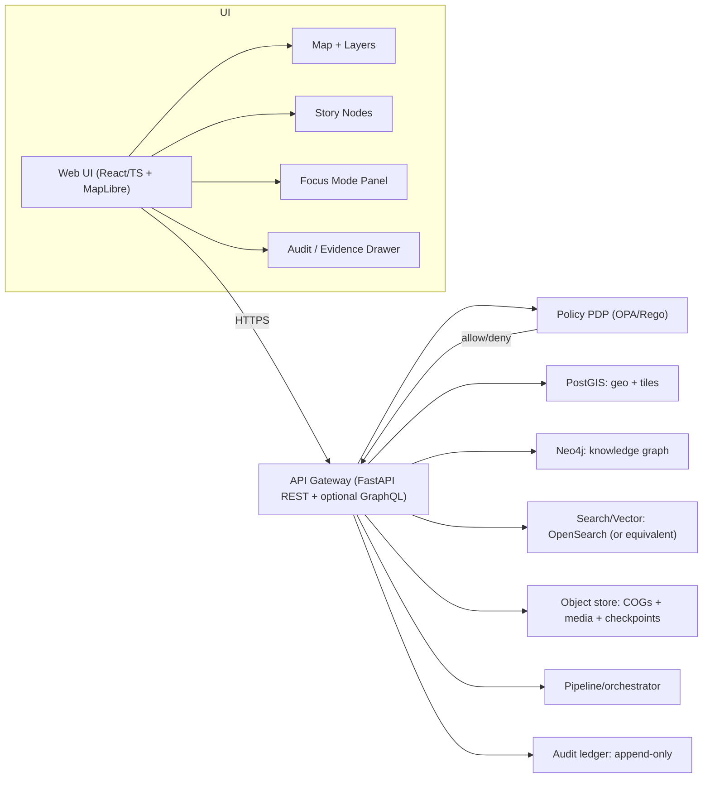

<!--
GOVERNED ARTIFACT NOTICE
This README is part of the KFM trust boundary: it communicates non-negotiable invariants.
If you change meaning (not just phrasing), route through the governance review path.
-->

<div align="center">

# Kansas Frontier Matrix (KFM‑NG) — Governed Geospatial & Historical Knowledge System 🧭🗺️

**KFM turns heterogeneous Kansas history + geospatial data into a governed, evidence-first system:**  
**data → pipeline → catalogs/provenance → governed APIs → Focus Mode + map UI**

<br/>


<!-- OPTIONAL: replace ORG/REPO with real values once workflows exist -->
<!--
[](https://github.com/ORG/REPO/actions/workflows/ci.yml)
[](https://github.com/ORG/REPO/actions/workflows/docs.yml)
[](https://github.com/ORG/REPO/actions/workflows/policy.yml)
[](https://github.com/ORG/REPO/actions/workflows/data-gates.yml)
-->

</div>

> [!IMPORTANT]
> KFM‑NG is designed around a **trust membrane** (governed API + policy boundary).  
> **UI/external clients never talk to databases.** Policy evaluates **every** request and **fails closed**.  
> Focus Mode **must cite or abstain**. When in doubt: **deny**.

---

## If You’re New Here: Start Here

1) **Read the invariants** in [Non‑Negotiable Guarantees](#non-negotiable-guarantees).  
2) Run the stack via [Quickstart](#quickstart-local).  
3) Learn how we prevent “raw becomes truth” via [Data Lifecycle Raw → Work → Processed](#data-lifecycle-raw--work--processed).  
4) Learn how Focus Mode can’t bluff via [Focus Mode and Evidence Resolver](#focus-mode-and-evidence-resolver).  
5) If you’re adding a source: use [Adding or Updating a Dataset](#adding-or-updating-a-dataset).

---

## Table of Contents

- [If You’re New Here: Start Here](#if-youre-new-here-start-here)
- [Quickstart (Local)](#quickstart-local)
- [Why KFM Exists](#why-kfm-exists)
- [Non-Negotiable Guarantees](#non-negotiable-guarantees)
- [How KFM Works End-to-End](#how-kfm-works-end-to-end)
- [System Architecture](#system-architecture)
- [Governed API Surface (Overview)](#governed-api-surface-overview)
- [Focus Mode and Evidence Resolver](#focus-mode-and-evidence-resolver)
- [Data Lifecycle Raw → Work → Processed](#data-lifecycle-raw--work--processed)
- [Adding or Updating a Dataset](#adding-or-updating-a-dataset)
- [Governed Artifacts and CI Ownership](#governed-artifacts-and-ci-ownership)
- [Repository Structure](#repository-structure)
- [Local Development](#local-development)
- [CI Gates](#ci-gates)
- [Operations Runbook (Minimum)](#operations-runbook-minimum)
- [Roadmap](#roadmap)
- [Governance and Sensitivity](#governance-and-sensitivity)
- [Contributing](#contributing)
- [Security](#security)
- [License](#license)
- [Provenance Notes](#provenance-notes)

---

## Quickstart (Local)

> [!NOTE]
> This repo is built to be **stack-first**: bring up the trust membrane + stores + API + UI together so the
> governance paths are exercised end-to-end.

### Prerequisites

- Docker + Docker Compose (v2)
- A modern Node.js toolchain (for UI), and a Python toolchain (for API/pipeline) **as required by your implementation**
- Optional but common: `make`, `jq`, `opa`

### Bring up the stack (documented baseline)

```bash
cp .env.example .env
docker compose up --build
```

### What to open

- UI: `http://localhost:3000`
- API docs: `http://localhost:8000/docs`

### Smoke test (minimum)

- Load the map UI
- Toggle a layer (should show provenance metadata, not just “pretty tiles”)
- Open the Evidence/Audit drawer
- Run one Focus Mode query and confirm:
  - citations exist **or** the response abstains
  - `audit_ref` exists

> [!IMPORTANT]
> If OPA is down, policy fails to load, or required keys are missing, **the system must deny**.

---

## Why KFM Exists

Kansas history and geography live across **maps, archives, datasets, and narrative sources**. KFM‑NG unifies those sources into a **reproducible, inspectable, citation-first** system that supports:

- **Layered maps over time** (raster + vector; historical → modern)
- **Text-to-place linkage** (documents tied to locations + dates)
- **Governed AI** that must show its work (**citations + audit references**)
- **Public-facing exploration** (web map UI + Focus Mode + Story Nodes)

KFM‑NG is a **provenance-first geospatial knowledge hub**:

- Explore layers on an interactive map (with provenance + licensing surfaced).
- Read **Story Nodes** (governed narrative units) that synchronize map/time state.
- Ask **Focus Mode** (grounded Q&A) that returns **citations + an audit reference** — or **abstains**.

> [!IMPORTANT]
> If evidence cannot be resolved, the system must **abstain** rather than guess.

---

## Non-Negotiable Guarantees

These are the invariants the system must keep true **regardless of implementation details**.

| Invariant | What it means | Why it exists | Minimum enforcement |
|---|---|---|---|
| **Trust membrane** | UI/external clients never access databases directly; all access goes through **governed API + policy boundary** | Prevents bypassing governance, provenance, sensitivity rules | Network isolation + gateway middleware + architecture lint rules |
| **Fail-closed policy** | If policy cannot prove a request is allowed, **deny** | Safer-than-sorry for sensitive/uncertain cases | OPA default deny + policy tests |
| **Dataset promotion gates** | Only promoted datasets can serve production queries | Stops “raw/unvalidated” artifacts from becoming “truth” | CI checksums + catalog validation + steward review |
| **Focus Mode must cite or abstain** | Every answer returns citations + an **audit reference** (or abstains) | Prevents ungrounded claims; supports audits | Output validator + policy rule + audit append |
| **Processed zone is source of truth** | API serves only validated artifacts (never raw/work) | Avoids serving intermediates | Serve from processed catalogs only |

### Definition of Done ✅ (top-level)

- [ ] Datasets ingest via **raw → work → processed** promotion with **STAC/DCAT/PROV** artifacts
- [ ] Web UI browses layers + Story Nodes (with provenance visible)
- [ ] Focus Mode returns **citations or abstains**, and always includes `audit_ref`
- [ ] Policy **fails closed** and is unit-tested
- [ ] Governed docs/data/stories/policies/contracts pass CI validation

---

## How KFM Works End-to-End

```mermaid
flowchart LR
  A[External Sources<br/>maps • records • APIs • archives] --> B[Ingest + Normalize<br/>fetch • convert • reproject • parse]
  B --> C[data/raw<br/>immutable inputs + checksums]
  C --> D[data/work<br/>intermediate + QA reports]
  D -->|promotion gate| E[data/processed<br/>serving truth]
  E --> F[Catalogs<br/>STAC + DCAT + PROV]
  F --> G[Governed APIs<br/>data • tiles • search • evidence • Focus Mode]
  G --> H[UI + Story Nodes + Focus Mode<br/>map • timeline • narrative]
  G --> I[Audit Ledger<br/>append-only<br/>policy + outputs]
```



---

## System Architecture

### Clean layers + trust membrane

KFM‑NG follows strict boundaries:

- **Domain layer:** pure entities + invariants (no DB/UI deps)
- **Use case/service layer:** workflows + business rules; depends only on interfaces
- **Interfaces/integration layer:** ports/contracts + DTOs + schemas; API boundaries live here
- **Infrastructure layer:** PostGIS/Postgres, graph DB, search, object storage, runtime hosts

> [!IMPORTANT]
> Trust membrane rule (non-negotiable):  
> **Frontend/external clients never access databases directly.**  
> **Core backend logic never bypasses repository interfaces to talk directly to storage.**

### Trust membrane + runtime components (container view)



### Key runtime flow: Focus Mode query


---

## Governed API Surface (Overview)

> [!NOTE]
> Only some endpoints may be implemented at any given time. Treat this as an **API map**; lock details
> into OpenAPI/GraphQL contracts before enforcing in CI.

**Core principles:**
- Every endpoint is authorized by policy (default deny).
- Every response is attributable to promoted artifacts (processed + catalogs).
- “Evidence resolution” is a first-class API capability.

### Endpoint families (recommended)

| Family | Example endpoints | Purpose |
|---|---|---|
| **Health** | `GET /healthz` | readiness + connectivity checks |
| **Catalogs** | `GET /api/v1/catalog/dcat/...`, `GET /api/v1/catalog/stac/...`, `GET /api/v1/catalog/prov/...` | machine-readable discovery + lineage |
| **Data/tiles** | `GET /api/v1/layers/...`, `GET /api/v1/tiles/{z}/{x}/{y}` | map rendering + layer metadata |
| **Stories** | `GET /api/v1/stories/{story_id}` | governed narrative playback |
| **Evidence** | `GET /api/v1/evidence/resolve?ref=prov://...` | resolves `prov://`, `stac://`, `dcat://`, `doc://`, `graph://` |
| **Focus Mode** | `POST /api/v1/ai/query` | grounded Q&A with citations + audit |

---

## Focus Mode and Evidence Resolver

### Contract fragment (documented)

`POST /api/v1/ai/query`  
**Request:** `FocusQuery { question, context{ time_range, bbox, active_layers, story_node_id } }`  
**Response:** `FocusAnswer { answer_markdown, citations[], audit_ref }`

> [!IMPORTANT]
> Focus Mode cannot “just answer.” Every nontrivial claim must be traceable via citations — otherwise it **abstains**.

### Evidence reference schemes

Every `citation.ref` must be resolvable to a human-readable evidence view in a small number of API calls.

| Scheme | What it points to | Why it exists |
|---|---|---|
| `prov://` | Provenance record / activity / entity | Lineage + auditability |
| `stac://` | STAC collection/item/asset | Spatial/temporal asset trace |
| `dcat://` | DCAT dataset/distribution | Licensing + discovery |
| `doc://` | Document locator + span | Textual evidence anchors |
| `graph://` | Graph node/edge concept | Structured meaning + joins |

<details>
<summary><strong>Example: FocusQuery + FocusAnswer</strong> (illustrative)</summary>

```json
{
  "question": "What trend is visible in the selected region over time?",
  "context": {
    "time_range": ["1850-01-01T00:00:00Z", "1900-12-31T23:59:59Z"],
    "bbox": [-100, 37, -96, 39],
    "active_layers": ["layer_example_dataset"],
    "story_node_id": "story_example"
  }
}
```

```json
{
  "answer_markdown": "…answer with footnotes…",
  "citations": [
    {
      "id": "c1",
      "kind": "prov",
      "ref": "prov://activity/run_2026-02-12T...",
      "locator": "data/processed/example.parquet (sha256=...)"
    }
  ],
  "audit_ref": "audit://event/01J..."
}
```

</details>

### Policy-as-code: default deny + cite-or-abstain

```rego
package kfm.ai

default allow := false

allow if {
  input.answer.has_citations == true
  input.answer.sensitivity_ok == true
}
```

### Required abstention behavior

If evidence is insufficient for the current view (time/bbox/layers), Focus Mode must return an abstain response with an audit reference.

```json
{
  "answer_markdown": "I can't answer that from the verified KFM sources available for this view. Try narrowing the time range or selecting relevant layers.",
  "citations": [],
  "audit_ref": "audit://event/01J..."
}
```

---

## Data Lifecycle Raw → Work → Processed

KFM‑NG organizes data into zones with **promotion gates** (CI + steward review):


### Promotion Gate Checklist (CI-enforced)

To promote anything to **processed/public**, require:

- [ ] License present
- [ ] Sensitivity classification present
- [ ] Schema + geospatial checks pass
- [ ] Checksums computed
- [ ] **STAC/DCAT/PROV** artifacts exist **and validate**
- [ ] Audit event recorded
- [ ] Human approval if sensitive

### Minimum Artifacts (recommended)

| Artifact | Purpose | Typical location (recommended) |
|---|---|---|
| `manifest.yml` | Deterministic acquisition + expected checksums | `data/raw/<dataset_id>/manifest.yml` |
| `run_record.json` | Captures inputs/outputs/code hash | `data/work/<dataset_id>/run_record.json` |
| `validation_report.json` | Gate report (what passed/failed) | `data/work/<dataset_id>/validation_report.json` |
| DCAT JSON | Dataset discovery + distributions | `data/catalog/dcat/<dataset_id>.json` |
| STAC Collection/Items | Geospatial assets + extent | `data/catalog/stac/<dataset_id>/...` |
| PROV record | Provenance lineage + agents/activities | `data/catalog/prov/<dataset_id>/...` |

---

## Adding or Updating a Dataset

> [!IMPORTANT]
> “Data added” is not “data served.” Only **processed + cataloged + policy-labeled** datasets can be served.

### The integration workflow (raw → work → processed)

1) **Discover**: endpoints, auth, rate limits, update cadence  
2) **Acquire**: incremental when possible; otherwise snapshot+diff  
3) **Normalize**: canonical encodings (UTF‑8), geometry (WGS84), time (ISO 8601)  
4) **Validate**: schema, geometry validity, timestamp sanity, license/policy checks  
5) **Enrich**: derive join keys (GeoIDs), place/time normalization, entity resolution candidates  
6) **Publish**: promote to processed, emit catalogs (DCAT/STAC/PROV), trigger index refresh

### Dataset integration “Definition of Done” (minimum)

- [ ] Connector implemented and registered in the source registry
- [ ] Raw acquisition produces deterministic manifest + checksums
- [ ] Normalization emits canonical schema and/or STAC assets
- [ ] Validation gates implemented and enforced in CI
- [ ] Policy labels defined; restricted fields/locations are redacted per rules
- [ ] Catalogs emitted (DCAT always; STAC/PROV as applicable) and link-check clean
- [ ] API contract tests pass for at least one representative query
- [ ] Backfill strategy documented (historical ranges and expected runtime)

### Secret handling (non-negotiable)

- Credentials/API keys live in a secret manager (vault/KMS) in real environments.
- Secrets are **never committed**.
- Local `.env` is for local-only convenience.

---

## Governed Artifacts and CI Ownership

Treat these as “production inputs” (changes require review and validation).

| Artifact type | What it controls | Typical path | CI checks (minimum) |
|---|---|---|---|
| **Policies** | authorization + redaction + cite-or-abstain | `policy/` | `opa test` + regression suite |
| **Catalogs** | what can be served + how it’s cited | `data/catalog/` | JSON schema + link-check + checksums |
| **Processed data** | queryable “truth” | `data/processed/` | checksums + invariants + drift checks |
| **Story Nodes** | governed narrative state machine | `docs/story-nodes/` | template validator + citation resolution |
| **API contracts** | public surface | `docs/contracts/` | OpenAPI/JSON Schema lint + contract tests |
| **Runbooks** | ops invariants | `docs/runbooks/` | link-check + required sections |

---

## Repository Structure

This README assumes a layout that supports governance + CI gates. Adjust names, keep the intent.

> [!IMPORTANT]
> Canonical top-level paths emphasized in the blueprint: `data/`, `docs/`, `src/`, `web/`, `policy/`, `.github/`.

### Suggested layout (heavier, CI-friendly, reviewable)

```text
.
├── .github/
│   ├── workflows/
│   │   ├── ci.yml
│   │   ├── docs.yml
│   │   ├── policy.yml
│   │   └── data-gates.yml
│   ├── ISSUE_TEMPLATE/
│   └── PULL_REQUEST_TEMPLATE.md
├── docs/
│   ├── adr/                   # architecture decisions
│   ├── architecture/          # diagrams + C4 + clean layers writeups
│   ├── contracts/             # OpenAPI/JSONSchema/GraphQL (if used)
│   ├── governance/            # sensitivity, FAIR/CARE, review rules
│   ├── runbooks/              # ops SOPs + incident response
│   └── story-nodes/
│       ├── templates/         # Story Node v3 canonical template
│       ├── drafts/
│       └── published/
├── policy/
│   ├── rego/                  # OPA policies
│   ├── bundles/               # versioned policy bundles (optional)
│   ├── tests/                 # opa test suites + regression cases
│   └── schemas/               # policy input/output JSON schemas
├── data/
│   ├── raw/                   # immutable source drops + manifests + checksums
│   ├── work/                  # run records + validation reports + QA outputs
│   ├── processed/             # publishable, query-ready artifacts
│   └── catalog/
│       ├── dcat/
│       ├── stac/
│       └── prov/
├── pipelines/
│   ├── connectors/            # per-source ingestion connectors
│   ├── transforms/            # normalization/enrichment jobs
│   ├── validators/            # schema/geo/time/license/sensitivity checks
│   └── orchestration/         # scheduling/backfills (Airflow/Prefect/etc)
├── src/
│   ├── api/                   # API gateway app (FastAPI)
│   ├── services/              # clean-layer service modules (optional)
│   ├── shared/                # shared domain/types/utilities
│   └── tests/                 # unit/integration/contract tests
├── web/
│   ├── app/                   # React UI
│   ├── components/
│   ├── routes/
│   └── tests/
├── infra/
│   ├── docker/                # compose baseline + dockerfiles
│   ├── k8s/                   # manifests/helm (if used)
│   ├── openshift/             # GitOps overlays (if used)
│   └── terraform/             # IaC (if used)
├── scripts/
└── Makefile
```

### Clean-architecture service skeleton (recommended)

If a module is a “service” (Focus Mode, Catalog, Evidence, etc.), keep clean layers:

```text
src/services/focus-mode/
├── domain/
├── usecases/
├── integration/       # ports/contracts + DTOs + schemas
├── infrastructure/    # adapters (DB/search), HTTP handlers, OPA adapter
└── tests/
```

> [!WARNING]
> Any adapter that allows “UI → DB direct” access is a design break and should be treated as a **release blocker**.

---

## Local Development

### Typical workflow

```bash
# Bring up stack
docker compose up -d --build

# Watch logs
docker compose logs -f

# Tear down
docker compose down
```

### Compose baseline (illustrative)

```yaml
services:
  api:
    build: ./src
    ports: ["8000:8000"]
    depends_on: [postgis, neo4j, opensearch, opa]
  web:
    build: ./web
    ports: ["3000:3000"]
    depends_on: [api]
  postgis:
    image: postgis/postgis:16-3.4
    ports: ["5432:5432"]
  neo4j:
    image: neo4j:5
    ports: ["7474:7474", "7687:7687"]
  opensearch:
    image: opensearchproject/opensearch:2
    ports: ["9200:9200"]
  opa:
    image: openpolicyagent/opa:latest
    ports: ["8181:8181"]
```

### Troubleshooting checklist

- Port conflicts (Postgres, Neo4j, API/UI) → adjust Compose mappings
- Volumes/permissions (especially on macOS/Windows) → ensure mounted dirs writable
- Rebuild after dependency changes → `docker compose up -d --build`

---

## CI Gates

Recommended minimal CI hardening includes:

- [ ] **Docs:** lint + link-check + template validator
- [ ] **Stories:** Story Node v3 validator + citation resolution
- [ ] **Data:** STAC/DCAT/PROV validation + checksums + drift checks
- [ ] **Policy:** `opa test` (default deny, cite-or-abstain, regression suite)
- [ ] **Supply chain:** SBOM (SPDX) + provenance attestation (SLSA/in-toto)

<details>
<summary><strong>Recommended CI philosophy</strong></summary>

- Fail fast on policy violations (default deny).
- Treat data/catalog validation as “tests,” not “best effort.”
- Require proofs (checksums + provenance) before serving new datasets.
- Include regression tests for prior leakage bugs (“this must never happen again”).

</details>

---

## Operations Runbook (Minimum)

> [!IMPORTANT]
> Production readiness requires operational discipline. The system is “safe by design” only if policy + audit + backups are real.

### Start/stop and health checks

- Start: deploy **web/api/opa first**, then stores, then pipeline workers.
- Health endpoints:
  - API: `/healthz`
  - OPA: policy loaded check
  - Stores: readiness checks for connectivity
- Smoke tests:
  - load home map, toggle a layer, open provenance panel, run one Focus Mode query

### Backup and restore

- PostGIS backups daily; retain per policy; verify restores regularly.
- Object store versioning on; immutable retention for catalogs and audit checkpoints.
- Neo4j backup schedule aligned with graph rebuild strategy (graph is rebuildable from canonical catalogs).
- Audit ledger checkpoints: verify hash chain after restore.

### Incident response (minimum patterns)

- Data leak:
  - deny via policy toggle (emergency switch)
  - rotate credentials
  - withdraw affected artifacts
  - publish redacted derivative with separate provenance chain
- AI unsafe output:
  - disable `/ai/query` via policy (no redeploy required)
  - preserve audit logs
  - fix policy/validator/prompt
  - add regression test
- Corrupted processed artifacts:
  - verify checksums
  - rollback to previous dataset version
  - rebuild indexes

### Emergency deny switch (required)

Maintain a policy-controlled kill switch that can disable public endpoints and Focus Mode without deploying code.

---

## Roadmap

Convert core requirements into a tracked backlog:

| Epic | Deliverables | Acceptance criteria |
|---|---|---|
| **E1 Governance + CI** | Story validator, catalog validator, policy tests, SBOM+provenance | PR fails if governed artifacts invalid; release gates enforced |
| **E2 Data pipeline** | Run records, validators, promotion gate, catalog generators | Processed datasets always have STAC/DCAT/PROV + checksums |
| **E3 Evidence resolver** | Evidence endpoints + UI evidence views | All citation refs resolvable; evidence view shows locator/snippet |
| **E4 Focus Mode** | Retrieval pipeline + audit ledger + evaluation harness | Cite-or-abstain enforced; audit_ref always present; regression passes |
| **E5 UI narrative engine** | Story viewer + view state sync + provenance drawer | Playback deterministic; citations visible; provenance accessible |
| **E6 Productionization** | K8s manifests + observability + runbook | SLO dashboards; backups tested; incident drills completed |

---

## Governance and Sensitivity

KFM governance explicitly incorporates **FAIR + CARE** considerations.

### Sensitivity handling pattern (required)

If a dataset includes sensitive locations or culturally restricted knowledge:

- Publish a **generalized derivative** for general audiences
- Store precise data under **restricted access**
- Maintain **separate provenance chains** documenting redaction/generalization

> [!IMPORTANT]
> When in doubt, route through governance review and **deny by default** for public audiences.

---

## Contributing

We welcome contributions—**with provenance**.

### Pull request checklist ✅

- [ ] I did **not** introduce UI → DB direct access
- [ ] I updated/added **tests appropriate to the layer**
- [ ] If I changed governed artifacts (stories/data/policies/contracts), CI validators pass
- [ ] I added/updated provenance/citations where required
- [ ] I documented the decision (ADR) if this changes architecture/contracts

### ADRs (recommended)

Use ADRs to keep decisions reviewable and auditable:

- Status: Proposed \| Accepted \| Deprecated
- Context → Decision → Alternatives → Consequences → Verification

---

## Security

- **Policy-as-code (OPA):** default deny; output validation for Focus Mode
- **Audit ledger:** append-only; checkpointed with checksums (tamper-evident)
- **Supply chain:** SBOM + provenance attestations as CI gates

> [!NOTE]
> Security is a system property: trust membrane + policy + provenance are enforced together.

---

## License

**TBD** (add SPDX identifier once chosen).

---

## Provenance Notes

- This README treats some items as **recommended / proposed / illustrative** where repo-specific details may vary.
- If you need to “lock” a detail into CI enforcement, first verify it against canonical contracts and governed docs before making it a release gate.

<div align="center">

**KFM Principle:** *If it can’t be traced, it can’t be trusted.* 🔎

</div>
