<div align="center">

# 🌾 Kansas-Frontier-Matrix  
### **Time · Terrain · History** — *A mission-grade, open-source, spatiotemporal knowledge hub for Kansas*

[](./.github/workflows/site.yml)  
[](https://bartytime4life.github.io/Kansas-Frontier-Matrix/)  
[](./.github/workflows/stac-validate.yml)  
[](./.github/workflows/codeql.yml)  
[](./.github/workflows/trivy.yml)  
[](./docs/)  
[%20%7C%20CC--BY%20(data)-blue)](./LICENSE)

**A living atlas of Kansas** that fuses historical documents, maps, climate & hazard data  
into a **timeline + map** you can explore, query, and extend.  
Built for **reproducibility, provenance, and open science**.

</div>

---

## 🔭 What is this?

Kansas Frontier Matrix (KFM) ingests **scans, rasters, vectors, and texts**,  
enriches them with **AI / NLP**, links them in a **knowledge graph**,  
and serves them via an **interactive React + MapLibre web app** (timeline + map).  

Under the hood: **ETL pipelines (Python / Make)**, a **STAC catalog**, **Neo4j** (aligned to CIDOC-CRM + OWL-Time),  
and **FastAPI / GraphQL** for access.

---

## 🧭 Quickstart

```bash
# 0) prerequisites
# - Docker / Docker Compose
# - Python 3.11+, Node 18+, git-lfs (optional), make

# 1) clone
git clone https://github.com/bartytime4life/Kansas-Frontier-Matrix.git
cd Kansas-Frontier-Matrix

# 2) bootstrap (build containers, install deps)
make bootstrap

# 3) fetch & process data (sources → COG/GeoJSON → STAC)
make data
make stac
make checksums

# 4) run the stack
docker compose up -d        # api + db + tiles + web
make serve-web              # dev server for React app

# 5) open the viewer
# → http://localhost:5173
````

> All ETL steps are **scripted & reproducible** with **checksums + schema validation** baked into CI.

---

## 🗂️ Repository layout (monorepo)

```
Kansas-Frontier-Matrix/
├─ src/          # ETL, AI/NLP, graph code (Python)
├─ web/          # React app (MapLibre timeline + UI)
├─ data/
│  ├─ sources/   # JSON descriptors (external dataset pointers)
│  ├─ raw/       # fetched artifacts (DVC/LFS pointers)
│  ├─ processed/ # COGs, GeoJSON, CSV; derived outputs
│  └─ stac/      # STAC collections/items/assets (JSON)
├─ docs/         # MCP docs: SOPs, experiments, model cards, architecture
├─ tools/        # utilities (importers, georef scripts, etc.)
├─ tests/        # CI tests for ETL/NLP/graph/web
└─ .github/      # workflows, issue/PR templates
```

**Why this structure?** → Atomic updates across **code / data / docs**, single **STAC**, and full **MCP** reproducibility.

---

## 🏗 Architecture (end-to-end)

```mermaid
flowchart TD
  A["Sources (scans · rasters · vectors · documents)"] --> B["ETL Pipeline (Make · Python · checksums)"]
  B --> C["Processed Layers (COGs · GeoJSON)"]
  B --> I["AI/ML Enrichment (NER · geocoding · linking)"]
  C --> D["STAC Catalog (collections · items · assets)"]
  D --> E["Config Build (app.config.json · layers.json)"]
  D --> H["Knowledge Graph (Neo4j · CIDOC CRM · OWL-Time)"]
  I --> H
  H --> J["API Layer (FastAPI · GraphQL)"]
  D --> J
  J --> F["Frontend (React + MapLibreGL) timeline · search · filters"]
  E --> F
  E --> G["Google Earth Exports (KML · KMZ)"]
%% END OF MERMAID
```



---

## 🗃 Data catalog & formats

* **`data/sources/*.json`** — catalog pointers (URL + license + bbox + time).
* **Processed outputs:** **COG GeoTIFF** (rasters) + **GeoJSON** (vectors).
* **STAC** under `data/stac/` indexes all layers with spatial / temporal / provenance metadata.

> 🧭 *Tip:* Reproject historic NAD27/NAD83 data to **EPSG:4326** (WGS84) and convert MrSID → COG with overviews.

---

## 📚 Featured layers

**Basemaps & terrain**

* Kansas LiDAR / 1 m DEM hillshade, slope, aspect.
* Historic USGS topo quads (1890s–1950s, georeferenced).

**Hydrology & land cover**

* Rivers, wetlands, reservoirs, NLCD, prairie reconstruction.

**Soils & geology**

* SSURGO soils, surface geology, aquifers, mining / oil fields.

**Boundaries & routes**

* Treaty / reservation boundaries, county formation, trails, railroads, forts / towns.

**Climate & hazards**

* NOAA GHCN-Daily, Daymet, U.S. Climate Normals, Storm Events, SPC Tornado Tracks, FEMA Disasters.

**Cultural & textual overlays**

* Kansas Memory (KSHS), Chronicling America — OCR’d texts → NER-extracted People / Places / Events.

---

## 🤖 AI / ML Enrichment & Knowledge Graph

* **NLP:** spaCy + Transformers → extract **dates / places / people / events**; geocode via GNIS.
* **Entity Linking:** fuzzy / context scoring to consolidate mentions; stored in **Neo4j** with confidence scores.
* **Semantics:** align to **CIDOC-CRM** (cultural heritage) + **OWL-Time** (temporal logic).
* **Rules & Inference:** symbolic patterns infer implicit facts & track uncertainty.

---

## 🖥 Web UI (React + MapLibre + Canvas)

* **Map:** GPU-accelerated vector/raster rendering, layer toggles, legends.
* **Timeline:** fast Canvas-based zoom / pan filtering.
* **Details Panel:** AI summaries, citations, and cross-linked entities.
* **Accessibility:** WAI-ARIA roles, keyboard navigation, responsive layout.

---

## 🧪 Reproducibility & MCP

* **Docs-first:** every pipeline or experiment logs hypotheses → methods → results.
* **Validation:** STAC + JSON Schema in CI; all outputs have SHA-256 checksums.
* **Data provenance:** DVC / LFS pointers keep raw data external but fully traceable.

---

## 🛠 Common Make Targets

| Command          | Description                                            |
| :--------------- | :----------------------------------------------------- |
| `make data`      | Fetch + process declared sources (COG/GeoJSON + STAC). |
| `make stac`      | Build / validate STAC catalog; emit report.            |
| `make serve-web` | Launch React app with hot-reload.                      |
| `make checksums` | Generate / verify SHA-256 sidecars.                    |

---

## 🤝 Contributing

We welcome historians, GIS professionals, developers, and students.

Start with:

* *Good first issues* (`help-wanted` label)
* *Data additions* → add `data/sources/*.json` + README + license
* *Experiments* → PR under `docs/experiments/EXP-…md` using the provided template

> All contributions must include **provenance** (source + license + method) and **validation artifacts**.

---

## 🧩 Roadmap Highlights

* 🌲 Paleoclimate & proxies: tree-rings, pollen cores, fire regimes.
* 🔮 Predictive layers: ML for settlement corridors + hazard scenarios.
* 🤝 Tribal treaties UX: oral histories and co-curated narratives.

---

## 🔗 Upstream Data Portals (Curated)

KDOT & Kansas GIS Hub • USGS Topo & NWIS • UT PCL Maps • FEMA MSC • Drought Monitor • KGS Geology & Water • NOAA Storm Events • SPC Tornado Tracks
*(See `docs/` for the full catalog & usage notes.)*

---

## 📄 Citation & License

| Component               | License                                        |
| :---------------------- | :--------------------------------------------- |
| **Code**                | MIT                                            |
| **Docs / Derived Data** | CC-BY 4.0 (cite this repo + original sources)  |
| **Source Data**         | Original licenses per dataset (see STAC Items) |

When citing, reference **Kansas-Frontier-Matrix** and specific **STAC Items** used.

---

## 📨 Contact

Open a discussion under **GitHub › Discussions**, or file an issue with the `question` label.
Let’s stitch Kansas’s fragmented history into a shared, auditable, and beautiful whole.

---

<sub>Frontend Canvas / HTML5 / CSS implementation follows standard accessibility & performance guidelines.</sub>

---

Once your **`site.yml`** workflow deploys successfully, the **Pages Deploy** badge above turns green —
linking directly to the public site:
👉 [https://bartytime4life.github.io/Kansas-Frontier-Matrix/](https://bartytime4life.github.io/Kansas-Frontier-Matrix/)
